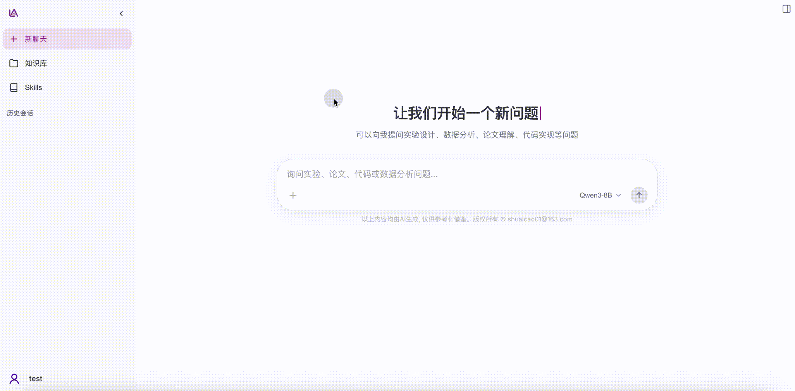
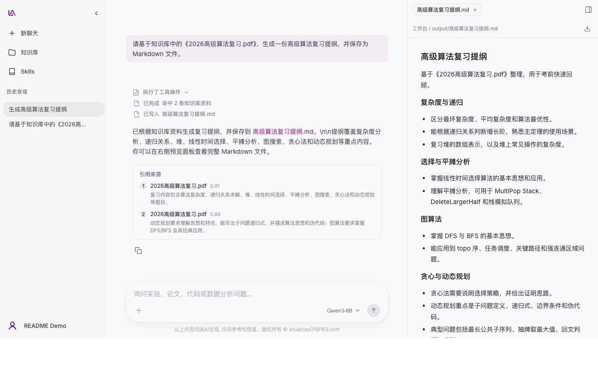

# LabAgent

LabAgent 是一个面向教学实验的 Agentic RAG 平台，围绕课程知识问答、实验指导、代码排查、知识库检索与工具安全控制提供完整教学实验辅助能力。






## 核心能力

- **Agentic RAG 与三级检索**：由 Agent 自主检索课程知识库，结合多级召回、重排和来源引用生成可信回答。
- **RAGAS 评测闭环**：内置 RAG 评测流程，支持用指标结果持续观察召回、回答相关性和忠实度。
- **Skills 扩展**：按 Agent Skills 规范加载本地 Markdown Skills，支持斜杠选择、渐进披露、运行内激活和安全读取参考资源。
- **Agent Memory**：支持会话上下文自动压缩和斜杠主动压缩、用户可编辑 `AGENTS.md`，以及可开关、自动沉淀的简洁 `USER_PROFILE.md` 长期记忆。
- **多模型接入**：支持 Ollama 本地模型、OpenAI 兼容接口和自定义模型配置。
- **多模态对话**：支持选择或粘贴 JPEG、PNG、WebP 图片，并将文本与图片交给视觉模型分析。
- **沙箱隔离与工具安全**：支持受控文件工具和 Shell 工具，高风险操作需用户确认。
- **完整应用体验**：包含用户认证、会话管理、流式输出、知识库管理和响应式 Web 界面。

## 技术栈

FastAPI · LangGraph · Vue 3 · PostgreSQL + pgvector · Redis + ARQ · MinIO · Docker Compose

## 快速开始

环境要求：Python 3.12、Node.js 20.19+、Docker 和 [uv](https://docs.astral.sh/uv/)。

### Docker 部署

```bash
cp .env.example .env
docker compose up -d --build
```


### 本地开发

1. 准备配置并启动 PostgreSQL、Redis 与 MinIO：

```bash
cp .env.example .env
docker compose up -d postgres redis minio
```

2. 启动后端：

```bash
cd backend
uv sync
uv run alembic upgrade head
uv run uvicorn app.main:app --host 0.0.0.0 --port 8989 --reload
```

3. 新开终端并启动知识库上传 Worker：

```bash
cd backend
uv run arq app.workers.kb_upload_worker.WorkerSettings
```

4. 新开终端并启动前端：

```bash
cd frontend
npm install
npm run dev
```

根据终端提示访问前端页面，API 文档位于 `http://localhost:8989/docs`。

## 配置

完整配置见 [.env.example](.env.example)。部署前至少需要确认模型配置，并替换 `JWT_SECRET_KEY` 等默认敏感值。

## 文档

- [文档导航](docs/README.md)
- [产品与架构](docs/功能介绍/产品与架构.md)
- [核心功能](docs/功能介绍/核心功能.md)
- [技术实现](docs/README.md#技术实现)
- [未来优化](docs/未来优化/优化路线.md)
