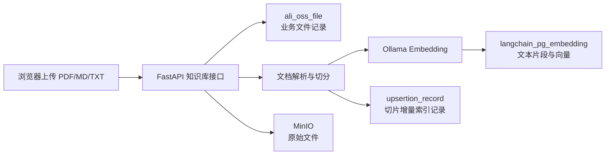
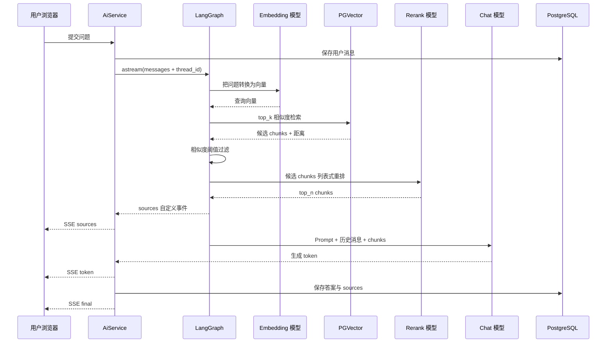
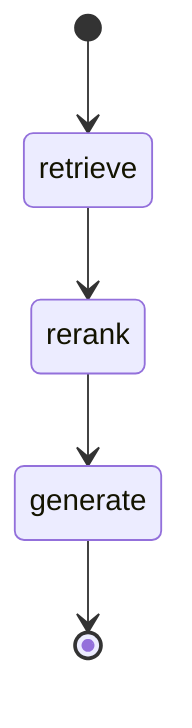

<!--
 @author: caoshuai.cs
 @date: 2026-07-14
 @description: 面向初学者的 LabAgent RAG 当前实现说明，讲解从文件上传、解析切分、向量索引到召回、重排、生成、引用持久化的完整链路
-->

# LabAgent RAG 全流程实现与理解

> 本文面向第一次接触 Python、FastAPI、LangChain、LangGraph 和向量数据库的开发者。
> 内容以 **2026-07-14 当前代码实际实现** 为准，重点回答一个问题：一份教学资料从上传开始，如何最终变成回答中的参考内容和引用来源。
>
> [03-RAG闭环设计.md](./03-RAG闭环设计.md) 是前期设计文档；本文是落地后的代码导读，两者定位不同。

## 一、先用一句话理解 RAG

RAG 是 Retrieval-Augmented Generation 的缩写，中文通常叫“检索增强生成”。

它不是重新训练大模型，而是在每次提问时：

1. 从自己的知识库中找出与问题最相关的文本片段。
2. 把这些片段和用户问题一起交给大模型。
3. 让大模型优先依据这些片段回答。

可以把它理解成一次“开卷考试”：

- 大模型是答题者。
- 知识库是教材。
- 向量检索负责快速翻到可能相关的页。
- rerank 负责从候选页中再次挑选最相关的内容。
- LangGraph 负责规定先检索、再重排、最后回答的执行顺序。

## 二、先认识项目中的核心概念

如果你有 Java/Spring 开发经验，可以先用下面的对应关系建立直觉。

| LabAgent 中的概念 | 作用 | 可以类比为 |
| --- | --- | --- |
| FastAPI Router | 接收 HTTP 请求、校验登录身份、调用 Service | Spring Controller |
| Service | 编排业务流程 | Spring Service |
| Repository | 访问业务数据库表 | Mapper/DAO/Repository |
| SQLAlchemy ORM | Python 对象与数据库表的映射 | JPA/MyBatis-Plus 实体能力 |
| Pydantic Model | 请求参数、响应结构和类型校验 | Java DTO/VO + 参数校验 |
| LangChain `Document` | 一段文本及其 metadata | 带扩展属性的文本对象 |
| chunk | 从原文切出来的一小段文本 | 文档片段 |
| embedding | 把文字转换为一组浮点数 | 文本的数学特征 |
| vector | embedding 产生的数字数组 | 文本在语义空间中的坐标 |
| PGVector | 在 PostgreSQL 中保存和检索向量 | 支持语义查询的向量数据库 |
| rerank | 对粗召回候选再次排序 | 二次精排 |
| LangGraph State | 一次图执行中流转的数据 | 工作流上下文 |
| LangGraph Node | 图中的一个处理步骤 | 工作流节点 |
| checkpointer | 保存 LangGraph 对话状态 | 框架托管的会话记忆 |
| SSE | 服务端持续向浏览器推送事件 | HTTP 长连接流式返回 |

### 2.1 LangChain 和 LangGraph 的分工

这两个名字容易混淆，可以这样记：

- **LangChain 提供能力零件**：文档加载器、文本切分器、Embedding、PGVector、rerank、Prompt、模型调用等。
- **LangGraph 负责把零件编排成流程**：规定 `retrieve → rerank → generate` 的先后关系，并管理会话状态和流式事件。

本项目没有手写检索循环，而是让框架分别负责擅长的部分。

## 三、全局架构：一份资料会存到哪里

一份上传的文件不会只保存一份数据，而是形成几种不同用途的数据。



各存储的职责如下。

| 存储位置 | 保存内容 | 主要用途 |
| --- | --- | --- |
| MinIO | 用户上传的原始 PDF/Markdown/TXT 字节 | 下载、保留原件、文件更新 |
| `ali_oss_file` | 文件 ID、文件名、MinIO URL、时间 | 知识库文件列表和业务管理 |
| `langchain_pg_collection` | PGVector collection 信息 | 区分不同向量集合 |
| `langchain_pg_embedding` | chunk 原文、1024 维向量、metadata | 语义相似度检索 |
| `upsertion_record` | chunk 指纹、来源 ID、更新时间 | 增量更新、跳过未变化切片 |
| `chat_session` | 业务会话 | 会话列表 |
| `chat_message` | 用户/助手消息、助手引用来源 | 页面刷新后的历史展示 |
| `checkpoints` 等表 | LangGraph 状态和消息记忆 | 多轮对话上下文恢复 |

需要特别理解：

- MinIO 保存的是“原件”。
- PGVector 保存的是“为检索准备的片段和向量”。
- 两者用途不同，不能互相替代。
- `chat_message` 和 LangGraph checkpoint 也是两套不同的持久化：前者服务于业务展示与审计，后者服务于图执行和模型记忆。

## 四、完整流程总览

整个 RAG 闭环可以分成两条主链路。

### 4.1 建库链路

```text
上传文件
  → 安全校验
  → 创建文件业务记录
  → 解析为 Document
  → 切分为 chunks
  → Embedding 向量化
  → 写入 PGVector
  → 写入增量索引记录
  → 上传原文件到 MinIO
  → 回填文件 URL
```

### 4.2 问答链路

```text
用户提问
  → 保存用户消息
  → 问题 Embedding
  → PGVector 粗召回 top_k
  → 相似度阈值过滤
  → LLM rerank 精排 top_n
  → 生成结构化引用来源
  → 把命中文档放入 Prompt
  → 大模型生成答案
  → SSE 流式返回
  → 保存答案和引用来源
```

## 五、建库链路：从上传文件到写入向量库

### 5.1 前端发起文件上传

前端把文件放入 `FormData`，调用：

```text
POST /api/v1/knowledge/file/upload
Content-Type: multipart/form-data
```

对应代码：

- [frontend/src/api/knowledge.js](../frontend/src/api/knowledge.js)
- [backend/app/api/v1/knowledge.py](../backend/app/api/v1/knowledge.py)

上传接口要求管理员身份，`AdminUser` 会在进入业务逻辑前完成身份与角色校验。普通用户不能上传、更新或删除知识库资料。

当前接口支持一次携带多个文件，后端按顺序逐个处理。

### 5.2 读取文件并做安全校验

Router 先通过 `UploadFile.read()` 读取文件字节，然后调用 `KnowledgeService.upload_file()`。

`_validate_upload()` 当前检查：

- 文件名不能为空。
- 文件必须带扩展名。
- 扩展名必须在白名单中。
- 文件大小不能超过配置上限。
- 保存前把文件名中的 `/` 和 `\` 替换为 `_`，避免把用户文件名当作路径使用。

当前默认配置：

```text
UPLOAD_MAX_SIZE_MB=100
UPLOAD_ALLOWED_EXTENSIONS=pdf,md,markdown,txt
```

对应代码：[backend/app/services/knowledge_service.py](../backend/app/services/knowledge_service.py)

### 5.3 先创建业务记录，获得稳定的 source_id

系统先向 `ali_oss_file` 表插入一条记录，此时 URL 暂为空。插入后数据库会生成 `kb_file.id`。

这个 ID 非常重要：

```text
source_id = str(kb_file.id)
```

后续每个 chunk 都会带上这个 `source_id`，表示它属于哪一份业务文档。

为什么不用文件名作为来源 ID？

- 文件可以重名。
- 文件可以改名。
- 数据库主键稳定且唯一。
- 更新和删除时，前端已经持有列表行的 `kb_file.id`。

文件名仍会保存在 metadata 的 `source` 中，主要用于给用户展示引用名称；真正维护文档归属使用 `source_id`。

### 5.4 把文件解析为 LangChain Document

文件进入 [backend/app/services/document_loader.py](../backend/app/services/document_loader.py)。

不同格式使用不同 Loader：

| 扩展名 | Loader | 说明 |
| --- | --- | --- |
| `.pdf` | `PyPDFLoader` | 通常按 PDF 页解析为多个 Document |
| `.md` / `.markdown` | `UnstructuredMarkdownLoader` | 解析 Markdown 文本结构 |
| `.txt` | `TextLoader` | 按 UTF-8 读取纯文本 |

这些 Loader 以文件路径作为输入，因此当前实现会：

1. 把上传字节写到临时文件。
2. 使用对应 Loader 读取。
3. 在 `finally` 中删除临时文件。
4. 给每个 `Document.metadata` 写入 `source=file_name`。

一个 `Document` 可以粗略理解为：

```python
Document(
    page_content="算法的时间复杂度用于描述……",
    metadata={
        "source": "2026高级算法复习.pdf",
        "page": 3,
    },
)
```

其中：

- `page_content` 是正文。
- `metadata` 是来源、页码等附加信息。

### 5.5 把 Document 切成 chunk

直接把整本 PDF 交给模型存在三个问题：

- 内容可能超过模型上下文长度。
- 检索粒度太粗，一整本书很难与一个问题准确匹配。
- 无关内容太多，会增加噪声和模型调用成本。

因此系统会在 [backend/app/services/document_splitter.py](../backend/app/services/document_splitter.py) 中把 Document 切成较小的 chunk。

当前有两种切分方式。

### 5.5.1 QA 文档专用切分

如果文档包含 `---` 分隔符和 `Q:` 问题前缀，系统把它识别为 QA 语料。

推荐格式：

```text
Q: 什么是时间复杂度？
A: 时间复杂度描述输入规模增长时，算法执行时间的增长趋势。

---

Q: 二分查找的时间复杂度是多少？
A: 在有序数组上是 O(log n)。
```

每个完整问答对生成一个 chunk：

```text
问题: 什么是时间复杂度？

答案: 时间复杂度描述输入规模增长时，算法执行时间的增长趋势。
```

这样做是为了避免问题和答案被切到两个不同片段中。

QA chunk 会额外带上：

```python
{
    "qa_index": 0,
    "question": "什么是时间复杂度？",
    "content_type": "qa_pair",
    "source": "算法QA.md",
}
```

### 5.5.2 普通文档 Token 切分

普通资料使用 `RecursiveCharacterTextSplitter.from_tiktoken_encoder()`。

当前默认参数：

```text
RAG_CHUNK_SIZE=512
RAG_CHUNK_OVERLAP=100
```

含义是：

- 每个 chunk 目标大小约 512 token。
- 相邻 chunk 重叠约 100 token。

重叠的作用是避免一个完整知识点刚好落在切分边界，前半句在上一个 chunk，后半句在下一个 chunk。

需要注意，token 不等于字符。它是模型分词后的计数单位，中文、英文和标点的换算关系并不固定。

### 5.6 Embedding：把文字转换为向量

切分之后，每个 chunk 仍然是文字。计算机要做“语义相似度检索”，需要先把文字转成向量。

当前项目使用：

```text
OLLAMA_EMBEDDING_MODEL=turingdance/gte-large-zh:latest
RAG_EMBEDDING_DIM=1024
```

模型由 [backend/app/services/model_provider.py](../backend/app/services/model_provider.py) 中的 `get_embedding_model()` 创建。

Embedding 的概念可以简化理解为：

```text
“二分查找的复杂度”
    ↓ Embedding 模型
[0.021, -0.184, 0.337, ..., 0.092]  共 1024 个数字
```

语义相近的文本，在向量空间中的位置通常也更接近。例如：

- “二分查找复杂度”
- “binary search 的时间复杂度”

即使没有完全相同的关键词，向量也可能比较接近。

必须保证下面三者一致：

```text
Embedding 模型实际输出维度
= RAG_EMBEDDING_DIM
= PGVector collection 的 vector 维度
```

当前数据库列是 `vector(1024)`。如果只换 Embedding 模型却没有同步处理维度和旧 collection，写入时会直接报错。

### 5.7 LangChain Indexing API 写入 PGVector

向量索引由 [backend/app/services/rag_store.py](../backend/app/services/rag_store.py) 负责。

系统初始化两个框架组件：

- `PGVector`：保存 chunk 文本、metadata 和 embedding。
- `SQLRecordManager`：记录 chunk 指纹和来源，用于增量更新与去重。

写入前，每个 chunk 会增加：

```python
doc.metadata["source_id"] = str(kb_file.id)
```

随后调用：

```python
index(
    documents,
    record_manager,
    vector_store,
    cleanup="incremental",
    source_id_key="source_id",
)
```

框架大致会做这些事情：

1. 根据 chunk 内容和 metadata 计算指纹。
2. 查询 `upsertion_record`，判断这个 chunk 是否已经存在且未变化。
3. 对新增或变化的 chunk 调用 Embedding 模型。
4. 把文本、向量、metadata 写入 `langchain_pg_embedding`。
5. 清理同一 `source_id` 下已经不存在的旧 chunk。
6. 未变化的 chunk 跳过重复 Embedding。

这就是“增量索引”：更新一份文档时，不需要重新向量化整个知识库。

### 5.8 上传原始文件到 MinIO

向量索引成功后，系统会生成随机对象名：

```text
lab-agent-rag/{uuid}.{扩展名}
```

然后通过 [backend/app/services/storage_service.py](../backend/app/services/storage_service.py) 上传到 MinIO，并把 URL 回填到 `ali_oss_file.url`。

随机对象名可以避免：

- 同名文件互相覆盖。
- 用户文件名直接成为对象路径。
- 文件名中的特殊字符造成路径问题。

### 5.9 上传失败时如何处理

当前上传主流程的处理思路是：

- 解析或切分失败：抛出业务异常，请求数据库事务回滚。
- 向量化失败：按 `source_id` 尝试清理可能已经写入的向量，然后抛出异常。
- MinIO 上传失败：清理已经写入的向量，然后抛出异常。
- 数据库事务由 FastAPI 的 `get_db()` 在异常时回滚。

这里要理解一个关键点：PostgreSQL、PGVector、RecordManager 和 MinIO 并不处于同一个分布式事务中，因此代码需要通过“反向补偿”尽量维持一致性。

## 六、问答链路：从用户问题到知识库召回

问答入口是：

```text
POST /api/v1/ai/react-agent
Accept: text/event-stream
```

虽然接口名称是 `react-agent`，当前底层执行的是 RAG 图：

```text
START → retrieve → rerank → generate → END
```

对应代码：

- [backend/app/api/v1/ai.py](../backend/app/api/v1/ai.py)
- [backend/app/services/ai_service.py](../backend/app/services/ai_service.py)
- [backend/app/graph/chat_graph.py](../backend/app/graph/chat_graph.py)

完整时序如下。



### 6.1 AiService 先保存用户消息

`AiService.stream_chat()` 首先：

1. 根据 `session_id` 获取或创建业务会话。
2. 向 `chat_message` 保存用户消息。
3. 提交数据库事务。
4. 通过 SSE 返回本次实际使用的 `session_id`。

用户 ID 从 JWT 当前身份中获取，不相信请求体里的 `user_id`。

### 6.2 thread_id：隔离每个用户的每个会话

调用 LangGraph 时使用：

```python
thread_id = f"{user_id}:{session_id}"
```

例如：

```text
15:757341e1-5ff1-4392-8b15-885ad7ada140
```

LangGraph checkpointer 根据 `thread_id` 保存和恢复 `MessagesState`，从而实现多轮对话记忆。

把 `user_id` 和 `session_id` 同时放入 `thread_id` 有两个作用：

- 不同用户之间隔离。
- 同一用户的不同会话之间隔离。

### 6.3 retrieve 节点：向量粗召回

`retrieve_node` 从 `MessagesState` 中找到最后一条 human 消息，把它作为当前检索问题。

随后 `rag_retrieval.retrieve()` 调用：

```python
similarity_search_with_score(query, k=settings.rag_top_k)
```

当前默认：

```text
RAG_TOP_K=20
```

这一步的目标不是直接选出最终答案材料，而是尽量多找一些可能相关的候选，因此叫“粗召回”。

查询问题也会用同一个 Embedding 模型转换为 1024 维向量，然后 PGVector 计算查询向量与各 chunk 向量之间的距离。

### 6.3.1 距离和相似度

当前代码按余弦距离处理结果：

```python
similarity = 1.0 - distance
```

可以简化理解为：

- 距离越小，文本越相近。
- 相似度越大，文本越相近。

当前默认阈值：

```text
RAG_SIMILARITY_THRESHOLD=0.5
```

低于阈值的候选会被过滤掉。

注意：前端引用区域展示的 `score` 是这里保存的**向量相似度**，不是 rerank 模型重新计算出的分数。

### 6.4 检索失败会降级，不一定阻断回答

`retrieve_node` 对检索异常做了捕获。例如：

- Ollama Embedding 服务不可用。
- PostgreSQL/PGVector 查询失败。
- Embedding 请求超时。

发生这些异常时，系统会记录：

```text
RAG 检索失败，降级为无参考资料继续对话
```

然后把 `documents` 设为空列表，继续进入生成节点。此时模型可以用通用知识回答，但系统提示词要求不确定时如实说明，不要编造。

因此，“对话有答案”不一定代表 RAG 检索成功，排查时还要看引用来源和后端日志。

### 6.5 rerank 节点：对候选进行精排

粗召回得到的 top 20 可能包含语义接近但不真正回答问题的片段，所以系统增加了 rerank。

当前使用 LangChain 的：

```python
LLMListwiseRerank
```

它会把用户问题和候选文档交给一个聊天大模型，让模型从整个候选列表的角度重新排序，再保留：

```text
RAG_RERANK_TOP_N=5
```

如果没有配置单独的 `RAG_RERANK_MODEL`，就复用默认聊天模型。

可以把两级检索理解为：

```text
PGVector：速度快，先从大量 chunk 中找 20 个候选
LLM rerank：成本更高，但理解能力更强，再选出 5 个
```

如果设置：

```text
RAG_RERANK_ENABLED=false
```

系统不会调用 LLM rerank，而是直接取粗召回结果的前 `top_n` 条。

与 retrieve 不同，当前 rerank 异常没有在图节点中单独降级处理；rerank 模型调用失败会进入 `AiService` 的整体流式异常处理，并向前端发送 `error` 事件。

### 6.6 生成结构化引用来源

rerank 完成后，系统把最终文档转成：

```json
{
  "file_name": "2026高级算法复习.pdf",
  "snippet": "算法的最坏复杂度、平均复杂度与最优性……",
  "score": 0.72
}
```

字段含义：

| 字段 | 含义 |
| --- | --- |
| `file_name` | `Document.metadata.source`，即上传时的文件名 |
| `snippet` | chunk 正文前 120 个字符 |
| `score` | 粗召回阶段的向量相似度，保留 4 位小数 |

LangGraph 的 rerank 节点通过 `get_stream_writer()` 发出 custom 事件，`AiService` 再把它包装成 SSE：

```json
{
  "event_type": "sources",
  "payload": {
    "sources": []
  }
}
```

前端收到后立即渲染“引用来源”面板。

### 6.7 generate 节点：把资料和问题交给大模型

生成节点先使用 `trim_messages()` 裁剪历史消息。

当前默认：

```text
MEMORY_MAX_MESSAGES=20
```

这里的 `token_counter=len` 实际按消息数量计数，因此当前含义是最多保留约 20 条消息，而不是 20 个真实 token。

Prompt 的核心结构是：

```text
系统角色与回答约束
+ 当前 rerank 后的参考资料 context
+ 当前会话最近的历史消息
+ 用户最新问题
```

系统提示词要求：

- 优先依据参考资料回答。
- 参考资料不足时可以使用通用知识。
- 无法确定时如实说明。
- 不要编造。

项目使用 `create_stuff_documents_chain()` 把 `Document` 列表放入 `{context}`，不手写字符串拼接循环。

“stuff”可以理解为：把最终选中的几个文档片段一起塞入本次模型上下文。当前 top_n 默认只有 5，因此适合这种方式。

### 6.8 SSE：答案为什么能逐字显示

`graph.astream()` 同时监听两种流模式：

```python
stream_mode=["messages", "custom"]
```

- `messages`：接收模型生成的 `AIMessageChunk`，用于逐步输出 token。
- `custom`：接收 rerank 节点主动发出的引用来源。

主要 SSE 事件如下：

| `event_type` | 作用 |
| --- | --- |
| `session` | 告知前端实际会话 ID |
| `sources` | 返回结构化引用来源 |
| `token` | 返回一段新增回答内容 |
| `error` | 本次生成失败 |
| `final` | 本次生成结束 |

前端使用 `fetch + ReadableStream` 读取 POST SSE，而不是 `EventSource`，因为 `EventSource` 原生只适合 GET 请求。

### 6.9 保存答案和引用，保证刷新后仍能显示

模型生成过程中，`AiService` 分别收集：

```text
full_response：完整回答文本
response_sources：引用来源数组
```

生成成功后，两者一起写入 `chat_message`：

```text
content = 完整回答
sources = JSONB 引用数组
```

前端刷新后会调用历史消息接口：

```text
POST /api/v1/ai/rag/history
```

历史响应中的 `sources` 会重新放回前端消息对象，所以引用来源不会再因为页面刷新而丢失。

修改前产生的历史消息没有保存 `sources`，这些旧消息无法自动恢复原来的引用。

## 七、LangGraph 图是如何工作的

图定义位于 [backend/app/graph/chat_graph.py](../backend/app/graph/chat_graph.py)。



状态类型是：

```python
class RagState(MessagesState):
    documents: list[Document]
```

可以把状态想象成一个在节点之间传递的对象：

```text
messages：用户和助手的多轮消息
documents：本轮检索得到的参考文档
```

每个节点接收当前 state，并返回要更新的字段：

| 节点 | 读取 | 写入 |
| --- | --- | --- |
| `retrieve` | 最新用户消息 | 粗召回后的 `documents` |
| `rerank` | 问题和 `documents` | 精排后的 `documents`，同时发出 `sources` |
| `generate` | 历史 `messages` 和 `documents` | 新的助手消息 |

`MessagesState` 自带消息 reducer，可以自动把新消息追加到历史中，不需要自己手写消息数组合并。

图在编译时绑定 `AsyncPostgresSaver`，因此每次执行结束后状态会落到 checkpoint 表中。

## 八、两套消息持久化为什么都需要

项目中同时存在：

1. `chat_message` 业务消息表。
2. LangGraph checkpoint 表。

它们看起来重复，但目标不同。

### 8.1 chat_message

用于：

- 前端历史消息展示。
- 会话审计。
- 保存结构化引用来源。
- 与业务用户、业务会话关联。

### 8.2 LangGraph checkpoint

用于：

- 恢复 `MessagesState`。
- 支持多轮图执行。
- 为后续中断恢复、人工审批、复杂 Agent 状态预留框架能力。

简单理解：

```text
chat_message 面向业务系统
checkpoint 面向 LangGraph 运行时
```

以后修改消息逻辑时，要注意两边的职责，不能只改页面历史却忘记图记忆，也不能只依赖 checkpoint 给前端展示业务记录。

## 九、文档更新和删除如何影响向量

### 9.1 更新已有文档

更新接口：

```text
POST /api/v1/knowledge/file/update
```

前端必须传入：

- `kb_file_id`：要更新的文件记录 ID。
- `file`：新文件。

系统继续使用原来的 `kb_file.id` 作为 `source_id`，重新解析、切分并调用增量索引。

框架会：

- 跳过未变化 chunk。
- 新增新 chunk。
- 更新变化 chunk。
- 删除该 `source_id` 下已经不存在的旧 chunk。

随后上传新的 MinIO 对象，成功后删除旧对象并更新业务记录。

普通上传同名文件不会自动覆盖旧文件，而会创建新的 `kb_file.id`，因此“新增”和“更新”是两个不同操作。

### 9.2 删除文档

删除流程按 `kb_file.id`：

1. 从 `upsertion_record` 找出该 `source_id` 下的所有向量 key。
2. 从 PGVector 删除这些 key。
3. 删除对应 RecordManager 记录。
4. 删除 MinIO 原始文件。
5. 删除 `ali_oss_file` 业务记录。

向量和 MinIO 删除失败时，当前代码会记录异常日志并继续处理业务记录，因此极端情况下可能留下需要人工巡检的孤儿资源。

## 十、配置参数应该怎样理解

配置定义位于 [backend/app/core/config.py](../backend/app/core/config.py)，部署值来自环境变量或 `.env`。

| 环境变量 | 当前默认值 | 调大后的效果 | 调小后的效果 |
| --- | ---: | --- | --- |
| `RAG_CHUNK_SIZE` | `512` | 单片信息更多，但定位更粗、Prompt 更长 | 定位更细，但上下文可能被切碎 |
| `RAG_CHUNK_OVERLAP` | `100` | 边界信息更完整，但重复内容和向量更多 | 重复更少，但可能切断完整语义 |
| `RAG_TOP_K` | `20` | 召回覆盖更广，rerank 成本更高 | 更快，但可能漏掉正确片段 |
| `RAG_SIMILARITY_THRESHOLD` | `0.5` | 阈值越高越严格，误召回少但可能漏召回 | 阈值越低候选更多，但噪声增加 |
| `RAG_RERANK_TOP_N` | `5` | 最终参考资料更多，Prompt 更长 | 上下文更精简，但可能信息不足 |
| `RAG_RERANK_ENABLED` | `true` | 开启后准确性通常更好，但多一次 LLM 调用 | 关闭后更快、更省资源 |
| `RAG_EMBEDDING_DIM` | `1024` | 不能独立随意调整 | 必须与 Embedding 模型和数据库一致 |
| `MEMORY_MAX_MESSAGES` | `20` | 多轮上下文更多，模型输入更长 | 对话成本更低，但更容易忘记前文 |

调参时不要一次同时修改多个参数。建议固定一批测试问题，每次只改一个参数，对比：

- 是否召回正确文件。
- 是否召回正确 chunk。
- 引用分数变化。
- rerank 后顺序是否更合理。
- 最终回答是否准确。
- 响应时间和模型调用成本。

## 十一、用一个具体例子串起完整流程

假设管理员上传 `2026高级算法复习.pdf`，其中包含：

```text
二分查找要求数据有序，每次排除一半搜索空间，时间复杂度为 O(log n)。
```

### 11.1 上传阶段

1. 后端校验 PDF 类型和大小。
2. `ali_oss_file` 新增记录，例如 ID 为 `8`。
3. `PyPDFLoader` 把 PDF 解析成 Document。
4. 文本按 512 token、重叠 100 token 切分。
5. 每个 chunk metadata 都带：

```json
{
  "source": "2026高级算法复习.pdf",
  "source_id": "8"
}
```

6. Embedding 模型把 chunk 转成 1024 维向量。
7. PGVector 保存文本、向量和 metadata。
8. RecordManager 保存 chunk 指纹和 `source_id=8`。
9. 原始 PDF 上传到 MinIO。

### 11.2 提问阶段

用户问：

```text
为什么二分查找是 O(log n)？
```

系统执行：

1. 问题转成 1024 维查询向量。
2. PGVector 找出最接近的 20 个 chunk。
3. 过滤相似度低于 0.5 的 chunk。
4. rerank 模型从候选中选择最相关的 5 个。
5. 向前端发送引用来源，其中包含 `2026高级算法复习.pdf`。
6. 把选中的 chunk 放入 Prompt。
7. 大模型结合资料解释“每次搜索空间减半，因此经过约 log₂n 次缩减到 1”。
8. 回答通过 SSE 逐步显示。
9. 答案和引用一起写入 `chat_message`。
10. 页面刷新时从历史接口恢复答案和引用。

## 十二、常用排查方法

### 12.1 查看后端实时日志

```bash
docker compose logs -f backend
```

一次正常 RAG 请求通常能看到：

```text
RAG 向量召回
RAG 粗召回完成
RAG rerank 开始
RAG rerank 完成
对话完成
```

### 12.2 有回答但没有引用

重点检查：

1. 是否出现“RAG 检索失败，降级为无参考资料”。
2. `RAG 粗召回完成` 的最终 hit 是否为 0。
3. 相似度阈值是否过高。
4. Embedding 模型是否可访问。
5. 知识库文件是否已经成功向量化。
6. 前端是否收到 `event_type=sources`。

### 12.3 上传文件后检索不到

重点检查：

- 文件是否成功解析，是否为空或扫描版 PDF。
- 切分后是否存在有效 chunks。
- Ollama 中是否已经安装 Embedding 模型。
- Embedding 输出维度是否为 1024。
- `langchain_pg_embedding` 是否有该文件的 metadata。
- 问题表达是否与资料语义过远。
- `RAG_SIMILARITY_THRESHOLD` 是否过高。

扫描版 PDF 只有图片、没有可提取文字时，`PyPDFLoader` 可能得不到有效正文；当前项目没有 OCR 流程。

### 12.4 rerank 阶段报错

重点检查：

- `RAG_RERANK_MODEL` 指向的模型是否存在。
- 未单独配置时，默认聊天模型是否可调用。
- 模型是否支持当前 LangChain rerank 所需的结构化输出。
- 候选文档数量和内容是否过大。
- 后端日志中的完整异常堆栈。

临时定位问题时可以关闭 rerank：

```text
RAG_RERANK_ENABLED=false
```

这样可以判断故障是在向量召回阶段，还是在 LLM 精排阶段。

### 12.5 引用刷新后消失

新消息正常情况下会把引用保存到 `chat_message.sources` JSONB 字段。

如果仍然丢失，检查：

- Alembic 是否已经升级到 `0002_add_chat_message_sources`。
- 历史接口是否返回 `sources`。
- 前端历史消息映射是否执行 `sources: msg.sources || []`。
- 该消息是否是在引用持久化功能上线之前产生的旧消息。

## 十三、当前实现中需要特别注意的边界

下面这些不是理解 RAG 概念所必需，但在继续开发时很重要。

### 13.1 上传会先把整个文件读入内存

当前 Router 调用 `await upload_item.read()` 后才校验大小。虽然限制为 100MB，但请求仍会先占用相应内存。

后续处理更大文件时，可以考虑流式读取、在网关层限制请求体大小，或分块写临时文件。

### 13.2 批量上传不是跨 PostgreSQL、PGVector、MinIO 的原子事务

接口支持多个文件，但外部资源不参与数据库事务。如果前一个文件的向量和 MinIO 已成功，后一个文件失败导致数据库请求回滚，可能出现外部资源残留，需要进一步做批次级补偿。

### 13.3 更新流程先改向量，再上传新 MinIO 对象

当前更新流程先执行增量索引，再上传新对象。如果新对象上传失败，数据库事务会回滚业务记录，但向量库可能已经是新版本，需要后续增加旧向量恢复或更完整的补偿策略。

### 13.4 删除外部资源采用尽力而为

向量或 MinIO 删除失败时只记录日志，不阻断业务记录删除，可能产生孤儿资源。生产环境可以增加补偿任务或资源巡检表。

### 13.5 rerank 会增加一次大模型调用

LLM rerank 通常比纯向量检索更准确，但会增加：

- 响应延迟。
- 模型 token 消耗。
- 模型服务不可用的故障点。

是否启用应结合准确率、成本和延迟评测决定。

### 13.6 向量表和 checkpoint 表由框架自动创建

`langchain_pg_*`、`upsertion_record`、`checkpoint*` 表不是业务 ORM 手写表，而是 LangChain/LangGraph 在首次初始化或使用时创建。

这减少了业务代码，但部署和迁移时仍应明确这些表的存在，不能只关注 Alembic 管理的业务表。

## 十四、推荐的代码阅读顺序

第一次阅读时不要从框架内部源码开始，按下面顺序更容易建立完整链路。

### 14.1 上传与建库

1. [backend/app/api/v1/knowledge.py](../backend/app/api/v1/knowledge.py)：HTTP 入口。
2. [backend/app/services/knowledge_service.py](../backend/app/services/knowledge_service.py)：上传、更新、删除总编排。
3. [backend/app/services/document_loader.py](../backend/app/services/document_loader.py)：文件解析。
4. [backend/app/services/document_splitter.py](../backend/app/services/document_splitter.py)：QA/普通切分。
5. [backend/app/services/model_provider.py](../backend/app/services/model_provider.py)：Embedding 和聊天模型构造。
6. [backend/app/services/rag_store.py](../backend/app/services/rag_store.py)：PGVector 与增量索引。
7. [backend/app/services/storage_service.py](../backend/app/services/storage_service.py)：MinIO 原文件存储。

### 14.2 召回与回答

1. [backend/app/api/v1/ai.py](../backend/app/api/v1/ai.py)：对话 HTTP/SSE 入口。
2. [backend/app/services/ai_service.py](../backend/app/services/ai_service.py)：会话、图执行、SSE、消息落库编排。
3. [backend/app/graph/chat_graph.py](../backend/app/graph/chat_graph.py)：LangGraph 三节点流程。
4. [backend/app/services/rag_retrieval.py](../backend/app/services/rag_retrieval.py)：粗召回、阈值过滤、rerank 和引用构造。
5. [backend/app/graph/checkpointer.py](../backend/app/graph/checkpointer.py)：多轮对话状态持久化。
6. [frontend/src/api/chat.js](../frontend/src/api/chat.js)：前端读取 SSE。
7. [frontend/src/components/ChatInput.vue](../frontend/src/components/ChatInput.vue)：处理 `sources` 和 `token` 事件。
8. [frontend/src/stores/chat.js](../frontend/src/stores/chat.js)：消息状态和刷新恢复。
9. [frontend/src/components/MessageItem.vue](../frontend/src/components/MessageItem.vue)：引用来源展示。

## 十五、最后建立一个稳定的心智模型

理解当前 LabAgent RAG，只需要牢牢记住下面五句话：

1. **上传不是训练模型**，而是把资料解析、切分、向量化后写入可检索的知识库。
2. **向量粗召回负责找候选，rerank 负责从候选里精排**，两者不是一回事。
3. **LangChain 提供文档、向量、重排和 Prompt 能力，LangGraph 负责按节点编排并保存状态**。
4. **原始文件在 MinIO，文本片段和向量在 PGVector，业务消息和引用在 chat_message，图记忆在 checkpoint 表**。
5. **最终答案仍由聊天大模型生成，RAG 的作用是给它提供更可靠、更贴近课程资料的参考上下文**。
