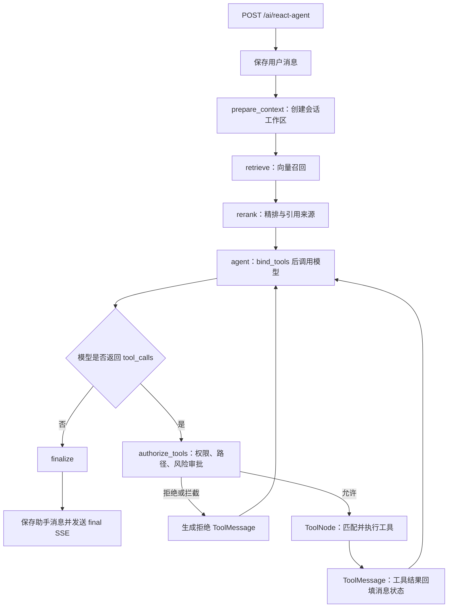

<!--
 @author: caoshuai.cs
 @date: 2026-07-15 04:11
 @description: LabAgent Agent 工具注册、发现、循环调用、执行、审批与结果回传的简明实现说明
-->

# Agent 工具调用流程与实现理解

> 本文基于当前已落地代码整理，侧重帮助阅读源码。完整设计背景见 [第四阶段工具设计文档](./05-Agent工具集成与调用链设计.md)。

## 一、整体结论

LabAgent 没有自己编写 `while` 工具调用循环，而是使用 LangGraph 的图和边完成循环：

```text
模型判断是否调用工具
→ tools_condition 路由
→ authorize_tools 权限与审批
→ ToolNode 执行工具并生成 ToolMessage
→ 回到模型继续判断
→ 直到模型返回普通文本
```

当前 RAG 是 Agent 的前置流程。每次用户请求先执行一次 `retrieve → rerank`，之后才进入 `agent → tools → agent` 循环，不会在每次工具调用后重复检索。



## 二、核心代码分工

| 文件 | 作用 |
| :--- | :--- |
| `backend/app/graph/chat_graph.py` | 定义 Agent 状态、图节点、条件路由和工具循环 |
| `backend/app/tools/registry.py` | 静态注册工具、维护元数据、按配置和角色筛选可见工具 |
| `backend/app/tools/policy.py` | 执行前的白名单、路径、角色、命令和审批策略 |
| `backend/app/tools/file_tools.py` | 将文件能力包装为 LangChain Tool，并注入会话工作区 |
| `backend/app/tools/shell_tool.py` | 将 ShellTool 转发到独立 Tool Runner |
| `backend/app/tools/workspace.py` | 创建用户/会话隔离工作区，阻止路径和软链接越界 |
| `backend/tool_runner/app.py` | 在独立服务中执行受控命令，不使用 Shell 解释器 |
| `backend/app/services/ai_service.py` | 调用 `graph.astream`，转换 SSE，处理审批恢复和持久化 |
| `backend/app/services/tool_call_service.py` | 维护工具记录的 pending、running、success 等状态 |

## 三、Agent 循环是怎么运行的

### 3.1 图的主路径

`chat_graph.py` 使用 `StateGraph(AgentState)` 注册以下节点：

```text
START
→ prepare_context
→ retrieve
→ rerank
→ agent
→ authorize_tools / finalize
→ tools / agent
→ END
```

关键边是：

- `agent` 后使用 `tools_condition`：最后一条 `AIMessage` 有 `tool_calls` 就进入 `authorize_tools`，否则进入 `finalize`。
- `authorize_tools` 通过后进入 `ToolNode`；被拒绝时生成对应的 `ToolMessage`，直接回到 `agent`。
- `ToolNode` 执行结束后固定回到 `agent`，模型读取工具结果后可继续调用工具，也可输出最终答案。

所以循环由 LangGraph 的边驱动，项目只定义节点行为和路由条件。

### 3.2 模型每轮看到什么

`agent_node` 每次调用模型前会：

1. 使用 `trim_messages` 裁剪最近消息。
2. 读取本次 RAG 资料并放入系统提示词。
3. 根据用户角色和配置取得可用工具。
4. 执行 `chat_model.bind_tools(tools)`，把工具描述和参数 Schema 交给模型。
5. 保存模型原始 `AIMessage`，不把 `tool_calls` 转成普通文本。

模型可能返回两类结果：

- 普通文本：本轮结束。
- `tool_calls`：包含工具名、参数和 `tool_call_id`，图进入工具分支。

`agent_max_tool_rounds` 控制最大工具轮次；达到上限后不再向模型绑定工具，同时 Graph 还设置了 `recursion_limit` 防止异常循环。

## 四、工具如何注册、发现和执行

“工具发现”在当前项目中分为四层：

### 4.1 工具定义

文件工具和 Shell 工具使用 `@tool` 定义。LangChain 根据函数名、类型注解和 docstring 生成工具名称、描述和参数 Schema。

`InjectedState` 和 `InjectedToolCallId` 由 LangGraph 在执行时注入，模型不需要也不应该生成 `user_id`、`session_id`、`workspace_path`、`tool_call_id` 等内部参数。

### 4.2 后端注册

`ToolRegistry.__init__()` 将 `FILE_TOOLS` 和 `execute_shell` 放入名称到 `BaseTool` 的映射，并检查工具名是否重复，同时维护来源、风险等级、是否只读等元数据。

当前是**显式静态注册**，不会扫描目录、自动导入插件或动态加载外部工具。新增工具后必须主动加入注册表。

### 4.3 模型发现

`tool_registry.model_tools(user_role)` 根据以下条件筛选工具：

- `agent_tools_enabled`
- `file_tools_enabled`
- `shell_tool_enabled`
- 当前用户角色是否允许使用 Shell

筛选结果通过 `model.bind_tools(tools)` 发送给模型。模型正是通过这里“看到”工具，并根据工具名称、描述和参数 Schema 决定是否生成 `tool_calls`。

`GET /api/v1/ai/tools` 返回工具定义和启用状态，主要用于前端展示或排查；模型并不通过这个 HTTP 接口发现工具。

### 4.4 调用发现与执行分发

模型返回 `AIMessage.tool_calls` 后：

1. `tools_condition` 发现存在工具调用并进行路由。
2. `authorize_tools` 再次检查工具是否注册、用户是否有权限、路径是否合法、是否需要人工审批。
3. `ToolNode(tool_registry.all_tools())` 按工具名找到对应 `BaseTool`，校验参数并执行。
4. ToolNode 将返回值包装为带原 `tool_call_id` 的 `ToolMessage`。
5. `ToolMessage` 回到消息状态，下一轮模型因此知道“哪个调用得到了什么结果”。

这里有意区分两组工具：

- `model_tools()`：当前用户能够看见和选择的工具。
- `all_tools()`：ToolNode 已知的完整执行集合。

即使伪造了模型消息，`authorize_tools` 和工具内部仍会再次执行策略校验，不能只依赖模型可见性。

### 4.5 新增一个工具的最小步骤

1. 用 `@tool` 定义异步函数，补充准确的类型注解和描述。
2. 对模型不可见的业务上下文使用 `InjectedState` 注入。
3. 加入 `FILE_TOOLS` 或 `ToolRegistry` 的工具列表。
4. 在 `_metadata` 中补充来源、风险和只读属性。
5. 在 `ToolPolicy` 中增加白名单、参数安全和审批规则，并补充测试。

## 五、工具本体如何执行

### 5.1 文件工具

文件工具不是直接手写文件操作，而是由适配层调用 `FileManagementToolkit`：

```text
ToolNode
→ @tool 包装函数
→ 从 AgentState 取得用户和会话
→ 校验工作区及 ToolPolicy
→ FileManagementToolkit.ainvoke
→ 结果脱敏、截断并包装为 JSON
→ ToolMessage
```

工作区固定为：

```text
{tool_workspace_root}/{user_id}/{session_id}/
├── input/
├── output/
└── tmp/
```

所有路径只能使用相对路径，并校验 `..`、绝对路径、解析后越界及软链接越界。

### 5.2 Shell 工具

Shell 默认关闭。启用后调用链为：

```text
ToolNode
→ execute_shell
→ ShellTool
→ SandboxShellProcess
→ HTTP 请求内部 Tool Runner
→ asyncio.create_subprocess_exec
```

Tool Runner 只接受内部 Token 鉴权，请求工作区必须位于共享工作区根目录下。命令使用 `shlex.split` 后交给 `create_subprocess_exec`，不经过 `shell=True`，并拦截 `sudo`、`docker`、`ssh` 等高风险可执行文件。

## 六、审批、流式事件和持久化

高风险工具在 `authorize_tools` 中调用 `interrupt()` 暂停图。前端收到 `tool_approval_required` 后，调用 `/react-agent/resume`；后端重新校验 JWT、会话归属和 `interrupt_id`，再通过 `Command(resume={"approved": ...})` 恢复原图。

`AiService` 同时消费三种 LangGraph 流：

| 流模式 | 用途 |
| :--- | :--- |
| `messages` | 输出 Agent 节点的模型 Token |
| `updates` | 识别 `AIMessage.tool_calls`、`ToolMessage` 和 `interrupt` |
| `custom` | 输出 RAG 来源和工具内部 running/done/failed 状态 |

主要 SSE 事件为：`token`、`sources`、`tool_call`、`status`、`tool_result`、`tool_approval_required`、`paused`、`final`、`error`。

工具记录以 `(session_id, tool_call_id)` 幂等保存，状态大致为：

```text
pending → pending_approval / running → success / failed / rejected / timeout / cancelled
```

最终助手消息保存后，同一次 Agent 运行的工具记录通过 `trace_id` 关联到该消息，历史接口再以结构化 `tool_calls` 恢复工具卡片。

## 七、安全校验层次

当前调用链不是“模型说执行就执行”，而是多层防护：

1. API 层从 JWT 取得用户身份并校验会话归属。
2. Registry 层只向模型暴露当前用户可见工具。
3. `authorize_tools` 在执行前复核白名单、角色、路径和审批策略。
4. 工具函数内部再次校验工作区和 ToolPolicy。
5. Tool Runner 再校验内部 Token、工作区和可执行文件。
6. 参数、结果及 SSE 入库前进行敏感字段脱敏和长度截断。
7. 系统提示词明确把文件内容、Shell 输出和 RAG 文档视为不可信数据。

## 八、当前实现边界与后续方向

### 当前已实现

- 7 个文件工具和 1 个 Shell 工具。
- LangGraph 原生工具循环、参数 Schema、ToolMessage 回传和多工具执行。
- 用户/会话工作区隔离、角色权限、人工审批、SSE 展示和数据库审计。
- `AsyncPostgresSaver` 按 `user_id:session_id` 保存和恢复 Agent 状态。
- 全局 Agent 超时、Shell 单独超时、最大工具轮次和运行取消。

### 尚未实现或需完善

- 没有动态插件、MCP 或目录扫描式工具发现；当前新增工具需要改代码并重启。
- `tool_timeout_seconds` 已有配置，但当前没有接入通用单工具超时；文件工具主要受全局 `agent_timeout_seconds` 限制，Shell 使用 `shell_timeout_seconds`。
- 同一条 AI 消息包含多个工具调用时，ToolNode 可以并行执行；但当前授权节点只要发现其中一个调用被拦截，就会将该批调用全部标记为未执行。
- 工具版本、课程级工具授权和运行时启停管理尚未实现。

## 九、阅读源码的推荐顺序

```text
api/v1/ai.py
→ services/ai_service.py
→ graph/chat_graph.py
→ tools/registry.py
→ tools/policy.py
→ tools/file_tools.py / shell_tool.py
→ tools/workspace.py / result.py
→ tool_runner/app.py
```
