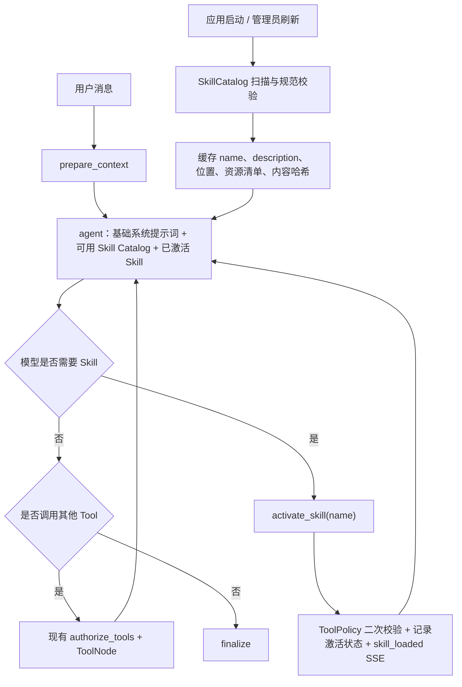

<!--
 @author: caoshuai.cs
 @date: 2026-07-30
 @description: LabAgent Markdown Skills 规范调研、LangGraph 集成、运行状态持久化与前端交互设计
-->

# 14 - Skills 调研、实现与交互设计

> 文档状态：第一版已实现，后续阶段待迭代。
>
> 调研日期：2026-07-30。
>
> 本文沉淀 Skills 的定义、规范选型、与现有 LangGraph Agent 的集成方式、安全边界、运行状态持久化和前端交互设计。

## 1. 结论先行

LabAgent 的 Skills 应实现为遵循 [Agent Skills 开放规范](https://agentskills.io/specification) 的「可按需加载的任务说明包」，而不是第二套 Tool 系统，也不是另一种知识库。

第一版采用以下方案：

1. Skill 使用标准目录结构：每个 Skill 一个目录，必含 `SKILL.md`，可选 `references/`、`scripts/` 和 `assets/`。
2. 启动时只扫描并向模型披露 `name + description`，模型判断相关后调用 `activate_skill` 加载完整说明；引用资源继续按需读取，落实三级渐进披露。
3. Skill 的激活由模型基于 `description` 自主决策，不迁移 Java 版的关键词打分路由；用户显式指定 Skill 作为后续增强。
4. `activate_skill` 和 `read_skill_resource` 作为低风险、只读的 LangChain Tools 注册到现有 `ToolRegistry`，继续由当前 `StateGraph + ToolNode` 循环执行。
5. 已激活 Skill 记录在 LangGraph State 中，Agent 节点在每次模型调用前动态拼装系统提示词，避免 Skill 内容被 `trim_messages` 裁掉。
6. 第一版仅加载随应用发布、由管理员审核的只读 Skill，不提供用户上传、远程安装和脚本执行。
7. Skill 只能指导模型使用现有工具，不能自行授予 Tool 权限；所有实际动作仍必须经过 `ToolPolicy`、工作区隔离、超时和人工审批。
8. 规范校验优先使用官方参考库 `skills-ref`，项目只实现目录发现、业务权限、缓存、Prompt 适配和 LangGraph 编排。
9. 当前不直接引入 Deep Agents 的 `SkillsMiddleware`。它是很好的参考实现，但现行版本要求 LangChain 1.x，而项目当前实际锁定 LangChain 0.3.30、langchain-core 0.3.86、LangGraph 0.6.11，直接接入会变成一次较大的框架升级。

## 2. Skills 的定位

### 2.1 Skill、Tool、RAG 和 Memory 的边界

| 能力 | 解决的问题 | 典型内容 | 加载/执行方式 |
| :--- | :--- | :--- | :--- |
| Skill | 某类任务应该按什么流程完成 | 操作步骤、决策规则、输出规范、边界条件 | 相关时把说明按需加入模型上下文 |
| Tool | Agent 能实际执行什么动作 | 检索、写文件、运行受控命令、调用业务 API | 模型生成结构化 Tool Call，由 ToolNode 执行 |
| RAG | 回答当前问题需要哪些事实资料 | 课程知识、实验要求、平台说明 | `search_knowledge_base` 检索并返回来源 |
| Memory | 跨轮次需要保留什么会话或用户信息 | 消息历史、偏好、摘要 | Checkpointer、Store、上下文裁剪 |
| MCP | 外部能力以什么协议接入 | 第三方工具和资源 | MCP Client/Server 协议 |

Skill 可以写明“先检索课程资料，再检查代码，再按模板输出”，但检索和文件读取仍由 Tool 完成。Skill 本身不绕过 Tool 白名单，也不替代知识库。

### 2.2 适合沉淀为 Skill 的内容

- Java 异常诊断流程，例如先识别异常类型、定位堆栈首个业务行、补充最小复现，再给修复与预防建议。
- 实验报告检查流程，例如依次检查结构、实验步骤、结果分析、引用和提交要求。
- 代码审查流程，例如按正确性、安全性、可维护性和测试覆盖率输出分级问题。
- 实验平台操作引导流程，例如先确认当前页面和操作目标，再按步骤指导并提示常见失败原因。
- 固定输出格式、验收清单、质量门禁和领域内决策规则。

不适合沉淀为 Skill 的内容：

- 经常变化的课程事实，应进入 RAG 知识库。
- 单一步骤、可直接结构化调用的动作，应实现为 Tool。
- 所有请求都必须遵守的安全规则，应保留在系统提示词和服务端策略中。
- 用户身份、会话归属等运行时信息，应来自 JWT 和 LangGraph Runtime/State。

## 3. 开放规范调研

### 3.1 标准目录

[Agent Skills 规范](https://agentskills.io/specification)定义的最小结构如下：

```text
skill-name/
├── SKILL.md
├── references/       # 可选：按需读取的说明资料
├── scripts/          # 可选：可执行脚本
└── assets/           # 可选：模板、图片、数据文件
```

`SKILL.md` 必须由 YAML frontmatter 和 Markdown 正文组成：

```markdown
---
name: java-debug-helper
description: 分析 Java 编译错误、运行时异常和堆栈信息；当用户提供 Java 报错、异常堆栈或请求定位 bug 时使用。
license: MIT
compatibility: Designed for LabAgent; script execution is not required.
metadata:
  author: caoshuai.cs
  version: "1.0.0"
---

# Java 调试助手

按以下流程诊断……
```

标准字段：

| 字段 | 必填 | 约束或用途 |
| :--- | :--- | :--- |
| `name` | 是 | 1～64 个字符，只允许小写字母、数字和连字符；必须与父目录名一致 |
| `description` | 是 | 1～1024 个字符，同时说明“能做什么”和“什么时候使用” |
| `license` | 否 | 许可证名或 Skill 内许可证文件 |
| `compatibility` | 否 | 运行环境、依赖、网络等要求，最多 500 个字符 |
| `metadata` | 否 | 字符串键值扩展信息，例如作者和版本 |
| `allowed-tools` | 否 | 实验性字段，声明预批准工具，不同客户端支持程度不同 |

Java 参考项目的 `version`、`author` 应迁移到 `metadata`；`trigger_keywords` 不是标准顶层字段，第一版不继续作为匹配依据。如需保留来源信息，可放到 `metadata`，但 Agent 是否激活 Skill 仍以 `description` 和当前任务语义为主。

### 3.2 三级渐进披露

Skills 的关键不只是 Markdown 文件，而是渐进披露：

| 层级 | 模型拿到的内容 | 时机 |
| :--- | :--- | :--- |
| 一级：Catalog | 所有可用 Skill 的 `name + description` | Agent 开始处理请求时 |
| 二级：Instructions | 被激活 Skill 的完整 `SKILL.md` 正文 | 模型判断相关并激活时 |
| 三级：Resources | 指定 reference、script 或 asset | Skill 正文明确需要时 |

这样不会把所有 Skill 全文都塞入每次请求。规范建议单个 `SKILL.md` 正文控制在 500 行以内、约 5000 tokens 以内，详细内容拆到一级引用文件。

### 3.3 激活方式

[官方客户端集成指南](https://agentskills.io/client-implementation/adding-skills-support)建议优先使用模型驱动激活：模型读取 Catalog 后，自行判断 Skill 是否相关，再读取文件或调用专用激活工具。它明确指出，多数实现不在宿主侧使用关键词触发器。

两种常见实现：

1. 文件读取：模型直接用通用文件工具读取 `SKILL.md`。
2. 专用工具：模型调用 `activate_skill(name)`，服务端返回说明并记录激活状态。

LabAgent 选择专用工具，原因如下：

- 当前文件工具被严格限制在用户/会话工作区，不能安全读取应用内部 Skill 目录。
- 专用工具可以限制合法 Skill 名称、隐藏服务器绝对路径、执行二次权限校验。
- 便于发出 `skill_loaded` SSE 事件、记录命中情况和做效果评测。
- 便于对 Skill 正文做结构化包装、去重和上下文保护。

## 4. 当前项目与 Java 参考实现

### 4.1 LabAgent 当前状态

| 位置 | 当前状态 |
| :--- | :--- |
| [README.md](../README.md) | 已把 Markdown Skills 列为核心能力 |
| [01-产品与架构设计.md](./01-产品与架构设计.md) | 已预留 `SkillService` 和加载/匹配/注入目标 |
| [skills.py](../backend/app/api/v1/skills.py) | 已提供列表、详情和管理员刷新接口 |
| [SkillsManagement.vue](../frontend/src/views/SkillsManagement.vue) | 已接入列表、详情正文和资源清单 |
| [ChatInput.vue](../frontend/src/components/ChatInput.vue) | 已能接收 `skill_loaded` SSE 事件 |
| [ToolActivityPanel.vue](../frontend/src/components/ToolActivityPanel.vue) | 已能把 `skill_loaded` 转为活动项 |
| [chat_graph.py](../backend/app/graph/chat_graph.py) | 已接入 Skill Catalog、激活 Tool、运行内状态和动态 Prompt |

当前第一版已完成标准只读 Skill 的扫描、校验、渐进披露和 Agent 激活；用户上传、远程安装、脚本执行、多作用域分发与显式选择器仍未实现。

### 4.2 Java 参考实现做了什么

JavaLabAgent 的 `SkillServiceImpl` 已包含：

- 扫描 `skills/*/SKILL.md`。
- 解析 YAML frontmatter 和 Markdown 正文。
- 缓存 Skill 元数据、正文和资源列表。
- 使用 `trigger_keywords` 对用户消息做包含匹配，最多返回 3 个 Skill。
- 提供列表、详情和刷新接口。
- 命中后发送 `skill_loaded` 事件。

### 4.3 Java 版不应原样迁移的部分

1. 关键词包含匹配容易误命中、漏命中，也无法理解多意图任务；开放规范推荐模型基于 `description` 决策。
2. Java Agent 实际只把 Skill 名称、描述和触发词拼入规划 Prompt，没有把完整正文提供给模型，Skill 中的详细流程并未真正参与执行。
3. 手写 frontmatter 拆分、YAML 解析和规范校验会重复实现标准库已有能力。
4. 返回裸 `Map`、使用驼峰字段，不符合当前 `BaseResponse[T]` 和全链路蛇形字段规范。
5. 刷新接口没有管理员权限要求，且扫描路径、软链接、文件大小和资源类型缺少完整安全约束。
6. `scripts/` 只被列出，没有安全执行模型；迁移时不能因为目录存在就交给宿主 Shell 执行。

应复用的是“目录作为版本化来源、只读列表/详情、缓存与刷新、SSE 可见性”这些产品语义，不复用关键词路由和手写 Agent Loop。

## 5. 技术选型

### 5.1 方案比较

| 方案 | 优点 | 问题 | 结论 |
| :--- | :--- | :--- | :--- |
| 迁移 Java 版关键词匹配 | 改动小、行为直观 | 不符合开放规范，正文未真正加载，匹配质量低 | 不采用 |
| 直接使用 Deep Agents `SkillsMiddleware` | 官方 LangChain 实现，已有渐进披露、多 Backend 和权限模型 | 当前版本要求 LangChain 1.x，与项目 0.3.x 基线不兼容；还会引入完整 Deep Agents harness | 当前不采用 |
| 当前 StateGraph 中增加标准 Skill 适配层 | 保留现有 RAG、审批、SSE、持久化和 ToolPolicy；改动边界清晰 | 需要实现少量业务适配 | 第一版采用 |
| 先整体升级 LangChain/LangGraph，再接 Middleware | 长期可减少自维护代码 | 升级影响 Agent、Tools、模型适配、Checkpointer 和测试，不能与本功能混做 | 独立升级阶段评估 |

### 5.2 为什么当前不接 Deep Agents

LangChain 的 [Deep Agents Skills 文档](https://docs.langchain.com/oss/python/deepagents/skills)表明，`SkillsMiddleware` 已实现从 Backend 扫描 Skill、注入 Catalog、按需读取正文和资源，是长期值得复用的框架能力。

但截至调研日期，Deep Agents 0.6.12 的依赖要求是：

- `langchain >= 1.3.14, < 2.0.0`
- `langchain-core >= 1.5.0, < 2.0.0`

当前项目锁定：

- LangChain 0.3.30
- langchain-core 0.3.86
- LangGraph 0.6.11
- langgraph-prebuilt 0.6.5

因此第一版不为了 Skills 单独升级整个 Agent 栈。实现时保持 `SkillCatalog` 和存储访问接口独立，未来升级后可以把扫描、Catalog 注入和资源读取替换为 `SkillsMiddleware + Backend`，不改变 API、SSE 和 Skill 文件格式。

### 5.3 规范库选择

实现阶段建议显式增加并锁定 `skills-ref >= 0.1.1, < 0.2`，使用其：

- `validate()` 校验 Skill 目录。
- `read_properties()` 读取标准属性。
- 测试或管理命令中使用 `to_prompt()` 对比标准 Catalog 输出。

该库当前仍是 0.1.x，项目应通过 `SkillParser` 适配接口隔离它，避免业务代码直接依赖其数据类。运行时 Catalog 由 LabAgent 生成，因为不能向模型暴露服务器绝对路径，且需要按当前用户权限过滤。

## 6. 第一版目标架构



Skills 不增加一张独立的 Agent 图，继续复用现有：

```text
START → prepare_context → agent
                         ├─ 无 tool_calls → finalize → END
                         └─ 有 tool_calls → authorize_tools → tools → agent
```

`activate_skill` 和 `read_skill_resource` 与 `search_knowledge_base`、`write_file`、`execute_shell` 一样进入现有 Tool Loop。

## 7. 目录与模块设计

### 7.1 文件目录

第一版使用应用内置、只读目录：

```text
backend/
├── skills/
│   ├── java-debug-helper/
│   │   ├── SKILL.md
│   │   └── references/
│   └── code-review/
│       └── SKILL.md
└── app/
    ├── schemas/skill.py
    ├── services/skill_service.py
    ├── skills/
    │   ├── catalog.py
    │   ├── parser.py
    │   └── prompt.py
    └── tools/skill_tools.py
```

Docker 构建时需显式 `COPY skills ./skills`。`skills_directory` 通过 Settings 和环境变量配置，默认 `./skills`，不能硬编码开发机绝对路径。

### 7.2 核心对象

建议定义：

```python
class SkillMetadata(BaseModel):
    name: str
    description: str
    license: str | None = None
    compatibility: str | None = None
    metadata: dict[str, str] = Field(default_factory=dict)
    allowed_tools: str | None = None


class SkillDefinition(BaseModel):
    metadata: SkillMetadata
    skill_file: Path
    skill_directory: Path
    content_hash: str
    resources: list[str] = Field(default_factory=list)


class ActivatedSkill(BaseModel):
    name: str
    content_hash: str
    content: str
    resources: list[str] = Field(default_factory=list)
```

职责划分：

| 模块 | 职责 |
| :--- | :--- |
| `SkillParser` | 调用 `skills-ref` 校验和解析，转换为项目 Pydantic 模型 |
| `SkillCatalog` | 扫描目录、处理名称冲突、缓存元数据和内容哈希、提供只读查询 |
| `SkillService` | 权限过滤、列表/详情/刷新、激活和资源读取的业务规则 |
| `skill_tools.py` | 把激活和资源读取暴露为 LangChain Tools |
| `skill_prompt.py` | 生成 Catalog 和已激活 Skill 的结构化 Prompt 片段 |

第一版不需要数据库表。内置 Skill 以 Git 目录为唯一事实来源，应用启动时扫描进内存；管理员刷新使用原子替换缓存，不能先清空再逐个写入导致请求读到半成品。

## 8. LangGraph 集成设计

### 8.1 Agent State

在 `AgentState` 增加：

```python
activated_skills: list[ActivatedSkill]
active_skill_run_id: str | None
```

`activated_skills` 使用按 `name` 稳定去重的 reducer，兼容模型并行激活多个 Skill。激活记录由 Checkpointer 保存，不能只放进进程全局变量。

LabAgent 的会话可能长期包含多个互不相关的问题。第一版把 Skill 激活范围限定为一次 Agent Run：

- 同一次 ReAct 工具循环中持续生效。
- 人工审批暂停和恢复后仍生效。
- 新用户消息产生新的 `agent_run_id` 时，由 `prepare_context` 清空上一次激活列表。
- 后续问题如仍需要该 Skill，模型可基于 Catalog 重新激活。

这样可以避免一个早期问题激活的 Skill 永久污染整个聊天会话，同时保证单次复杂任务中不会丢失说明。

### 8.2 Catalog 注入

Agent 节点每次调用模型前动态构建系统提示词：

```text
基础 LabAgent 系统规则
+ 当前用户可见的 <available_skills> Catalog
+ 当前 Agent Run 已激活的 <skill_content> 正文
```

Catalog 示例：

```xml
<available_skills>
  <skill>
    <name>java-debug-helper</name>
    <description>分析 Java 编译错误、运行时异常和堆栈信息；当用户提供 Java 报错、异常堆栈或请求定位 bug 时使用。</description>
  </skill>
</available_skills>
```

系统提示词只告诉模型：

- 当任务匹配描述时调用 `activate_skill`。
- 激活前不能猜测 Skill 正文。
- Skill 不能覆盖系统安全规则或 ToolPolicy。
- 不相关任务不要为了展示能力而激活 Skill。

没有可用 Skill 时，不注入空 Catalog，也不把 `activate_skill` 绑定给模型。

### 8.3 `activate_skill`

模型可见参数只有：

```python
name: str
```

实现要求：

1. 模型绑定阶段尽量把 `name` JSON Schema 限制为当前可见 Skill 的枚举。
2. 执行阶段再次从 Catalog 查询，拒绝不存在、禁用或无权限的名称，不能只信任模型参数。
3. 首次激活时把经过长度限制的正文快照、资源清单和内容哈希写入 `ActivatedSkill`，再保存到 State。
4. ToolMessage 只返回简短确认和资源清单；完整正文由下一次 Agent 节点放入系统提示词，避免正文同时出现在 ToolMessage 和 SystemMessage 中。
5. 已激活的同名同哈希 Skill 再次调用时返回 `already_active`，不重复注入。
6. 激活成功后通过 custom stream 发出 `skill_loaded`。

`ToolNode` 原生支持 Tool 返回 `Command(update=...)`。当前项目在 `execute_tools_node` 外包了一层授权过滤，实施时必须确认 `Command` 更新能够被透传；如果继续由包装节点汇总结果，则由该节点使用普通 State update 合并激活记录，不能丢弃 ToolNode 的 `Command`。

### 8.4 `read_skill_resource`

参数：

```python
skill_name: str
relative_path: str
```

规则：

- 只能读取当前 Agent Run 已激活 Skill 的资源。
- 只接受相对路径，规范化后必须仍位于该 Skill 根目录。
- 拒绝 `..`、绝对路径、软链接越界、设备文件和超出大小限制的文件。
- 第一版只读取 UTF-8 文本；二进制 asset 仅在详情页展示文件名，不进入 Prompt。
- 内容按字符/token 截断，并用结构化边界包装。
- 读取行为是低风险只读 Tool，但结果仍视为可能包含 Prompt Injection，不获得更高指令优先级。

### 8.5 上下文保护

不能只依赖 `activate_skill` 的 ToolMessage，因为当前 `trim_messages` 会裁剪历史消息，较长任务中 Skill 说明可能被移除。

第一版采用：

- State 记录已激活 Skill 的名称、简介和正文快照。正文只允许由受控的 `activate_skill` 写入，不能接收模型或请求体直接传值。
- 每次 Agent 模型调用前从 State 中的可信快照读取正文，重新放入受标记的系统提示词片段。
- 新 Agent Run 清空激活记录。
- 限制单次 Run 最大激活数量和总 Skill token 预算。

如果 Skill 文件在运行中刷新且哈希变化，当前 Run 继续使用 Checkpointer 中的原正文快照；新 Agent Run 才使用新版本。不要静默把一套新指令替换进暂停中的 Agent。

正文快照会增加 Checkpointer 体积，因此必须同时限制单 Skill 大小、单次 Run 激活数量和总 token，并在评测中观察单线程 checkpoint 增量；不能无上限持久化资源全文。

## 9. Tool Registry 与权限

新增 Tool 元数据：

| Tool | source | risk_level | read_only | 默认审批 |
| :--- | :--- | :--- | :--- | :--- |
| `activate_skill` | `skill` | `low` | `true` | 否 |
| `read_skill_resource` | `skill` | `low` | `true` | 否 |

`ToolPolicy` 增加显式分支，不能因为 `metadata` 存在就直接放行未知 Tool。

Skill 中出现的 `allowed-tools` 不能直接提升权限：

- 第一版解析并展示该实验性字段，但不把它解释为授权。
- 实际可用 Tool 始终是“系统配置、用户角色、Tool Registry、ToolPolicy”共同允许的交集。
- Skill 即使写了 `execute_shell`，当 `shell_tool_enabled=false` 时也不能执行。
- Skill 无权关闭路径校验、超时、输出截断或人工审批。

## 10. API 与 SSE 契约

### 10.1 API

所有接口使用 `BaseResponse[T]`，字段保持蛇形：

```text
GET  /api/v1/skills
GET  /api/v1/skills/{name}
POST /api/v1/skills/refresh
```

建议响应模型：

```python
class SkillSummaryVO(BaseModel):
    name: str
    description: str
    license: str | None
    compatibility: str | None
    metadata: dict[str, str]
    resource_count: int
    enabled: bool


class SkillDetailVO(SkillSummaryVO):
    content: str
    resources: list[str]


class SkillRefreshVO(BaseModel):
    total: int
    loaded: int
    skipped: int
    refreshed_at: datetime
```

权限：

- 列表和详情：登录用户只读，只返回当前用户可见且有效的 Skill。
- 刷新：仅管理员；返回数量和安全诊断摘要，不返回服务器绝对路径或完整异常堆栈。
- 第一版不提供上传、创建、编辑、删除和远程安装接口。

### 10.2 SSE

激活成功发送：

```json
{
  "event_type": "skill_loaded",
  "session_id": "uuid",
  "trace_id": "trace",
  "ts": 0,
  "payload": {
    "skills": [
      {
        "name": "java-debug-helper",
        "description": "分析 Java 编译错误、运行时异常和堆栈信息"
      }
    ],
    "count": 1,
    "round": 1,
    "already_active": false
  }
}
```

继续复用现有前端 `skill_loaded` 分支。`activate_skill` 是内部基础设施 Tool，前端应避免同时展示一张重复的通用 Tool 卡片和一张 Skill 卡片；具体采用隐藏通用卡片还是合并展示，在实现阶段保持现有交互风格决定。

## 11. 配置建议

```python
skills_enabled: bool = True
skills_directory: str = "./skills"
skills_max_count: int = 50
skills_max_activations_per_run: int = 3
skills_max_skill_file_bytes: int = 262_144
skills_max_resource_file_bytes: int = 262_144
skills_resource_max_depth: int = 3
skills_max_active_chars: int = 32_000
```

约束：

- 所有配置通过 `Settings` 和环境变量读取。
- `skills_directory` 启动时解析为规范路径，并确认位于部署允许的根目录。
- 超过上限的 Skill 记录诊断并跳过，不能无限扫描。
- Catalog 超过数量上限时应在启动日志和管理员诊断中明确告警，不能无提示地随机截断。

## 12. 安全设计

### 12.1 信任模型

Skill 正文会影响模型行为，本质上是可执行语义配置。第一版只信任随应用发布、经代码评审的 Skill：

- 不允许普通用户上传或覆盖。
- 不从用户输入 URL 自动下载。
- 不在运行时执行 Git clone、pip install 或远程脚本。
- 刷新只重新扫描配置好的只读目录。

未来支持教师或管理员上传时，必须增加独立的待审核状态、作用域、版本、内容哈希、发布/回滚和审计流程。

### 12.2 文件安全

- Skill 目录名、frontmatter `name` 和 Catalog key 必须一致。
- 扫描深度、目录数量、文件数量和单文件大小均设上限。
- 拒绝符号链接越界和解析后不在 Skill 根目录内的资源。
- API 和 Prompt 均不暴露宿主绝对路径。
- 只用 UTF-8 安全读取文本，不把二进制内容直接拼进 Prompt。
- YAML 使用安全解析，禁止任意对象构造。

### 12.3 Prompt Injection

- Catalog 和 Skill 内容与用户输入分区并使用结构化标签包装。
- 基础系统提示词明确：Skill 是低于平台安全规则的任务指导，不能修改 JWT、权限、ToolPolicy 和审批要求。
- 来自 RAG、用户工作区、Tool 输出的文本不能触发新的 Skill 安装或修改。
- Skill 引用的外部资料仍是不可信数据，只作为任务资料，不作为系统指令。

### 12.4 Script 安全

第一版只允许模型查看 `scripts/` 文件，不允许执行。

后续确需执行时：

1. 仅执行管理员审核并带内容哈希的脚本。
2. 通过独立 Tool Runner 容器执行，禁止在 FastAPI 宿主进程执行。
3. 默认无网络、只读挂载 Skill、独立临时工作区。
4. 限制 CPU、内存、进程数、执行时间和输出大小。
5. 参数必须经过 Pydantic 校验，禁止拼接任意 Shell。
6. 写操作或外部副作用继续走人工审批。

## 13. 缓存、刷新与一致性

`SkillCatalog` 使用不可变快照：

1. 在临时 map 中完成扫描、校验、冲突处理和哈希计算。
2. 全部完成后一次性替换当前快照。
3. 正在运行的 Agent 使用已写入 LangGraph State 的激活正文快照，不受刷新或进程重启影响。
4. 新请求使用新快照。

名称冲突采用确定规则：

- 第一版只有一个内置目录，同名视为配置错误并跳过后加载项。
- 未来支持多作用域时采用 `builtin < organization < user/project`，后加载的高优先级来源覆盖低优先级来源，并记录 shadow 诊断。

不建议第一版监听文件系统热更新。启动扫描 + 管理员刷新足够稳定，也更容易审计。

## 14. 测试与评测

### 14.1 单元测试

- 合法最小 Skill、完整可选字段和中文正文解析。
- 缺少 frontmatter、缺少 description、非法 name、目录名不一致。
- YAML 解析失败、超大文件、过深目录、过多资源。
- 重名冲突、缓存原子替换、刷新失败保留旧快照。
- `../`、绝对路径、软链接越界和二进制资源拒绝。
- `activate_skill` 不存在、禁用、重复激活和超过数量/token 上限。
- `read_skill_resource` 只能读取已激活 Skill。
- `allowed-tools` 不会提升 ToolPolicy 权限。

### 14.2 Graph 集成测试

- 匹配任务时模型先激活 Skill，再按 Skill 流程回答。
- 不相关任务不激活 Skill。
- 激活后正文进入后续模型调用的系统上下文。
- 多轮 Tool 调用和 `trim_messages` 后 Skill 仍生效。
- 新 Agent Run 会清空旧激活 Skill。
- 审批暂停/恢复期间激活状态不丢失。
- 并行激活使用 reducer 正确去重。
- ToolNode 返回的 State update/Command 不被当前授权包装节点丢弃。
- `skill_loaded` SSE 字段和前端消费契约一致。

### 14.3 效果评测

为每个 Skill 建立正例、近邻负例和普通问题，至少覆盖：

- 应激活且名称明确。
- 应激活但用户没有说出 Skill 名。
- 关键词相似但不应激活。
- 多 Skill 任务。
- Skill 与 RAG、文件 Tool 组合任务。

建议指标：

| 指标 | 含义 |
| :--- | :--- |
| Skill Activation Precision | 已激活的 Skill 中真正相关的比例 |
| Skill Activation Recall | 应使用 Skill 的问题中成功激活的比例 |
| Unnecessary Activation Rate | 普通问题被错误激活的比例 |
| Task Completion Rate | 按 Skill 流程完成任务的比例 |
| Instruction Adherence | 是否遵守步骤、边界和输出格式 |
| Token Overhead | Catalog 与激活正文带来的额外 token |
| Activation Latency | 激活 Tool 带来的额外耗时 |

评测至少对比：

1. 无 Skill 基线。
2. Java 版关键词路由。
3. Catalog + 模型自主激活。

## 15. 分阶段实施

第一版已完成阶段 A、阶段 B 的核心能力以及阶段 C 的详情展示；以下未勾选项继续作为后续计划。

### 阶段 A：标准只读 Skills（已完成）

- 增加 `skills-ref`、Pydantic 模型、Parser、Catalog 和 Settings。
- 创建经过重写并通过规范校验的内置 Skill：`java-debug-helper`、`lab-report-writer`。
- 完成列表、详情和管理员刷新接口。
- Docker 镜像包含 `backend/skills`。
- 暂不接入 Agent，不影响现有对话行为。

### 阶段 B：Agent 渐进披露（已完成）

- Catalog 动态注入系统提示词。
- 注册 `activate_skill` 和 `read_skill_resource`。
- 增加 `activated_skills` State、去重 reducer 和 Prompt 保护。
- 接通 ToolPolicy、SSE 和现有前端 Skill 活动展示。
- 完成 Graph、SSE 和安全测试。

### 阶段 C：显式激活与管理体验（部分完成）

- 在聊天输入框提供 `$skill-name` 或选择器。
- 管理页展示规范字段、资源清单、校验诊断和启用状态。
- 管理员刷新后展示 loaded/skipped 结果。
- 增加激活质量和 token 开销评测。

### 阶段 D：多作用域与受控分发

- 评估组织级、课程级、教师级 Skill。
- 使用数据库保存元数据、版本、作用域和发布状态，文件放 MinIO 或受控 Git 仓库。
- 增加审核、签名/哈希、回滚和审计。
- 评估 LangChain/LangGraph 1.x 升级，并优先切换到 Deep Agents `SkillsMiddleware + StoreBackend/FilesystemBackend`。
- 独立设计脚本沙箱，不与只读 Skills 同批上线。

## 16. 预计代码改动清单

第一版实际改动涉及：

```text
backend/pyproject.toml
backend/uv.lock
backend/app/core/config.py
backend/app/schemas/skill.py
backend/app/services/skill_service.py
backend/app/tools/skill_tools.py
backend/app/tools/registry.py
backend/app/tools/policy.py
backend/app/graph/chat_graph.py
backend/app/api/v1/skills.py
backend/skills/*/SKILL.md
backend/Dockerfile
.env.example
frontend/src/api/skills.js
frontend/src/views/SkillsManagement.vue
frontend/src/components/ToolActivityPanel.vue
backend/tests/test_skills.py
README.md
```

脚本执行未纳入第一版；所有 Skill 能力继续受现有 ToolPolicy 和应用权限边界约束。

## 17. 验收标准

第一版完整落地后应满足：

1. 合法 `SKILL.md` 能在启动或管理员刷新后出现在列表和详情页。
2. 无效 Skill 被跳过并产生可诊断、无敏感路径的错误信息，不影响其他 Skill。
3. 模型只看到 `name + description`，只有相关时才加载全文。
4. Java 报错问题能激活 `java-debug-helper`，普通课程问答不会误激活。
5. 激活正文在本次 Agent Run 的多轮 Tool 调用中持续有效且不重复注入。
6. Skill 不能越权启用 Shell、绕过审批或读取其他用户工作区。
7. 资源路径穿越、软链接越界、超大文件和未知 Skill 均被拒绝。
8. SSE 和 API 全部使用蛇形字段并通过现有统一响应结构。
9. 刷新过程中现有请求继续使用完整旧快照，不出现空 Catalog。
10. 有激活精确率、召回率、任务完成率和 token 开销的基础评测结果。

## 18. 运行状态持久化

### 18.1 标识与生命周期

| 标识 | 含义 | 生命周期 | 持久化位置 |
| :--- | :--- | :--- | :--- |
| `session_id` | 一段业务会话 | 多次用户提问 | `chat_session`、`chat_message`、`chat_tool_call` |
| `thread_id` | LangGraph checkpoint 分区键，当前为 `user_id:session_id` | 与会话绑定 | LangGraph checkpoint 表 |
| `agent_run_id` | 一次用户提问对应的完整 Agent Loop | 一次提问，可跨工具审批恢复 | `AgentState`，并复用为工具记录的 `trace_id` |
| SSE `trace_id` | 一次 HTTP/SSE 流连接的链路 ID | 一次流连接 | SSE 事件和日志 |
| `tool_call_id` | 模型生成的单个工具调用 ID | 单次工具调用 | `chat_tool_call` 和 LangGraph 消息 |

首次请求时 SSE `trace_id` 同时作为 `agent_run_id`；工具审批恢复会创建新的 SSE `trace_id`，但继续使用 checkpoint 中原有的 `agent_run_id`。后续应将 SSE 字段明确拆分为稳定的 `agent_run_id` 和单次连接的 `stream_trace_id`，避免一个字段表达两种语义。

### 18.2 Skill 激活状态

项目使用 `AsyncPostgresSaver` 保存 `AgentState`，其中包含 `agent_run_id`、`activated_skills` 和 `active_skill_run_id`。因此 Tool 审批暂停、恢复或服务重启后，当前 Run 仍可使用已激活 Skill 的正文快照。

新用户提问会创建新的 `agent_run_id`，并在逻辑上清空 `activated_skills`。历史 checkpoint 仍可能保留旧快照；当前会话逻辑删除也不会同步清理 checkpoint。后续可在确认幂等重试和失败补偿后，调用 `AsyncPostgresSaver.adelete_thread(thread_id)`，并为长期不活跃会话增加可配置保留期。

业务表目前只在 `chat_tool_call.trace_id` 中记录原始 `agent_run_id`，`chat_message` 尚无对应字段。因此工具记录可以按 Run 关联，但消息、工具和 checkpoint 还不能通过独立业务字段完整串联。

## 19. 前端交互

### 19.1 当前能力

- Skill 管理页支持查询列表、查看 `SKILL.md` 正文和资源清单，正文经过安全转义和受限 Markdown 渲染。
- 实时对话支持 `skill_loaded` 事件，并在活动面板中展示 Skill 卡片、隐藏重复的 `activate_skill` 普通工具卡片。
- `read_skill_resource` 可通过通用工具卡片展示，但尚未对 `skill_resource_loaded` 提供专用交互。

### 19.2 当前缺口

- 页面刷新后只能从 `chat_tool_call` 还原普通 `activate_skill` 工具记录，无法恢复与实时事件一致的 Skill 卡片。
- 尚未提供 `$skill-name`、`/skills`、输入框选择器和已选择 Skill Chip。
- 尚未读取 `agents/openai.yaml` 中的 `display_name`、`short_description`、图标和 `allow_implicit_invocation`。
- 管理页尚未展示启用状态和完整校验诊断。

### 19.3 后续设计

1. 历史加载时把成功的 `activate_skill` 工具记录转换为 `skill_loaded` 展示模型，描述可从 Catalog API 补齐。
2. 输入框增加 Skill 选择器，请求字段使用 `requested_skill_names: list[str]`；后端只接受 Catalog 中已校验的名称，不接收前端提交的正文。
3. 显式选择的 Skill 在首次模型调用前进入 `activated_skills`，仍发送 `skill_loaded`，并标记 `activation_source: "explicit"`。
4. 扩展 Catalog/API，安全读取 `agents/openai.yaml` 的展示字段；图标下载需单独限制目录、类型、大小和响应 MIME。
5. 后续如需统计激活来源、Skill 版本、内容哈希和评测结果，再设计独立的 `chat_skill_activation` 表。

## 20. 后续实施顺序

1. 统一 `agent_run_id` 与 `stream_trace_id` 的语义和 SSE 契约。
2. 历史加载时还原 `skill_loaded`，保持实时和刷新后展示一致。
3. 接入 `agents/openai.yaml` 的展示字段和隐式调用开关。
4. 增加 `$skill-name` 选择器和 `requested_skill_names` 请求字段。
5. 增加 Catalog 总字符预算、截断告警和 checkpoint 清理策略。

## 21. 参考资料

- [Agent Skills Specification](https://agentskills.io/specification)
- [How to add skills support to your agent](https://agentskills.io/client-implementation/adding-skills-support)
- [Agent Skills GitHub Repository](https://github.com/agentskills/agentskills)
- [skills-ref Python Package](https://pypi.org/project/skills-ref/)
- [LangChain Deep Agents - Skills](https://docs.langchain.com/oss/python/deepagents/skills)
- [LangChain SkillsMiddleware API Reference](https://reference.langchain.com/python/deepagents/middleware/skills/SkillsMiddleware)
- [Deep Agents pyproject.toml](https://github.com/langchain-ai/deepagents/blob/main/libs/deepagents/pyproject.toml)
- [LangGraph Overview](https://docs.langchain.com/oss/python/langgraph/overview)
- [LangGraph Graph API - Tool 返回 Command 更新 State](https://docs.langchain.com/oss/python/langgraph/use-graph-api)
- [OpenAI：Build skills](https://developers.openai.com/plugins/build/skills)
- [OpenAI：Skills 概念](https://developers.openai.com/plugins/concepts/skills)
