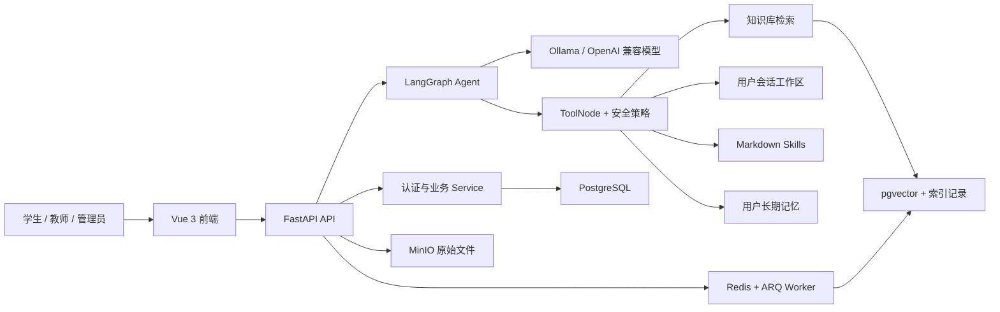

<!--
 @author: caoshuai.cs
 @date: 2026-07-31
 @description: LabAgent 产品定位、功能边界与总体架构介绍
-->

# 产品与架构

## 1. 产品定位

LabAgent 是面向高校实验教学的 Agentic RAG 平台。它把课程知识库、对话 Agent、受控工具、Markdown Skills 和用户记忆组合起来，帮助学生理解实验要求、使用教学平台、定位代码问题，并通过来源引用降低回答幻觉。

平台同时为教师和管理员提供知识资料维护、用户管理、能力扩展与效果评测入口，减少重复答疑成本。

## 2. 用户与典型场景

### 学生

- 围绕课程资料和实验要求提问，并查看回答引用的原始资料。
- 获取代码报错解释、排查顺序和实验报告指导。
- 在独立工作区内让 Agent 生成文件，并在界面中预览或下载产物；启用受控 Shell 后可执行允许的读取、搜索等命令。
- 管理 Agent 可跨会话使用的个人说明和长期 Profile。

### 教师与管理员

- 上传、更新、下载和删除课程知识库文档。
- 查看知识库异步处理状态并重试失败任务。
- 管理用户状态、角色与系统内置 Skills。
- 运行 RAG 评测，比较检索与回答质量。

## 3. 当前功能边界

当前仓库已包含：

- JWT 用户认证、角色校验和资源归属校验。
- 会话、消息、工具调用记录和自动会话标题。
- PDF、Markdown、TXT 知识文档入库与增量索引。
- MultiQuery、向量检索、BM25、RRF 和大模型 rerank 组成的三级检索。
- LangGraph Agent 工具循环、运行中断/恢复和 SSE 流式输出。
- 受控文件工具、默认关闭的 Shell 工具、知识库检索工具、Skills 工具和 Memory 工具。
- Markdown Skills 加载、校验、激活和参考资源读取。
- 会话上下文压缩与用户级长期记忆。
- Vue 3 管理页面、工具活动、思考片段和工作区文件预览。
- PostgreSQL + pgvector、Redis + ARQ、MinIO 和 Docker Compose 部署。

尚未落地的方向见[优化路线](../未来优化/优化路线.md)。

## 4. 总体架构

### 组件职责

| 组件 | 主要职责 |
|---|---|
| Vue 3 | 登录、对话、知识库、Skills、Memory 和流式活动展示 |
| FastAPI | API 契约、JWT 身份、权限、资源归属和业务编排 |
| LangGraph | 对话状态、工具循环、checkpoint、压缩和中断恢复 |
| PostgreSQL | 用户、会话、消息、工具记录、知识库元数据 |
| pgvector | 文档切片向量与相似度检索 |
| Redis + ARQ | 知识库上传后的异步解析与索引 |
| MinIO | 原始知识文档 |
| Tool Runner | 在隔离容器中执行受控 Shell |

## 5. 核心设计原则

- 框架优先：消息状态、checkpoint、ToolNode 和流式执行使用 LangGraph/LangChain，不手写同类框架能力。
- 契约统一：后端通过 `BaseResponse[T]` 返回普通 API，字段使用蛇形命名；SSE 是唯一主要例外。
- 身份可信：用户 ID 只从 JWT 获取，不接受请求体伪造。
- 最小授权：工具采用注册表、启用开关、策略校验和执行隔离多层控制。
- 来源可追溯：RAG 回答返回结构化引用，历史消息保留来源。
- 计划与现状分离：技术文档描述可验证实现，未来方案独立维护。
