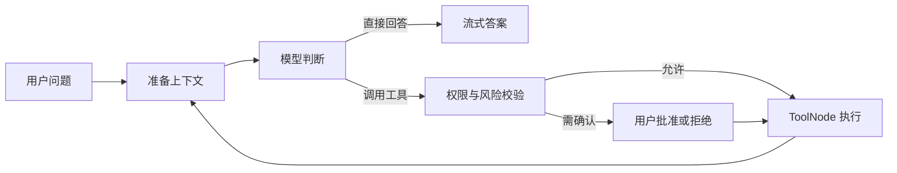

<!--
 @author: caoshuai.cs
 @date: 2026-07-31
 @description: LabAgent 面向用户的核心功能介绍
-->

# 核心功能

## 1. 知识库与可信问答

教师或管理员可上传 PDF、Markdown 和 TXT 资料。系统在后台完成解析、切分、向量化和索引，前端可查看任务阶段、失败原因并重试。

学生提问时，Agent 可自主调用知识库检索工具。系统同时使用语义向量和关键词召回，并对结果重排。回答中的引用以文件名、摘要和可用的相关度信息展示；刷新会话后引用仍可恢复。

## 2. Agent 对话

Agent 不只生成文本，还能根据任务选择工具并循环处理结果：

一次运行有最大轮数、重复调用和总超时限制。用户可以取消运行；高风险操作会暂停，等待明确批准或拒绝。

对话输入支持从文件选择器上传图片，也支持直接粘贴剪贴板图片。单轮最多 10 张、单张最大 10MB，当前允许 JPEG、PNG 和 WebP。图片随用户消息持久化，刷新历史会话后仍可查看；实际识图能力取决于所选模型是否支持视觉输入。

## 3. 受控工具

当前工具类型包括：

- 知识库：自主搜索课程资料。
- 文件：`write_file` 在当前用户、当前会话对应的工作区中生成文本文件，产物可预览或下载。
- Shell：在独立 Tool Runner 容器内执行受控命令，默认关闭。
- Skills：激活任务说明并按需读取参考资源。
- Memory：管理当前用户的个性化记忆。

细粒度读取、搜索工具当前未注册；启用 Shell 后，允许的只读命令可在 Tool Runner 中完成相应操作。工具并非获得主机任意访问权，系统会校验工具是否启用、参数是否合法、路径是否越界、命令是否命中禁止规则，以及操作是否需要审批。

## 4. Skills

Skills 是由 `SKILL.md` 描述的可复用任务方法，例如 Java 调试助手和实验报告写作助手。Agent 首先只看到名称与简介，任务匹配时再激活完整正文，必要时继续读取 `references/` 中的资料。

这种渐进披露方式避免把所有说明一次性塞入模型上下文，同时让教学方法可以独立维护。管理页支持查看已加载 Skills；管理员可刷新目录。

## 5. Agent Memory

Memory 分为两层：

- 短期记忆：由 LangGraph checkpoint 保存会话状态；上下文接近限制时自动摘要，也支持用户主动压缩。
- 个性化记忆：按用户隔离保存个人 `AGENTS.md` 和稳定偏好、背景与协作方式；明确要求记住时立即保存，普通对话在后台自动提取。用户可随时关闭，关闭后系统不再使用或更新这些信息。

自动提取不会改写用户手工维护的 `AGENTS.md`。用户可在管理页编辑 `AGENTS.md`，只读查看 `USER_PROFILE.md`。

## 6. 流式交互

对话接口使用 SSE 持续发送：

- 回答 token。
- 当前执行状态。
- 工具调用、结果、失败、超时和审批请求。
- Skills 加载信息。
- RAG 引用来源。
- 模型提供的可展示思考摘要。
- 完成或错误事件。

前端把工具事件聚合为活动列表，Shell 输出可展开，工作区文件可在侧栏预览或下载。模型输出、工具结果、文件内容和 Markdown 都应按不可信内容处理；当前 Markdown 原始 HTML 的已知安全缺口见[前端实现与安全](../技术实现/前端实现与安全.md#当前已知缺口)。

## 7. 管理能力

- 用户：注册、登录、密码更新、用户状态与管理员操作。
- 会话：创建、历史恢复、标题生成、单个或批量删除。
- 知识库：上传任务、分页、更新、下载、删除。
- Skills：列表、详情和管理员刷新。
- Memory：个人说明和个性化记忆管理。
- 反馈与评测：提交回答反馈，运行离线 RAG 评测。

具体代码入口和数据流见[技术实现](../README.md#技术实现)。
