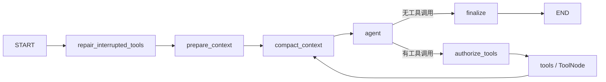

<!--
 @author: caoshuai.cs
 @date: 2026-07-31
 @description: LangGraph Agent、工具安全、SSE 与前端活动展示实现参考
-->

# Agent、工具与流式交互

## 1. 图结构

`backend/app/graph/chat_graph.py` 使用 `StateGraph + ToolNode` 实现 Agent 循环，不手写模型工具协议。



- `repair_interrupted_tools`：修复上次中断后未闭合的工具消息。
- `prepare_context`：注入用户说明、长期记忆目录、Skills 目录和运行上下文。
- `compact_context`：在模型调用前检查上下文预算并按需摘要。
- `agent`：绑定当前可见工具，生成 AIMessage 或工具调用。
- `authorize_tools`：执行白名单、参数、路径、风险、重复调用和审批判断。
- `tools`：由 `ToolNode` 执行合法调用，并补齐拒绝调用对应的 `ToolMessage`。
- `finalize`：形成最终输出并结束。

图使用 PostgreSQL checkpointer。`thread_id` 由用户和会话共同派生，既支持连续对话，也避免不同用户的同名会话串线。

## 2. 工具注册

`ToolRegistry` 是唯一注册入口，维护 `BaseTool`、来源、风险等级和只读属性。当前类型：

| 工具 | 说明 | 默认风险 |
|---|---|---|
| `search_knowledge_base` | 三级知识库检索 | 低 |
| `write_file` | 在会话工作区写入或追加文本 | 中 |
| `execute_shell` | Tool Runner 内执行受控命令 | 按命令低/中/高 |
| `activate_skill` / `read_skill_resource` | 激活 Skill、读取参考资源 | 低 |
| Memory 工具 | 查找、读取、记录、遗忘长期记忆 | 读低、写中 |

`all_tools()` 供 ToolNode 执行，`model_tools()` 根据功能开关决定模型可见工具。工具即使已注册，也不代表默认暴露。

新增工具的最小步骤：

1. 使用 `@tool` 和明确的参数模型定义工具。
2. 加入注册表并补充 `ToolMetadata`。
3. 在 `ToolPolicy` 中定义允许条件、风险和审批规则。
4. 补充 SSE 摘要、脱敏和单元测试。
5. 仅在确有需要时加入 `model_tools()`。

## 3. 安全与审批

工具执行前至少经过以下层次：

1. 全局和分类启用开关。
2. 注册表白名单。
3. 框架/Pydantic 参数校验。
4. 用户、会话和工作区绑定。
5. 路径、符号链接、大小和输出限制。
6. Shell 词法与命令风险策略。
7. 重复调用次数与 Agent 最大轮数。
8. 高风险操作中断和用户审批。
9. 超时、取消、结果截断与脱敏。

工作区根目录由 `TOOL_WORKSPACE_ROOT` 配置，实际路径按用户和会话隔离。客户端传入的路径必须是相对路径，解析后仍位于工作区内。

Shell 默认关闭。启用后仍拒绝提权、挂载、块设备、远程连接、容器控制及 `/dev`、`/proc`、`/sys` 等危险结构。只读命令低风险，写操作中风险，删除操作高风险并可要求审批。执行发生在只读根文件系统、降权、限 CPU/内存/PID 的 Tool Runner 容器内。

审批使用 LangGraph interrupt/checkpoint。恢复接口同时校验当前用户的会话归属和中断标识，拒绝不能被解释为执行。

## 4. 循环收敛与失败处理

- `AGENT_MAX_TOOL_ROUNDS` 限制单次运行最大工具轮数。
- 相同工具和相同参数超过重复阈值后被拒绝，避免无效循环。
- 工具、Shell 和整个 Agent 分别有超时。
- rerank、Skills 资源或非关键展示失败按各自边界降级。
- 取消请求绑定用户、会话和 trace，不能取消他人的运行。
- ToolNode 必须为每个工具调用生成对应 `ToolMessage`，保持消息协议闭合。

## 5. SSE 协议

`AiService` 通过图的异步流把事件编码为 SSE。事件外层保持：

```json
{
  "event_type": "tool_result",
  "data": {}
}
```

核心事件包括：

| `event_type` | 用途 |
|---|---|
| `token` | 助手答案增量 |
| `status` | 检索、工具、超时等阶段 |
| `tool_call` | 工具名、调用 ID 和安全处理后的参数 |
| `tool_result` | 状态、摘要、预览、耗时和错误 |
| `tool_approval_required` / `paused` | 高风险操作待确认、图已暂停 |
| `skill_loaded` / `skill_resource_loaded` | Skill 渐进披露 |
| `sources` | RAG 结构化引用 |
| `reasoning_token` / `reasoning_done` | 模型明确提供且允许展示的思考内容 |
| `session` / `final` | 会话初始化、本次流结束 |
| `error` | 可展示错误 |

精确字段以 `ai_service.py`、`chat_graph.py` 和前端事件解析为准。新增事件必须保持蛇形契约，并同时验证实时流和历史恢复。

## 6. 前端活动展示

`ToolActivityPanel.vue` 把原始事件按 `tool_call_id` 聚合为活动项：

- 运行中默认展开，完成后折叠。
- Shell 显示命令摘要，展开后显示已截断和脱敏的输出。
- 文件写入显示相对路径；可预览产物通过 `preview_path` 打开侧栏。
- Skills 激活显示为一项活动，资源读取成功通常不制造额外噪音。
- 失败、超时、拒绝、取消和待审批使用独立状态。

`ReasoningPanel.vue` 只展示模型接口明确返回的 reasoning 内容，不推导或暴露系统提示、隐藏链路、密钥和工具内部敏感信息。模型未提供时不伪造“思考过程”。

当前细粒度文件 Tool 只有 `write_file`。文件读取与搜索依赖启用后的受控 Shell 命令；工作区文件预览则是独立 API。该 API 先校验会话归属和路径，再执行文本大小、编码、截断和脱敏；不适合文本预览的文件只允许下载。

## 7. 持久化

- LangGraph checkpoint 保存运行状态、消息、Skills 激活和压缩摘要，用于下一轮与中断恢复。
- 业务消息表保存面向用户的稳定会话历史。
- 工具调用表保存可展示的调用状态、摘要和耗时。

三者职责不同。checkpoint 不能替代业务历史，业务历史也不能恢复图执行状态。
