<!--
 @author: caoshuai.cs
 @date: 2026-07-31
 @description: LabAgent RAG 建库、检索、引用与评测实现参考
-->

# RAG 与评测

## 1. 实现总览

LabAgent 的 RAG 分为建库和问答两条链路。检索不是固定前置步骤，而是注册为 `search_knowledge_base` 工具，由 Agent 根据问题自主调用。

```mermaid
flowchart TB
    subgraph 建库
        U["上传文件"] --> V["安全校验"]
        V --> M["MinIO + 业务记录"]
        M --> Q["Redis / ARQ"]
        Q --> L["解析为 Document"]
        L --> S["QA 或 Token 切分"]
        S --> E["Embedding"]
        E --> P["PGVector + RecordManager"]
    end
    subgraph 问答
        A["Agent 调用检索工具"] --> MQ["MultiQuery"]
        MQ --> H["向量 + BM25"]
        H --> RRF["RRF 融合"]
        RRF --> RR["LLM rerank"]
        RR --> C["结构化来源 + 检索上下文"]
        C --> G["Agent 继续回答"]
    end
```



## 2. 建库链路

### 2.1 上传与任务

`KnowledgeService` 校验文件名、大小、扩展名和 Content-Type，净化展示文件名后上传 MinIO。随后创建 `kb_file` 和 `kb_upload_task`，提交事务并投递 ARQ。

上传后的解析与索引在 `backend/app/workers/kb_upload_worker.py` 执行，避免大文件处理阻塞 API。任务记录保存阶段、状态、错误和重试次数。

知识库文件分页使用 Redis Cache-Aside 短缓存。缓存键包含知识库版本和查询参数摘要；
上传、更新、删除以及 Worker 处理成功或失败后递增版本，旧缓存由 TTL 自动清理。
活动任务和单任务状态保持直接查询，避免轮询读到过期状态。

### 2.2 解析与切分

`document_loader.py` 把 PDF、Markdown 和 TXT 转为 LangChain `Document`。

`document_splitter.py` 提供两种策略：

- QA 文档：检测 `---`、`Q:` 和 `A:`，每个完整问答对形成一个 chunk。
- 普通文档：使用 `RecursiveCharacterTextSplitter.from_tiktoken_encoder`，大小和重叠由 `RAG_CHUNK_SIZE`、`RAG_CHUNK_OVERLAP` 控制。

每个切片保留来源 metadata，供更新、删除和引用展示。

### 2.3 向量与增量索引

`rag_store.py` 使用：

- `PGVector` 保存切片和 embedding。
- `SQLRecordManager` 跟踪切片键。
- LangChain `index(..., cleanup="incremental")` 按 `source_id` 增量更新。

更新文档时，不变切片跳过，变化切片重建，旧切片清理。删除文档时先按 `source_id` 找到切片键，再删除向量与索引记录。业务记录、MinIO 和向量操作发生失败时按服务逻辑补偿，不能假设三种存储存在跨系统事务。

## 3. 三级检索

`rag_retrieval.py` 当前实现：

1. MultiQuery：模型从不同表述角度改写问题，并保留原问题。
2. 混合召回：PGVector 语义检索与 BM25 关键词检索分别召回。
3. RRF：`EnsembleRetriever` 对多路结果做倒数排名融合。
4. rerank：`LLMListwiseRerank` 精排并截取 `RAG_RERANK_TOP_N`。

BM25 对中文使用“英文/数字词 + 中文单字”的轻量分词。切片集合不变时复用内存索引；语料为空时降级为纯向量检索。

rerank 是增强步骤。关闭、超时或异常时按召回顺序截断，不让增强失败阻断整个回答。

## 4. Agent 集成与引用

`knowledge_tool.py` 将检索链封装成 `@tool("search_knowledge_base")`。工具参数由 Pydantic/LangChain 校验，执行过程通过状态事件告诉前端当前处于查询改写、召回或精排阶段。

检索结果同时产生：

- 供模型使用的文档上下文。
- 面向前端和历史消息的结构化 `sources`。

来源字段使用蛇形命名：

```json
{
  "file_name": "实验指导.md",
  "snippet": "……",
  "score": 0.83
}
```

混合检索与 rerank 没有天然可比的统一分数，因此只有 metadata 中存在可靠向量相关度时才返回 `score`，不能伪造精排分数。

## 5. 关键配置

| 配置 | 作用 |
|---|---|
| `OLLAMA_EMBEDDING_MODEL` | 向量模型 |
| `RAG_EMBEDDING_DIM` | 向量维度，必须与模型一致 |
| `RAG_CHUNK_SIZE` / `RAG_CHUNK_OVERLAP` | 普通文档切分 |
| `RAG_TOP_K` | 向量召回数量 |
| `RAG_BM25_TOP_K` | BM25 召回数量 |
| `RAG_MULTI_QUERY_COUNT` | 改写数量，不含额外保留的原问题 |
| `RAG_QUERY_REWRITE_MODEL` | 查询改写模型，留空时使用默认模型 |
| `RAG_RERANK_ENABLED` | 是否启用 rerank |
| `RAG_RERANK_TOP_N` | 精排输出数量 |
| `RAG_RERANK_MODEL` | 精排模型 |
| `RAG_RERANK_TIMEOUT_SECONDS` | 精排超时 |

准确默认值以 `.env.example` 和 `Settings` 为准。

## 6. 评测

评测入口为：

```bash
cd backend
uv run python -m app.eval.rag_eval --help
```

默认评测集路径是 `docs/rag_eval/RAG评测集样例.md`，默认报告输出到 `docs/rag_eval/reports/`。运行前应确认评测集实际存在；仓库中的 `docs/rag_eval/cmrc2018/` 提供数据准备脚本与历史输出。

评测覆盖两类结果：

- 检索：命中、Recall@K 等，观察正确上下文是否被召回。
- 生成：忠实度、回答相关性、上下文相关性等 RAGAS 指标。

推荐流程：

1. 固定评测集和模型配置，记录基线。
2. 一次只修改一个变量，例如切分、top_k、MultiQuery、BM25 或 rerank。
3. 同时比较质量、时延、失败率和模型调用成本。
4. 保存报告和配置快照，避免只凭单次主观示例判断。

`cmrc2018` 更适合验证流程和比较检索方案，最终质量判断仍应使用课程资料、实验问答和代码排错场景构成的领域评测集。

## 7. 常用排查

- 上传一直等待：检查 Redis、ARQ Worker、任务阶段和 Worker 日志。
- embedding 报错：检查 Ollama 地址、模型是否拉取及向量维度。
- 更新后仍检索旧内容：核对 `source_id`、RecordManager 记录和增量清理结果。
- 中文关键词召回差：确认 BM25 语料已重建且切片 metadata 完整。
- rerank 很慢：检查模型、输出 token 限制和超时降级日志。
- 有答案无引用：检查工具是否实际调用、`sources` SSE 是否发出、消息持久化是否保存来源。

未来的检索增强只记录在[优化路线](../未来优化/优化路线.md)，避免与当前实现混淆。
