# Web-Dev-For-Beginners：入门与开发工具

# 编程语言与现代开发工具简介

你好，未来的开发者！👋 我能告诉你一件每天都让我激动不已的事情吗？你即将发现编程不仅仅是关于计算机——它是赋予你把最疯狂的想法变为现实的超能力！

你知道使用你最喜欢的应用时，有那么一瞬间所有东西都完美契合吗？当你点击一个按钮，发生了某种绝对神奇的事情，让你忍不住惊呼“哇，他们是怎么做到的？” 那正是像你一样的人——可能凌晨两点坐在最喜欢的咖啡馆里，喝着第三杯浓缩咖啡——写出了创造那份魔力的代码。接下来要让你惊叹的是：在这节课结束时，你不仅会明白他们是怎么做到的，还会迫不及待地想自己尝试！

说实话，如果你现在觉得编程令人害怕，我完全理解。一开始我也觉得编程一定要是数学天才，或者从五岁起就开始写代码才行。但真正让我改变看法的是：编程就像学习一门新语言的交流。你起步于“你好”和“谢谢”，接着学会点咖啡，没多久就能谈哲学了！不过这次是和计算机“对话”，说实话？它们是你遇到过最耐心的“对话伙伴”——永不批评你的错误，永远兴奋地愿意再尝试一次！

今天，我们将探索那些让现代网页开发不仅可能而且极具吸引力的惊人工具。我说的正是 Netflix、Spotify 和你喜欢的独立应用工作室每天都在用的编辑器、浏览器和工作流程。最让你开心的是：这些专业级、行业标准工具大多数都是免费的！

图示：Intro Programming
> 草图由 [Tomomi Imura](https://twitter.com/girlie_mac) 绘制


## 来看看你已经知道些什么！

在进入有趣的内容之前，我很好奇——你对编程世界已经了解多少？听着，如果你看着这些问题想“我完全不知道这些东西”，没关系，这完全没问题！这就意味着你来对地方了。把这个测验当作运动前的热身——我们只是让脑子热身一下！

[参加课前测验](https://ff-quizzes.netlify.app/web/)

## 我们即将共同冒险的旅程

好吧，我对今天要探索的内容真的是兴奋得跳起来！说真的，我真希望我能看到当你理解某些概念时的表情。以下是我们共同踏上的精彩旅程：

- **什么是编程（以及为什么它是最酷的事情！）**——我们将发现代码是如何成为你周围一切的无形魔法推动力，从那个莫名其妙知道周一早晨的闹钟，到完美策划你 Netflix 推荐的算法
- <strong>编程语言及其奇妙个性</strong>——想象你进入一个聚会，每个人都拥有完全不同的超能力和解决问题的方式。编程语言的世界就像这样，你一定会喜欢认识它们！
- <strong>打造数字魔法的基础构件</strong>——把它们想象成终极创意乐高积木。理解这些零件如何组合后，你会发现自己真的可以建造出任何你想象中的东西
- <strong>让你感觉仿佛刚拿到魔法棒的专业工具</strong>——我并不夸张——这些工具会让你真切感受到拥有超能力，最棒的是？它们和专业人士用的一样！

> 💡 <strong>重点是</strong>：今天不要试图记住所有内容！现在，我只想让你感受到即将实现的那份激情。细节会随着我们一起练习自然而然地牢记——这才是真正的学习！

> 你也可以在 [Microsoft Learn](https://learn.microsoft.com/en-us/learn/modules/web-development-101/introduction-programming/?WT.mc_id=academic-77807-sagibbon) 上学习这节课！

## 那么，什么是<em>编程</em>？

好了，让我们来回答这个价值百万美元的问题：编程究竟是什么？

我给你讲个让我彻底改变看法的故事。上周我试图给妈妈讲怎么用我们新的智能电视遥控器。我发现自己老是说“按那个红色按钮，但不是大红按钮，是左边那个小红按钮……不，不，是你另一只手那边的左边……好了，现在按住两秒，不是一秒，也不是三秒……” 是不是很熟悉？😅

这就是编程！它是给非常强大的东西制定极其详细、一步步的指令的艺术，只不过你要把每条都讲清楚。唯一的区别是，你不是给妈妈解释（她可能会反问“哪个红按钮？”），而是给计算机解释（它只会严格执行你说的，哪怕那不是你真想表达的）。

我刚开始学时最让我震惊的是：计算机本质很简单。它们只懂两件事——1 和 0，基本上就是“是”和“否”或者“开”和“关”。仅此而已！神奇的地方在这——我们不必像《黑客帝国》那样用 1 和 0 交流。这时<strong>编程语言</strong>就派上用场了。它们就像是最棒的翻译官，将你正常的人类思维转换成计算机语言。

每天醒来时让我激动不已的是：你生活中<em>所有</em>数字内容，都是由像你一样的人创造的。可能穿着睡衣，拿着一杯咖啡，坐在笔记本电脑前敲代码。那个让你完美无瑕的 Instagram 滤镜？有人写了代码。推荐你新喜欢音乐的算法？开发者构建了它。帮你和朋友一起分摊晚饭账单的应用？有人想“这个好烦，我一定能改进”，然后……他们做到了！

当你学会编程时，不仅仅是在掌握一门新技能——你正在加入这个惊人的问题解决社区，他们每天思考着：“如果我能造点什么让别人一天变得更好一点？” 说真的，还有什么比这更酷的吗？

✅ <strong>趣味小知识狩猎</strong>：当你有空时，查查世界上第一位程序员是谁？提示：这可能不是你想象的那个人！这位先驱的故事绝对引人入胜，证明编程一直都是创造性解决问题和跳出框架思考的代名词。

### 🧠 **心情检视时间：你感觉如何？**

**静下心来想想：**
- “给计算机下指令”的概念现在对你来说通了吗？
- 你能想到某个想自动化的日常任务吗？
- 关于编程，你现在脑海中有哪些问题正在涌现？

> <strong>记住</strong>：即使某些概念现在有些模糊也完全正常。学习编程就像学习一门新语言，神经回路需要时间建立。你做得很棒！

## 编程语言就像不同风味的魔法

好，这听起来怪怪的，但跟我来——编程语言很像不同类型的音乐。试想：你有爵士乐，慵懒而即兴；摇滚，强劲直率；古典，高雅有序；还有嘻哈，创意丰富。每种风格有自己的氛围、激情粉丝群，适合不同心情和场合。

编程语言也完全如此！你不会用一样的语言去开发一个有趣的手机游戏，同时用它处理海量气候数据，就像你不会在瑜伽课上听死亡金属一样（嗯，大部分瑜伽课是这样 😄）。

但每次想到这点，都让我着迷：这些语言就像你身边有一个最耐心、最聪明的翻译官。你用符合人类思维的方式表达想法，他们负责复杂转换成计算机真正能理解的 1 和 0。就好比你有了那个能流利“人类创意”和“计算机逻辑”的朋友——他们永不疲倦，不需要咖啡休息，也绝不嘲笑你反复问同一个问题！

### 流行编程语言及其用途

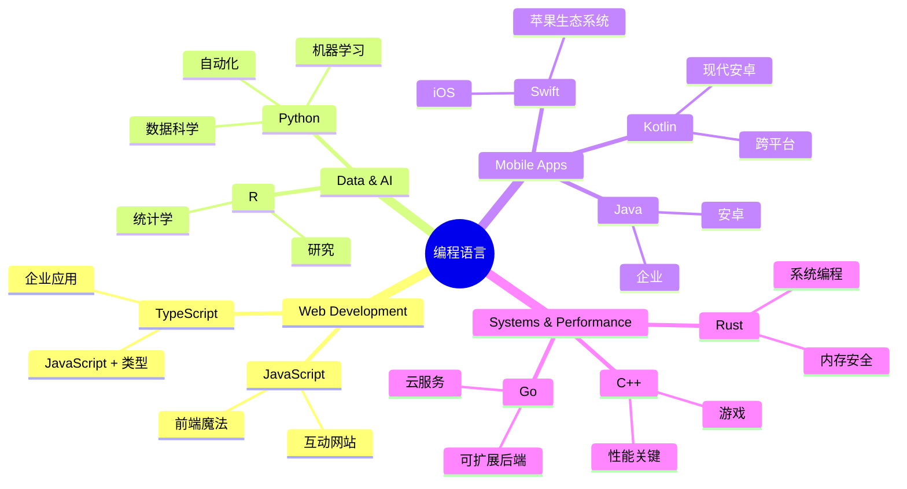
| 语言 | 适用范围 | 流行原因 |
|----------|----------|------------------|
| **JavaScript** | 网页开发，用户界面 | 运行在浏览器中，支持交互式网站 |
| **Python** | 数据科学，自动化，人工智能 | 易读易学，拥有强大库支持 |
| **Java** | 企业应用，安卓应用 | 跨平台，适合大型系统 |
| **C#** | Windows 应用，游戏开发 | 强大的微软生态支持 |
| **Go** | 云服务，后端系统 | 快速简洁，专为现代计算设计 |

### 高级语言 vs. 低级语言

说实话，这一概念一开始把我搞晕了，后来我用下面这个类比终于弄懂了——希望对你也有帮助！

想象你去一个完全不会说其语言的国家，急需找到最近的厕所（相信我，我们都经历过😅）：

- <strong>低级编程</strong> 就像你把当地方言学到可以跟卖水果的老奶奶侃大山，用文化典故、本地俚语、只有土生土长才能懂的“梗”。超级厉害且效率奇高……如果你懂的话！不过当你只是要找厕所时会超头疼。

- <strong>高级编程</strong> 就像你有个超棒的本地朋友懂你想表达啥。你只需用普通英语说“我真的需要找洗手间”，好友帮你翻译、指路，一切对你这个外地人来说都明明白白。

在编程世界：
- <strong>低级语言</strong>（比如汇编或 C）让你能和电脑硬件“详谈”，但你得像机器一样思考……这心理转变很大啊！
- <strong>高级语言</strong>（比如 JavaScript、Python 或 C#）让你保持人类思维，幕后帮你处理机器语言。他们还有超友好的社区，记得刚入门时的尴尬并真诚乐于帮忙！

猜你该从哪种语言开始学？😉 高级语言就像训练轮，根本不想摘掉，因为它们让整个学习过程更轻松愉快！

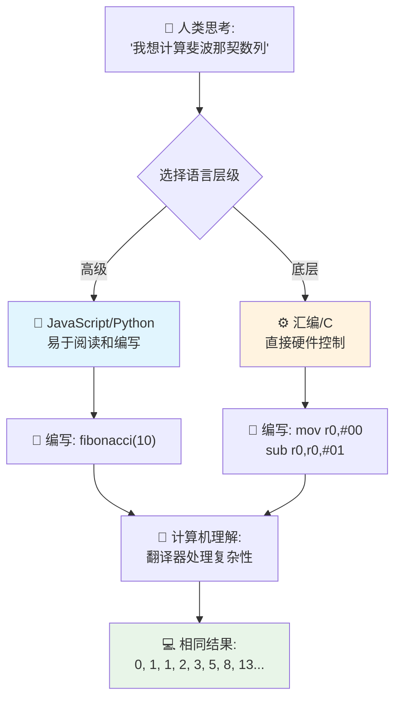
### 让我给你演示高级语言有多友好

好，我马上给你展示我为啥爱上高级语言。先跟我约定看到第一个代码示例时别慌！它看上去吓人是故意的，这正是我想讲的重点！

我们会对比两种完全不同风格的代码实现同一任务——生成斐波那契数列——这是个美妙的数学模式，每个数是前两个数字之和：0，1，1，2，3，5，8，13……（趣味知识：自然界随处可见这个规律——向日葵种子螺旋、松果纹理，甚至银河形成方式！）

准备好看区别吗？走起！

**高级语言（JavaScript）——人类友好：**

```javascript
// 第1步：基本的斐波那契数列设置
const fibonacciCount = 10;
let current = 0;
let next = 1;

console.log('Fibonacci sequence:');
```

**此代码做了以下事情：**
- <strong>声明</strong>一个常量，指定生成多少个斐波那契数
- <strong>初始化</strong>两个变量，追踪序列中的当前数和下一个数
- <strong>设定</strong>起始值（0 和 1），定义斐波那契模式
- <strong>显示</strong>输出头部信息

```javascript
// 第2步：使用循环生成序列
for (let i = 0; i < fibonacciCount; i++) {
  console.log(`Position ${i + 1}: ${current}`);

  // 计算序列中的下一个数字
  const sum = current + next;
  current = next;
  next = sum;
}
```

**这里发生了什么：**
- **用`for`循环**遍历序列每个位置
- <strong>用模板字符串</strong>格式显示每个数及其位置
- <strong>计算</strong>下一个斐波那契数（当前值加下一个值）
- <strong>更新</strong>追踪变量，进入下一次循环

```javascript
// 第3步：现代函数式方法
const generateFibonacci = (count) => {
  const sequence = [0, 1];

  for (let i = 2; i < count; i++) {
    sequence[i] = sequence[i - 1] + sequence[i - 2];
  }

  return sequence;
};

// 使用示例
const fibSequence = generateFibonacci(10);
console.log(fibSequence);
```

**上述代码还：**
- <strong>用现代箭头函数语法</strong>创建可复用函数
- <strong>构建了数组</strong>保存完整序列而不是逐个打印
- <strong>利用数组索引</strong>从之前值计算新数
- <strong>返回完整序列</strong>以便其他程序部分灵活使用

**低级语言（ARM 汇编）——计算机友好：**

```assembly
 area ascen,code,readonly
 entry
 code32
 adr r0,thumb+1
 bx r0
 code16
thumb
 mov r0,#00
 sub r0,r0,#01
 mov r1,#01
 mov r4,#10
 ldr r2,=0x40000000
back add r0,r1
 str r0,[r2]
 add r2,#04
 mov r3,r0
 mov r0,r1
 mov r1,r3
 sub r4,#01
 cmp r4,#00
 bne back
 end
```

你会发现 JavaScript 版本几乎像英语指令，而汇编版本则使用直接控制处理器的冷僻命令。两者实现完全相同的功能，但高级语言对人类来说更易懂、编写和维护。

**你会注意到的关键区别：**
- <strong>可读性</strong>：JavaScript 使用像 `fibonacciCount` 这样描述性强的名称，而汇编语言使用像 `r0`、`r1` 这样的晦涩标签
- <strong>注释</strong>：高级语言鼓励写解释性注释，使代码自带文档功能
- <strong>结构</strong>：JavaScript 的逻辑流程符合人类一步步思考问题的方式
- <strong>维护</strong>：针对不同需求更新 JavaScript 版本直观且清晰

✅ <strong>关于斐波那契数列</strong>：这个绝美的数字模式（其中每个数字都是前两个数字之和：0、1、1、2、3、5、8……）实际上在大自然中无处不在！你会在向日葵的螺旋、松球的图案、鸵蚌壳的曲线，甚至树枝的生长方式中发现它。数学和代码帮助我们理解并重现大自然用来创造美丽的模式，这真是令人惊叹！

## 让魔法发生的基本构件

好了，现在你已经看到编程语言的实际样子了，让我们拆解构成所有程序的基础部分。把它们想象成你最喜欢食谱中的必备原料——一旦你理解了每个部分的作用，你就能读懂并编写几乎任何语言的代码！

这有点像学习编程的语法。还记得学校里学名词、动词和造句吗？编程也有自己的“语法”，老实说，它比英文语法更合逻辑、更宽容！😄

### 语句：一步步的指令

先从 <strong>语句</strong> 开始——它们就像你和电脑对话中的单句子。每条语句指示电脑做一件具体的事情，就像给出方向：“这里左转”，“红灯停”，“停到那个车位”。

我喜欢语句的一点是它们通常非常可读。看这个例子：

```javascript
// 执行单个操作的基本语句
const userName = "Alex";
console.log("Hello, world!");
const sum = 5 + 3;
```

**这段代码做了什么：**
- <strong>声明</strong>一个常量变量来存储用户的名字
- <strong>向控制台</strong>输出问候信息
- <strong>计算</strong>并存储数学运算结果

```javascript
// 与网页交互的语句
document.title = "My Awesome Website";
document.body.style.backgroundColor = "lightblue";
```

**一步步来看看发生了什么：**
- <strong>修改</strong>浏览器标签页中显示的网页标题
- <strong>改变</strong>整个页面主体的背景颜色

### 变量：程序的记忆系统

好了，<strong>变量</strong>说实话是我最喜欢教的概念之一，因为它们非常像你每天都在用的东西！

想象一下你的手机通讯录。你不会记住所有人的电话号码，而是保存“妈妈”、“最好的朋友”或者“凌晨2点之前送餐的披萨店”，然后让手机记住具体号码。变量的作用就是这样！它们就像带标签的容器，程序可以把信息存在里面，然后通过有意义的名字叫出来。

最酷的是：变量可以在程序运行时变化（因此得名“变量”——你看这名字多贴切！）。就像你发现了更棒的披萨店时会更新联系人一样，变量也会随着程序学习新信息或情况变化而更新！

看看这多简单：

```javascript
// 第一步：创建基本变量
const siteName = "Weather Dashboard";
let currentWeather = "sunny";
let temperature = 75;
let isRaining = false;
```

**理解这些概念：**
- **在 `const` 变量中**存储不变的值（例如网站名称）
- **用 `let`** 存储程序运行中可能会改变的值
- <strong>分配</strong>不同数据类型：字符串（文本）、数字和布尔值（true/false）
- <strong>选择</strong>描述性名称解释变量内容

```javascript
// 第2步：使用对象来分组相关数据
const weatherData = {
  location: "San Francisco",
  humidity: 65,
  windSpeed: 12
};
```

**上面代码中，我们：**
- <strong>创建</strong>了一个对象，用于组合相关的天气信息
- <strong>将</strong>多条数据组织到一个变量名下
- <strong>用</strong>键值对清楚标注每条信息内容

```javascript
// 第3步：使用和更新变量
console.log(`${siteName}: Today is ${currentWeather} and ${temperature}°F`);
console.log(`Wind speed: ${weatherData.windSpeed} mph`);

// 更新可变变量
currentWeather = "cloudy";
temperature = 68;
```

**逐部分理解：**
- <strong>使用</strong>模板字符串 `${}` 来显示信息
- <strong>用</strong>点号表示法访问对象属性（`weatherData.windSpeed`）
- <strong>更新</strong>用 `let` 声明的变量以反映变化的条件
- <strong>组合</strong>多个变量来生成有意义的消息

```javascript
// 第4步：使用现代解构使代码更简洁
const { location, humidity } = weatherData;
console.log(`${location} humidity: ${humidity}%`);
```

**你需要知道的是：**
- <strong>用解构赋值</strong>从对象中提取特定属性
- <strong>自动创建</strong>与对象键同名的新变量
- <strong>简化</strong>代码，避免重复使用点号

### 控制流：教程序“思考”

好了，这里是绝对令人震撼的地方！<strong>控制流</strong>基本上就是教你的程序如何做出聪明决策，正如你每天毫不费力地做的事。

想象一下：今天早上你大概做了类似这样的判断：“如果下雨，我带伞；如果冷，我穿夹克；如果赶时间，我跳过早餐路上喝杯咖啡。”你的大脑每天都会无数次自然而然地遵循这种“如果-那么”的逻辑！

这就是让程序看起来聪明、有生命力、不再像流水线脚本的原因。它们可以实际观察情况，评估当前状态，并做出合适反应。就像给你的程序装上了一颗能适应环境、做出选择的大脑！

想看看它是怎么美妙工作的？我来给你演示：

```javascript
// 第一步：基本条件逻辑
const userAge = 17;

if (userAge >= 18) {
  console.log("You can vote!");
} else {
  const yearsToWait = 18 - userAge;
  console.log(`You'll be able to vote in ${yearsToWait} year(s).`);
}
```

**这段代码的作用：**
- <strong>检查</strong>用户年龄是否满足投票条件
- <strong>根据条件</strong>执行不同的代码块
- <strong>计算</strong>并显示未满18岁还需多久才有资格投票
- <strong>针对每种情况</strong>提供具体且有帮助的反馈

```javascript
// 第2步：使用逻辑运算符的多个条件
const userAge = 17;
const hasPermission = true;

if (userAge >= 18 && hasPermission) {
  console.log("Access granted: You can enter the venue.");
} else if (userAge >= 16) {
  console.log("You need parent permission to enter.");
} else {
  console.log("Sorry, you must be at least 16 years old.");
}
```

**这里发生了什么：**
- **用 `&&`（且）运算符**组合多个条件
- **用 `else if`** 创建多层条件判断体系
- **用最后的 `else`** 处理所有可能的其他情况
- <strong>为每种情况</strong>提供明确、可操作的反馈

```javascript
// 第3步：使用三元运算符的简洁条件语句
const votingStatus = userAge >= 18 ? "Can vote" : "Cannot vote yet";
console.log(`Status: ${votingStatus}`);
```

**你需要记住：**
- **使用条件（三元）运算符 (`? :`)** 表达简单的两选一条件
- **先写条件，紧跟`?`，然后是满足条件的结果，再写冒号`:`，最后是假时的结果**
- **当你需要根据条件给变量赋值时，使用这个模式**

```javascript
// 第4步：处理多个特定情况
const dayOfWeek = "Tuesday";

switch (dayOfWeek) {
  case "Monday":
  case "Tuesday":
  case "Wednesday":
  case "Thursday":
  case "Friday":
    console.log("It's a weekday - time to work!");
    break;
  case "Saturday":
  case "Sunday":
    console.log("It's the weekend - time to relax!");
    break;
  default:
    console.log("Invalid day of the week");
}
```

**这段代码实现了：**
- <strong>匹配变量值</strong>和多个具体案例
- <strong>将类似情况</strong>组合（工作日 vs. 周末）
- <strong>找到匹配时</strong>执行相应代码块
- **使用 `default`** 处理意外情况
- **用 `break` 语句** 防止继续执行后续案例

> 💡 <strong>现实世界类比</strong>：把控制流想象成世界上最耐心的 GPS 给你指路。它可能会说：“如果主街有堵车，就走高速。如果高速施工，试试风景路线。”程序用完全相同的条件逻辑智能地应对各种情况，总是为用户提供最佳体验。

### 🎯 **概念检查：构建模块掌握情况**

**来看看你对基础的理解：**
- 你能用自己的话解释变量和语句的区别吗？
- 想一个现实例子说明你会在什么情况下用 if-then 判断（比如我们的投票例子）
- 编程逻辑中，有什么让你感到惊讶的地方？

**快速信心提升：**
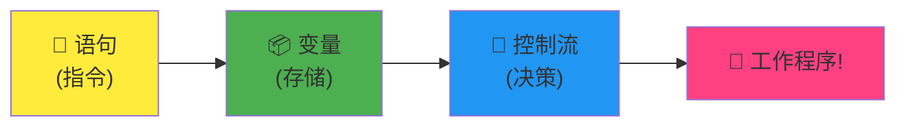
✅ <strong>接下来内容</strong>：我们将继续深入探讨这些概念，一路玩得开心！现在只要感受对未来各种奇妙可能的兴奋就好。具体技能和技巧自然会随着练习变得得心应手——保证比你想象的有趣多了！

## 工具介绍

好吧，坦白说我现在简直激动得不行！🚀 我们马上要聊的是那些让你感觉仿佛刚拿到数字宇宙飞船钥匙的神奇工具。

你知道厨师手中那些平衡极佳、像手臂扩展一样的刀具是什么感觉吗？或是音乐家那把刚被触碰就会唱歌的吉他？开发者们也有自己的“魔法工具”，让我爆料一波——它们中的大多数居然是完全免费的！

想到要跟你分享这些工具我已经兴奋得坐立不安了，因为它们彻底改变了我们构建软件的方式。我们说的是由 AI 驱动的代码助手，它们能帮你写代码（不是开玩笑！），基于云的开发环境可以让你随时随地有 Wi-Fi 都能做完整应用，调试工具强大到就像给程序装上了 X 光眼。

还有让我浑身起鸡皮疙瘩的是：这些可不是“初学者工具”，你用着会觉得棒极了，这正是 Google、Netflix 和你喜欢的那些独立应用工作室此刻正在使用的专业级工具。你用起来一定也会觉得自己超专业！

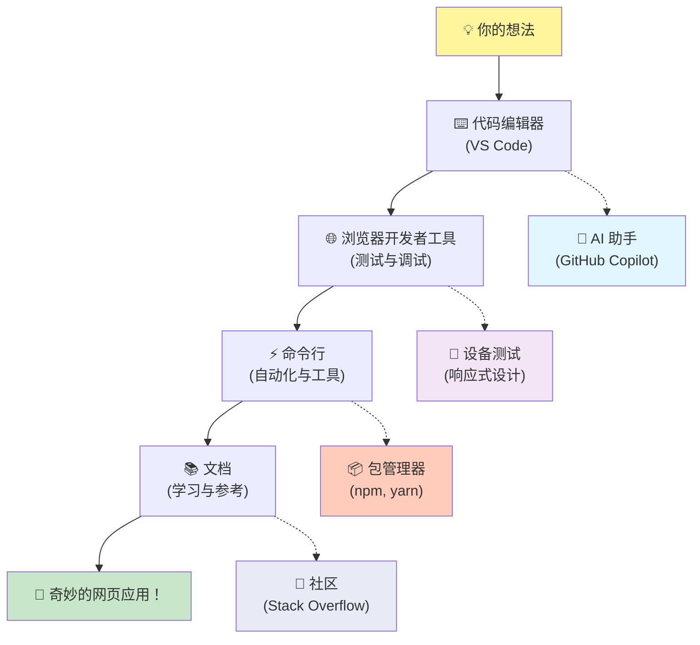
### 代码编辑器和 IDE：你的数字新好友

说说代码编辑器——这些将成为你新的最爱地盘！把它们看作你专属的编程圣地，大部分时间你都将在这里打造和完善数字作品。

现代编辑器的神奇之处在于：它们不仅仅是高级文本编辑器，更像是全天候在你旁边鼎力相助的天才导师。它们能在你察觉错字前帮你抓住，智能推荐让你代码写得像大神一样，帮你理解每行代码的功能，有些甚至能预测你要敲的内容并帮你补全思路！

我还记得第一次用到自动补全时的感觉，仿佛活在未来。你开始敲字，编辑器就“嗨，你是不是想调用这个正好符合需求的函数？”这简直像是有个心灵感应的编程伙伴！

**这些编辑器为何如此神奇？**

现代代码编辑器提供了令人印象深刻的功能，极大提升你的生产力：

| 功能 | 作用 | 益处 |
|---------|--------------|--------------|
| <strong>语法高亮</strong> | 用颜色区分代码的不同部分 | 让代码更易读，帮助发现错误 |
| <strong>自动补全</strong> | 输入时建议代码 | 加快编码速度，减少错别字 |
| <strong>调试工具</strong> | 帮助定位和修复错误 | 节省大量排查时间 |
| <strong>扩展功能</strong> | 添加专门的功能模块 | 可针对任意技术定制编辑器 |
| **AI助手** | 提供代码建议和解释 | 加速学习与编程效率 |

> 🎥 <strong>视频资源</strong>：想看看这些工具如何运作？请观看这段[工具介绍视频](https://youtube.com/watch?v=69WJeXGBdxg)了解详细内容。

#### 推荐用于 Web 开发的编辑器

**[Visual Studio Code](https://code.visualstudio.com/?WT.mc_id=academic-77807-sagibbon)**（免费）
- Web 开发者中的首选
- 优秀的扩展生态系统
- 内置终端和 Git 集成
- <strong>必装扩展</strong>：
  - [GitHub Copilot](https://marketplace.visualstudio.com/items?itemName=GitHub.copilot) - AI 驱动代码建议
  - [Live Share](https://marketplace.visualstudio.com/items?itemName=MS-vsliveshare.vsliveshare) - 实时协作
  - [Prettier](https://marketplace.visualstudio.com/items?itemName=esbenp.prettier-vscode) - 自动代码格式化
  - [Code Spell Checker](https://marketplace.visualstudio.com/items?itemName=streetsidesoftware.code-spell-checker) - 代码拼写检查

**[JetBrains WebStorm](https://www.jetbrains.com/webstorm/)**（付费，学生免费）
- 高级调试和测试工具
- 智能代码补全
- 内置版本控制

**云端 IDE**（多种价格）
- [GitHub Codespaces](https://github.com/features/codespaces) - 浏览器中的完整 VS Code
- [Replit](https://replit.com/) - 适合学习和分享代码
- [StackBlitz](https://stackblitz.com/) - 即刻启动的全栈 Web 开发

> 💡 <strong>入门建议</strong>：从 Visual Studio Code 开始——它免费、业界广泛使用，有庞大的社区提供教程和扩展。

### 网页浏览器：你的秘密开发实验室

准备好被完全震撼了吗！你平时用浏览器滚动社交媒体、看视频，但其实它们一直隐藏着一个惊人的秘密开发实验室，等着你去发现！

每次你右键点击网页选择“检查元素”，就打开了一个隐藏的开发者工具世界。这些工具强大得比我以前花几百美元买的软件还厉害。就像发现普通厨房背后藏着专业大厨基地的秘密开关一样！
第一次有人给我演示浏览器开发者工具的时候，我光是瞎点瞎点就花了三个小时，然后不断地惊呼：“等等，它居然还能这样？！”你真的可以实时编辑任何网站，准确地看到加载速度，测试你的网站在不同设备上的显示效果，甚至像专业人士一样调试 JavaScript。简直令人震惊！

**这就是浏览器成为你秘密武器的原因：**

当你创建网站或网络应用时，你需要看到它在现实世界中的外观和表现。浏览器不仅展示你的作品，还提供有关性能、可访问性和潜在问题的详细反馈。

#### 浏览器开发者工具（DevTools）

现代浏览器包含全面的开发套件：

| 工具类别 | 功能描述 | 示例用例 |
|---------------|--------------|------------------|
| <strong>元素检查器</strong> | 实时查看和编辑 HTML/CSS | 调整样式立即查看效果 |
| <strong>控制台</strong> | 查看错误信息和测试 JavaScript | 调试问题和尝试代码 |
| <strong>网络监视器</strong> | 跟踪资源加载情况 | 优化性能和加载速度 |
| <strong>可访问性检查器</strong> | 测试包容性设计 | 确保网站适合所有用户 |
| <strong>设备模拟器</strong> | 预览不同屏幕尺寸 | 无需多台设备测试响应式设计 |

#### 推荐的开发浏览器

- **[Chrome](https://developers.google.com/web/tools/chrome-devtools/)** - 行业标准的 DevTools，文档丰富
- **[Firefox](https://developer.mozilla.org/docs/Tools)** - 出色的 CSS Grid 和可访问性工具
- **[Edge](https://docs.microsoft.com/microsoft-edge/devtools-guide-chromium/?WT.mc_id=academic-77807-sagibbon)** - 基于 Chromium，拥有微软开发资源

> ⚠️ <strong>重要测试提示</strong>：务必在多个浏览器中测试你的网站！在 Chrome 上完美运行的内容，在 Safari 或 Firefox 可能会有不同表现。专业开发者会在所有主流浏览器中测试，以确保一致的用户体验。

### 命令行工具：开发者超级力量的大门

好了，我们来个坦白时刻聊聊命令行，因为我想让你听听一个真正懂它的人说说感受。一开始我看到那个——黑漆漆的屏幕上闪烁着文字——直接想：“不，不行！这看起来就像80年代黑客电影里的东西，我肯定没那个头脑！”😅

但我当时希望有人告诉我，现在我也想告诉你：命令行其实一点都不可怕——它就像你和电脑在直接对话。想象一下，这就好比你不是用附带图片和菜单的精美应用点餐（那很简单），而是走进你最爱的当地餐馆，厨师知道你喜欢什么，你一句“给我惊喜”的话，他就能做出完美美味。

命令行是开发者感受魔力的地方。你输入几个看似神奇的词（其实就是命令，但感觉很神奇！），按回车，哔——你可以创建整个项目结构，安装来自全世界的强大工具，或者把应用部署到互联网上供数百万人访问。一旦尝过这种力量，真是让人上瘾！

**命令行将成为你最喜欢工具的理由：**

虽然图形界面适合许多任务，但命令行在自动化、精确和速度上无可匹敌。许多开发工具主要通过命令行接口工作，学会高效使用它们能显著提升你的生产力。

```bash
# 第一步：创建并进入项目目录
mkdir my-awesome-website
cd my-awesome-website
```

**这段代码做了什么：**
- <strong>创建</strong>一个名为"my-awesome-website"的新目录用于你的项目
- <strong>进入</strong>新建目录开始工作

```bash
# 第2步：使用 package.json 初始化项目
npm init -y

# 安装现代开发工具
npm install --save-dev vite prettier eslint
npm install --save-dev @eslint/js
```

**一步步来看发生了什么：**
- 使用 `npm init -y` <strong>初始化</strong>一个默认配置的新 Node.js 项目
- <strong>安装</strong> Vite 作为现代构建工具用于快速开发和生产构建
- <strong>添加</strong> Prettier 进行自动代码格式化，ESLint 检查代码质量
- 使用 `--save-dev` 标记它们为仅开发环境依赖

```bash
# 第3步：创建项目结构和文件
mkdir src assets
echo '<!DOCTYPE html><html><head><title>My Site</title></head><body><h1>Hello World</h1></body></html>' > index.html

# 启动开发服务器
npx vite
```

**以上操作包括：**
- <strong>组织</strong>项目，创建源码和资源分别存放的文件夹
- <strong>生成</strong>结构完整的基本 HTML 文件
- <strong>启动</strong> Vite 开发服务器实现实时重载和热模块替换

#### Web 开发必备命令行工具

| 工具 | 作用 | 你需要它的理由 |
|------|---------|-----------------|
| **[Git](https://git-scm.com/)** | 版本控制 | 追踪更改、协作与备份 |
| **[Node.js & npm](https://nodejs.org/)** | JavaScript 运行时与包管理 | 在浏览器外运行 JS，安装现代开发工具 |
| **[Vite](https://vitejs.dev/)** | 构建工具与开发服务器 | 极速开发与热模块替换 |
| **[ESLint](https://eslint.org/)** | 代码质量 | 自动发现并修复 JS 问题 |
| **[Prettier](https://prettier.io/)** | 代码格式化 | 保持代码格式统一易读 |

#### 不同平台的选择

**Windows:**
- **[Windows Terminal](https://docs.microsoft.com/windows/terminal/?WT.mc_id=academic-77807-sagibbon)** - 现代化功能丰富的终端
- **[PowerShell](https://docs.microsoft.com/powershell/?WT.mc_id=academic-77807-sagibbon)** 💻 - 强大的脚本环境
- **[命令提示符](https://learn.microsoft.com/windows-server/administration/windows-commands/windows-commands)** 💻 - 传统 Windows 命令行

**macOS:**
- **[Terminal](https://support.apple.com/guide/terminal/)** 💻 - 内置终端应用
- **[iTerm2](https://iterm2.com/)** - 功能增强型终端

**Linux:**
- **[Bash](https://www.gnu.org/software/bash/)** 💻 - 标准 Linux Shell
- **[KDE Konsole](https://docs.kde.org/trunk5/en/konsole/konsole/index.html)** - 高级终端模拟器

> 💻 = 操作系统预装

> 🎯 <strong>学习路径</strong>：先掌握基本命令如 `cd`（切换目录），`ls` 或 `dir`（列出文件），`mkdir`（创建文件夹）。练习现代工作流命令如 `npm install`，`git status`，`code .`（在 VS Code 打开当前目录）。熟悉后自然能掌握更高级命令和自动化技巧。

### 文档：你随时可依赖的学习导师

好，我来透露一个让你作为初学者心里踏实点的小秘密：即便是最有经验的开发者也会花大量时间阅读文档。这不是因为他们不懂，而是智慧的表现！

可以把文档看作全球最耐心、知识最丰富的老师，全天候在线。凌晨两点卡在问题上？文档给你温暖的虚拟拥抱，恰到好处的答案。想了解热门新功能？文档带你一步步学。试图理解为什么某个东西会这样工作？没错，文档就是帮你“恍然大悟”的那把钥匙！

这彻底改变我看法的一点是：网络开发变化非常快，没人（真的没人！）能背下所有东西。我见过有 15 年经验的高级开发者查基础语法，知道吗？这不丢脸——那是聪明！不是完美记忆，而是知道快速找到可靠答案的方法，并懂得如何应用。

**真正的魔力在哪里：**

专业开发者大量时间用来阅读文档——不是因为他们不懂，而是网络开发领域更新太快，保持领先需要不断学习。优秀文档不仅告诉你<em>怎么用</em>东西，更说明<em>为什么</em>和<em>何时</em>用。

#### 必备文档资源

**[Mozilla Developer Network (MDN)](https://developer.mozilla.org/docs/Web)**
- 网页技术文档的黄金标准
- HTML、CSS 和 JavaScript 全面指南
- 包含浏览器兼容性信息
- 具实用示例和互动演示

**[Web.dev](https://web.dev)**（谷歌出品）
- 现代网络开发最佳实践
- 性能优化指南
- 可访问性和包容性设计原则
- 真实项目案例研究

**[Microsoft Developer Documentation](https://docs.microsoft.com/microsoft-edge/#microsoft-edge-for-developers)**
- Edge 浏览器开发资源
- 渐进式 Web App 指南
- 跨平台开发见解

**[Frontend Masters 学习路径](https://frontendmasters.com/learn/)**
- 结构化学习课程
- 行业专家视频课程
- 实战编码练习

> 📚 <strong>学习策略</strong>：别试图死记文档，学会高效浏览才重要。收藏常用文档，多练习用搜索功能快速找到所需信息。

### 🔧 **工具掌握度自测：你最共鸣的是？**

**花点时间想想：**
- 你最想先试哪个工具？（答案无对错！）
- 命令行还让你害怕吗，还是渐渐好奇了？
- 你能想象用浏览器 DevTools 去窥探你最喜欢网站的“幕后”吗？

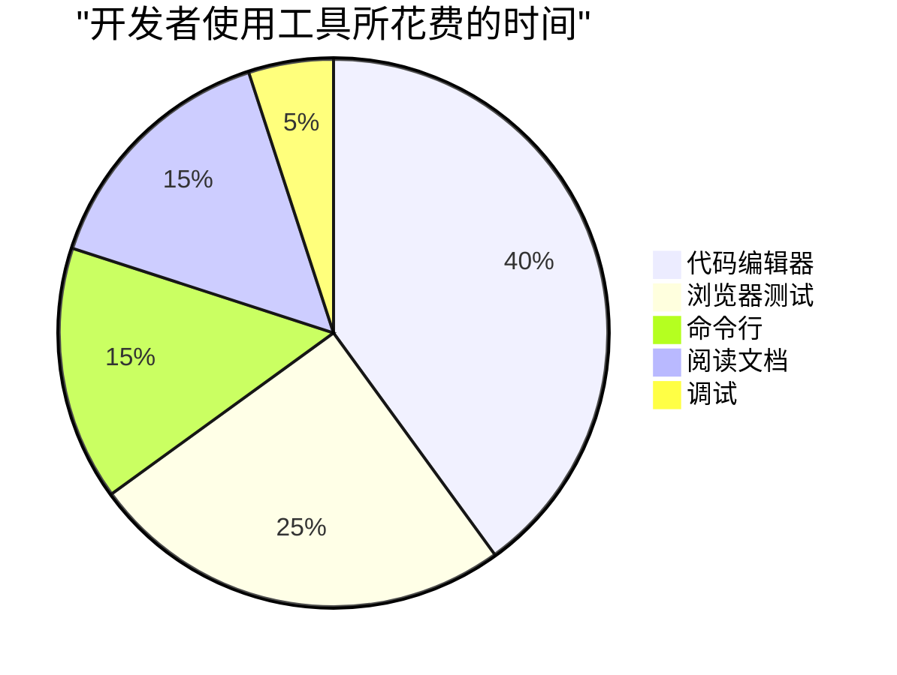
> <strong>有趣的见解</strong>：多数开发者约 40% 时间花在代码编辑器里，但更多时间用于测试、学习和解决问题。编程不仅是写代码，更是打造体验！

✅ <strong>思考点</strong>：思考一个有趣问题——构建网站的工具（开发）和设计网站外观的工具（设计）可能有什么不同？就像建筑师设计漂亮房子和承包商真正建造一样。两者都关键，但需要不同的工具箱！这种思路能帮你更好理解网站诞生的全貌。

## GitHub Copilot Agent 挑战 🚀

使用 Agent 模式完成以下挑战：

**描述：** 探索现代代码编辑器或 IDE 的功能，展示它如何提升你作为网页开发者的工作流程。

**提示：** 选择一个代码编辑器或 IDE（如 Visual Studio Code、WebStorm 或云端 IDE）。列出三个帮助你更高效编写、调试或维护代码的功能或扩展。简要说明它们对你工作流程的好处。

## 🚀 挑战

**好了，侦探，准备好接第一单案子吗？**

既然你已经打下了坚实基础，这次冒险将帮助你认识编程世界多么丰富多彩、有趣。而且听着——这还不是写代码的时候，完全无压力！把你当作编程语言侦探，踏上第一单激动人心的案件！

**你的任务，如果你愿意接受：**
1. <strong>成为语言探索者</strong>：选三种来自完全不同领域的编程语言——也许一个用于建网站，一个做移动应用，另一个助科学家分析数据。找到每种语言写的同一简单任务示例。我保证你会惊叹它们虽然做同样事，却长得多么不一样！
2. <strong>挖掘起源故事</strong>：每种语言有什么特别之处？有个酷事实——每种语言诞生，都是因为有人想：“解决这个问题一定有更好方式。”你能找出那个问题是什么吗？这些故事往往非常有趣！
3. <strong>见见社区</strong>：看看每种语言社区多么热情友好。有的有数百万开发者互帮互助，有的虽小但紧密团结。你会喜欢了解这些社区各自的个性！
4. <strong>跟随直觉</strong>：哪种语言现在看起来最容易上手？别急着找“完美”答案——相信你的直觉！真的没有错误答案，而且你以后可以随时探索其他语言。

<strong>额外侦探任务</strong>：看看能否发现哪些主流网站或应用用每种语言开发。我保证你会被 Instagram、Netflix 或那个让你停不下来的手游背后的技术震惊！

> 💡 <strong>记住</strong>：你今天不是要成为这些语言专家，只是在决定“落脚点”前先逛逛附近。放轻松，玩得开心，让好奇心带路！

## 来庆祝你的新发现吧！

天哪，你今天吸收了这么多不可思议的信息！我真的很兴奋看到你对这段精彩旅程的理解。记住——这不是必须完全正确的测试，而是庆祝你对这个迷人世界学到的所有酷知识的时刻！

[参加课后测验](https://ff-quizzes.netlify.app/web/)

## 复习与自学

**慢慢探索，玩得开心！**
你今天已经学了很多东西，这值得你骄傲！现在有趣的部分来了——探索那些激发你好奇心的主题。记住，这不是作业——而是一场冒险！

**深入探索让你兴奋的内容：**

**动手体验编程语言：**
- 访问你感兴趣的2-3个编程语言的官方网站。每种语言都有自己独特的个性和故事！
- 试试一些在线编码平台，比如 [CodePen](https://codepen.io/)、[JSFiddle](https://jsfiddle.net/) 或 [Replit](https://replit.com/)。不要害怕尝试——你不会破坏任何东西！
- 阅读你喜欢的编程语言是如何诞生的。真的，有些起源故事非常有趣，能帮助你理解语言为什么会以这样的方式运作。

**熟悉你的新工具：**
- 如果还没下载 Visual Studio Code，赶快下载吧——它是免费的，你会喜欢它的！
- 花几分钟浏览一下扩展市场。它就像你的代码编辑器的应用商店！
- 打开浏览器的开发者工具，随便点点。别担心马上理解所有东西——先熟悉它们的存在就好。

**加入社区：**
- 关注一些开发者社区，比如 [Dev.to](https://dev.to/)、[Stack Overflow](https://stackoverflow.com/) 或 [GitHub](https://github.com/)。编程社区对新人非常友好！
- 在 YouTube 上观看一些适合初学者的编程视频。有很多优秀的创作者会记得刚开始时的感受。
- 考虑参加本地聚会或加入线上社区。相信我，开发者们很乐意帮助新手！

> 🎯 **听着，我希望你记住的是**：你不需要一夜之间成为编程高手！现在，你只是开始认识你即将加入的这个惊奇世界。慢慢来，享受这段旅程，记住——每一个你崇拜的开发者，都曾坐在你的位置上，感到既兴奋又有点不知所措。这完全正常，意味着你走在正确的路上！

## 任务

[Reading the Docs](assignment.md)

> 💡 <strong>给你任务的小提示</strong>：我非常希望看到你去探索一些我们还没涉及过的工具！跳过我们已经讨论过的编辑器、浏览器和命令行工具——外面有一整个令人惊叹的开发工具世界等待你去发现。挑选那些活跃维护且拥有活跃帮助社区的工具（通常这些工具有最棒的教程，以及当你卡住时最乐于助人的人群）。

## 🚀 你的编程旅程时间表

### ⚡ **接下来5分钟你可以做的事**
- [ ] 收藏2-3个引起你兴趣的编程语言网站
- [ ] 如果还没下载，安装 Visual Studio Code
- [ ] 打开浏览器的开发者工具（F12），随意浏览任何网站
- [ ] 加入一个编程社区（Dev.to、Reddit r/webdev，或 Stack Overflow）

### ⏰ <strong>这一小时你可以完成的任务</strong>
- [ ] 完成课后测验并反思你的答案
- [ ] 配置 VS Code，安装 GitHub Copilot 扩展
- [ ] 在线尝试用两种不同的编程语言写一个“Hello World”示例
- [ ] 在 YouTube 上观看一条“开发者的一天”视频
- [ ] 开始你的编程语言侦探之旅（挑战内容）

### 📅 <strong>你的一周冒险计划</strong>
- [ ] 完成任务并探索3个新的开发工具
- [ ] 关注5位开发者或编程账号的社交媒体
- [ ] 在 CodePen 或 Replit 上尝试做点小东西（哪怕只是“Hello, [你的名字]！”）
- [ ] 阅读一篇开发者博客，了解他们的编程历程
- [ ] 参加一次线上聚会或观看一次编程讲座
- [ ] 开始用在线教程学习你选择的语言

### 🗓️ <strong>你一个月的转变</strong>
- [ ] 构建你的第一个小项目（即使是一个简单的网页也算！）
- [ ] 参与开源项目（从文档修正开始）
- [ ] 指导一个刚开始编程的人
- [ ] 创建你的开发者个人网站作品集
- [ ] 连接本地的开发者社区或学习小组
- [ ] 开始规划你的下一个学习目标

### 🎯 <strong>最终反思检查</strong>

**在前进之前，花点时间庆祝一下：**
- 今天让你对编程感到兴奋的是什么？
- 你最想先探索哪个工具或概念？
- 你对开始这段编程旅程的感觉如何？
- 你现在最想问开发者的一个问题是什么？


> 🌟 <strong>记住</strong>：每个专家曾经都是新手。每个高级开发者曾经和你现在一样——兴奋，也许有点不知所措，当然还有对可能性的好奇。你现在处于一个了不起的大家庭中，这段旅程将会令人难以置信。欢迎来到奇妙的编程世界！ 🎉

**免责声明**：
本文件使用 AI 翻译服务 [Co-op Translator](https://github.com/Azure/co-op-translator) 进行翻译。尽管我们力求准确，但请注意，自动翻译可能包含错误或不准确之处。原始文档的本国语言版本应被视为权威来源。对于重要信息，建议使用专业人工翻译。对于因使用此翻译而产生的任何误解或错误解释，我们概不负责。

# Assignment: 探索现代网络开发工具

## Instructions

网络开发生态系统包含数百种专门的工具，帮助开发者高效地构建、测试和维护应用程序。你的任务是研究并了解补充本课所涵盖内容的工具。

**你的任务：**选择**三个工具**，这些工具**未在本课中涵盖**（避免选择已列出的代码编辑器、浏览器或命令行工具）。重点关注解决现代网站开发工作流中特定问题的工具。

**针对每个工具，请提供：**

1. **工具名称和类别**（例如“Figma - 设计工具”或“Jest - 测试框架”）
2. **用途和优势** - 用2-3句话解释为什么网络开发者会使用该工具以及它解决了哪些问题
3. **官方文档链接** - 提供该工具的官方文档或网站链接（而非仅教程网站）
4. **实际应用场景** - 简要说明该工具如何融入专业开发工作流程

## 建议的工具类别

可以考虑探索以下类别的工具：

| 类别 | 示例 | 功能描述 |
|----------|----------|--------------|
| **构建工具** | Vite, Webpack, Parcel, esbuild | 打包和优化生产代码，提供快速开发服务器 |
| **测试框架** | Vitest, Jest, Cypress, Playwright | 确保代码正确运行，及早捕获缺陷 |
| **设计工具** | Figma, Adobe XD, Penpot | 协作创建原型、模型和设计系统 |
| **部署平台** | Netlify, Vercel, Cloudflare Pages | 自动化CI/CD托管和分发网站 |
| **版本控制** | GitHub, GitLab, Bitbucket | 管理代码更改、协作与项目流程 |
| **CSS框架** | Tailwind CSS, Bootstrap, Bulma | 利用预构建组件库加速样式开发 |
| **包管理器** | npm, pnpm, Yarn | 安装和管理代码库依赖 |
| **无障碍工具** | axe-core, Lighthouse, Pa11y | 测试包容性设计和WCAG合规性 |
| **API开发** | Postman, Insomnia, Thunder Client | 开发过程中测试和编写API文档 |

## 格式要求

**每个工具：**
```
### [Tool Name] - [Category]

**Purpose:** [2-3 sentences explaining why developers use this tool]

**Documentation:** [Official website/documentation link]

**Workflow Integration:** [1 sentence about how it fits into development process]
```

## 质量指导原则

- **选择当前工具**：选择2025年仍在积极维护且广泛使用的工具
- **聚焦价值**：解释具体优势，而非仅描述功能
- **专业背景**：考虑团队使用的工具，而非仅限个人爱好者
- **多样化选择**：从不同类别中挑选，展示生态多样性
- **现代相关性**：优先符合当前网络开发趋势和最佳实践的工具

## 评分标准

| 优秀 | 良好 | 需改进 |
|-----------|------|-------------------|
| **清晰解释为何开发者使用该工具及解决的问题** | **解释了工具作用但缺少价值上下文** | **仅列出工具名称，未解释用途或优势** |
| **为所有工具提供官方文档链接** | **大多为官方链接，含少量教程网站** | **主要依赖教程网站，缺少官方文档** |
| **选择当前被广泛专业使用、类别多样的工具** | **选择工具不错但类别较单一** | **选用过时工具或仅限某一类别** |
| **展示了解工具在开发流程中的应用** | **部分体现专业应用背景** | **仅聚焦工具功能，缺工作流上下文** |

> 💡 **研究建议**：关注招聘网站中提及的网络开发工具，查看热门开发者调查，或分析GitHub上成功开源项目的依赖项！

**免责声明**：
本文件使用 AI 翻译服务 [Co-op Translator](https://github.com/Azure/co-op-translator) 进行翻译。虽然我们努力确保准确性，但请注意自动翻译可能包含错误或不准确之处。原始语言版本的文件应视为权威来源。对于重要信息，建议采用专业人工翻译。对于因使用本翻译而产生的任何误解或误释，我们不承担任何责任。

# GitHub简介

嗨，未来的开发者！👋 准备好加入全球数百万程序员的行列了吗？我真心兴奋地向你介绍GitHub——把它想象成程序员的社交媒体平台，不过我们分享的不是午餐照片，而是代码，共同构建令人难以置信的东西！

让我大开眼界的是：你手机上的每个应用、你访问的每个网站，以及你将学会使用的大多数工具，都是由开发团队在类似GitHub的平台上协作完成的。你喜欢的那个音乐应用？就有像你一样的人参与其中。那个让你爱不释手的游戏？没错，可能就是通过GitHub协作完成的。现在，你将学会如何成为这个惊人社区的一员！

我知道一开始可能觉得信息量很大——说实话，我第一次看到GitHub页面时也懵了，“这到底是啥意思？”但事实是：每一个开发者都从你现在的位置开始。课程结束时，你将拥有自己的GitHub仓库（把它想象成云端的个人项目展示），你会知道如何保存工作，与他人分享，甚至为数百万用户使用的项目做贡献。

我们将一步步一起出发。没有急躁，没有压力——只有你我和一些即将成为你新朋友的酷炫工具！

图示：Intro to GitHub
> 速记图由 [Tomomi Imura](https://twitter.com/girlie_mac) 制作

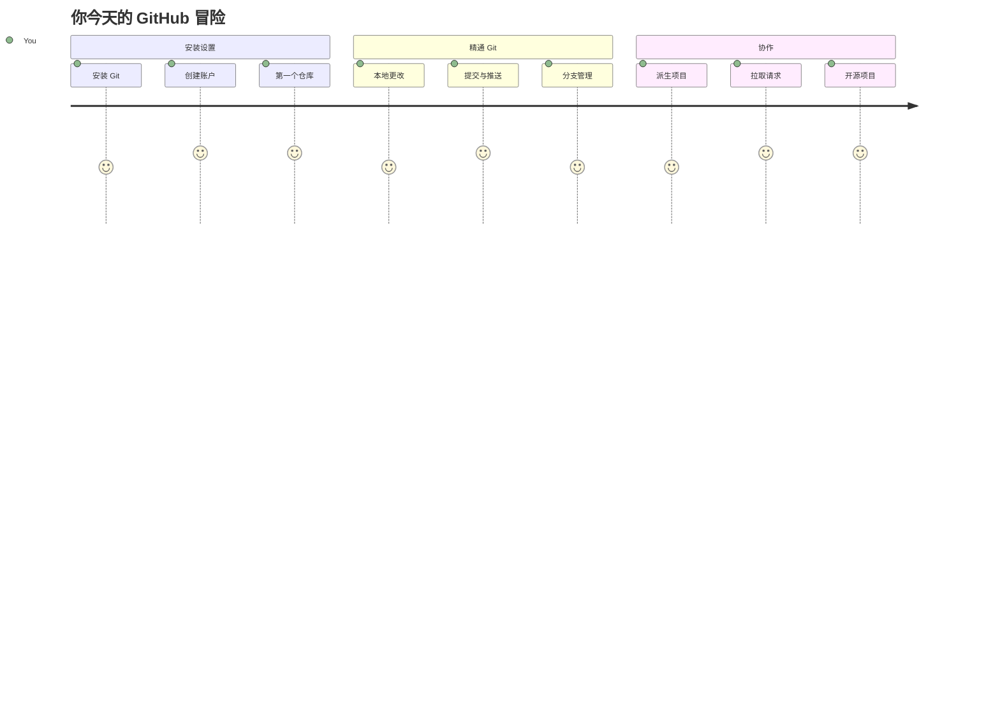
## 课前测验
[课前测验](https://ff-quizzes.netlify.app)

## 介绍

在开始真正令人兴奋的内容之前，先让你的电脑准备好迎接GitHub的魔法吧！把这看作是在创作杰作前整理好艺术用品——准备好合适的工具让整个过程更流畅、更有趣。

我会一步步带你完成每个设置步骤，保证过程没你想象的那么吓人。如果一开始没有立刻理解也没关系！我记得当初搭建第一个开发环境时，感觉自己像是在看古埃及象形文字。每个开发者都经历过你现在的阶段，怀疑自己是不是做对了。剧透一下：既然你来了这里学习，说明你已经在正确的路上了！🌟

这节课，我们会涵盖：

- 追踪你在电脑上的工作
- 与他人协作项目
- 如何为开源软件做贡献

### 先决条件

让我们先让电脑准备好迎接GitHub的魔法！别担心——这只是一次性的设置，完成后整个编码之旅都会顺利。

好，先从基础开始！我们先检查电脑上是否已经安装了Git。Git基本上就像一个超级智能的助理，能记录你代码的每一次改动——比你两秒按一次Ctrl+S强多了（我们都有过！）。

在终端输入这个魔法命令看一下Git是否安装：
`git --version`

如果还没安装Git，别着急！去[下载Git](https://git-scm.com/downloads)把它装上。安装完，我们需要正式介绍Git给你认识：

> 💡 **首次设置**：这些命令告诉Git你的身份。每次提交都会附带这些信息，所以请选择你愿意公开分享的名字和邮箱。

```bash
git config --global user.name "your-name"
git config --global user.email "your-email"
```

你能通过输入以下命令检查Git是否已经配置：
```bash
git config --list
```

你还需要一个GitHub账户，一个代码编辑器（比如Visual Studio Code），并打开你的终端（命令提示符也可以）。

访问 [github.com](https://github.com/) ，如果还没有账户就创建一个，或者登录并完善你的个人资料。

💡 **现代建议**：考虑设置[SSH密钥](https://docs.github.com/en/authentication/connecting-to-github-with-ssh)或使用[GitHub CLI](https://cli.github.com/)实现无需密码的更便捷认证。

✅ GitHub不是唯一的代码仓库，但它是最知名的。

### 准备工作

你需要在本地（笔记本或PC）有一个包含代码项目的文件夹，并且在GitHub有一个公开仓库，这将作为学习如何为他人项目做贡献的范例。

### 保护你的代码安全

聊聊安全——别担心，我们不会让你听得头疼！把这些安全措施想象成锁车或锁门，是简单易养成的习惯，能保护你的辛勤成果。

我们将从一开始就用现代、安全的方式使用GitHub。这样你将培养出良好的习惯，这些习惯在你整个编码生涯都会发挥作用。

使用GitHub时，遵守安全最佳实践很重要：

| 安全领域 | 最佳实践 | 为什么重要 |
|---------------|---------------|----------------|
| **身份认证** | 使用SSH密钥或个人访问令牌 | 密码不够安全，正被逐渐淘汰 |
| **两步验证** | 为GitHub账号启用2FA | 增加账户额外保护层 |
| **仓库安全** | 永远不要提交敏感信息 | API密钥和密码绝不能出现在公共仓库 |
| **依赖管理** | 启用Dependabot自动更新 | 保持依赖安全和最新 |

> ⚠️ **重要安全提醒**：绝不可提交API密钥、密码和其他敏感信息到任何仓库。请使用环境变量和`.gitignore`文件保护敏感数据。

**现代认证配置示例：**

```bash
# 生成 SSH 密钥（现代 ed25519 算法）
ssh-keygen -t ed25519 -C "your_email@example.com"

# 设置 Git 使用 SSH
git remote set-url origin git@github.com:username/repository.git
```

> 💡 **专业提示**：SSH密钥无需重复输入密码，比传统认证方法更安全。

## 像专家一样管理你的代码

好了，真正令人兴奋的部分来了！🎉 我们将学习如何像专业人士那样追踪和管理代码，这真是我最喜欢教的内容之一，因为它改变游戏规则。

想象一下：你正在写一本精彩的故事，想保留每一稿、每个精彩修改和每一个“等一下，这简直是天才！”的瞬间。Git就是为你的代码做了这件事！它就像有一本了不起的时光笔记，记录一切——每一次击键、每一次改动、每一次“糟糕，坏掉了”的时刻，瞬间就能撤销。

说实话，一开始可能有点儿不知所措。我刚学Git时也想，“我为什么不能像以前那样只保存文件？”但相信我，一旦你适应了Git（肯定会的！），你会有那种灵光一闪的感觉：“没有Git我怎么写代码的？”就好像你一直只能走路，突然发现自己能飞了一样！

假设你本地有个文件夹，里面有代码项目，你想用git版本控制系统来追踪进度。有些人把使用git比作写给未来自己的情书。数天、数周甚至数月后再看提交信息，你能回忆起当时为何做出某个决定，或者“回滚”某个改动——前提是你写了好的“提交消息”。

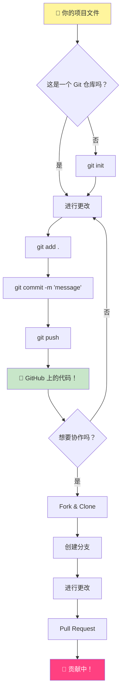
### 任务：创建你的第一个仓库！

> 🎯 **你的任务（我为你感到超级激动！）**：我们将一起创建你的第一个GitHub仓库！完成后，你将拥有在网络上的一个小角落，存放你的代码，并且你将完成第一次“提交”（开发者术语，意味着用超智能的方式保存工作）。
>
> 这真是特别的时刻——你即将正式加入全球开发者社区！我还记得创建第一个仓库时的激动，“哇，我真的做到啦！”

让我们一步步一起踏上这段旅程。每一步不要慌，慢慢来——没有谁在着急，保证每步都合情合理。记住，每个你敬佩的编码大神，都曾与你同坐在这里，准备创建他们的第一个仓库。多酷啊！

> 观看视频
>
>

**一起动手做：**

1. **在GitHub上创建仓库**。登陆GitHub.com，找到那个醒目的绿色 **New** 按钮（或者右上角的 **+** 号）。点击，选择 **New repository**。

   操作步骤：
   1. 给你的仓库起个名字——起一个对你有意义的名字！
   1. 可以添加描述（帮助别人了解你的项目）
   1. 选定公开（所有人可见）或私有（仅你可见）
   1. 建议勾选添加README文件——它是项目的首页介绍
   1. 点击 **Create repository**，庆祝一下——你刚刚创建了第一个仓库！🎉

2. **进入你的项目文件夹**。现在打开终端（别怕，其实没那么吓人！）。告诉电脑你的项目文件在哪儿，输入命令：

   ```bash
   cd [name of your folder]
   ```

   **这里做了什么：**
   - 我们实质上是在告诉电脑“带我到项目文件夹”
   - 就像在桌面打开特定文件夹，只不过用文本命令做这件事
   - 把`[name of your folder]`替换成你项目文件夹的真实名称

3. **把你的文件夹变成Git仓库**。神奇时刻来了！输入：

   ```bash
   git init
   ```

   **发生了什么（很酷！）：**
   - Git在你的项目里创建了一个隐藏的`.git`文件夹——你看不到它，但它就在那！
   - 你的普通文件夹变成了一个能追踪每一次改动的“仓库”
   - 就好像给文件夹赋予了超能力，能记住所有事情

4. **检查仓库当前状态**。看看Git此刻对你的项目有什么看法：

   ```bash
   git status
   ```

   **理解Git告诉你的内容：**

   你可能会看到类似这样的信息：

   ```output
   Changes not staged for commit:
   (use "git add <file>..." to update what will be committed)
   (use "git restore <file>..." to discard changes in working directory)

        modified:   file.txt
        modified:   file2.txt
   ```

   **别慌！它的意思是：**
   - 红色的文件是有改动但还没准备好保存的
   - 绿色的文件（如果看到）是已准备好保存的
   - Git会提示你下一步该做什么，很贴心

   > 💡 **小贴士**：`git status`命令是你的好帮手！不懂时就问它，就像让Git告诉你“现在状况如何”。

5. **准备文件保存（也叫“暂存”）**：

   ```bash
   git add .
   ```

   **刚刚做了什么：**
   - 告诉Git“把所有文件都加到下一次保存里”
   - `.`表示“这个文件夹下的所有东西”
   - 现在你的文件已经“暂存”好，可以进行下一步

   **想更挑剔地选择？** 你可以只添加特定文件：

   ```bash
   git add [file or folder name]
   ```

   **为什么这样做？**
   - 有时候你想把相关改动分批提交
   - 有利于把工作整理成有逻辑的小块
   - 让日后更容易理解改动内容和时间

   **想撤销选择？** 可以这样取消暂存：

   ```bash
   # 取消暂存所有内容
   git reset

   # 只取消暂存一个文件
   git reset [file name]
   ```

   不用担心——这不会删掉你的内容，只是把文件从“准备提交”的列表里移除。

6. **永久保存工作（提交你的第一次commit！）**：

   ```bash
   git commit -m "first commit"
   ```

   **🎉 恭喜你！你完成了第一次commit！**

   **发生了什么：**
   - Git对所有暂存的文件做了“快照”，记录当前状态
   - 你的提交信息“first commit”说明了保存点的内容
   - Git给这个快照一个唯一ID，你随时能找到它
   - 你正式开始管理项目历史了！

   > 💡 **今后的提交信息**：写得更有描述性！别写“updated stuff”，试试“给首页添加联系表单”或“修复导航菜单bug”。未来的你会感谢自己的！

7. **连接本地项目到GitHub**。现在你的项目只存在电脑里，连接到GitHub仓库，才能分享给全世界！

   先打开你的GitHub仓库页面，复制URL。回到这里，输入：

   ```bash
   git remote add origin https://github.com/username/repository_name.git
   ```

   （把这个URL换成你的仓库实际地址！）

   **刚刚做了什么：**
   - 我们在你的本地项目和你的 GitHub 仓库之间建立了连接
   - “origin” 只是你的 GitHub 仓库的一个昵称——就像给你的手机添加联系人一样
   - 现在你的本地 Git 知道在你准备好分享代码时该把代码发送到哪里

   💡 **更简单的方法**：如果你安装了 GitHub CLI，可以用一条命令完成这一步：
   ```bash
   gh repo create my-repo --public --push --source=.
   ```

8. **将代码上传到 GitHub**（激动人心的时刻！）：

   ```bash
   git push -u origin main
   ```

   **🚀 就是这一步！你正在把代码上传到 GitHub！**

   **发生了什么：**
   - 你的提交正从电脑传送到 GitHub
   - `-u` 参数建立了永久连接，方便以后推送
   - “main” 是你的主分支名称（类似主文件夹）
   - 之后你只需输入 `git push` 来上传修改！

   💡 **小提示**：如果分支叫其他名字（如 “master”），用那个名字替代。可用 `git branch --show-current` 查看当前名字。

9. **你的新日常编码节奏**（上瘾的时候到了！）：

   从现在开始，只要你修改项目，都遵循简单的三步流程：

   ```bash
   git add .
   git commit -m "describe what you changed"
   git push
   ```

   **这将成为你的编码心跳：**
   - 编写精彩代码 ✨
   - 用 `git add` 记录修改（“Git，关注这些改动！”）
   - 用 `git commit` 并写清楚信息保存（未来的你会感谢现在的你！）
   - 用 `git push` 分享给世界 🚀
   - 循环往复——真的，这会变得自然而然！

   我喜欢这个流程，就像电子游戏里多保存点。喜欢刚写的修改？提交它！想试点冒险的改动？没问题——你总能回到最后一次提交！

   > 💡 **提示**：建议使用 `.gitignore` 文件避免不想追踪的文件出现在 GitHub 上——比如你存放的笔记文件，它不适合公开。你可以去 [.gitignore 模板](https://github.com/github/gitignore) 找模板，或用 [gitignore.io](https://www.toptal.com/developers/gitignore) 创建。

### 🧠 **第一次仓库提交：感觉如何？**

**花点时间庆祝和回顾：**
- 第一次在 GitHub 看到自己的代码感觉怎么样？
- 哪一步最让你困惑？哪一步出乎意料地简单？
- 你能用自己的话解释 `git add`、`git commit` 和 `git push` 的区别吗？

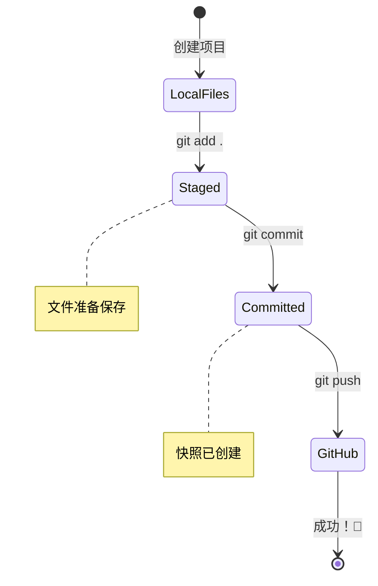
> **记住**：即使是经验丰富的开发者也会忘记具体命令。让流程变成本能需要练习——你做得很棒！

#### 现代 Git 工作流程

考虑采用这些现代实践：

- **Conventional Commits（规范提交）**：用标准格式的提交信息如 `feat:`、`fix:`、`docs:` 等。了解更多请访问 [conventionalcommits.org](https://www.conventionalcommits.org/)
- **原子提交**：每次提交代表一个逻辑上的独立改动
- **频繁提交**：多且带描述的提交代替少且庞大的提交

#### 提交信息

一个好的 Git 提交主题行能完成下面句子：
如果应用该提交，它将 <你的主题>

主题用祈使句现在时态：“change”，不是 “changed” 或 “changes”。正文（可选）也用祈使句现在时。正文应说明改动的动机，并与之前的行为对比。你是在解释“为什么”，不是“怎么做”。

✅ 花几分钟逛逛 GitHub，能找到一个特别棒的提交信息吗？能找到特别简洁的吗？你觉得提交信息中最重要有用的信息是什么？

## 与他人合作（有趣部分！）

抓紧你的帽子，因为这里是 GitHub 真正神奇的时候！🪄 你已经学会管理自己的代码，现在我们进入我最喜欢的部分——与来自世界各地的优秀人才协作。

想象一下：你第二天醒来发现东京有人改进了你的代码；柏林有人修复了你一直卡住的 Bug；下午时，圣保罗的开发者添加了你从没想过的功能。这不是科幻——这只是 GitHub 世界里的普通一天！

让我激动的是，你将学到的协作技能正是谷歌、微软和你喜欢的创业公司每天都在用的工作流程。这不仅仅是学一个酷工具——你学会了让整个软件世界协同工作的秘密语言。

说真的，一旦你体验过别人合并你的第一次拉取请求的激动，你会明白开发者为何对开源项目如此热情。这就像参与了全世界最大最有创意的团队项目！

> 查看视频
>
>

把东西放到 GitHub 的主要原因就是让与其他开发者的协作成为可能。

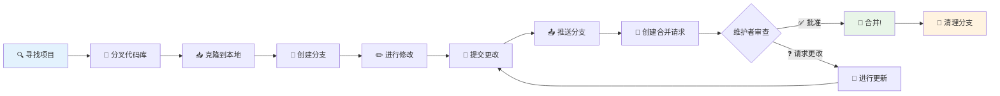
在你的仓库里，导航至 `Insights > Community`，查看你的项目如何对照推荐的社区标准进行比较。

想让你的仓库看起来专业且有吸引力？去仓库点击 `Insights > Community`。这个酷功能会显示你的项目与 GitHub 社区认可的“好仓库实践”相比的情况。

> 🎯 **让你的项目闪耀**：结构良好的仓库和完善的文档就像干净欢迎的店铺。它告诉大家你重视你的工作，也会让别人想来贡献！

**一个棒仓库的要点：**

| 应该添加的内容 | 重要性 | 对你的作用 |
|-------------|-------------------|---------------------|
| **描述** | 第一印象很重要！ | 让人立刻知道项目做什么 |
| **README** | 项目的主页 | 就像对新访客的友好导览 |
| **贡献指南** | 表明欢迎帮助 | 让人知道如何参与贡献 |
| **行为准则** | 营造友好氛围 | 确保每个人都感到受欢迎 |
| **许可证** | 法律明确 | 让别人知道怎么使用你的代码 |
| **安全政策** | 表明你负责任 | 展示专业规范 |

> 💡 **小窍门**：GitHub 提供了所有这些文件的模板。创建新仓库时，可以勾选自动生成这些文件。

**值得探索的现代 GitHub 功能：**

🤖 **自动化 & CI/CD：**
- **GitHub Actions**：自动化测试和部署
- **Dependabot**：依赖自动更新

💬 **社区 & 项目管理：**
- **GitHub Discussions**：议题以外的社区对话
- **GitHub Projects**：看板式项目管理
- **分支保护规则**：维护代码质量标准

所有这些资源都能帮助新成员快速入职。新贡献者通常先看这些东西，再决定项目是否值得投入时间。

✅ README 虽然准备需要时间，但常被繁忙的维护者忽视。你能找到一个特别详细的 README 作为例子吗？提示：有些[工具能帮你创建优秀的 README](https://www.makeareadme.com/)，可以试试。

### 任务：合并代码

贡献文档帮助别人参与项目。它说明你期待的贡献类型和流程。贡献者需要经过一系列步骤，才能在 GitHub 上为你的仓库做贡献：

1. **Fork 你的仓库**。你可能希望别人 _fork_ 你的项目。Fork 是在他们的 GitHub 账号上创建你仓库的副本。
1. **克隆**。然后他们将项目克隆到本地机器。
1. **创建分支**。你会希望他们为自己的工作创建一个 _分支_。
1. **把修改聚焦在一件事**。让贡献者每次专注一件事——这样更容易 _合并_ 他们的工作。假设他们写了 bug 修复、添加新功能并更新多个测试——如果你只能合并其中两个或一个怎么办？

✅ 想想有哪些场景分支对写出和发布高质量代码特别关键？

> 注意，成为你希望看到的改变，也为你自己的工作创建分支。任何提交都发生在你当前“签出”的分支上。用 `git status` 查看当前分支。

我们来看贡献者的工作流程。假设贡献者已经 _fork_ 和 _clone_ 了仓库，拥有一个可本地操作的 Git 仓库：

1. **创建分支**。用命令 `git branch` 创建将用于贡献的分支：

   ```bash
   git branch [branch-name]
   ```

   > 💡 **现代做法**：你也可以用一条命令创建并切换分支：
   ```bash
   git switch -c [branch-name]
   ```

1. **切换到工作分支**。用 `git switch` 切换到指定分支并更新工作区：

   ```bash
   git switch [branch-name]
   ```

   > 💡 **现代提示**：`git switch` 是替代 `git checkout` 修改分支的现代命令，更清晰也更安全适合新手。

1. **开始工作**。此时你添加修改。别忘了用下面命令告诉 Git：

   ```bash
   git add .
   git commit -m "my changes"
   ```

   > ⚠️ **提交信息质量**：确保给你的提交起个好名字，为自己和仓库维护者负责。具体说明你的改动！

1. **与 `main` 分支合并**。完成工作后，你想把改动合并回 `main`。由于 `main` 可能已变动，先用以下命令更新它：

   ```bash
   git switch main
   git pull
   ```

   接下来确保任何冲突，即 Git 无法轻松合并的情况发生在你的工作分支上。运行以下命令：

   ```bash
   git switch [branch_name]
   git merge main
   ```

   `git merge main` 命令将 `main` 的所有改动合入你的分支。希望你可以直接继续。如果不能，VS Code 会告诉你哪里有冲突，你只需编辑相关文件，决定哪些内容是正确的。

   💡 **现代替代**：考虑用 `git rebase` 保持历史清晰：
   ```bash
   git rebase main
   ```
   它将你的提交放到最新的 `main` 之上，创建线性历史。

1. **将你的工作推送到 GitHub**。推送工作到 GitHub 包含两步：推送分支到你的仓库，然后打开 PR（拉取请求）。

   ```bash
   git push --set-upstream origin [branch-name]
   ```

   上面命令会在你的 fork 仓库上创建该分支。

### 🤝 **协作技能检测：准备好与他人合作了吗？**

**看看你对协作的感觉如何：**
- 你现在理解 fork 和拉取请求的概念了吗？
- 关于分支工作你还想多练习什么？
- 你对向别人的项目贡献感觉如何？

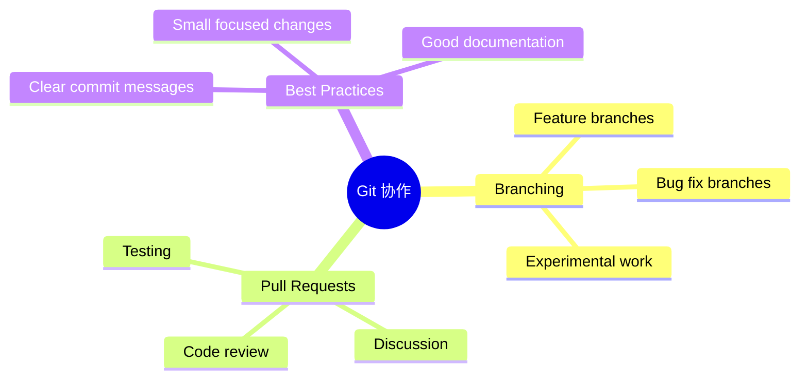
> **信心提升**：你敬佩的每个开发者当年也曾紧张他们的第一次拉取请求。GitHub 社区对新手非常友好！

1. **打开拉取请求（PR）**。接下来你要在 GitHub 上打开 PR。访问你的 fork 仓库，GitHub 会提示你是否创建新 PR，点击进入后可以修改提交信息标题，写更合适的描述。原仓库维护者会看到该 PR，_希望他们会喜欢并合并它_。你现在是贡献者，太棒了 :)

   💡 **现代小贴士**：你也可以用 GitHub CLI 创建 PR：
   ```bash
   gh pr create --title "Your PR title" --body "Description of changes"
   ```

   🔧 **PR 最佳实践**：
   - 使用关键词关联相关 issues，如 “Fixes #123”
   - 为界面改动添加截图
   - 指定特定评审人
   - 对进行中的工作使用草稿 PR
   - 确保所有 CI 检查通过再请求评审
1. **清理**。在你成功合并一个 PR 之后，进行_清理_工作被认为是一种良好习惯。你需要清理你的本地分支以及你推送到 GitHub 的分支。首先，用以下命令在本地删除它：

   ```bash
   git branch -d [branch-name]
   ```

确保接下来访问 Fork 的 GitHub 页面，删除你刚刚推送的远程分支。

“拉取请求”（Pull request）这个术语看起来有些奇怪，实际上你是想将你的变更推送到项目里。但项目维护者（项目所有者）或者核心团队需要先审查你的变更，才会将它合并到项目的“主”分支，所以你实际上是在请求维护者做出变更的决定。

拉取请求是一个比较和讨论某个分支引入的差异的地方，带有评审、评论、集成测试等等功能。一个好的拉取请求大致遵循提交信息的相同规则。当你的工作修复了某个问题时，你可以添加该问题追踪器中问题的引用。方法是用 `#` 加上你的问题编号。例如 `#97`。

🤞 希望所有检查都通过，项目所有者能将你的改动合并进项目 🤞

使用以下命令更新你当前本地工作分支，使其包含 GitHub 上对应远程分支的所有新提交：

`git pull`

## 为开源贡献（您改变世界的机会！）

你准备好迎接将彻底震撼你心灵的事情了吗？🤯 让我们聊聊如何为开源项目做贡献——想到与您分享这些我都热血沸腾！

这是你成为真正非凡事物一部分的机会。想象一下，改进数百万开发者每天使用的工具，或者修复你朋友喜欢的应用中的一个 bug。这不仅仅是梦想——这就是开源贡献的意义！

让我每次想到都会激动的是：你学习过的每一个工具——代码编辑器、我们将探索的框架，甚至你现在用来阅读这篇文章的浏览器——最初都是由和你一样的人首次做出贡献而开始的。那个打造你最喜欢的 VS Code 插件的优秀开发者？他们也曾是一个初学者，用颤抖的手点下“创建拉取请求”，就像你即将做的那样。

最美妙的是：开源社区就像互联网最大的集体拥抱。大多数项目都会积极欢迎新人，而且有专门标记为“good first issue”（好入门问题）的任务，就是为像你这样的人准备的！维护者看到新贡献者会非常兴奋，因为他们记得自己的第一步。

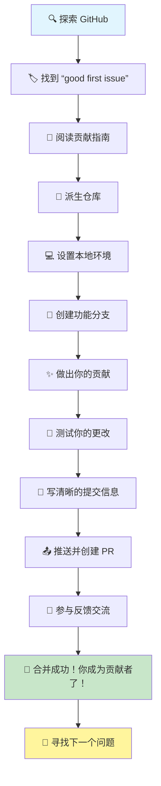
你不仅仅是在学编程——你正在准备加入一个每天醒来都想着“我们如何让数字世界变得更好一点”的全球建设者家庭。欢迎加入！🌟

首先，让我们找到一个你感兴趣且想贡献变更的 GitHub 代码库（**repo**）。你需要把它的内容复制到你的电脑上。

✅ 一个很好的寻找“初学者友好”仓库的方法是[通过“good-first-issue”标签搜索](https://github.blog/2020-01-22-browse-good-first-issues-to-start-contributing-to-open-source/)。

图示：在本地复制仓库

有几种方式可以复制代码。一种是使用 HTTPS、SSH，或者 GitHub CLI（命令行界面）“克隆”仓库内容。

打开终端，输入以下命令克隆仓库：

```bash
# 使用 HTTPS
git clone https://github.com/ProjectURL

# 使用 SSH（需要设置 SSH 密钥）
git clone git@github.com:username/repository.git

# 使用 GitHub CLI
gh repo clone username/repository
```

要开始项目工作，切换到相应文件夹：
`cd ProjectURL`

你也可以用以下方式打开整个项目：
- **[GitHub Codespaces](https://github.com/features/codespaces)** —— GitHub 提供的带有浏览器中 VS Code 的云开发环境
- **[GitHub Desktop](https://desktop.github.com/)** —— Git 操作的图形界面应用
- **[GitHub.dev](https://github.dev)** —— 在任意 GitHub 仓库按 `.` 键打开浏览器中 VS Code
- 安装 GitHub Pull Requests 扩展的 VS Code

最后，你也可以下载代码的压缩包。

### 关于 GitHub 的几点更多有趣内容

你可以给任何 GitHub 上的公共仓库加星、关注和/或“Fork”（派生）。你可以在右上角的下拉菜单中找到你加星的仓库。它就像收藏书签，但针对代码。

项目通常有一个问题追踪器，通常在 GitHub 的“Issues”标签页（除非另有说明），这是人们讨论与项目有关问题的地方。拉取请求页是人们讨论和复审正在进行的改动的地方。

项目还可能有论坛、邮件列表，或者像 Slack、Discord、IRC 这样的聊天频道。

🔧 **现代 GitHub 功能**：
- **GitHub Discussions** —— 内置社区讨论论坛
- **GitHub Sponsors** —— 金融支持维护者
- **安全标签** —— 漏洞报告与安全公告
- **Actions 标签** —— 查看自动化工作流和 CI/CD 管道
- **Insights 标签** —— 关于贡献者、提交和项目健康的数据分析
- **Projects 标签** —— GitHub 内置的项目管理工具

✅ 试着熟悉你的新 GitHub 仓库，尝试编辑设置、为仓库添加信息、创建项目（如看板），以及设置 GitHub Actions 实现自动化。你可以做很多事情！

## 🚀 挑战

好了，是时候检验你闪亮的新 GitHub 超能力了！🚀 这项挑战会让一切以最令人满意的方式水到渠成：

找一个朋友（或者一直问你“你那些电脑玩意儿在干嘛”的亲戚）一起开始一场协作编程冒险！这才是真正的魔法所在——创建项目，让他们 Fork，创建几个分支，然后像专业人士一样合并变更。

我说实话——你们很可能会哈哈大笑（尤其是当你们俩试图同时改同一行代码时），也许会一起摸不着头脑，但你们肯定会有那些令人激动的“啊哈！”时刻，让所有学习都物有所值。而且，和别人分享第一次成功合并总是特别的——就像是对你来之不易进步的一次小小庆祝！

还没有编程伙伴？没关系！GitHub 社区里有无数热情欢迎的成员，他们都记得自己刚开始时是什么样子。寻找带有“good first issue”标签的仓库——它们基本上是在说“嘿，初学者，来和我们一起学习吧！”多棒啊！

## 课后测验
[课后测验](https://ff-quizzes.netlify.app/web/en/)

## 复习与持续学习

呼！🎉 看你——你刚刚像个绝对的高手一样掌握了 GitHub 基础！如果现在感觉大脑有点满，那很正常，老实说这其实是好现象。你刚刚学会的工具，我当初花了好几周才熟悉。

Git 和 GitHub 非常强大（真的非常强大），我认识的每个开发者——包括现在看起来像个高手的那帮人——都必须不断练习、跌跌撞撞才能完全掌握。你能完成这课说明你已经在向掌握开发者工具箱里最重要的东西迈进了。

这里有一些绝佳资源，帮你练习且变得更棒：

- [开源软件贡献指南](https://opensource.guide/how-to-contribute/#how-to-submit-a-contribution) —— 你的改变之路地图
- [Git 速查表](https://training.github.com/downloads/github-git-cheat-sheet/) —— 随时备查！

记住：练习带来进步，不是完美！你用 Git 和 GitHub 越多，越觉得自然。GitHub 还推出了些很棒的交互课程，让你在安全环境中练习：

- [GitHub 入门](https://github.com/skills/introduction-to-github)
- [使用 Markdown 交流](https://github.com/skills/communicate-using-markdown)
- [GitHub Pages](https://github.com/skills/github-pages)
- [管理合并冲突](https://github.com/skills/resolve-merge-conflicts)

**想挑战现代工具？查看这些：**
- [GitHub CLI 文档](https://cli.github.com/manual/) —— 想成为命令行巫师必备
- [GitHub Codespaces 文档](https://docs.github.com/en/codespaces) —— 云端编程！
- [GitHub Actions 文档](https://docs.github.com/en/actions) —— 自动化一切
- [Git 最佳实践](https://www.atlassian.com/git/tutorials/comparing-workflows) —— 升级你的工作流玩法

## GitHub Copilot Agent 挑战 🚀

使用 Agent 模式完成下面的挑战：

**描述：** 创建一个协作网页开发项目，展示你在本课中学到的完整 GitHub 工作流程。本挑战将帮助你在真实场景中练习仓库创建、协作功能以及现代 Git 工作流。

**提示：** 在 GitHub 创建一个新的公共仓库，名为“Web Development Resources”。仓库应包含结构良好的 README.md 文件，列出按类别组织的实用网页开发工具和资源（HTML、CSS、JavaScript 等）。为仓库设置合适的社区规范，包括许可协议、贡献指南和行为准则。创建至少两个功能分支：一个用于添加 CSS 资源，另一个用于 JavaScript 资源。分别在两个分支做提交，并附上描述性提交信息，然后创建拉取请求合并回主分支。启用 GitHub 诸如 Issues、Discussions 功能，并设置基础的 GitHub Actions 工作流，实现自动检查。

## 任务

你的任务，如果你愿意接受：完成 GitHub Skills 上的 [GitHub 入门](https://github.com/skills/introduction-to-github) 课程。这个交互式课程会让你在安全的引导环境中练习所学。完成还有酷炫徽章奖励！🏅

**准备好接受更多挑战？**
- 为你的 GitHub 账户设置 SSH 认证（告别密码！）
- 试用 GitHub CLI 进行日常 Git 操作
- 创建包含 GitHub Actions 工作流的仓库
- 通过 GitHub Codespaces 在云端编辑这个仓库

## 🚀 你的 GitHub 掌握时间线

### ⚡ **接下来 5 分钟能做的事**
- [ ] 给这个仓库及另外 3 个你感兴趣的项目加星
- [ ] 为你的 GitHub 账户设置双因素认证
- [ ] 为你的第一个仓库创建简单的 README
- [ ] 关注 5 位启发你的开发者

### 🎯 **本小时能完成的目标**
- [ ] 完成课后测验并反思你的 GitHub 学习之旅
- [ ] 配置 SSH 密钥实现免密码登录 GitHub
- [ ] 做出你第一个有意义且带有良好提交信息的 commit
- [ ] 探索 GitHub“Explore”标签页，发现热门项目
- [ ] 练习 Fork 仓库并做一些小改动

### 📅 **一周的 GitHub 冒险**
- [ ] 完成 GitHub Skills 课程（GitHub 入门，Markdown）
- [ ] 向开源项目提交第一个拉取请求
- [ ] 搭建 GitHub Pages 展示你的作品
- [ ] 参与你感兴趣项目的 GitHub Discussions
- [ ] 创建符合社区规范的仓库（README，授权等）
- [ ] 试用 GitHub Codespaces 云端开发

### 🌟 **一个月的转变**
- [ ] 向 3 个不同开源项目贡献代码
- [ ] 指导 GitHub 新手（传帮带！）
- [ ] 配置自动化工作流（GitHub Actions）
- [ ] 构建展示你 GitHub 贡献的作品集
- [ ] 参加 Hacktoberfest 或类似社区活动
- [ ] 成为自己项目的维护者，吸引他人贡献

### 🎓 **最终 GitHub 掌握确认**

**庆祝你的进步：**
- 你最喜欢 GitHub 的哪一点？
- 哪个协作功能让你最兴奋？
- 现在你对开源贡献有多自信？
- 你第一个想贡献的项目是什么？

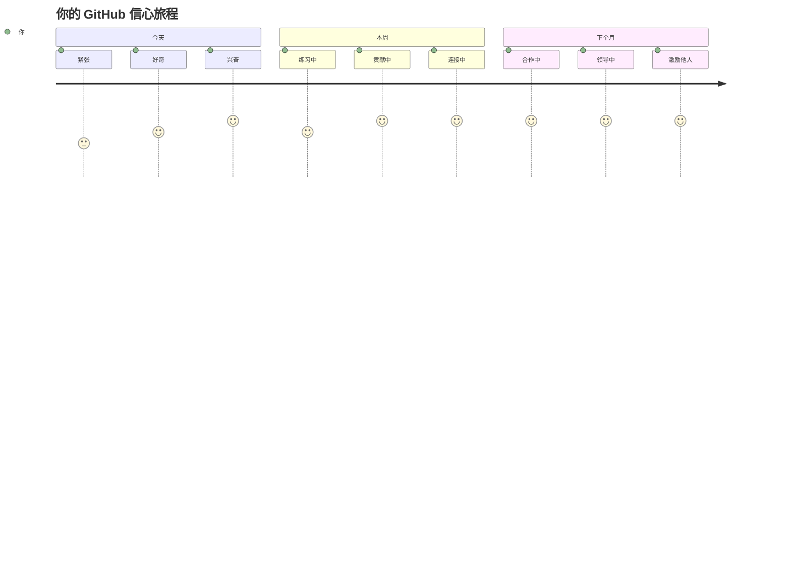
> 🌍 **欢迎加入全球开发者社区！** 你现在拥有了与全球数百万开发者协作的工具。你的第一次贡献可能看上去很小，但请记住——每个重大开源项目都是从有人第一次提交代码开始的。问题不在于你是否能产生影响，而是哪个令人惊叹的项目会首先受益于你独特的视角！🚀

记住：每个专家都曾是初学者。你可以的！💪

**免责声明**：
本文件使用 AI 翻译服务 [Co-op Translator](https://github.com/Azure/co-op-translator) 进行翻译。尽管我们努力确保准确性，但请注意自动翻译可能包含错误或不准确之处。原文以其母语版本为准。对于重要信息，建议采用专业人工翻译。因使用本翻译引起的任何误解或错误解读，我们概不负责。

# 创建无障碍网页

图示：无障碍知识全览
> 草图笔记由 [Tomomi Imura](https://twitter.com/girlie_mac) 制作

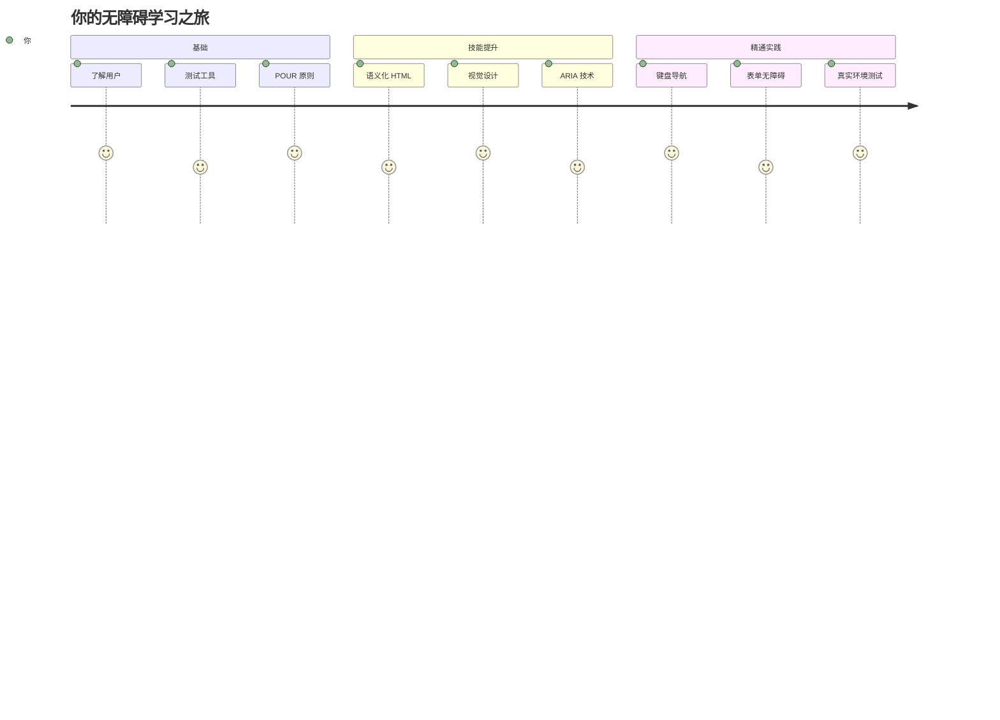
## 课前测验
[课前测验](https://ff-quizzes.netlify.app/web/)

> 网络的力量在于它的普遍性。无论是否有残疾，人人都能访问是其核心要素。
>
> \- Sir Timothy Berners-Lee，W3C 董事兼万维网发明者

这里有个可能会让你惊讶的事实：当你构建无障碍网站时，你不仅是在帮助残障人士——你实际上是在让网络对所有人更好用！

你有没有注意到街角的轮椅斜坡？它们最初是为轮椅设计的，但现在同样方便推婴儿车的人、搬运员推货车、带滚轮行李的旅行者和骑自行车的人。这正是无障碍网页设计的原理——帮助某一群体的解决方案最终会惠及所有人。相当酷，对吧？

在这节课中，我们将探讨如何创建真正适合所有人的网站，无论他们如何浏览网络。你将学习已经内置于网页标准中的实用技巧，动手使用测试工具，并了解无障碍如何让你的网站对所有用户都更易用。

课程结束时，你将有信心让无障碍成为开发工作流程中的自然一环。准备好探索那些用心设计如何为数十亿用户打开网络的大门了吗？开始吧！

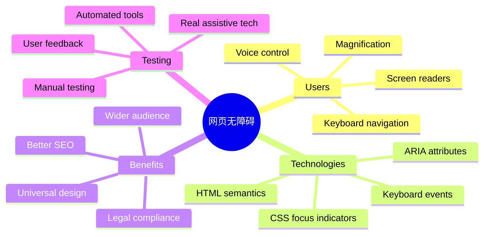
> 你也可以在 [Microsoft Learn](https://docs.microsoft.com/learn/modules/web-development-101/accessibility/?WT.mc_id=academic-77807-sagibbon) 在线学习这堂课！

## 了解辅助技术

在开始编码之前，让我们先花点时间了解不同能力的人们是如何体验网络的。这不仅仅是理论——理解这些真实的导航模式会让你成为更出色的开发者！

辅助技术是非常了不起的工具，它们帮助残障人士以你可能想不到的方式与网站交互。一旦你掌握了这些技术的运作方式，创建无障碍网页体验就会变得更加直观。这就像学会用别人的视角来看你的代码。

### 屏幕阅读器

[屏幕阅读器](https://en.wikipedia.org/wiki/Screen_reader) 是复杂的技术，它们将数字文本转换成语音或盲文输出。虽然主要用于视障人士，但它们对有阅读障碍等学习障碍的用户也非常有帮助。

我喜欢把屏幕阅读器想象成一个非常聪明的讲解者在为你朗读书籍。它以合乎逻辑的顺序朗读内容，宣布交互元素如“按钮”或“链接”，并提供键盘快捷键以跳转页面。然而，屏幕阅读器只有在我们构建的网站具有正确结构和有意义的内容时，才能发挥作用。这就需要你作为开发者参与进来了！

**各平台流行的屏幕阅读器：**
- **Windows**： [NVDA](https://www.nvaccess.org/about-nvda/)（免费且最受欢迎），[JAWS](https://webaim.org/articles/jaws/)，[Narrator](https://support.microsoft.com/windows/complete-guide-to-narrator-e4397a0d-ef4f-b386-d8ae-c172f109bdb1/?WT.mc_id=academic-77807-sagibbon)（内置）
- **macOS/iOS**： [VoiceOver](https://support.apple.com/guide/voiceover/welcome/10)（内置且性能强大）
- **Android**： [TalkBack](https://support.google.com/accessibility/android/answer/6283677)（内置）
- **Linux**： [Orca](https://wiki.gnome.org/Projects/Orca)（免费开源）

**屏幕阅读器浏览网页内容的方式：**

屏幕阅读器为有经验的用户提供多种高效的导航方式：
- **顺序阅读**：从上到下读取内容，就像看书一样
- **地标导航**：在页面章节间跳转（头部，导航，主内容，页脚）
- **标题导航**：跳转标题，以了解页面结构
- **链接列表**：生成所有链接的列表，快速访问
- **表单控件**：直接在输入框和按钮间导航

> 💡 **让人惊讶的是**：68% 的屏幕阅读器用户主要通过标题导航 ([WebAIM 调查](https://webaim.org/projects/screenreadersurvey9/#finding))。这意味着你的标题结构就像用户的导航图——当你弄对了，它们能帮助用户更快地找到内容！

### 构建你的测试工作流程

好消息是——有效的无障碍测试不必让人望而生畏！你需要结合自动化工具（它们非常擅长捕捉明显的问题）和一些手动测试。以下是我发现的一个体系化方法，能最大限度地发现问题且不会占用你太多时间：

**必备的手动测试工作流程：**

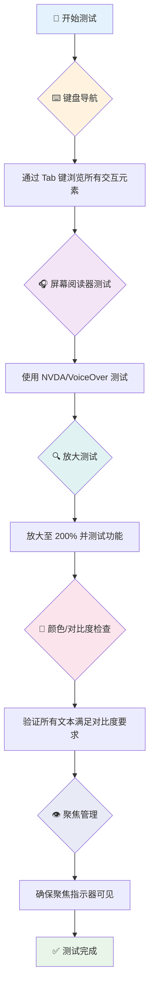
**逐步测试检查表：**
1. **键盘导航**：仅使用 Tab、Shift+Tab、Enter、空格键和方向键操作
2. **屏幕阅读器测试**：启动 NVDA、VoiceOver 或 Narrator，闭眼操作导航
3. **缩放测试**：分别测验 200% 和 400% 缩放级别
4. **颜色对比检查**：检查所有文本和 UI 组件
5. **焦点指示测试**：确保所有交互元素都有可见焦点样式

✅ **从 Lighthouse 开始**：打开浏览器开发者工具，运行 Lighthouse 无障碍审计，再用结果指导手动测试重点。

### 缩放和放大工具

你知道吗，当文本太小而你在手机上捏合放大，或者在强光下眯眼看笔记本时？很多用户每天都依赖放大工具让内容可读。这包括视力低下者、老年人，以及任何曾尝试在户外阅读网页的人。

现代缩放技术不仅是放大而已。了解这些工具的工作原理有助于你设计出响应式页面，无论放大多少倍都保持功能性和美观。

**现代浏览器的缩放能力：**
- **页面缩放**：成比例缩放所有内容（文本、图片、布局）——这是首选方法
- **仅文本缩放**：只放大字体大小，保持原有布局
- **捏合缩放**：移动端手势支持临时放大
- **浏览器支持**：所有现代浏览器支持最多 500% 缩放且不影响功能

**专用放大软件：**
- **Windows**： [放大镜](https://support.microsoft.com/windows/use-magnifier-to-make-things-on-the-screen-easier-to-see-414948ba-8b1c-d3bd-8615-0e5e32204198)（内置），[ZoomText](https://www.freedomscientific.com/training/zoomtext/getting-started/)
- **macOS/iOS**： [Zoom](https://www.apple.com/accessibility/mac/vision/)（内置，带高级功能）

> ⚠️ **设计要点**：WCAG 要求内容在放大到 200% 时仍保持功能。此时应尽量避免横向滚动，所有交互元素都应保持可访问。

✅ **测试响应式设计**：将浏览器缩放至 200% 和 400%。你的布局是否优雅适应？是否能使用全部功能且无需过度滚动？

## 现代无障碍测试工具

了解了人们如何用辅助技术浏览网页后，我们来看看帮助你构建和测试无障碍网站的工具。

简单来说：自动化工具擅长发现明显问题（比如缺少替代文本），而手动测试帮助你确保网站在真实使用中感觉良好。二者结合，让你有信心网站惠及所有人。

### 颜色对比测试

好消息是：颜色对比是最常见的无障碍问题之一，但也是最容易修正的。良好的对比度惠及所有人——从视障用户到在海滩上看手机的人。

**WCAG 对比度要求：**

| 文本类型 | WCAG AA（最低要求） | WCAG AAA（增强要求） |
|-----------|--------------------|---------------------|
| **普通文本**（小于18pt） | 4.5:1 对比度 | 7:1 对比度 |
| **大号文本**（18pt及以上或14pt加粗） | 3:1 对比度 | 4.5:1 对比度 |
| **UI 组件**（按钮，表单边框） | 3:1 对比度 | 3:1 对比度 |

**必备测试工具：**
- [Colour Contrast Analyser](https://www.tpgi.com/color-contrast-checker/) - 桌面应用带取色器
- [WebAIM Contrast Checker](https://webaim.org/resources/contrastchecker/) - 网站工具即时反馈
- [Stark](https://www.getstark.co/) - 针对 Figma, Sketch, Adobe XD 的设计插件
- [Accessible Colors](https://accessible-colors.com/) - 查找可访问的配色方案

✅ **打造更好的色彩方案**：从品牌颜色出发，使用对比度工具创建无障碍变体。将它们作为设计系统的无障碍色彩标记记录下来。

### 全面无障碍审计

最有效的无障碍测试是结合多种方法。没有单一工具能发现所有问题，因此建立多元测试流程能确保覆盖全面。

**基于浏览器的测试（集成在开发者工具中）：**
- **Chrome/Edge**：Lighthouse 无障碍审计 + 无障碍面板
- **Firefox**：带详细树视图的无障碍检查器
- **Safari**：Web Inspector 审计标签页 + VoiceOver 模拟

**专业测试插件：**
- [axe DevTools](https://www.deque.com/axe/devtools/) - 行业内标准的自动测试工具
- [WAVE](https://wave.webaim.org/extension/) - 可视反馈与错误高亮
- [Accessibility Insights](https://accessibilityinsights.io/) - 微软的综合测试套件

**命令行和 CI/CD 集成：**
- [axe-core](https://github.com/dequelabs/axe-core) - 用于自动测试的 JS 库
- [Pa11y](https://pa11y.org/) - 命令行无障碍测试工具
- [Lighthouse CI](https://github.com/GoogleChrome/lighthouse-ci) - 自动无障碍评分

> 🎯 **测试目标**：力争 Lighthouse 无障碍得分至少 95 分。记住，自动工具只能发现约 30-40% 的无障碍问题——手动测试依然不可少！

### 🧠 **测试技能自测：准备找问题了吗？**

**来看看你对无障碍测试的感觉：**
- 目前你觉得哪个测试方式最容易上手？
- 你能想象只用键盘导航一天吗？
- 你曾在线上遇到过哪些无障碍障碍？

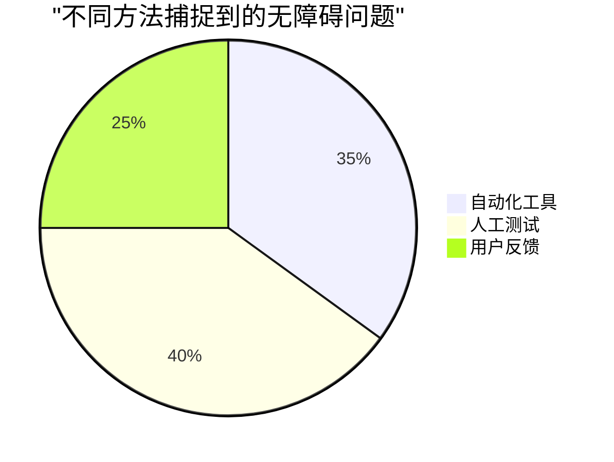
> **增强信心**：专业无障碍测试员正是使用上述组合方法。你正在学习行业标准的实践！

## 从根基开始构建无障碍

无障碍成功的关键是从一开始就将它构建进你的基础。虽然可能会想“我以后再加无障碍”，但这就像房子建好后再加坡道。可能吗？可以。但容易吗？不太。

把无障碍想象成房屋规划——在初期建筑设计时包含轮椅通道，要远比事后改造轻松很多。

### POUR 原则：你的无障碍基石

《网页内容无障碍指南》(WCAG) 建立在四个基本原则之上，简称 POUR。别担心，这些并非枯燥的学术概念，而是实用指南，帮助你制作适合所有人的内容。

掌握了 POUR，做无障碍相关决策会更加顺畅。这就像有一个心理清单指导你的设计选择。我们来逐条拆解：

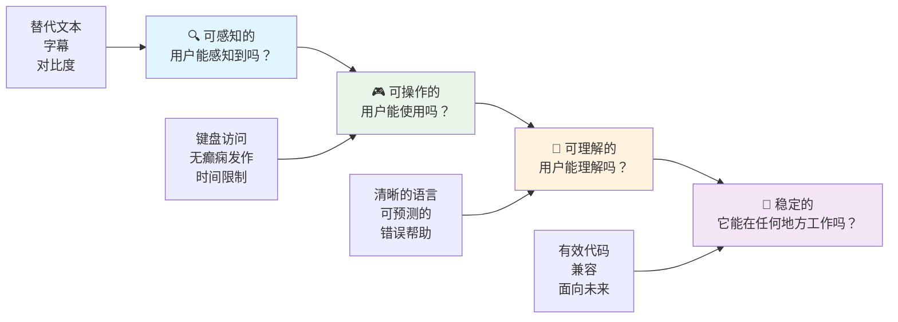
**🔍 可感知（Perceivable）**：信息必须以用户能通过其感官感知的方式呈现

- 为非文本内容（图片、视频、音频）提供文本替代
- 确保所有文本和 UI 组件有足够的颜色对比度
- 为多媒体内容提供字幕和文字稿
- 设计内容在放大至 200% 时仍保持功能
- 使用多重感官属性（不仅仅是颜色）传达信息

**🎮 可操作（Operable）**：所有界面组件必须可通过可用输入方式操作

- 使所有功能可通过键盘导航访问
- 给用户充足时间阅读和交互
- 避免引发癫痫或前庭障碍的内容
- 通过清晰结构和地标帮助用户高效导航
- 确保交互元素有足够触控面积（至少44像素）

**📖 可理解（Understandable）**：信息和界面操作必须清晰且易懂

- 使用适合目标用户的清晰简洁语言
- 保证内容出现和操作方式可预测、一致
- 为用户输入提供清晰的指引和错误提示
- 帮助用户理解并纠正表单错误
- 通过合理的阅读顺序和信息层级组织内容

**💪 稳健（Robust）**：内容必须在不同技术和辅助设备中可靠工作

- **使用有效且语义化的 HTML 作为基础**
- **确保兼容当前和未来的辅助技术**
- **遵循网页标准和最佳实践的标记规范**
- **在不同浏览器、设备和辅助工具上进行测试**
- **构建内容结构，以便在不支持高级功能时可优雅降级**

### 🎯 **POUR 原则检查：让它深入人心**

**对基础的快速反思：**
- 你能想到哪些网站功能未能满足每个 POUR 原则吗？
- 作为开发者，哪个原则对你来说最自然？
- 这些原则如何改善所有人的设计，而不仅仅是残障用户？

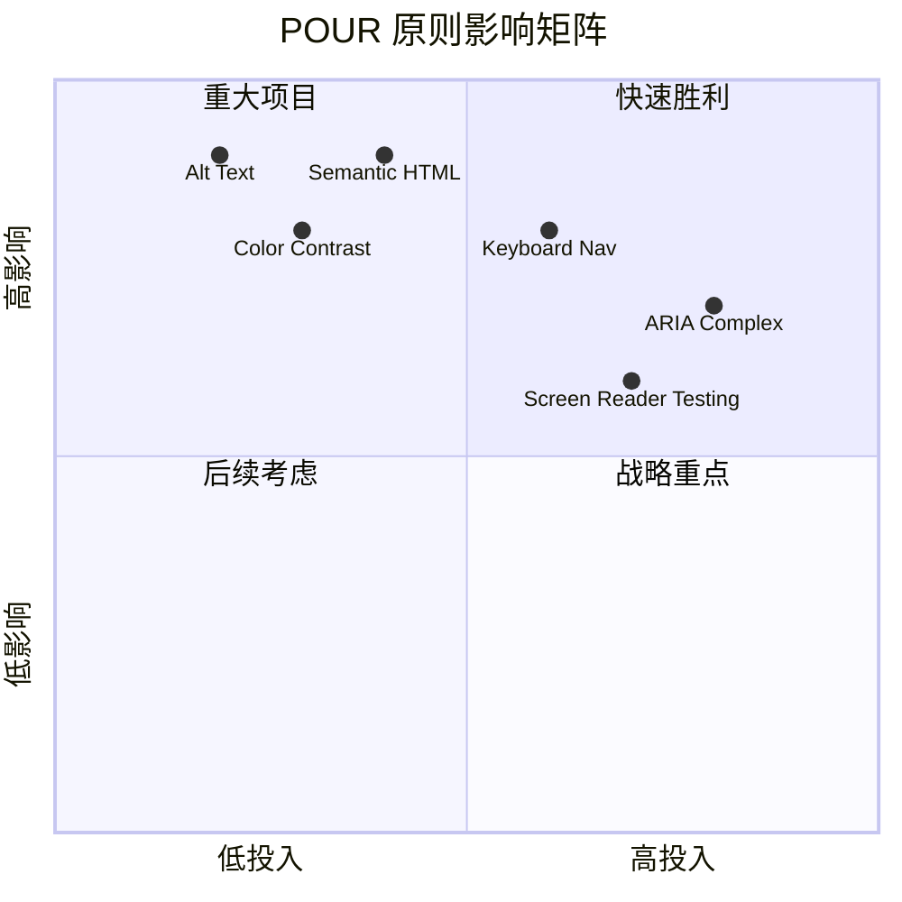
> **记住**：从高影响、低难度的改进开始。语义化 HTML 和 alt 文本能以最低的努力带来最大的无障碍提升！

## 创建无障碍的视觉设计

良好的视觉设计和无障碍是相辅相成的。当你以无障碍为设计出发点时，你常常会发现这些限制会带来更简洁、更优雅的解决方案，惠及所有用户。

让我们探讨如何创建对所有人都友好的视觉设计，无论他们的视觉能力如何，也无论他们在何种条件下浏览内容。

### 颜色和视觉无障碍策略

颜色是强有力的沟通手段，但不应成为传达重要信息的唯一方式。超越颜色的设计创造了更强健、更包容的体验，适用性更广。

**考虑色觉差异进行设计：**

约有 8% 的男性和 0.5% 的女性存在某种形式的色觉差异（通常称为“色盲”）。最常见的类型有：
- **红绿色盲（Deuteranopia）**：难以区分红色和绿色
- **红色弱视（Protanopia）**：红色看起来更加暗淡
- **蓝黄色盲（Tritanopia）**：难以区分蓝色和黄色（罕见）

**包容性色彩策略：**

```css
/* ❌ Bad: Using only color to indicate status */
.error { color: red; }
.success { color: green; }

/* ✅ Good: Color plus icons and context */
.error {
  color: #d32f2f;
  border-left: 4px solid #d32f2f;
}
.error::before {
  content: "⚠️";
  margin-right: 8px;
}

.success {
  color: #2e7d32;
  border-left: 4px solid #2e7d32;
}
.success::before {
  content: "✅";
  margin-right: 8px;
}
```

**超越基础对比度要求：**
- 使用色盲模拟器测试你的配色
- 结合使用图案、纹理或形状与颜色编码
- 确保交互状态无需色彩也能区分
- 考虑设计在高对比度模式下的表现

✅ **测试你的颜色无障碍性**：使用诸如 [Coblis](https://www.color-blindness.com/coblis-color-blindness-simulator/) 之类的工具查看不同色觉用户如何看到你的网站。

### 焦点指示器和交互设计

焦点指示器是数字世界中的光标——它向键盘用户显示他们在页面上的位置。设计良好的焦点指示器通过使交互清晰且可预测来提升所有用户的体验。

**现代焦点指示器最佳实践：**

```css
/* Enhanced focus styles that work across browsers */
button:focus-visible {
  outline: 2px solid #0066cc;
  outline-offset: 2px;
  box-shadow: 0 0 0 4px rgba(0, 102, 204, 0.25);
}

/* Remove focus outline for mouse users, preserve for keyboard users */
button:focus:not(:focus-visible) {
  outline: none;
}

/* Focus-within for complex components */
.card:focus-within {
  box-shadow: 0 0 0 3px rgba(74, 144, 164, 0.5);
  border-color: #4A90A4;
}

/* Ensure focus indicators meet contrast requirements */
.custom-focus:focus-visible {
  outline: 3px solid #ffffff;
  outline-offset: 2px;
  box-shadow: 0 0 0 6px #000000;
}
```

**焦点指示器要求：**
- **可见性**：必须与周围元素保持至少 3:1 的对比度
- **宽度**：元素周围必须至少有 2px 的厚度
- **持续性**：焦点移动到别处之前需要一直可见
- **区分性**：必须与其他 UI 状态有明显视觉差异

> 💡 **设计建议**：优秀的焦点指示器通常结合使用轮廓、盒阴影和颜色变化，以确保在不同背景和场景下都能清晰可见。

✅ **审查焦点指示器**：用 Tab 键遍历你的网站，记录哪些元素有清晰的焦点指示器。有没有难以看清或完全缺失的？

### 语义 HTML：无障碍的基础

语义 HTML 就像为你的网页提供一套 GPS 系统。当你为 HTML 元素赋予正确的语义时，基本上为屏幕阅读器、键盘和其他辅助工具提供了详细的导航路线图，帮助用户高效浏览。

我特别喜欢这个比喻：语义 HTML 的区别就像一个有明确类别和指示牌的图书馆，与一个书籍乱扔的仓库。两者虽然都有书，但你更愿意在哪个地方找书？没错！

```mermaid
flowchart TD
    A[🏠 HTML 文档] --> B[📰 头部]
    A --> C[🧭 导航]
    A --> D[📄 主要内容]
    A --> E[📋 页脚]

    B --> B1[h1：网站名称<br/>标志与品牌]
    C --> C1[ul：导航<br/>主要链接]
    D --> D1[article：内容<br/>section：子部分]
    D --> D2[aside：侧边栏<br/>相关内容]
    E --> E1[nav：页脚链接<br/>版权信息]

    D1 --> D1a[h1：页面标题<br/>h2：主要部分<br/>h3：子部分]

    style A fill:#e3f2fd
    style B fill:#e8f5e8
    style C fill:#fff3e0
    style D fill:#f3e5f5
    style E fill:#e0f2f1
```
**构建无障碍页面结构的基本模块：**

```html

<header>
  <h1>Your Site Name</h1>
  <nav aria-label="Main navigation">
    <ul>
      <li><a href="/home">Home</a></li>
      <li><a href="/about">About</a></li>
      <li><a href="/services">Services</a></li>
    </ul>
  </nav>
</header>

<main>
  <article>
    <header>
      <h1>Article Title</h1>
      <p>Published on <time datetime="2024-10-14">October 14, 2024</time></p>
    </header>

    <section>
      <h2>First Section</h2>
      <p>Content that relates to this section...</p>
    </section>

    <section>
      <h2>Second Section</h2>
      <p>More related content...</p>
    </section>
  </article>

  <aside>
    <h2>Related Links</h2>
    <nav aria-label="Related articles">
      <ul>
        <li><a href="/related-1">First related article</a></li>
        <li><a href="/related-2">Second related article</a></li>
      </ul>
    </nav>
  </aside>
</main>

<footer>
  <p>&copy; 2024 Your Site Name. All rights reserved.</p>
  <nav aria-label="Footer links">
    <ul>
      <li><a href="/privacy">Privacy Policy</a></li>
      <li><a href="/contact">Contact Us</a></li>
    </ul>
  </nav>
</footer>
```

**语义 HTML 如何改变无障碍体验：**

| 语义元素 | 作用 | 屏幕阅读器优势 |
|------------------|---------|----------------------|
| `<header>` | 页面或区域的页眉 | “横幅地标” - 快速导航至顶部 |
| `<nav>` | 导航链接 | “导航地标” - 导航部分列表 |
| `<main>` | 主要页面内容 | “主地标” - 直接跳转到内容 |
| `<article>` | 独立内容块 | 宣告文章边界 |
| `<section>` | 主题内容组 | 提供内容结构 |
| `<aside>` | 相关侧边栏内容 | “补充地标” |
| `<footer>` | 页面或区域页脚 | “内容信息地标” |

**语义 HTML 带来的屏幕阅读器超能力：**
- **地标导航**：快速在主要页面区域之间跳转
- **标题大纲**：根据标题结构生成目录
- **元素列表**：生成所有链接、按钮或表单控件的列表
- **上下文感知**：理解内容区块间的关系

> 🎯 **快速测试**：用屏幕阅读器尝试用地标快捷键导航网站（NVDA/JAWS 中的 D 用于地标，H 用于标题，K 用于链接）。导航是否合理？

### 🏗️ **语义 HTML 掌握检查：打牢坚实基础**

**让我们评估下你的语义理解：**
- 仅凭 HTML 能识别页面上的地标吗？
- 怎么向朋友解释 `<section>` 和 `<div>` 的区别？
- 如果屏幕阅读器用户报告导航问题，你首先检查什么？

```mermaid
stateDiagram-v2
    [*] --> UnsementicHTML: div 杂烩
    UnsementicHTML --> SemanticHTML: 添加地标
    SemanticHTML --> AccessibleHTML: 使用辅助技术测试
    AccessibleHTML --> [*]: 用户成功！

    note right of UnsementicHTML
        屏幕阅读器失效
        键盘导航故障
    end note

    note right of AccessibleHTML
        清晰的导航
        高效浏览
    end note
```
> **专业提示**：好的语义 HTML 可自动解决大约 70% 的无障碍问题。掌握这基础，你就走在正确的路上了！

✅ **审查你的语义结构**：使用浏览器开发者工具中的无障碍面板查看无障碍树，确保你的标记创建了逻辑结构。

### 标题层级：创建逻辑的内容大纲

标题对于无障碍内容绝对至关重要——它们就像支撑整体的脊梁。屏幕阅读器用户严重依赖标题来理解和浏览内容。你可以把它看作是为页面提供的目录。

**标题的黄金规则：**
绝不跳级。始终按逻辑顺序从 `<h1>` 到 `<h2>` 到 `<h3>` 依次递进。还记得学校做大纲吗？原则是一样的——你不会从“Ⅰ. 主要观点”直接跳到“C. 小小点”而跳过“A. 小点”，对吧？

**完美的标题结构示例：**

```html

<main>
  <h1>Complete Guide to Web Accessibility</h1>

  <section>
    <h2>Understanding Screen Readers</h2>
    <p>Introduction to screen reader technology...</p>

    <h3>Popular Screen Reader Software</h3>
    <p>NVDA, JAWS, and VoiceOver comparison...</p>

    <h3>Testing with Screen Readers</h3>
    <p>Step-by-step testing instructions...</p>
  </section>

  <section>
    <h2>Color and Contrast Guidelines</h2>
    <p>Designing with sufficient contrast...</p>

    <h3>WCAG Contrast Requirements</h3>
    <p>Understanding the different contrast levels...</p>

    <h3>Testing Tools and Techniques</h3>
    <p>Tools for verifying contrast ratios...</p>
  </section>
</main>
```

```html

<h1>Page Title</h1>
<h3>Subsection</h3>
<h2>This should come before h3</h2>
<h1>Another main heading?</h1>
```

**标题最佳实践：**
- **每页仅一个 `<h1>`**：通常是主页标题或主要内容标题
- **逻辑递进**：绝不跳级（h1 → h2 → h3，而非 h1 → h3）
- **描述性内容**：即使脱离上下文也有意义
- **用 CSS 控制外观**：HTML 用于结构，CSS 管理视觉样式

**屏幕阅读器导航统计：**
- 68% 屏幕阅读器用户使用标题导航（[WebAIM 调查](https://webaim.org/projects/screenreadersurvey9/#finding)）
- 用户期望找到合理的标题大纲
- 标题是最快理解页面结构的方式

> 💡 **专业提示**：使用浏览器扩展如“HeadingsMap”可视化标题结构。它应该像一个有条理的目录。

✅ **测试标题结构**：用屏幕阅读器的标题导航功能（NVDA 中的 H 键），通过标题跳转。该层级过程逻辑清晰吗？

### 高级视觉无障碍技术

除了基础的对比度和颜色，还有一些高级技术帮助构建真正包容的视觉体验。这些方法确保内容能适应不同的观看条件和辅助技术。

**必备的视觉沟通策略：**

- **多模态反馈**：结合视觉、文字，有时还有声音提示
- **渐进披露**：将信息分段呈现
- **一致的交互模式**：使用熟悉的 UI 约定
- **响应式排版**：适配不同设备的字体大小
- **加载与错误状态**：为所有用户操作提供明确反馈

**提升无障碍的 CSS 工具：**

```css
/* Screen reader only text - visually hidden but accessible */
.sr-only {
  position: absolute;
  width: 1px;
  height: 1px;
  padding: 0;
  margin: -1px;
  overflow: hidden;
  clip: rect(0, 0, 0, 0);
  white-space: nowrap;
  border: 0;
}

/* Skip link for keyboard navigation */
.skip-link {
  position: absolute;
  top: -40px;
  left: 6px;
  background: #000000;
  color: #ffffff;
  padding: 8px 16px;
  text-decoration: none;
  border-radius: 4px;
  font-weight: bold;
  transition: top 0.3s ease;
  z-index: 1000;
}

.skip-link:focus {
  top: 6px;
}

/* Reduced motion respect */
@media (prefers-reduced-motion: reduce) {
  .skip-link {
    transition: none;
  }

  * {
    animation-duration: 0.01ms !important;
    animation-iteration-count: 1 !important;
    transition-duration: 0.01ms !important;
  }
}

/* High contrast mode support */
@media (prefers-contrast: high) {
  .button {
    border: 2px solid;
  }
}
```

> 🎯 **无障碍模式**：“跳转链接”对键盘用户至关重要。它应是页面上的第一个可聚焦元素，并允许直接跳转到主要内容区域。

✅ **实现跳转导航**：为页面添加跳转链接，页面加载后按 Tab 测试，跳转链接应出现并允许运行跳至主要内容。

## 编写有意义的链接文本

链接基本上是网络的高速公路，但糟糕的链接文本就像路标只写着“某地”，却不写“芝加哥市中心”。没什么用吧？

这里有个我刚学时震惊的事实：屏幕阅读器可以提取页面上的所有链接并作为一个大列表显示。想象一下，如果有人给你一份页面中每个链接的目录，每个链接本身都能立即让你理解它的作用吗？这是你的链接文本需要通过的测试！

### 理解链接导航模式

屏幕阅读器提供了强大的链接导航功能，依赖于写得好的链接文本：

**链接导航方式：**
- **顺序阅读**：作为内容流的一部分按顺序朗读链接
- **链接列表生成**：将所有页面链接汇编成可搜索的目录
- **快速导航**：用键盘快捷键在链接间跳转（NVDA中的K键）
- **搜索功能**：通过输入部分文本定位特定链接

**上下文为什么重要：**
当屏幕阅读器用户生成链接列表时，他们看到：
- “下载报告”
- “了解更多”
- “点击这里”
- “隐私政策”
- “点击这里”

其中只有两个链接在脱离上下文时提供有用信息！

> 📊 **用户影响**：屏幕阅读器用户扫描链接列表以快速了解页面内容。泛泛的链接文本迫使他们回到上下文，极大地减慢浏览速度。

### 避免常见的链接文本错误

理解错误模式可帮助你识别并修复现有内容中的无障碍问题。

**❌ 不提供上下文的泛用链接文本：**

```html

<p>Our sustainability efforts are detailed in our recent report.
   <a href="/sustainability-2024.pdf">Click here</a> to view it.</p>

  <h3>Web Accessibility Guide</h3>
  <p>Learn the fundamentals...</p>
  <a href="/accessibility-guide">Read more</a>

  <h3>Color Contrast Tips</h3>
  <p>Improve your design...</p>
  <a href="/color-contrast">Read more</a>

<p>Visit https://www.w3.org/WAI/WCAG21/quickref/ for WCAG guidelines.</p>

<a href="/contact">Go</a> | <a href="/about">See</a> | <a href="/help">View</a>
```

**这些模式为什么失败：**
- **“点击这里”** 不告诉用户目的地
- **“阅读更多”** 多次重复引起混淆
- **裸露 URL** 屏幕阅读器难以清晰朗读
- **单词如“去”或“查看”** 缺乏描述性上下文

### 编写出色的链接文本

描述性链接文本惠及所有人——有视力的用户能快速扫描，屏幕阅读器用户能立即理解目的地。

**✅ 清晰描述性链接文本示例：**

```html

<p>Our comprehensive <a href="/sustainability-2024.pdf">2024 sustainability report (PDF, 2.1MB)</a> details our environmental initiatives.</p>

  <h3>Web Accessibility Guide</h3>
  <p>Learn the fundamentals of inclusive design...</p>
  <a href="/accessibility-guide">Read our complete web accessibility guide</a>

  <h3>Color Contrast Tips</h3>
  <p>Improve your design with better color choices...</p>
  <a href="/color-contrast">Explore color contrast best practices</a>

<p>The <a href="https://www.w3.org/WAI/WCAG21/quickref/">WCAG 2.1 Quick Reference guide</a> provides comprehensive accessibility guidelines.</p>

<a href="/contact">Contact our support team</a> |
<a href="/about">About our company</a> |
<a href="/help">Get help with your account</a>
```

**链接文本最佳实践：**
- **具体明确**：比如“下载季度财务报告” 比 “下载” 更好
- **包含文件类型和大小**：针对可下载文件附加“（PDF，1.2MB）”
- **指出是否外部打开**：适当时注明“（在新窗口打开）”
- **使用主动语言**：如“联系我们”而非“联系方式页面”
- **保持简洁**：尽量控制在 2-8 个词内

### 高级链接无障碍模式

有时视觉设计限制或技术需求需特殊方案。以下是常见挑战场景的高级技巧：

**使用 ARIA 增强上下文：**

```html

<a href="/report.pdf"
   aria-label="Download 2024 annual financial report, PDF format, 2.3MB">
  Download Report
</a>

<h3 id="sustainability-heading">Sustainability Initiative</h3>
<p>Our efforts to reduce environmental impact...</p>
<a href="/sustainability-details"
   aria-labelledby="sustainability-heading"
   aria-describedby="sustainability-summary">
  Learn more
</a>
<p id="sustainability-summary">Detailed breakdown of our 2024 environmental goals and achievements</p>
```

**指示文件类型和外部链接：**

```html

<a href="/annual-report.pdf">
  Download our 2024 annual report (PDF, 2.3MB)
</a>

<a href="/annual-report.pdf">
  Download our 2024 annual report
  <span class="sr-only">(PDF format, 2.3MB)</span>
</a>

<a href="https://example.com"
   target="_blank"
   aria-describedby="external-link-warning">
  Visit external resource
</a>
<span id="external-link-warning" class="sr-only">
  (opens in new window)
</span>

<a href="https://example.com" class="external-link">
  External resource
</a>
```

```css
/* Visual indicator for external links */
.external-link::after {
  content: " ↗";
  font-size: 0.8em;
  color: #666;
}

/* Screen reader announcement for external links */
.external-link::before {
  content: "External link: ";
  position: absolute;
  left: -10000px;
  width: 1px;
  height: 1px;
  overflow: hidden;
}
```

> ⚠️ **重要**：使用 `target="_blank"` 时，务必告知用户链接会在新窗口或标签页打开。意外的导航变化可能引起迷惑。

✅ **测试链接上下文**：用浏览器开发者工具生成页面上的所有链接列表。你能在无上下文的情况下理解每个链接的用途吗？

## ARIA：为 HTML 无障碍加速

[无障碍富互联网应用（ARIA）](https://developer.mozilla.org/docs/Web/Accessibility/ARIA) 就像你的复杂 Web 应用与辅助技术间的通用翻译器。当纯 HTML 无法表达交互组件行为时，ARIA 填补这些空白。

我喜欢将 ARIA 看作是给 HTML 加上辅助注释——就像戏剧剧本中的舞台指示，帮助演员理解角色和关系。

**关于 ARIA 的最重要规则**：始终先用语义 HTML，然后用 ARIA 进行增强。把 ARIA 看作调味料，而不是主菜。它应当澄清并提升 HTML 结构，绝不会替代它。务必先把基础打好！

### ARIA 的战略性实施

ARIA 很强大，但强大也意味责任。错误使用 ARIA 反而会让无障碍比没有 ARIA 更糟。何时以及如何有效使用：

**✅ 何时使用 ARIA：**
- 创建自定义交互控件（手风琴、标签页、轮播）
- 构建不用刷新页面就动态变化的内容
- 为复杂 UI 关系提供额外上下文
- 指示加载状态或实时内容更新
- 构建具有自定义控件的类应用界面

**❌ 避免使用 ARIA：**
- 已有标准 HTML 元素提供所需语义
- 你不确定如何正确实现
- 与语义 HTML 重复提供信息
- 未经过实际辅助技术测试

> 🎯 **ARIA 终极法则**：“除非万不得已不要更改语义，确保始终支持键盘操作，并用真实辅助技术测试。”
**ARIA 的五大类别：**

1. **角色**：这个元素是什么？（`button`，`tab`，`dialog`）
2. **属性**：它有什么特征？（`aria-required`，`aria-haspopup`）
3. **状态**：它当前的状态如何？（`aria-expanded`，`aria-checked`）
4. **地标**：它在页面结构中的位置？（`banner`，`navigation`，`main`）
5. **动态区域**：应如何发布更改？（`aria-live`，`aria-atomic`）

### 现代网络应用的基本 ARIA 模式

这些模式解决了交互式网络应用中最常见的无障碍挑战：

**为元素命名和描述：**

```html

<button aria-label="Close newsletter subscription dialog">×</button>

<section aria-labelledby="news-heading">
  <h2 id="news-heading">Latest News</h2>

</section>

<input type="password"
       aria-describedby="pwd-requirements pwd-strength"
       required>

  Password must contain at least 8 characters, including uppercase, lowercase, and numbers.

```

**动态内容的动态区域：**

```html

<button id="submit-btn" aria-describedby="loading-status">
  Submit Application
</button>

```

**交互式控件示例（手风琴）：**

```html

  <h3>
    <button aria-expanded="false"
            aria-controls="panel-1"
            id="accordion-trigger-1"
            class="accordion-trigger">
      Accessibility Guidelines
    </button>
  </h3>

    <p>WCAG 2.1 provides comprehensive guidelines...</p>

```

```javascript
// 管理手风琴状态的JavaScript
function toggleAccordion(trigger) {
  const panel = document.getElementById(trigger.getAttribute('aria-controls'));
  const isExpanded = trigger.getAttribute('aria-expanded') === 'true';

  // 切换状态
  trigger.setAttribute('aria-expanded', !isExpanded);
  panel.hidden = isExpanded;

  // 向屏幕阅读器宣布更改
  const status = document.getElementById('status-updates');
  status.textContent = isExpanded ? 'Section collapsed' : 'Section expanded';
}
```

### ARIA 实现最佳实践

ARIA 功能强大，但需要小心实现。遵循这些指南有助于确保您的 ARIA 能提升而非阻碍无障碍：

**🛡️ 核心原则：**

```mermaid
flowchart TD
    A[🚀 从语义化HTML开始] --> B{HTML是否提供所需的语义？}
    B -->|是| C[✅ 仅使用HTML]
    B -->|否| D[考虑ARIA增强]
    D --> E{能否用更简单的方法实现？}
    E -->|是| F[🔄 简化方法]
    E -->|否| G[📝 小心实现ARIA]
    G --> H[🧪 用真实辅助技术测试]
    H --> I{是否按预期工作？}
    I -->|否| J[🔧 调试并修复]
    I -->|是| K[✅ 成功！]
    J --> H
    F --> C

    style A fill:#e3f2fd
    style C fill:#e8f5e8
    style K fill:#e8f5e8
    style G fill:#fff3e0
    style H fill:#f3e5f5
```
1. **语义 HTML 优先**：始终优先使用 `<button>` 而非 `<div role="button">`
2. **不破坏语义**：绝不覆盖已有的 HTML 含义（避免 `<h1 role="button">`）
3. **保持键盘可访问性**：所有交互式 ARIA 元素必须完全支持键盘操作
4. **与真实用户测试**：不同辅助技术的 ARIA 支持差异很大
5. **从简单开始**：复杂的 ARIA 实现更容易出错

**🔍 测试流程：**

```mermaid
graph TD
    A[编写 ARIA 代码] --> B[验证 HTML]
    B --> C[仅使用键盘测试]
    C --> D[使用屏幕阅读器测试]
    D --> E[跨浏览器测试]
    E --> F{发现问题？}
    F -->|是| G[修复并重新测试]
    F -->|否| H[实施完成]
    G --> B
```
**🚫 常见 ARIA 错误避免：**

- **信息冲突**：不要与 HTML 语义相矛盾
- **过度标注**：太多 ARIA 信息会让用户不知所措
- **静态 ARIA**：忘记在内容变化时更新 ARIA 状态
- **未经测试的实现**：理论上可行但实际失败的 ARIA
- **缺失键盘支持**：有 ARIA 角色但缺少相应键盘交互

> 💡 **测试资源**：使用 [accessibility-checker](https://www.npmjs.com/package/accessibility-checker) 等工具进行自动 ARIA 验证，但始终用真实屏幕阅读器进行全面测试。

### 🎭 **ARIA 技能检测：准备好处理复杂交互了吗？**

**评估你的 ARIA 自信度：**
- 你什么时候会选择使用 ARIA 而非语义 HTML？（提示：几乎不会！）
- 你能解释为什么 `<div role="button">` 通常不如 `<button>` 吗？
- 关于 ARIA 测试，最重要的事情是什么？

```mermaid
pie title "常见的 ARIA 使用模式"
    "标签和描述" : 40
    "实时区域" : 25
    "控件状态" : 20
    "复杂控件" : 15
```
> **关键洞察**：大多数 ARIA 用于标注和描述元素。复杂控件模式远没有你想象的那么常见！

✅ **向专家学习**：研读 [ARIA Authoring Practices Guide](https://w3c.github.io/aria-practices/) ，了解经过实战检验的复杂交互控件模式和实现。

## 使图像和媒体无障碍

视觉和音频内容是现代网络体验的核心，但如果实现不当会造成障碍。目标是确保您的媒体信息与情感影响触及每位用户。掌握之后，它将成为习惯。

不同类型的媒体需要不同的无障碍方法。这就像烹饪 —— 你不会用对待丰富牛排的方式去处理细腻鱼类。理解这些差异有助于为每种情况选择合适方案。

### 图像无障碍策略

网站上的每张图像都有其用途。理解其用途有助于编写更好的替代文字，创造更包容的体验。

**四种图像类型及其 alt 文本策略：**

**信息性图像** - 传递重要信息：
```html

```

**装饰性图像** - 纯视觉，无信息价值：
```html

```

**功能性图像** - 作为按钮或控件：
```html
<button>

</button>
```

**复杂图像** - 图表、图解、信息图：
```html

  <p>Detailed description: Sales data shows a steady increase across all quarters...</p>

```

### 视频和音频无障碍

**视频要求：**
- **字幕**：口语内容及音效的文本版本
- **音频描述**：为盲人叙述视觉元素
- **文字记录**：所有音频和视觉内容的全文本版

```html
<video controls>

  <track kind="captions" src="captions.vtt" srclang="en" label="English">
  <track kind="descriptions" src="descriptions.vtt" srclang="en" label="Audio descriptions">
</video>
```

**音频要求：**
- **文字记录**：所有口语内容的文本版
- **视觉指示**：对纯音频内容提供视觉提示

### 现代图像技术

**用 CSS 实现装饰性图像：**
```css
.hero-section {
  background-image: url('decorative-hero.jpg');
  /* Decorative images in CSS don't need alt text */
}
```

**响应式图像与无障碍：**
```html

```

✅ **测试图像无障碍**：用屏幕阅读器浏览带图像的页面。你能获得足够信息理解内容吗？

## 键盘导航和焦点管理

许多用户完全使用键盘浏览网页。这包括运动障碍者、觉得键盘比鼠标更快捷的高级用户，以及鼠标失灵的用户。确保网站键盘友好至关重要，且通常能提高所有用户的效率。

```mermaid
flowchart LR
    A[⌨️ 键盘导航] --> B[Tab 顺序]
    A --> C[焦点指示器]
    A --> D[跳过链接]
    A --> E[键盘快捷键]

    B --> B1[逻辑顺序<br/>所有交互元素<br/>无 Tab 陷阱]
    C --> C1[可见轮廓<br/>高对比度<br/>清晰边界]
    D --> D1[跳到主体<br/>跳到导航<br/>绕过重复内容]
    E --> E1[Esc 关闭<br/>Enter 激活<br/>组内箭头]

    style A fill:#e3f2fd
    style B fill:#e8f5e8
    style C fill:#fff3e0
    style D fill:#f3e5f5
    style E fill:#e0f2f1
```
### 必要的键盘导航模式

**标准键盘交互：**
- **Tab**：向前遍历交互元素
- **Shift + Tab**：向后遍历
- **Enter**：激活按钮和链接
- **空格键**：激活按钮，勾选复选框
- **箭头键**：在组件组内导航（单选按钮、菜单）
- **Esc**：关闭模态框、下拉菜单或取消操作

### 焦点管理最佳实践

**可见焦点指示：**
```css
/* Ensure focus is always visible */
button:focus-visible {
  outline: 2px solid #4A90A4;
  outline-offset: 2px;
}

/* Custom focus styles for different components */
.card:focus-within {
  box-shadow: 0 0 0 3px rgba(74, 144, 164, 0.5);
}
```

**用于高效导航的跳过链接：**
```html
<a href="#main-content" class="skip-link">Skip to main content</a>
<a href="#navigation" class="skip-link">Skip to navigation</a>

<nav id="navigation">

</nav>
<main id="main-content">

</main>
```

**正确的 Tab 顺序：**
```html

<form>
  <label for="name">Name:</label>
  <input type="text" id="name" tabindex="0">

  <label for="email">Email:</label>
  <input type="email" id="email" tabindex="0">

  <button type="submit" tabindex="0">Submit</button>
</form>
```

### 模态框中的焦点锁定

打开模态对话框时，焦点应锁定在模态框内：

```javascript
// 现代焦点陷阱实现
function trapFocus(element) {
  const focusableElements = element.querySelectorAll(
    'button, [href], input, select, textarea, [tabindex]:not([tabindex="-1"])'
  );

  const firstElement = focusableElements[0];
  const lastElement = focusableElements[focusableElements.length - 1];

  element.addEventListener('keydown', (e) => {
    if (e.key === 'Tab') {
      if (e.shiftKey && document.activeElement === firstElement) {
        e.preventDefault();
        lastElement.focus();
      } else if (!e.shiftKey && document.activeElement === lastElement) {
        e.preventDefault();
        firstElement.focus();
      }
    }

    if (e.key === 'Escape') {
      closeModal();
    }
  });

  // 模态打开时聚焦第一个元素
  firstElement.focus();
}
```

✅ **测试键盘导航**：尝试只用 Tab 键浏览网站。能访问所有交互元素吗？焦点顺序合理吗？焦点指示清晰可见吗？

## 表单无障碍

表单是用户交互的关键，需特别关注无障碍。

### 标签与表单控件关联

**每个控件都需要标签：**
```html

<label for="username">Username:</label>
<input type="text" id="username" name="username" required>

<label>
  Password:
  <input type="password" name="password" required>
</label>

<input type="search" aria-label="Search products" placeholder="Search...">
```

### 错误处理和验证

**可访问的错误信息：**
```html
<label for="email">Email Address:</label>
<input type="email" id="email" name="email"
       aria-describedby="email-error"
       aria-invalid="true" required>

  Please enter a valid email address

```

**表单验证最佳实践：**
- 使用 `aria-invalid` 标识无效字段
- 提供清晰具体的错误提示
- 对重要错误使用 `role="alert"` 进行提示
- 错误显示应即时且提交时都呈现

### 字段集和分组

**分组相关的表单控件：**
```html
<fieldset>
  <legend>Shipping Address</legend>
  <label for="street">Street Address:</label>
  <input type="text" id="street" name="street">

  <label for="city">City:</label>
  <input type="text" id="city" name="city">
</fieldset>

<fieldset>
  <legend>Preferred Contact Method</legend>
  <input type="radio" id="contact-email" name="contact" value="email">
  <label for="contact-email">Email</label>

  <input type="radio" id="contact-phone" name="contact" value="phone">
  <label for="contact-phone">Phone</label>
</fieldset>
```

## 你的无障碍旅程：关键心得

恭喜！你已掌握创建真正包容性网页体验的基础知识。这真是令人振奋！网页无障碍不仅仅是核对符合标准——它关乎理解人们如何多样化地与数字内容互动，并为这种奇妙的复杂性设计。

你现在是理解优秀设计服务所有人的开发者社区的一员。欢迎加入！

**🎯 你的无障碍工具包包括：**

| 核心原则 | 实施方法 | 影响 |
|----------|----------|-------|
| **语义 HTML 基础** | 使用适用的 HTML 元素 | 屏幕阅读器高效导航，键盘自动工作 |
| **包容性视觉设计** | 足够的对比度，有意义的色彩使用，明显焦点指示 | 任何光线下都清晰可见 |
| **描述性内容** | 有意义的链接文本、alt 文本、标题 | 用户无需视觉上下文即可理解内容 |
| **键盘可访问性** | Tab 顺序，键盘快捷键，焦点管理 | 运动无障碍及高级用户效率提升 |
| **ARIA 增强** | 战略性填补语义空缺 | 复杂应用适配辅助技术 |
| **全面测试** | 自动化工具 + 手动验证 + 真实用户测试 | 在问题影响用户前发现它们 |

**🚀 你的下一步：**

1. **将无障碍纳入工作流程**：让测试成为开发自然环节
2. **向真实用户学习**：收集辅助技术用户反馈
3. **持续更新**：随着技术和标准变更更新无障碍技巧
4. **倡导包容**：分享知识，推动团队重视无障碍

> 💡 **记住**：无障碍限制常催生创新且优雅的解决方案。无障碍斜坡、字幕和语音控制最初都是无障碍特性，现已成为主流改进。

**商业理由非常明确**：无障碍网站触达更多用户，搜索排名更好，维护成本更低，法律风险更小。但坦白说？关心无障碍的真正原因更为深远。无障碍网站体现了网络最佳价值——开放、包容，以及人人应享平等访问信息的理念。

你现在有能力构建未来的包容性网络。你创建的每个无障碍网站都让互联网变得更加友好。这真的很了不起！

## 额外资源

继续你的无障碍学习旅程，以下是必备资源：

**📚 官方标准与指南：**
- [WCAG 2.1 指南](https://www.w3.org/WAI/WCAG21/quickref/) - 官方无障碍标准及快速参考
- [ARIA Authoring Practices Guide](https://w3c.github.io/aria-practices/) - 交互控件的全面模式
- [WebAIM 指南](https://webaim.org/) - 实用、适合初学者的无障碍指导

**🛠️ 工具与测试资源：**
- [axe DevTools](https://www.deque.com/axe/devtools/) - 行业标准的无障碍测试工具
- [A11y Project Checklist](https://www.a11yproject.com/checklist/) - 分步无障碍验证清单
- [Accessibility Insights](https://accessibilityinsights.io/) - 微软全面的测试套件
- [Color Oracle](https://colororacle.org/) - 色盲模拟器，辅助设计测试

**🎓 学习与社区：**
- [WebAIM 屏幕阅读器调查](https://webaim.org/projects/screenreadersurvey9/) - 真实用户偏好及行为
- [Inclusive Components](https://inclusive-components.design/) - 现代无障碍组件模式
- [A11y Coffee](https://a11y.coffee/) - 快速无障碍技巧与见解
- [Web Accessibility Initiative (WAI)](https://www.w3.org/WAI/) - W3C 综合无障碍资源

**🎥 实操学习：**
- [Accessibility Developer Guide](https://www.accessibility-developer-guide.com/) - 实践实施指导
- [Deque University](https://dequeuniversity.com/) - 专业无障碍培训课程

## GitHub Copilot Agent 挑战 🚀

使用 Agent 模式完成以下挑战：

**描述：** 创建一个无障碍模态对话框组件，展示正确的焦点管理、ARIA 属性和键盘导航模式。

**提示：** 构建一个完整的模态对话框组件，包含 HTML，CSS，JavaScript，具备正确的焦点锁定，ESC 键关闭，点击外部关闭，屏幕阅读器所需 ARIA 属性，可见焦点指示。模态内包含带正确标签和错误处理的表单。确保符合 WCAG 2.1 AA 标准。

## 🚀 挑战

请根据你学到的策略，用更无障碍的方式重写以下 HTML。

```html
<!DOCTYPE html>
<html lang="en">
<head>
    <meta charset="UTF-8">
    <meta name="viewport" content="width=device-width, initial-scale=1.0">
    <title>Turtle Ipsum - The World's Premier Turtle Fan Club</title>
    <link href='../assets/style.css' rel='stylesheet' type='text/css'>
</head>
<body>
<header class="site-header">
    <h1 class="site-title">Turtle Ipsum</h1>
    <p class="site-subtitle">The World's Premier Turtle Fan Club</p>
</header>

<nav class="main-nav" aria-label="Main navigation">
    <h2 class="nav-header">Resources</h2>
    <ul class="nav-list">
        <li><a href="https://www.youtube.com/watch?v=CMNry4PE93Y">"I like turtles" video</a></li>
        <li><a href="https://en.wikipedia.org/wiki/Turtle">Basic turtle information</a></li>
        <li><a href="https://en.wikipedia.org/wiki/Turtles_(chocolate)">Chocolate turtles candy</a></li>
    </ul>
</nav>

<main class="main-content">
    <article>
        <h1>Welcome to Turtle Ipsum</h1>
        <p class="intro">
            <a href="/about">Learn more about our turtle community</a> and discover fascinating facts about these
            amazing creatures.
        </p>
        <p class="article-text">
            Turtle ipsum dolor sit amet, consectetur adipiscing elit, sed do eiusmod tempor incididunt ut labore et
            dolore magna aliqua. Ut enim ad minim veniam, quis nostrud exercitation ullamco laboris nisi ut aliquip ex
            ea commodo consequat. Duis aute irure dolor in reprehenderit in voluptate velit esse cillum dolore eu fugiat
            nulla pariatur. Excepteur sint occaecat cupidatat non proident, sunt in culpa qui officia deserunt mollit
            anim id est laborum.
        </p>
    </article>
</main>

<footer class="footer">
    <section class="newsletter-signup">
        <h2>Stay Updated</h2>
        <button type="button" onclick="showNewsletterForm()">Sign up for turtle news</button>
    </section>

    <nav class="footer-nav" aria-label="Footer navigation">
        <h2>Site Pages</h2>
        <ul>
            <li><a href="../../../docs-知识库">Home</a></li>
            <li><a href="../semantic">Semantic HTML example</a></li>
        </ul>
    </nav>

    <p class="footer-copyright">&copy; 2024 Instrument. All rights reserved.</p>
</footer>
</body>
</html>
```

**主要改进点：**
- 添加了正确的语义 HTML 结构
- 修正了标题层级（单一 h1，逻辑递进）
- 替换了“点击这里”为有意义的链接文本
- 添加了适当的导航 ARIA 标签
- 添加了 lang 属性和合适的 meta 标签
- 互动元素使用 button 元素
- 底部内容结构采用正确的地标元素

## 课后测验
[课后测验](https://ff-quizzes.netlify.app/web/en/)

## 复习与自学

许多政府对无障碍有法律要求。请阅读你所在国家的无障碍法律，了解覆盖内容和不涉及的部分。一个例子是 [这个政府网站](https://accessibility.blog.gov.uk/)。

## 作业

[分析一个无障碍不足的网站](assignment.md)

鸣谢：[Turtle Ipsum](https://github.com/Instrument/semantic-html-sample) — Instrument 提供

## 🚀 你的无障碍精通时间表

### ⚡ **接下来的 5 分钟你可以做什么**
- [ ] 在浏览器中安装 axe DevTools 扩展
- [ ] 在你喜欢的网站上运行 Lighthouse 无障碍审计
- [ ] 尝试仅用 Tab 键导航任意网站
- [ ] 测试浏览器内置屏幕阅读器（Narrator/VoiceOver）

### 🎯 **本小时你可以完成什么**
- [ ] 完成课后测验，反思无障碍见解
- [ ] 为 10 张不同图片练习编写有意义的 alt 文本
- [ ] 用 HeadingsMap 扩展审核一个网站的标题结构
- [ ] 修复挑战 HTML 中发现的无障碍问题
- [ ] 用 WebAIM 工具测试当前项目的色彩对比度

### 📅 **你为期一周的无障碍旅程**
- [ ] 完成分析无障碍不足网站的作业
- [ ] 搭建含无障碍测试工具的开发环境
- [ ] 在5个不同的复杂网站上练习键盘导航
- [ ] 构建一个带有适当标签、错误处理和ARIA的简单表单
- [ ] 加入无障碍社区（A11y Slack，WebAIM论坛）
- [ ] 观看残障用户浏览网站的视频（YouTube上有很好的例子）

### 🌟 **你为期一个月的转变**
- [ ] 将无障碍测试集成到你的开发工作流程中
- [ ] 通过修复无障碍问题为开源项目做贡献
- [ ] 与使用辅助技术的用户进行可用性测试
- [ ] 为你的团队构建一个无障碍组件库
- [ ] 在你的工作场所或社区中倡导无障碍
- [ ] 指导刚接触无障碍概念的人

### 🏆 **最终无障碍冠军检查点**

**庆祝你的无障碍之旅：**
- 你学到的最令人惊讶的关于人们如何使用网络的事情是什么？
- 哪个无障碍原则与你的开发风格最契合？
- 学习无障碍如何改变了你对设计的看法？
- 你希望在真实项目中首先进行的无障碍改进是什么？

```mermaid
journey
    title 你的无障碍信心演变
    section 今天
      压倒性: 3: 你
      好奇: 4: 你
      积极: 5: 你
    section 本周
      练习中: 4: 你
      测试中: 5: 你
      理解中: 5: 你
    section 下个月
      倡导中: 5: 你
      领导中: 5: 你
      默认为包容: 5: 你
```
> 🌍 **你现在是一名无障碍冠军！** 你明白优秀的网络体验适合所有人，无论他们如何访问网络。你构建的每一个无障碍功能都使互联网更具包容性。网络需要像你这样，将无障碍视为机会而非限制的开发者，从而为所有用户创造更好的体验。欢迎加入这场运动！ 🎉

**免责声明**：
本文件使用 AI 翻译服务 [Co-op Translator](https://github.com/Azure/co-op-translator) 翻译。虽然我们力求准确，但请注意自动翻译可能包含错误或不准确之处。原始文件的母语版本应被视为权威来源。对于重要信息，建议采用专业人工翻译。我们不对因使用本翻译而产生的任何误解或误释承担责任。

# 综合网站无障碍审计

## 说明

在本作业中，你将对一个真实网站进行专业级别的无障碍审计，应用你所学的原则和技术。这一实操经验将加深你对无障碍障碍及解决方案的理解。

选择一个看起来存在无障碍问题的网站——这比分析已经完美的网站能带来更多学习机会。合适的候选包括较旧的网站、复杂的网络应用或含有丰富多媒体内容的网站。

### 第一阶段：战略性手动评估

在使用自动化工具之前，先进行全面的手动评估。这种以人为中心的方法常常能发现工具未能检测到的问题，并帮助你理解真实的用户体验。

**🔍 关键评估标准：**

**导航与结构：**
- 能否仅用键盘（Tab、Shift+Tab、Enter、Space、方向键）导航整个网站？
- 所有交互元素上是否有明显的焦点指示？
- 标题结构（H1-H6）是否创建了逻辑清晰的内容大纲？
- 是否有跳转主内容的跳过链接？

**视觉无障碍：**
- 网站整体是否有足够的颜色对比度（普通文本最低4.5:1）？
- 网站是否仅依靠颜色传达重要信息？
- 所有图像是否有适当的替代文本？
- 放大至200%时布局是否仍然可用？

**内容与交流：**
- 是否存在“点击这里”等模糊的链接文本？
- 无需视觉提示是否能理解内容和功能？
- 表单字段是否正确标注和分组？
- 错误信息是否清晰且有帮助？

**交互元素：**
- 所有按钮和表单控件是否支持仅用键盘操作？
- 动态内容变更是否向屏幕阅读器宣布？
- 模态对话框和复杂控件是否遵循正确的无障碍模式？

📝 **用具体示例、截图和页面 URL 记录你的发现**，注意问题和良好实践。

### 第二阶段：全面自动化测试

现在使用行业标准的无障碍测试工具验证和扩展手动发现。每种工具具有不同优势，结合多工具使用可达到全面覆盖。

**🛠️ 必用测试工具：**

1. **Lighthouse 无障碍审计**（内置于 Chrome/Edge 开发者工具）
   - 在多个页面运行审计
   - 关注具体指标和建议
   - 记录无障碍得分和具体违规项

2. **axe DevTools**（浏览器扩展 - 行业标准）
   - 比 Lighthouse 检测更详细的问题
   - 提供具体代码示例解决方案
   - 针对 WCAG 2.1 标准测试

3. **WAVE 无障碍评估器**（浏览器扩展）
   - 可视化无障碍特征表示
   - 突出错误和正面特征
   - 非常适合理解页面结构

4. **颜色对比分析工具**
   - WebAIM Contrast Checker 用于具体配色对检测
   - 浏览器扩展用于页面全局分析
   - 测试同时符合 WCAG AA 和 AAA 标准

**🎧 真实辅助技术测试：**
- **屏幕阅读器测试**：使用 NVDA（Windows）、VoiceOver（Mac）或 TalkBack（Android）
- **仅键盘导航**：拔掉鼠标，使用键盘导航全站
- **放大测试**：在 200% 和 400% 缩放级别测试功能
- **语音控制测试**：如可用，尝试语音导航工具

**📊 整理结果**，创建总表包括：
- 问题描述和位置
- 严重性级别（关键/高/中/低）
- 违反的 WCAG 成功标准
- 发现问题的工具
- 截图和证据

### 第三阶段：详细发现报告

编写专业的无障碍审计报告，展示你对技术问题及其对用户影响的理解。

**📋 必含报告部分：**

1. **执行摘要**（1 页）
   - 网站 URL 和简要介绍
   - 整体无障碍成熟度水平
   - 3 个最关键问题
   - 对残障用户的预估影响

2. **方法论**（½ 页）
   - 测试方法和使用的工具
   - 评估的页面及设备/浏览器组合
   - 遵循的标准（WCAG 2.1 AA）

3. **详细发现**（2-3 页）
   - 按 WCAG 原则分类的问题（可感知、可操作、可理解、稳健）
   - 包含截图和具体示例
   - 记录发现的正面无障碍特征
   - 与自动化工具结果交叉引用

4. **用户影响评估**（1 页）
   - 识别的问题如何影响不同残障用户
   - 描述真实用户体验场景
   - 商业影响（法律风险、搜索引擎优化、用户基数拓展）

**📸 证据收集：**
- 无障碍违规的截图
- 问题用户流程的屏幕录制
- 工具报告（保存为 PDF）
- 展示问题的代码示例

### 第四阶段：专业整改计划

制定战略性、优先级排序的无障碍问题修复方案，展示你像专业开发人员一样考虑实际业务限制的能力。

**🎯 制作详细改进建议（至少10项）：**

**针对每个问题，提供：**

- **问题描述**：清楚说明问题及其危害
- **WCAG 参考**：具体违反的成功标准（如“2.4.4 链接用途（上下文中）- A 级”）
- **用户影响**：如何影响不同残障用户
- **解决方案**：具体代码更改、设计调整或流程改进
- **优先级**：关键（阻断基本使用）/ 高（显著障碍）/ 中（可用性问题）/ 低（改进）
- **实施难度**：时间/复杂度估计（快速赢得 / 中等投入 / 重大重构）
- **测试验证**：如何验证修复有效

**示例改进条目：**

```
Issue: Generic "Read more" link text appears 8 times on homepage
WCAG Reference: 2.4.4 Link Purpose (In Context) - Level A
User Impact: Screen reader users cannot distinguish between links when viewed in link list
Solution: Replace with descriptive text like "Read more about sustainability initiatives"
Priority: High (major navigation barrier)
Effort: Low (30 minutes to update content)
Testing: Generate link list with screen reader - each link should be meaningful standalone
```

**📈 战略实施阶段：**

- **第1阶段（0-2周）**：阻碍基本功能的关键问题
- **第2阶段（1-2个月）**：改善用户体验的高优先级改进
- **第3阶段（3-6个月）**：中优先级的增强和流程改良
- **第4阶段（持续进行）**：持续监控和改进

## 评估标准

你的无障碍审计将根据技术准确性和专业呈现进行评估：

| 标准 | 优秀（90-100%） | 良好（80-89%） | 满意（70-79%） | 需改进（<70%） |
|----------|-------------------|---------------|---------------------|------------------------|
| **手动测试深度** | 覆盖所有 POUR 原则，且详细观察和用户场景 | 覆盖大部分无障碍领域，发现明确，部分用户影响分析 | 覆盖关键领域，观察适当 | 测试有限，观察表面，用户影响考虑不足 |
| **工具使用与分析** | 有效使用所有工具，交叉验证，清晰证据，分析工具限制 | 使用大多数工具，有良好文档，部分交叉验证和证据 | 使用必需工具，基本文档和一定证据 | 工具使用有限，文档差，证据不足 |
| **问题识别与分类** | 识别15+具体问题，准确分级，表现出深入理解 | 识别10-14问题，覆盖大多数WCAG原则，分类良好 | 识别7-9问题，基本覆盖，分类一般 | 识别<7问题，范围有限，分类差 |
| **解决方案质量与可行性** | 10+详实、可执行方案，准确WCAG引用，合理实施周期，验证方法 | 8-9方案，引用大多准确，实施细节好 | 6-7基础方案，有部分细节，方案现实 | <6方案、细节不足、不可行 |
| **专业沟通** | 报告结构优秀，文字清晰，含执行摘要，技术语言恰当，符合商务规范 | 组织良好，文字质量好，包含大多数必需部分，语气合适 | 组织合理，文字可接受，包含基本部分 | 组织混乱，表述不清，缺少关键部分 |
| **实际应用性** | 展示业务影响、法律考量、用户多样性和实践挑战的理解 | 展示对实际应用和部分业务背景的良好理解 | 基础了解实际应用 | 对实际应用的联系有限 |

## 进阶挑战选项

**🚀 对想挑战更高水平的学生：**

- **对比分析**：审计 2-3 个竞品网站，比较无障碍成熟度
- **移动端无障碍聚焦**：用 Android TalkBack 或 iOS VoiceOver 深入探究移动端无障碍问题
- **国际视角**：研究应用不同国家无障碍标准（EN 301 549、Section 508、ADA）
- **无障碍声明审查**：根据你的发现评估网站现有无障碍声明（如有）

## 交付物

提交一份综合无障碍审计报告，展示专业分析与可行整改方案：

**📄 最终报告要求：**

1. **执行摘要**（1页）
   - 网站概况与无障碍成熟度评估
   - 关键发现及商业影响汇总
   - 优先推荐措施

2. **方法论与范围**（1页）
   - 测试方法、工具和评估标准
   - 评估页面/章节及限制
   - 遵循标准体系（WCAG 2.1 AA）

3. **详细发现报告**（3-4页）
   - 手动测试观察和用户场景
   - 自动化工具结果与交叉验证
   - 按 WCAG 原则组织的问题及证据
   - 识别的正面无障碍特征

4. **战略整改计划**（3-4页）
   - 优先级改进建议（至少10项）
   - 实施时间表及工作量估算
   - 成功指标和验证方法
   - 长期无障碍维护策略

5. **支持证据**（附录）
   - 无障碍违规和测试工具截图
   - 展示问题及解决方案的代码示例
   - 工具报告和审计摘要
   - 屏幕阅读器测试笔记或录制

**📊 格式要求：**
- **文档格式**：PDF（专业呈现）
- **字数**：2500-3500 字（不含附录和截图）
- **视觉元素**：贯穿包含截图、图表和示例
- **引用**：适当引用 WCAG 指南和无障碍资源

**💡 卓越建议：**
- 使用专业报告格式，标题和样式统一
- 包含目录便于导航
- 技术准确与清晰商务语言兼顾
- 展示技术实现和用户影响的理解

## 学习收益

完成本综合无障碍审计后，你将掌握核心专业技能：

**🎯 技术能力：**
- **无障碍测试精通**：熟练应用行业标准手动和自动测试方法
- **WCAG 应用**：实践下应用 Web 内容无障碍指南经验
- **辅助技术理解**：亲手体验屏幕阅读器和键盘导航
- **问题-方案映射**：能识别无障碍障碍并制定具体可行的整改策略

**💼 职业技能：**
- **技术沟通**：为多元利益相关者撰写专业无障碍报告经验
- **战略规划**：基于用户影响和实施可行性优先排序改进
- **质量保证**：理解无障碍测试在开发生命周期中的角色
- **风险评估**：认识无障碍合规的法律、商业和伦理意义

**🌍 包容性设计心态：**
- **用户共情**：深入理解多样用户需求及辅助技术交互
- **通用设计原则**：认知无障碍设计惠及所有用户，不仅限残障
- **持续改进**：建立无障碍持续评估和优化框架
- **倡导能力**：自信推动未来项目和团队无障碍最佳实践

**🚀 职业准备：**
本作业模拟真实无障碍咨询项目，为你提供作品集级经验，展现：
- 系统性问题解决方法
- 技术细节与商业影响兼顾
- 复杂技术概念的清晰沟通
- 网页开发法律与伦理责任理解

完成后，你将能有效参与任何网页开发岗位的无障碍工作，并在职业生涯中倡导包容性设计实践。

**免责声明**：
本文件由 AI 翻译服务 [Co-op Translator](https://github.com/Azure/co-op-translator) 翻译。尽管我们努力保证准确性，但请注意，自动翻译可能存在错误或不准确之处。原始文件的母语版本应被视为权威来源。对于重要信息，建议使用专业人工翻译。对于因使用此翻译而产生的任何误解或误释，我们不承担任何责任。
