# Web-Dev-For-Beginners：JavaScript基础

# JavaScript 基础：数据类型

图示：JavaScript Basics - Data types
> 手绘笔记，作者 [Tomomi Imura](https://twitter.com/girlie_mac)

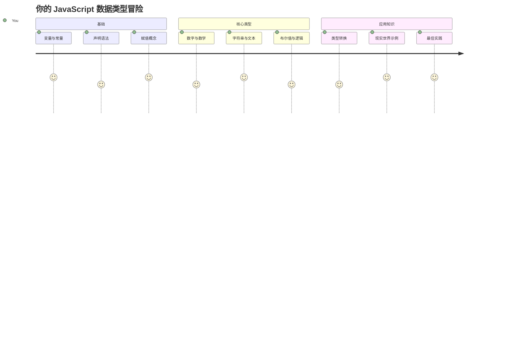
```mermaid
journey
    title 你的 JavaScript 数据类型冒险
    section 基础
      变量与常量: 5: You
      声明语法: 4: You
      赋值概念: 5: You
    section 核心类型
      数字与数学: 4: You
      字符串与文本: 5: You
      布尔值与逻辑: 4: You
    section 应用知识
      类型转换: 4: You
      现实世界示例: 5: You
      最佳实践: 5: You
```
数据类型是 JavaScript 中你在每个程序中都会遇到的基本概念之一。把数据类型想象成古代亚历山大图书管理员使用的归档系统 —— 他们为包含诗歌、数学和历史记录的卷轴设定了特定的存放位置。JavaScript 以类似的方式组织信息，不同类别用于不同类型的数据。

在本课中，我们将探索让 JavaScript 工作的核心数据类型。你将学会如何处理数字、文本、真/假值，并理解为什么为程序选择正确的数据类型至关重要。这些概念起初可能看起来抽象，但通过练习，它们将变成你第二天性。

理解数据类型会让 JavaScript 中的其他内容变得更加清晰。就像建筑师需要了解不同的建筑材料才能建造大教堂一样，这些基础知识将支撑你未来构建的一切。

## 课前测验
[课前测验](https://ff-quizzes.netlify.app/web/)

本课涵盖了 JavaScript 的基础知识，这种语言为网页提供交互性。

> 你可以在 [Microsoft Learn](https://docs.microsoft.com/learn/modules/web-development-101-variables/?WT.mc_id=academic-77807-sagibbon) 上学习本课程！

> 🎥 点击上方图片观看关于变量与数据类型的视频

让我们从变量以及填充变量的数据类型开始吧！

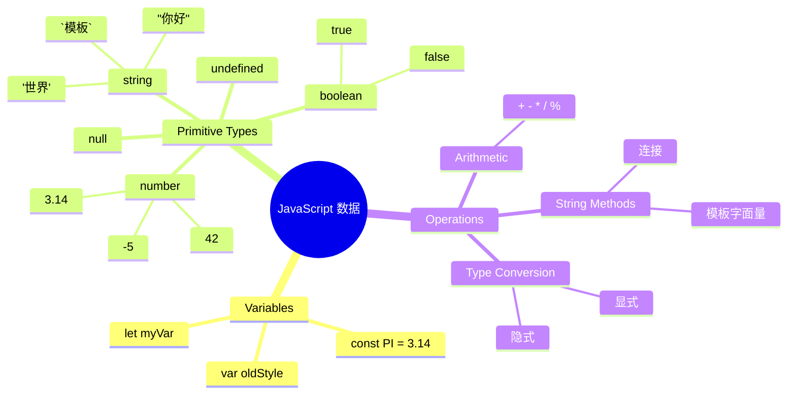
```mermaid
mindmap
  root((JavaScript 数据))
    Variables
      let myVar
      const PI = 3.14
      var oldStyle
    Primitive Types
      number
        42
        3.14
        -5
      string
        "你好"
        '世界'
        `模板`
      boolean
        true
        false
      undefined
      null
    Operations
      Arithmetic
        + - * / %
      String Methods
        连接
        模板字面量
      Type Conversion
        隐式
        显式
```
## 变量

变量是编程中的基础构件。就像中世纪炼金术士用于存放不同物质的标记罐子，变量让你存储信息并给它一个描述性的名称，以便以后引用。需要记住某人的年龄？将其存储在名为 `age` 的变量里。想追踪用户的名字？把它保存在 `userName` 变量中。

我们将专注于 JavaScript 中创建变量的现代方法。这里学习的技巧代表了语言多年来的发展和编程社区的最佳实践。

创建和 **声明** 变量的语法是 **[关键字] [名称]**。它由两部分组成：

- **关键字**。对可变的变量使用 `let`，对保持不变的值使用 `const`。
- **变量名**，是你自己选择的描述性名称。

✅ 关键字 `let` 是在 ES6 中引入的，赋予变量所谓的 _块作用域_。推荐使用 `let` 或 `const` 替代旧的 `var` 关键字。我们将在后续部分更深入地讲解块作用域。

### 任务 - 使用变量

1. **声明变量**。让我们先创建第一个变量：

    ```javascript
    let myVariable;
    ```

   **这样做的效果：**
   - 告诉 JavaScript 创建一个叫做 `myVariable` 的存储位置
   - JavaScript 在内存中为该变量分配空间
   - 变量当前没有值（undefined）

2. **赋值**。现在给变量赋一个值：

    ```javascript
    myVariable = 123;
    ```

   **赋值的工作原理：**
   - `=` 操作符将值 123 赋给了变量
   - 变量现在包含该值，不再是 undefined
   - 你可以在代码中使用 `myVariable` 引用这个值

   > 注意：本课中 `=` 表示“赋值操作符”，用于给变量设置值，不表示等号。

3. **聪明做法**。实际上，我们可以把这两个步骤合并：

    ```javascript
    let myVariable = 123;
    ```

    **这种做法更高效：**
    - 在一条语句中声明变量并赋值
    - 这是开发者的标准实践
    - 代码更简洁且保持清晰

4. **改变想法**。如果想存储不同的数字呢？

   ```javascript
   myVariable = 321;
   ```

   **重新赋值的理解：**
   - 变量现在包含 321 而不是 123
   - 之前的值被替换 —— 变量一次只存储一个值
   - 这种可变性是用 `let` 声明变量的关键特征

   ✅ 试试看！你可以直接在浏览器中写 JavaScript。打开浏览器窗口，进入开发者工具。在控制台提示符下，输入 `let myVariable = 123`，回车，然后输入 `myVariable`。会发生什么呢？你将在后续课程中了解更多这些概念。

### 🧠 **变量掌握检测：提升熟练度**

**来看看你对变量的理解：**
- 你能解释声明变量和赋值变量的区别吗？
- 如果你在声明变量之前使用它，会发生什么？
- 在什么情况下你会选择用 `let` 而不是 `const`？

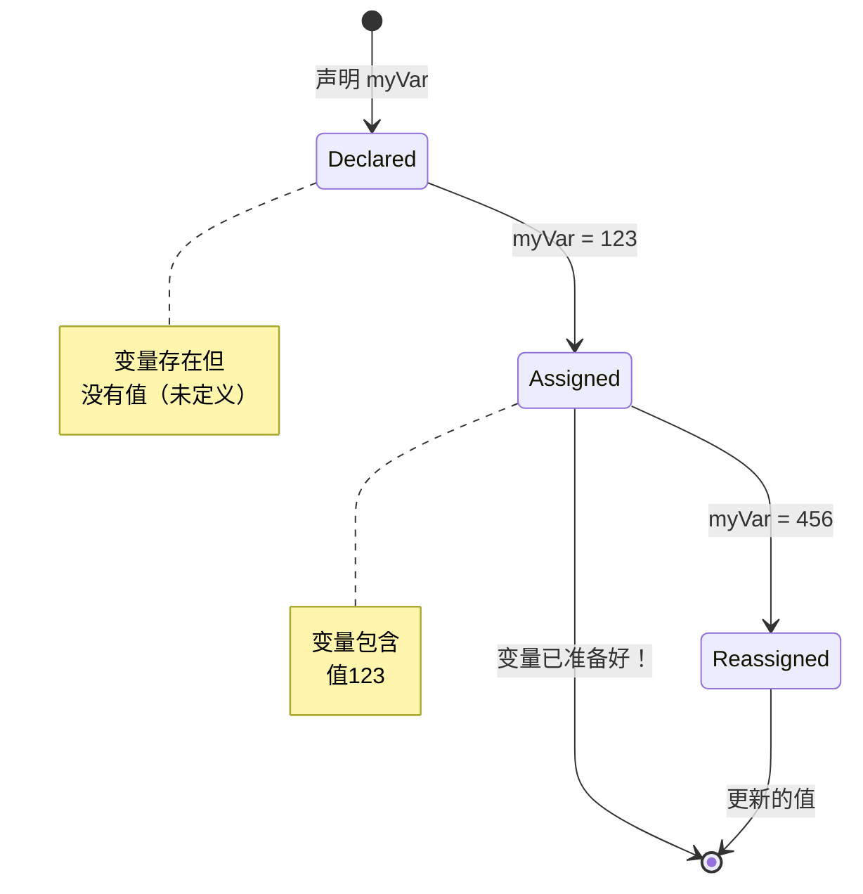
```mermaid
stateDiagram-v2
    [*] --> Declared: 声明 myVar
    Declared --> Assigned: myVar = 123
    Assigned --> Reassigned: myVar = 456
    Assigned --> [*]: 变量已准备好！
    Reassigned --> [*]: 更新的值

    note right of Declared
        变量存在但
        没有值（未定义）
    end note

    note right of Assigned
        变量包含
        值123
    end note
```
> **小提示**：把变量想象成带标签的储物箱。你创建箱子（`let`），把东西放进去（`=`），后续可以替换里面的内容！

## 常量

有时你需要存储在程序执行过程中永远不变的信息。常量就像古希腊欧几里得建立的数学原理 —— 一旦被证明和记录，永远保持不变。

常量的工作方式和变量类似，但有一个重要限制：赋值后不能更改。这种不可变性有助于防止对程序中的关键值发生意外修改。

声明并初始化常量的概念和变量相同，唯一不同的是使用 `const` 关键字。常量通常用全大写字母声明。

```javascript
const MY_VARIABLE = 123;
```

**这段代码做了什么：**
- **创建** 一个名为 `MY_VARIABLE` 的常量，值为 123
- **使用** 常量的全大写命名惯例
- **防止** 未来对该值的任何更改

常量的两条主要规则：

- **必须立即赋值** —— 不允许定义空常量！
- **值永远不能更改** —— 任何尝试更改都会导致错误。来看例子：

   **简单值** - 以下做法是不被允许的：

      ```javascript
      const PI = 3;
      PI = 4; // 不允许
      ```

   **你需要记住的：**
   - **尝试重新赋值常量会导致错误**
   - **保护** 重要的数值不被意外更改
   - **确保** 程序中值的一致性

   **对象引用是被保护的** - 以下做法不被允许：

      ```javascript
      const obj = { a: 3 };
      obj = { b: 5 } // 不允许
      ```

   **这些概念的理解：**
   - **防止** 用新对象替换整个原对象
   - **保护** 原始对象的引用
   - **保持** 对象在内存中的身份

    **对象值是不被保护的** - 以下做法是允许的：

      ```javascript
      const obj = { a: 3 };
      obj.a = 5;  // 允许
      ```

      **这里发生了什么：**
      - **修改** 对象内部的属性值
      - **保持** 相同的对象引用
      - **表明** 对象内容可以改变，但引用保持不变

   > 注意，`const` 保护的是引用不被重新赋值。值本身不是不可变的，尤其是当它是复杂类型如对象时，值可以改变。

## 数据类型

JavaScript 将信息组织成不同的类别，称为数据类型。这个概念类似于古代学者如何分类知识 —— 亚里士多德区分了不同的推理类型，知道逻辑原则不能统一运用于诗歌、数学和自然哲学。

数据类型很重要，因为不同的操作处理不同种类的信息。就像你不能对一个人的名字进行算术运算，或对数学方程排序一样，JavaScript 需要对每个操作使用合适的数据类型。理解这一点可以避免错误，让代码更可靠。

变量可以存储许多不同类型的值，比如数字和文本。这些不同类型的值统称为**数据类型**。数据类型是软件开发的重要一环，因为它帮助开发者决定如何编写代码以及软件如何运行。此外，某些数据类型具有独特的特性，能够帮助转换或提取值中的附加信息。

✅ 数据类型也称为 JavaScript 的原始数据类型，因为它们是语言提供的最低级别数据类型。共有 7 种原始数据类型：string（字符串）、number（数字）、bigint（大整数）、boolean（布尔值）、undefined（未定义）、null（空值）和 symbol（符号）。花点时间想象这些原始类型分别代表什么。什么是 `zebra`？`0` 是什么？`true` 呢？

### 数字

数字是 JavaScript 中最直接的数据类型。无论你操作像 42 这样整数，还是 3.14 这样的小数，或 -5 这样的负数，JavaScript 都统一处理。

还记得我们之前的变量吗？我们存储的 123 实际上是数字类型：

```javascript
let myVariable = 123;
```

**主要特征：**
- JavaScript 自动识别数字值
- 你可以对这些变量执行数学运算
- 不需要显式声明类型

变量可以存储所有类型的数字，包括小数和负数。数字也可以与算术运算符一起使用，详见下一节。

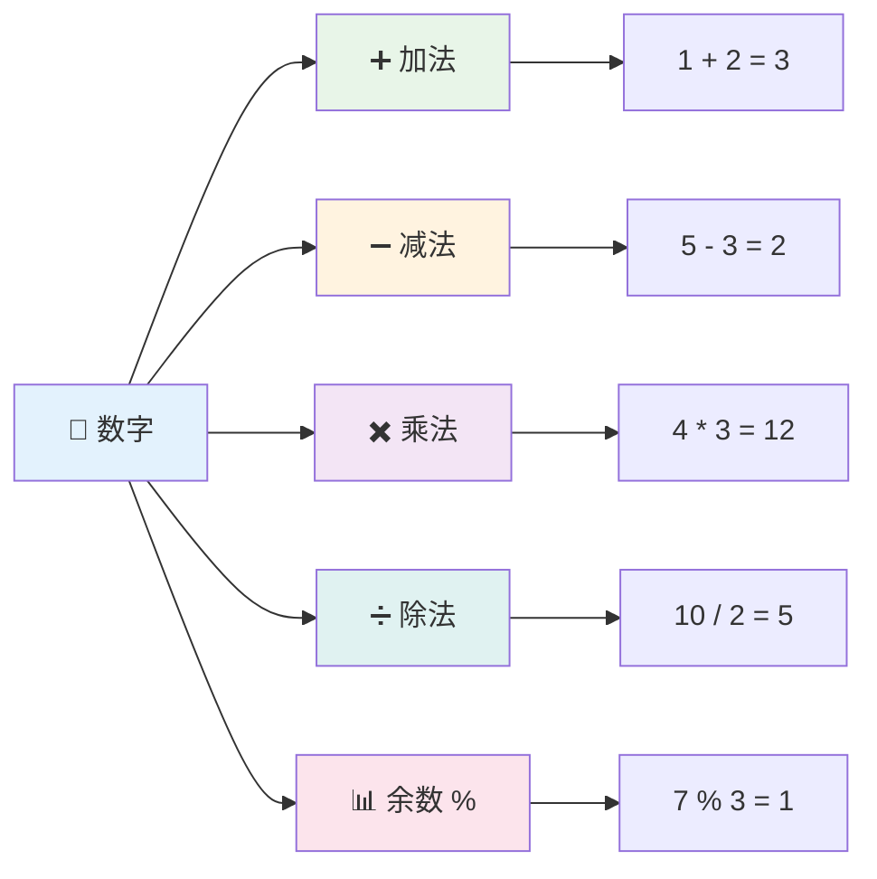
```mermaid
flowchart LR
    A["🔢 数字"] --> B["➕ 加法"]
    A --> C["➖ 减法"]
    A --> D["✖️ 乘法"]
    A --> E["➗ 除法"]
    A --> F["📊 余数 %"]

    B --> B1["1 + 2 = 3"]
    C --> C1["5 - 3 = 2"]
    D --> D1["4 * 3 = 12"]
    E --> E1["10 / 2 = 5"]
    F --> F1["7 % 3 = 1"]

    style A fill:#e3f2fd
    style B fill:#e8f5e8
    style C fill:#fff3e0
    style D fill:#f3e5f5
    style E fill:#e0f2f1
    style F fill:#fce4ec
```
### 算术运算符

算术运算符让你在 JavaScript 中执行数学计算。这些运算符遵循数学家们使用了几个世纪的原则 —— 就像代数学符号的发明者花拉子米一样。

运算符的工作方式和传统数学相符：加号表示加法，减号表示减法，等等。

执行算术运算时，可以使用以下几种运算符：

| 符号   | 描述                                                                 | 示例                              |
| ------ | ------------------------------------------------------------------- | -------------------------------- |
| `+`    | **加法**：计算两个数字的和                                           | `1 + 2 // 预期结果是 3`          |
| `-`    | **减法**：计算两个数字的差                                           | `1 - 2 // 预期结果是 -1`         |
| `*`    | **乘法**：计算两个数字的乘积                                         | `1 * 2 // 预期结果是 2`          |
| `/`    | **除法**：计算两个数字的商                                           | `1 / 2 // 预期结果是 0.5`        |
| `%`    | **取余**：计算两个数字相除后的余数                                   | `1 % 2 // 预期结果是 1`          |

✅ 试试看！在浏览器的控制台尝试一个算术运算，结果有没有让你感到惊讶？

### 🧮 **数学技能检测：自信计算**

**测试你的算术理解：**
- `/`（除法）和 `%`（取余）有什么区别？
- 你能预测 `10 % 3` 的结果吗？（提示：不是 3.33……）
- 为什么在编程中取余运算符很有用？

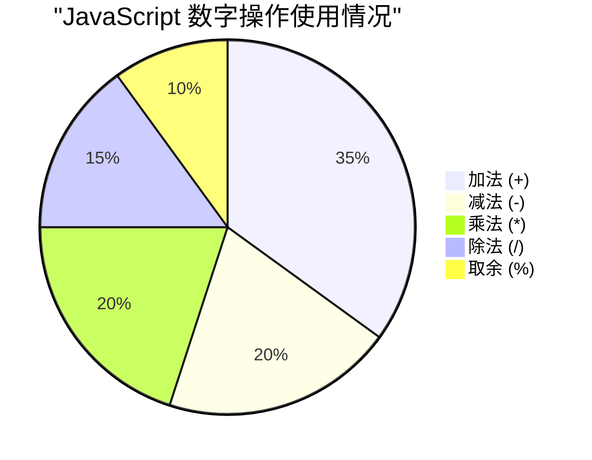
```mermaid
pie title "JavaScript 数字操作使用情况"
    "加法 (+)" : 35
    "减法 (-)" : 20
    "乘法 (*)" : 20
    "除法 (/)" : 15
    "取余 (%)" : 10
```
> **现实世界的启示**：取余运算符 % 非常有用，可以用来检查数字的偶奇性，创建模式，或在数组中循环！

### 字符串

在 JavaScript 中，文本数据由字符串表示。“字符串”一词来自字符按顺序串联的概念，就像中世纪修道院的抄写员将字母连接成词句记录在手稿里。

字符串是网页开发的基础。网站上显示的每段文本 —— 用户名、按钮标签、错误信息、内容 —— 都是字符串数据。理解字符串对创建功能性用户界面至关重要。

字符串是一组字符，放在单引号或双引号之间。

```javascript
'This is a string'
"This is also a string"
let myString = 'This is a string value stored in a variable';
```

**理解这些概念：**
- **使用** 单引号 `'` 或 双引号 `"` 来定义字符串
- **存储** 可以包含字母、数字和符号的文本数据
- **将** 字符串值赋给变量以供后续使用
- **需要** 使用引号以区分文本和变量名

记住写字符串时一定要用引号，否则 JavaScript 会把它当作变量名。

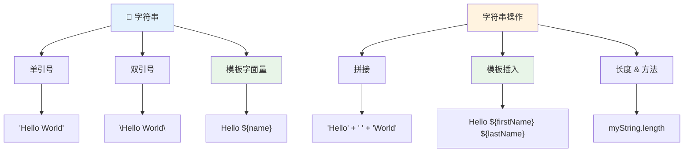
```mermaid
flowchart TD
    A["📝 字符串"] --> B["单引号"]
    A --> C["双引号"]
    A --> D["模板字面量"]

    B --> B1["'Hello World'"]
    C --> C1["\"Hello World\""]
    D --> D1["`Hello \${name}`"]

    E["字符串操作"] --> F["拼接"]
    E --> G["模板插入"]
    E --> H["长度 & 方法"]

    F --> F1["'Hello' + ' ' + 'World'"]
    G --> G1["`Hello \${firstName} \${lastName}`"]
    H --> H1["myString.length"]

    style A fill:#e3f2fd
    style E fill:#fff3e0
    style D fill:#e8f5e8
    style G fill:#e8f5e8
```
### 字符串格式化

字符串操作让你可以组合文本元素、插入变量，并创建响应程序状态的动态内容。这种技术让你能够以编程方式构造文本。

常常需要把多个字符串合并 —— 这个过程叫做连接。
要**连接**两个或多个字符串，或将它们连接在一起，使用 `+` 运算符。

```javascript
let myString1 = "Hello";
let myString2 = "World";

myString1 + myString2 + "!"; //你好，世界！
myString1 + " " + myString2 + "!"; //你好，世界！
myString1 + ", " + myString2 + "!"; //你好，世界！
```

**一步步来看，发生了什么：**
- 使用 `+` 运算符合并多个字符串
- 第一个例子中**直接连接**字符串，中间没有空格
- 在字符串之间**添加**空格字符 `" "` 以增加可读性
- **插入**逗号等标点符号以创建正确的格式

✅ 为什么在 JavaScript 中 `1 + 1 = 2`，但 `'1' + '1' = 11`？想一想。那 `'1' + 1` 会怎样？

**模板字符串**是另一种格式化字符串的方式，不同于引号，使用反引号 `` ` ``。所有非纯文本内容都必须放在占位符 `${ }` 内。这包括任何可能是字符串的变量。

```javascript
let myString1 = "Hello";
let myString2 = "World";

`${myString1} ${myString2}!` //你好，世界！
`${myString1}, ${myString2}!` //你好，世界！
```

**我们来理解每个部分：**
- 使用反引号 `` ` `` 替代普通引号来创建模板字符串
- 直接使用 `${}` 占位符语法嵌入变量
- 精确保留空格和格式
- 提供一种更简洁的方法来构建包含变量的复杂字符串

你可以用上述任一方法实现你的格式需求，但模板字符串会尊重所有空格和换行。

✅ 什么时候你会选择使用模板字符串而非普通字符串？

### 🔤 **字符串掌握检测：文本操作自信度**

**评估你的字符串技能：**
- 你能解释为什么 `'1' + '1'` 等于 `'11'` 而不是 `2` 吗？
- 你觉得哪种字符串方法更易读：连接符还是模板字符串？
- 如果忘记给字符串加引号，会发生什么？

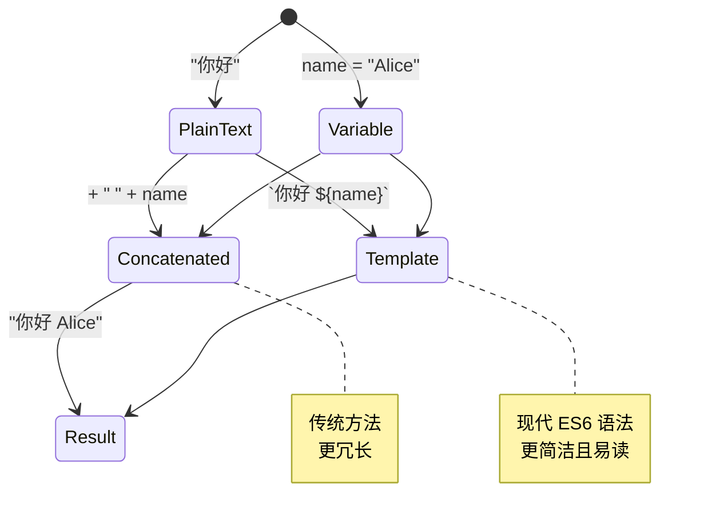
```mermaid
stateDiagram-v2
    [*] --> PlainText: "你好"
    [*] --> Variable: name = "Alice"
    PlainText --> Concatenated: + " " + name
    Variable --> Concatenated
    PlainText --> Template: `你好 ${name}`
    Variable --> Template
    Concatenated --> Result: "你好 Alice"
    Template --> Result

    note right of Concatenated
        传统方法
        更冗长
    end note

    note right of Template
        现代 ES6 语法
        更简洁且易读
    end note
```
> **专家提示**：模板字符串通常更适合复杂字符串构建，因为它们更易读且能优雅处理多行字符串！

### 布尔值

布尔值代表最简单的数据形式：它们只能有两个值之一——`true` 或 `false`。这种二元逻辑系统可追溯到19世纪数学家乔治·布尔（George Boole）开发的布尔代数。

尽管简单，布尔值对程序逻辑至关重要。它们让代码能基于条件做出决策——比如用户是否已登录，是否点击了按钮，或是否满足某些条件。

布尔值只能是两个值之一：`true` 或 `false`。布尔值有助于根据特定条件决定哪些代码行应该运行。在许多情况下，运算符帮助设置布尔值的值，而你也常会看到并写出变量初始化或使用运算符更新其值。

```javascript
let myTrueBool = true;
let myFalseBool = false;
```

**在上例中，我们：**
- **创建**了一个存储布尔值 `true` 的变量
- **演示**了如何存储布尔值 `false`
- **使用**了准确的关键字 `true` 和 `false`（无需引号）
- **准备**了这些变量供条件语句使用

✅ 如果变量计算结果为布尔 `true`，它可以被认为是“真值”。有趣的是，在 JavaScript 中，[除非定义为假值，否则所有值都是“真值”](https://developer.mozilla.org/docs/Glossary/Truthy)。

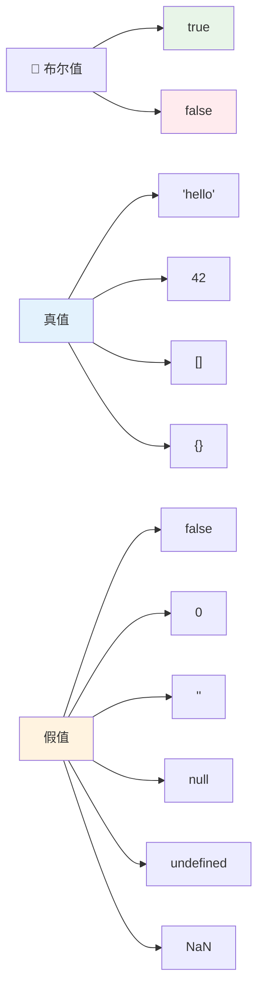
```mermaid
flowchart LR
    A["🔘 布尔值"] --> B["true"]
    A --> C["false"]

    D["真值"] --> D1["'hello'"]
    D --> D2["42"]
    D --> D3["[]"]
    D --> D4["{}"]

    E["假值"] --> E1["false"]
    E --> E2["0"]
    E --> E3["''"]
    E --> E4["null"]
    E --> E5["undefined"]
    E --> E6["NaN"]

    style B fill:#e8f5e8
    style C fill:#ffebee
    style D fill:#e3f2fd
    style E fill:#fff3e0
```
### 🎯 **布尔逻辑检测：决策能力**

**测试你的布尔理解：**
- 为什么你认为 JavaScript 中有“真值”和“假值”，而不仅仅是 `true` 和 `false`？
- 你能预测以下哪些是假值吗：`0`、`"0"`、`[]`、`"false"`？
- 布尔值如何在控制程序流程中发挥作用？

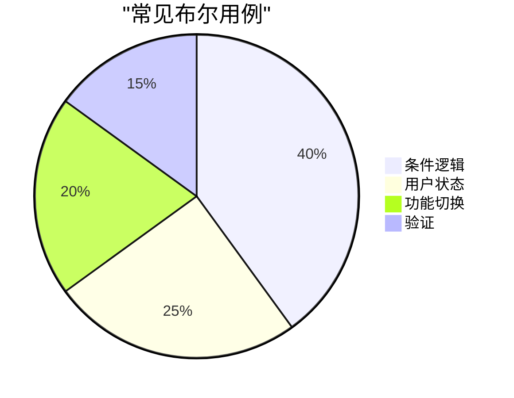
```mermaid
pie title "常见布尔用例"
    "条件逻辑" : 40
    "用户状态" : 25
    "功能切换" : 20
    "验证" : 15
```
> **记住**：在 JavaScript 中，只有 6 个是假值：`false`、`0`、`""`、`null`、`undefined` 和 `NaN`。其他全部是真值！

## 📊 **你的数据类型工具包总结**

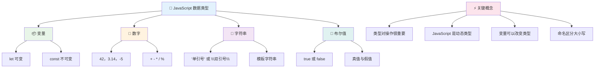
```mermaid
graph TD
    A["🎯 JavaScript 数据类型"] --> B["📦 变量"]
    A --> C["🔢 数字"]
    A --> D["📝 字符串"]
    A --> E["🔘 布尔值"]

    B --> B1["let 可变"]
    B --> B2["const 不可变"]

    C --> C1["42，3.14，-5"]
    C --> C2["+ - * / %"]

    D --> D1["'单引号' 或 \\\"双引号\\\""]
    D --> D2["`模板字符串`"]

    E --> E1["true 或 false"]
    E --> E2["真值与假值"]

    F["⚡ 关键概念"] --> F1["类型对操作很重要"]
    F --> F2["JavaScript 是动态类型"]
    F --> F3["变量可以改变类型"]
    F --> F4["命名区分大小写"]

    style A fill:#e3f2fd
    style B fill:#e8f5e8
    style C fill:#fff3e0
    style D fill:#f3e5f5
    style E fill:#e0f2f1
    style F fill:#fce4ec
```
## GitHub Copilot Agent 挑战 🚀

使用 Agent 模式完成以下挑战：

**描述：** 创建一个个人信息管理程序，演示本课中学到的所有 JavaScript 数据类型，同时处理实际数据场景。

**提示：** 构建一个 JavaScript 程序，创建一个用户资料对象，包含：个人姓名（字符串）、年龄（数字）、是否为学生状态（布尔）、喜爱的颜色数组，以及含有街道、城市和邮编属性的地址对象。包括显示资料信息和更新各字段的函数。确保演示字符串连接、模板字符串、年龄的算术操作，以及学生状态的布尔逻辑。

了解更多关于[Agent 模式](https://code.visualstudio.com/blogs/2025/02/24/introducing-copilot-agent-mode)。

## 🚀 挑战

JavaScript 有一些行为可能让开发者措手不及。这里有一个经典范例：试着在浏览器控制台输入：`let age = 1; let Age = 2; age == Age`，然后观察结果。它返回 `false` —— 你能找出原因吗？

这代表了许多值得理解的 JavaScript 行为熟悉这些怪癖将帮助你写出更可靠的代码，更高效地调试问题。

## 课后测验
[课后测验](https://ff-quizzes.netlify.app)

## 复习与自学

看看[这份 JavaScript 练习列表](https://css-tricks.com/snippets/javascript/)，尝试其中一个。你学到了什么？

## 作业

[数据类型练习](assignment.md)

## 🚀 你的 JavaScript 数据类型掌握时间表

### ⚡ **接下来 5 分钟你可以做什么**
- [ ] 打开浏览器控制台，创建 3 个不同数据类型的变量
- [ ] 尝试挑战题：`let age = 1; let Age = 2; age == Age`，并找出为什么结果是 false
- [ ] 练习用名字和喜欢的数字进行字符串连接
- [ ] 测试将数字加到字符串上会发生什么

### 🎯 **这小时你可以完成什么**
- [ ] 完成课后测验并复习任何有疑惑的概念
- [ ] 创建一个简单计算器，实现加减乘除两数运算
- [ ] 使用模板字符串构建简单的姓名格式化器
- [ ] 探索 `==` 与 `===` 比较运算符的区别
- [ ] 练习不同数据类型之间的转换

### 📅 **你的一周 JavaScript 基础**
- [ ] 自信且富有创造力地完成作业
- [ ] 创建一个包含所有学过数据类型的个人资料对象
- [ ] 练习使用[来自 CSS-Tricks 的 JavaScript 练习](https://css-tricks.com/snippets/javascript/)
- [ ] 构建一个使用布尔逻辑的简单表单验证器
- [ ] 试验数组和对象数据类型（预览后续课程）
- [ ] 加入 JavaScript 社区，提出关于数据类型的问题

### 🌟 **你一个月的转变**
- [ ] 将数据类型知识融入更大型的编程项目
- [ ] 理解何时以及为何在实际应用中使用每种数据类型
- [ ] 帮助其他初学者理解 JavaScript 基础
- [ ] 构建一个管理不同类型用户数据的小应用
- [ ] 探索高级数据类型概念，如类型强制转换和严格相等
- [ ] 参与开源 JavaScript 项目的文档改进

### 🧠 **最终数据类型掌握检测**

**庆祝你的 JavaScript 基础：**
- 哪种数据类型的行为让你最感惊讶？
- 你讲解变量与常量的区别给朋友时感觉如何？
- 关于 JavaScript 的类型系统你发现的最有趣的事情是什么？
- 你能想象用这些基础构建什么实际应用？

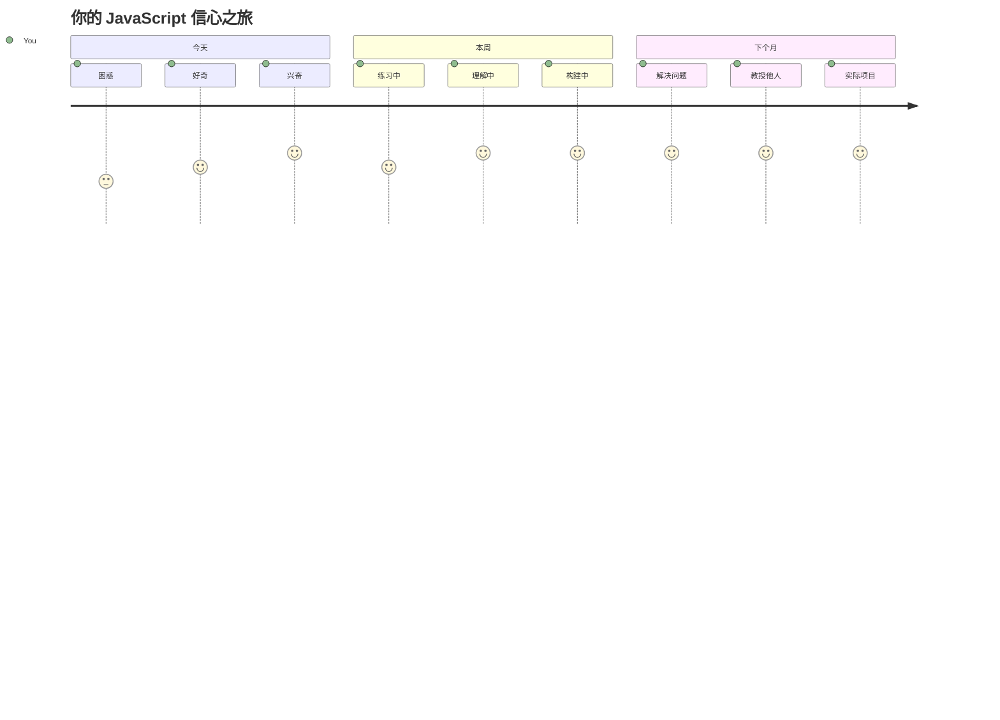
```mermaid
journey
    title 你的 JavaScript 信心之旅
    section 今天
      困惑: 3: You
      好奇: 4: You
      兴奋: 5: You
    section 本周
      练习中: 4: You
      理解中: 5: You
      构建中: 5: You
    section 下个月
      解决问题: 5: You
      教授他人: 5: You
      实际项目: 5: You
```
> 💡 **你已经打好了基础！** 了解数据类型就像学字母表为写故事做准备。你写的每个 JavaScript 程序都会用到这些基本概念。你现在拥有构建交互式网站、动态应用以及用代码解决实际问题的基石。欢迎来到奇妙的 JavaScript 世界！ 🎉

**免责声明**：
本文件使用人工智能翻译服务 [Co-op Translator](https://github.com/Azure/co-op-translator) 进行翻译。虽然我们力求准确，但请注意自动翻译可能存在错误或不准确之处。应以原始语言的原版文件为权威来源。对于关键信息，建议寻求专业人工翻译。因使用本翻译而产生的任何误解或误译，我们概不负责。

# 数据类型练习：电子商务购物车

## 说明

想象你正在构建一个现代的电子商务购物车系统。此作业将帮助你理解不同的 JavaScript 数据类型如何协同工作以创建真实世界的应用程序。

### 你的任务

创建一个关于如何在购物车应用中使用 JavaScript 数据类型的全面分析。针对七种原始数据类型和对象，你需要：

1. **识别** 数据类型及其用途
2. **解释** 为什么这种数据类型是特定购物车功能的最佳选择
3. **提供** 展示该数据类型使用的真实代码示例
4. **描述** 这种数据类型如何与购物车的其他部分交互

### 需要涵盖的数据类型

**原始数据类型：**
- **String**：产品名称、描述、用户信息
- **Number**：价格、数量、税费计算
- **Boolean**：商品可用性、用户偏好、购物车状态
- **Null**：有意为空的值（如缺失的折扣代码）
- **Undefined**：未初始化的值或缺失的数据
- **Symbol**：唯一标识符（高级用法）
- **BigInt**：大额财务计算（高级用法）

**引用类型：**
- **Object**：产品详情、用户资料、购物车内容
- **Array**：产品列表、订单历史、分类

### 每种数据类型的示例格式

对于每个数据类型，按如下结构组织你的回应：

```markdown
## [Data Type Name]

**Purpose in Shopping Cart:** [Explain what this data type does]

**Why This Type:** [Explain why this is the best choice]

**Code Example:**
```javascript
// Your realistic code example here
```

**实际应用：** [描述该数据类型在实践中的工作方式]

**交互关系：** [解释该数据类型如何与其他数据类型协作]
```

### Bonus Challenges

1. **Type Coercion**: Show an example where JavaScript automatically converts between data types in your shopping cart (e.g., string "5" + number 10)

2. **Data Validation**: Demonstrate how you would check if user input is the correct data type before processing

3. **Performance Considerations**: Explain when you might choose one data type over another for performance reasons

### Submission Guidelines

- Create a markdown document with clear headings for each data type
- Include working JavaScript code examples
- Use realistic e-commerce scenarios in your examples
- Explain your reasoning clearly for beginners to understand
- Test your code examples to ensure they work correctly

## Rubric

| Criteria | Exemplary (90-100%) | Proficient (80-89%) | Developing (70-79%) | Needs Improvement (Below 70%) |
|----------|---------------------|---------------------|---------------------|------------------------------|
| **Data Type Coverage** | All 7 primitive types and objects/arrays covered with detailed explanations | 6-7 data types covered with good explanations | 4-5 data types covered with basic explanations | Fewer than 4 data types or minimal explanations |
| **Code Examples** | All examples are realistic, working, and well-commented | Most examples work and are relevant to e-commerce | Some examples work but may be generic | Code examples are incomplete or non-functional |
| **Real-world Application** | Clearly connects each data type to practical shopping cart features | Good connection to e-commerce scenarios | Some connection to shopping cart context | Limited real-world application demonstrated |
| **Technical Accuracy** | All technical information is correct and demonstrates deep understanding | Most technical information is accurate | Generally accurate with minor errors | Contains significant technical errors |
| **Communication** | Explanations are clear, beginner-friendly, and well-organized | Good explanations that are mostly clear | Explanations are understandable but may lack clarity | Explanations are unclear or poorly organized |
| **Bonus Elements** | Includes multiple bonus challenges with excellent execution | Includes one or more bonus challenges well done | Attempts bonus challenges with mixed success | No bonus challenges attempted |

### Learning Objectives

By completing this assignment, you will:
- ✅ **Understand** the seven JavaScript primitive data types and their uses
- ✅ **Apply** data types to real-world programming scenarios
- ✅ **Analyze** when to choose specific data types for different purposes
- ✅ **Create** working code examples that demonstrate data type usage
- ✅ **Explain** technical concepts in beginner-friendly language
- ✅ **Connect** fundamental programming concepts to practical applications

**免责声明**：
本文件由 AI 翻译服务 [Co-op Translator](https://github.com/Azure/co-op-translator) 翻译完成。虽然我们力求准确，但请注意自动翻译可能存在错误或不准确之处。原始文件的母语版本应被视为权威来源。对于关键内容，建议使用专业人工翻译。因使用本翻译所引起的任何误解或误释，我们概不负责。

# JavaScript 基础：方法与函数

图示：JavaScript Basics - Functions
> 速记图由 [Tomomi Imura](https://twitter.com/girlie_mac) 制作

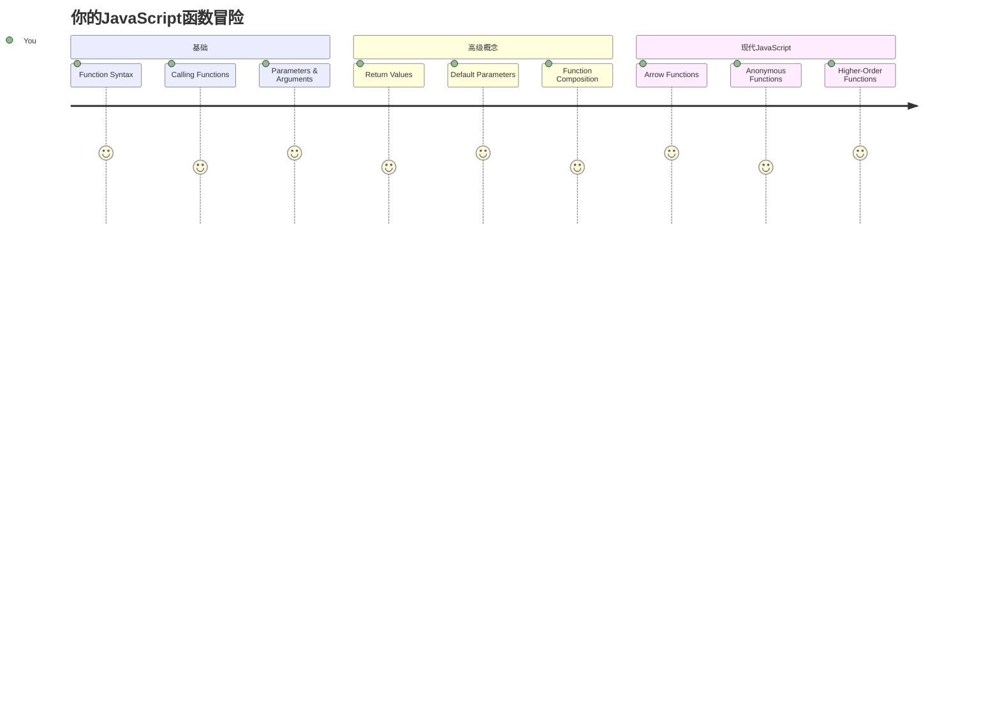
```mermaid
journey
    title 你的JavaScript函数冒险
    section 基础
      Function Syntax: 5: You
      Calling Functions: 4: You
      Parameters & Arguments: 5: You
    section 高级概念
      Return Values: 4: You
      Default Parameters: 5: You
      Function Composition: 4: You
    section 现代JavaScript
      Arrow Functions: 5: You
      Anonymous Functions: 4: You
      Higher-Order Functions: 5: You
```
## 课前测验
[课前测验](https://ff-quizzes.netlify.app)

重复写同样的代码是编程中最常见的挫败感之一。函数解决了这个问题，它让你把代码打包成可重复使用的块。把函数想象成使亨利·福特的装配线革命化的标准化零件——一旦你创建了一个可靠的组件，就可以在任何需要的地方使用它，而不必重新构建。

函数允许你把一段代码打包，这样你就能在整个程序中重复使用它们。你不用到处复制粘贴相同的逻辑，而是创建一个函数，然后在需要时调用它。这种方法让你的代码更有条理，也更容易维护。

在本课中，你将学习如何创建自己的函数、如何传递信息给它们以及如何从中获取有用的结果。你会发现函数和方法的区别，学习现代的语法写法，并看到函数是如何与其他函数协作的。我们将一步步构建这些概念。

> 🎥 点击上方图片查看关于方法与函数的视频。

> 你也可以在 [Microsoft Learn](https://docs.microsoft.com/learn/modules/web-development-101-functions/?WT.mc_id=academic-77807-sagibbon) 上学习本课内容！

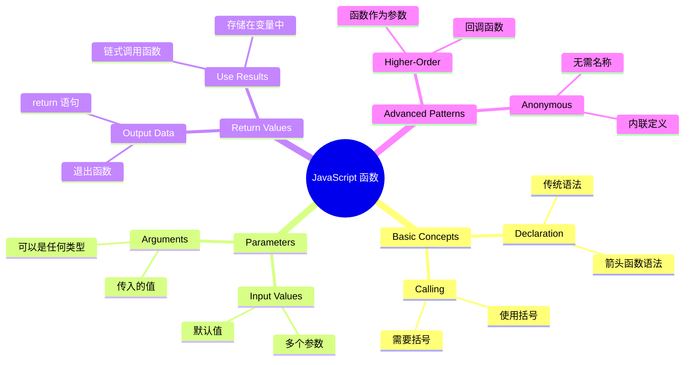
```mermaid
mindmap
  root((JavaScript 函数))
    Basic Concepts
      Declaration
        传统语法
        箭头函数语法
      Calling
        使用括号
        需要括号
    Parameters
      Input Values
        多个参数
        默认值
      Arguments
        传入的值
        可以是任何类型
    Return Values
      Output Data
        return 语句
        退出函数
      Use Results
        存储在变量中
        链式调用函数
    Advanced Patterns
      Higher-Order
        函数作为参数
        回调函数
      Anonymous
        无需名称
        内联定义
```
## 函数

函数是一个自包含的代码块，用来执行特定任务。它封装了你可以在需要时执行的逻辑。

你不用在程序中多次写相同代码，而是把它打包成函数，按需调用。这样你的代码更整洁，也更易更新。想想看，如果你必须修改散落在代码库中二十个不同位置的逻辑，那维护工作会多么复杂。

给函数起一个描述性名字非常重要。一个名字明确的函数可以清晰表达它的目的——当你看到 `cancelTimer()` 时，你立即知道它是做什么的，就像一个标签清晰的按钮告诉你点击后会发生什么一样。

## 创建和调用函数

让我们看看如何创建函数。语法遵循固定模式：

```javascript
function nameOfFunction() { // 函数定义
 // 函数定义/函数体
}
```

我们来拆解一下：
- `function` 关键字告诉 JavaScript “嘿，我正在创建一个函数！”
- `nameOfFunction` 是你给函数起的描述性名字
- 括号 `()` 是你可以添加参数的位置（我们稍后会讲）
- 花括号 `{}` 包含当你调用函数时执行的实际代码

让我们创建一个简单的问候函数，看看效果：

```javascript
function displayGreeting() {
  console.log('Hello, world!');
}
```

这个函数会在控制台打印 "Hello, world!"。定义之后，你可以根据需要多次使用它。

要执行（或“调用”）函数，写函数名后接括号。JavaScript 允许你先调用函数后定义，JavaScript 引擎会处理执行顺序。

```javascript
// 调用我们的函数
displayGreeting();
```

运行这行代码时，它会执行 `displayGreeting` 函数里的所有代码，在浏览器控制台显示 "Hello, world!"。你可以反复调用这个函数。

### 🧠 **函数基础检测：构建你的第一个函数**

**来测试你对基本函数的理解：**
- 为什么函数定义中要用花括号 `{}`？
- 如果只写 `displayGreeting` 而不加括号，会发生什么？
- 为什么你可能想多次调用同一个函数？

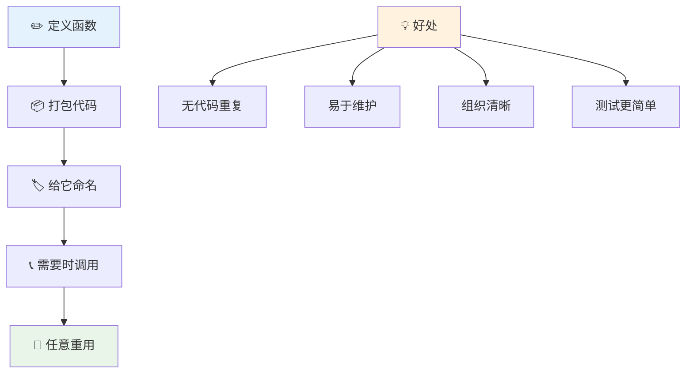
```mermaid
flowchart TD
    A["✏️ 定义函数"] --> B["📦 打包代码"]
    B --> C["🏷️ 给它命名"]
    C --> D["📞 需要时调用"]
    D --> E["🔄 任意重用"]

    F["💡 好处"] --> F1["无代码重复"]
    F --> F2["易于维护"]
    F --> F3["组织清晰"]
    F --> F4["测试更简单"]

    style A fill:#e3f2fd
    style E fill:#e8f5e8
    style F fill:#fff3e0
```
> **注意：** 在本课程中，你一直在使用**方法**。`console.log()` 是一个方法——本质上是属于 `console` 对象的函数。关键区别是方法附属于对象，而函数是独立存在的。很多开发者在日常对话中会混用这两个词。

### 函数最佳实践

这里有几个帮助你写出优秀函数的小贴士：

- 给函数起清晰、描述明确的名字——未来的你会感谢自己！
- 多单词名称使用**驼峰式命名**（比如用 `calculateTotal`，而不是 `calculate_total`）
- 每个函数专注做好一件事

## 给函数传递信息

我们的 `displayGreeting` 函数很有限——它只能显示 “Hello, world!”。参数让函数更灵活更有用。

**参数** 就像占位符，每次调用函数时可以传入不同的值。这样同一个函数每次调用可以使用不同的信息。

定义函数时，你在括号里列出参数，多个参数用逗号分隔：

```javascript
function name(param, param2, param3) {

}
```

每个参数像个占位符——调用函数时，调用者会提供实际值，填入这些位置。

让我们把问候函数改造一下，能接收一个人的名字：

```javascript
function displayGreeting(name) {
  const message = `Hello, ${name}!`;
  console.log(message);
}
```

你会注意到我们使用了反引号 (`` ` ``) 和 `${}` 来直接把名字插入消息中——这叫模板字符串，是构建带变量字符串的很方便方式。

现在调用时，我们可以传入任意名字：

```javascript
displayGreeting('Christopher');
// 运行时显示 “你好，Christopher！”
```

JavaScript 将字符串 `'Christopher'` 赋值给参数 `name`，生成个性化消息 "Hello, Christopher!"

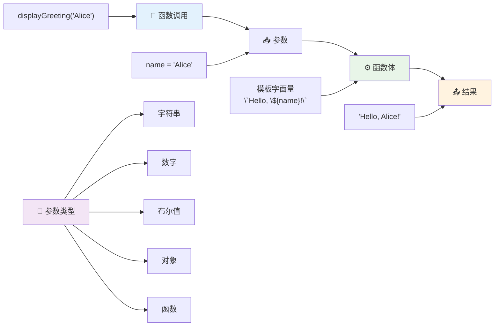
```mermaid
flowchart LR
    A["🎯 函数调用"] --> B["📥 参数"]
    B --> C["⚙️ 函数体"]
    C --> D["📤 结果"]

    A1["displayGreeting('Alice')"] --> A
    B1["name = 'Alice'"] --> B
    C1["模板字面量\n\`Hello, \${name}!\`"] --> C
    D1["'Hello, Alice!'"] --> D

    E["🔄 参数类型"] --> E1["字符串"]
    E --> E2["数字"]
    E --> E3["布尔值"]
    E --> E4["对象"]
    E --> E5["函数"]

    style A fill:#e3f2fd
    style C fill:#e8f5e8
    style D fill:#fff3e0
    style E fill:#f3e5f5
```
## 默认值

如果我们想让某些参数可选怎么办？这时默认值很有用！

假设我们希望用户能自定义问候语，但如果没指定，就默认用 "Hello"。你可以用等号设置默认值，就像变量赋值一样：

```javascript
function displayGreeting(name, salutation='Hello') {
  console.log(`${salutation}, ${name}`);
}
```

这里，`name` 仍是必需的，`salutation` 则有默认的 `'Hello'`，如果调用者不传就用默认值。

这样我们可以用两种方式调用函数：

```javascript
displayGreeting('Christopher');
// 显示 "Hello, Christopher"

displayGreeting('Christopher', 'Hi');
// 显示 "Hi, Christopher"
```

第一次调用没传问候语，JavaScript 用默认的 "Hello"。第二次调用传了 "Hi"，它就用这个自定义值。这种灵活性让函数能适应不同场景。

### 🎛️ **参数掌握检测：让函数更灵活**

**考考你对参数的理解：**
- 参数和实参有什么区别？
- 为什么默认值在实际编程中有用？
- 如果传入的实参比参数多，会发生什么？

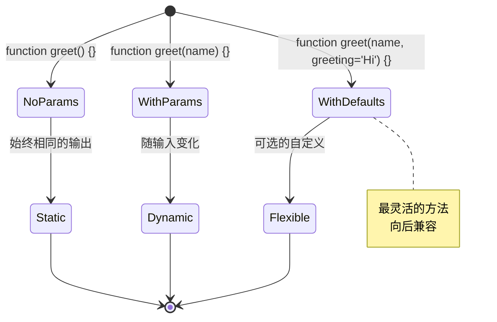
```mermaid
stateDiagram-v2
    [*] --> NoParams: function greet() {}
    [*] --> WithParams: function greet(name) {}
    [*] --> WithDefaults: function greet(name, greeting='Hi') {}

    NoParams --> Static: 始终相同的输出
    WithParams --> Dynamic: 随输入变化
    WithDefaults --> Flexible: 可选的自定义

    Static --> [*]
    Dynamic --> [*]
    Flexible --> [*]

    note right of WithDefaults
        最灵活的方法
        向后兼容
    end note
```
> **专业提示**：默认参数让函数对用户更友好，用户可以快速开始，用合适的默认值，但也能按需自定义！

## 返回值

到目前为止我们的函数只是打印消息，但万一你想让函数计算并返回结果呢？

这就用到**返回值**。函数不仅可以显示内容，还能返回值，你可以把返回值存到变量里，或者用于代码的其他部分。

使用 `return` 关键字，后面跟你想返回的值：

```javascript
return myVariable;
```

这里需要注意的是：函数遇到 `return` 语句，会立即停止执行，并把那个值返回给调用它的人。

来修改一下问候函数，不打印只返回消息：

```javascript
function createGreetingMessage(name) {
  const message = `Hello, ${name}`;
  return message;
}
```

这个函数不打印消息，而是构造消息并返回给调用方。

要用返回值，我们可以像处理其他值一样，把它存到变量里：

```javascript
const greetingMessage = createGreetingMessage('Christopher');
```

现在 `greetingMessage` 变量里保存了 "Hello, Christopher"，我们可以在代码里任何地方使用——网页中显示，发送邮件，或者传给其他函数。

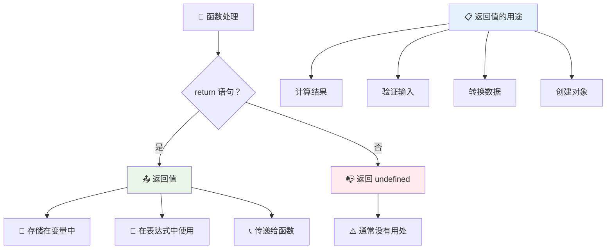
```mermaid
flowchart TD
    A["🔧 函数处理"] --> B{"return 语句？"}
    B -->|是| C["📤 返回值"]
    B -->|否| D["📭 返回 undefined"]

    C --> E["💾 存储在变量中"]
    C --> F["🔗 在表达式中使用"]
    C --> G["📞 传递给函数"]

    D --> H["⚠️ 通常没有用处"]

    I["📋 返回值的用途"] --> I1["计算结果"]
    I --> I2["验证输入"]
    I --> I3["转换数据"]
    I --> I4["创建对象"]

    style C fill:#e8f5e8
    style D fill:#ffebee
    style I fill:#e3f2fd
```
### 🔄 **返回值检测：拿回结果**

**评估你对返回值的理解：**
- 函数里 `return` 后的代码会怎样？
- 为什么返回值通常比只打印更好？
- 函数能返回不同类型的值（字符串、数字、布尔）吗？

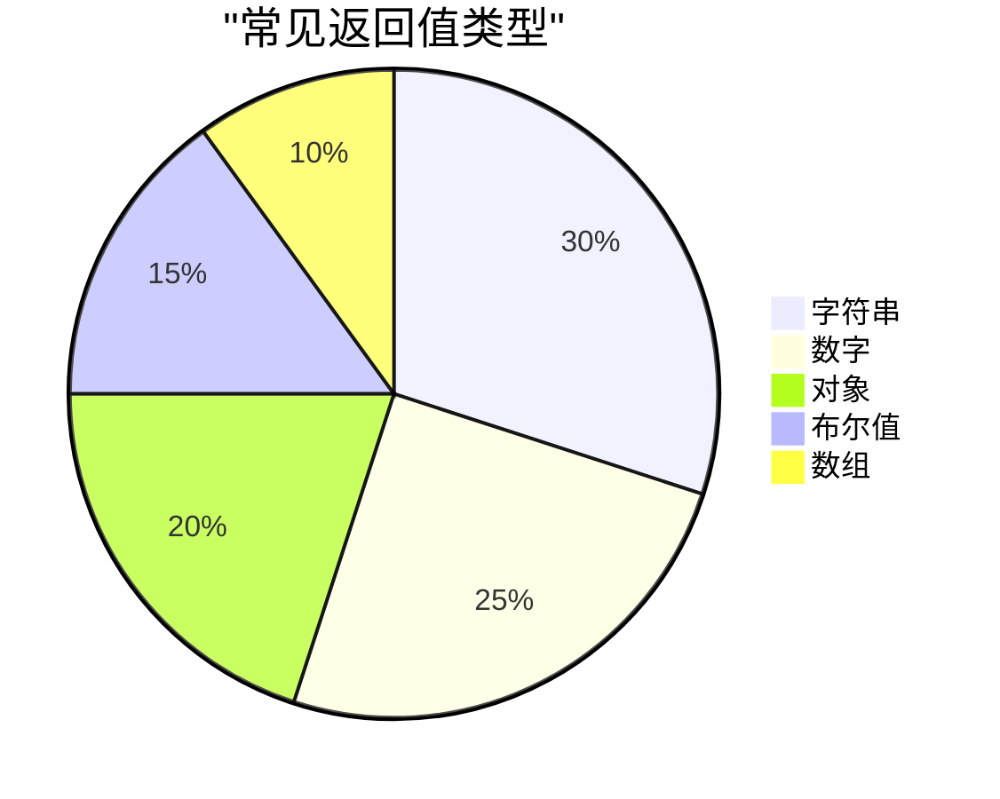
```mermaid
pie title "常见返回值类型"
    "字符串" : 30
    "数字" : 25
    "对象" : 20
    "布尔值" : 15
    "数组" : 10
```
> **关键洞察**：返回值的函数更灵活，调用方决定如何处理结果。这让代码更模块化，更易复用！

## 作为参数的函数

函数可以作为参数传递给其他函数。刚开始这可能有点复杂，但这是个强大特性，能实现灵活的编程模式。

这种模式很常见，比如你想说“当某事发生时，执行另一段代码”。比如，“计时结束时执行这段代码”，“用户点击按钮时调用这个函数”。

来看 `setTimeout`，这是一个内置函数，会等待一段时间再运行代码。你得告诉它跑什么代码——传函数给它就是完美用法！

试试这段代码，3秒后你会看到消息：

```javascript
function displayDone() {
  console.log('3 seconds has elapsed');
}
// 定时器值以毫秒为单位
setTimeout(displayDone, 3000);
```

注意我们把 `displayDone`（没有括号）传给 `setTimeout`。我们不是自己调用它，而是把函数交给 `setTimeout`，让它3秒后调用。

### 匿名函数

有时候你只用一次函数，不想给它起名字。想想看——只用一次，为何要额外起一个名字占用代码空间？

JavaScript 支持**匿名函数**——没有名字的函数，你可以直接在需要的地方定义它们。

改写上面计时例子，使用匿名函数：

```javascript
setTimeout(function() {
  console.log('3 seconds has elapsed');
}, 3000);
```

效果一样，但函数定义直接写在 `setTimeout` 调用里，不需分开声明函数。

### 箭头函数

现代 JavaScript 有更简短的函数写法，叫**箭头函数**。它用 `=>`（看起来像箭头——你懂的）表示，开发者极其喜欢用。

箭头函数省略了 `function` 关键字，写起代码更简洁。

这就是用箭头函数写的计时例子：

```javascript
setTimeout(() => {
  console.log('3 seconds has elapsed');
}, 3000);
```

`()` 里放参数（这里空着），接箭头 `=>`，最后是花括号里的函数体。功能一样，语法更紧凑。

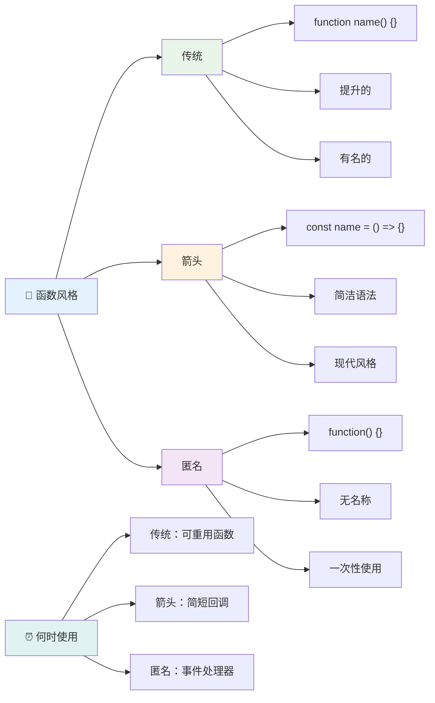
```mermaid
flowchart LR
    A["📝 函数风格"] --> B["传统"]
    A --> C["箭头"]
    A --> D["匿名"]

    B --> B1["function name() {}"]
    B --> B2["提升的"]
    B --> B3["有名的"]

    C --> C1["const name = () => {}"]
    C --> C2["简洁语法"]
    C --> C3["现代风格"]

    D --> D1["function() {}"]
    D --> D2["无名称"]
    D --> D3["一次性使用"]

    E["⏰ 何时使用"] --> E1["传统：可重用函数"]
    E --> E2["箭头：简短回调"]
    E --> E3["匿名：事件处理器"]

    style A fill:#e3f2fd
    style B fill:#e8f5e8
    style C fill:#fff3e0
    style D fill:#f3e5f5
    style E fill:#e0f2f1
```
### 何时使用哪种写法

什么时候用哪种？一个实用指南是：如果你要多次调用一个函数，给它起名并单独定义；若只用一次，可以考虑匿名函数。箭头函数和传统语法都有效，但箭头函数是现代代码的主流。

### 🎨 **函数风格掌握检测：选择合适的语法**

**考考你对语法的理解：**
- 什么时候你更喜欢用箭头函数？
- 匿名函数的最大优势是什么？
- 你能想到啥场景中有名函数优于匿名函数？

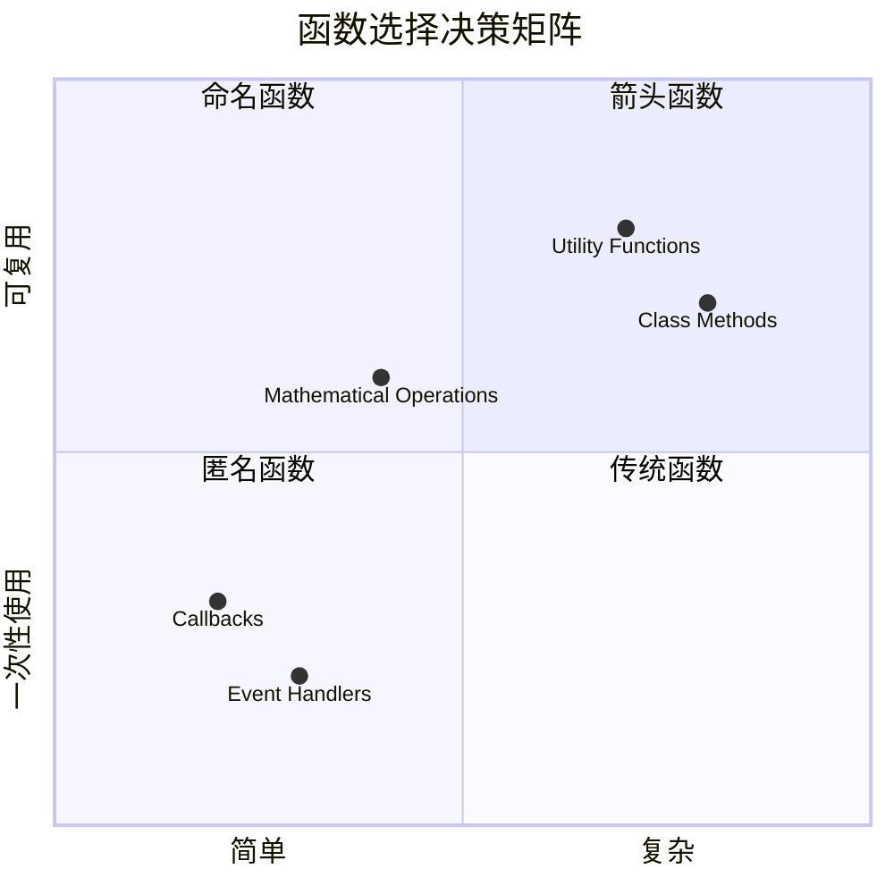
```mermaid
quadrantChart
    title 函数选择决策矩阵
    x-axis 简单 --> 复杂
    y-axis 一次性使用 --> 可复用
    quadrant-1 箭头函数
    quadrant-2 命名函数
    quadrant-3 匿名函数
    quadrant-4 传统函数

    Event Handlers: [0.3, 0.2]
    Utility Functions: [0.7, 0.8]
    Callbacks: [0.2, 0.3]
    Class Methods: [0.8, 0.7]
    Mathematical Operations: [0.4, 0.6]
```
> **现代趋势**：箭头函数因为简洁，成为许多开发者的默认选择，但传统函数依然有用武之地！

## 🚀 挑战

你能用一句话说清函数和方法的区别吗？试试看！

## GitHub Copilot Agent 挑战 🚀

用 Agent 模式完成以下挑战：

**描述：** 创建一个数学函数工具库，演示本课中涉及的函数概念，包括参数、默认值、返回值和箭头函数。

**提示：** 创建一个叫 `mathUtils.js` 的 JavaScript 文件，包含以下函数：
1. 一个 `add` 函数，接受两个参数，返回它们的和
2. 一个带默认参数值的 `multiply` 函数（第二个参数默认是1）
3. 一个箭头函数 `square`，接受一个数字返回它的平方
4. 一个 `calculate` 函数，接受另一个函数和两个数字作为参数，然后对这两个数字应用该函数
5. 展示对每个函数的调用示例和测试用例

了解更多关于 [agent模式](https://code.visualstudio.com/blogs/2025/02/24/introducing-copilot-agent-mode) 。

## 课后测验
[课后测验](https://ff-quizzes.netlify.app)

## 复习与自学

值得[多读一些箭头函数](https://developer.mozilla.org/docs/Web/JavaScript/Reference/Functions/Arrow_functions)的内容，因为它们在代码库中用得越来越多。练习写函数，然后用这种语法改写。

## 作业

[Fun with Functions](assignment.md)

## 🧰 **你的 JavaScript 函数工具包总结**

```mermaid
graph TD
    A["🎯 JavaScript 函数"] --> B["📋 函数声明"]
    A --> C["📥 参数"]
    A --> D["📤 返回值"]
    A --> E["🎨 现代语法"]

    B --> B1["function name() {}"]
    B --> B2["描述性命名"]
    B --> B3["可重用代码块"]

    C --> C1["输入数据"]
    C --> C2["默认值"]
    C --> C3["多个参数"]

    D --> D1["return 语句"]
    D --> D2["退出函数"]
    D --> D3["传回数据"]

    E --> E1["箭头函数: () =>"]
    E --> E2["匿名函数"]
    E --> E3["高阶函数"]

    F["⚡ 关键优势"] --> F1["代码重用性"]
    F --> F2["更好组织"]
    F --> F3["更易测试"]
    F --> F4["模块化设计"]

    style A fill:#e3f2fd
    style B fill:#e8f5e8
    style C fill:#fff3e0
    style D fill:#f3e5f5
    style E fill:#e0f2f1
    style F fill:#fce4ec
```

## 🚀 你的 JavaScript 函数掌握时间线

### ⚡ **接下来 5 分钟你可以做的事**
- [ ] 写一个简单函数，返回你最喜欢的数字
- [ ] 创建一个有两个参数的函数，把它们相加
- [ ] 尝试将传统函数转换为箭头函数语法
- [ ] 练习挑战：解释函数和方法之间的区别

### 🎯 **你这小时可以完成的目标**
- [ ] 完成课后测验并复习任何令人困惑的概念
- [ ] 构建 GitHub Copilot 挑战中的数学工具库
- [ ] 创建一个使用另一个函数作为参数的函数
- [ ] 练习编写带有默认参数的函数
- [ ] 试验在函数返回值中使用模板字符串

### 📅 **你的一周函数精通计划**
- [ ] 富有创造性地完成“函数的乐趣”作业
- [ ] 将你编写的一些重复代码重构为可重用函数
- [ ] 仅使用函数构建一个小型计算器（无全局变量）
- [ ] 练习使用数组方法如 `map()` 和 `filter()` 的箭头函数
- [ ] 创建一组用于常见任务的实用函数集合
- [ ] 学习高阶函数和函数式编程概念

### 🌟 **你的一月转变计划**
- [ ] 掌握高级函数概念，如闭包和作用域
- [ ] 构建一个大量使用函数组合的项目
- [ ] 通过改进函数文档为开源项目做贡献
- [ ] 教别人函数及不同语法风格的知识
- [ ] 探索 JavaScript 中的函数式编程范式
- [ ] 创建一个个人可重用函数库以备将来项目使用

### 🏆 **终极函数大师签到**

**庆祝你的函数掌握成就：**
- 到目前为止，你写过的最有用的函数是什么？
- 学习函数如何改变了你对代码组织的思考？
- 你喜欢哪种函数语法，为什么？
- 你会通过写函数解决什么现实世界的问题？

```mermaid
journey
    title 你的函数信心演变
    section 今天
      语法困惑: 3: 你
      理解基础: 4: 你
      编写简单函数: 5: 你
    section 本周
      使用参数: 4: 你
      返回值: 5: 你
      现代语法: 5: 你
    section 下个月
      函数组合: 5: 你
      高级模式: 5: 你
      教授他人: 5: 你
```
> 🎉 **你已掌握编程中最强大的概念之一！** 函数是更大程序的构建模块。你将创建的每个应用程序都会使用函数来组织、重用和结构化代码。你现在理解了如何将逻辑打包成可重用的组件，这使你成为一个更高效、更有效的程序员。欢迎来到模块化编程的世界！🚀

**免责声明**：
本文件由人工智能翻译服务[Co-op Translator](https://github.com/Azure/co-op-translator)翻译完成。虽然我们力求准确，但请注意自动翻译可能包含错误或不准确之处。应以原始语言的文档为权威来源。对于重要信息，建议采用专业人工翻译。我们对因使用本翻译而产生的任何误解或误释不承担任何责任。

# 有趣的函数

## 说明

在本次作业中，你将练习创建不同类型的函数，以巩固你所学的 JavaScript 函数、参数、默认值和返回语句的概念。

创建一个名为 `functions-practice.js` 的 JavaScript 文件，并实现以下函数：

### 第一部分：基础函数
1. **创建一个名为 `sayHello` 的函数**，该函数不接受任何参数，仅在控制台输出 "Hello!"。

2. **创建一个名为 `introduceYourself` 的函数**，该函数接受一个 `name` 参数，并在控制台输出类似 "Hi, my name is [name]" 的消息。

### 第二部分：带默认参数的函数
3. **创建一个名为 `greetPerson` 的函数**，它接受两个参数：`name`（必需）和 `greeting`（可选，默认为 "Hello"）。该函数应在控制台输出类似 "[greeting], [name]!" 的消息。

### 第三部分：返回值的函数
4. **创建一个名为 `addNumbers` 的函数**，它接受两个参数（`num1` 和 `num2`）并返回它们的和。

5. **创建一个名为 `createFullName` 的函数**，它接受 `firstName` 和 `lastName` 参数并返回一个完整的全名字符串。

### 第四部分：综合练习
6. **创建一个名为 `calculateTip` 的函数**，它接受两个参数：`billAmount`（必需）和 `tipPercentage`（可选，默认为 15）。该函数应计算并返回小费金额。

### 第五部分：测试你的函数
添加函数调用，测试每个函数并使用 `console.log()` 显示结果。

**示例测试调用：**
```javascript
// 在这里测试你的函数
sayHello();
introduceYourself("Sarah");
greetPerson("Alex");
greetPerson("Maria", "Hi");

const sum = addNumbers(5, 3);
console.log(`The sum is: ${sum}`);

const fullName = createFullName("John", "Doe");
console.log(`Full name: ${fullName}`);

const tip = calculateTip(50);
console.log(`Tip for $50 bill: $${tip}`);
```

## 评分标准

| 标准 | 优秀 | 及格 | 需改进 |
| -------- | --------- | -------- | ----------------- |
| **函数创建** | 所有 6 个函数均正确实现，语法和命名规范正确 | 4-5 个函数正确实现，语法有轻微问题 | 实现 3 个或更少函数，或存在严重语法错误 |
| **参数和默认值** | 正确使用必需参数、可选参数和默认值 | 参数使用正确但默认值存在问题 | 参数实现不正确或缺失 |
| **返回值** | 应返回值的函数正确返回，不应返回值的函数仅执行操作 | 大多数返回值正确，有轻微问题 | 返回语句有重大问题 |
| **代码质量** | 代码干净、结构良好，变量名有意义，缩进正确 | 代码能工作但可更清晰或更好组织 | 代码难以阅读或结构差 |
| **测试** | 所有函数均使用合适的调用进行测试，结果清晰展示 | 大多数函数测试充分 | 测试有限或测试错误 |

## 额外挑战（可选）

如果你想进一步挑战自己：

1. **创建一个箭头函数版本** 的某个函数
2. **创建一个接受另一个函数作为参数的函数**（如课程中的 `setTimeout` 示例）
3. **添加输入验证**，确保你的函数能够优雅地处理无效输入

> 💡 **提示**：记得打开浏览器的开发者控制台（F12）查看 `console.log()` 语句的输出！

**免责声明**：
本文件使用 AI 翻译服务 [Co-op Translator](https://github.com/Azure/co-op-translator) 进行翻译。尽管我们力求准确，但请注意自动翻译可能存在错误或不准确之处。原始语言版本的文件应被视为权威来源。对于重要信息，建议使用专业人工翻译。因使用此翻译而引起的任何误解或误释，我们概不负责。

# JavaScript基础：做出决策

图示：JavaScript Basics - Making decisions

> 速写笔记由 [Tomomi Imura](https://twitter.com/girlie_mac) 提供

```mermaid
journey
    title 你的 JavaScript 决策冒险
    section 基础
      布尔值: 5: 你
      比较运算符: 4: 你
      逻辑思维: 5: 你
    section 基本决策
      If 语句: 4: 你
      If-Else 逻辑: 5: 你
      Switch 语句: 4: 你
    section 高级逻辑
      逻辑运算符: 5: 你
      复杂条件: 4: 你
      三元表达式: 5: 你
```
你有没有想过应用程序是如何做出智能决策的？比如导航系统如何选择最快路线，或者恒温器如何决定何时开启供暖？这就是编程中决策制定的基本概念。

正如查尔斯·巴贝奇的分析机设计为根据条件执行不同的操作序列一样，现代的JavaScript程序也需要根据不同的情况做出选择。分支和决策的能力使得静态代码变成响应型的智能应用程序。

在本课中，你将学习如何在程序中实现条件逻辑。我们将探讨条件语句、比较运算符和逻辑表达式，让你的代码能够评估情况并做出恰当响应。

## 课前小测

[课前小测](https://ff-quizzes.netlify.app/web/quiz/11)

做出决策和控制程序流程的能力是编程的基础部分。本节涵盖如何使用布尔值和条件逻辑来控制JavaScript程序的执行路径。

> 🎥 点击上方图片观看关于做出决策的视频。

> 你还可以在[Microsoft Learn](https://docs.microsoft.com/learn/modules/web-development-101-if-else/?WT.mc_id=academic-77807-sagibbon)上学习本课程！

```mermaid
mindmap
  root((决策制定))
    Boolean Logic
      true/false
      比较结果
      逻辑表达式
    Conditional Statements
      if statements
        单一条件
        代码执行
      if-else
        两个路径
        替代操作
      switch
        多个选项
        清晰结构
    Operators
      Comparison
        === !== < > <= >=
        值关系
      Logical
        && || !
        组合条件
    Advanced Patterns
      Ternary
        ? : 语法
        内联决策
      Complex Logic
        嵌套条件
        多重标准
```
## 布尔值简要回顾

在探讨决策制定前，让我们回顾上一节课提到的布尔值。布尔值以数学家乔治·布尔命名，代表两个二进制状态——`true` 或 `false`。没有模糊，没有中间状态。

这些二进制值构成了所有计算逻辑的基础。你程序中每个决策最终都归结为一次布尔值判断。

创建布尔变量非常简单：

```javascript
let myTrueBool = true;
let myFalseBool = false;
```

这创建了两个明确具有布尔值的变量。

✅ 布尔值以英国数学家、哲学家和逻辑学家乔治·布尔（1815–1864）命名。

## 比较运算符与布尔值

在实际中，你很少手动设置布尔值。相反，你会通过条件判断生成它们：比如“这个数字大于那个吗？”或者“这些值相等吗？”

比较运算符支持这些判断。它们比较两个值并根据操作数之间的关系返回布尔结果。

| 符号   | 描述                                                                                                                                                     | 例子               |
| ------ | -------------------------------------------------------------------------------------------------------------------------------------------------------- | ------------------ |
| `<`    | **小于**：比较两个值，如果左边的值小于右边，则返回布尔值 `true`                                                                                        | `5 < 6 // true`    |
| `<=`   | **小于或等于**：比较两个值，如果左边的值小于或等于右边，则返回布尔值 `true`                                                                             | `5 <= 6 // true`   |
| `>`    | **大于**：比较两个值，如果左边的值大于右边，则返回布尔值 `true`                                                                                        | `5 > 6 // false`   |
| `>=`   | **大于或等于**：比较两个值，如果左边的值大于或等于右边，则返回布尔值 `true`                                                                           | `5 >= 6 // false`  |
| `===`  | **严格相等**：比较两个值，如果两边的值相等且数据类型相同，返回布尔值 `true`                                                                          | `5 === 6 // false` |
| `!==`  | **不等于**：比较两个值，返回严格相等运算符相反的布尔值                                                                                                 | `5 !== 6 // true`  |

✅ 通过在浏览器控制台里写一些比较语句来检验你的理解。有返回结果让你感到惊讶吗？

```mermaid
flowchart LR
    A["🔢 值"] --> B["⚖️ 比较"]
    B --> C["✅ 布尔结果"]

    D["5"] --> E["< 6"]
    E --> F["true"]

    G["10"] --> H["=== '10'"]
    H --> I["false"]

    J["'hello'"] --> K["!== 'world'"]
    K --> L["true"]

    M["📋 操作符类型"] --> M1["相等：=== !=="]
    M --> M2["关系：< > <= >="]
    M --> M3["严格与宽松"]

    style A fill:#e3f2fd
    style C fill:#e8f5e8
    style M fill:#fff3e0
```
### 🧠 **比较运算理解测试：布尔逻辑掌握**

**测试你的比较理解能力：**
- 为什么一般推荐用 `===` (严格相等) 而不是 `==` (宽松相等)？
- 你能预测 `5 === '5'` 返回什么吗？`5 == '5'` 呢？
- `!==` 和 `!=` 有什么区别？

```mermaid
stateDiagram-v2
    [*] --> Comparison: 两个值
    Comparison --> StrictEqual: === 或 !==
    Comparison --> Relational: < > <= >=

    StrictEqual --> TypeCheck: 检查类型和数值
    Relational --> NumberCompare: 转换为数字

    TypeCheck --> BooleanResult: true 或 false
    NumberCompare --> BooleanResult

    note right of StrictEqual
        推荐方法
        不进行类型转换
    end note

    note right of Relational
        适用于区间
        数值比较
    end note
```
> **实用建议**：除非需要类型转换，否则总是使用 `===` 和 `!==` 进行相等性检查。这能防止意外行为发生！

## If 语句

`if` 语句就像在你的代码中提出一个问题。“如果这个条件为真，那么就执行这件事。” 这可能是你在JavaScript中做决策时用得最重要的工具。

运作方式如下：

```javascript
if (condition) {
  // 条件为真。此代码块中的代码将会执行。
}
```

条件放在括号内，如果结果为 `true`，JavaScript会执行大括号中的代码。如果是 `false`，JavaScript会跳过这整个代码块。

你经常会用比较运算符来组成这些条件。来看一个实际的例子：

```javascript
let currentMoney = 1000;
let laptopPrice = 800;

if (currentMoney >= laptopPrice) {
  // 条件为真。此块中的代码将会运行。
  console.log("Getting a new laptop!");
}
```

因为 `1000 >= 800` 计算结果为 `true`，代码块内的内容得以执行，控制台打印出“Getting a new laptop!”。

```mermaid
flowchart TD
    A["🚀 程序开始"] --> B{"💰 currentMoney >= laptopPrice?"}
    B -->|true| C["🎉 '买新笔记本电脑！'"]
    B -->|false| D["⏭️ 跳过代码块"]
    C --> E["📋 继续程序"]
    D --> E

    F["📊 If语句结构"] --> F1["if (condition) {"]
    F1 --> F2["  // 如果条件为真时运行的代码"]
    F2 --> F3["}"]

    style B fill:#fff3e0
    style C fill:#e8f5e8
    style D fill:#ffebee
    style F fill:#e3f2fd
```
## If..Else 语句

但是如果你想在条件为假时执行不同的操作呢？这时就用到 `else` —— 就像有备选方案一样。

`else` 语句让你说“如果这个条件不为真，那就执行另一件事情。”

```javascript
let currentMoney = 500;
let laptopPrice = 800;

if (currentMoney >= laptopPrice) {
  // 条件为真。此代码块中的代码将运行。
  console.log("Getting a new laptop!");
} else {
  // 条件为假。此代码块中的代码将运行。
  console.log("Can't afford a new laptop, yet!");
}
```

现在由于 `500 >= 800` 为 `false`，JavaScript跳过第一个代码块，转而执行 `else` 代码块。你会看到控制台打印“Can't afford a new laptop, yet!”。

✅ 通过运行这段代码和下面代码来测试你的理解。改变 `currentMoney` 和 `laptopPrice` 变量的值，观察控制台输出变化。

### 🎯 **If-Else 逻辑检测：分支路径**

**评估你对条件逻辑的理解：**
- 如果 `currentMoney` 正好等于 `laptopPrice` 会发生什么？
- 你能想到一个现实场景，哪里使用if-else逻辑会很有用？
- 你如何扩展这个逻辑来处理多个价格区间？

```mermaid
flowchart TD
    A["🔍 评估条件"] --> B{"条件为真？"}
    B -->|是| C["📤 执行 IF 块"]
    B -->|否| D["📥 执行 ELSE 块"]

    C --> E["✅ 一条路径被执行"]
    D --> E

    F["🌐 现实示例"] --> F1["用户登录状态"]
    F --> F2["年龄验证"]
    F --> F3["表单验证"]
    F --> F4["游戏状态变化"]

    style B fill:#fff3e0
    style C fill:#e8f5e8
    style D fill:#e3f2fd
    style F fill:#f3e5f5
```
> **关键见解**：If-else 确保只有一条路径被执行。这保证你的程序对任何条件都有响应！

## Switch 语句

有时你需要把一个值和多个选项进行比较。虽然可以串联多个 `if..else` 语句，但代码会变得难以管理。`switch` 语句为多个离散值提供了更清晰的结构。

这个概念类似于早期电话交换机中的机械切换系统 — 一个输入值决定执行哪个具体路径。

```javascript
switch (expression) {
  case x:
    // 代码块
    break;
  case y:
    // 代码块
    break;
  default:
    // 代码块
}
```

它的结构如下：
- JavaScript只计算表达式一次
- 遍历每个 `case` 寻找匹配项
- 找到匹配时执行该代码块
- `break` 使JavaScript停止并退出switch
- 如果没有匹配项执行 `default` 块（如果存在）

```javascript
// 使用 switch 语句的周日程序
let dayNumber = 2;
let dayName;

switch (dayNumber) {
  case 1:
    dayName = "Monday";
    break;
  case 2:
    dayName = "Tuesday";
    break;
  case 3:
    dayName = "Wednesday";
    break;
  default:
    dayName = "Unknown day";
    break;
}
console.log(`Today is ${dayName}`);
```

在该例中，JavaScript看到 `dayNumber` 为 `2`，匹配到 `case 2`，将 `dayName` 设置为"Tuesday"，然后跳出switch。结果就是控制台打印“Today is Tuesday”。

```mermaid
flowchart TD
    A["📥 switch(表达式)"] --> B["🔍 只计算一次"]
    B --> C{"匹配案例 1?"}
    C -->|是| D["📋 执行案例 1"]
    C -->|否| E{"匹配案例 2?"}
    E -->|是| F["📋 执行案例 2"]
    E -->|否| G{"匹配案例 3?"}
    G -->|是| H["📋 执行案例 3"]
    G -->|否| I["📋 执行默认"]

    D --> J["🛑 break"]
    F --> K["🛑 break"]
    H --> L["🛑 break"]

    J --> M["✅ 退出 switch"]
    K --> M
    L --> M
    I --> M

    style A fill:#e3f2fd
    style B fill:#fff3e0
    style M fill:#e8f5e8
```
✅ 通过运行这段代码和接下来的代码来测试你的理解。改变变量 `a` 的值，观察控制台输出变化。

### 🔄 **Switch 语句掌握：多选项处理**

**测试你的switch理解：**
- 如果忘了写 `break` 会发生什么？
- 你什么时候会选择用 `switch` 而不是多个 `if-else` 语句？
- 即使你认为涵盖了所有可能，为什么 `default` 情况仍然有用？

```mermaid
pie title "何时使用每种决策结构"
    "简单的 if-else" : 40
    "复杂的 if-else 链" : 25
    "Switch 语句" : 20
    "三元运算符" : 15
```
> **最佳实践**：当需要对一个变量与多个具体值进行比较时，用 `switch`。处理数值范围或复杂条件时，用 `if-else`。

## 逻辑运算符与布尔值

复杂决策通常需要同时评估多个条件。正如布尔代数允许数学家结合逻辑表达式，编程语言也提供了逻辑运算符来连接多个布尔条件。

这些运算符通过组合简单的真/假判断，支持复杂的条件逻辑。

| 符号    | 描述                                                                                          | 示例                                                                 |
| ------- | --------------------------------------------------------------------------------------------- | -------------------------------------------------------------------- |
| `&&`    | **逻辑与（AND）**：比较两个布尔表达式，只有两边都为真时返回 `true`                            | `(5 > 3) && (5 < 10) // 两边都为真，返回true`                       |
| `\|\|`  | **逻辑或（OR）**：比较两个布尔表达式，只要有一边为真就返回 `true`                              | `(5 > 10) \|\| (5 < 10) // 一边是假，另一边是真，返回true`          |
| `!`     | **逻辑非（NOT）**：返回布尔表达式的相反值                                                     | `!(5 > 10) // 5不大于10，"!"使其变成true`                          |

这些运算符让你以有用的方式组合条件：
- AND (`&&`) 表示两个条件都必须为真
- OR (`||`) 表示至少一个条件为真
- NOT (`!`) 将真变假，假变真

```mermaid
flowchart LR
    A["🔗 逻辑运算符"] --> B["&& 与"]
    A --> C["|| 或"]
    A --> D["! 非"]

    B --> B1["两者都必须为真"]
    B --> B2["真 && 真 = 真"]
    B --> B3["真 && 假 = 假"]

    C --> C1["至少一个为真"]
    C --> C2["真 || 假 = 真"]
    C --> C3["假 || 假 = 假"]

    D --> D1["取反值"]
    D --> D2["!真 = 假"]
    D --> D3["!假 = 真"]

    E["🌍 真实例子"] --> E1["年龄 >= 18 && 有驾照"]
    E --> E2["是周末 || 是假日"]
    E --> E3["!已登录"]

    style A fill:#e3f2fd
    style B fill:#e8f5e8
    style C fill:#fff3e0
    style D fill:#f3e5f5
    style E fill:#e0f2f1
```
## 逻辑运算符的条件与决策

来看一个更现实的例子，演示这些逻辑运算符的用法：

```javascript
let currentMoney = 600;
let laptopPrice = 800;
let laptopDiscountPrice = laptopPrice - (laptopPrice * 0.2); // 笔记本电脑价格打八折

if (currentMoney >= laptopPrice || currentMoney >= laptopDiscountPrice) {
  // 条件为真。此代码块中的代码将被执行。
  console.log("Getting a new laptop!");
} else {
  // 条件为假。此代码块中的代码将被执行。
  console.log("Can't afford a new laptop, yet!");
}
```

在此示例中：我们计算出20%的折扣价（640），然后判断资金是否足够支付全价或折扣价。由于600未达到折扣价640条件，整个表达式计算结果为false。

### 🧮 **逻辑运算符检测：条件组合**

**测试你的逻辑运算符理解：**
- 在表达式 `A && B` 中，如果 A 为假，B 会被计算吗？
- 你能想到什么情况下需要同时使用 `&&`, `||`, `!` 三个运算符吗？
- `!user.isActive` 和 `user.isActive !== true` 有什么区别？

```mermaid
stateDiagram-v2
    [*] --> EvaluateA: A && B
    EvaluateA --> CheckB: A为真
    EvaluateA --> ReturnFalse: A为假
    CheckB --> ReturnTrue: B为真
    CheckB --> ReturnFalse: B为假

    [*] --> EvaluateC: A || B
    EvaluateC --> ReturnTrue: A为真
    EvaluateC --> CheckD: A为假
    CheckD --> ReturnTrue: B为真
    CheckD --> ReturnFalse: B为假

    note right of EvaluateA
        短路求值：
        如果A为假，永远不会检查B
    end note
```
> **性能提示**：JavaScript使用“短路求值”——在 `A && B` 中，如果 A 为假，B不会被计算。利用这一点可以优化代码！

### 取反运算符

有时更容易思考某事“不成立”的情况。比如不问“用户是否登录？”，而是问“用户是否未登录？”。感叹号(`!`)运算符就帮你翻转逻辑。

```javascript
if (!condition) {
  // 如果条件为假则执行
} else {
  // 如果条件为真则执行
}
```

`!` 运算符就像说“相反的……”，如果条件是 `true`，`!` 使它变成 `false`，反之亦然。

### 三元表达式

对于简单的条件赋值，JavaScript提供了**三元运算符**。这种简洁写法允许你在一行中写出条件表达式，在需要根据条件赋值两种情形时特别有用。

```javascript
let variable = condition ? returnThisIfTrue : returnThisIfFalse;
```

它读起来像个问题：“这个条件成立吗？如果是，用这个值。不成立，用那个值。”

下面是更具体的例子：

```javascript
let firstNumber = 20;
let secondNumber = 10;
let biggestNumber = firstNumber > secondNumber ? firstNumber : secondNumber;
```

✅ 花点时间多读几遍这段代码。你理解这些运算如何工作吗？

这句代码相当于：“`firstNumber` 是否大于 `secondNumber`？如果是，把 `firstNumber` 赋给 `biggestNumber`，否则赋 `secondNumber`。”

三元运算符是传统 `if..else` 语句的简写方式：

```javascript
let biggestNumber;
if (firstNumber > secondNumber) {
  biggestNumber = firstNumber;
} else {
  biggestNumber = secondNumber;
}
```

两种写法结果相同。三元运算符较简洁，而传统的if-else结构在复杂条件下更易读。

```mermaid
flowchart LR
    A["🤔 三元运算符"] --> B["条件 ?"]
    B --> C["值为真时 :"]
    C --> D["值为假时"]

    E["📝 传统的 If-Else"] --> F["if (条件) {"]
    F --> G["  返回 值为真"]
    G --> H["} else {"]
    H --> I["  返回 值为假"]
    I --> J["}"]

    K["⚡ 何时使用"] --> K1["简单赋值"]
    K --> K2["简短条件"]
    K --> K3["内联决策"]
    K --> K4["返回语句"]

    style A fill:#e3f2fd
    style E fill:#fff3e0
    style K fill:#e8f5e8
```

## 🚀 挑战

写一个程序，先用逻辑运算符实现，再用三元表达式重写。你更喜欢哪种写法？

## GitHub Copilot Agent 挑战 🚀

用Agent模式完成以下挑战：

**描述：** 创建一个综合评分计算器，演示本课多种决策概念，包括 if-else 语句、switch 语句、逻辑运算符和三元表达式。

**提示：** 编写一个 JavaScript 程序，输入学生的数字成绩（0-100），根据以下标准确定字母等级：
- A：90-100
- B：80-89
- C：70-79
- D：60-69
- F：低于60

要求：
1. 使用 if-else 语句确定字母等级
2. 使用逻辑运算符检查学生是否及格（grade >= 60）且获得荣誉（grade >= 90）
3. 使用 switch 语句为每个成绩等级提供具体反馈
4. 使用三元运算符判断学生是否有资格参加下一门课程（grade >= 70）
5. 包含输入验证以确保分数在 0 到 100 之间

使用多种分数测试你的程序，包括临界值如 59、60、89、90 以及无效输入。

在此处了解更多关于 [agent mode](https://code.visualstudio.com/blogs/2025/02/24/introducing-copilot-agent-mode) 的信息。

## 课后测验

[课后测验](https://ff-quizzes.netlify.app/web/quiz/12)

## 复习与自学

阅读更多关于用户可用的多种运算符，[请见 MDN](https://developer.mozilla.org/docs/Web/JavaScript/Reference/Operators)。

浏览 Josh Comeau 精彩的[运算符查找](https://joshwcomeau.com/operator-lookup/)！

## 作业

[运算符](assignment.md)

## 🧠 **你的决策工具包总结**

```mermaid
graph TD
    A["🎯 JavaScript 决策"] --> B["🔍 布尔逻辑"]
    A --> C["📊 条件语句"]
    A --> D["🔗 逻辑运算符"]
    A --> E["⚡ 高级模式"]

    B --> B1["true/false 值"]
    B --> B2["比较运算符"]
    B --> B3["真值概念"]

    C --> C1["if 语句"]
    C --> C2["if-else 链"]
    C --> C3["switch 语句"]

    D --> D1["&& (与)"]
    D --> D2["|| (或)"]
    D --> D3["! (非)"]

    E --> E1["三元运算符"]
    E --> E2["短路求值"]
    E --> E3["复杂条件"]

    F["💡 关键原则"] --> F1["清晰易读的条件"]
    F --> F2["一致的比较风格"]
    F --> F3["正确的运算符优先级"]
    F --> F4["高效的求值顺序"]

    style A fill:#e3f2fd
    style B fill:#e8f5e8
    style C fill:#fff3e0
    style D fill:#f3e5f5
    style E fill:#e0f2f1
    style F fill:#fce4ec
```

## 🚀 你的 JavaScript 决策能力掌握时间线

### ⚡ **接下来 5 分钟内你能做什么**
- [ ] 在浏览器控制台练习比较运算符
- [ ] 编写一个简单的 if-else 语句来检查你的年龄
- [ ] 尝试挑战：用三元运算符重写 if-else
- [ ] 测试不同“真值”和“假值”时的表现

### 🎯 **接下来一小时内你能完成的任务**
- [ ] 完成课后测验并复习任何困惑的概念
- [ ] 构建 GitHub Copilot 挑战中的综合成绩计算器
- [ ] 创建一个现实场景的简单决策树（例如选择穿什么）
- [ ] 练习用逻辑运算符组合多个条件
- [ ] 试验 switch 语句在不同用例中的应用

### 📅 **你的周度逻辑掌握**
- [ ] 完成包含创造性示例的运算符作业
- [ ] 使用各种条件结构构建迷你测验应用
- [ ] 创建一个检查多个输入条件的表单验证器
- [ ] 练习 Josh Comeau 的[运算符查找](https://joshwcomeau.com/operator-lookup/)练习
- [ ] 重构现有代码以使用更合适的条件结构
- [ ] 研究短路求值和性能影响

### 🌟 **你的月度提升计划**
- [ ] 精通复杂嵌套条件且保持代码可读性
- [ ] 构建带有复杂决策逻辑的应用
- [ ] 通过改进现有项目中的条件逻辑参与开源贡献
- [ ] 教授他人不同条件结构及其适用场景
- [ ] 探索函数式编程在条件逻辑中的应用
- [ ] 创建一份条件最佳实践的个人参考指南

### 🏆 **最终决策大师自查**

**庆祝你的逻辑思维掌握：**
- 你成功实现过的最复杂的决策逻辑是什么？
- 你觉得哪种条件结构最自然，为什么？
- 学习逻辑运算符如何改变了你的问题解决方法？
- 哪些现实应用会从复杂决策逻辑中获益？

```mermaid
journey
    title 你的逻辑思维进化
    section 今天
      布尔困惑: 3: You
      If-Else 理解: 4: You
      操作符识别: 5: You
    section 本周
      复杂条件: 4: You
      Switch 精通: 5: You
      逻辑组合: 5: You
    section 下个月
      高级模式: 5: You
      性能意识: 5: You
      教授他人: 5: You
```
> 🧠 **你已经掌握了数字决策的艺术！** 每个交互式应用都依赖条件逻辑来智能地响应用户操作和变化的环境。你现在理解了如何让程序进行思考、评估并选择适当的响应。这一逻辑基础将为你构建的每一个动态应用提供强大动力！ 🎉

**免责声明**：
本文件使用AI翻译服务[Co-op Translator](https://github.com/Azure/co-op-translator)进行翻译。虽然我们努力确保准确性，但请注意自动翻译可能包含错误或不准确之处。原始语言版本的文件应被视为权威来源。对于重要信息，建议采用专业人工翻译。对于因使用本翻译而产生的任何误解或错误理解，我们不承担任何责任。

# 做决策：学生成绩处理器

## 学习目标

在此作业中，您将通过构建一个处理来自不同评分系统的学生成绩的程序来练习本课的决策概念。您将使用 `if...else` 语句、比较运算符和逻辑运算符来确定哪些学生通过了课程。

## 挑战

您供职的学校最近与另一所学校合并。现在，您需要处理来自两种完全不同评分系统的学生成绩，并确定哪些学生及格。这是练习条件逻辑的绝佳机会！

### 理解评分系统

#### 第一评分系统（数字）
- 成绩以 1-5 数字表示
- **及格分数**：3 及以上（3、4 或 5）
- **不及格分数**：低于 3（1 或 2）

#### 第二评分系统（字母等级）
- 成绩使用字母：`A`、`A-`、`B`、`B-`、`C`、`C-`
- **及格等级**：`A`、`A-`、`B`、`B-`、`C`、`C-`（列出的所有等级均为及格）
- **注意**：该系统不包含像 `D` 或 `F` 这样的不及格等级

### 您的任务

给定以下数组 `allStudents`，表示所有学生及其成绩，构建一个新数组 `studentsWhoPass`，包含根据各自评分系统及格的所有学生。

```javascript
let allStudents = [
  'A',    // 等级 - 及格
  'B-',   // 等级 - 及格
  1,      // 数值等级 - 不及格
  4,      // 数值等级 - 及格
  5,      // 数值等级 - 及格
  2       // 数值等级 - 不及格
];

let studentsWhoPass = [];
```

### 逐步方法

1. **设置循环** 遍历 `allStudents` 数组中的每个成绩
2. **检查成绩类型**（是数字还是字符串？）
3. **应用相应的评分系统规则**：
   - 数字：检查成绩是否 >= 3
   - 字符串：检查是否为有效及格字母等级之一
4. **将及格成绩** 添加到 `studentsWhoPass` 数组中

### 有用的代码技巧

使用本课的这些 JavaScript 概念：

- **typeof 运算符**：`typeof grade === 'number'` 用于检查是否为数字成绩
- **比较运算符**：`>=` 用于比较数字成绩
- **逻辑运算符**：`||` 用于检查多个字母等级条件
- **if...else 语句**：处理不同的评分系统
- **数组方法**：`.push()` 将及格成绩添加到新数组

### 预期输出

运行程序时，`studentsWhoPass` 应包含：`['A', 'B-', 4, 5]`

**这些成绩及格原因：**
- `'A'` 和 `'B-'` 是有效的字母等级（此系统的所有字母等级均及格）
- `4` 和 `5` 是 >= 3 的数字成绩
- `1` 和 `2` 不及格，因为它们是 < 3 的数字成绩

## 测试您的解决方案

用不同场景测试您的代码：

```javascript
// 使用不同的成绩组合进行测试
let testGrades1 = ['A-', 3, 'C', 1, 'B'];
let testGrades2 = [5, 'A', 2, 'C-', 4];

// 你的解决方案应适用于任何有效成绩的组合
```

## 额外挑战

完成基本作业后，尝试以下扩展：

1. **添加验证**：检查无效成绩（如负数或无效字母）
2. **统计计数**：计算通过和未通过的学生数量
3. **成绩转换**：将所有成绩转换为单一数字系统（A=5，B=4，C=3 等）

## 评分标准

| 标准 | 优秀 (4) | 良好 (3) | 进行中 (2) | 初学 (1) |
|----------|---------------|----------------|----------------|---------------|
| **功能性** | 程序正确识别来自两个系统的所有及格成绩 | 程序有轻微问题或边缘情况 | 程序部分正常，但存在逻辑错误 | 程序严重错误或无法运行 |
| **代码结构** | 代码整洁、组织有序且使用适当的 if...else 逻辑 | 结构良好，条件语句恰当 | 结构可接受，组织上有些问题 | 结构差，逻辑难以理解 |
| **概念应用** | 有效使用比较运算符、逻辑运算符和条件语句 | 很好地使用课程概念，有少许缺漏 | 有部分使用课程概念但缺少关键元素 | 课程概念应用有限 |
| **问题解决** | 清晰理解问题，方案优雅 | 解决方案良好，逻辑扎实 | 能解决，但有些混淆 | 方案不清晰，未展现理解 |

## 提交指南

1. **充分测试代码**，使用提供的示例
2. **添加注释**，解释您的逻辑，尤其是条件语句
3. **验证输出** 是否符合预期：`['A', 'B-', 4, 5]`
4. **考虑边缘情况**，如空数组或意外的数据类型

> 💡 **专业提示**：从简单开始！先实现基本功能，然后添加更复杂的特性。记住，目标是用本课学到的工具练习决策逻辑。

**免责声明**：
本文档使用AI翻译服务 [Co-op Translator](https://github.com/Azure/co-op-translator) 进行翻译。虽然我们努力保证准确性，但请注意自动翻译可能存在错误或不准确之处。原始文档的母语版本应被视为权威来源。对于关键信息，建议使用专业人工翻译。我们不对因使用本翻译而产生的任何误解或误释承担责任。

# JavaScript 基础知识：数组和循环

图示：JavaScript Basics - Arrays
> 速写笔记，作者：[Tomomi Imura](https://twitter.com/girlie_mac)

```mermaid
journey
    title 你的数组与循环冒险
    section 数组基础
      创建数组: 5: You
      访问元素: 4: You
      数组方法: 5: You
    section 循环精通
      For 循环: 4: You
      While 循环: 5: You
      现代语法: 4: You
    section 数据处理
      数组 + 循环: 5: You
      现实应用: 4: You
      性能优化: 5: You
```
## 课前测验
[课前测验](https://ff-quizzes.netlify.app/web/quiz/13)

有没有想过网站是如何跟踪购物车商品或者显示你的好友列表的？这就涉及到了数组和循环。数组就像是存放多条信息的数字容器，而循环则让你能高效地处理所有数据，而不需要重复写代码。

这两个概念共同构成了处理程序中信息的基础。你将学会如何从手动编写每一步，转变为创建智能、高效的代码，可以快速处理数百甚至数千个条目。

到本课结束时，你将懂得如何用几行代码完成复杂的数据任务。让我们一起探索这些基本的编程概念。

> 🎥 点击上方图片，观看关于数组和循环的视频。

> 你也可以在 [Microsoft Learn](https://docs.microsoft.com/learn/modules/web-development-101-arrays/?WT.mc_id=academic-77807-sagibbon) 上学习这节课！

```mermaid
mindmap
  root((数据处理))
    Arrays
      Structure
        方括号语法
        零基索引
        动态大小
      Operations
        push/pop
        shift/unshift
        indexOf/includes
      Types
        数字数组
        字符串数组
        混合类型
    Loops
      For Loops
        计数迭代
        数组处理
        可预测流程
      While Loops
        基于条件
        未知迭代次数
        用户输入
      Modern Syntax
        for...of
        forEach
        函数式方法
    Applications
      Data Analysis
        统计
        过滤
        转换
      User Interfaces
        列表
        菜单
        图册
```
## 数组

把数组想象为数字化的文件柜——不是每个抽屉只存放一份文档，而是可以把多个相关项目组织到一个结构化的容器中。用编程术语来说，数组让你可以把多条信息存储在一个有序的包裹里。

无论你是在构建图片库、管理待办事项，还是统计游戏中的最高分，数组都为数据组织提供了基础。让我们来看它们是如何工作的。

✅ 数组无处不在！你能想到一个现实生活中的数组例子吗，比如太阳能电池板阵列？

### 创建数组

创建数组非常简单——只需用方括号！

```javascript
// 空数组——就像一个等待添加商品的空购物车
const myArray = [];
```

**这里发生了什么？**
你用这对方括号 `[]` 创建了一个空容器。把它想象成一个空的书架，它已经准备好放你想存放的任何书籍了。

你还可以一开始就给数组填入初始值：

```javascript
// 你的冰淇淋店口味菜单
const iceCreamFlavors = ["Chocolate", "Strawberry", "Vanilla", "Pistachio", "Rocky Road"];

// 用户的个人资料信息（混合不同类型的数据）
const userData = ["John", 25, true, "developer"];

// 你最喜欢的课程的考试成绩
const scores = [95, 87, 92, 78, 85];
```

**有趣的点：**
- 数组里可以同时存储文本、数字甚至布尔值（true/false）
- 每个元素用逗号分隔——非常简单！
- 数组非常适合将相关信息存放在一起

```mermaid
flowchart LR
    A["📦 数组"] --> B["创建 [ ]"]
    A --> C["存储多个项目"]
    A --> D["通过索引访问"]

    B --> B1["const arr = []"]
    B --> B2["const arr = [1,2,3]"]

    C --> C1["数字"]
    C --> C2["字符串"]
    C --> C3["布尔值"]
    C --> C4["混合类型"]

    D --> D1["arr[0] = 第一个"]
    D --> D2["arr[1] = 第二个"]
    D --> D3["arr[2] = 第三个"]

    E["📊 数组索引"] --> E1["索引 0: 第一个"]
    E --> E2["索引 1: 第二个"]
    E --> E3["索引 2: 第三个"]
    E --> E4["索引 n-1: 最后一个"]

    style A fill:#e3f2fd
    style B fill:#e8f5e8
    style C fill:#fff3e0
    style D fill:#f3e5f5
    style E fill:#e0f2f1
```
### 数组索引

这里有个可能最初让你觉得不寻常的地方：数组的编号是从 0 开始的，而不是从 1 开始。这个以零为基础的索引源于计算机内存的工作方式——这是自 C 语言等早期编程语言以来的惯例。数组中的每个位置都有一个被称为**索引**的地址号。

| 索引 | 值 | 说明 |
|-------|-------|-------------|
| 0 | "Chocolate" | 第一个元素 |
| 1 | "Strawberry" | 第二个元素 |
| 2 | "Vanilla" | 第三个元素 |
| 3 | "Pistachio" | 第四个元素 |
| 4 | "Rocky Road" | 第五个元素 |

✅ 你是否对数组从零开始编号感到惊讶？在某些编程语言中，索引是从 1 开始的。这里有一段有趣的历史，你可以在 [Wikipedia 上阅读](https://en.wikipedia.org/wiki/Zero-based_numbering)。

**访问数组元素：**

```javascript
const iceCreamFlavors = ["Chocolate", "Strawberry", "Vanilla", "Pistachio", "Rocky Road"];

// 使用括号表示法访问单个元素
console.log(iceCreamFlavors[0]); // "Chocolate" - 第一个元素
console.log(iceCreamFlavors[2]); // "Vanilla" - 第三个元素
console.log(iceCreamFlavors[4]); // "Rocky Road" - 最后一个元素
```

**解析这段代码：**
- **使用** 方括号加索引数字来访问元素
- **返回** 数组中对应位置存储的值
- **索引** 从 0 开始计数，首个元素索引为 0

**修改数组元素：**

```javascript
// 更改现有值
iceCreamFlavors[4] = "Butter Pecan";
console.log(iceCreamFlavors[4]); // “黄油山核桃”

// 在末尾添加一个新元素
iceCreamFlavors[5] = "Cookie Dough";
console.log(iceCreamFlavors[5]); // “曲奇面团”
```

**以上操作包括：**
- **将** 索引 4 处的元素从 "Rocky Road" 修改为 "Butter Pecan"
- **在** 索引 5 添加新元素 "Cookie Dough"
- **自动** 在添加超出当前边界时扩展数组长度

### 数组长度和常用方法

数组自带了属性和方法，让处理数据变得更加轻松。

**获取数组长度：**

```javascript
const iceCreamFlavors = ["Chocolate", "Strawberry", "Vanilla", "Pistachio", "Rocky Road"];
console.log(iceCreamFlavors.length); // 5

// 随着数组变化长度自动更新
iceCreamFlavors.push("Mint Chip");
console.log(iceCreamFlavors.length); // 6
```

**要点：**
- **返回** 数组中元素的总数
- **自动更新**，元素增加或删除时动态改变
- **提供** 动态计数，适用于循环和验证

**常用数组方法：**

```javascript
const fruits = ["apple", "banana", "orange"];

// 添加元素
fruits.push("grape");           // 添加到末尾: ["apple", "banana", "orange", "grape"]
fruits.unshift("strawberry");   // 添加到开头: ["strawberry", "apple", "banana", "orange", "grape"]

// 删除元素
const lastFruit = fruits.pop();        // 删除并返回 "grape"
const firstFruit = fruits.shift();     // 删除并返回 "strawberry"

// 查找元素
const index = fruits.indexOf("banana"); // 返回 1 ("banana"的位置)
const hasApple = fruits.includes("apple"); // 返回 true
```

**关于这些方法：**
- 通过 `push()`（尾部）和 `unshift()`（开头）添加元素
- 通过 `pop()`（尾部）和 `shift()`（开头）删除元素
- 通过 `indexOf()` 查找元素位置，`includes()` 检查是否包含
- 返回有用的值，比如删除的元素或元素索引

✅ 试试吧！在浏览器控制台创建并操作一个你自己的数组。

### 🧠 **数组基础检测：组织你的数据**

**测试你的数组理解：**
- 你为什么认为数组是从 0 开始计数而不是从 1？
- 如果你尝试访问不存在的索引（比如一个有 5 个元素的数组里访问 `arr[100]`）会怎样？
- 你能想到三个现实场景里数组非常有用的地方吗？

```mermaid
stateDiagram-v2
    [*] --> EmptyArray: const arr = []
    EmptyArray --> WithItems: 添加元素
    WithItems --> Accessing: 使用索引
    Accessing --> Modifying: 修改值
    Modifying --> Processing: 使用方法

    WithItems --> WithItems: push(), unshift()
    Processing --> Processing: pop(), shift()

    note right of Accessing
        从零开始的索引
        arr[0] = 第一个元素
    end note

    note right of Processing
        内置方法
        动态操作
    end note
```
> **现实世界见解**：在编程中数组无处不在！社交媒体信息流、购物车、图片库、播放列表歌曲——背后都是数组！

## 循环

想象一下狄更斯小说里的惩罚，一个学生要反复在黑板上写同一句话。假如你能简单告诉别人“写这句话 100 遍”，并让它自动完成，那就是循环在代码中的作用。

循环就像一位不知疲倦的助手，可以重复任务而不出错。不论是检查购物车中的每件物品，还是显示相册里的所有照片，循环都能高效地处理重复操作。

JavaScript 提供了多种循环类型。让我们来看看各自的用法及适用场景。

```mermaid
flowchart TD
    A["🔄 循环类型"] --> B["For 循环"]
    A --> C["While 循环"]
    A --> D["For...of 循环"]
    A --> E["forEach 方法"]

    B --> B1["已知的迭代次数"]
    B --> B2["基于计数器"]
    B --> B3["for(init; condition; increment)"]

    C --> C1["未知的迭代次数"]
    C --> C2["基于条件"]
    C --> C3["while(condition)"]

    D --> D1["现代 ES6+"]
    D --> D2["数组迭代"]
    D --> D3["for(item of array)"]

    E --> E1["函数式风格"]
    E --> E2["数组方法"]
    E --> E3["array.forEach(callback)"]

    F["⏰ 何时使用"] --> F1["For：计数，索引"]
    F --> F2["While：用户输入，搜索"]
    F --> F3["For...of：简单迭代"]
    F --> F4["forEach：函数式编程"]

    style A fill:#e3f2fd
    style B fill:#e8f5e8
    style C fill:#fff3e0
    style D fill:#f3e5f5
    style E fill:#e0f2f1
    style F fill:#fce4ec
```
### For 循环

`for` 循环就像设置了一个计时器——你知道任务要执行多少次。它非常有序且可预测，非常适合处理数组或需要计数的场合。

**For 循环结构：**

| 组成部分 | 作用 | 示例 |
|-----------|---------|----------|
| **初始化** | 设定起点 | `let i = 0` |
| **条件** | 继续执行的条件 | `i < 10` |
| **增量** | 如何更新 | `i++` |

```javascript
// 从0数到9
for (let i = 0; i < 10; i++) {
  console.log(`Count: ${i}`);
}

// 更实际的例子：处理分数
const testScores = [85, 92, 78, 96, 88];
for (let i = 0; i < testScores.length; i++) {
  console.log(`Student ${i + 1}: ${testScores[i]}%`);
}
```

**逐步理解这个过程：**
- **初始化** 计数器变量 `i` 为 0
- **判断** 条件 `i < 10`，为真时进入循环体
- **执行** 代码块
- **执行** 循环体后，`i++` 使 `i` 增加 1
- **循环结束** 当条件为假（即 `i` 达到 10）

✅ 在浏览器控制台运行此代码。改变计数器、条件或递增表达式，会发生什么？你能让它倒计时吗？

### 🗓️ **For 循环掌握检测：控制重复**

**评估你的 for 循环理解：**
- for 循环的三个部分是什么，它们分别做什么？
- 怎么让 for 循环倒着遍历数组？
- 如果忘记写增量部分（`i++`）会怎样？

```mermaid
flowchart TD
    A["🚀 开始 For 循环"] --> B["初始化: let i = 0"]
    B --> C{"条件: i < array.length?"}
    C -->|true| D["执行代码块"]
    D --> E["递增: i++"]
    E --> C
    C -->|false| F["✅ 退出循环"]

    G["📋 常见模式"] --> G1["for(let i=0; i<n; i++)"]
    G --> G2["for(let i=n-1; i>=0; i--)"]
    G --> G3["for(let i=0; i<arr.length; i+=2)"]

    style A fill:#e3f2fd
    style F fill:#e8f5e8
    style G fill:#fff3e0
```
> **循环智慧**：for 循环适合你已经知道要重复多少次的情况。它们是处理数组的最常用选择！

### While 循环

`while` 循环相当于“持续做这件事直到……”，你不一定知道会执行多少次，但知道什么时候停止。它非常适合用户输入验证，或者在找到想要的数据前不断搜索。

**While 循环特征：**
- **在条件为真时** 持续执行
- **需要** 手动管理计数变量
- **在每次执行前** 判断条件
- **风险** 条件永远为真则发生死循环

```javascript
// 基本计数示例
let i = 0;
while (i < 10) {
  console.log(`While count: ${i}`);
  i++; // 别忘了递增！
}

// 更实用的示例：处理用户输入
let userInput = "";
let attempts = 0;
const maxAttempts = 3;

while (userInput !== "quit" && attempts < maxAttempts) {
  userInput = prompt(`Enter 'quit' to exit (attempt ${attempts + 1}):`);
  attempts++;
}

if (attempts >= maxAttempts) {
  console.log("Maximum attempts reached!");
}
```

**解析这些例子：**
- **在循环内** 手动管理计数器变量 `i`
- **防止死循环** 适当增加计数器
- **展示** 用户输入和尝试次数限制实际用例
- **包含** 安全机制防止无限循环

### ♾️ **While 循环智慧检测：基于条件的重复**

**测试你对 while 循环的理解：**
- 使用 while 循环时最大的风险是什么？
- 什么情况下你会选择用 while 循环而非 for 循环？
- 如何预防死循环？

```mermaid
flowchart LR
    A["🔄 While 与 For 对比"] --> B["While 循环"]
    A --> C["For 循环"]

    B --> B1["未知的迭代次数"]
    B --> B2["条件驱动"]
    B --> B3["用户输入，搜索"]
    B --> B4["⚠️ 风险：无限循环"]

    C --> C1["已知的迭代次数"]
    C --> C2["计数器驱动"]
    C --> C3["数组处理"]
    C --> C4["✅ 安全：可预测结束"]

    D["🛡️ 安全提示"] --> D1["始终修改条件变量"]
    D --> D2["包含跳出条件"]
    D --> D3["设置最大迭代次数"]

    style A fill:#e3f2fd
    style B fill:#fff3e0
    style C fill:#e8f5e8
    style D fill:#ffebee
```
> **安全第一**：while 循环功能强大但需要谨慎管理条件。确保条件最终会变成假！

### 现代循环替代方案

JavaScript 提供了更现代的循环语法，使代码更易读且减少出错。

**For...of 循环（ES6+）：**

```javascript
const colors = ["red", "green", "blue", "yellow"];

// 现代方法 - 更简洁更安全
for (const color of colors) {
  console.log(`Color: ${color}`);
}

// 与传统for循环比较
for (let i = 0; i < colors.length; i++) {
  console.log(`Color: ${colors[i]}`);
}
```

**for...of 的优势：**
- **无需** 管理索引，避免 off-by-one 错误
- **直接** 访问数组元素
- **提升** 代码可读性并减少语法复杂度

**forEach 方法：**

```javascript
const prices = [9.99, 15.50, 22.75, 8.25];

// 使用 forEach 进行函数式编程风格
prices.forEach((price, index) => {
  console.log(`Item ${index + 1}: $${price.toFixed(2)}`);
});

// 使用箭头函数的 forEach 进行简单操作
prices.forEach(price => console.log(`Price: $${price}`));
```

**关于 forEach 你需要知道：**
- **为数组的每个元素** 执行函数
- **提供** 元素值和索引参数
- **无法** 早停（不同于传统循环）
- **返回** undefined（不生成新的数组）

✅ 你会选择 for 循环还是 while 循环？17K 人在 StackOverflow 上讨论过这个问题，[一些观点可能会引起你的兴趣](https://stackoverflow.com/questions/39969145/while-loops-vs-for-loops-in-javascript)。

### 🎨 **现代循环语法检测：拥抱 ES6+**

**评估你对现代 JavaScript 的理解：**
- `for...of` 相比传统 for 循环有哪些优势？
- 你什么时候还会偏好传统 for 循环？
- `forEach` 和 `map` 有什么区别？

```mermaid
quadrantChart
    title 循环选择指南
    x-axis 传统 --> 现代
    y-axis 简单 --> 复杂
    quadrant-1 现代 复杂
    quadrant-2 传统 复杂
    quadrant-3 传统 简单
    quadrant-4 现代 简单

    Traditional For: [0.2, 0.7]
    While Loop: [0.3, 0.6]
    For...of: [0.8, 0.3]
    forEach: [0.9, 0.4]
    Array Methods: [0.8, 0.8]
```
> **现代趋势**：ES6+ 语法如 `for...of` 和 `forEach` 正逐渐成为遍历数组的首选方式，因为更简洁且不易出错！

## 循环和数组

数组与循环结合能创造强大的数据处理能力。这一搭配几乎是许多编程任务的基础，从显示列表到计算统计数据。

**传统数组处理：**

```javascript
const iceCreamFlavors = ["Chocolate", "Strawberry", "Vanilla", "Pistachio", "Rocky Road"];

// 经典的for循环方法
for (let i = 0; i < iceCreamFlavors.length; i++) {
  console.log(`Flavor ${i + 1}: ${iceCreamFlavors[i]}`);
}

// 现代的for...of方法
for (const flavor of iceCreamFlavors) {
  console.log(`Available flavor: ${flavor}`);
}
```

**理解每种方式：**
- **通过** 数组长度属性确定循环边界
- **传统 for 循环** 按索引访问元素
- **for...of 循环** 直接访问元素值
- **保证** 每个数组元素被处理一次

**实用数据处理示例：**

```javascript
const studentGrades = [85, 92, 78, 96, 88, 73, 89];
let total = 0;
let highestGrade = studentGrades[0];
let lowestGrade = studentGrades[0];

// 用一个循环处理所有成绩
for (let i = 0; i < studentGrades.length; i++) {
  const grade = studentGrades[i];
  total += grade;

  if (grade > highestGrade) {
    highestGrade = grade;
  }

  if (grade < lowestGrade) {
    lowestGrade = grade;
  }
}

const average = total / studentGrades.length;
console.log(`Average: ${average.toFixed(1)}`);
console.log(`Highest: ${highestGrade}`);
console.log(`Lowest: ${lowestGrade}`);
```

**代码工作原理：**
- **初始化** 总和及极值追踪变量
- **单次循环** 高效处理每个成绩
- **累计** 总分用于计算平均数
- **追踪** 遍历过程中最高和最低分
- **统计** 循环结束后计算最终结果

✅ 在浏览器控制台试着自己创建数组并用循环操作它。

```mermaid
flowchart TD
    A["📦 数组数据"] --> B["🔄 循环处理"]
    B --> C["📈 结果"]

    A1["[85, 92, 78, 96, 88]"] --> A

    B --> B1["计算总和"]
    B --> B2["查找最小/最大值"]
    B --> B3["统计条件"]
    B --> B4["转换数据"]

    C --> C1["平均值: 87.8"]
    C --> C2["最高分: 96"]
    C --> C3["及格数: 5/5"]
    C --> C4["字母等级"]

    D["⚡ 处理模式"] --> D1["累积（求和）"]
    D --> D2["比较（最小/最大）"]
    D --> D3["过滤（条件）"]
    D --> D4["映射（转换）"]

    style A fill:#e3f2fd
    style B fill:#fff3e0
    style C fill:#e8f5e8
    style D fill:#f3e5f5
```

## GitHub Copilot 代理挑战 🚀

使用代理模式完成以下挑战：

**描述：** 构建一个综合数据处理函数，结合数组和循环对数据集进行分析并生成有意义的洞察。

**要求：** 创建一个名为 `analyzeGrades` 的函数，接受包含学生姓名和分数的成绩对象数组，返回包含最高分、最低分、平均分、及格（分数 >= 70）的学生数量，以及分数高于平均分的学生姓名数组的统计对象。解决方案中需使用至少两种不同类型的循环。

想了解更多请访问 [代理模式介绍](https://code.visualstudio.com/blogs/2025/02/24/introducing-copilot-agent-mode)。

## 🚀 挑战
JavaScript 提供了几种现代数组方法，可以替代特定任务中的传统循环。探索 [forEach](https://developer.mozilla.org/docs/Web/JavaScript/Reference/Global_Objects/Array/forEach)、[for-of](https://developer.mozilla.org/docs/Web/JavaScript/Reference/Statements/for...of)、[map](https://developer.mozilla.org/docs/Web/JavaScript/Reference/Global_Objects/Array/map)、[filter](https://developer.mozilla.org/docs/Web/JavaScript/Reference/Global_Objects/Array/filter) 和 [reduce](https://developer.mozilla.org/docs/Web/JavaScript/Reference/Global_Objects/Array/reduce)。

**你的挑战：** 使用至少三种不同的数组方法重构学生成绩示例。注意使用现代 JavaScript 语法后，代码变得多么简洁和易读。

## 课后测验
[课后测验](https://ff-quizzes.netlify.app/web/quiz/14)

## 复习与自学

JavaScript 中的数组有很多附带方法，非常适合数据操作。[阅读这些方法](https://developer.mozilla.org/docs/Web/JavaScript/Reference/Global_Objects/Array)，并在你创建的数组上尝试它们（比如 push、pop、slice 和 splice）。

## 作业

[遍历数组](assignment.md)

## 📊 **你的数组与循环工具包总结**

```mermaid
graph TD
    A["🎯 数组与循环精通"] --> B["📦 数组基础"]
    A --> C["🔄 循环类型"]
    A --> D["🔗 数据处理"]
    A --> E["🎨 现代技巧"]

    B --> B1["创建: [ ]"]
    B --> B2["索引: arr[0]"]
    B --> B3["方法: push, pop"]
    B --> B4["属性: length"]

    C --> C1["For: 已知次数"]
    C --> C2["While: 条件控制"]
    C --> C3["For...of: 直接访问"]
    C --> C4["forEach: 函数式"]

    D --> D1["统计计算"]
    D --> D2["数据转换"]
    D --> D3["过滤与搜索"]
    D --> D4["实时处理"]

    E --> E1["箭头函数"]
    E --> E2["方法链"]
    E --> E3["解构赋值"]
    E --> E4["模板字符串"]

    F["💡 关键优势"] --> F1["高效数据处理"]
    F --> F2["减少代码重复"]
    F --> F3["可扩展解决方案"]
    F --> F4["更简洁语法"]

    style A fill:#e3f2fd
    style B fill:#e8f5e8
    style C fill:#fff3e0
    style D fill:#f3e5f5
    style E fill:#e0f2f1
    style F fill:#fce4ec
```

## 🚀 你的数组与循环精通时间线

### ⚡ **接下来5分钟你能做什么**
- [ ] 创建一个你最喜欢电影的数组，并访问特定元素
- [ ] 编写一个从 1 数到 10 的 for 循环
- [ ] 尝试本节课的现代数组方法挑战
- [ ] 在浏览器控制台练习数组索引

### 🎯 **接下来一小时你能完成的**
- [ ] 完成课后测验并复习任何有挑战的概念
- [ ] 构建 GitHub Copilot 挑战中的综合成绩分析器
- [ ] 创建一个可以添加和移除商品的简单购物车
- [ ] 练习不同循环类型之间的转换
- [ ] 试验数组方法如 `push`、`pop`、`slice` 和 `splice`

### 📅 **你的一周数据处理旅程**
- [ ] 完成“遍历数组”作业并进行创意增强
- [ ] 使用数组和循环构建一个待办事项应用
- [ ] 创建一个用于数值数据的简单统计计算器
- [ ] 练习 [MDN 数组方法](https://developer.mozilla.org/docs/Web/JavaScript/Reference/Global_Objects/Array)
- [ ] 构建照片图库或音乐播放列表界面
- [ ] 探索函数式编程中的 `map`、`filter` 和 `reduce`

### 🌟 **你的一月转变**
- [ ] 掌握高级数组操作与性能优化
- [ ] 构建完整的数据可视化仪表盘
- [ ] 为涉及数据处理的开源项目做贡献
- [ ] 用实际示例向他人教授数组和循环
- [ ] 创建个人可重用数据处理函数库
- [ ] 探索基于数组的算法和数据结构

### 🏆 **最终数据处理冠军签到**

**庆祝你的数组和循环掌握成果：**
- 你学到的最实用的数组操作是什么，适用于真实世界应用？
- 哪种循环类型对你来说最自然，为什么？
- 理解数组和循环如何改变了你组织数据的方法？
- 你接下来想挑战什么复杂的数据处理任务？

```mermaid
journey
    title 你的数据处理演进
    section 今天
      数组困惑: 3: 你
      循环基础: 4: 你
      索引理解: 5: 你
    section 本周
      方法精通: 4: 你
      高效处理: 5: 你
      现代语法: 5: 你
    section 下个月
      复杂算法: 5: 你
      性能优化: 5: 你
      教授他人: 5: 你
```
> 📦 **你已解锁数据组织与处理的力量！** 数组和循环是你将构建的几乎每个应用程序的基础。从简单的列表到复杂的数据分析，你现在拥有高效优雅处理信息的工具。每个动态网站、移动应用和数据驱动应用都依赖这些基本概念。欢迎来到可扩展数据处理的世界！🎉

**免责声明**：
本文件由AI翻译服务[Co-op Translator](https://github.com/Azure/co-op-translator)翻译而成。虽然我们致力于准确性，但请注意自动翻译可能包含错误或不准确之处。应以原始语言版本的文档作为权威来源。对于关键信息，建议使用专业人工翻译。我们不对因使用本翻译而产生的任何误解或错误解读承担责任。

# 数组与循环作业

## 说明

完成以下练习以练习数组和循环的使用。每个练习都建立在课程的概念基础上，并鼓励你应用不同的循环类型和数组方法。

### 练习 1：数字模式生成器
创建一个程序，列出1到20之间每隔3个的数字，并将其打印到控制台。

**要求：**
- 使用带自定义增量的 `for` 循环
- 以用户友好的格式显示数字
- 添加描述性注释解释你的逻辑

**预期输出：**
```
3, 6, 9, 12, 15, 18
```

> **提示：** 修改你的 for 循环中的迭代表达式以跳过数字。

### 练习 2：数组分析
创建一个包含至少8个不同数字的数组，并编写函数分析这些数据。

**要求：**
- 创建一个名为 `numbers` 的数组，包含至少8个值
- 编写一个函数 `findMaximum()` 返回最高数字
- 编写一个函数 `findMinimum()` 返回最低数字
- 编写一个函数 `calculateSum()` 返回所有数字的总和
- 测试每个函数并显示结果

**额外挑战：** 创建一个函数，找出数组中第二高的数字。

### 练习 3：字符串数组处理
创建一个包含你喜欢的电影/书籍/歌曲的数组，练习不同的循环类型。

**要求：**
- 创建一个包含至少5个字符串值的数组
- 使用传统的 `for` 循环显示带编号的项目（1. 项目名称）
- 使用 `for...of` 循环显示项目的大写形式
- 使用 `forEach()` 方法计算并显示字符总数

**示例输出：**
```
Traditional for loop:
1. The Matrix
2. Inception
3. Interstellar

For...of loop (uppercase):
THE MATRIX
INCEPTION
INTERSTELLAR

Character count:
Total characters across all titles: 42
```

### 练习 4：数据过滤（高级）
创建一个处理学生对象数组的程序。

**要求：**
- 创建一个包含至少5个学生对象的数组，属性包括：`name`、`age`、`grade`
- 使用循环找出年龄在18岁及以上的学生
- 计算所有学生的平均成绩
- 创建一个仅包含成绩超过85分学生的新数组

**示例结构：**
```javascript
const students = [
  { name: "Alice", age: 17, grade: 92 },
  { name: "Bob", age: 18, grade: 84 },
  // 添加更多学生...
];
```

## 测试你的代码

通过以下方式测试你的程序：
1. 在浏览器控制台运行每个练习
2. 验证输出是否符合预期结果
3. 使用不同的数据集进行测试
4. 检查代码能否处理边界情况（空数组、单个元素）

## 提交指南

提交时请包括：
- 每个练习的带注释 JavaScript 代码
- 程序运行的截图或文本输出
- 简短说明你为每个任务选择的循环类型及原因

## 评分标准

| 标准 | 杰出（3分） | 合格（2分） | 需改进（1分） |
| -------- | -------------------- | ------------------- | --------------------------- |
| **功能性** | 所有练习均正确完成及附加挑战 | 所有必做练习均正确工作 | 部分练习未完成或含错误 |
| **代码质量** | 代码整洁、结构良好，变量名描述清晰 | 代码能工作但可优化 | 代码混乱或难以理解 |
| **注释** | 详尽注释解释逻辑和决策 | 有基础注释 | 注释很少或没有 |
| **循环使用** | 适当使用不同循环类型，体现理解 | 正确使用循环，但种类较少 | 循环使用不当或效率低 |
| **测试** | 有充分多样的测试证据 | 展示了基础测试 | 测试证据少 |

## 反思问题

完成练习后请思考：
1. 哪种循环类型用起来最自然，为什么？
2. 使用数组时遇到了哪些挑战？
3. 这些技能如何应用到真实的网页开发项目中？
4. 如果需要优化代码性能，你会如何做？

**免责声明**：
本文件由AI翻译服务[Co-op Translator](https://github.com/Azure/co-op-translator)进行翻译。虽然我们力求准确，但请注意自动翻译可能包含错误或不准确之处。原始语言的文档应被视为权威来源。如涉及重要信息，建议采用专业人工翻译。因使用本翻译而引起的任何误解或误释，我们不承担任何责任。
