# Web-Dev-For-Beginners：HTML-CSS与DOM

# Terrarium 项目第一部分：HTML 入门

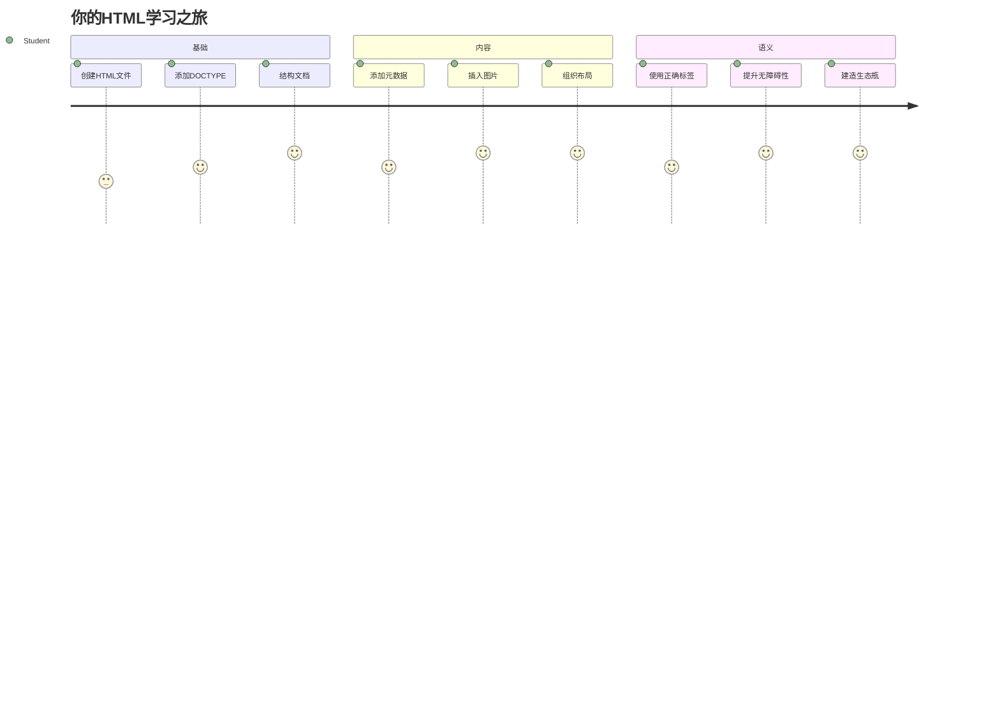
```mermaid
journey
    title 你的HTML学习之旅
    section 基础
      创建HTML文件: 3: Student
      添加DOCTYPE: 4: Student
      结构文档: 5: Student
    section 内容
      添加元数据: 4: Student
      插入图片: 5: Student
      组织布局: 5: Student
    section 语义
      使用正确标签: 4: Student
      提升无障碍性: 5: Student
      建造生态瓶: 5: Student
```
图示：HTML 入门
> 速记图由 [Tomomi Imura](https://twitter.com/girlie_mac) 提供

HTML，即超文本标记语言，是你访问过的每个网站的基础。把 HTML 想象成网页的骨架 —— 它定义了内容的位置、组织方式以及每个部分的含义。虽然 CSS 会在之后用颜色和布局“装饰”你的 HTML，JavaScript 会通过交互让它“活起来”，但 HTML 则提供了实现一切的基本结构。

在本课中，你将为一个虚拟的玻璃植物箱界面创建 HTML 结构。这个动手项目将教会你基本的 HTML 概念，同时构建一个视觉上有吸引力的东西。你将学习如何使用语义元素来组织内容、处理图片，并为一个交互式网页应用创建基础。

课程结束时，你将拥有一个可以显示植物图片并组织成列的工作HTML页面，为下一课的样式设计做好准备。如果一开始看起来很基础，不用担心 —— 这正是 HTML 在 CSS 添加视觉装饰之前应有的样子。

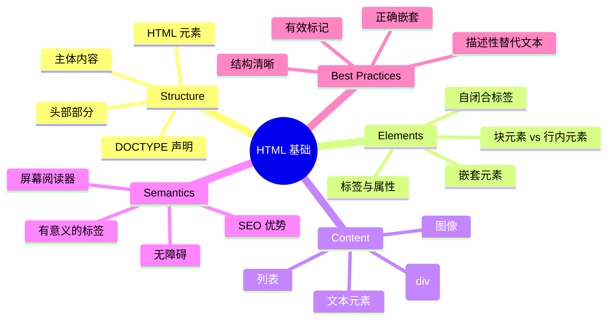
```mermaid
mindmap
  root((HTML 基础))
    Structure
      DOCTYPE 声明
      HTML 元素
      头部部分
      主体内容
    Elements
      标签与属性
      自闭合标签
      嵌套元素
      块元素 vs 行内元素
    Content
      文本元素
      图像
      容器 (div)
      列表
    Semantics
      有意义的标签
      无障碍
      屏幕阅读器
      SEO 优势
    Best Practices
      正确嵌套
      有效标记
      描述性替代文本
      结构清晰
```
## 课前测验

[课前测验](https://ff-quizzes.netlify.app/web/quiz/15)

> 📺 **观看学习**：查看这段有帮助的视频综述
>
>

## 设置你的项目

在开始编写 HTML 代码之前，让我们为你的玻璃植物箱项目搭建一个合适的工作空间。从一开始创建一个有序的文件结构是一个非常重要的习惯，它将在你整个网页开发旅程中为你带来帮助。

### 任务：创建你的项目结构

你将为玻璃植物箱项目创建专用文件夹，并添加你的第一个 HTML 文件。这里有两个方法可供选择：

**选项 1：使用 Visual Studio Code**
1. 打开 Visual Studio Code
2. 点击“文件”→“打开文件夹”或使用快捷键 `Ctrl+K, Ctrl+O`（Windows/Linux）或 `Cmd+K, Cmd+O`（Mac）
3. 创建一个名为 `terrarium` 的新文件夹并选中它
4. 在资源管理器面板点击“新建文件”图标
5. 将你的文件命名为 `index.html`

图示：VS Code 资源管理器显示新建文件

**选项 2：使用终端命令**
```bash
mkdir terrarium
cd terrarium
touch index.html
code index.html
```

**这些命令实现的操作有：**
- **创建** 一个名为 `terrarium` 的新目录
- **进入** 该 `terrarium` 目录
- **创建** 一个空的 `index.html` 文件
- **在 Visual Studio Code 中打开** 该文件进行编辑

> 💡 **专业提示**：`index.html` 文件名在网页开发中很特殊。当访问网站时，浏览器会自动寻找 `index.html` 作为默认显示页面。这意味着像 `https://mysite.com/projects/` 这样的 URL 会自动加载 `projects` 文件夹中的 `index.html`，无需在 URL 中指定文件名。

## 理解 HTML 文档结构

每个 HTML 文档都有特定的结构，浏览器需要通过它来理解并正确显示页面内容。把这种结构想象成一封正式的信 —— 它由按特定顺序排列的必需元素组成，帮助接收者（这里是浏览器）正确处理内容。

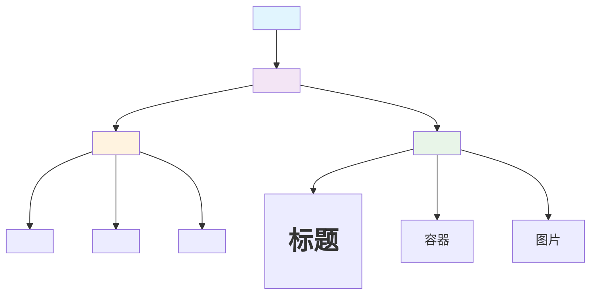
```mermaid
flowchart TD
    A["<!DOCTYPE html>"] --> B["<html>"]
    B --> C["<head>"]
    C --> D["<title>标题"]
    C --> E["<meta charset>"]
    C --> F["<meta viewport>"]
    B --> G["<body>"]
    G --> H["<h1> 标题"]
    G --> I["<div> 容器"]
    G --> J["<img> 图片"]

    style A fill:#e1f5fe
    style B fill:#f3e5f5
    style C fill:#fff3e0
    style G fill:#e8f5e8
```
让我们先添加每个 HTML 文档都需要的基础内容。

### DOCTYPE 声明和根元素

任何 HTML 文件的前两行作为对浏览器的“文档介绍”：

```html
<!DOCTYPE html>
<html></html>
```

**理解这段代码做了什么：**
- **声明** 文档类型为 HTML5，使用 `<!DOCTYPE html>`
- **创建** 含有所有页面内容的根 `<html>` 元素
- **确立** 现代网页标准，确保浏览器正确渲染
- **保证** 各种浏览器和设备上的一致显示效果

> 💡 **VS Code 提示**：在 VS Code 中将鼠标悬停于任意 HTML 标签上，可以看到来自 MDN Web Docs 的帮助信息，包括用法示例和浏览器兼容性详情。

> 📚 **了解更多**：DOCTYPE 声明确保浏览器不会进入“怪异模式”，怪异模式用于支持非常古老的网站。现代网页开发使用简单的 `<!DOCTYPE html>` 声明以保证[标准兼容渲染](https://developer.mozilla.org/docs/Web/HTML/Quirks_Mode_and_Standards_Mode)。

### 🔄 **教学检查点**
**暂停并反思**：在继续之前，确保你理解了：
- ✅ 为什么每个 HTML 文档都需要 DOCTYPE 声明
- ✅ `<html>` 根元素包含了什么
- ✅ 这种结构如何帮助浏览器正确渲染页面

**快速自测**：你能用自己的话解释“标准兼容渲染”是什么意思吗？

## 添加必要的文档元数据

HTML 文档的 `<head>` 部分包含了浏览器和搜索引擎需要的关键信息，但访客不会直接看到它。这部分可以看作是“幕后”信息，帮助你的网页正常工作且在不同设备和平台上正确显示。

这段元数据告诉浏览器如何显示页面，使用什么字符编码，以及如何处理不同屏幕尺寸 —— 这些都是构建专业且可访问网页的重要因素。

### 任务：添加文档头部

将以下 `<head>` 部分插入到 `<html>` 标签的开头和结尾之间：

```html
<head>
	<title>Welcome to my Virtual Terrarium</title>
	<meta charset="utf-8" />
	<meta http-equiv="X-UA-Compatible" content="IE=edge" />
	<meta name="viewport" content="width=device-width, initial-scale=1" />
</head>
```

**拆解每个元素的作用：**
- **设置** 在浏览器标签和搜索结果中显示的页面标题
- **指定** UTF-8 字符编码，确保文本能正确显示全球字符
- **保证** 兼容现代版本的 Internet Explorer
- **通过设置视口匹配设备宽度** 来实现响应式设计
- **控制** 页面初始缩放，保证内容按自然大小显示

> 🤔 **思考这个问题**：如果你设置了 `<meta name="viewport" content="width=600">` 会发生什么？页面会被强制固定为 600 像素宽，打破响应式设计！了解更多关于[正确视口配置](https://developer.mozilla.org/docs/Web/HTML/Viewport_meta_tag)。

## 构建文档主体

`<body>` 元素包含网页所有的可见内容 —— 用户将看到并与之交互的一切。虽然 `<head>` 向浏览器提供指令，`<body>` 才是真正持有内容：文字、图片、按钮及其他创建用户界面的元素。

让我们添加主体结构，理解 HTML 标签如何协作创建有意义内容。

### 理解 HTML 标签结构

HTML 使用成对标签定义元素。大多数标签有开标签如 `<p>` 和闭标签如 `</p>`，中间包含内容：`<p>Hello, world!</p>`，表示一个包含文本“Hello, world!”的段落元素。

### 任务：添加 `<body>` 元素

更新你的 HTML 文件，加入 `<body>` 元素：

```html
<!DOCTYPE html>
<html>
	<head>
		<title>Welcome to my Virtual Terrarium</title>
		<meta charset="utf-8" />
		<meta http-equiv="X-UA-Compatible" content="IE=edge" />
		<meta name="viewport" content="width=device-width, initial-scale=1" />
	</head>
	<body></body>
</html>
```

**该完整结构提供了：**
- **建立** 基本的 HTML5 文档框架
- **包含** 正确渲染所必须的元数据
- **创建** 一个空白主体，为你的可见内容准备位置
- **符合** 现代网页开发的最佳实践

现在你可以开始添加玻璃植物箱的可见元素了。我们将用 `<div>` 元素作为容器来组织不同内容区域，并用 `` 标签显示植物图片。

### 使用图片和布局容器

图片在 HTML 中比较特殊，因为它们使用“自闭合”标签。与像 `<p></p>` 这类包裹内容的元素不同，`` 标签在标签内部通过属性（如 `src` 指向图片文件路径，`alt` 用于无障碍访问）包含了所需全部信息。

添加图片前，你需要通过创建图片文件夹并添加植物图形来合理组织项目文件。

**首先，设置你的图片：**
1. 在玻璃植物箱项目文件夹中创建一个名为 `images` 的文件夹

3. 将所有植物图片复制到你的新 `images` 文件夹中

### 任务：创建植物展示布局

现在，在你的 `<body></body>` 标签之间，添加组织成两列的植物图片：

```html

```

**这段代码的步骤说明如下：**
- **创建** 一个主页面容器，`id="page"`，用于包含所有内容
- **建立** 两个列容器：`left-container` 和 `right-container`
- **将** 7 株植物放入左列，7 株放入右列
- **用** `plant-holder` div 包裹每株植物图片，方便单独定位
- **应用** 一致的类名，方便下一课中 CSS 样式设定
- **为** 每个植物图片分配唯一 ID，便于后续 JavaScript 操作
- **包含** 指向 images 文件夹的正确文件路径

> 🤔 **考虑这个问题**：注意所有图片的 alt 属性都写成了“plant”，这不利于无障碍访问。屏幕阅读器会连续读取14次“plant”，用户无法区分每张图片具体是哪株植物。你能想到更合适、描述更准确的 alt 文本吗？

> 📝 **HTML 元素类型**：`<div>` 是“块级元素”，占满整行宽度；`<span>` 是“内联元素”，只占内容所需宽度。如果把这些 `<div>` 标签全部换成 `<span>` 会怎样？

### 🔄 **教学检查点**
**结构理解**：花点时间回顾你的 HTML 结构：
- ✅ 你能识别布局中的主要容器吗？
- ✅ 你理解为什么每张图片都需要唯一 ID？
- ✅ 你会怎么描述 `plant-holder` div 的作用？

**视觉检查**：在浏览器中打开你的 HTML 文件。你应该能看到：
- 一个基础的植物图片列表
- 图片分成两列排列
- 简单且未加样式的布局

**记住**：这种朴素的外观正是 CSS 添加样式前 HTML 应有的样子！

有了这些标记，植物将出现在屏幕上，虽然还没有美观的样式 —— 那正是下一课 CSS 的作用！现在你有了坚实的 HTML 基础，内容被正确组织且符合无障碍最佳实践。

## 使用语义 HTML 提升无障碍性

语义 HTML 指的是根据内容的意义和用途选择 HTML 元素，而不是仅仅根据外观使用。当你使用语义标记时，就在向浏览器、搜索引擎和辅助技术（如屏幕阅读器）传达内容的结构和意义。

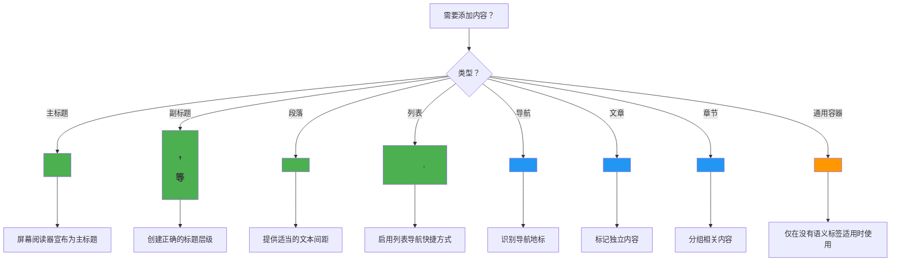
```mermaid
flowchart TD
    A[需要添加内容？] --> B{类型？}
    B -->|主标题| C["<h1>"]
    B -->|副标题| D["<h2>, <h3> 等"]
    B -->|段落| E["<p>"]
    B -->|列表| F["<ul>, <ol>"]
    B -->|导航| G["<nav>"]
    B -->|文章| H["<article>"]
    B -->|章节| I["<section>"]
    B -->|通用容器| J["<div>"]

    C --> K[屏幕阅读器宣布为主标题]
    D --> L[创建正确的标题层级]
    E --> M[提供适当的文本间距]
    F --> N[启用列表导航快捷方式]
    G --> O[识别导航地标]
    H --> P[标记独立内容]
    I --> Q[分组相关内容]
    J --> R[仅在没有语义标签适用时使用]

    style C fill:#4caf50
    style D fill:#4caf50
    style E fill:#4caf50
    style F fill:#4caf50
    style G fill:#2196f3
    style H fill:#2196f3
    style I fill:#2196f3
    style J fill:#ff9800
```
这种方法让你的网站对残障用户更友好，也帮助搜索引擎更好地理解内容。这是现代网页开发的基本原则，能为所有用户创造更好的体验。

### 添加语义页面标题

让我们给玻璃植物箱页面添加一个合适的标题。将这行代码插入到你的 `<body>` 标签之后：

```html
<h1>My Terrarium</h1>
```

**语义标记重要性的原因：**
- **帮助** 屏幕阅读器导航并理解页面结构
- **改善** 搜索引擎优化（SEO），明确内容层级
- **增强** 视觉障碍或认知障碍用户的无障碍性
- **创造** 跨所有设备和平台更佳的用户体验
- **符合** 网页标准和专业开发的最佳实践

**语义与非语义选择示例：**

| 目的 | ✅ 语义选择 | ❌ 非语义选择 |
|---------|-------------------|------------------------|
| 主要标题 | `<h1>Title</h1>` | `<div class="big-text">Title</div>` |
| 导航 | `<nav><ul><li></li></ul></nav>` | `<div class="menu"><div></div></div>` |
| 按钮 | `<button>Click me</button>` | `<span onclick="...">Click me</span>` |
| 文章内容 | `<article><p></p></article>` | `<div class="content"><div></div></div>` |

> 🎥 **示范视频**：观看[屏幕阅读器如何与网页交互](https://www.youtube.com/watch?v=OUDV1gqs9GA)，理解语义标记为何对无障碍性至关重要。注意规范的 HTML 结构如何让用户高效导航。

## 创建玻璃植物箱容器

现在，让我们添加玻璃植物箱自身的 HTML 结构 —— 这是存放植物的玻璃容器。该部分展示了一个重要概念：HTML 提供结构，但没有 CSS 样式，这些元素暂时不可见。

玻璃植物箱标记使用了描述性很强的类名，方便下一课 CSS 直观且易维护的设计。

### 任务：添加玻璃植物箱结构

将以下标记插入到最后一个 `</div>` 标签之前（即页面容器关闭标签之前）：

```html

	<div class="jar-top"></div>

		<div class="jar-glossy-long"></div>
		<div class="jar-glossy-short"></div>

	<div class="dirt"></div>
	<div class="jar-bottom"></div>

```

**理解这个玻璃植物箱结构：**
- **创建** 一个主要的玻璃植物箱容器，并赋予唯一 ID 以便样式设计
- **定义** 每个视觉组件（顶部、墙壁、泥土、底部）的独立元素
- **包含** 用于玻璃反射效果的嵌套元素（光泽元素）
- **使用** 描述性类名，明确指示每个元素的用途
- **准备** CSS 样式结构，以创建玻璃生态瓶的外观

> 🤔 **注意到了吗？**：即使你添加了这些标记，你在页面上也看不到任何新内容！这完美说明了 HTML 提供结构，而 CSS 提供外观。这些 `<div>` 元素存在，但尚未有视觉样式——这将在下一课中完成！

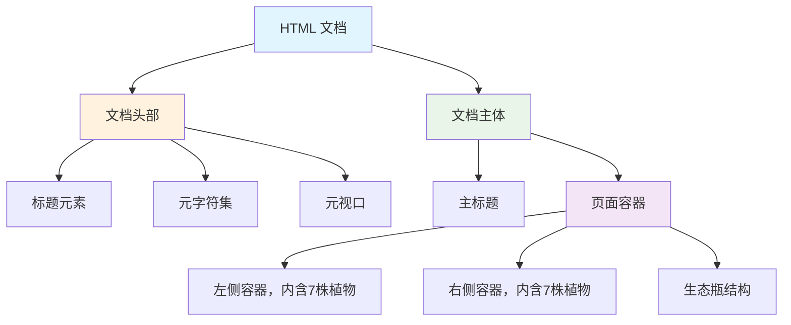
```mermaid
flowchart TD
    A[HTML 文档] --> B[文档头部]
    A --> C[文档主体]
    B --> D[标题元素]
    B --> E[元字符集]
    B --> F[元视口]
    C --> G[主标题]
    C --> H[页面容器]
    H --> I[左侧容器，内含7株植物]
    H --> J[右侧容器，内含7株植物]
    H --> K[生态瓶结构]

    style A fill:#e1f5fe
    style B fill:#fff3e0
    style C fill:#e8f5e8
    style H fill:#f3e5f5
```
### 🔄 **教学自查**
**HTML 结构掌握**：在继续之前，请确保你能够：
- ✅ 解释 HTML 结构和视觉外观的区别
- ✅ 识别语义和非语义的 HTML 元素
- ✅ 描述正确的标记如何有利于无障碍访问
- ✅ 认识完整的文档树结构

**测试你的理解**：尝试在禁用 JavaScript 和移除 CSS 的浏览器中打开你的 HTML 文件。这样你就能看到你创建的纯粹语义结构！

## GitHub Copilot Agent 挑战

使用 Agent 模式完成以下挑战：

**描述：** 创建一个语义化的 HTML 结构，用于添加到生态瓶项目中的植物护理指南部分。

**提示：** 创建一个语义化的 HTML 段落，包含主标题“Plant Care Guide”（植物护理指南），三个子部分，标题分别为“Watering”（浇水）、“Light Requirements”（光照需求）和“Soil Care”（土壤护理），每部分包含一段植物护理信息。使用合适的语义 HTML 标签，如 `<section>`、`<h2>`、`<h3>` 和 `<p>`，来适当组织内容。

了解更多关于 [agent 模式](https://code.visualstudio.com/blogs/2025/02/24/introducing-copilot-agent-mode) 。

## 探索 HTML 历史挑战

**了解网页演变**

自 1990 年 Tim Berners-Lee 在 CERN 创建第一个网页浏览器以来，HTML 已经发生了巨大变革。一些老旧标签如 `<marquee>` 现在被废弃，因为它们与现代无障碍标准和响应式设计原则不兼容。

**尝试这个实验：**
1. 临时用 `<marquee>` 标签包裹你的 `<h1>` 标题：`<marquee><h1>My Terrarium</h1></marquee>`
2. 在浏览器中打开页面，观察滚动效果
3. 思考为什么该标签被废弃（提示：考虑用户体验和无障碍）
4. 移除 `<marquee>` 标签，恢复语义化标记

**反思问题：**
- 滚动标题如何影响视力障碍或动作敏感的用户？
- 哪些现代 CSS 技术可以更无障碍地实现类似视觉效果？
- 为什么使用当前的网页标准比使用废弃元素更重要？

探索更多关于 [过时和废弃的 HTML 元素](https://developer.mozilla.org/docs/Web/HTML/Element#Obsolete_and_deprecated_elements) ，了解网页标准如何发展以提升用户体验。

## 课后测验

[课后测验](https://ff-quizzes.netlify.app/web/quiz/16)

## 复习与自学

**加深你的 HTML 知识**

HTML 作为网页的基础已有 30 多年历史，从简单的文档标记语言演变为构建互动应用的复杂平台。理解这一演变有助于你更好地理解现代网页标准，并做出更好的开发决策。

**推荐学习路径：**

1. **HTML 历史与演变**
   - 研究从 HTML 1.0 到 HTML5 的时间线
   - 探讨某些标签被废弃的原因（无障碍、移动友好性、可维护性）
   - 调查新兴的 HTML 特性和提案

2. **语义 HTML 深入学习**
   - 学习完整的 [HTML5 语义元素列表](https://developer.mozilla.org/docs/Web/HTML/Element)
   - 练习识别 `<article>`、`<section>`、`<aside>` 和 `<main>` 的使用时机
   - 了解增强无障碍的 ARIA 属性

3. **现代网页开发**
   - 探索 Microsoft Learn 上的 [构建响应式网站](https://docs.microsoft.com/learn/modules/build-simple-website/?WT.mc_id=academic-77807-sagibbon)
   - 理解 HTML 如何与 CSS 和 JavaScript 集成
   - 学习网页性能和 SEO 最佳实践

**反思问题：**
- 你发现了哪些被废弃的 HTML 标签？它们为何被移除？
- 未来版本有哪些新的 HTML 特性正在提案中？
- 语义 HTML 如何助力网页无障碍和 SEO？

### ⚡ **未来 5 分钟内可做事项**
- [ ] 打开 DevTools（F12）并检查你喜欢网站的 HTML 结构
- [ ] 创建一个包含基本标签 `<h1>`、`<p>`、`` 的简单 HTML 文件
- [ ] 使用 W3C HTML Validator 进行 HTML 验证
- [ ] 尝试用 `` 添加 HTML 注释

### 🎯 **未来一小时可完成事项**
- [ ] 完成课后测验并复习语义 HTML 概念
- [ ] 使用恰当的 HTML 结构建立一个简单的个人网页
- [ ] 试验不同的标题级别和文本格式化标签
- [ ] 添加图片和链接练习多媒体集成
- [ ] 研究你未尝试过的 HTML5 特性

### 📅 **未来一周的 HTML 学习计划**
- [ ] 使用语义标记完成生态瓶项目作业
- [ ] 创建一个使用 ARIA 标签和角色的无障碍网页
- [ ] 练习创建带有多种输入类型的表单
- [ ] 探索 HTML5 API，比如 localStorage 或地理位置
- [ ] 学习响应式 HTML 模式和移动优先设计
- [ ] 审查其他开发者的 HTML 代码，学习最佳实践

### 🌟 **未来一个月的网页基础计划**
- [ ] 构建展示你 HTML 精通程度的个人作品网站
- [ ] 学习使用 Handlebars 等框架进行 HTML 模板编写
- [ ] 通过改进 HTML 文档贡献开源项目
- [ ] 掌握高级 HTML 概念，如自定义元素
- [ ] 将 HTML 与 CSS 框架和 JavaScript 库整合
- [ ] 指导其他 HTML 初学者

## 🎯 你的 HTML 掌握时间表

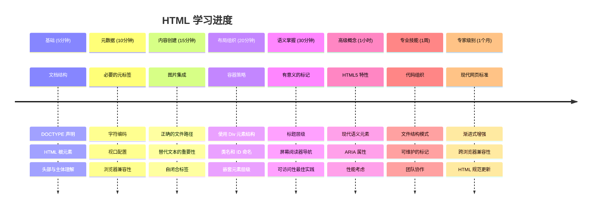
```mermaid
timeline
    title HTML 学习进度

    section 基础 (5分钟)
        文档结构: DOCTYPE 声明
                 : HTML 根元素
                 : 头部与主体理解

    section 元数据 (10分钟)
        必要的元标签: 字符编码
                     : 视口配置
                     : 浏览器兼容性

    section 内容创建 (15分钟)
        图片集成: 正确的文件路径
                 : 替代文本的重要性
                 : 自闭合标签

    section 布局组织 (20分钟)
        容器策略: 使用 Div 元素结构
                  : 类名和 ID 命名
                  : 嵌套元素层级

    section 语义掌握 (30分钟)
        有意义的标记: 标题层级
                     : 屏幕阅读器导航
                     : 可访问性最佳实践

    section 高级概念 (1小时)
        HTML5 特性: 现代语义元素
                  : ARIA 属性
                  : 性能考虑

    section 专业技能 (1周)
        代码组织: 文件结构模式
                 : 可维护的标记
                 : 团队协作

    section 专家级别 (1个月)
        现代网页标准: 渐进式增强
                      : 跨浏览器兼容性
                      : HTML 规范更新
```
### 🛠️ 你的 HTML 工具包总结

完成本课后，你已具备：
- **文档结构**：完整的 HTML5 基础，包含正确的 DOCTYPE
- **语义标记**：富有意义、有助于无障碍和 SEO 的标签
- **图像集成**：合理的文件组织和 alt 文本规范
- **布局容器**：用描述性类名战略性地使用 div
- **无障碍意识**：理解屏幕阅读器的导航方式
- **现代标准**：掌握当前 HTML5 实践及废弃标签知识
- **项目基础**：为 CSS 样式和 JavaScript 交互搭建坚实基础

**下一步**：你的 HTML 结构已准备好进行 CSS 样式设计！你所构建的语义基础将使下一课更加易懂。

## 作业

[练习你的 HTML：构建博客模拟页面](assignment.md)

**免责声明**：
本文件使用 AI 翻译服务 [Co-op Translator](https://github.com/Azure/co-op-translator) 进行翻译。虽然我们力求准确，但请注意自动翻译可能包含错误或不准确之处。原始文件的母语版本应被视为权威来源。对于关键信息，建议使用专业人工翻译。因使用本翻译而产生的任何误解或误读，我们不承担任何责任。

# HTML 练习作业：构建博客原型

## 学习目标

通过设计和编码一个完整的博客主页结构，应用您的 HTML 知识。这个实践作业将强化语义 HTML 概念、无障碍最佳实践以及专业代码组织技能，这些技能将在您的整个网页开发旅程中使用。

**完成此作业后，您将能够：**
- 练习在编码前规划网站布局
- 适当地应用语义 HTML 元素
- 创建可访问的、结构良好的标记
- 培养带有注释和组织的专业编码习惯

## 项目要求

### 第 1 部分：设计规划（视觉原型）

**创建您的博客主页的视觉原型，包括：**
- 带有网站标题和导航的页眉
- 具有至少 2-3 篇博客文章预览的主内容区
- 包含附加信息的侧边栏（关于部分、最近帖子、分类）
- 带有联系信息或链接的页脚

**原型创建选项：**
- **手绘草图**：使用纸和铅笔，然后拍照或扫描您的设计
- **数字工具**：Figma、Adobe XD、Canva、PowerPoint 或任何绘图应用
- **线框工具**：Balsamiq、MockFlow 或类似的线框软件

**在您的原型部分标注您计划使用的 HTML 元素**（例如，“页眉 - `<header>`”、“博客文章 - `<article>`”）。

### 第 2 部分：HTML 元素规划

**创建一个列表，将您的原型的每个部分映射到特定的 HTML 元素：**

```
Example:
- Site Header → <header>
- Main Navigation → <nav> with <ul> and <li>
- Blog Post → <article> with <h2>, <p>, <time>
- Sidebar → <aside> with <section> elements
- Page Footer → <footer>
```

**必须包含的元素：**
您的 HTML 必须至少包含以下列表中 10 种不同的语义元素：
- `<header>`, `<nav>`, `<main>`, `<article>`, `<section>`, `<aside>`, `<footer>`
- `<h1>`, `<h2>`, `<h3>`, `<p>`, `<ul>`, `<li>`, `<a>`
- ``, `<time>`, `<blockquote>`, `<strong>`, `<em>`

### 第 3 部分：HTML 实现

**编码您的博客主页，遵循以下标准：**

1. **文档结构**：包含正确的 DOCTYPE、html、head 和 body 元素
2. **语义标记**：根据用途使用 HTML 元素
3. **无障碍**：为图片加入恰当的 alt 文本和有意义的链接文本
4. **代码质量**：使用一致的缩进和有意义的注释
5. **内容**：包含真实的博客内容（您可以使用占位文本）

**示例 HTML 结构：**
```html
<!DOCTYPE html>
<html lang="en">
<head>
    <meta charset="UTF-8">
    <meta name="viewport" content="width=device-width, initial-scale=1.0">
    <title>My Personal Blog</title>
</head>
<body>

    <header>
        <h1>My Blog Title</h1>
        <nav>

        </nav>
    </header>

    <main>

    </main>

    <aside>

    </aside>

    <footer>

    </footer>
</body>
</html>
```

### 第 4 部分：反思

**写一个简短的反思（3-5 句），内容包括：**
- 哪些 HTML 元素是您最有信心使用的？
- 规划或编码过程中遇到了哪些挑战？
- 语义 HTML 如何帮助您组织内容？
- 下一次 HTML 项目中您会有什么不同的做法？

## 提交清单

**提交前，请确保您已完成：**
- [ ] 带有标注 HTML 元素的视觉原型
- [ ] 完整的 HTML 文件，具有正确的文档结构
- [ ] 至少使用了 10 种不同且恰当的语义 HTML 元素
- [ ] 有意义的注释，解释您的代码结构
- [ ] 有效的 HTML 语法（在浏览器中测试）
- [ ] 针对提示问题的书面反思

## 评估标准

| 评估标准 | 优秀 (4) | 良好 (3) | 发展中 (2) | 初学者 (1) |
|----------|----------|----------|------------|------------|
| **规划与设计** | 详尽且标注清晰的原型，展示了对布局和 HTML 语义结构的深刻理解 | 清晰的原型，大部分部分都有恰当标注 | 基本原型，有一些标注，表现出一般理解 | 原型内容少或不清晰，缺乏正确的部分识别 |
| **语义 HTML 使用** | 适当使用 10 种以上语义元素，表现出对 HTML 结构和无障碍的深刻理解 | 正确使用 8-9 种语义元素，显示良好的语义标记理解 | 使用 6-7 种语义元素，对适当使用有一些混淆 | 使用少于 6 种元素或误用语义元素 |
| **代码质量与组织** | 代码组织异常良好，缩进正确，有全面的注释，且 HTML 语法完美 | 代码组织良好，有良好缩进和有用注释，语法有效 | 代码大致有序，有少量注释，存在轻微语法问题 | 组织差，极少注释，存在多处语法错误 |
| **无障碍与最佳实践** | 极佳的无障碍考虑，有意义的 alt 文本，恰当的标题层级，遵循所有现代 HTML 最佳实践 | 良好的无障碍特性，恰当使用标题和 alt 文本，遵循大多数最佳实践 | 有一些无障碍考虑，基本的 alt 文本和标题结构 | 无障碍特性有限，标题结构差，不遵循最佳实践 |
| **反思与学习** | 有深刻见解的反思，展现了对 HTML 概念和学习过程的深刻理解和分析 | 良好的反思，显示了对关键概念的理解和一定的自我认知 | 基本反思，对 HTML 概念或学习过程的见解有限 | 反思很少或缺失，几乎没有对学习内容的理解 |

## 学习资源

**必备参考资料：**
- [MDN HTML 元素参考](https://developer.mozilla.org/docs/Web/HTML/Element) - 全面 HTML 元素指南
- [HTML5 语义元素](https://developer.mozilla.org/docs/Web/HTML/Element#content_sectioning) - 理解语义标记
- [网页无障碍指导原则](https://www.w3.org/WAI/WCAG21/quickref/) - 创建无障碍网页内容
- [HTML 校验器](https://validator.w3.org/) - 检查您的 HTML 语法

**成功技巧：**
- 在编写任何代码之前先开始制作原型
- 使用浏览器的开发者工具检查您的 HTML 结构
- 测试您的页面在不同屏幕尺寸下的显示（即使没有 CSS）
- 大声朗读您的 HTML 以检查结构是否逻辑通顺
- 考虑屏幕阅读器如何解释您的页面结构

> 💡 **记住**：本作业关注 HTML 结构和语义。不要担心视觉样式 —— 那是 CSS 的工作！您的页面可能看起来很普通，但应结构良好且有意义。

**免责声明**：
本文件使用AI翻译服务[Co-op Translator](https://github.com/Azure/co-op-translator)进行翻译。虽然我们力求准确，但请注意，自动翻译可能存在错误或不准确之处。原始文本应被视为权威来源。对于重要信息，建议采用专业人工翻译。我们不对因使用本翻译内容而引起的任何误解或错误解释承担责任。

# Terrarium Project 第二部分：CSS 介绍

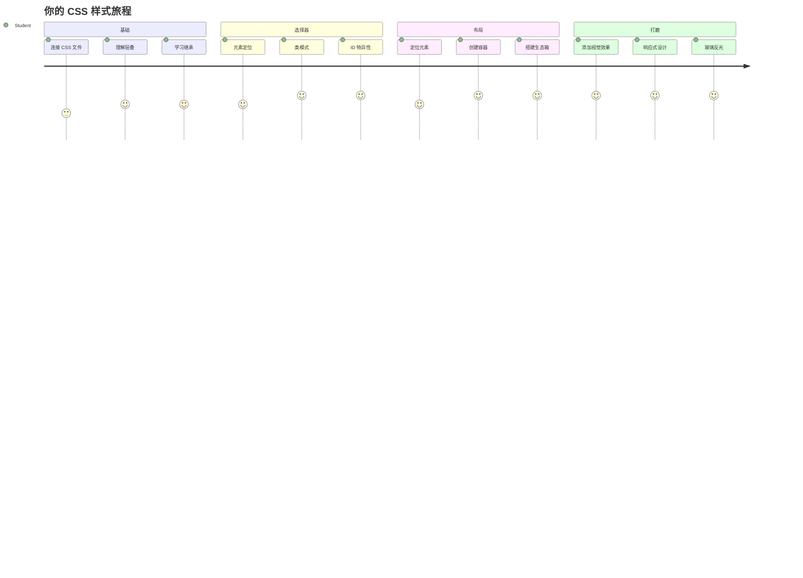
```mermaid
journey
    title 你的 CSS 样式旅程
    section 基础
      连接 CSS 文件: 3: Student
      理解层叠: 4: Student
      学习继承: 4: Student
    section 选择器
      元素定位: 4: Student
      类模式: 5: Student
      ID 特异性: 5: Student
    section 布局
      定位元素: 4: Student
      创建容器: 5: Student
      搭建生态箱: 5: Student
    section 打磨
      添加视觉效果: 5: Student
      响应式设计: 5: Student
      玻璃反光: 5: Student
```
图示：Introduction to CSS
> 速写笔记作者 [Tomomi Imura](https://twitter.com/girlie_mac)

还记得你的 HTML 生态瓶看起来很基础吗？CSS 就是把那个普通的结构变成视觉上更吸引人的东西。

如果说 HTML 就像搭建房子的框架，那么 CSS 就是让它感觉像家的所有东西——油漆颜色、家具布置、灯光，以及房间之间的流动。想想凡尔赛宫最初只是一个简单的狩猎小屋，但经过精心的装饰和布局，就变成了世界上最宏伟的建筑之一。

今天，我们将把你的生态瓶从功能性变成精致。你将学习如何精准定位元素，使布局响应不同屏幕尺寸，并创造让网站引人注目的视觉效果。

本课结束时，你将看到战略性的 CSS 样式如何极大提升你的项目。让我们为你的生态瓶增添一些风格吧。

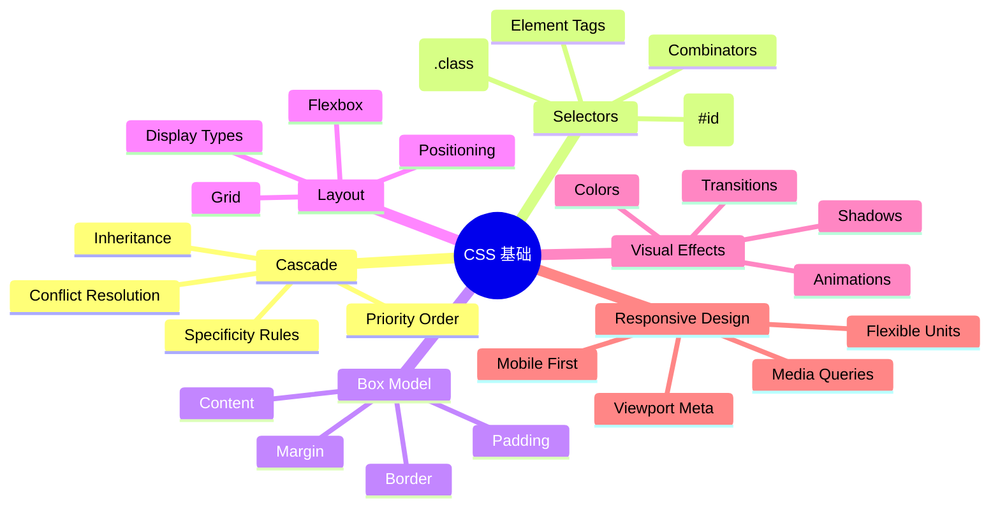
```mermaid
mindmap
  root((CSS 基础))
    Cascade
      Specificity Rules
      Inheritance
      Priority Order
      Conflict Resolution
    Selectors
      Element Tags
      Classes (.class)
      IDs (#id)
      Combinators
    Box Model
      Margin
      Border
      Padding
      Content
    Layout
      Positioning
      Display Types
      Flexbox
      Grid
    Visual Effects
      Colors
      Shadows
      Transitions
      Animations
    Responsive Design
      Media Queries
      Flexible Units
      Viewport Meta
      Mobile First
```
## 课前测验

[课前测验](https://ff-quizzes.netlify.app/web/quiz/17)

## CSS 入门

CSS 常被认为只是“美化”，但它的作用远不止如此。CSS 就像电影导演——你不仅控制一切的外观，还控制其运动、响应交互以及适应不同情况。

现代 CSS 非常强大。你可以编写代码，自动调整手机、平板和桌面电脑的布局。你可以创建平滑动画，引导用户注意力。所有功能协同工作时效果非常惊人。

> 💡 **小贴士**：CSS 持续演进，增加新特性和功能。使用新 CSS 特性前，请务必访问 [CanIUse.com](https://caniuse.com) 检查浏览器支持情况。

**本课目标：**
- **创建** 用现代 CSS 技术完整设计你的生态瓶视觉效果
- **探索** 级联、继承和 CSS 选择器等基础概念
- **实现** 响应式定位和布局策略
- **构建** 生态瓶容器，使用 CSS 形状和样式

### 先修条件

你应该完成了上一课的生态瓶 HTML 结构，准备好进行样式设计。

> 📺 **视频资源**：观看此视频讲解
>
>

### 设置你的 CSS 文件

开始样式设计前，我们需要将 CSS 连接到 HTML。这让浏览器知道哪里能找到生态瓶的样式指令。

在你的生态瓶文件夹中，创建一个名为 `style.css` 的新文件，然后在 HTML 文档的 `<head>` 部分链接它：

```html
<link rel="stylesheet" href="./style.css" />
```

**此代码作用：**
- **建立** HTML 和 CSS 文件之间的连接
- **告诉**浏览器加载并应用 `style.css` 中的样式
- **使用** `rel="stylesheet"` 属性声明这是 CSS 文件
- **以** `href="./style.css"` 路径引用文件

## 理解 CSS 级联

你有没有想过为什么 CSS 叫“层叠样式表”？样式像瀑布一样层叠，有时相互冲突。

想象军队指挥结构——将军命令“所有士兵穿绿衣”，但某个单位的具体命令是“典礼穿礼服蓝”，这时具体命令优先。CSS 也遵循类似逻辑，理解此层级关系才能更好地调试。

### 级联优先级实验

让我们通过样式冲突来观察级联。先给你的 `<h1>` 标签添加行内样式：

```html
<h1 style="color: red">My Terrarium</h1>
```

**代码做了什么：**
- **直接** 用行内样式将 `<h1>` 设置为红色
- **使用** `style` 属性直接在 HTML 中嵌入 CSS
- **创建** 该元素的最高优先级样式规则

接着，在你的 `style.css` 文件中添加以下规则：

```css
h1 {
  color: blue;
}
```

**上述说明：**
- **定义** 了所有 `<h1>` 元素的 CSS 规则
- **用** 外部样式表将文本颜色设置为蓝色
- **优先级** 低于行内样式

✅ **知识检测**：网页中显示的是哪个颜色？为什么这个颜色胜出？你能想到什么时候需要覆盖样式吗？

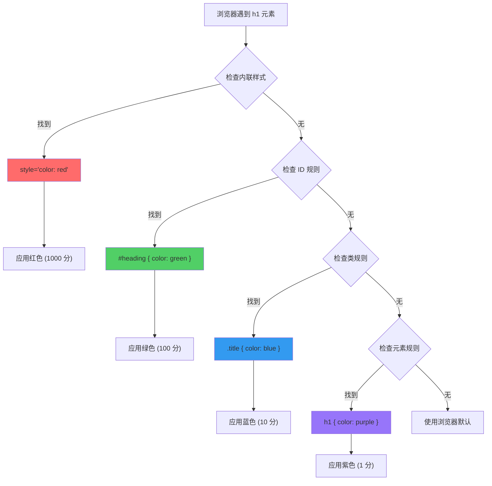
```mermaid
flowchart TD
    A["浏览器遇到 h1 元素"] --> B{"检查内联样式"}
    B -->|找到| C["style='color: red'"]
    B -->|无| D{"检查 ID 规则"}
    C --> E["应用红色 (1000 分)"]
    D -->|找到| F["#heading { color: green }"]
    D -->|无| G{"检查类规则"}
    F --> H["应用绿色 (100 分)"]
    G -->|找到| I[".title { color: blue }"]
    G -->|无| J{"检查元素规则"}
    I --> K["应用蓝色 (10 分)"]
    J -->|找到| L["h1 { color: purple }"]
    J -->|无| M["使用浏览器默认"]
    L --> N["应用紫色 (1 分)"]

    style C fill:#ff6b6b
    style F fill:#51cf66
    style I fill:#339af0
    style L fill:#9775fa
```
> 💡 **CSS 优先级顺序（从高到低）：**
> 1. **行内样式**（style 属性）
> 2. **ID 选择器**（#myId）
> 3. **类选择器**（.myClass）和属性选择器
> 4. **元素选择器**（h1，div，p）
> 5. **浏览器默认**

## CSS 继承原理

CSS 继承很像遗传学——元素继承父元素的某些属性。如果你给 body 元素设置字体，全页文本都会自动使用同样字体。这就像哈布斯堡王朝的家族下巴，在没有具体指定的情况下代代相传。

但不是所有属性都会继承。文本样式如字体和颜色会继承，布局属性如外边距和边框则不会。就像孩子可能继承父母的外貌特征，但不一定继承穿衣风格。

### 观察字体继承

试试给 `<body>` 元素设置字体：

```css
body {
  font-family: 'Segoe UI', Tahoma, Geneva, Verdana, sans-serif;
}
```

**解释这里发生的事情：**
- **设置** 全页面字体，针对 `<body>` 元素
- **使用** 字体栈托底，提升浏览器兼容性
- **应用** 现代系统字体，跨操作系统表现良好
- **确保** 所有子元素继承字体，除非被特别覆盖

打开浏览器开发者工具（F12），切换到 Elements 面板，检查 `<h1>` 元素，你会看到它继承自 body 的字体：

图示：inherited font

✅ **试验时间**：尝试给 `<body>` 设置其他可继承属性如 `color`，`line-height` 或 `text-align`。你的标题和其他元素会发生什么变化？

> 📝 **可继承属性包括**：`color`，`font-family`，`font-size`，`line-height`，`text-align`，`visibility`
>
> **不可继承属性包括**：`margin`，`padding`，`border`，`width`，`height`，`position`

### 🔄 **教学进度检查**
**CSS 基础理解情况**：在学习选择器前，请确保你能：
- ✅ 解释级联与继承的区别
- ✅ 预测样式冲突中哪个样式会生效
- ✅ 识别哪些属性会从父元素继承
- ✅ 正确连接 CSS 和 HTML 文件

**快速测试**：如果样式如下，`<div class="special">` 内的 `<h1>` 显示什么颜色？
```css
div { color: blue; }
.special { color: green; }
h1 { color: red; }
```
*答案：红色（元素选择器直接针对 h1）*

## 精通 CSS 选择器

CSS 选择器是你指定样式目标元素的方式。它们就像给出精确指示——不是说“那栋房子”，而是说“枫树街上蓝色门的房子”。

CSS 提供了多种定位方式，选择正确选择器就像选对工具。你有时要给整个街区的每扇门统一造型，有时只对某一扇特殊的门操作。

### 元素选择器（标签）

元素选择器通过标签名称定位 HTML 元素。很适合设置页面全局基础样式：

```css
body {
  font-family: 'Segoe UI', Tahoma, Geneva, Verdana, sans-serif;
  margin: 0;
  padding: 0;
}

h1 {
  color: #3a241d;
  text-align: center;
  font-size: 2.5rem;
  margin-bottom: 1rem;
}
```

**这些样式做了什么：**
- **用** `body` 选择器设置统一字体排版
- **清除** 浏览器默认的外边距和内边距，方便精准控制
- **给所有标题元素** 设定颜色、对齐和间距
- **使用** `rem` 单位，提升字体大小的可伸缩性与无障碍性

虽然元素选择器适合通用样式，但针对生态瓶里的具体植物组件，你需要更具体的选择器。

### ID 选择器用于唯一元素

ID 选择器用 `#` 符号，定位具有唯一 `id` 属性的元素。ID 在页面中唯一，非常适合样式化单个特定元素，比如生态瓶左、右侧的植物容器。

为你的生态瓶侧边容器创建样式：

```css
#left-container {
  background-color: #f5f5f5;
  width: 15%;
  left: 0;
  top: 0;
  position: absolute;
  height: 100vh;
  padding: 1rem;
  box-sizing: border-box;
}

#right-container {
  background-color: #f5f5f5;
  width: 15%;
  right: 0;
  top: 0;
  position: absolute;
  height: 100vh;
  padding: 1rem;
  box-sizing: border-box;
}
```

**本代码实现：**
- **用** `absolute` 定位将容器固定在屏幕左右边缘
- **用** `vh`（视口高度）单位实现响应式高度，适应屏幕尺寸
- **设置** `box-sizing: border-box`，确保内边距包括在宽度内
- **移除** 零值的 `px` 单位，使代码简洁
- **设置** 柔和背景色，比生硬灰色更舒适

✅ **代码质量挑战**：此 CSS 违反了 DRY（不重复自己）原则。你能用 ID 和类重构它吗？

**改进方案：**
```html
<div id="left-container" class="container"></div>
<div id="right-container" class="container"></div>
```

```css
.container {
  background-color: #f5f5f5;
  width: 15%;
  top: 0;
  position: absolute;
  height: 100vh;
  padding: 1rem;
  box-sizing: border-box;
}

#left-container {
  left: 0;
}

#right-container {
  right: 0;
}
```

### 类选择器用于可复用样式

类选择器用 `.` 符号，适合给多个元素应用相同样式。不同于 ID，类可以在 HTML 中多次使用，适合统一样式模式。

在生态瓶中，每株植物样式相似但定位不同。我们会用类做共享样式，用 ID 做单独定位。

**各植物的 HTML 结构如下：**
```html

```

**关键元素说明：**
- **`class="plant-holder"`** 用于各植物容器，统一样式
- **`class="plant"`** 用于植物图片，共享样式和行为
- **`id="plant1"`** 唯一 ID，用于定位和 JS 交互
- **提供** alt 文本，提升屏幕阅读器可访问性

现在将这些样式添加到 `style.css`：

```css
.plant-holder {
  position: relative;
  height: 13%;
  left: -0.6rem;
}

.plant {
  position: absolute;
  max-width: 150%;
  max-height: 150%;
  z-index: 2;
  transition: transform 0.3s ease;
}

.plant:hover {
  transform: scale(1.05);
}
```

**样式详解：**
- **为植物容器** 设定相对定位，创建定位依据
- **设置** 每个容器高度为 13%，确保植物整体垂直可见无滚动
- **稍微向左偏移**，更好地将植物居中在容器内
- **让植物图片** 能响应式缩放，设置最大宽高限制
- **用** `z-index` 让植物层级高于其他元素
- **添加** 细微的悬停动画，提升用户交互体验

✅ **深入思考**：为什么需要同时使用 `.plant-holder` 和 `.plant` 选择器？如果只用一个，会怎样？

> 💡 **设计模式**：容器 `.plant-holder` 负责布局和定位，内容 `.plant` 负责外观和缩放。分离职责让代码更易维护更灵活。

## 理解 CSS 定位

CSS 定位像舞台导演——你决定演员站哪里，怎么动。某些演员按标准站位，其它演员为了戏剧效果需要特殊定位。

理解定位后，很多布局问题迎刃而解。想要滚动页面时导航栏固定顶部？定位来帮忙。需要特定位置显示提示框？也是定位。

### 五种定位值

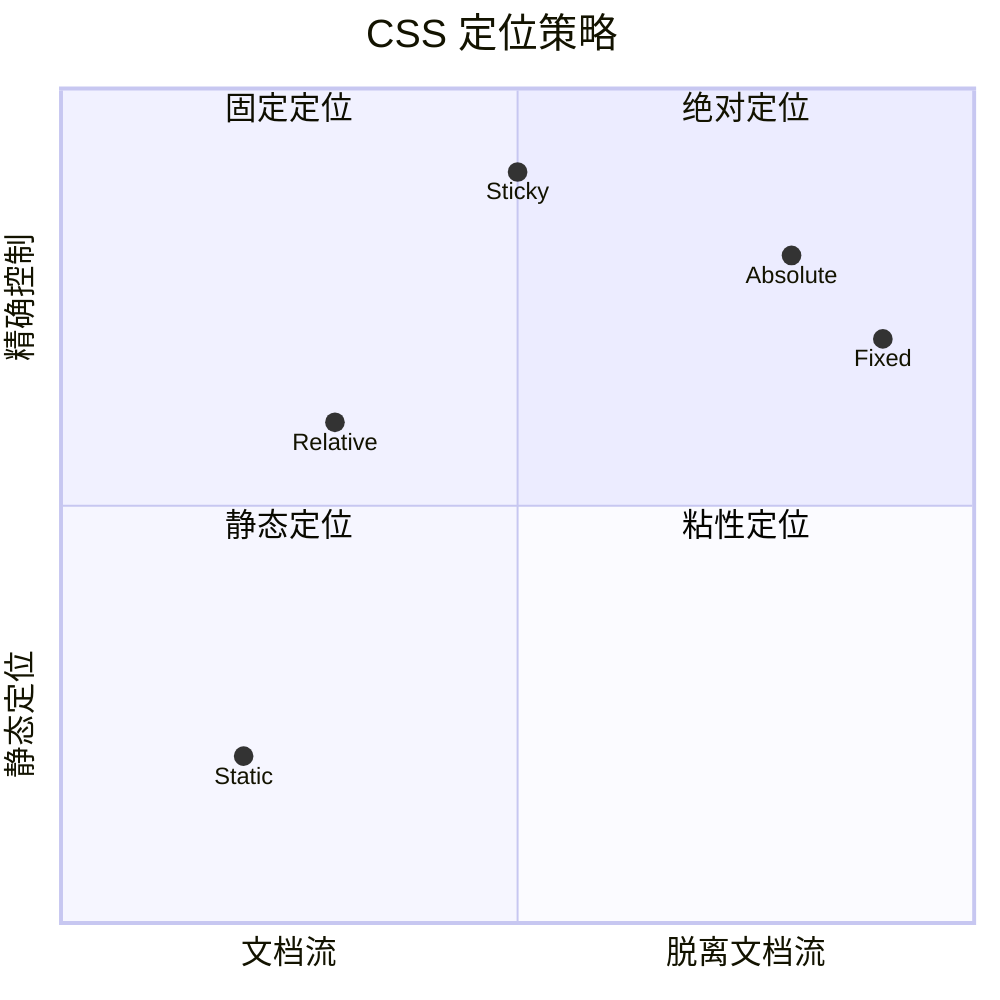
```mermaid
quadrantChart
    title CSS 定位策略
    x-axis 文档流 --> 脱离文档流
    y-axis 静态定位 --> 精确控制
    quadrant-1 绝对定位
    quadrant-2 固定定位
    quadrant-3 静态定位
    quadrant-4 粘性定位

    Static: [0.2, 0.2]
    Relative: [0.3, 0.6]
    Absolute: [0.8, 0.8]
    Fixed: [0.9, 0.7]
    Sticky: [0.5, 0.9]
```
| 定位值 | 行为 | 用途 |
|--------|------|------|
| `static` | 默认文档流，忽略 top/left/right/bottom | 正常布局 |
| `relative` | 相对于正常位置定位 | 微调位置，创建定位上下文 |
| `absolute` | 相对于最近的定位祖先 | 精确定位，覆盖层 |
| `fixed` | 相对于视口 | 固定导航栏，悬浮元素 |
| `sticky` | 滚动时在 `relative` 和 `fixed` 之间切换 | 滚动固定头部 |

### 生态瓶中的定位应用

我们用组合定位策略，创建所需布局：

```css
/* Container positioning */
.container {
  position: absolute; /* Removes from normal flow */
  /* ... other styles ... */
}

/* Plant holder positioning */
.plant-holder {
  position: relative; /* Creates positioning context */
  /* ... other styles ... */
}

/* Plant positioning */
.plant {
  position: absolute; /* Allows precise placement within holder */
  /* ... other styles ... */
}
```

**定位策略说明：**
- **绝对容器** 从正常文档流移除，被钉在屏幕边缘
- **相对植物容器** 保持文档流，同时创建定位上下文
- **绝对植物** 可在相对容器内精准定位
- **组合使用** 允许植物垂直堆叠，且能单独定位

> 🎯 **为什么重要**：`plant` 元素需要绝对定位，方便下一课实现拖拽。绝对定位将其从文档流中剥离，使拖放交互成为可能。

✅ **实验时间**：尝试更改定位值，观察效果：
- 将 `.container` 从 `absolute` 改为 `relative` 会怎样？
- 如果 `.plant-holder` 使用 `absolute` 而不是 `relative`，布局会如何变化？
- 当你将 `.plant` 切换为 `relative` 定位时会发生什么？

### 🔄 **教学检查点**
**CSS 定位掌握情况**：暂停，确认你的理解：
- ✅ 你能解释为什么植物需要绝对定位来实现拖放吗？
- ✅ 你理解相对容器如何创建定位上下文吗？
- ✅ 为什么侧边容器使用绝对定位？
- ✅ 如果完全移除定位声明，会发生什么？

**现实世界联系**：思考 CSS 定位如何反映现实布局：
- **静态**：书架上的书（自然顺序）
- **相对**：稍微移动一本书，但保持它的位置
- **绝对**：在特定页码放置书签
- **固定**：翻页时仍然可见的贴纸

## 使用 CSS 构建玻璃瓶

现在我们将仅用 CSS 构建一个玻璃罐——不需要图像或图形软件。

使用定位和透明度创建逼真的玻璃、阴影和深度效果，展示了 CSS 的视觉能力。这种技术类似包豪斯运动中的建筑师如何用简单的几何形状创造复杂且美丽的结构。一旦你理解了这些原理，就能认识出许多网页设计背后的 CSS 技巧。

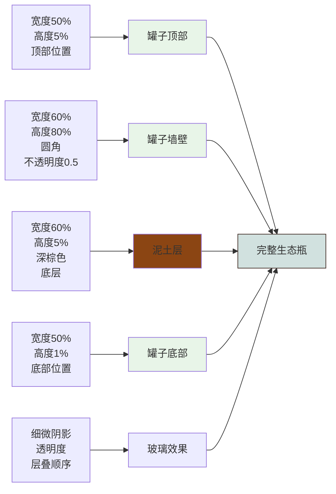
```mermaid
flowchart LR
    A[罐子顶部] --> E[完整生态瓶]
    B[罐子墙壁] --> E
    C[泥土层] --> E
    D[罐子底部] --> E
    F[玻璃效果] --> E

    A1["宽度50%<br/>高度5%<br/>顶部位置"] --> A
    B1["宽度60%<br/>高度80%<br/>圆角<br/>不透明度0.5"] --> B
    C1["宽度60%<br/>高度5%<br/>深棕色<br/>底层"] --> C
    D1["宽度50%<br/>高度1%<br/>底部位置"] --> D
    F1["细微阴影<br/>透明度<br/>层叠顺序"] --> F

    style E fill:#d1e1df,stroke:#3a241d
    style A fill:#e8f5e8
    style B fill:#e8f5e8
    style C fill:#8B4513
    style D fill:#e8f5e8
```
### 创建玻璃罐组件

让我们逐个构建生态瓶的罐体部分。每个部分都使用绝对定位和百分比尺寸以实现响应式设计：

```css
.jar-walls {
  height: 80%;
  width: 60%;
  background: #d1e1df;
  border-radius: 1rem;
  position: absolute;
  bottom: 0.5%;
  left: 20%;
  opacity: 0.5;
  z-index: 1;
  box-shadow: inset 0 0 2rem rgba(0, 0, 0, 0.1);
}

.jar-top {
  width: 50%;
  height: 5%;
  background: #d1e1df;
  position: absolute;
  bottom: 80.5%;
  left: 25%;
  opacity: 0.7;
  z-index: 1;
  border-radius: 0.5rem 0.5rem 0 0;
}

.jar-bottom {
  width: 50%;
  height: 1%;
  background: #d1e1df;
  position: absolute;
  bottom: 0;
  left: 25%;
  opacity: 0.7;
  border-radius: 0 0 0.5rem 0.5rem;
}

.dirt {
  width: 60%;
  height: 5%;
  background: #3a241d;
  position: absolute;
  border-radius: 0 0 1rem 1rem;
  bottom: 1%;
  left: 20%;
  opacity: 0.7;
  z-index: -1;
}
```

**理解生态瓶构建：**
- **使用** 基于百分比的尺寸，实现所有屏幕尺寸的响应式缩放
- **绝对定位** 元素，以精确地堆叠和对齐
- **应用** 不同的不透明度值，创造玻璃透明效果
- **实现** `z-index` 分层，使植物显示在瓶子内部
- **添加** 细微的盒阴影和圆角边框，增强真实感

### 百分比响应式设计

注意所有尺寸都是用百分比，而非固定像素值：

**为什么重要：**
- **确保** 生态瓶在任何屏幕尺寸下成比例缩放
- **维护** 瓶子各部件间的视觉关系
- **提供** 从手机到大型桌面显示器的一致体验
- **允许** 设计自适应且不破坏视觉布局

### CSS 单位示范

我们使用 `rem` 单位来设置圆角，它相对于根字体大小缩放。这样创建的设计更易访问，尊重用户的字体偏好。详见官方规范中的 [CSS 相对单位](https://www.w3.org/TR/css-values-3/#font-relative-lengths)。

✅ **视觉实验**：尝试修改这些数值，观察效果：
- 将罐子的透明度从 0.5 改为 0.8——这如何影响玻璃外观？
- 将土壤颜色从 `#3a241d` 改为 `#8B4513`——视觉效果怎样改变？
- 修改土壤的 `z-index` 为 2——分层效果发生了什么？

### 🔄 **教学检查点**
**CSS 视觉设计理解**：确认你对视觉 CSS 的掌握：
- ✅ 百分比尺寸如何实现响应式设计？
- ✅ 为什么透明度能创建玻璃透明效果？
- ✅ `z-index` 在分层中起什么作用？
- ✅ 圆角值如何塑造罐子形状？

**设计原则**：注意我们如何用简单形状构建复杂视觉：
1. **矩形** → **圆角矩形** → **罐子组件**
2. **纯色** → **透明度** → **玻璃效果**
3. **单个元素** → **分层组合** → **三维效果**

## GitHub Copilot Agent 挑战 🚀

使用 Agent 模式完成以下挑战：

**描述：** 创建一个 CSS 动画，使生态瓶中的植物轻柔地摇摆，模拟自然微风效果。帮助你练习 CSS 动画、变换和关键帧，同时增强生态瓶的视觉吸引力。

**提示：** 添加 CSS 关键帧动画，使生态瓶内的植物缓慢地左右摇摆。创建一个摇摆动画，让每棵植物左右旋转约 2-3 度，持续时间为 3-4 秒，应用于 `.plant` 类。确保动画无限循环，且采用缓动函数以获得自然流畅的动作。

了解更多关于 [agent 模式](https://code.visualstudio.com/blogs/2025/02/24/introducing-copilot-agent-mode) 。

## 🚀 挑战：添加玻璃反光效果

准备好用真实的玻璃反光效果增强你的生态瓶吗？这项技术将为设计添加深度和真实感。

你将创建细腻的高光，模拟光在玻璃表面的反射。这与文艺复兴画家扬·凡·艾克（Jan van Eyck）使用光线和反射使绘画玻璃呈现三维感的手法类似。你的目标如下：

图示：finished terrarium

**你的挑战：**
- **创建** 微妙的白色或浅色椭圆形反光
- **将其定位** 在罐子的左侧恰当位置
- **应用** 适当的不透明度和模糊效果，实现真实光反射
- **用** `border-radius` 制造有机、气泡状形状
- **尝试** 渐变或盒阴影增强真实感

## 课后测验

[课后测验](https://ff-quizzes.netlify.app/web/quiz/18)

## 拓展你的 CSS 知识

CSS 起初可能显得复杂，但掌握这些核心概念将为深入学习打下坚实基础。

**你的下一步 CSS 学习领域：**
- **Flexbox** - 简化元素对齐和分布
- **CSS 网格布局** - 强大工具，创建复杂布局
- **CSS 变量** - 降低重复，提高可维护性
- **响应式设计** - 确保网站在不同屏幕尺寸上表现良好

### 互动学习资源

通过这些有趣的实战游戏来练习概念：
- 🐸 [Flexbox Froggy](https://flexboxfroggy.com/) - 通过有趣挑战掌握 Flexbox
- 🌱 [Grid Garden](https://codepip.com/games/grid-garden/) - 通过种植虚拟胡萝卜学习 CSS 网格
- 🎯 [CSS Battle](https://cssbattle.dev/) - 用编码挑战测试你的 CSS 技能

### 额外学习资源

想系统学习 CSS 基础，完成微软学习模块：[用 CSS 样式化你的 HTML 应用](https://docs.microsoft.com/learn/modules/build-simple-website/4-css-basics/?WT.mc_id=academic-77807-sagibbon)

### ⚡ **接下来 5 分钟你可以做什么**
- [ ] 打开开发者工具，使用元素面板检查任何网站的 CSS 样式
- [ ] 创建一个简单的 CSS 文件，并链接到 HTML 页面
- [ ] 尝试用不同方式改变颜色：十六进制、RGB 和命名颜色
- [ ] 通过添加内边距和外边距练习盒模型

### 🎯 **接下来一小时你能完成什么**
- [ ] 完成课后测验，复习 CSS 基础
- [ ] 给你的 HTML 页面添加字体、颜色和间距样式
- [ ] 使用 flexbox 或 grid 创建简单布局
- [ ] 试验 CSS 过渡实现平滑效果
- [ ] 用媒体查询练习响应式设计

### 📅 **你的 CSS 一周学习计划**
- [ ] 富有创意地完成生态瓶样式作业
- [ ] 通过建立照片图库布局掌握 CSS 网格
- [ ] 学习 CSS 动画，让设计更生动
- [ ] 探索 Sass 或 Less 等 CSS 预处理器
- [ ] 学习设计原则并应用到 CSS 中
- [ ] 分析并复刻你在网上发现的有趣设计

### 🌟 **你的 CSS 一个月设计精通计划**
- [ ] 构建完整响应式网站设计系统
- [ ] 学习 CSS-in-JS 或类似 Tailwind 的实用优先框架
- [ ] 为开源项目贡献 CSS 优化
- [ ] 掌握高级 CSS 概念，如自定义属性和封装内容
- [ ] 创建可重用组件库，编写模块化 CSS
- [ ] 指导他人学习 CSS，分享设计知识

## 🎯 你的 CSS 掌握时间线


```mermaid
timeline
    title CSS 学习进度

    section 基础（10分钟）
        文件连接：将 CSS 连接到 HTML
                  ：理解层叠规则
                  ：学习继承基础

    section 选择器（15分钟）
        定位元素：元素选择器
                  ：类模式
                  ：ID 特异性
                  ：组合器

    section 盒模型（20分钟）
        布局基础：外边距和内边距
                  ：边框属性
                  ：内容尺寸
                  ：盒模型行为

    section 定位（25分钟）
        元素放置：静态与相对定位
                  ：绝对定位
                  ：层叠顺序（z-index）
                  ：响应式单位

    section 视觉设计（30分钟）
        样式掌握：颜色与不透明度
                  ：阴影与效果
                  ：过渡
                  ：变换属性

    section 响应式设计（45分钟）
        多设备支持：媒体查询
                   ：灵活布局
                   ：移动优先方法
                   ：视口优化

    section 高级技巧（1周）
        现代 CSS：弹性盒布局
                 ：CSS 网格系统
                 ：自定义属性
                 ：动画关键帧

    section 专业技能（1个月）
        CSS 架构：组件模式
                  ：可维护代码
                  ：性能优化
                  ：跨浏览器兼容性
```
### 🛠️ 你的 CSS 工具总结

完成本课后，你已经拥有：
- **层叠理解**：样式如何继承和覆盖
- **选择器掌握**：精准定位元素、类和 ID
- **定位技能**：战略性元素放置和分层
- **视觉设计**：创建玻璃效果、阴影和透明度
- **响应式技术**：基于百分比的布局适应任何屏幕
- **代码组织**：清晰且可维护的 CSS 结构
- **现代实践**：使用相对单位和无障碍设计模式

**下一步**：你的生态瓶现在有了结构（HTML）和样式（CSS）。最后一课将添加交互功能（JavaScript）！

## 作业

[CSS 重构](assignment.md)

**免责声明**：
本文件通过 AI 翻译服务 [Co-op Translator](https://github.com/Azure/co-op-translator) 进行翻译。虽然我们力求准确，但请注意自动翻译可能包含错误或不准确之处。原始语言的原始文档应被视为权威来源。对于重要信息，建议使用专业人工翻译。对于因使用本翻译而产生的任何误解或误释，我们不承担任何责任。

# CSS 重构作业

## 目标

将您的微型生态瓶项目转换为使用现代 CSS 布局技术！重构当前的绝对定位方法，改用 **Flexbox** 或 **CSS Grid** 实现更易维护、响应式的设计。此作业挑战您在保持生态瓶视觉美感的同时，应用现代 CSS 标准。

理解何时及如何使用不同的布局方法，是现代网页开发的关键技能。本练习架起传统定位技术与现代 CSS 布局系统之间的桥梁。

## 作业说明

### 阶段 1：分析与规划
1. **审查当前生态瓶代码** - 识别哪些元素当前使用绝对定位
2. **选择布局方法** - 决定 Flexbox 还是 CSS Grid 更适合您的设计目标
3. **绘制新布局结构图** - 规划容器及植物元素如何组织

### 阶段 2：实现
1. **创建生态瓶项目的新版本**，放在单独文件夹中
2. **根据需要更新 HTML 结构**，以支持所选布局方法
3. **重构 CSS**，使用 Flexbox 或 CSS Grid 替代绝对定位
4. **保持视觉一致性** - 确保植物与生态瓶罐保持相同位置
5. **实现响应式行为** - 使布局能优雅适应不同屏幕尺寸

### 阶段 3：测试与文档
1. **跨浏览器测试** - 验证设计在 Chrome、Firefox、Edge 和 Safari 中表现正常
2. **响应式测试** - 检查布局在移动设备、平板和桌面屏幕尺寸上的表现
3. **文档编写** - 在 CSS 中添加注释，说明布局设计选择
4. **截图** - 捕捉生态瓶在不同浏览器及屏幕尺寸下的效果

## 技术要求

### 布局实现
- **选择一项**：仅实现 Flexbox 或 CSS Grid（同一元素不可同时使用两者）
- **响应式设计**：使用相对单位（`rem`、`em`、`%`、`vw`、`vh`）替代固定像素
- **无障碍**：保持适当的语义 HTML 结构和替代文本
- **代码质量**：使用一致的命名规范，逻辑清晰地组织 CSS

### 需包含现代 CSS 特性
```css
/* Example Flexbox approach */
.terrarium-container {
  display: flex;
  flex-direction: column;
  min-height: 100vh;
  align-items: center;
  justify-content: center;
}

.plant-containers {
  display: flex;
  justify-content: space-between;
  width: 100%;
  max-width: 1200px;
}

/* Example Grid approach */
.terrarium-layout {
  display: grid;
  grid-template-columns: 1fr 3fr 1fr;
  grid-template-rows: auto 1fr;
  min-height: 100vh;
  gap: 1rem;
}
```

### 浏览器支持要求
- **Chrome/Edge**：最新 2 个版本
- **Firefox**：最新 2 个版本
- **Safari**：最新 2 个版本
- **移动浏览器**：iOS Safari、Chrome Mobile

## 交付物

1. **更新的 HTML 文件**，改进语义结构
2. **重构后的 CSS 文件**，采用现代布局技术
3. **截图集**，展示跨浏览器兼容性：
   - 桌面视图（1920x1080）
   - 平板视图（768x1024）
   - 手机视图（375x667）
   - 至少包含 2 种不同浏览器
4. **README.md 文件**，内容包括：
   - 您的布局选择（Flexbox 或 Grid）及理由
   - 重构过程中遇到的挑战
   - 浏览器兼容性说明
   - 运行代码说明

## 评估标准

| 评估项 | 优秀 (4) | 良好 (3) | 进行中 (2) | 初学 (1) |
|--------|-----------|-----------|-------------|-----------|
| **布局实现** | 熟练使用 Flexbox/Grid 及高级功能；完全响应式 | 正确实现，响应式表现良好 | 具备基本实现，响应式有轻微问题 | 实现不完整或错误 |
| **代码质量** | CSS 清晰有序，注释丰富，命名规范 | 组织良好，包含部分注释 | 组织尚可，注释有限 | 组织混乱，不易理解 |
| **跨浏览器兼容性** | 各要求浏览器表现一致，附截图证明 | 与部分浏览器兼容良好，差异注释明确 | 存在兼容性问题但不影响功能 | 主要兼容问题或缺少测试 |
| **响应式设计** | 优秀的移动优先策略，断点流畅 | 响应式表现良好，断点合理 | 基本响应式，有局部布局问题 | 响应式表现有限或有缺陷 |
| **文档** | README 详尽，解释深入，见解丰富 | 文档良好，涵盖所有必要内容 | 基础文档，解释有限 | 文档不完整或缺失 |

## 有用资源

### 布局方法指南
- 📖 [Flexbox 完整指南](https://css-tricks.com/snippets/css/a-guide-to-flexbox/)
- 📖 [CSS Grid 完整指南](https://css-tricks.com/snippets/css/complete-guide-grid/)
- 📖 [Flexbox 与 Grid 的选择](https://blog.webdevsimplified.com/2022-11/flexbox-vs-grid/)

### 浏览器测试工具
- 🛠️ [浏览器开发者工具响应式模式](https://developer.chrome.com/docs/devtools/device-mode/)
- 🛠️ [Can I Use - 特性支持查询](https://caniuse.com/)
- 🛠️ [BrowserStack - 跨浏览器测试](https://www.browserstack.com/)

### 代码质量工具
- ✅ [CSS 验证器](https://jigsaw.w3.org/css-validator/)
- ✅ [HTML 验证器](https://validator.w3.org/)
- ✅ [WebAIM 对比度检测器](https://webaim.org/resources/contrastchecker/)

## 额外挑战

🌟 **高级布局**：在设计不同部分同时使用 Flexbox 和 Grid
🌟 **动画集成**：添加与新布局配合的 CSS 过渡或动画
🌟 **暗模式**：实现基于 CSS 自定义属性的主题切换器
🌟 **容器查询**：使用现代容器查询技术实现组件级响应式

> 💡 **记住**：目标不仅是让它运行，而是理解为何您选择的布局方法是本设计挑战的最佳解决方案！

**免责声明**：
本文件通过 AI 翻译服务 [Co-op Translator](https://github.com/Azure/co-op-translator) 翻译完成。虽然我们力求准确，但请注意自动翻译可能存在错误或不准确之处。原始语言版本应被视为权威来源。如涉及重要信息，建议采用专业人工翻译。对于因使用本翻译而产生的任何误解或误释，我们不承担任何责任。

# Terrarium 项目第三部分：DOM 操作与 JavaScript 闭包

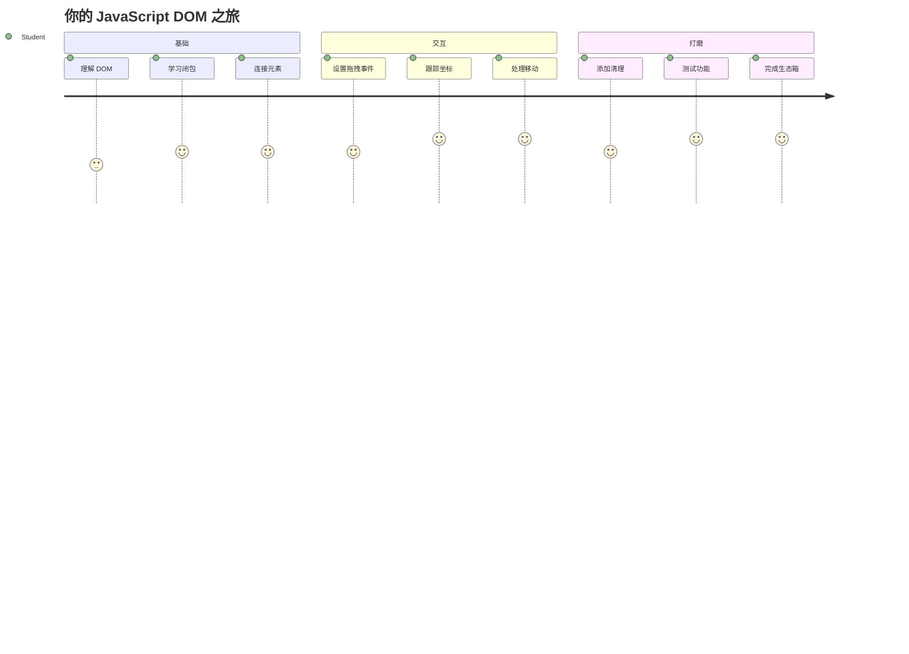
```mermaid
journey
    title 你的 JavaScript DOM 之旅
    section 基础
      理解 DOM: 3: Student
      学习闭包: 4: Student
      连接元素: 4: Student
    section 交互
      设置拖拽事件: 4: Student
      跟踪坐标: 5: Student
      处理移动: 5: Student
    section 打磨
      添加清理: 4: Student
      测试功能: 5: Student
      完成生态箱: 5: Student
```
图示：DOM 和闭包
> 草图笔记作者：[Tomomi Imura](https://twitter.com/girlie_mac)

欢迎来到网页开发中最具趣味性的部分之一——让页面变得互动！文档对象模型（DOM）就像是你的 HTML 和 JavaScript 之间的一座桥梁，今天我们将用它让你的生态瓶变得栩栩如生。当 Tim Berners-Lee 创建第一款网页浏览器时，他设想了一个可以动态交互的网页世界——而DOM让这个设想成为可能。

我们还将探讨 JavaScript 闭包，起初听起来可能令人生畏。把闭包想象成创建“记忆口袋”，你的函数可以记住重要信息。就像生态瓶中的每株植物都有自己的数据记录来跟踪位置。到本节课结束时，你会明白闭包其实是多么自然且有用。

我们要构建的是一个生态瓶，用户可以将植物拖放到任意位置。你将学习 DOM 操作技术，这些技术支持从拖放文件上传到互动游戏的所有功能。让我们一起赋予你的生态瓶生命吧。

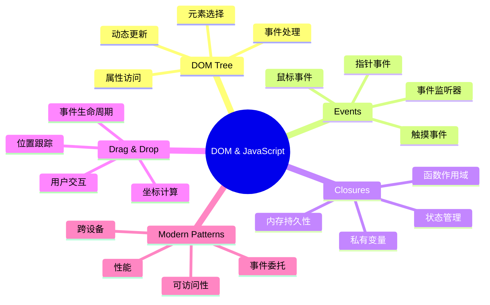
```mermaid
mindmap
  root((DOM & JavaScript))
    DOM Tree
      元素选择
      属性访问
      事件处理
      动态更新
    Events
      指针事件
      鼠标事件
      触摸事件
      事件监听器
    Closures
      私有变量
      函数作用域
      内存持久性
      状态管理
    Drag & Drop
      位置跟踪
      坐标计算
      事件生命周期
      用户交互
    Modern Patterns
      事件委托
      性能
      跨设备
      可访问性
```
## 课前测验

[课前测验](https://ff-quizzes.netlify.app/web/quiz/19)

## 认识 DOM：通往交互式网页的大门

文档对象模型（DOM）是 JavaScript 与你的 HTML 元素沟通的方式。当浏览器加载 HTML 页面时，会在内存中创建该页面的结构化表示——这就是 DOM。把它想象成一棵家谱树，每个 HTML 元素都是一个成员，JavaScript 可以访问、修改或重新排列它们。

DOM 操作将静态页面转换成交互式网站。每当你看到按钮悬停时变色、内容无需刷新自动更新或元素可拖动时，背后都是 DOM 操作的功劳。

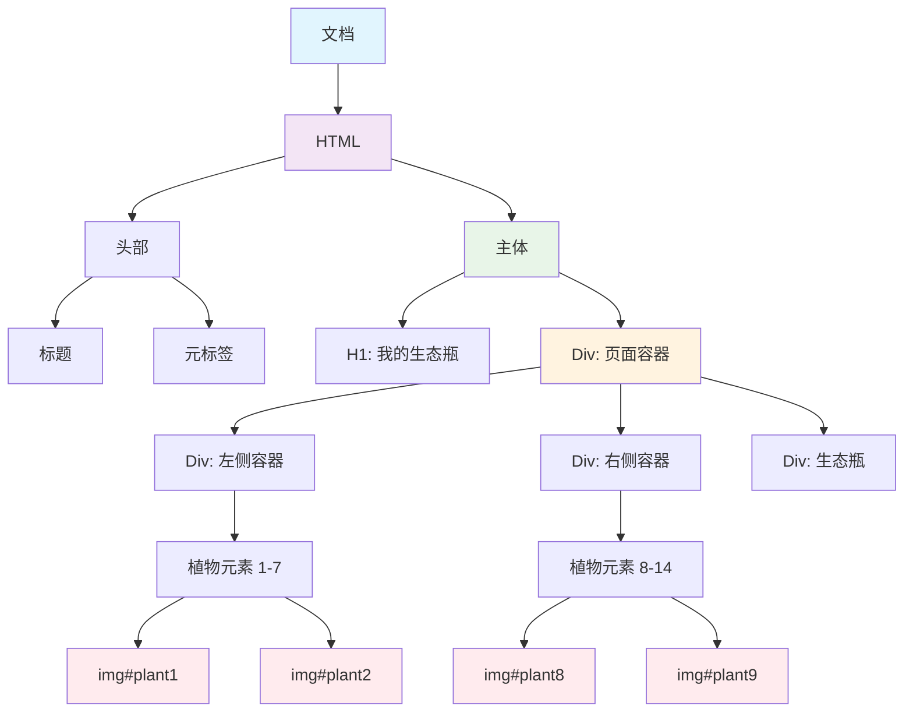
```mermaid
flowchart TD
    A["文档"] --> B["HTML"]
    B --> C["头部"]
    B --> D["主体"]
    C --> E["标题"]
    C --> F["元标签"]
    D --> G["H1: 我的生态瓶"]
    D --> H["Div: 页面容器"]
    H --> I["Div: 左侧容器"]
    H --> J["Div: 右侧容器"]
    H --> K["Div: 生态瓶"]
    I --> L["植物元素 1-7"]
    J --> M["植物元素 8-14"]

    L --> N["img#plant1"]
    L --> O["img#plant2"]
    M --> P["img#plant8"]
    M --> Q["img#plant9"]

    style A fill:#e1f5fe
    style B fill:#f3e5f5
    style D fill:#e8f5e8
    style H fill:#fff3e0
    style N fill:#ffebee
    style O fill:#ffebee
    style P fill:#ffebee
    style Q fill:#ffebee
```
图示：DOM 树结构表示

> DOM 及其关联 HTML 标记的表示。来自 [Olfa Nasraoui](https://www.researchgate.net/publication/221417012_Profile-Based_Focused_Crawler_for_Social_Media-Sharing_Websites)

**DOM 的强大之处在于：**
- **提供** 结构化的方法访问页面中的任意元素
- **支持** 无需刷新页面即可动态更新内容
- **允许** 实时响应用户点击和拖动等操作
- **奠定** 现代交互式网页应用的基础

## JavaScript 闭包：创建有组织且强大的代码

[JavaScript 闭包](https://developer.mozilla.org/docs/Web/JavaScript/Closures)就像给函数分配了自己的专属工作空间，拥有持久的记忆。想象加拉帕戈斯群岛上的达尔文雀根据不同环境发展出专门嘴型——闭包也是如此，创建了“记住”特定上下文的专用函数，即便它们的父函数已经执行完毕。

在我们的生态瓶中，闭包帮助每株植物独立记住自己的位置。这个模式在专业 JavaScript 开发中随处可见，是一个值得理解的重要概念。

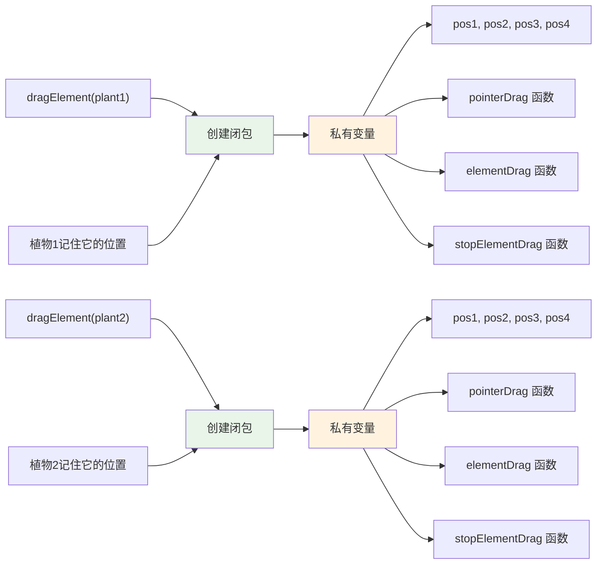
```mermaid
flowchart LR
    A["dragElement(plant1)"] --> B["创建闭包"]
    A2["dragElement(plant2)"] --> B2["创建闭包"]

    B --> C["私有变量"]
    B2 --> C2["私有变量"]

    C --> D["pos1, pos2, pos3, pos4"]
    C --> E["pointerDrag 函数"]
    C --> F["elementDrag 函数"]
    C --> G["stopElementDrag 函数"]

    C2 --> D2["pos1, pos2, pos3, pos4"]
    C2 --> E2["pointerDrag 函数"]
    C2 --> F2["elementDrag 函数"]
    C2 --> G2["stopElementDrag 函数"]

    H["植物1记住它的位置"] --> B
    H2["植物2记住它的位置"] --> B2

    style B fill:#e8f5e8
    style B2 fill:#e8f5e8
    style C fill:#fff3e0
    style C2 fill:#fff3e0
```
> 💡 **理解闭包**：闭包是 JavaScript 中的重要话题，许多开发者多年使用后才完全掌握所有理论细节。今天我们专注于实用应用——你将看到闭包在实现交互功能时自然而然出现。理解将随着你观察它们解决实际问题而逐步加深。

图示：DOM 树结构表示

> DOM 及其关联 HTML 标记的表示。来自 [Olfa Nasraoui](https://www.researchgate.net/publication/221417012_Profile-Based_Focused_Crawler_for_Social_Media-Sharing_Websites)

本节课，我们将完善交互生态瓶项目，创建 JavaScript 代码让用户能够操作页面上的植物。

## 开始之前：成功准备

你需要之前生态瓶课程中的 HTML 和 CSS 文件——我们将让那个静态设计变得可交互。如果你是首次加入，建议先完成那些课程以获得重要背景。

我们将实现的功能：
- **流畅的拖放操作**，适用于所有生态瓶中的植物
- **坐标跟踪**，让植物记住它们的位置
- **完整的交互界面**，使用纯 JavaScript 实现
- **清晰有序的代码结构**，运用闭包设计模式

## 设置你的 JavaScript 文件

让我们创建使生态瓶具备交互性的 JavaScript 文件。

**步骤 1：创建脚本文件**

在你的生态瓶文件夹中，新建一个名为 `script.js` 的文件。

**步骤 2：将 JavaScript 关联到 HTML**

在你的 `index.html` 文件的 `<head>` 部分添加以下脚本标签：

```html
<script src="./script.js" defer></script>
```

**为什么 `defer` 属性很重要：**
- **确保** JavaScript 脚本等到 HTML 完全加载后再执行
- **防止** JavaScript 访问尚未准备好的元素时出错
- **保证** 所有植物元素可交互
- **相比将脚本放在页面底部，提供更好的性能**

> ⚠️ **重要提示**：`defer` 属性避免了常见的时序问题。没有它，JavaScript 可能在 HTML 元素加载前就开始访问，引发错误。

## 关联 JavaScript 与 HTML 元素

在让元素可拖动之前，JavaScript 需要定位它们在 DOM 中的位置。想象这像图书馆的目录系统——拿到适合的目录号，才能准确找到你需要的那本书并浏览其内容。

我们将使用 `document.getElementById()` 方法建立这些连接。它就像精准的文件系统——你提供 ID，它就能准确找到 HTML 中对应元素。

### 为所有植物启用拖动功能

将以下代码添加到你的 `script.js` 文件中：

```javascript
// 为所有14种植物启用拖动功能
dragElement(document.getElementById('plant1'));
dragElement(document.getElementById('plant2'));
dragElement(document.getElementById('plant3'));
dragElement(document.getElementById('plant4'));
dragElement(document.getElementById('plant5'));
dragElement(document.getElementById('plant6'));
dragElement(document.getElementById('plant7'));
dragElement(document.getElementById('plant8'));
dragElement(document.getElementById('plant9'));
dragElement(document.getElementById('plant10'));
dragElement(document.getElementById('plant11'));
dragElement(document.getElementById('plant12'));
dragElement(document.getElementById('plant13'));
dragElement(document.getElementById('plant14'));
```

**这段代码完成了以下任务：**
- **定位** DOM 中每个植物元素，基于它们独特的 ID
- **获取** 每个 HTML 元素的 JavaScript 引用
- **将** 每个元素传入 `dragElement` 函数（我们接着会创建）
- **为** 所有植物准备拖放交互功能
- **将** HTML 结构与 JavaScript 功能连接起来

> 🎯 **为什么用 ID 而不用类？** ID 为特定元素提供唯一标识，而 CSS 类用于样式分组。当 JavaScript 需要操作单个元素时，ID 提供精准且高效的定位。

> 💡 **实用小贴士**：注意我们为每株植物单独调用了 `dragElement()`。这种方式确保每个植物拥有独立的拖动行为，是流畅交互的关键。

### 🔄 **教学小结**
**DOM 连接理解检查**：在继续拖动功能前，确认你能：
- ✅ 解释 `document.getElementById()` 如何定位 HTML 元素
- ✅ 理解为何每个植物需要唯一 ID
- ✅ 描述 `defer` 属性在 script 标签中的作用
- ✅ 识别 JavaScript 与 HTML 如何通过 DOM 关联

**快速自测**：如果两个元素拥有相同 ID，会发生什么？为何 `getElementById()` 只返回一个元素？
*回答：ID 应该唯一；如果重复，只返回第一个匹配元素*

## 构建拖拽元素的闭包

现在我们创建拖动功能的核心：一个闭包，负责管理每株植物的拖动行为。这个闭包内部包含多个函数，协同工作以追踪鼠标移动并更新元素位置。

闭包非常适合该任务，因为它们允许创建“私有”变量，在函数调用之间保持状态，使每个植物拥独立的坐标跟踪系统。

### 用简单例子理解闭包

用一个简单示例演示闭包：

```javascript
function createCounter() {
    let count = 0; // 这就像是一个私有变量

    function increment() {
        count++; // 内部函数记住了外部变量
        return count;
    }

    return increment; // 我们返回内部函数
}

const myCounter = createCounter();
console.log(myCounter()); // 1
console.log(myCounter()); // 2
```

**该闭包模式的工作机制：**
- **创建** 私有的 `count` 变量，仅存于该闭包内
- **内部函数** 可访问并修改外部变量（闭包机制）
- **返回** 内部函数时，它依然保持对私有数据的连接
- **即便** `createCounter()` 调用结束，`count` 依然存在并记忆当前值

### 为什么闭包适合拖动功能

对于我们的生态瓶，每株植物需要记住它当前位置坐标。闭包是完美方案：

**本项目的关键优势：**
- **保持** 每株植物独立的私有位置变量
- **在拖动事件间** 保持坐标数据
- **避免** 不同可拖动元素间变量冲突
- **创建** 干净有序的代码结构

> 🎯 **学习目标**：你不必现在完全掌握闭包的所有细节。专注于理解它们如何帮助组织代码、维护拖动功能状态。

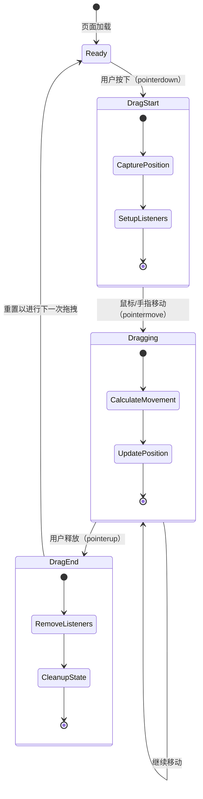
```mermaid
stateDiagram-v2
    [*] --> Ready: 页面加载
    Ready --> DragStart: 用户按下（pointerdown）
    DragStart --> Dragging: 鼠标/手指移动（pointermove）
    Dragging --> Dragging: 继续移动
    Dragging --> DragEnd: 用户释放（pointerup）
    DragEnd --> Ready: 重置以进行下一次拖拽

    state DragStart {
        [*] --> CapturePosition
        CapturePosition --> SetupListeners
        SetupListeners --> [*]
    }

    state Dragging {
        [*] --> CalculateMovement
        CalculateMovement --> UpdatePosition
        UpdatePosition --> [*]
    }

    state DragEnd {
        [*] --> RemoveListeners
        RemoveListeners --> CleanupState
        CleanupState --> [*]
    }
```
### 创建 dragElement 函数

接下来编写处理拖动逻辑的主函数。将此函数添加到植物元素声明代码之后：

```javascript
function dragElement(terrariumElement) {
    // 初始化位置跟踪变量
    let pos1 = 0,  // 之前的鼠标X位置
        pos2 = 0,  // 之前的鼠标Y位置
        pos3 = 0,  // 当前的鼠标X位置
        pos4 = 0;  // 当前的鼠标Y位置

    // 设置初始拖动事件监听器
    terrariumElement.onpointerdown = pointerDrag;
}
```

**理解位置追踪系统：**
- **`pos1` 和 `pos2`**：存储旧鼠标位置和新鼠标位置的差值
- **`pos3` 和 `pos4`**：追踪当前鼠标坐标
- **`terrariumElement`**：特定的植物元素，我们要让它可拖动
- **`onpointerdown`**：触发用户开始拖动的事件

**闭包模式运作方式：**
- **为每株植物** 创建私有位置变量
- **在拖动生命周期中** 保持这些变量
- **确保** 每株植物独立追踪自身坐标
- **通过 `dragElement` 函数** 提供清晰接口

### 为什么使用指针事件？

你可能好奇为何用 `onpointerdown`而不是更熟悉的 `onclick`。原因如下：

| 事件类型 | 适用场景 | 缺点 |
|------------|----------|-------------|
| `onclick` | 简单按钮点击 | 只能处理点击和释放，无法拖动 |
| `onpointerdown` | 鼠标和触摸均适用 | 新技术，但现已广泛支持 |
| `onmousedown` | 仅限桌面鼠标 | 移动端用户体验不足 |

**指针事件为何对我们构建的功能完美契合：**
- **适用于** 鼠标、手指甚至触控笔
- **在** 笔记本、平板和手机上体验一致
- **负责** 拖动实际过程（不仅是点击）
- **打造** 用户期望的流畅现代体验

> 💡 **面向未来**：指针事件是处理用户交互的现代方法。无需为鼠标和触控分别写代码，二者兼得。很棒，对吧？

### 🔄 **教学小结**
**事件处理理解测试**：停顿确认你已理解事件：
- ✅ 为什么用指针事件而非鼠标事件？
- ✅ 闭包变量如何在函数调用间持续？
- ✅ `preventDefault()` 在流畅拖动中起什么作用？
- ✅ 为什么监听器绑定到 document，而非直接绑定元素？

**现实连接**：思考你每天用到的拖放界面：
- **文件上传**：将文件拖入浏览器窗口
- **看板工具**：任务列间拖动卡片
- **图片库**：调整图片排序
- **移动端界面**：触屏滑动和拖动操作

## pointerDrag 函数：捕获拖动开始

当用户按下植物（无论鼠标点击还是手指触摸），`pointerDrag` 函数启动。它捕获初始坐标并搭建拖动系统。

将该函数添加到 `dragElement` 闭包内，紧接 `terrariumElement.onpointerdown = pointerDrag;` 行之后：

```javascript
function pointerDrag(e) {
    // 防止默认的浏览器行为（如文本选择）
    e.preventDefault();

    // 捕捉初始的鼠标/触摸位置
    pos3 = e.clientX;  // 拖动开始时的 X 坐标
    pos4 = e.clientY;  // 拖动开始时的 Y 坐标

    // 设置拖动过程的事件监听器
    document.onpointermove = elementDrag;
    document.onpointerup = stopElementDrag;
}
```

**步骤说明：**
- **阻止** 浏览器默认行为，避免干扰拖动
- **记录** 用户开始拖动的准确坐标
- **建立** 后续拖动移动事件监听器
- **准备** 跟踪鼠标/手指在整个文档上的移动

### 理解事件阻止

`e.preventDefault()` 是保证拖动流畅的关键所在：

**不阻止的话，浏览器可能会：**
- **选中文本**，导致拖动时页面出现不适视觉
- **触发** 右键上下文菜单
- **干扰** 我们自定义的拖动行为
- **造成** 拖动过程中的视觉异常

> 🔍 **实验**：完成本节后，试试去掉 `e.preventDefault()`，观察拖动体验如何变化。你将直观感受到该代码的重要性！

### 坐标追踪系统

`e.clientX` 和 `e.clientY` 属性提供精准鼠标/触摸坐标：

| 属性 | 测量内容 | 用途 |
|----------|------------------|----------|
| `clientX` | 相对于视口的水平位置 | 跟踪左右移动 |
| `clientY` | 相对于视口的垂直位置 | 跟踪上下移动 |
**理解这些坐标：**
- **提供**像素级精准定位信息
- **随着用户移动指针**实时更新
- **在不同屏幕尺寸和缩放级别**下保持一致
- **实现**流畅且响应迅速的拖拽交互

### 设置文档级事件监听器

注意我们把移动和停止事件绑定到整个 `document`，而不仅仅是植物元素：

```javascript
document.onpointermove = elementDrag;
document.onpointerup = stopElementDrag;
```

**为什么绑定到 document：**
- **即使鼠标离开植物元素也能继续跟踪**
- **防止用户快速移动时拖拽中断**
- **提供整个屏幕范围内的流畅拖拽**
- **处理光标移出浏览器窗口的边缘情况**

> ⚡ **性能提示**：拖拽停止时，我们会清理这些文档级监听器以避免内存泄漏和性能问题。

## 完成拖拽系统：移动与清理

现在我们将添加剩余两个函数，分别处理实际拖动移动和拖拽停止时的清理。这些函数协同工作，实现花园中植物的平滑、响应式移动。

### elementDrag 函数：跟踪移动

在 `pointerDrag` 函数的闭括号之后添加 `elementDrag` 函数：

```javascript
function elementDrag(e) {
    // 计算自上次事件以来移动的距离
    pos1 = pos3 - e.clientX;  // 水平移动距离
    pos2 = pos4 - e.clientY;  // 垂直移动距离

    // 更新当前位置跟踪
    pos3 = e.clientX;  // 新的当前 X 位置
    pos4 = e.clientY;  // 新的当前 Y 位置

    // 将移动应用到元素的位置
    terrariumElement.style.top = (terrariumElement.offsetTop - pos2) + 'px';
    terrariumElement.style.left = (terrariumElement.offsetLeft - pos1) + 'px';
}
```

**理解坐标数学：**
- **`pos1` 和 `pos2`**：计算鼠标自上次更新以来移动的距离
- **`pos3` 和 `pos4`**：存储当前鼠标位置用于下次计算
- **`offsetTop` 和 `offsetLeft`**：获取元素当前在页面上的位置
- **减法逻辑**：根据鼠标移动距离同步移动元素

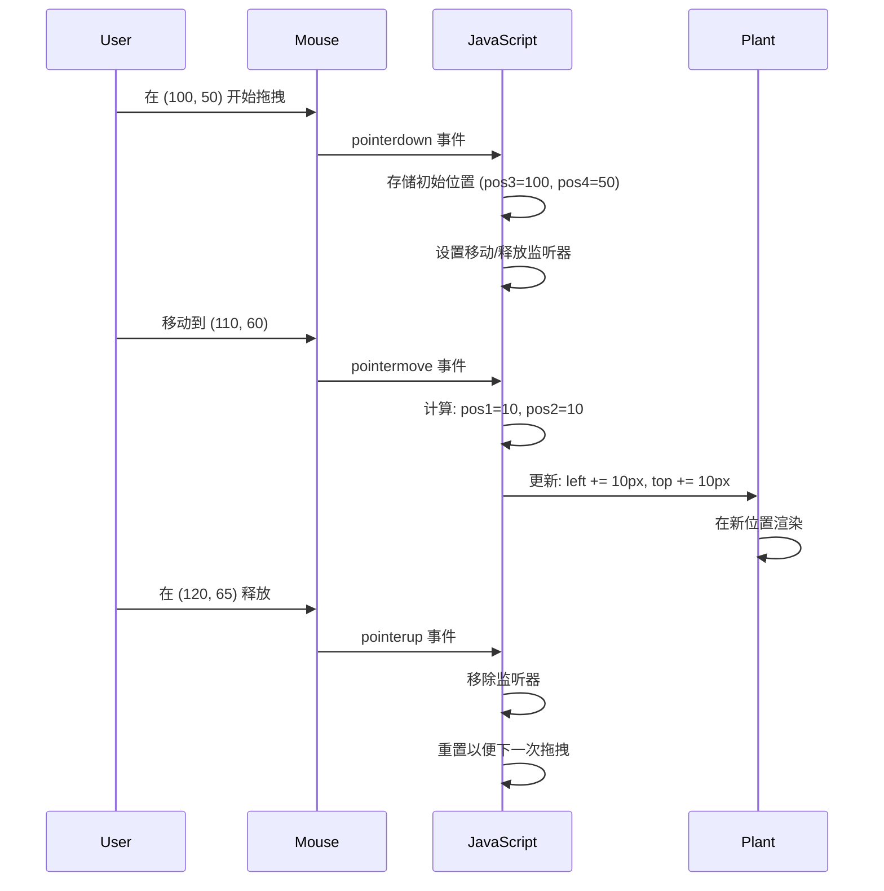
```mermaid
sequenceDiagram
    participant User
    participant Mouse
    participant JavaScript
    participant Plant

    User->>Mouse: 在 (100, 50) 开始拖拽
    Mouse->>JavaScript: pointerdown 事件
    JavaScript->>JavaScript: 存储初始位置 (pos3=100, pos4=50)
    JavaScript->>JavaScript: 设置移动/释放监听器

    User->>Mouse: 移动到 (110, 60)
    Mouse->>JavaScript: pointermove 事件
    JavaScript->>JavaScript: 计算: pos1=10, pos2=10
    JavaScript->>Plant: 更新: left += 10px, top += 10px
    Plant->>Plant: 在新位置渲染

    User->>Mouse: 在 (120, 65) 释放
    Mouse->>JavaScript: pointerup 事件
    JavaScript->>JavaScript: 移除监听器
    JavaScript->>JavaScript: 重置以便下一次拖拽
```
**移动计算细节说明：**
1. **测量**鼠标旧位置和新位置的差值
2. **计算**根据鼠标移动量应移动元素的距离
3. **实时更新**元素的 CSS 位置属性
4. **存储**新位置为下一次移动计算的基线

### 数学的视觉表示

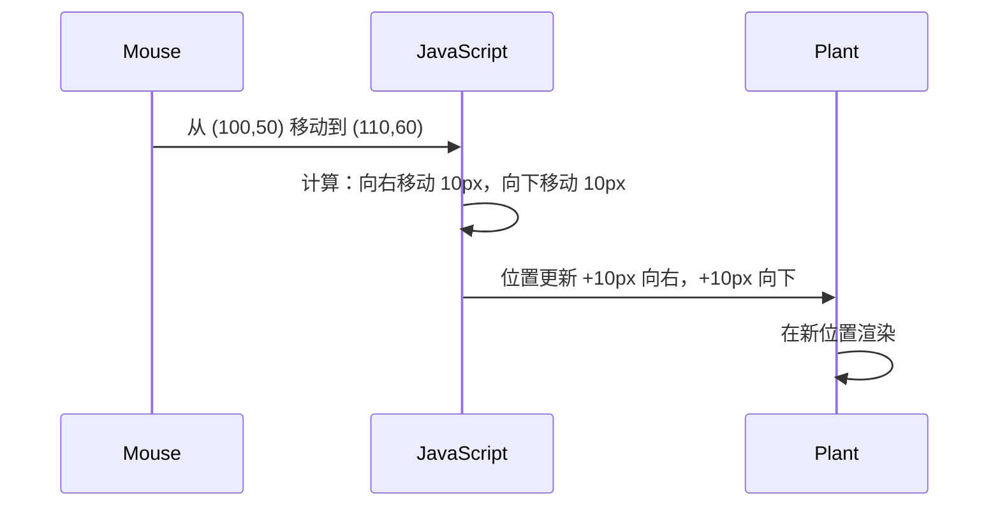
```mermaid
sequenceDiagram
    participant Mouse
    participant JavaScript
    participant Plant

    Mouse->>JavaScript: 从 (100,50) 移动到 (110,60)
    JavaScript->>JavaScript: 计算：向右移动 10px，向下移动 10px
    JavaScript->>Plant: 位置更新 +10px 向右，+10px 向下
    Plant->>Plant: 在新位置渲染
```
### stopElementDrag 函数：清理工作

在 `elementDrag` 函数闭括号后添加清理函数：

```javascript
function stopElementDrag() {
    // 移除文档级别的事件监听器
    document.onpointerup = null;
    document.onpointermove = null;
}
```

**为什么清理至关重要：**
- **防止遗留事件监听器导致内存泄漏**
- **用户松开植物时停止拖拽行为**
- **允许其他元素独立拖拽**
- **为下一次拖拽操作重置系统**

**不清理会带来什么问题：**
- 拖拽停止后事件监听器依旧运行
- 未使用监听器堆积导致性能下降
- 交互其他元素时出现异常行为
- 浏览器资源被无用事件处理占用

### 理解 CSS 定位属性

我们的拖拽系统操作两个关键 CSS 属性：

| 属性 | 控制内容 | 用途 |
|----------|------------------|---------------|
| `top` | 距顶部边缘距离 | 拖拽过程中的垂直定位 |
| `left` | 距左侧边缘距离 | 拖拽过程中的水平定位 |

**关于 offset 属性的关键点：**
- **`offsetTop`**：当前相对于定位父元素顶部的距离
- **`offsetLeft`**：当前相对于定位父元素左侧的距离
- **定位上下文**：这些数值相对于最近的定位祖先元素
- **实时更新**：当我们修改 CSS 属性时立即生效

> 🎯 **设计理念**：该拖拽系统故意保持灵活——没有“放置区”或限制。用户可以将植物放置于任意位置，完全自由设计他们的花园。

## 整合：完整的拖拽系统

恭喜！你刚刚用原生 JavaScript 构建了一个复杂的拖放系统。你完整的 `dragElement` 函数包含强大的闭包控件，实现：

**闭包的功能点：**
- **为每个植物独立维护私有位置变量**
- **管理从开始到结束的完整拖拽生命周期**
- **提供整个屏幕范围内顺畅且响应迅速的移动**
- **正确清理资源避免内存泄漏**
- **创建直观且富有创意的花园设计界面**

### 测试你的交互式花园

现在测试你的交互式花园吧！在浏览器打开 `index.html`，试试这些操作：

1. **点击并按住**任意植物开始拖动
2. **移动鼠标或手指**，观察植物平滑跟随
3. **松开**以放置植物到新位置
4. **尝试不同布局**，探索界面可能性

🥇 **成就**：你创建了一个完整的交互式网页应用，运用了专业开发者每日使用的核心概念。这个拖放功能与文件上传、看板（kanban）和其他交互界面背后的原理相同。

### 🔄 **教学检查点**
**完整系统理解**：验证你对整个拖拽系统的掌握：
- ✅ 闭包如何为每棵植物维护独立状态？
- ✅ 为什么坐标计算对于流畅移动是必需的？
- ✅ 忘记清理事件监听器会有什么后果？
- ✅ 这种模式如何扩展到更复杂的交互？

**代码质量反思**：检查你的完整方案：
- **模块化设计**：每棵植物拥有自己的闭包实例
- **事件效率**：正确设置和清理监听器
- **跨设备支持**：兼容桌面和移动端
- **性能意识**：无内存泄漏或冗余计算

图示：完成的花园

## GitHub Copilot 代理挑战 🚀

使用代理模式完成以下挑战：

**描述：** 通过添加重置功能，增强花园项目，使所有植物能够平滑动画回到它们的初始位置。

**提示：** 创建一个重置按钮，点击时使用 CSS 过渡动画将所有植物平滑移回侧边栏的原始位置。函数应在页面加载时存储初始位置，点击重置按钮时以 1 秒动画过渡回这些位置。

在此了解更多关于 [代理模式](https://code.visualstudio.com/blogs/2025/02/24/introducing-copilot-agent-mode)。

## 🚀 额外挑战：提升技能

准备好将你的花园带到新水平了吗？尝试实现这些增强功能：

**创意扩展：**
- **双击**植物使其置于最前端（z-index 操作）
- **添加视觉反馈**，例如悬停时轻微发光
- **实现边界限制**，防止植物被拖出花园范围
- **创建保存功能**，使用 localStorage 记住植物位置
- **添加音效**，为拾取和放置植物播放声音

> 💡 **学习机会**：每个挑战都将教你 DOM 操作、事件处理和用户体验设计的新内容。

## 课后测验

[课后测验](https://ff-quizzes.netlify.app/web/quiz/20)

## 复习与自学：深化理解

你已掌握 DOM 操作和闭包基础，但总有提升空间！以下是拓展知识与技能的路径。

### 其他拖放方案

我们使用了指针事件来获得最大灵活性，但网页开发提供多种方案：

| 方案 | 适用场景 | 学习价值 |
|----------|----------|----------------|
| [HTML 拖放 API](https://developer.mozilla.org/docs/Web/API/HTML_Drag_and_Drop_API) | 文件上传，正式拖放区 | 理解浏览器原生功能 |
| [触摸事件](https://developer.mozilla.org/docs/Web/API/Touch_events) | 移动端交互 | 移动优先开发模式 |
| CSS `transform` 属性 | 流畅动画 | 性能优化技术 |

### 进阶 DOM 操作主题

**学习下一步：**
- **事件委托**：高效处理多个元素事件
- **Intersection Observer**：检测元素进入/离开视口
- **Mutation Observer**：监控 DOM 结构变化
- **Web Components**：创建可复用、封装的 UI 组件
- **虚拟 DOM 概念**：理解框架如何优化 DOM 更新

### 持续学习必备资源

**技术文档：**
- [MDN 指针事件指南](https://developer.mozilla.org/docs/Web/API/Pointer_events) - 全面指针事件参考
- [W3C 指针事件规范](https://www.w3.org/TR/pointerevents1/) - 官方标准文档
- [JavaScript 闭包详解](https://developer.mozilla.org/docs/Web/JavaScript/Closures) - 高级闭包模式

**浏览器兼容性：**
- [CanIUse.com](https://caniuse.com/) - 跨浏览器特性支持查询
- [MDN 浏览器兼容数据](https://github.com/mdn/browser-compat-data) - 详细兼容信息

**实践机会：**
- **构建**一款使用类似拖拽机制的拼图游戏
- **创建**带拖放任务管理的看板
- **设计**一个可拖拽照片排列的图片库
- **尝试**移动端触摸手势交互

> 🎯 **学习策略**：实践是巩固概念的最佳途径。尝试构建各种可拖拽界面，每个项目都会教你新的用户交互和 DOM 操作技巧。

### ⚡ **接下来 5 分钟你可以做什么**
- [ ] 打开浏览器开发者工具，在控制台输入 `document.querySelector('body')`
- [ ] 试着用 `innerHTML` 或 `textContent` 修改网页文本
- [ ] 给网页上的任意按钮或链接添加点击事件监听器
- [ ] 使用 Elements 面板查看 DOM 树结构

### 🎯 **本小时你能完成的任务**
- [ ] 完成课后测验并复习 DOM 操作概念
- [ ] 创建响应用户点击的交互网页
- [ ] 练习不同事件类型的事件处理（点击、悬停、按键）
- [ ] 使用 DOM 操作构建简单待办清单或计数器
- [ ] 探索 HTML 元素与 JavaScript 对象的关系

### 📅 **你的为期一周的 JavaScript 学习计划**
- [ ] 完成交互式花园项目，包含拖放功能
- [ ] 掌握事件委托以提升事件处理效率
- [ ] 了解事件循环与异步 JavaScript
- [ ] 通过构建具私有状态的模块练习闭包
- [ ] 学习现代 DOM API，如 Intersection Observer
- [ ] 尝试无框架构建交互组件

### 🌟 **你的为期一个月的 JavaScript 精通计划**
- [ ] 使用原生 JavaScript 创建复杂单页应用
- [ ] 学习现代框架（React、Vue 或 Angular），并对比原生日 DOM
- [ ] 参与开源 JavaScript 项目贡献代码
- [ ] 掌握高级概念，如 Web Components 和自定义元素
- [ ] 构建高性能网页应用，优化 DOM 模式
- [ ] 教授他人 DOM 操作与 JavaScript 基础知识

## 🎯 你的 JavaScript DOM 精通时间线

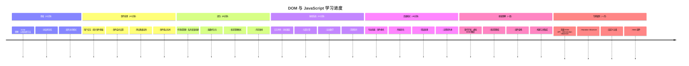
```mermaid
timeline
    title DOM 与 JavaScript 学习进度

    section 基础（15分钟）
        DOM 理解：元素选择方法
                 ：树结构导航
                 ：属性访问模式

    section 事件处理（20分钟）
        用户交互：指针事件基础
                 ：事件监听设置
                 ：跨设备兼容性
                 ：事件阻止技术

    section 闭包（25分钟）
        作用域管理：私有变量创建
                  ：函数持久化
                  ：状态管理模式
                  ：内存效率

    section 拖拽系统（30分钟）
        交互特性：坐标跟踪
                 ：位置计算
                 ：运动数学
                 ：清理程序

    section 高级模式（45分钟）
        专业技能：事件委托
                 ：性能优化
                 ：错误处理
                 ：无障碍考虑

    section 框架理解（一周）
        现代开发：虚拟 DOM 概念
                 ：状态管理库
                 ：组件架构
                 ：构建工具集成

    section 专家级别（一月）
        高级 DOM API：Intersection Observer
                     ：Mutation Observer
                     ：自定义元素
                     ：Web 组件
```
### 🛠️ 你的 JavaScript 工具箱总结

完成本课后，你已经掌握：
- **DOM 精通**：元素选取、属性操作及树结构导航
- **事件专业**：跨设备指针事件交互处理
- **闭包理解**：私有状态管理与函数持久性
- **交互系统**：从零实现完整拖拽功能
- **性能意识**：正确事件清理与内存管理
- **现代模式**：专业开发中应用的代码组织技术
- **用户体验**：创建直观、响应迅速的界面

**获得的专业技能**：你构建的功能使用了与以下相同技术：
- **Trello/看板**：卡片拖拽跨列操作
- **文件上传系统**：拖放文件处理
- **图片库**：照片排列界面
- **移动应用**：基于触摸的交互模式

**下一步**：你已准备好学习如 React、Vue 或 Angular 等基于这些 DOM 基础概念构建的现代框架！

## 任务

[继续练习 DOM](assignment.md)

**免责声明**：
本文件使用 AI 翻译服务 [Co-op Translator](https://github.com/Azure/co-op-translator) 进行翻译。尽管我们力求准确，但请注意自动翻译可能包含错误或不准确之处。原始语言的原文应被视为权威来源。对于重要信息，建议使用专业人工翻译。对于因使用本翻译而引起的任何误解或误释，我们不承担任何责任。

# DOM 元素调查作业

## 概述

既然你已经亲身体验了 DOM 操作的强大功能，现在是时候探索更广泛的 DOM 接口世界了。本作业将加深你对不同网络技术如何与 DOM 交互的理解，而不仅仅是拖拽元素。

## 学习目标

完成此作业后，你将能够：
- **研究**并深入理解特定的 DOM 接口
- **分析**现实世界中 DOM 操作的实现
- **将**理论概念与实际应用相连接
- **培养**技术文档编写和分析的能力

## 说明

### 第一步：选择你的 DOM 接口

访问 MDN 的全面 [DOM 接口列表](https://developer.mozilla.org/docs/Web/API/Document_Object_Model)，选择一个你感兴趣的接口。你可以考虑以下类别以丰富选择：

**初学者友好选项：**
- `Element.classList` - 动态管理 CSS 类
- `Document.querySelector()` - 高级元素选择
- `Element.addEventListener()` - 指针事件之外的事件处理
- `Window.localStorage` - 客户端数据存储

**中级挑战：**
- `Intersection Observer API` - 检测元素可见性
- `MutationObserver` - 监视 DOM 变化
- `Drag and Drop API` - 我们指针方法的替代方案
- `Geolocation API` - 获取用户位置

**高级探索：**
- `Web Components` - 自定义元素与影子 DOM
- `Canvas API` - 编程图形绘制
- `Web Workers` - 后台处理
- `Service Workers` - 离线功能

### 第二步：研究与文档

撰写一份全面分析（300-500字），内容包括：

#### 技术概述
- **定义**你的接口用简单易懂的语言说明其功能
- **解释**关键方法、属性或事件
- **描述**该接口设计解决的主要问题

#### 现实世界应用
- **找到**一个使用了你选择接口的网站（通过查看代码或研究案例）
- **记录**具体的实现方式，如可能，包含代码片段
- **分析**开发者选择这种方式的原因
- **解释**它如何改善用户体验

#### 实际应用
- **比较**你的接口和我们在生态瓶项目中使用的技术
- **建议**你的接口如何增强或扩展生态瓶的功能
- **识别**其他适合使用该接口的项目

### 第三步：代码示例

包含一个简单且可运行的代码示例，用以演示你的接口。示例应：
- **功能可用** - 代码应能实际运行
- **加注释** - 解释每个部分的作用
- **相关** - 与实际应用场景相关联
- **友好初学者** - 易于学习前端开发者理解

## 提交格式

请用清晰的标题结构组织你的提交：

```markdown
# [Interface Name] DOM Investigation

## What It Does
[Technical overview]

## Real-World Example
[Website analysis and implementation details]

## Code Demonstration
[Your working example with comments]

## Reflection
[How this connects to our terrarium project and future applications]
```

## 评估标准

| 评价标准 | 优秀（A） | 良好（B） | 发展中（C） | 需改进（D） |
|----------|----------|------------|-------------|------------|
| **技术理解** | 展示深刻理解，准确解释且术语正确 | 体现扎实理解，解释大部分准确 | 基本理解但有部分误解 | 理解有限，错误较多 |
| **现实分析** | 识别且详细分析实际实现，提供具体例子 | 找到真实案例并进行充分分析 | 定位案例但分析不够深入 | 对现实联系的描述模糊或不准确 |
| **代码示例** | 代码可运行且注释清晰，展示接口 | 功能代码及适当注释 | 代码可用但注释欠缺 | 代码有错误或解释差 |
| **写作质量** | 文字清晰，结构合理，技术表达好 | 结构良好，技术表达得当 | 组织尚可，表达一般 | 结构松散，表达不清 |
| **批判性思维** | 深刻连接概念，提出创新应用 | 分析良好，相关连接明显 | 有一些分析，但深度不够 | 批判思维不足 |

## 成功提示

**研究策略：**
- **从** MDN 文档开始，获取权威信息
- **查找** GitHub 或 CodePen 上的代码示例
- **使用**浏览器开发者工具检查流行网站
- **观看**视频教程获取直观讲解

**写作指南：**
- **使用**自己的语言，而非照抄文档
- **包含**具体例子和代码片段
- **像教朋友一样**解释技术概念
- **连接**你的接口与更广泛的网页开发概念

**代码示例思路：**
- **设计**展示接口主要功能的简单演示
- **借鉴**生态瓶项目的相关概念
- **注重**功能实现而非视觉设计
- **测试**确保代码正确运行

## 截止提交日期

[插入截止日期]

## 有疑问？

如果你对作业的任何方面有疑问，请随时提问！此调查将深化你对 DOM 如何支持我们日常使用的交互式网页体验的理解。

**免责声明**：
本文档使用 AI 翻译服务 [Co-op Translator](https://github.com/Azure/co-op-translator) 进行翻译。虽然我们努力确保准确性，但请注意，自动翻译可能存在错误或不准确之处。原始文档的母语版本应视为权威来源。对于重要信息，建议使用专业人工翻译。对于因使用此翻译而产生的任何误解或误释，我们概不负责。
