# Web-Dev-For-Beginners：浏览器扩展项目

# 浏览器扩展项目第一部分：关于浏览器的一切

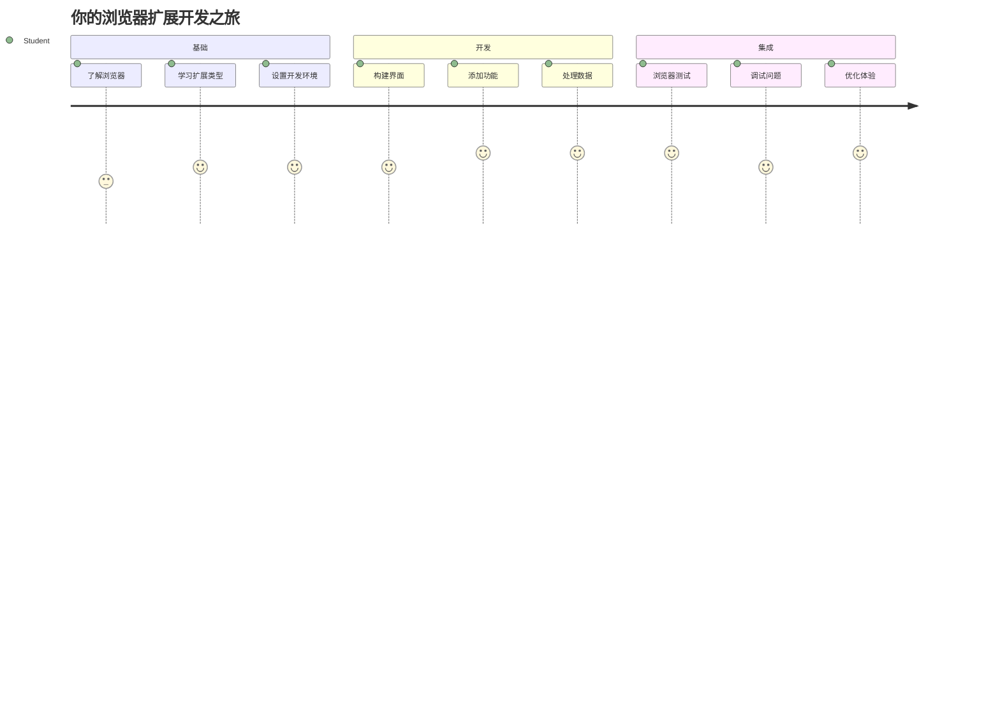
图示：浏览器手绘笔记
> 手绘笔记作者：[Wassim Chegham](https://dev.to/wassimchegham/ever-wondered-what-happens-when-you-type-in-a-url-in-an-address-bar-in-a-browser-3dob)

## 课前测验

[课前测验](https://ff-quizzes.netlify.app/web/quiz/23)

### 介绍

浏览器扩展是增强网页浏览体验的迷你应用程序。就像蒂姆·伯纳斯-李最初设想的互动网络一样，扩展将浏览器的功能从简单的文档查看扩展到了更多领域。从保持账户安全的密码管理器，到帮助设计师选择完美色调的拾色器，扩展解决了日常浏览中的各种挑战。

在构建你的第一个扩展之前，让我们先了解浏览器的工作原理。正如亚历山大·格雷厄姆·贝尔需要理解声音传输才能发明电话一样，掌握浏览器基础知识将帮助你创建无缝集成现有浏览器系统的扩展。

本课结束时，你将理解浏览器架构，并开始构建你的第一个扩展。

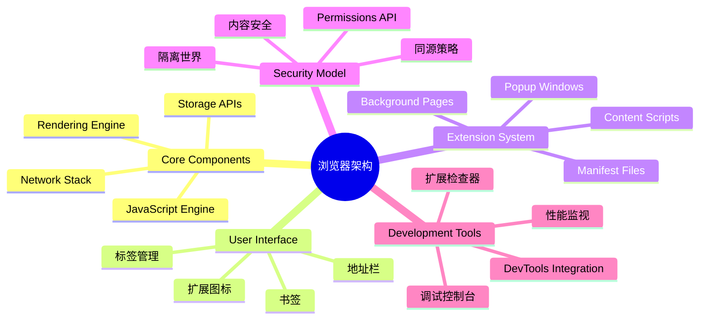
## 理解网页浏览器

网页浏览器本质上是一个复杂的文档解析器。当你在地址栏输入“google.com”时，浏览器会执行一系列复杂操作——从全球服务器请求内容，然后解析并呈现成你所看到的交互式网页。

这一过程与第一款网页浏览器 WorldWideWeb 的设计理念相符，该浏览器由蒂姆·伯纳斯-李在1990年开发，旨在让超链接文档人人可访问。

✅ **一点历史**：第一款浏览器名为“WorldWideWeb”，由蒂姆·伯纳斯-李爵士于1990年创建。

图示：早期浏览器
> 一些早期浏览器，来源：[Karen McGrane](https://www.slideshare.net/KMcGrane/week-4-ixd-history-personal-computing)

### 浏览器如何处理网页内容

从输入 URL 到看到网页，这一过程涉及几个协同步骤，几秒内完成：

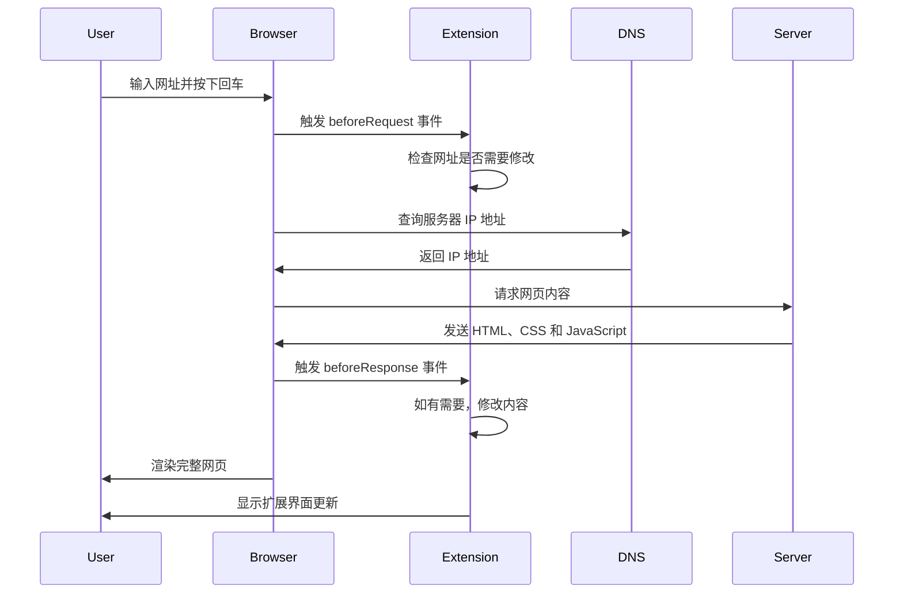
**该过程实现的功能如下：**
- **通过 DNS 查询** 将易读的 URL 转换为服务器 IP 地址
- **使用 HTTP 或 HTTPS 协议** 与网页服务器建立安全连接
- **请求** 服务器上的特定网页内容
- **接收** 服务器发送的 HTML 标记、CSS 样式和 JavaScript 代码
- **渲染** 所有内容，呈现为你看到的交互式网页

### 浏览器核心功能

现代浏览器提供众多功能，扩展开发者可充分利用：

| 功能 | 目的 | 扩展的机会 |
|---------|---------|------------------------|
| **渲染引擎** | 显示 HTML、CSS 和 JavaScript | 内容修改、注入样式 |
| **JavaScript 引擎** | 执行 JavaScript 代码 | 自定义脚本、API 交互 |
| **本地存储** | 本地保存数据 | 用户偏好、缓存数据 |
| **网络栈** | 处理网络请求 | 请求监控、数据分析 |
| **安全模型** | 保护用户免受恶意内容 | 内容过滤、安全增强 |

**了解这些功能可帮助你：**
- **识别** 扩展可带来最多价值的位置
- **选择** 适合扩展功能的浏览器 API
- **设计** 与浏览器系统高效协作的扩展
- **确保** 扩展遵循浏览器安全最佳实践

### 跨浏览器开发考虑

不同浏览器对标准的实现有细微差别，就像不同编程语言对同一算法的处理方式不同一样。Chrome、Firefox 和 Safari 各有特色，开发者需要在扩展开发中考虑这些差异。

> 💡 **专业提示**：使用 [caniuse.com](https://www.caniuse.com) 检查不同浏览器对网页技术的支持，这在规划扩展功能时非常有用！

**扩展开发的关键考虑点：**
- **在 Chrome、Firefox 和 Edge 上测试** 你的扩展
- **适配不同浏览器扩展 API 和 manifest 格式**
- **处理不同浏览器的性能特点和限制**
- **为可能缺失的浏览器特定功能提供备用方案**

✅ **分析洞见**：通过在你的网页开发项目中安装分析包，可以了解用户偏好的浏览器，这有助于你优先支持特定浏览器。

## 理解浏览器扩展

浏览器扩展通过直接向浏览器界面添加功能，解决了常见的网页浏览问题。扩展无需独立应用程序或复杂流程，提供立刻访问工具和功能的能力。

这一理念类似早期计算机先驱道格拉斯·恩格尔巴特设想的通过技术增强人类能力——扩展增强了浏览器的基础功能。

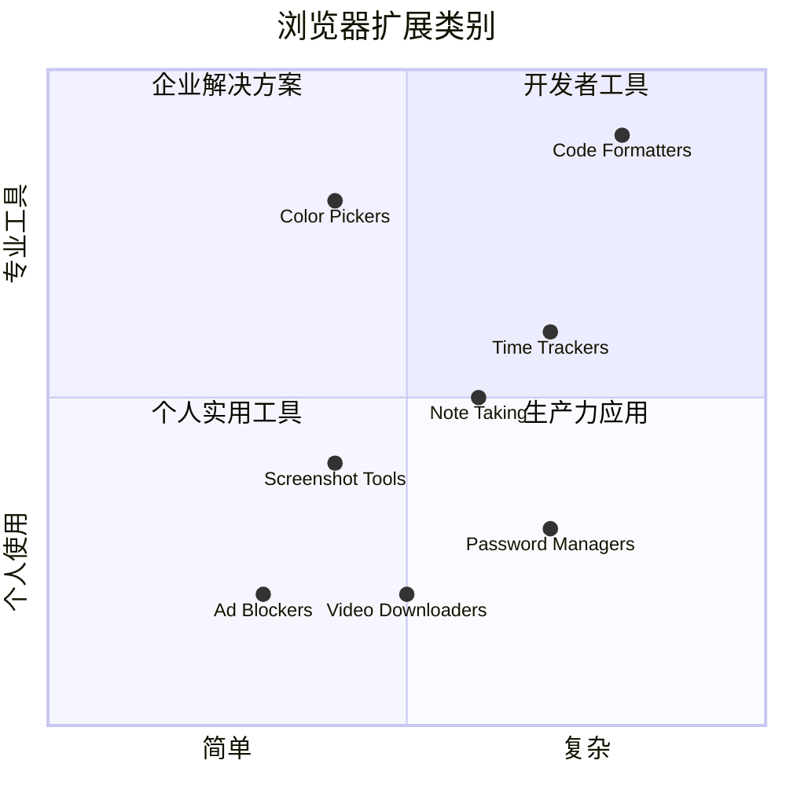
**流行扩展类别及其好处：**
- **效率工具**：任务管理器、笔记应用、时间追踪器，帮助你保持条理
- **安全增强**：密码管理器、广告屏蔽、隐私工具，保护你的数据
- **开发者工具**：代码格式化器、颜色选取器、调试工具，简化开发流程
- **内容增强**：阅读模式、视频下载器、截图工具，改善你的网页体验

✅ **反思问题**：你最喜欢哪些浏览器扩展？它们执行哪些具体任务？如何提升你的浏览体验？

### 🔄 **教学回顾**
**浏览器架构理解**：开始开发扩展前，请确保你能够：
- ✅ 解释浏览器如何处理网络请求和渲染内容
- ✅ 识别浏览器架构的主要组成部分
- ✅ 理解扩展如何与浏览器功能集成
- ✅ 认识保护用户的安全模型

**快速自测**：能否串联起从输入 URL 到看到网页的整个流程？
1. **DNS 查询** 将 URL 转换为 IP 地址
2. **HTTP 请求** 从服务器获取内容
3. **解析** 处理 HTML、CSS 和 JavaScript
4. **渲染** 显示最终网页
5. **扩展** 可在多个步骤修改内容

## 安装和管理扩展

了解扩展安装过程，有助于你预见用户安装你扩展时的体验。现代浏览器的安装流程标准化，界面设计略有差异。

图示：Edge 浏览器扩展页面打开及设置菜单截图

> **重要提示**：测试自己的扩展时，务必开启开发者模式并允许来自其他商店的扩展。

### 开发阶段扩展安装流程

开发和测试自己的扩展时，遵循这个工作流程：

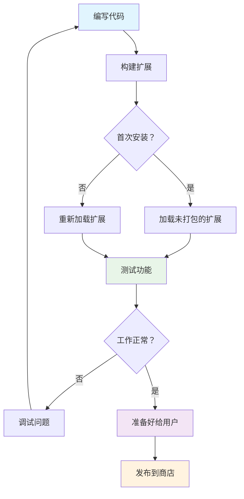
```bash
# 第一步：构建您的扩展
npm run build
```

**该命令完成的操作：**
- **将源代码编译** 成浏览器可用文件
- **打包** JavaScript 模块为优化的包
- **生成** 最终扩展文件到 `/dist` 文件夹
- **准备** 扩展供安装和测试

**步骤 2：进入浏览器扩展管理页面**
1. **打开** 浏览器扩展管理页面
2. **点击** 右上角“设置和更多”按钮（`...`图标）
3. **选择** 下拉菜单中的“扩展”选项

**步骤 3：加载扩展**
- **新安装**：选择“加载已解压的扩展”，并选中 `/dist` 文件夹
- **更新**：在已安装扩展旁点击“重新加载”
- **测试**：启用“开发者模式”以访问额外调试功能

### 生产环境扩展安装

> ✅ **注意**：以上开发说明针对你自己构建的扩展。若安装发布的扩展，请访问官方浏览器扩展商店，如 [Microsoft Edge 附加组件商店](https://microsoftedge.microsoft.com/addons/Microsoft-Edge-Extensions-Home)。

**理解差异：**
- **开发安装** 可测试未发布扩展
- **商店安装** 提供经过验证的已发布扩展，且支持自动更新
- **旁加载** 允许从非官方商店安装扩展（需开发者模式）

## 构建你的碳足迹扩展

我们将创建一个显示你的地区能源使用碳足迹的浏览器扩展。该项目演示了扩展开发的基本概念，同时打造一个环境意识的实用工具。

此方法遵循自约翰·杜威教育理论以来有效的“做中学”原则——结合技术技能与有意义的真实应用。

### 项目需求

开发前，收集所需资源和依赖：

**必备 API 访问：**
- **[CO2 Signal API 密钥](https://www.co2signal.com/)**：输入邮箱地址以免费获取 API 密钥
- **[地区代码](http://api.electricitymap.org/v3/zones)**：通过[Electricity Map](https://www.electricitymap.org/map)查找你的地区代码（例如，波士顿区域代码为 'US-NEISO'）

**开发工具：**
- **[Node.js 和 NPM](https://www.npmjs.com)**：用于安装项目依赖的包管理工具
- **起始代码**：下载 `start` 文件夹开始开发

✅ **了解更多**：提升你的包管理技能，请参考此[完整学习模块](https://docs.microsoft.com/learn/modules/create-nodejs-project-dependencies/?WT.mc_id=academic-77807-sagibbon)

### 理解项目结构

理解项目结构有助于高效组织开发工作。就像亚历山大图书馆为知识检索而布局，一个结构良好的代码库能极大提高开发效率：

```
project-root/
├── dist/                    # Built extension files
│   ├── manifest.json        # Extension configuration
│   ├── index.html           # User interface markup
│   ├── background.js        # Background script functionality
│   └── main.js              # Compiled JavaScript bundle
├── src/                     # Source development files
│   └── index.js             # Your main JavaScript code
├── package.json             # Project dependencies and scripts
└── webpack.config.js        # Build configuration
```

**解释每个文件的功能：**
- **`manifest.json`**：**定义** 扩展元数据、权限和入口
- **`index.html`**：**创建** 用户点击扩展时呈现的界面
- **`background.js`**：**处理** 后台任务和浏览器事件监听
- **`main.js`**：**包含** 打包过程后的最终 JavaScript 代码
- **`src/index.js`**：**存放** 你的主要开发代码，编译成 `main.js`

> 💡 **组织技巧**：将你的 API 密钥和地区代码存储在安全笔记中，便于开发时引用。你需要这些值测试扩展功能。

✅ **安全提示**：切勿将 API 密钥或敏感凭据提交至代码仓库。后续步骤会展示如何安全管理这些信息。

## 创建扩展界面

现在构建用户界面组件。扩展采用两屏设计：配置屏用于初始设置，结果屏显示数据。

这遵循早期计算机界面设计的渐进披露原则——按逻辑顺序展示信息和选项，避免用户不堪重负。

### 扩展视图概览

**设置视图** - 首次用户配置：
图示：扩展完整界面截图，显示包含地区名称和 API 密钥输入的表单

**结果视图** - 碳足迹数据显示：
图示：扩展显示 US-NEISO 区域碳使用量和化石燃料百分比的截图

### 构建配置表单

设置表单位于首次使用时收集用户配置信息。配置完成后，此信息会保存在浏览器存储以供后续使用。

在 `/dist/index.html` 文件中添加以下表单结构：

```html
<form class="form-data" autocomplete="on">

        <h2>New? Add your Information</h2>

        <label for="region">Region Name</label>
        <input type="text" id="region" required class="region-name" />

        <label for="api">Your API Key from tmrow</label>
        <input type="text" id="api" required class="api-key" />

    <button class="search-btn">Submit</button>
</form>
```

**表单所实现的功能：**
- **创建** 语义化的表单结构，带有适当标签和输入关联
- **启用** 浏览器自动完成功能，提升用户体验
- **必填** 两个字段均需填写，使用 `required` 属性确保
- **采用** 描述性类名组织输入，便于样式和 JS 选择
- **为首次设置的用户** 提供清晰指引

### 构建结果显示区

接下来，创建显示碳足迹数据的结果区域。将以下 HTML 添加到表单下方：

```html

    <div class="loading">loading...</div>
    <div class="errors"></div>
    <div class="data"></div>

        <p><strong>Region: </strong><span class="my-region"></span></p>
        <p><strong>Carbon Usage: </strong><span class="carbon-usage"></span></p>
        <p><strong>Fossil Fuel Percentage: </strong><span class="fossil-fuel"></span></p>

    <button class="clear-btn">Change region</button>

```

**此结构提供的功能包括：**
- **`loading`**：**显示** 获取 API 数据时的加载信息
- **`errors`**：**展示** API 调用失败或数据无效时的错误信息
- **`data`**：**保存** 调试用的原始数据
- **`result-container`**：**向用户呈现** 格式化的碳足迹信息
- **`clear-btn`**：**允许** 用户更改地区并重新配置扩展

### 设置构建流程

现在安装项目依赖并测试构建流程：

```bash
npm install
```

**该安装步骤完成的操作：**
- **下载** Webpack 及 `package.json` 中指定的其他开发依赖
- **配置** 构建工具链，编译现代 JavaScript
- **准备** 开发环境，为扩展构建与测试做好准备
- **支持** 代码打包、优化及跨浏览器兼容功能

> 💡 **构建流程洞见**：Webpack 会将 `/src/index.js` 中的源码打包成 `/dist/main.js`。该过程优化代码以适应生产环境，并确保浏览器兼容性。

### 测试你的进展

此时，你可以开始测试你的扩展了：
1. **运行** 构建命令以编译代码
2. **加载** 扩展到浏览器中，使用开发者模式
3. **验证** 表单是否正确显示且外观专业
4. **检查** 所有表单元素是否正确对齐且功能正常

**你已完成：**
- **构建** 了扩展的基础 HTML 结构
- **创建** 了配置和结果界面，使用了正确的语义标记
- **搭建** 了使用行业标准工具的现代开发流程
- **准备** 了添加交互式 JavaScript 功能的基础

### 🔄 **教学核验**
**扩展开发进度**：继续前请确认理解：
- ✅ 你能解释项目结构中每个文件的目的吗？
- ✅ 你理解构建过程如何转换源代码吗？
- ✅ 为什么我们将配置和结果分到不同的用户界面部分？
- ✅ 表单结构如何支持可用性和可访问性？

**开发工作流理解**：现在你应该能：
1. **修改** 扩展界面相关的 HTML 和 CSS
2. **运行** 构建命令编译更改
3. **重新加载** 浏览器中的扩展以测试更新
4. **使用**浏览器开发者工具调试问题

你已完成浏览器扩展开发的第一阶段。就像莱特兄弟在实现飞行前需要了解空气动力学一样，理解这些基础概念将助你构建下一课中更复杂的交互功能。

## GitHub Copilot Agent 挑战 🚀

使用 Agent 模式完成以下挑战：

**描述：** 通过添加表单验证和用户反馈功能来增强浏览器扩展，提升输入 API 密钥和地区代码时的用户体验。

**提示：** 创建 JavaScript 验证函数，检查 API 密钥字段是否至少包含 20 个字符，以及地区代码是否符合正确格式（如 'US-NEISO'）。通过改变输入框边框颜色来提供视觉反馈，输入有效时为绿色，无效时为红色。还要添加切换功能以显示/隐藏 API 密钥以保证安全。

了解更多关于[agent 模式](https://code.visualstudio.com/blogs/2025/02/24/introducing-copilot-agent-mode)。

## 🚀 挑战

查看浏览器扩展商店并安装一个扩展到浏览器。你可以用有趣的方式检查其文件。你发现了什么？

## 课后测验

[课后测验](https://ff-quizzes.netlify.app/web/quiz/24)

## 复习与自学

本课中你了解了浏览器的一些历史；借此机会通过阅读更多有关万维网发明者的历史，了解他们对其使用的设想。一些有用网站包括：

[浏览器历史](https://www.mozilla.org/firefox/browsers/browser-history/)

[万维网历史](https://webfoundation.org/about/vision/history-of-the-web/)

[蒂姆·伯纳斯-李访谈](https://www.theguardian.com/technology/2019/mar/12/tim-berners-lee-on-30-years-of-the-web-if-we-dream-a-little-we-can-get-the-web-we-want)

### ⚡ **你接下来 5 分钟能做什么**
- [ ] 打开 Chrome/Edge 扩展页面 (chrome://extensions) 并浏览已安装扩展
- [ ] 在加载网页时查看浏览器开发者工具 Network 标签页
- [ ] 尝试查看页面源代码（Ctrl+U）以了解 HTML 结构
- [ ] 检查任意网页元素并在开发者工具中修改其 CSS

### 🎯 **你这小时能完成什么**
- [ ] 完成课后测验，理解浏览器基础知识
- [ ] 创建基本的 manifest.json 文件用于浏览器扩展
- [ ] 构建显示弹出窗口的简单 “Hello World” 扩展
- [ ] 测试以开发者模式加载你的扩展
- [ ] 探索目标浏览器的扩展文档

### 📅 **你的为期一周的扩展之旅**
- [ ] 完成一个具备实际用途的功能性浏览器扩展
- [ ] 了解内容脚本、后台脚本和弹出交互
- [ ] 掌握浏览器 API 如存储、标签页和消息传递
- [ ] 设计对用户友好的扩展界面
- [ ] 在不同网站和场景测试你的扩展
- [ ] 将扩展发布到浏览器扩展商店

### 🌟 **你的为期一个月的浏览器开发规划**
- [ ] 构建多款解决不同用户问题的扩展
- [ ] 学习高级浏览器 API 和安全最佳实践
- [ ] 贡献开源浏览器扩展项目
- [ ] 精通跨浏览器兼容和渐进增强
- [ ] 为他人创建扩展开发工具和模板
- [ ] 成为帮助其他开发者的浏览器扩展专家

## 🎯 你的浏览器扩展掌握时间表

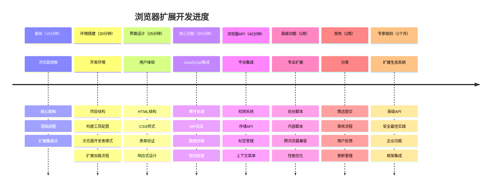
### 🛠️ 你的扩展开发工具包总结

完成本课后，你现拥有：
- **浏览器架构知识**：理解渲染引擎、安全模型和扩展集成
- **开发环境**：现代工具链，包含 Webpack、NPM 和调试能力
- **UI/UX 基础**：语义 HTML 结构与渐进披露模式
- **安全意识**：了解浏览器权限和安全开发实践
- **跨浏览器概念**：兼容性考虑和测试方法
- **API 集成**：与外部数据源交互的基础
- **专业工作流程**：行业标准的开发和测试流程

**现实应用**：这些技能直接适用于：
- **网页开发**：单页应用和渐进式网页应用
- **桌面应用**：Electron 及基于网页的桌面软件
- **移动开发**：混合应用和基于网页的移动解决方案
- **企业工具**：内部生产力应用和工作流自动化
- **开源项目**：参与浏览器扩展项目和网络标准

**下一步**：你已准备好添加交互功能，使用浏览器 API，并创建解决真实用户问题的扩展！

## 作业

[重新设计你的扩展](assignment.md)

**免责声明**：
本文件使用AI翻译服务[Co-op Translator](https://github.com/Azure/co-op-translator)进行翻译。虽然我们力求准确，但请注意自动翻译可能存在错误或不准确之处。原始文件的母语版本应被视为权威版本。对于关键信息，建议采用专业人工翻译。对于因使用本翻译而产生的任何误解或误释，我们概不负责。

# 作业：重新设计你的浏览器扩展样式

## 概述

现在你已经构建了碳足迹浏览器扩展的 HTML 结构，是时候让它在视觉上更吸引人且更易于使用了。优秀的设计可以提升用户体验，让你的扩展看起来更专业、更有吸引力。

你的扩展附带了基本的 CSS 样式，但本次作业挑战你创建一种独特的视觉识别，既能体现你的个人风格，又能保持良好的可用性。

## 指导说明

### 第 1 部分：分析当前设计

在进行更改前，先检查现有的 CSS 结构：

1. **定位**你扩展项目中的 CSS 文件
2. **审查**当前的样式方法和配色方案
3. **识别**布局、排版和视觉层次中可改进的部分
4. **考虑**设计如何支持用户目标（方便填写表单和清晰展示数据）

### 第 2 部分：设计你的自定义样式

创建一个整体统一的视觉设计，包括：

**配色方案：**
- 选择反映环保主题的主色调
- 保证充足的对比度以确保无障碍（可使用 WebAIM 的对比度检查工具）
- 考虑颜色在不同浏览器主题下的表现

**排版：**
- 选择在小尺寸扩展界面中易读的字体
- 通过合适的字体大小和粗细建立清晰的层次结构
- 确保文本在亮暗主题浏览器中均清晰可见

**布局与间距：**
- 优化表单元素和数据展示的视觉组织
- 添加合适的内边距和外边距提升可读性
- 考虑响应式设计，适应不同屏幕尺寸

### 第 3 部分：实现你的设计

修改 CSS 文件来应用你的设计：

```css
/* Example starting points for customization */

.form-data {
    /* Style the configuration form */
    background: /* your choice */;
    padding: /* your spacing */;
    border-radius: /* your preference */;
}

.result-container {
    /* Style the data display area */
    background: /* complementary color */;
    border: /* your border style */;
    margin: /* your spacing */;
}

/* Add your custom styles here */
```

**关键样式区域：**
- **表单元素**：输入框、标签和提交按钮
- **结果展示**：数据容器、文本样式和加载状态
- **交互元素**：悬停效果、按钮状态及过渡动画
- **整体布局**：容器间距、背景颜色和视觉层次

### 第 4 部分：测试与调整

1. 使用 `npm run build` **构建**你的扩展
2. **加载**更新后的扩展到浏览器
3. **测试**所有视觉状态（表单输入、加载、结果展示、错误提示）
4. 使用浏览器开发者工具**验证**无障碍功能
5. 根据实际使用情况**调整**你的样式

## 创意挑战

### 基础级别
- 更新颜色和字体，打造统一主题
- 改善界面内的间距和对齐
- 给交互元素添加细腻的悬停效果

### 中级
- 设计定制图标或图形元素
- 实现不同状态间的平滑过渡动画
- 为 API 调用创建独特的加载动画

### 高级
- 设计多种主题选项（亮色/暗色/高对比度）
- 实现针对不同浏览器窗口尺寸的响应式设计
- 添加提升用户体验的微交互

## 提交指南

提交内容应包括：

- **修改后的 CSS 文件**，体现你的自定义样式
- 显示扩展不同状态（表单、加载、结果）的**截图**
- 简短说明（2-3 句），解释你的设计选择及其如何提升用户体验

## 评估标准

| 评估项目 | 杰出 (4) | 熟练 (3) | 发展中 (2) | 初学 (1) |
|----------|----------|----------|------------|----------|
| **视觉设计** | 创意且整体统一，增强可用性，体现强设计原则 | 良好的设计选择，样式一致，视觉层次清晰 | 基础设计改进，有一些一致性问题 | 样式修改有限或设计不一致 |
| **功能性** | 所有样式在各种状态和浏览器环境中完美运行 | 样式运作良好，边缘情况有轻微问题 | 大部分样式可用，有一些显示问题 | 样式问题严重影响可用性 |
| **代码质量** | 清晰有序的 CSS，类名有意义，选择器高效 | 良好 CSS 结构，选择器和属性使用合适 | CSS 可以接受，有些组织问题 | CSS 结构差或样式过于复杂 |
| **无障碍** | 优秀的颜色对比度、易读字体，考虑到残障用户 | 良好的无障碍实践，少许改进空间 | 基本无障碍考虑，有些问题 | 无障碍关注有限 |

## 成功提示

> 💡 **设计提示**：从细微变化开始，逐步构建更显著的样式调整。排版和间距的小提升往往对质感影响很大。

**最佳实践包括：**
- 在亮色和暗色浏览器主题中都**测试**扩展
- 使用相对单位（em, rem）提升可扩展性
- 使用 CSS 自定义属性保持间距一致
- 考虑不同视觉需求用户的观感
- 验证 CSS 以确保符合正确语法

> ⚠️ **常见错误**：不要为了美观牺牲可用性。扩展应兼具美观与实用。

**记得：**
- 保持重要信息易于阅读
- 确保按钮和交互元素易于点击
- 保持用户操作的明确视觉反馈
- 用真实数据测试设计，而非仅用占位文本

祝你成功打造既实用又视觉出色的浏览器扩展！

**免责声明**：
本文件使用 AI 翻译服务 [Co-op Translator](https://github.com/Azure/co-op-translator) 进行翻译。虽然我们力求准确，但请注意，自动翻译可能存在错误或不准确之处。原始文件以其本地语言版本为权威来源。对于重要信息，建议采用专业人工翻译。我们不对因使用本翻译而产生的任何误解或误释承担责任。

# 浏览器扩展项目第二部分：调用 API，使用本地存储

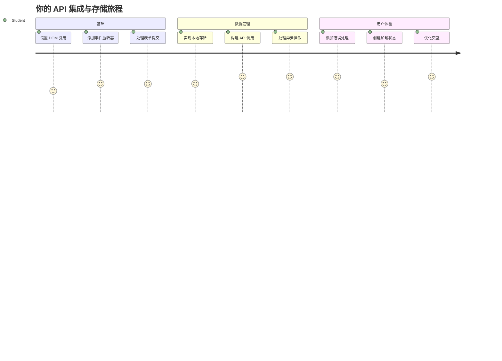
## 课前测验

[课前测验](https://ff-quizzes.netlify.app/web/quiz/25)

## 介绍

还记得你刚开始构建的浏览器扩展吗？现在你拥有一个看起来很不错的表单，但它本质上是静态的。今天我们将通过连接真实数据并赋予它记忆功能来让它变得生动。

想想阿波罗任务控制计算机——它们不仅仅展示固定信息。它们不断与航天器通信，更新遥测数据，并记住关键的任务参数。这就是我们今天要构建的动态行为。你的扩展将连接互联网，抓取真实的环境数据，并记住你下次的设置。

API 集成听起来可能很复杂，但实际上就是教你的代码如何与其他服务通信。无论你是在获取天气数据、社交媒体信息流，还是像今天一样获取碳足迹信息，关键都是建立这些数字连接。我们还将探讨浏览器如何持久保存信息——类似于图书馆如何使用卡片目录来记住书本位置。

完成本课后，你将拥有一个能够获取真实数据、保存用户偏好设置并提供流畅体验的浏览器扩展。让我们开始吧！

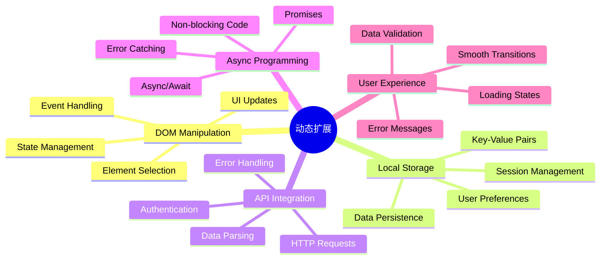
✅ 按照对应文件中的编号段落知道在哪里放置你的代码

## 设置扩展中要操作的元素

在你的 JavaScript 操作界面之前，需要先获取特定的 HTML 元素引用。就像望远镜需要对准特定的星星一样——伽利略研究木星的卫星前必须先定位并聚焦于木星。

在你的 `index.js` 文件中，我们将创建 `const` 变量来捕获每个重要表单元素的引用。这类似于科学家给他们的设备贴标签——这样他们不必每次都在整个实验室中搜索，就可以直接访问需要的东西。

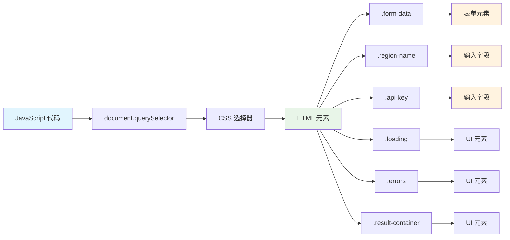
```javascript
// 表单字段
const form = document.querySelector('.form-data');
const region = document.querySelector('.region-name');
const apiKey = document.querySelector('.api-key');

// 结果
const errors = document.querySelector('.errors');
const loading = document.querySelector('.loading');
const results = document.querySelector('.result-container');
const usage = document.querySelector('.carbon-usage');
const fossilfuel = document.querySelector('.fossil-fuel');
const myregion = document.querySelector('.my-region');
const clearBtn = document.querySelector('.clear-btn');
```

**这段代码的作用：**
- **捕获** 表单元素，使用 `document.querySelector()` 结合 CSS 类选择器
- **创建** 了区域名称和 API 密钥输入字段的引用
- **建立** 结果显示元素的连接，用于展示碳使用相关数据
- **设置** 访问 UI 元素，如加载指示器和错误信息
- **存储** 每个元素引用在 `const` 变量中，便于代码中反复使用

## 添加事件监听器

现在我们让你的扩展响应用户操作。事件监听器是你的代码监控用户交互的方式。想象早期电话交换机的操作员——他们监听来电，当有人想要通话时连接正确的线路。

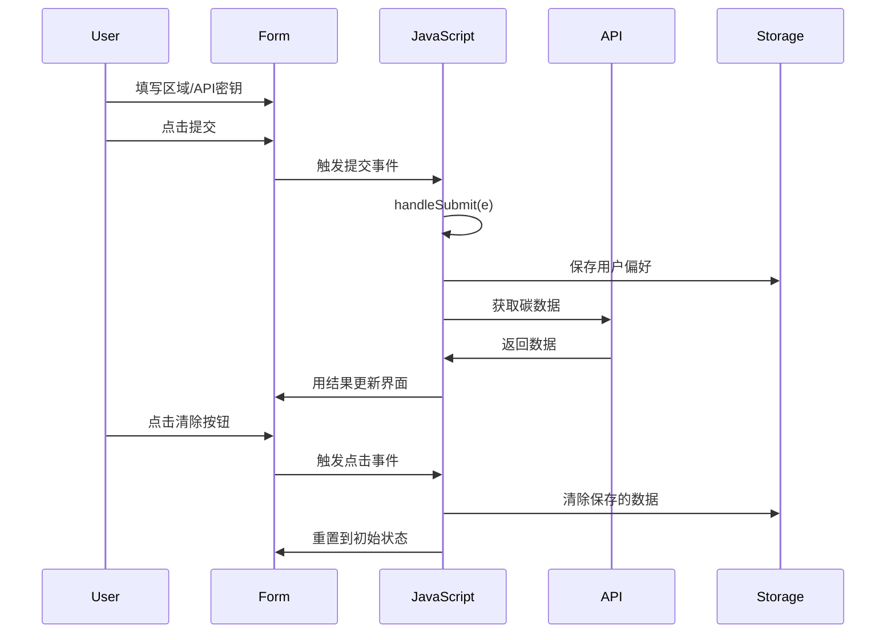
```javascript
form.addEventListener('submit', (e) => handleSubmit(e));
clearBtn.addEventListener('click', (e) => reset(e));
init();
```

**理解这些概念：**
- **绑定** 表单提交事件监听器，当用户按下回车或点击提交时触发
- **连接** 清除按钮的点击监听器，用于重置表单
- **传递** 事件对象 `(e)` 给处理函数以实现额外控制
- **立即调用** `init()` 函数，用于设置扩展的初始状态

✅ 注意这里使用的箭头函数简写语法。这种现代 JavaScript 写法比传统函数表达式更简洁，不过两者都有效！

### 🔄 **教学检查点**
**事件处理理解**：在进行初始化之前，请确保你能：
- ✅ 解释 `addEventListener` 如何将用户操作连接到 JavaScript 函数
- ✅ 理解为何要将事件对象 `(e)` 传给处理函数
- ✅ 认识 `submit` 和 `click` 事件的区别
- ✅ 描述 `init()` 函数何时运行及其原因

**快速自测**：如果忘记在表单提交时调用 `e.preventDefault()` 会怎么样？
*答案：页面会重新加载，所有 JavaScript 状态丢失，用户体验中断*

## 构建初始化和重置函数

让我们创建扩展的初始化逻辑。`init()` 函数就像船舶的导航系统检查仪器——它判断当前状态并相应调整界面。它会检查用户是否之前使用过你的扩展，并加载他们之前的设置。

`reset()` 函数则为用户提供一个重新开始的机会——类似科学家在实验间隙重置仪器以保证数据清洁。

```javascript
function init() {
	// 检查用户是否之前保存过API凭证
	const storedApiKey = localStorage.getItem('apiKey');
	const storedRegion = localStorage.getItem('regionName');

	// 将扩展图标设置为通用绿色（未来课程的占位符）
	// 待办事项：在下一课实现图标更新

	if (storedApiKey === null || storedRegion === null) {
		// 初次使用者：显示设置表单
		form.style.display = 'block';
		results.style.display = 'none';
		loading.style.display = 'none';
		clearBtn.style.display = 'none';
		errors.textContent = '';
	} else {
		// 回访用户：自动加载他们保存的数据
		displayCarbonUsage(storedApiKey, storedRegion);
		results.style.display = 'none';
		form.style.display = 'none';
		clearBtn.style.display = 'block';
	}
}

function reset(e) {
	e.preventDefault();
	// 清除存储的区域以允许用户选择新位置
	localStorage.removeItem('regionName');
	// 重新启动初始化过程
	init();
}
```

**这里发生的事情分解：**
- **从浏览器本地存储获取** 保存的 API 密钥和区域数据
- **检测** 是否为首次使用（无存储凭据）或是回访用户
- **为新用户显示** 设置表单，并隐藏其他界面元素
- **为回访用户自动加载** 保存的数据并显示重置选项
- **基于是否有数据** 管理用户界面的状态

**关于本地存储的关键概念：**
- **数据持久保存**，跨浏览器会话有效（与会话存储不同）
- **以键值对方式保存**，使用 `getItem()` 和 `setItem()`
- **当指定键无数据时返回** `null`
- **提供简单方式** 存储用户偏好和设置

> 💡 **理解浏览器存储**：[LocalStorage](https://developer.mozilla.org/docs/Web/API/Window/localStorage) 就像赋予你的扩展持久记忆。想象古代亚历山大图书馆如何保存卷轴——信息在学者离开再回来时依然可用。
>
> **关键特点：**
> - **关闭浏览器后依然保存数据**
> - **重启计算机和浏览器崩溃后数据依然存在**
> - **提供丰富存储空间保存用户偏好**
> - **无需网络延迟即可即时访问**

> **重要提示**：你的浏览器扩展有自己的独立本地存储，独立于普通网页。这保证了安全且避免与其他网站冲突。

你可以通过打开浏览器开发者工具（F12），进入 **Application** 选项卡，展开 **Local Storage** 部分查看存储的数据。

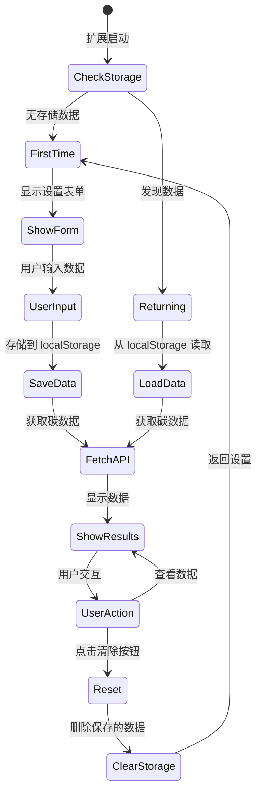
图示：本地存储面板

> ⚠️ **安全注意事项**：在生产环境中，将 API 密钥存储在 LocalStorage 存在安全风险，因为 JavaScript 代码可以访问这些数据。学习用途这样做可以，但实际应用应使用安全的服务器端存储敏感凭证。

## 处理表单提交

接下来我们处理用户提交表单时的行为。默认情况下，浏览器表单提交会重新加载页面，但我们要拦截这种行为，使体验更加流畅。

这种做法类似任务控制对航天器通信的处理——不是每次传输都重置整个系统，而是持续运行同时处理新信息。

创建一个函数，捕获表单提交事件并提取用户输入内容：

```javascript
function handleSubmit(e) {
	e.preventDefault();
	setUpUser(apiKey.value, region.value);
}
```

**以上我们做了：**
- **阻止** 表单默认提交行为避免刷新页面
- **提取** 用户在 API 密钥和区域字段中的输入值
- **将** 表单数据传递给 `setUpUser()` 函数进行处理
- **保持** 单页面应用行为，避免页面重新加载

✅ 请记得你的 HTML 表单字段带有 `required` 属性，所以浏览器会自动验证用户必须填写 API 密钥和区域后，才会执行此函数。

## 设置用户偏好

`setUpUser` 函数负责保存用户凭据并启动第一次 API 调用。这样实现从设置到展示结果的平滑过渡。

```javascript
function setUpUser(apiKey, regionName) {
	// 保存用户凭证以供将来会话使用
	localStorage.setItem('apiKey', apiKey);
	localStorage.setItem('regionName', regionName);

	// 更新界面以显示加载状态
	loading.style.display = 'block';
	errors.textContent = '';
	clearBtn.style.display = 'block';

	// 使用用户凭证获取碳排放使用数据
	displayCarbonUsage(apiKey, regionName);
}
```

**一步步过程为：**
- **保存** API 密钥和区域名到本地存储以便未来使用
- **显示** 加载指示器告知用户正在获取数据
- **清除** 任何先前显示的错误信息
- **显示** 清除按钮，供用户以后重置设置
- **发起** API 调用获取真实的碳使用数据

这个函数通过协调数据持久化和界面更新，创造了无缝的用户体验。

## 显示碳使用数据

现在我们将扩展连接到外部数据源，通过 API 获取数据。这使你的扩展从独立工具变成可以访问互联网上实时信息的应用。

**理解 API**

[API](https://www.webopedia.com/TERM/A/API.html) 是不同应用间通信的方式。可以把它想象成 19 世纪连接远距离城市的电报系统——操作员会向远方电报站发送请求，并收取返回的信息。每次你查看社交媒体、问语音助手问题、或用送货应用时，都离不开 API 帮助完成数据交换。

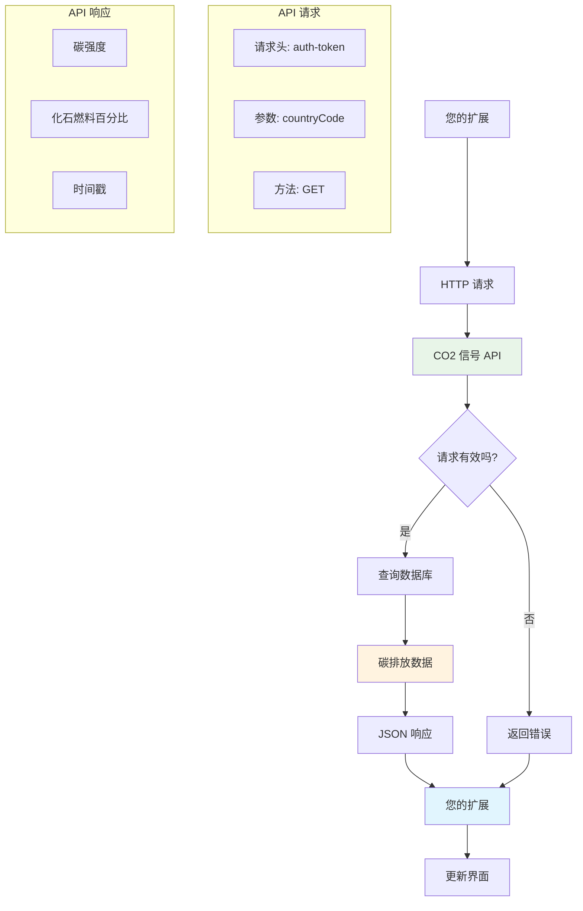
**关于 REST API 的关键概念：**
- **REST** 表示“表述性状态转移”
- **使用** 标准 HTTP 方法 （GET、POST、PUT、DELETE）来操作数据
- **返回** 通常是 JSON 这类可预测格式的数据
- **提供** 对不同请求的一致 URL 端点

✅ 我们使用的 [CO2 Signal API](https://www.co2signal.com/) 提供全球电网的实时碳强度数据。帮助用户了解用电对环境的影响！

> 💡 **理解异步 JavaScript**：[`async` 关键字](https://developer.mozilla.org/docs/Web/JavaScript/Reference/Statements/async_function) 让你的代码同时处理多个操作。当你向服务器请求数据时，不希望整个扩展卡住——那就像空中交通管制在等待一架飞机响应时停止所有操作。
>
> **主要好处：**
> - **保持** 扩展在数据加载期间依然响应
> - **允许** 在网络请求时执行其他代码
> - **提升** 代码可读性，相较传统回调模式更易懂
> - **支持** 网络异常时优雅错误处理

这里有个关于 `async` 的视频：

> 🎥 点击上图观看 async/await 相关视频。

### 🔄 **教学检查点**
**异步编程理解**：开始写 API 函数之前，请确认你理解：
- ✅ 为什么使用 `async/await`，而非阻塞整个扩展
- ✅ `try/catch` 块如何优雅处理网络错误
- ✅ 同步与异步操作的区别
- ✅ API 调用失败时会发生什么，如何应对

**现实生活的异步连接：**
- **点外卖**：你不会一直待在厨房旁边，会拿到收据后继续其他活动
- **发邮件**：发送时应用不会卡死，你可以继续写邮件
- **网页加载**：图片边加载边显示，你已经可以看文本了

**API 认证流程**：
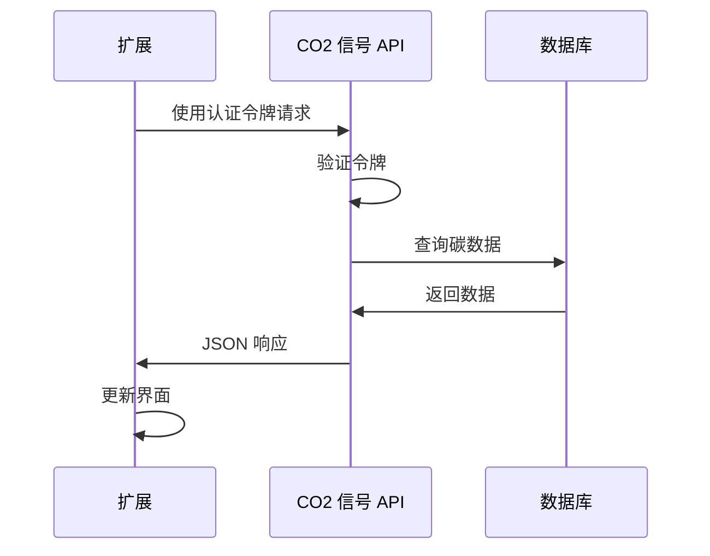
创建获取并展示碳使用数据的函数：

```javascript
// 现代的 fetch API 方法（不需要外部依赖）
async function displayCarbonUsage(apiKey, region) {
	try {
		// 从 CO2 Signal API 获取碳强度数据
		const response = await fetch('https://api.co2signal.com/v1/latest', {
			method: 'GET',
			headers: {
				'auth-token': apiKey,
				'Content-Type': 'application/json'
			},
			// 添加特定区域的查询参数
			...new URLSearchParams({ countryCode: region }) && {
				url: `https://api.co2signal.com/v1/latest?countryCode=${region}`
			}
		});

		// 检查 API 请求是否成功
		if (!response.ok) {
			throw new Error(`API request failed: ${response.status}`);
		}

		const data = await response.json();
		const carbonData = data.data;

		// 计算四舍五入的碳强度值
		const carbonIntensity = Math.round(carbonData.carbonIntensity);

		// 使用获取到的数据更新用户界面
		loading.style.display = 'none';
		form.style.display = 'none';
		myregion.textContent = region.toUpperCase();
		usage.textContent = `${carbonIntensity} grams (grams CO₂ emitted per kilowatt hour)`;
		fossilfuel.textContent = `${carbonData.fossilFuelPercentage.toFixed(2)}% (percentage of fossil fuels used to generate electricity)`;
		results.style.display = 'block';

		// 待办：calculateColor(carbonIntensity) - 在下一节课中实现

	} catch (error) {
		console.error('Error fetching carbon data:', error);

		// 显示用户友好的错误信息
		loading.style.display = 'none';
		results.style.display = 'none';
		errors.textContent = 'Sorry, we couldn\'t fetch data for that region. Please check your API key and region code.';
	}
}
```

**详细解析：**
- **使用** 现代的 `fetch()` API，替代外部库如 Axios，代码更简洁且无依赖
- **实现** 使用 `response.ok` 做适当错误检查，及早捕捉 API 失败
- **通过** `async/await` 处理异步操作，使代码流程更易读
- **使用** `auth-token` 头部进行 CO2 Signal API 认证
- **解析** JSON 响应数据并提取碳强度信息
- **更新** 多个 UI 元素，格式化显示环保数据
- **提供** 当 API 调用失败时易理解的错误提示

**示例中展示的现代 JavaScript 技巧：**
- **模板字符串** 用 `${}` 语法，更清晰字符串格式化
- **try/catch 错误处理** 让应用更健壮
- **async/await 异步模式** 优雅调用网络接口
- **对象解构** 提取 API 响应中需要的数据
- **链式方法调用** 实现多步 DOM 操作

✅ 这个函数展示了多个重要的网页开发概念——与外部服务器通信，认证处理，数据解析，界面更新，以及错误管理。这些是专业开发者日常使用的基础技能。

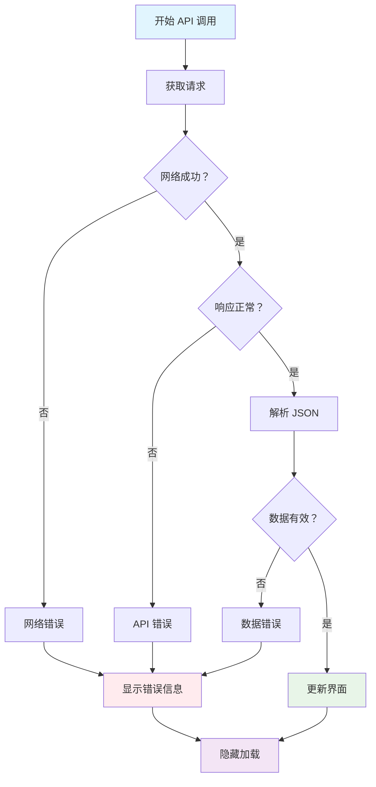
### 🔄 **教学检查点**
**完整系统理解**：确认你掌握整个流程：
- ✅ DOM 引用为什么能让 JavaScript 控控界面
- ✅ 本地存储如何实现跨浏览器会话的数据持久化
- ✅ async/await 如何让 API 调用不冻结扩展
- ✅ API 请求失败时会怎样，以及如何处理异常
- ✅ 用户体验为何包含加载状态和错误提示

🎉 **你已经完成了：**
一个浏览器扩展，它：
- **连接** 互联网，获取真实环保数据
- **持久保存** 用户设置跨会话
- **优雅处理** 错误，避免崩溃
- **提供** 流畅且专业的用户体验

通过运行 `npm run build` 并刷新浏览器扩展测试你的成果。你现在拥有一个功能齐全的碳足迹追踪器。下一课将添加动态图标功能，完善此扩展。

## GitHub Copilot Agent 挑战 🚀

使用 Agent 模式完成以下挑战：
**描述：** 通过添加错误处理改进和用户体验功能来增强浏览器扩展。本挑战将帮助你练习使用现代 JavaScript 模式进行 API 调用、本地存储和 DOM 操作。

**提示：** 创建一个增强版的 displayCarbonUsage 函数，包含：1) 失败 API 调用的指数退避重试机制，2) 调用 API 前对区域代码的输入验证，3) 带有进度指示器的加载动画，4) 在 localStorage 中缓存 API 响应及过期时间戳（缓存时长30分钟），及 5) 显示先前 API 调用历史数据的功能。同时为所有函数参数和返回类型添加适当的 TypeScript 风格 JSDoc 注释。

在[此处](https://code.visualstudio.com/blogs/2025/02/24/introducing-copilot-agent-mode)了解更多关于 agent 模式的信息。

## 🚀 挑战

通过探索大量浏览器 API，扩展你对 API 的理解，选择以下浏览器 API 之一并构建一个小示范：

- [Geolocation API](https://developer.mozilla.org/docs/Web/API/Geolocation_API) - 获取用户当前位置信息
- [Notification API](https://developer.mozilla.org/docs/Web/API/Notifications_API) - 发送桌面通知
- [HTML Drag and Drop API](https://developer.mozilla.org/docs/Web/API/HTML_Drag_and_Drop_API) - 创建交互式拖放界面
- [Web Storage API](https://developer.mozilla.org/docs/Web/API/Web_Storage_API) - 高级本地存储技巧
- [Fetch API](https://developer.mozilla.org/docs/Web/API/Fetch_API) - XMLHttpRequest 的现代替代方案

**研究问题：**
- 该 API 解决了哪些现实世界的问题？
- API 如何处理错误和边界情况？
- 使用该 API 有哪些安全考虑？
- 该 API 在不同浏览器中的支持程度如何？

研究后，确定一个 API 具备哪些特性才是开发者友好且可靠的。

## 课后测验

[课后测验](https://ff-quizzes.netlify.app/web/quiz/26)

## 复习与自学

本课你学习了 LocalStorage 和 API，这两者对专业 web 开发人员都非常有用。你能想到这两者是如何协同工作的吗？思考如何架构一个网站，该网站会存储供 API 使用的项目。

### ⚡ **你在接下来的 5 分钟内可以做什么**
- [ ] 打开开发者工具中的 Application 标签，探索任意网站的 localStorage
- [ ] 创建一个简单的 HTML 表单，测试浏览器的表单验证
- [ ] 尝试在浏览器控制台中存储和检索 localStorage 数据
- [ ] 使用 Network 标签检查提交的表单数据

### 🎯 **你在本小时内可以完成的任务**
- [ ] 完成课后测验并理解表单处理概念
- [ ] 构建一个保存用户偏好的浏览器扩展表单
- [ ] 实现带有友好错误提示的客户端表单验证
- [ ] 练习使用 chrome.storage API 持久化扩展数据
- [ ] 创建响应已保存用户设置的用户界面

### 📅 **你一周的扩展开发计划**
- [ ] 完成一个具备表单功能的完整浏览器扩展
- [ ] 掌握不同存储选项：本地、同步和会话存储
- [ ] 实现高级表单功能，如自动完成和验证
- [ ] 添加用户数据的导入/导出功能
- [ ] 跨不同浏览器彻底测试你的扩展
- [ ] 优化扩展的用户体验和错误处理机制

### 🌟 **你一个月的 Web API 掌握计划**
- [ ] 使用多种浏览器存储 API 构建复杂应用
- [ ] 学习离线优先开发模式
- [ ] 参与开源项目，推动数据持久化
- [ ] 掌握隐私保护开发和 GDPR 合规
- [ ] 创建用于表单处理和数据管理的可重用库
- [ ] 分享关于 Web API 和扩展开发的知识

## 🎯 你的扩展开发大师时间线

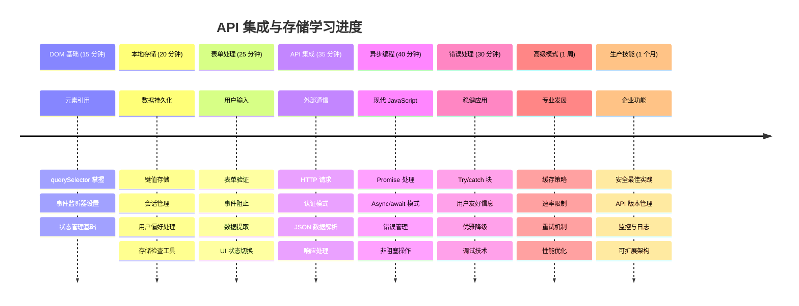
### 🛠️ 你的全栈开发工具包总结

完成本课后，你已经具备：
- **DOM 精通**：精确定位和操作元素
- **存储专长**：使用 localStorage 进行持久化数据管理
- **API 集成**：实时数据获取和认证
- **异步编程**：使用现代 JavaScript 实现非阻塞操作
- **错误处理**：构建稳健且能优雅处理失败的应用
- **用户体验**：加载状态、验证及流畅交互
- **现代模式**：fetch API、async/await 和 ES6+ 特性

**获得的专业技能**：你已实现以下模式：
- **Web 应用**：单页应用并连接外部数据源
- **移动开发**：具备离线能力的 API 驱动应用
- **桌面软件**：带持久存储的 Electron 应用
- **企业系统**：认证、缓存和错误处理
- **现代框架**：React/Vue/Angular 数据管理模式

**下一个阶段**：你已准备好探索高级主题，如缓存策略、实时 WebSocket 连接或复杂状态管理！

## 任务

[采用一个 API](assignment.md)

**免责声明**：
本文件由人工智能翻译服务[Co-op Translator](https://github.com/Azure/co-op-translator)翻译完成。虽然我们力求准确，但请注意自动翻译可能包含错误或不准确之处。原文文件的母语版本应被视为权威来源。对于重要信息，建议采用专业人工翻译。对于因使用本翻译而产生的任何误解或误释，我们概不负责。

# 采用一个 API

## 概述

API 开启了无限的创意网页开发可能性！在本次作业中，你将选择一个外部 API，并构建一个浏览器扩展，以解决真实问题或为用户提供有价值的功能。

## 说明

### 第一步：选择你的 API
从此精选的 [免费公共 API 列表](https://github.com/public-apis/public-apis) 中选择一个 API。考虑以下类别：

**适合初学者的热门选项：**
- **娱乐**：用于随机狗狗图片的 [Dog CEO API](https://dog.ceo/dog-api/)
- **天气**：用于当前天气数据的 [OpenWeatherMap](https://openweathermap.org/api)
- **名言**：用于励志名言的 [Quotable API](https://quotable.io/)
- **新闻**：用于当前头条的 [NewsAPI](https://newsapi.org/)
- **趣味知识**：用于有趣数字知识的 [Numbers API](http://numbersapi.com/)

### 第二步：规划你的扩展
在编码之前回答以下规划问题：
- 你的扩展解决了什么问题？
- 目标用户是谁？
- 你将存储哪些数据在本地存储中？
- 如何处理 API 失败或速率限制？

### 第三步：构建你的扩展
你的扩展应包括：

**必备功能：**
- 用于任何必需 API 参数的表单输入
- 带有适当错误处理的 API 集成
- 本地存储用户偏好或 API 密钥
- 清晰且响应式的用户界面
- 加载状态和用户反馈

**代码要求：**
- 使用现代 JavaScript (ES6+) 特性
- 使用 async/await 进行 API 调用
- 使用 try/catch 块进行适当错误处理
- 添加有意义的注释解释代码
- 遵循一致的代码格式

### 第四步：测试和完善
- 使用各种输入测试你的扩展
- 处理边缘情况（无网络、无效 API 响应）
- 确保扩展在浏览器重启后仍然可用
- 添加用户友好的错误信息

## 额外挑战

提升你的扩展至更高层次：
- 增加多个 API 端点以实现更丰富的功能
- 实现数据缓存以减少 API 调用
- 创建常用操作的键盘快捷键
- 添加数据导出/导入功能
- 实现用户定制选项

## 提交要求

1. **可正常工作的浏览器扩展**，成功集成你选定的 API
2. **README 文件**，说明：
   - 你选择了哪个 API 以及原因
   - 如何安装和使用你的扩展
   - 任何 API 密钥或设置需求
   - 扩展运行截图
3. **干净、注释完善的代码**，符合现代 JavaScript 规范

## 评分标准

| 评价标准 | 优秀 (90-100%) | 熟练 (80-89%) | 进展中 (70-79%) | 入门 (60-69%) |
|----------|----------------|---------------|-----------------|---------------|
| **API 集成** | 完美的 API 集成，包含全面错误处理和边缘情况管理 | 成功集成 API 并有基本错误处理 | API 可用但错误处理有限 | API 集成有严重问题 |
| **代码质量** | 干净、注释充分的现代 JavaScript，符合最佳实践 | 代码结构良好，注释充足 | 代码能运行但组织需改进 | 代码质量差，注释少 |
| **用户体验** | 界面精致，加载状态和用户反馈优秀 | 界面良好，提供基本用户反馈 | 基本界面，功能正常 | 用户体验差，界面混乱 |
| **本地存储** | 高级使用本地存储，含数据验证和管理 | 正确实现本地存储关键功能 | 基础本地存储实现 | 本地存储使用少或不当 |
| **文档** | 完整 README，含设置说明和截图 | 良好文档，涵盖大部分要求 | 基础文档，缺少细节 | 文档缺失或不足 |

## 入门提示

1. **从简单开始**：选择不需复杂认证的 API
2. **阅读文档**：彻底了解所选 API 的端点和响应
3. **规划界面**：先手绘扩展界面再编码
4. **频繁测试**：分步构建，完成每一功能即测试
5. **处理错误**：始终假设 API 调用可能失败并做好应对

## 资源

- [浏览器扩展文档](https://developer.mozilla.org/docs/Mozilla/Add-ons/WebExtensions)
- [Fetch API 指南](https://developer.mozilla.org/docs/Web/API/Fetch_API/Using_Fetch)
- [本地存储教程](https://developer.mozilla.org/docs/Web/API/Window/localStorage)
- [JSON 解析与处理](https://developer.mozilla.org/docs/Web/JavaScript/Reference/Global_Objects/JSON)

祝你构建出有用且富有创意的作品！🚀

**免责声明**：
本文件由人工智能翻译服务[Co-op Translator](https://github.com/Azure/co-op-translator)翻译。尽管我们努力确保准确性，但请注意，自动翻译可能存在错误或不准确之处。原始语言的文档应被视为权威来源。对于重要信息，建议使用专业人工翻译。因使用此翻译而产生的任何误解或误释，我们概不负责。

# 浏览器扩展项目 第3部分：了解后台任务与性能


有没有想过为什么有些浏览器扩展感觉响应迅速而灵敏，而另一些则显得迟缓？秘诀就在幕后。在用户点击扩展界面时，后台有一系列进程静静管理数据获取、图标更新和系统资源。

这是浏览器扩展系列的最后一课，我们将让你的碳足迹追踪器流畅运行。你将添加动态图标更新，并学习如何在性能问题出现前发现它们。这就像调校赛车——小优化能大幅提升整体运行表现。

完成后，你将拥有一个打磨完善的扩展，并理解区分优秀及卓越 web 应用的性能原则。让我们探索浏览器优化的世界吧。

## 课前测验

[课前测验](https://ff-quizzes.netlify.app/web/quiz/27)

### 介绍

在之前的课程中，你已搭建了表单，连接 API，并处理异步数据获取。你的扩展已初具雏形。

现在我们需要添加最后的润色 —— 比如让扩展图标根据碳数据变换颜色。这让我想起 NASA 优化阿波罗飞船每个系统时的状态。它们必须最大化利用每个周期和内存，因为性能关乎生命。虽然我们的浏览器扩展没那么关键，但同样原则适用——高效代码带来更佳用户体验。

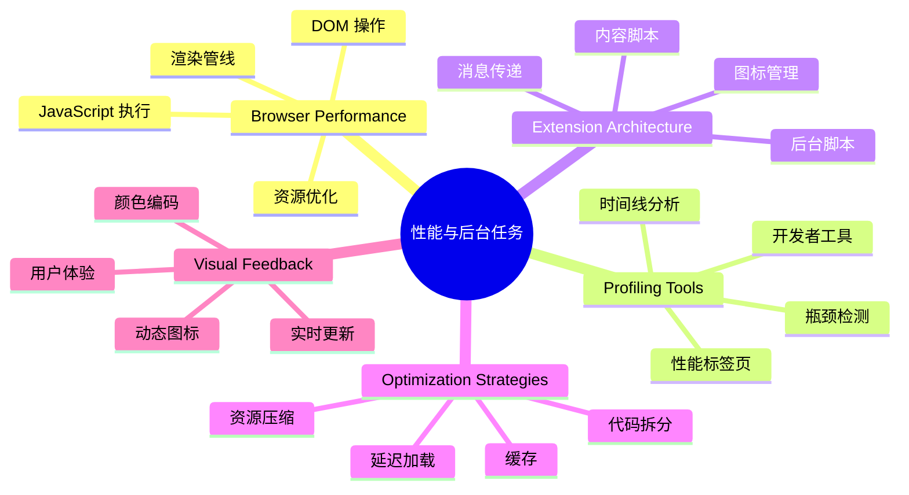
## Web 性能基础

当代码高效运行时，人们真的能*感受到*区别。你知道页面瞬间加载或者动画流畅时的那种感觉吗？这就是良好性能的体现。

性能不仅是速度，而是打造自然流畅而非笨拙挫败的网页体验。在计算机早期，Grace Hopper 著名地将一根约一英尺长的细线放在桌上，演示光在十亿分之一秒内的传播距离，用以说明每一微秒在计算中的重要性。让我们探索帮助你找出性能瓶颈的侦查工具吧。

> “网站性能关乎两个方面：页面加载的速度，以及代码运行的速度。” —— [Zack Grossbart](https://www.smashingmagazine.com/2012/06/javascript-profiling-chrome-developer-tools/)

让网站在各种设备、各种用户、各种情况下极速运行的话题自然非常庞杂。以下是你构建普通网页项目或浏览器扩展时需牢记的要点。

优化网站的第一步是理解底层的实际运作。幸运的是，浏览器内置了强大的侦查工具。

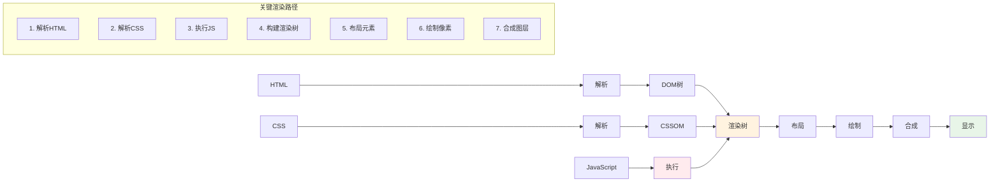
在 Edge 中打开开发者工具，点击右上角的三点菜单，选择 更多工具 > 开发者工具。或者使用快捷键：Windows 上为 `Ctrl` + `Shift` + `I`，Mac 上为 `Option` + `Command` + `I`。进入后点击 Performance（性能）标签页 —— 这里是你的调查现场。

**这是你的性能侦查工具箱：**
- **打开** 开发者工具（开发者必备！）
- **切换** 到 Performance 标签页，想象它是你的网页健康追踪器
- **点击** 录制按钮，然后观察页面动作
- **分析** 结果以发现性能瓶颈

试试吧。打开一个网站（例如 Microsoft.com），点击“录制”然后刷新页面，查看性能分析器捕捉的一切。当停止录制，你会看到浏览器如何“脚本执行”（scripts）、“渲染”（renders）和“绘制”（paints）的详细分解。这让我想起火箭发射时指挥中心监控所有系统——你获取实时且详细的操作数据。

图示：Edge profiler

✅ 若想深入了解，请查阅 [微软文档](https://docs.microsoft.com/microsoft-edge/devtools-guide/performance/?WT.mc_id=academic-77807-sagibbon)

> 专业提示：测试前请清理浏览器缓存，查看首次访问者的页面性能——通常与重复访问完全不同！

选取时间线上的部分，放大查看加载时发生的事件。

通过选取时间线片段，查看摘要面板，获得页面性能快照：

图示：Edge profiler snapshot

查看事件日志面板是否有事件耗时超过15毫秒：

图示：Edge event log

✅ 熟悉你的分析器！在本站打开开发者工具，看看是否存在瓶颈。加载最慢和最快的资源分别是什么？

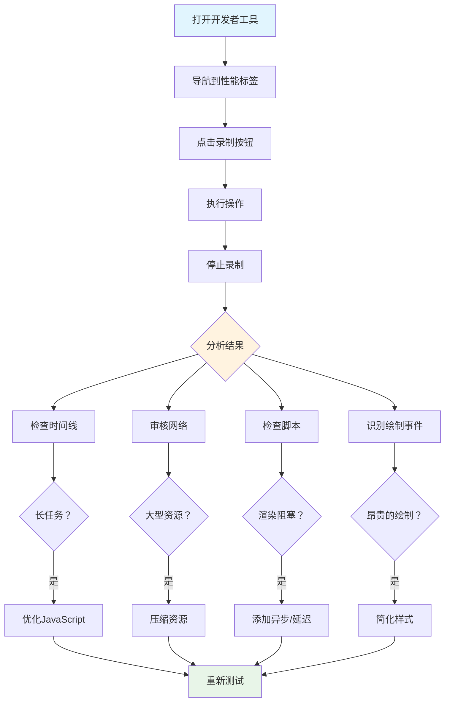
## 分析时要注意什么

运行分析器只是第一步——真正的技能是理解这些彩色图表告诉你的信息。不用怕，你会学会解读它们。经验丰富的开发者已能提前发现警示信号，防止问题加剧。

让我们聊聊常见的嫌疑犯——那种经常潜入网页项目的性能杀手。正如玛丽·居里在实验室细致监测辐射水平，我们也须警惕表明潜在麻烦的模式。及早发现会省去你和用户大量麻烦。

**资源大小**：随着时间推移，网站变得“越来越重”，大部分增长来自图片。就像我们在数码行李箱里塞了越来越多东西。

✅ 请浏览 [Internet Archive](https://httparchive.org/reports/page-weight) 看看页面大小的历史增长——颇有启发。

**保持资源优化的小窍门：**
- **压缩** 图片！现代格式如 WebP 会大幅减小文件体积
- **根据设备** 提供合适尺寸的图片——不必给手机发送庞大的桌面图片
- **压缩** CSS 和 JavaScript——每个字节都重要
- **使用** 延迟加载，让图片只有在用户滚动到时才下载

**DOM 遍历**：浏览器基于你写的代码构建文档对象模型（DOM），为了良好的页面性能，应保持标签最少，仅使用和样式化必须的元素。过多的 CSS 也能优化；例如，只在某页使用的样式无需包含在主样式表中。

**DOM 优化关键策略：**
- **减少** HTML 元素和嵌套层级数量
- **移除** 未使用的 CSS 规则并高效合并样式表
- **组织** CSS 只加载每页所需样式
- **语义化** HTML 结构以协助浏览器解析

**JavaScript**：每位 JS 开发者需警惕“阻塞渲染”的脚本——须在 DOM 遍历与绘制前加载完毕。可以考虑用 `defer` 属性延迟内联脚本加载（如 Terrarium 模块所用）。

**现代 JavaScript 优化技巧：**
- **使用** `defer` 属性让脚本在 DOM 解析后加载
- **实现** 代码拆分，只加载必要的 JS
- **应用** 延迟加载非关键功能
- **尽量减少** 依赖重量级库与框架

✅ 可通过 [Site Speed Test 网站](https://www.webpagetest.org/) 试测一些站点，了解常规的性能检测点。

### 🔄 **教学回顾**
**性能理解**：在构建扩展功能前，确保你能：
- ✅ 解释从HTML到像素的关键渲染路径
- ✅ 识别网页应用常见性能瓶颈
- ✅ 使用浏览器开发工具分析页面性能
- ✅ 理解资源大小和 DOM 复杂度如何影响速度

**快速自测**：遇到阻塞渲染的 JavaScript 会发生什么？
*答：浏览器必须先下载并执行脚本，才能继续解析 HTML 并渲染页面。*

**现实世界性能影响**：
- **100毫秒延迟**：用户能感知到缓慢
- **1秒延迟**：用户开始失去注意力
- **3秒以上**：40% 用户离开页面
- **移动网络**：性能更为重要

了解浏览器如何渲染你发送的资源后，来看完成扩展还需做的几件事：

### 创建颜色计算函数

现在我们创建一个函数，将数值数据转成有意义的颜色。就像交通灯系统——绿色表示清洁能源，红色代表高碳强度。

该函数将以 API 返回的 CO2 数据为基础，确定最能反映环境影响的颜色。这类似科学家使用色彩编码的热力图，可视化复杂数据模式——从海洋温度到恒星形成。把这个函数加到 `/src/index.js`，紧跟前面声明的 `const` 变量之后：

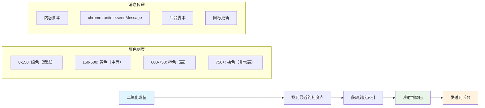
```javascript
function calculateColor(value) {
	// 定义二氧化碳强度尺度（克/千瓦时）
	const co2Scale = [0, 150, 600, 750, 800];
	// 对应颜色从绿色（清洁）到深棕色（高碳）
	const colors = ['#2AA364', '#F5EB4D', '#9E4229', '#381D02', '#381D02'];

	// 找到与输入值最接近的尺度值
	const closestNum = co2Scale.sort((a, b) => {
		return Math.abs(a - value) - Math.abs(b - value);
	})[0];

	console.log(`${value} is closest to ${closestNum}`);

	// 查找颜色映射的索引
	const num = (element) => element > closestNum;
	const scaleIndex = co2Scale.findIndex(num);

	const closestColor = colors[scaleIndex];
	console.log(scaleIndex, closestColor);

	// 向后台脚本发送颜色更新消息
	chrome.runtime.sendMessage({ action: 'updateIcon', value: { color: closestColor } });
}
```

**解析这巧妙函数：**
- **初始化了** 两个数组——一个存 CO2 级别，另一个存颜色（绿代表清洁，棕色代表污染）
- **通过数组排序** 找到最接近实际 CO2 值的匹配
- **用 findIndex() 方法** 获取对应的颜色索引
- **向 Chrome 后台脚本发送** 选定颜色的消息
- **借助模板字符串** （反引号）简化字符串格式化
- **用 const** 保持代码整洁有序

`chrome.runtime` [API](https://developer.chrome.com/extensions/runtime) 就像扩展的神经系统——负责幕后通信和任务处理：

> “使用 chrome.runtime API 可以访问后台页面，获取清单详情，监听并响应应用或扩展生命周期中的事件。此 API 还可将 URL 相对路径转换为完整 URL。”

**Chrome Runtime API 的便捷之处：**
- **让** 扩展各部分相互通信
- **处理** 后台工作，避免冻结用户界面
- **管理** 扩展生命周期事件
- **简化** 脚本间消息传递

✅ 如果你在 Edge 浏览器上开发此扩展，可能会惊讶于使用的是 chrome API。新版 Edge 基于 Chromium 引擎，因此能利用这些工具。

```mermaid
architecture-beta
    group browser(logos:chrome)[浏览器]

    service popup(logos:html5)[弹出界面] in browser
    service content(logos:javascript)[内容脚本] in browser
    service background(database)[后台脚本] in browser
    service api(logos:api)[外部API] in browser

    popup:R -- L:content
    content:R -- L:background
    background:T -- B:api
    content:T -- B:api

    junction junctionCenter in browser
    popup:R -- L:junctionCenter
    junctionCenter:R -- L:background
```
> **专业提示**：要分析浏览器扩展性能，从扩展自身启动开发者工具。因为它是独立的浏览器实例，可查看扩展特定性能指标。

### 设置默认图标颜色

在开始获取真实数据前，给扩展一个初始状态。没人喜欢看空白或损坏的图标。我们先用绿色，保证安装即可见扩展正常工作。

在你的 `init()` 函数里，配置默认的绿色图标：

```javascript
chrome.runtime.sendMessage({
	action: 'updateIcon',
	value: {
		color: 'green',
	},
});
```

**此初始化实现了：**
- **设为** 中性绿色作为默认状态
- **加载时** 立即提供视觉反馈
- **建立** 与后台脚本的通信模式
- **确保** 数据加载前用户见到的是正常的扩展图标

### 调用函数，执行更新

现在将各部分连线，等到有最新 CO2 数据时，图标能自动变色。就像装置电路接通，组件齐心协力。

在拿到 API 返回的 CO2 数据后，加上这条调用语句：

```javascript
// 从API获取CO2数据后
// 让CO2 = data.data[0].intensity.actual;
calculateColor(CO2);
```

**该整合实现了：**
- **连接** API 数据流和视觉指示器系统
- **当新数据到来时** 触发图标自动更新
- **保证** 依据当前碳强度实时反馈视觉效果
- **保持** 数据获取与显示逻辑分离

最后，在 `/dist/background.js` 里添加监听这些后台操作的监听器：

```javascript
// 监听来自内容脚本的消息
chrome.runtime.onMessage.addListener(function (msg, sender, sendResponse) {
	if (msg.action === 'updateIcon') {
		chrome.action.setIcon({ imageData: drawIcon(msg.value) });
	}
});

// 使用 Canvas API 绘制动态图标
// 借鉴自 energy lollipop 扩展 - 很棒的功能！
function drawIcon(value) {
	// 创建一个离屏画布以获得更好的性能
	const canvas = new OffscreenCanvas(200, 200);
	const context = canvas.getContext('2d');

	// 绘制一个代表碳强度的彩色圆圈
	context.beginPath();
	context.fillStyle = value.color;
	context.arc(100, 100, 50, 0, 2 * Math.PI);
	context.fill();

	// 返回浏览器图标的图像数据
	return context.getImageData(50, 50, 100, 100);
}
```

**这个后台脚本功能是：**
- **监听** 来自主脚本的消息（像前台接听电话）
- **处理** “updateIcon” 请求，更新工具栏图标
- **用 Canvas API** 动态创建图标
- **绘制** 一个位彩色圆，展示当前碳强度
- **更新** 浏览器工具栏图标
- **利用 OffscreenCanvas** 保持流畅性能（无界面阻塞）

✅ 你将在 太空游戏课程 中学到更多 Canvas API 知识。

```mermaid
sequenceDiagram
    participant CS as 内容脚本
    participant BG as 后台脚本
    participant Canvas as 离屏画布
    participant Browser as 浏览器图标

    CS->>BG: sendMessage({action: 'updateIcon', color})
    BG->>Canvas: new OffscreenCanvas(200, 200)
    Canvas->>Canvas: getContext('2d')
    Canvas->>Canvas: beginPath() + fillStyle + arc()
    Canvas->>Canvas: fill() + getImageData()
    Canvas->>BG: 返回图像数据
    BG->>Browser: chrome.action.setIcon(imageData)
    Browser->>Browser: 更新工具栏图标
```
### 🔄 **教学回顾**
**完整扩展理解**：确认你已掌握整个系统：
- ✅ 不同扩展脚本间怎样进行消息传递？
- ✅ 为什么为性能考虑使用 OffscreenCanvas 而不是普通 Canvas？
- ✅ Chrome Runtime API 在扩展架构中扮演什么角色？
- ✅ 颜色计算算法如何将数据映射到视觉反馈？

**性能考虑**：您的扩展现在展示了：
- **高效消息传递**：脚本上下文间清晰通信
- **优化渲染**：OffscreenCanvas 防止界面阻塞
- **实时更新**：基于实时数据的动态图标变化
- **内存管理**：适当的清理和资源处理

**是时候测试您的扩展了：**
- **通过** `npm run build` 构建所有内容
- **重新加载** 浏览器中的扩展（别忘了这一步）
- **打开** 您的扩展，观察图标的颜色变化
- **检查** 它如何响应来自全球的实时碳数据

现在您可以一目了然地知道，洗这批衣服是否合适，或者是否应该等待更清洁的能源。您刚刚构建了一个真正有用的东西，并在过程中学习了浏览器性能。

## GitHub Copilot Agent 挑战 🚀

使用 Agent 模式完成以下挑战：

**描述：** 通过添加跟踪并显示扩展不同组件加载时间的功能，增强浏览器扩展的性能监控能力。

**提示：** 创建一个性能监控系统，用于测量和记录从 API 获取 CO2 数据、计算颜色和更新图标所需的时间。添加一个名为 `performanceTracker` 的函数，使用 Performance API 测量这些操作，并在浏览器控制台以时间戳和持续时间指标的形式显示结果。

了解更多关于[agent 模式](https://code.visualstudio.com/blogs/2025/02/24/introducing-copilot-agent-mode)的信息。

## 🚀 挑战

这是一个有趣的侦探任务：挑选一些存在多年的开源网站（如 Wikipedia、GitHub 或 Stack Overflow），深入研究它们的提交历史。你能发现它们在哪里做出了性能改进吗？反复出现了哪些问题？

**你的调查方法：**
- **搜索** 包含“优化”、“性能”或“更快”等关键词的提交信息
- **观察** 有无模式 —— 它们是否持续修复相同类型的问题？
- **识别** 影响网站性能的常见元凶
- **分享** 你的发现 —— 让其他开发者从真实案例中学习

## 课后测验

[课后测验](https://ff-quizzes.netlify.app/web/quiz/28)

## 复习与自学

考虑订阅一个[性能通讯](https://perf.email/)

通过浏览器开发工具中的性能标签页，调查浏览器衡量网页性能的一些方法。你发现了哪些主要差异？

### ⚡ **接下来 5 分钟你可以做什么**
- [ ] 打开浏览器任务管理器（Chrome 中按 Shift+Esc）查看扩展资源使用情况
- [ ] 使用 DevTools 的性能标签页录制并分析网页性能
- [ ] 检查浏览器的扩展页，查看哪些扩展影响启动时间
- [ ] 尝试暂时禁用扩展，观察性能变化

### 🎯 **本小时你可以完成什么**
- [ ] 完成课后测验，理解性能概念
- [ ] 为你的浏览器扩展实现一个后台脚本
- [ ] 学习使用 browser.alarms 进行高效后台任务
- [ ] 练习内容脚本与后台脚本之间的消息传递
- [ ] 测量并优化扩展的资源使用

### 📅 **你的为期一周的性能之旅**
- [ ] 完成一个具有后台功能的高性能浏览器扩展
- [ ] 精通 service workers 和现代扩展架构
- [ ] 实现高效的数据同步与缓存策略
- [ ] 学习扩展性能的高级调试技术
- [ ] 优化扩展的功能与资源效率
- [ ] 创建全面的扩展性能测试方案

### 🌟 **你为期一个月的优化精通**
- [ ] 构建企业级高性能浏览器扩展
- [ ] 学习 Web Workers、Service Workers 和现代网页性能
- [ ] 参与性能优化相关的开源项目
- [ ] 掌握浏览器内部原理和高级调试技术
- [ ] 创建性能监控工具和最佳实践指南
- [ ] 成为帮助优化网页应用的性能专家

## 🎯 你的浏览器扩展精通时间线

```mermaid
timeline
    title 完整扩展开发进度

    section 性能基础（20分钟）
        浏览器分析: DevTools 掌握
                         : 时间线分析
                         : 瓶颈识别
                         : 关键渲染路径

    section 后台任务（25分钟）
        扩展架构: 消息传递
                              : 后台脚本
                              : 运行时API使用
                              : 跨上下文通信

    section 视觉反馈（30分钟）
        动态UI: 颜色计算算法
                  : Canvas API集成
                  : 图标生成
                  : 实时更新

    section 性能优化（35分钟）
        高效代码: 异步操作
                      : 内存管理
                      : 资源清理
                      : 性能监控

    section 生产准备（45分钟）
        打磨与测试: 跨浏览器兼容性
                        : 错误处理
                        : 用户体验
                        : 性能验证

    section 高级功能（1周）
        扩展生态系统: Chrome 网上应用店
                           : 用户反馈
                           : 分析集成
                           : 更新管理

    section 职业发展（2周）
        企业扩展: 团队协作
                             : 代码审查
                             : CI/CD 流水线
                             : 安全审计

    section 专家精通（1个月）
        平台专长: 高级 Chrome API
                          : 性能优化
                          : 架构模式
                          : 开源贡献
```
### 🛠️ 你的完整扩展开发工具包

完成本三部曲后，你已经掌握：
- **浏览器架构**：深入理解扩展如何与浏览器系统集成
- **性能分析**：使用开发者工具识别并修复瓶颈
- **异步编程**：现代 JavaScript 模式实现响应式、非阻塞操作
- **API 集成**：带认证和错误处理的外部数据获取
- **视觉设计**：动态 UI 更新和基于 Canvas 的图形生成
- **消息传递**：扩展架构中脚本间通信
- **用户体验**：加载状态、错误处理与直观交互
- **生产技能**：面向真实场景的测试、调试与优化

**真实应用场景**：你的扩展开发技能直接应用于：
- **渐进式网页应用**：相似的架构与性能模式
- **Electron 桌面应用**：使用网页技术的跨平台应用
- **移动混合应用**：基于 Cordova/PhoneGap 的网页 API 应用
- **企业网页应用**：复杂的仪表盘和生产力工具
- **Chrome DevTools 扩展**：高级开发者工具与调试
- **网页 API 集成**：与外部服务通信的任何应用

**职业影响力**：你现在可以：
- **构建** 从概念到部署的生产级浏览器扩展
- **优化** 使用行业标准分析工具提升网页性能
- **设计** 可扩展且关注点分离良好的系统架构
- **调试** 复杂的异步操作和跨上下文通信
- **贡献** 于开源扩展项目和浏览器标准

**升级机会**：
- **Chrome 网上应用店开发者**：发布面向数百万用户的扩展
- **网页性能工程师**：专注优化和用户体验
- **浏览器平台开发者**：参与浏览器引擎开发
- **扩展框架创建者**：构建辅助开发者的工具
- **开发者关系**：通过教学和内容创作分享知识

🌟 **成就解锁**：你已经构建了一个完整、功能齐全的浏览器扩展，展示了专业开发实践和现代网页标准！

## 作业

[分析一个网站的性能](assignment.md)

**免责声明**：
本文件由人工智能翻译服务[Co-op Translator](https://github.com/Azure/co-op-translator)翻译而成。尽管我们努力确保翻译的准确性，但请注意，自动翻译可能存在错误或不准确之处。原始语言的文件应视为权威来源。对于重要信息，建议采用专业人工翻译。对于因使用本翻译而产生的任何误解或误释，我们不承担任何责任。

# 分析网站性能

## 任务概述

性能分析是现代网页开发者的一项关键技能。在本任务中，你将使用浏览器内置工具和第三方服务，对一个真实网站进行全面的性能审计，识别性能瓶颈并提出优化策略。

你的任务是提交一份详细的性能报告，展示你对网页性能原理的理解以及有效使用专业分析工具的能力。

## 任务说明

**选择一个网站**进行分析——可从以下选项中选择：
- 你经常使用的热门网站（新闻站点、社交媒体、电商）
- 开源项目网站（GitHub Pages、文档站点）
- 本地商家网站或个人作品集
- 你自己的项目或以往课程作业

**多工具分析**，至少使用三种不同的方法：
- **浏览器开发者工具**——使用 Chrome/Edge 的 Performance 选项卡进行详细性能分析
- **在线审计工具**——尝试 Lighthouse、GTmetrix 或 WebPageTest
- **网络分析**——检查资源加载、文件大小和请求模式

**在报告中详细记录发现内容**，应包含：

### 性能指标分析
- 多工具、多角度的**加载时间测量**
- **核心网页指标**得分（LCP、FID、CLS）及其影响
- **资源细分**，显示哪些资源对加载时间贡献最大
- **网络瀑布图分析**，识别阻塞资源

### 问题识别
- **具体性能瓶颈**，并附带数据支持
- **根本原因分析**，解释问题产生原因
- **用户影响评估**，描述问题如何影响真实用户体验
- **优先级排序**，基于严重程度和修复难度排列问题优先级

### 优化建议
- **具体可行的改进措施**及预期效果
- **每项改进的实施方案**
- 可采用的**现代最佳实践**（懒加载、压缩等）
- **持续性能监控**的工具和技术

## 研究要求

**不要仅依靠浏览器工具**，扩展分析使用：

**第三方审计服务：**
- [Google Lighthouse](https://developers.google.com/web/tools/lighthouse) — 综合审计
- [GTmetrix](https://gtmetrix.com/) — 性能和优化洞察
- [WebPageTest](https://www.webpagetest.org/) — 真实环境测试
- [Pingdom](https://tools.pingdom.com/) — 全球性能监控

**专业分析工具：**
- [Bundle Analyzer](https://bundlephobia.com/) — JavaScript 包大小分析
- [Image optimization tools](https://squoosh.app/) — 资源优化机会
- [Security headers analysis](https://securityheaders.com/) — 安全性能影响

## 成果格式

制作一份专业报告（2-3 页），包含：

1. **执行摘要** — 关键发现和建议概述
2. **方法论** — 使用的工具和测试方法
3. **当前性能评估** — 基线指标和测量结果
4. **识别的问题** — 详细的问题分析和数据支持
5. **建议方案** — 优先级改进策略
6. **实施路线图** — 逐步的优化计划

**包含视觉证据：**
- 性能工具及指标的截图
- 显示性能数据的图表
- 可能的前后对比
- 网络瀑布图和资源细分图

## 评分标准

| 标准 | 优秀 (90-100%) | 及格 (70-89%) | 有待改进 (50-69%) |
| -------- | ------------------- | ----------------- | -------------------------- |
| **分析深度** | 使用4+工具的全面分析，包含详细指标、根因分析和用户影响评估 | 使用3个工具，有清晰指标和基本问题识别 | 使用2个工具，分析浅显，问题识别有限 |
| **工具多样性** | 使用浏览器工具+3个以上第三方服务，包含比较分析和洞察 | 使用浏览器工具+2个第三方服务，有一定比较分析 | 使用浏览器工具+1个第三方服务，比较有限 |
| **问题识别** | 识别5个以上具体性能问题，包含详细根因分析和量化影响 | 识别3-4个性能问题，具备良好分析及部分影响测量 | 识别1-2个性能问题，分析基础 |
| **建议方案** | 提供具体、可行建议，附实施细节、预期效果及现代最佳实践 | 提供良好建议，含部分实施指导和预期成果 | 提供基础建议，实施细节有限 |
| **专业呈现** | 报告结构清晰，层次分明，附视觉证据和执行摘要，格式专业 | 报告组织良好，有部分视觉证据和清晰结构 | 组织基础，视觉证据有限 |

## 学习成果

完成本任务后，你将能：
- **应用**专业性能分析工具和方法
- **识别**基于数据分析的性能瓶颈
- **分析**代码质量与用户体验之间的关系
- **推荐**具体且可实施的优化方案
- **以专业格式**传达技术发现

该任务加深了你对课程中性能概念的理解，同时培养了你在网页开发职业生涯中将持续用到的实用技能。

**免责声明**：
本文件使用 AI 翻译服务 [Co-op Translator](https://github.com/Azure/co-op-translator) 进行翻译。虽然我们致力于保证准确性，但请注意自动翻译可能存在错误或不准确之处。原始文件的原语言版本应被视为权威来源。对于关键信息，建议采用专业人工翻译。对于因使用本翻译导致的任何误解或误读，我们不承担任何责任。
