# Web-Dev-For-Beginners：太空游戏项目

# 构建一个太空游戏 第一部分: 介绍


图示：太空游戏动画显示游戏玩法

就像美国宇航局的任务控制中心在发射过程中协调多个系统一样，我们将构建一个太空游戏，展示程序的不同部分如何无缝协作。在创建一个你可以实际玩的项目时，你将学习适用于任何软件项目的基本编程概念。

我们将探索组织代码的两种基本方法：继承和组合。这不仅仅是学术概念——它们是驱动从视频游戏到银行系统所有内容的相同模式。我们还将实现一个名为发布/订阅（pub/sub）的通信系统，它类似于航天器中使用的通信网络，允许不同组件共享信息而不产生依赖关系。

通过本系列课程的结束，你将理解如何构建可扩展和演进的应用程序——无论你是开发游戏、Web应用程序，还是任何其他软件系统。

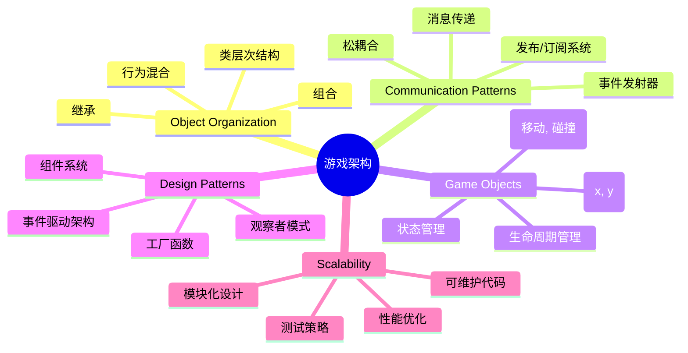
## 课前测验

[课前测验](https://ff-quizzes.netlify.app/web/quiz/29)

## 游戏开发中的继承与组合

随着项目复杂度增大，代码组织变得尤为关键。最初简单的脚本如果没有良好的结构，维护会变得困难——就像阿波罗任务需要对上千个组件进行细致协作一样。

我们将探索两种组织代码的基本方式：继承和组合。每种都有独特的优点，理解它们有助于你在不同情况下选择合适的方式。我们将通过太空游戏进行演示，其中英雄、敌人、道具以及其他对象必须高效互动。

✅ 一本最著名的编程书籍就讲述了[设计模式](https://en.wikipedia.org/wiki/Design_Patterns)。

在任何游戏中，你都有 `游戏对象`——填充游戏世界的交互元素。英雄、敌人、道具和视觉特效都是游戏对象。它们都存在于特定屏幕坐标，用 `x` 和 `y` 值表示，类似于在坐标平面上绘点。

尽管外观不同，这些对象通常共享基本行为：

- **它们存在于某处** —— 每个对象都有 x 和 y 坐标，游戏才能知道在哪里绘制它
- **许多对象可以移动** —— 英雄奔跑，敌人追逐，子弹飞过屏幕
- **它们有生命周期** —— 有些永久存在，另一些（比如爆炸）短暂出现后消失
- **它们对事件做出反应** —— 碰撞发生时，道具被拾取，血条更新

✅ 想想像吃豆人这样的游戏。你能在游戏中识别上面提到的四种对象类型吗？

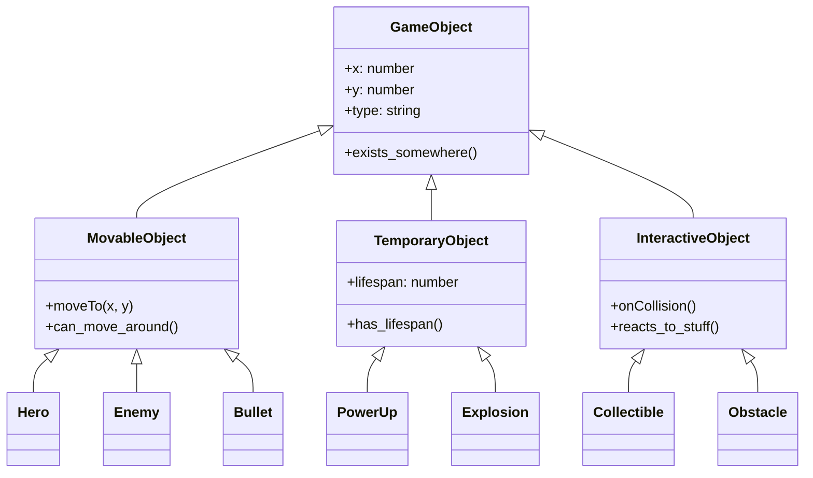
### 通过代码表达行为

现在你理解了游戏对象共有的行为，让我们探索如何用 JavaScript 实现这些行为。你可以通过添加到类或单个对象的方法来表达对象行为，且有多种实现方式。

**基于类的方法**

类和继承为组织游戏对象提供了一种结构化的方式。就像卡尔·林奈所构建的生物分类系统一样，你从一个含有共有属性的基础类开始，然后创建派生类继承这些基本功能并添加特定能力。

✅ 继承是一个重要概念，更多内容请见[MDN关于继承的文章](https://developer.mozilla.org/docs/Web/JavaScript/Inheritance_and_the_prototype_chain)。

下面是如何使用类和继承实现游戏对象的示例：

```javascript
// 第一步：创建基础的 GameObject 类
class GameObject {
  constructor(x, y, type) {
    this.x = x;
    this.y = y;
    this.type = type;
  }
}
```

**我们逐步拆解理解：**
- 我们创建了一个基础模板，所有游戏对象都能使用它
- 构造函数保存对象的位置（`x`, `y`）和类型
- 这成为所有游戏对象构建的基础

```javascript
// 第2步：通过继承添加移动功能
class Movable extends GameObject {
  constructor(x, y, type) {
    super(x, y, type); // 调用父类构造函数
  }

  // 添加移动到新位置的能力
  moveTo(x, y) {
    this.x = x;
    this.y = y;
  }
}
```

**在上例中，我们：**
- **扩展**了 GameObject 类以添加移动功能
- **使用** `super()` 调用父类构造函数初始化继承的属性
- **添加**了 `moveTo()` 方法来更新对象位置

```javascript
// 第3步：创建特定的游戏对象类型
class Hero extends Movable {
  constructor(x, y) {
    super(x, y, 'Hero'); // 自动设置类型
  }
}

class Tree extends GameObject {
  constructor(x, y) {
    super(x, y, 'Tree'); // 树木不需要移动
  }
}

// 第4步：使用您的游戏对象
const hero = new Hero(0, 0);
hero.moveTo(5, 5); // 英雄可以移动！

const tree = new Tree(10, 15);
// tree.moveTo() 会导致错误——树木不能移动
```

**理解这些概念：**
- **创建**继承适当行为的专门对象类型
- **展示**继承如何选择性包含功能
- **说明**英雄可以移动，而树木保持静止
- **演示**类层级防止不恰当操作

✅ 花几分钟重新构思吃豆人中的英雄（比如 Inky、Pinky 或 Blinky）如何用 JavaScript 编写。

**组合方法**

组合遵循模块化设计理念，类似于工程师设计航天器时使用可互换组件。你不是继承父类，而是组合特定行为来创建具有所需功能的对象。这种方法提供了灵活性，不受严格层级限制。

```javascript
// 第一步：创建基础行为对象
const gameObject = {
  x: 0,
  y: 0,
  type: ''
};

const movable = {
  moveTo(x, y) {
    this.x = x;
    this.y = y;
  }
};
```

**这段代码的作用：**
- **定义**了一个带有位置和类型的基础 `gameObject`
- **创建**了一个独立的 `movable` 行为对象，实现移动功能
- **分离**了位置数据和移动逻辑，使职责独立

```javascript
// 第2步：通过组合行为来组合对象
const movableObject = { ...gameObject, ...movable };

// 第3步：为不同类型的对象创建工厂函数
function createHero(x, y) {
  return {
    ...movableObject,
    x,
    y,
    type: 'Hero'
  };
}

function createStatic(x, y, type) {
  return {
    ...gameObject,
    x,
    y,
    type
  };
}
```

**在上面，我们：**
- **通过扩展语法**组合基础对象属性和移动行为
- **创建**工厂函数返回定制对象
- **实现**了无需复杂类层级即可灵活创建对象
- **使**对象恰好拥有所需行为

```javascript
// 第4步：创建并使用你组合的对象
const hero = createHero(10, 10);
hero.moveTo(5, 5); // 工作完美！

const tree = createStatic(0, 0, 'Tree');
// tree.moveTo() 未定义 - 未组合任何移动行为
```

**记住关键点：**
- **通过混合行为组合对象，而非继承**
- **提供**比严格继承层级更大的灵活性
- **允许**对象恰好拥有它们需要的特性
- **使用**现代 JavaScript 扩展语法实现干净合并
```

**Which Pattern Should You Choose?**

**Which Pattern Should You Choose?**

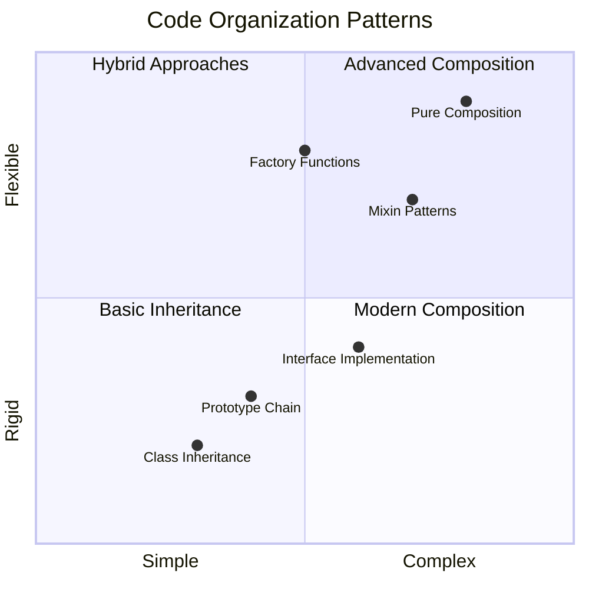

> 💡 **专业提示**：两种模式在现代 JavaScript 开发中各有用武之地。类适合明确定义的层级结构，而组合在需要最大灵活性时表现出色。
>
**何时使用：**
- **当存在明确的“是一个”关系时选择继承**（例如，英雄 *是一个* 可移动对象）
- **当存在“有一个”关系时选择组合**（例如，英雄 *拥有* 移动能力）
- **考虑**团队偏好和项目需求
- **记住**可以在同一应用中混合使用两者

### 🔄 **教学自检**
**对象组织理解**：在进入通信模式之前，确保你能：
- ✅ 解释继承与组合的区别
- ✅ 识别何时使用类还是工厂函数
- ✅ 理解继承中 `super()` 关键字的作用
- ✅ 认识每种方法对游戏开发的优势

**快速自测**：你如何创建一个既可移动又能飞行的敌人？
- **继承方法**: `class FlyingEnemy extends Movable`
- **组合方法**: `{ ...movable, ...flyable, ...gameObject }`

**现实联系**：这些模式无处不在：
- **React 组件**：属性（组合）与类继承
- **游戏引擎**：实体组件系统使用组合
- **移动应用**：UI 框架常用继承层级

## 通信模式：发布/订阅系统

随着应用复杂度提升，管理组件间通信变得困难。发布-订阅模式（pub/sub）用类似广播的原理解决这个问题——一个发射器能触达多个接收器，无需知道谁在监听。

考虑英雄受伤时的情况：血条更新，音效播放，视觉反馈出现。英雄对象不用直接耦合这些系统，而是广播一个“受伤”消息。任何需要响应的系统都能订阅该消息并做出反应。

✅ **Pub/Sub** 代表“发布-订阅”

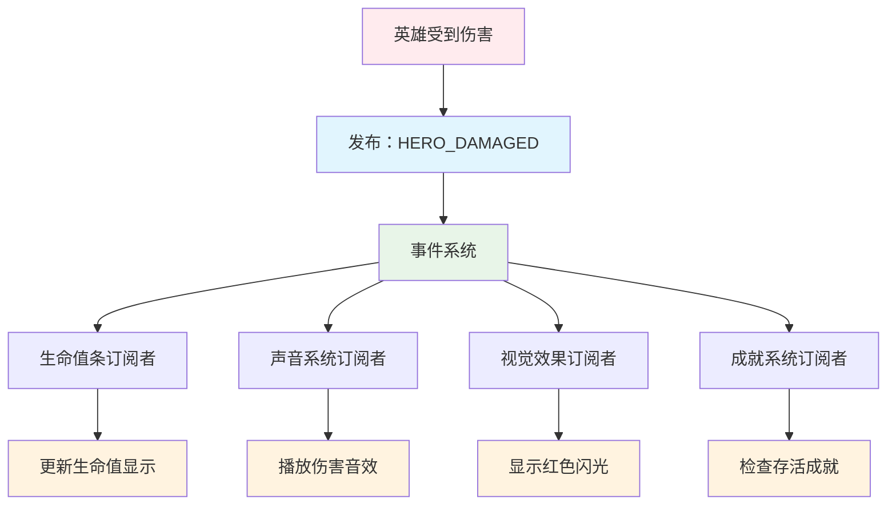
### 理解 Pub/Sub 架构

pub/sub 模式使应用的不同部分松散耦合，即它们能协作而不直接依赖彼此。这种分离让代码更易维护、测试和灵活应对变化。

**pub/sub 的关键角色：**
- **消息** —— 简单的文本标签，例如 `'PLAYER_SCORED'` ，描述发生的事件（含额外信息）
- **发布者** —— 向所有监听者“大声宣布”发生了什么
- **订阅者** —— 说“我关注这个事件”，并在事件发生时响应
- **事件系统** —— 确保消息送达正确监听者的中间人

### 构建事件系统

让我们创建一个简单而强大的事件系统，演示这些概念：

```javascript
// 第一步：创建 EventEmitter 类
class EventEmitter {
  constructor() {
    this.listeners = {}; // 存储所有事件监听器
  }

  // 为特定消息类型注册监听器
  on(message, listener) {
    if (!this.listeners[message]) {
      this.listeners[message] = [];
    }
    this.listeners[message].push(listener);
  }

  // 向所有注册的监听器发送消息
  emit(message, payload = null) {
    if (this.listeners[message]) {
      this.listeners[message].forEach(listener => {
        listener(message, payload);
      });
    }
  }
}
```

**拆解发生的事情：**
- **创建**一个简单类实现的中心事件管理系统
- **按消息类型**在对象中存储监听器
- **使用** `on()` 方法注册新监听器
- **用** `emit()` 方法广播消息到所有感兴趣的监听者
- **支持**可选的数据负载以传递相关信息

### 综合示例演示

好，让我们看看实际应用！我们构建一个简单的移动系统，展示 pub/sub 的清晰灵活性：

```javascript
// 第一步：定义你的消息类型
const Messages = {
  HERO_MOVE_LEFT: 'HERO_MOVE_LEFT',
  HERO_MOVE_RIGHT: 'HERO_MOVE_RIGHT',
  ENEMY_SPOTTED: 'ENEMY_SPOTTED'
};

// 第二步：创建你的事件系统和游戏对象
const eventEmitter = new EventEmitter();
const hero = createHero(0, 0);
```

**这段代码作用：**
- **定义**常量对象防止消息名拼写错误
- **创建**事件发射器实例处理所有通信
- **初始化**位于起始位置的英雄对象

```javascript
// 第三步：设置事件监听器（订阅者）
eventEmitter.on(Messages.HERO_MOVE_LEFT, () => {
  hero.moveTo(hero.x - 5, hero.y);
  console.log(`Hero moved to position: ${hero.x}, ${hero.y}`);
});

eventEmitter.on(Messages.HERO_MOVE_RIGHT, () => {
  hero.moveTo(hero.x + 5, hero.y);
  console.log(`Hero moved to position: ${hero.x}, ${hero.y}`);
});
```

**上述代码实现：**
- **注册**响应移动消息的事件监听器
- **根据移动方向**更新英雄位置
- **添加**控制台日志跟踪英雄位置变化
- **移动逻辑**与输入处理分离

```javascript
// 第4步：将键盘输入连接到事件（发布者）
window.addEventListener('keydown', (event) => {
  switch(event.key) {
    case 'ArrowLeft':
      eventEmitter.emit(Messages.HERO_MOVE_LEFT);
      break;
    case 'ArrowRight':
      eventEmitter.emit(Messages.HERO_MOVE_RIGHT);
      break;
  }
});
```

**进一步理解：**
- **连接**键盘输入与游戏事件，避免紧耦合
- **使**输入系统可间接与游戏对象通信
- **允许**多个系统响应同一键盘事件
- **便于**更改键绑定或添加新输入方法

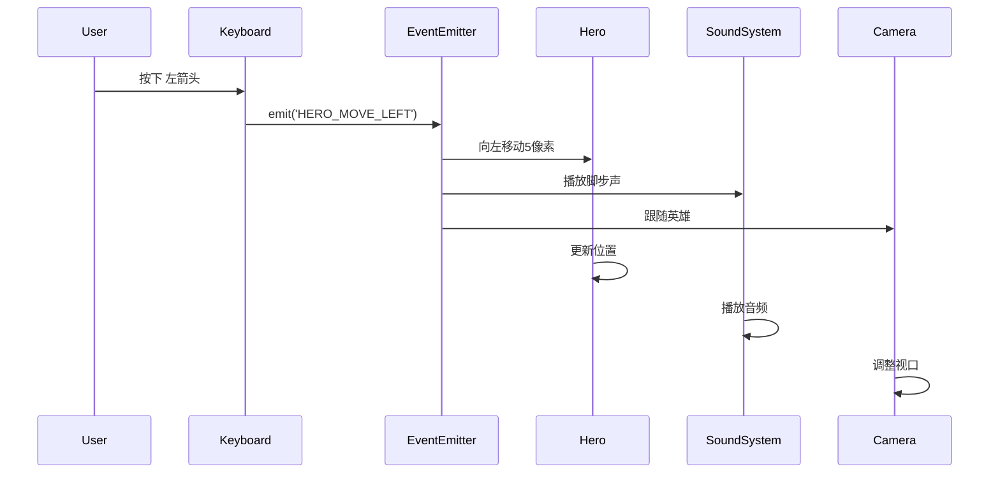
> 💡 **专业提示**：此模式的美妙在于灵活性！你只需添加更多事件监听器即可添加音效、屏幕抖动或粒子效果——无需修改现有的键盘或移动代码。
>
**你会喜欢此方法的原因：**
- 新功能添加变得非常简单——只需监听感兴趣事件
- 多个模块可响应同一事件，互不干扰
- 测试更加简单，因为各部分独立工作
- 出现问题时，知道准确排查位置

### Pub/Sub 为什么能有效扩展

随着应用复杂性增加，pub/sub 模式保持简洁。无论是管理数十个敌人、动态 UI 更新还是音效系统，该模式在不改变架构的情况下处理规模增大。新功能可无缝集成进现有事件系统，不影响已建立功能。

> ⚠️ **常见错误**：早期不要创建过多具体消息类型。先用大类分类，随着游戏需求明确再细化。
>
**最佳实践：**
- **将相关消息分组归类**
- **使用描述性名称清晰表达事件**
- **保持消息负载简单聚焦**
- **为团队协作记录消息类型文档**

### 🔄 **教学自检**
**事件驱动架构理解**：确认你掌握整体系统：
- ✅ pub/sub 模式如何防止组件间紧耦合？
- ✅ 为什么事件驱动架构更易添加新功能？
- ✅ EventEmitter 在通信流程中起什么作用？
- ✅ 消息常量如何防止错误并提升可维护性？

**设计挑战**：你如何用 pub/sub 处理这些游戏场景？
1. **敌人死亡**：更新得分，播放音效，生成道具，移除屏幕
2. **关卡完成**：停止音乐，显示 UI，保存进度，加载下一关
3. **道具收集**：增强能力，更新 UI，播放效果，启动计时

**专业联系**：此模式应用于：
- **前端框架**：React/Vue 事件系统
- **后端服务**：微服务通信
- **游戏引擎**：Unity 事件系统
- **移动开发**：iOS/Android 通知系统

## GitHub Copilot Agent 挑战 🚀

使用 Agent 模式完成以下挑战：

**描述：** 使用继承和发布/订阅模式创建一个简单的游戏对象系统。你将实现一个基本游戏，其中不同对象通过事件进行通信而无需直接了解彼此。

**提示：** 创建一个 JavaScript 游戏系统，要求如下：1）创建一个基础 GameObject 类，含 x, y 坐标和 type 属性。2）创建一个继承自 GameObject 且可以移动的 Hero 类。3）创建一个继承自 GameObject 且能追踪英雄的 Enemy 类。4）实现一个用于发布/订阅模式的 EventEmitter 类。5）设置事件监听器，当英雄移动时，附近敌人接收 'HERO_MOVED' 事件并更新位置向英雄移动。使用 console.log 展示对象间的通信。

了解更多[Agent 模式](https://code.visualstudio.com/blogs/2025/02/24/introducing-copilot-agent-mode)。

## 🚀 挑战
考虑发布-订阅模式如何增强游戏架构。确定哪些组件应发出事件以及系统应如何响应。设计一个游戏概念并绘制其组件之间的通信模式。

## 课后测验

[课后测验](https://ff-quizzes.netlify.app/web/quiz/30)

## 复习与自学

通过[阅读相关内容](https://docs.microsoft.com/azure/architecture/patterns/publisher-subscriber/?WT.mc_id=academic-77807-sagibbon)深入了解发布/订阅。

### ⚡ **接下来5分钟你可以做的事情**
- [ ] 打开任何在线HTML5游戏，使用开发者工具检查其代码
- [ ] 创建一个简单的HTML5 Canvas元素并绘制基本形状
- [ ] 尝试使用`setInterval`创建简单动画循环
- [ ] 浏览Canvas API文档，尝试某个绘图方法

### 🎯 **本小时你可以完成的任务**
- [ ] 完成课后测验并理解游戏开发概念
- [ ] 搭建包含HTML、CSS和JavaScript文件的游戏项目结构
- [ ] 创建一个持续更新和渲染的基础游戏循环
- [ ] 在画布上绘制你的第一个游戏精灵
- [ ] 实现基础的图片和声音资源加载

### 📅 **你的一周游戏创作计划**
- [ ] 完成包含所有计划功能的完整太空游戏
- [ ] 添加精细的图形、音效和流畅动画
- [ ] 实现游戏状态（开始界面、游戏中、游戏结束）
- [ ] 创建计分系统和玩家进度追踪
- [ ] 让游戏响应式兼容多设备
- [ ] 在线分享游戏并收集玩家反馈

### 🌟 **你的一月游戏开发计划**
- [ ] 开发多个不同类型和机制的游戏
- [ ] 学习使用像Phaser或Three.js这样的游戏开发框架
- [ ] 参与开源游戏开发项目
- [ ] 精通高级游戏编程模式和优化技巧
- [ ] 创建展示游戏开发技能的作品集
- [ ] 指导对游戏开发和互动媒体感兴趣的新人

## 🎯 你的游戏开发精通时间表

```mermaid
timeline
    title 游戏架构学习进度

    section 对象模式（20分钟）
        代码组织：类继承
                     ：组合模式
                     ：工厂函数
                     ：行为混合

    section 通信系统（25分钟）
        事件架构：发布/订阅实现
                     ：消息设计
                     ：事件发射器
                     ：松耦合

    section 游戏对象设计（30分钟）
        实体系统：属性管理
                     ：行为组合
                     ：状态处理
                     ：生命周期管理

    section 架构模式（35分钟）
        系统设计：组件系统
                     ：观察者模式
                     ：命令模式
                     ：状态机

    section 高级概念（45分钟）
        可扩展架构：性能优化
                     ：内存管理
                     ：模块化设计
                     ：测试策略

    section 游戏引擎概念（1周）
        专业开发：场景图
                     ：资源管理
                     ：渲染管线
                     ：物理整合

    section 框架精通（2周）
        现代游戏开发：React游戏模式
                         ：Canvas优化
                         ：WebGL基础
                         ：PWA游戏

    section 行业实践（1个月）
        专业技能：团队协作
                     ：代码审查
                     ：游戏设计模式
                     ：性能剖析
```
### 🛠️ 你的游戏架构工具包总结

完成本课后，你已有：
- **设计模式精通**：理解继承与组合的权衡
- **事件驱动架构**：发布/订阅实现的可扩展通信
- **面向对象设计**：类层级和行为组合
- **现代JavaScript**：工厂函数、展开语法以及ES6+模式
- **可扩展架构**：低耦合和模块化设计原则
- **游戏开发基础**：实体系统和组件模式
- **专业模式**：业界标准代码组织方法

**现实应用场景**：这些模式适用于：
- **前端框架**：React/Vue组件架构和状态管理
- **后端服务**：微服务通信和事件驱动系统
- **移动开发**：iOS/Android应用架构和通知系统
- **游戏引擎**：Unity、Unreal及基于Web的游戏开发
- **企业软件**：事件溯源和分布式系统设计
- **API设计**：RESTful服务和实时通信

**获得的专业技能**：你现在能：
- **设计**可扩展的软件架构，使用成熟的设计模式
- **实现**能够处理复杂交互的事件驱动系统
- **选择**适合不同场景的代码组织策略
- **调试**并维护低耦合系统
- **沟通**使用业界标准术语表达技术决策

**下一步**：你已准备好在实际游戏中实现这些模式，探索高级游戏开发主题，或将这些架构理念应用于网页应用！

🌟 **成就解锁**：你已掌握支持从简单游戏到复杂企业系统的基础软件架构模式！

## 任务

[设计一个游戏](assignment.md)

**免责声明**：
本文件由 AI 翻译服务 [Co-op Translator](https://github.com/Azure/co-op-translator) 翻译而成。尽管我们力求准确，但请注意自动翻译可能存在错误或不准确之处。原始语言版本的文件应被视为权威来源。对于重要信息，建议使用专业人工翻译。我们不对因使用本翻译而产生的任何误解或误释承担责任。

# 模拟游戏：应用设计模式

## 作业概述

运用你新学的设计模式知识，创建一个简单的游戏原型！本作业将帮助你练习架构模式（继承或组合）以及本课中介绍的发布/订阅通信系统。

## 说明

创建一个简单的游戏表示，展示本课的设计模式。你的游戏应当是可运行的，但不需要复杂的图形——重点放在底层架构和通信模式上。

### 要求

**选择你的架构模式：**
- **选项 A**：使用基于类的继承（如 `GameObject` → `Movable` → `Hero` 示例）
- **选项 B**：使用组合（如带混合行为的工厂函数方法）

**实现通信：**
- **包含** 一个 `EventEmitter` 类用于发布/订阅消息
- **设置** 至少 2-3 种不同的消息类型（如 `PLAYER_MOVE`、`ENEMY_SPAWN`、`SCORE_UPDATE`）
- **将** 用户输入（键盘/鼠标）通过事件系统连接到游戏事件

**游戏元素包括：**
- 至少一个玩家控制的角色
- 至少一个其他游戏对象（敌人、可收集物或环境元素）
- 对象之间的基本交互（碰撞、收集或通信）

### 推荐游戏思路

**可参考的简单游戏：**
- **贪吃蛇游戏** —— 蛇身节段跟随蛇头，食物随机生成
- **乒乓球变体** —— 球拍响应输入，球在墙壁反弹
- **收集者游戏** —— 玩家移动收集物品同时避开障碍
- **塔防基础** —— 塔检测并射击移动敌人

### 代码结构指导

```javascript
// 示例起始结构
const Messages = {
  // 在这里定义你的游戏消息
};

class EventEmitter {
  // 你的事件系统实现
}

// 选择基于类或组合的方法
// 基于类的示例：
class GameObject { /* base properties */ }
class Player extends GameObject { /* player-specific behavior */ }

// 或组合的示例：
const gameObject = { /* base properties */ };
const movable = { /* movement behavior */ };
function createPlayer() { /* combine behaviors */ }
```

### 测试你的实现

**验证代码运行方法：**
- **测试** 事件触发后对象是否移动或变化
- **确认** 多个对象能响应同一事件
- **检查** 可否在不修改已有代码前提下添加新行为
- **确保** 键盘/鼠标输入能正确触发游戏事件

## 提交指南

**你的提交应包含：**
1. 实现游戏的 **JavaScript 文件**
2. 用于运行和测试游戏的 **HTML 文件**（可以简单）
3. 说明你选择的设计模式及原因的 **注释**
4. 简要说明你的消息类型及其作用的 **文档**

## 评分标准

| 评价标准 | 优秀（3分） | 合格（2分） | 需改进（1分） |
|----------|-------------|-------------|---------------|
| **架构模式** | 正确实现继承或组合，具备清晰的类/对象层次 | 选用的模式基本正确，存在细微问题或不一致 | 尝试使用模式但实现有较大问题 |
| **发布/订阅实现** | EventEmitter 正确支持多消息类型和事件流 | 基础发布/订阅系统可用，但事件处理有限 | 实现了事件系统但不可靠 |
| **游戏功能** | 有三种及以上通过事件通信的交互元素 | 两种交互元素并实现基本事件通信 | 单一元素响应事件或基础交互 |
| **代码质量** | 代码整洁、有注释、组织合理，使用现代 JS | 代码一般组织良好，有足够注释 | 代码可用但缺乏组织或注释 |

**加分项：**
- **有创造性的游戏机制**，展示设计模式的有趣用法
- **多种输入方式**（键盘及鼠标事件）
- **可扩展架构**，便于未来增加新功能

**免责声明**：
本文件由AI翻译服务[Co-op Translator](https://github.com/Azure/co-op-translator)翻译而成。尽管我们力求准确，但请注意自动翻译可能包含错误或不准确之处。原始文件的原文版本应被视为权威来源。对于重要信息，建议使用专业人工翻译。我们不对因使用此翻译而产生的任何误解或错误解释承担责任。

# 构建太空游戏第二部分：将英雄和怪物绘制到画布上

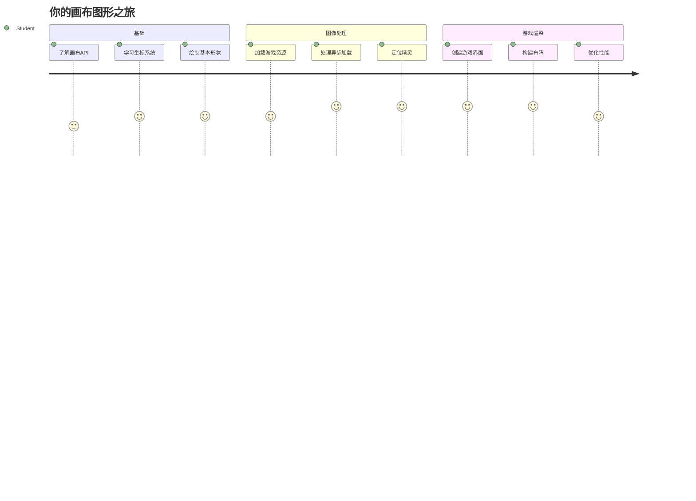
Canvas API 是网页开发中用于在浏览器中创建动态交互图形的最强大功能之一。在本课中，我们将把那个空白的 HTML `<canvas>` 元素变成一个充满英雄和怪物的游戏世界。把画布想象成你的数字画板，代码变成视觉效果。

我们将基于上一课的内容，现在深入视觉方面。你将学习如何加载和显示游戏精灵，精确定位元素，并为你的太空游戏创建视觉基础。这桥接了静态网页与动态交互体验之间的差距。

本课结束时，你将拥有一个完整的游戏场景，准确定位的英雄飞船和准备战斗的敌人阵型。你会理解现代游戏如何在浏览器中渲染图形，并获得制作自己交互式视觉体验的技能。让我们一起探索画布图形，赋予你的太空游戏生命吧！

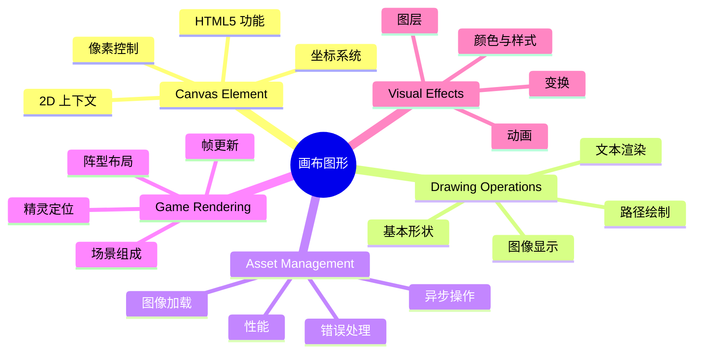
## 课前测验

[课前测验](https://ff-quizzes.netlify.app/web/quiz/31)

## 画布

那么，这个 `<canvas>` 元素到底是什么呢？它是 HTML5 用于在网页浏览器中创建动态图形和动画的解决方案。与静态的普通图像或视频不同，画布让你能够像素级别地控制屏幕上显示的一切。这使它非常适合游戏、数据可视化和交互艺术。把它想象成一个可编程的绘图表面，JavaScript 成为你的画笔。

默认情况下，canvas 元素看起来像页面上的一个空白透明矩形。但潜力就在这里！当你用 JavaScript 绘制形状、加载图像、创建动画并让事物响应用户交互时，它的真正威力就显现出来。这类似于 1960 年代贝尔实验室的早期计算机图形先驱——他们必须编程控制每个像素，才能创建第一批数字动画。

✅ 在 MDN 上阅读[更多关于 Canvas API](https://developer.mozilla.org/docs/Web/API/Canvas_API)。

它通常这样声明，作为页面主体的一部分：

```html
<canvas id="myCanvas" width="200" height="100"></canvas>
```

**这段代码做了什么：**
- **设置** `id` 属性，以便你在 JavaScript 中引用这个特定的画布元素
- **定义** `width`（宽度）以像素为单位，控制画布的水平尺寸
- **设置** `height`（高度）以像素为单位，确定画布的垂直尺寸

## 绘制简单几何图形

既然你知道了 canvas 元素是什么，接下来我们来探索如何真正地在上面绘图！画布使用的坐标系统你可能从数学课上见过，但有一个针对计算机图形的重要区别。

画布使用笛卡尔坐标系，包含 x 轴（水平轴）和 y 轴（垂直轴）来定位所有绘制内容。但关键的不同点是：与数学课上的坐标系不同，原点 `(0,0)` 从左上角开始，x 值向右增加，y 值向下增加。这种方式源于早期计算机显示器的电子束从上到下扫描，使得左上角成为自然的起点。

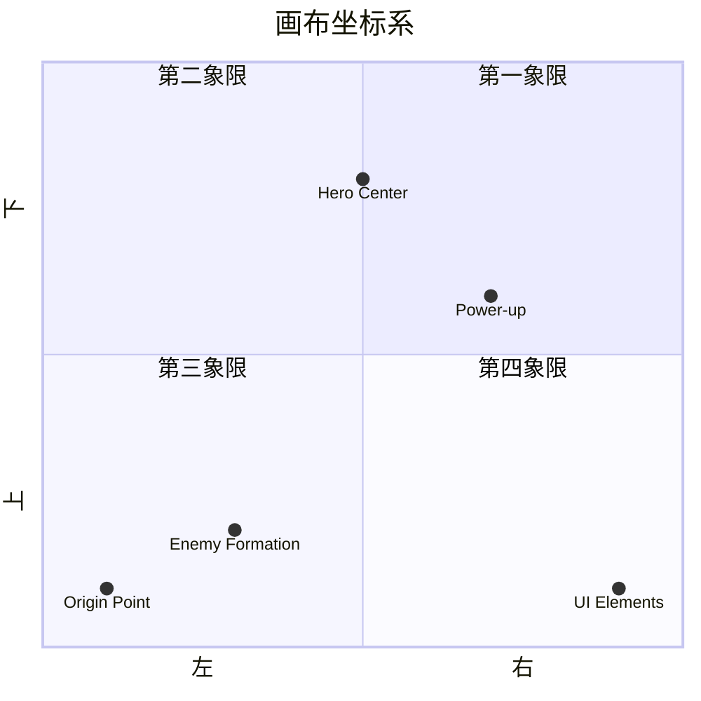
图示：canvas 网格
> 图片来自 [MDN](https://developer.mozilla.org/docs/Web/API/Canvas_API/Tutorial/Drawing_shapes)

要在 canvas 元素上绘图，你需要遵循所有画布图形基础的三个步骤。重复几次后，会变得很自然：

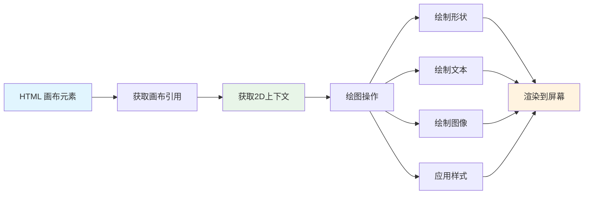
1. **获取引用**：从 DOM 获取你的 Canvas 元素（就像任何其他 HTML 元素一样）
2. **获取 2D 渲染上下文** — 它提供了所有绘图方法
3. **开始绘制！** 使用上下文的内建方法创建图形

代码示例如下：

```javascript
// 第一步：获取画布元素
const canvas = document.getElementById("myCanvas");

// 第二步：获取2D渲染上下文
const ctx = canvas.getContext("2d");

// 第三步：设置填充颜色并绘制矩形
ctx.fillStyle = 'red';
ctx.fillRect(0, 0, 200, 200); // x，y，宽度，高度
```

**逐步解析：**
- 我们 **获取** 了画布元素，使用它的 ID 并存储在变量中
- 我们 **获得** 2D 渲染上下文，它是我们的绘图工具箱
- 我们 **告诉** 画布用红色填充，设置填充样式 `fillStyle`
- 我们 **绘制** 了一个矩形，从左上角(0,0)开始，宽高均为200像素

✅ Canvas API 主要关注于二维形状，但你也可以用它在网站上绘制三维元素；为此，你可能会用到 [WebGL API](https://developer.mozilla.org/docs/Web/API/WebGL_API)。

你可以用 Canvas API 绘制各种内容，例如：

- **几何图形**，我们已经展示了如何绘制矩形，但还有很多形状你可以画。
- **文本**，你可以以任何字体和颜色绘制文字。
- **图像**，你可以根据图像资源（如 .jpg 或 .png）绘制图像。

✅ 试试吧！你已经会画矩形了，你能画一个圆形吗？看看 CodePen 上的一些有趣 Canvas 绘图。这里有一个[特别棒的示例](https://codepen.io/dissimulate/pen/KrAwx)。

### 🔄 **教学检查点**
**Canvas 基础理解**：在学习加载图像之前，确保你能够：
- ✅ 解释画布坐标系与数学坐标系的不同
- ✅ 理解画布绘图操作的三步流程
- ✅ 识别 2D 渲染上下文提供了什么
- ✅ 描述 fillStyle 和 fillRect 如何协作工作

**快速自测**：如何在位置 (100, 50) 画一个半径为 25 的蓝色圆圈？
```javascript
ctx.fillStyle = 'blue';
ctx.beginPath();
ctx.arc(100, 50, 25, 0, 2 * Math.PI);
ctx.fill();
```

**你现在知道的 Canvas 绘图方法：**
- **fillRect()**：绘制填充矩形
- **fillStyle**：设置颜色和图案
- **beginPath()**：开始新绘图路径
- **arc()**：创建圆和曲线

## 加载并绘制图像资源

绘制基础形状有助于入门，但大多数游戏需要真实的图像！精灵、背景和纹理赋予游戏视觉魅力。在画布上加载和显示图像的方式与绘制几何形状不同，但一旦掌握过程就很简单。

你需要创建一个 `Image` 对象，加载你的图像文件（这是异步的，即“后台”加载），然后图像准备好后再绘制到画布上。这样做能保证图像正确显示，同时不阻塞应用程序加载。

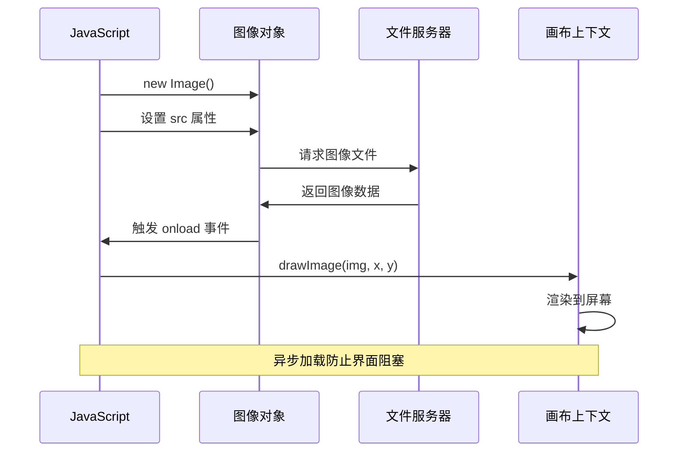
### 基本图像加载

```javascript
const img = new Image();
img.src = 'path/to/my/image.png';
img.onload = () => {
  // 图像已加载并准备好使用
  console.log('Image loaded successfully!');
};
```

**这段代码发生了什么：**
- 我们 **创建** 了一个新的 Image 对象来存放我们的精灵或纹理
- 我们 **指明** 它要加载的图像文件路径
- 我们 **监听** 加载完成事件，确保图像准备好使用

### 更好的图像加载方式

这是专业开发者常用的更健壮图像加载方法。我们将图像加载包装成基于 Promise 的函数——这种方法自 ES6 引入 JavaScript Promise 后变得流行，让代码更有条理且能优雅处理错误：

```javascript
function loadAsset(path) {
  return new Promise((resolve, reject) => {
    const img = new Image();
    img.src = path;
    img.onload = () => {
      resolve(img);
    };
    img.onerror = () => {
      reject(new Error(`Failed to load image: ${path}`));
    };
  });
}

// 使用 async/await 的现代用法
async function initializeGame() {
  try {
    const heroImg = await loadAsset('hero.png');
    const monsterImg = await loadAsset('monster.png');
    // 图像现在可以使用了
  } catch (error) {
    console.error('Failed to load game assets:', error);
  }
}
```

**这里做的事情：**
- **用 Promise 封装** 图像加载逻辑，更好地管理它
- **添加** 错误处理，能告诉我们什么时候出了问题
- **使用** 现代 async/await 语法，阅读起来更简洁
- **包括** try/catch 块优雅处理加载异常

图像加载完成后，将它绘制到画布其实很简单：

```javascript
async function renderGameScreen() {
  try {
    // 加载游戏资源
    const heroImg = await loadAsset('hero.png');
    const monsterImg = await loadAsset('monster.png');

    // 获取画布和上下文
    const canvas = document.getElementById("myCanvas");
    const ctx = canvas.getContext("2d");

    // 在特定位置绘制图像
    ctx.drawImage(heroImg, canvas.width / 2, canvas.height / 2);
    ctx.drawImage(monsterImg, 0, 0);
  } catch (error) {
    console.error('Failed to render game screen:', error);
  }
}
```

**逐步讲解：**
- 我们用 await 在后台加载了英雄和怪物的图像
- 我们获取画布元素及其 2D 渲染上下文
- 通过简单的坐标计算，把英雄图像放到画布中心
- 将怪物图像放置在左上角，开始敌人阵型
- 使用 try/catch 捕捉任何加载或渲染时可能出现的错误

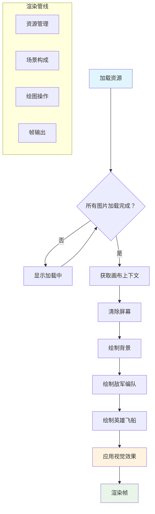
## 现在开始构建你的游戏

现在我们把所有内容整合，创建太空游戏的视觉基础。你已经掌握了画布基础和图像加载技巧，这部分将引导你构建一个完整的游戏画面，实现精灵正确定位。

### 要构建什么

你将构建一个包含 Canvas 元素的网页。它应该渲染一个黑色画面，大小为 `1024*768`。我们给你提供了两张图片：

- 英雄飞船

   图示：英雄飞船

- 5*5 怪物阵型

   图示：怪物飞船

### 推荐开发步骤

找到为你准备好的启动文件，放在 `your-work` 子文件夹。你的项目结构应包含：

```bash
your-work/
├── assets/
│   ├── enemyShip.png
│   └── player.png
├── index.html
├── app.js
└── package.json
```

**你会使用这些资源：**
- **游戏精灵**存在于 `assets/` 文件夹，保持组织有序
- **主 HTML 文件**负责设置画布元素及环境
- **JavaScript 文件**中你将编写所有游戏渲染代码
- **package.json** 配置了开发服务器，支持本地测试

用 Visual Studio Code 打开此文件夹开始开发。你需要在本地环境安装 Visual Studio Code、NPM 和 Node.js。如果电脑未安装 `npm`，[这里有安装指南](https://www.npmjs.com/get-npm)。

进入 `your-work` 文件夹启动开发服务器：

```bash
cd your-work
npm start
```

**这个命令做了很酷的事情：**
- **启动**本地服务器 `http://localhost:5000`，方便测试游戏
- **正确服务**所有文件，浏览器能正常加载
- **监视**文件修改，保证开发顺畅
- **提供**专业开发环境，测试所有功能

> 💡 **注意**：浏览器初次会显示空白页——这很正常！随着你添加代码，刷新浏览器即可看到变化。这种迭代开发方式类似 NASA 构建阿波罗制导计算机——逐步测试每个组成部分后再集成。

### 添加代码

在 `your-work/app.js` 中添加代码，完成以下任务：

1. **绘制黑色背景的画布**
   > 💡 **操作示范**：找到 `/app.js` 中的 TODO，添加两行即可。设置 `ctx.fillStyle` 为黑色，再调用 `ctx.fillRect()`，起点(0,0)，尺寸与画布相符，简单易懂！

2. **加载游戏纹理**
   > 💡 **操作示范**：使用 `await loadAsset()` 加载英雄和敌人图像，存入变量以备后用。记住——只有实际绘制才能看到它们！

3. **将英雄飞船绘制在中心下部**
   > 💡 **操作示范**：用 `ctx.drawImage()` 放置英雄。x 坐标尝试 `canvas.width / 2 - 45` 使其居中，y 坐标使用 `canvas.height - canvas.height / 4` 放到底部区域。

4. **绘制 5×5 阵型敌人舰队**
   > 💡 **操作示范**：找到 `createEnemies` 函数，设置嵌套循环。你将进行一些间距和定位计算，别担心，我会引导你完成！

首先，定义常量以便合理布局敌人阵型：

```javascript
const ENEMY_TOTAL = 5;
const ENEMY_SPACING = 98;
const FORMATION_WIDTH = ENEMY_TOTAL * ENEMY_SPACING;
const START_X = (canvas.width - FORMATION_WIDTH) / 2;
const STOP_X = START_X + FORMATION_WIDTH;
```

**这些常量实现了什么：**
- 设定每行每列 5 个敌人（整齐的 5×5 网格）
- 定义敌人之间的间距，避免紧凑不适
- 计算整阵型的宽度
- 计算起止坐标，令阵型居中

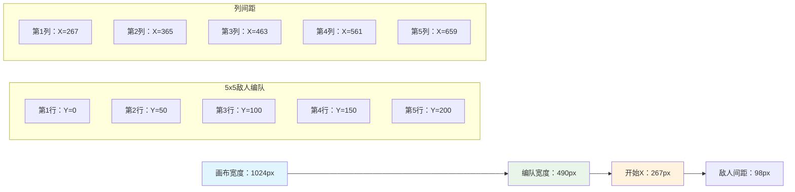
然后，使用嵌套循环绘制敌人阵型：

```javascript
for (let x = START_X; x < STOP_X; x += ENEMY_SPACING) {
  for (let y = 0; y < 50 * 5; y += 50) {
    ctx.drawImage(enemyImg, x, y);
  }
}
```

**这个嵌套循环做了什么：**
- 外层循环从左往右遍历阵型
- 内层循环垂直遍历，创建整齐行列
- 在计算的精确 x,y 坐标绘制每个敌人精灵
- 保持均匀间距，效果专业有序

### 🔄 **教学检查点**
**游戏渲染掌握情况**：验证你对完整渲染系统的理解：
- ✅ 异步图像加载如何防止游戏启动时阻塞用户界面？
- ✅ 为什么用常量计算敌人阵型位置而非硬编码？
- ✅ 2D 渲染上下文在绘图操作中扮演什么角色？
- ✅ 嵌套循环如何创建有序的精灵阵型？

**性能考量**：你的游戏现展示了：
- **高效资源加载**：基于 Promise 的图像管理
- **有序渲染**：结构化绘图操作
- **数学定位**：计算精灵摆放
- **错误处理**：优雅的失败管理

**视觉编程概念**：你已经学会了：
- **坐标系统**：将数学转换为屏幕位置
- **精灵管理**：加载和显示游戏图形
- **阵型算法**：组织布局的数学模式
- **异步操作**：现代 JavaScript 实现流畅的用户体验

## 结果

完成的结果应如下所示：

图示：带有英雄和 5*5 怪物的黑屏

## 解决方案

## GitHub Copilot Agent 挑战 🚀

使用 Agent 模式完成以下挑战：

**描述：** 使用你学到的 Canvas API 技术，通过添加视觉效果和交互元素来增强你的太空游戏画布。

**提示：** 创建一个名为 `enhanced-canvas.html` 的新文件，画布中显示背景中动画的星星、英雄飞船的脉动生命条，以及缓慢向下移动的敌船。包含使用随机位置和不透明度绘制闪烁星星的 JavaScript 代码，实现根据生命值变化颜色（绿色 > 黄色 > 红色）的生命条，并让敌船以不同速度在屏幕上向下移动。

在这里了解更多关于[Agent 模式](https://code.visualstudio.com/blogs/2025/02/24/introducing-copilot-agent-mode)。

## 🚀 挑战

你已经学会了使用专注于2D的 Canvas API 绘图；看看[WebGL API](https://developer.mozilla.org/docs/Web/API/WebGL_API)，尝试绘制一个3D对象。

## 课后测验

[课后测验](https://ff-quizzes.netlify.app/web/quiz/32)

## 复习与自主学习

通过[阅读相关内容](https://developer.mozilla.org/docs/Web/API/Canvas_API)了解更多关于 Canvas API 的知识。

### ⚡ **接下来 5 分钟你可以做什么**
- [ ] 打开浏览器控制台，用 `document.createElement('canvas')` 创建画布元素
- [ ] 试着使用画布上下文的 `fillRect()` 绘制矩形
- [ ] 通过 `fillStyle` 属性尝试不同颜色
- [ ] 使用 `arc()` 方法绘制简单的圆形

### 🎯 **本小时你可以完成什么**
- [ ] 完成课后测验，理解画布基础
- [ ] 创建一个具有多种形状和颜色的画布绘图应用
- [ ] 实现你的游戏图像加载和精灵渲染
- [ ] 构建一个简单动画，让对象在画布上移动
- [ ] 练习画布变换，如缩放、旋转和平移

### 📅 **你的一周画布学习旅程**
- [ ] 完成太空游戏，拥有精致图形和精灵动画
- [ ] 精通高级画布技术，如渐变、图案和合成
- [ ] 使用画布创建数据交互可视化
- [ ] 了解画布性能优化技术，确保流畅运行
- [ ] 构建具有多种工具的绘图或绘画应用
- [ ] 探索创意编程模式和生成艺术与画布结合

### 🌟 **你的一月图形大师之路**
- [ ] 使用 Canvas 2D 和 WebGL 构建复杂视觉应用
- [ ] 学习图形编程概念与着色器基础
- [ ] 为开源图形库和可视化工具做贡献
- [ ] 精通图形密集应用的性能优化
- [ ] 制作关于画布编程和计算机图形学的教学内容
- [ ] 成为图形编程专家，帮助他人打造视觉体验

## 🎯 你的画布图形大师时间线

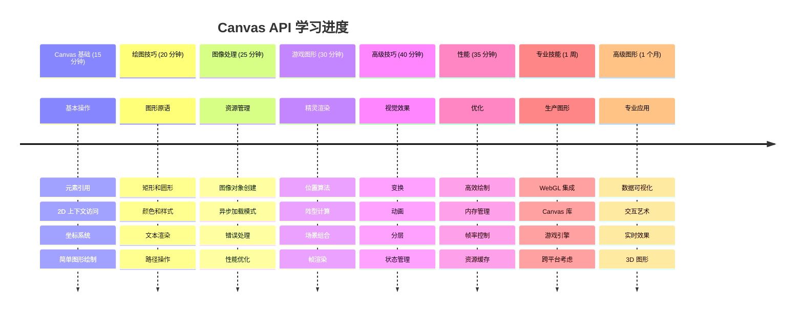
### 🛠️ 你的画布图形工具包总结

完成本课程后，你现在拥有：
- **Canvas API 掌握**：完全理解2D图形编程
- **坐标数学**：精准定位和布局算法
- **资源管理**：专业的图像加载与错误处理
- **渲染管线**：结构化场景组成方法
- **游戏图形**：精灵定位和阵型计算
- **异步编程**：现代 JavaScript 模式实现流畅性能
- **视觉编程**：将数学概念转换为屏幕图形

**现实应用**：你的 Canvas 技能可广泛应用于：
- **数据可视化**：图表、图形和互动仪表盘
- **游戏开发**：2D游戏、模拟和交互体验
- **数字艺术**：创意编程和生成艺术项目
- **UI/UX 设计**：自定义图形和交互元素
- **教育软件**：视觉学习工具和模拟
- **Web 应用**：动态图形和实时可视化

**所获专业技能**：你现在可以：
- **构建** 无需外部库的定制图形解决方案
- **优化** 渲染性能，实现流畅用户体验
- **调试** 使用浏览器开发工具排查复杂视觉问题
- **设计** 采用数学原理的可扩展图形系统
- **整合** Canvas 图形与现代 Web 应用框架

**你已掌握的 Canvas API 方法**：
- **元素管理**：getElementById、getContext
- **绘图操作**：fillRect、drawImage、fillStyle
- **资源加载**：图像对象、Promise 模式
- **数学定位**：坐标计算、阵型算法

**下一步**：你已经准备好添加动画、用户交互、碰撞检测，或探索 WebGL 实现3D图形！

🌟 **成就解锁**：你已用基础 Canvas API 技术构建完整游戏渲染系统！

## 作业

[玩转 Canvas API](assignment.md)

**免责声明**：
本文件使用 AI 翻译服务 [Co-op Translator](https://github.com/Azure/co-op-translator) 进行翻译。尽管我们力求准确，但请注意自动翻译可能包含错误或不准确之处。原文应被视为权威来源。对于重要信息，建议采用专业人工翻译。我们概不对因使用本翻译而导致的任何误解或误释承担责任。

# 作业：探索 Canvas API

## 学习目标

通过完成此作业，您将展示对 Canvas API 基础知识的理解，并运用创造性的问题解决能力，使用 JavaScript 和 HTML5 canvas 构建视觉元素。

## 说明

选择 Canvas API 中您感兴趣的一个方面，围绕它创建一个有趣的视觉项目。此作业鼓励您在构建独具个人特色的内容时，尝试您所学的绘图功能。

### 项目灵感

**几何图案：**
- **创建** 一个使用随机定位的动画闪烁星空
- **设计** 一种使用重复几何形状的有趣纹理
- **构建** 一个带有旋转多彩图案的万花筒效果

**交互元素：**
- **开发** 一款响应鼠标移动的绘图工具
- **实现** 点击时改变颜色的形状
- **设计** 一个带有移动元素的简单动画循环

**游戏相关图形：**
- **制作** 一个太空游戏的滚动背景
- **构建** 爆炸或魔法效果的粒子效果
- **创建** 带有多帧动画的精灵

### 开发指导

**研究与灵感：**
- **浏览** CodePen 上的创意 canvas 示例（用于灵感，不可抄袭）
- **学习** [Canvas API 文档](https://developer.mozilla.org/docs/Web/API/Canvas_API) 以了解更多方法
- **尝试** 不同的绘图函数、颜色和动画

**技术要求：**
- **使用** 合适的 canvas 设置和 `getContext('2d')`
- **包含** 有意义的注释，说明您的思路
- **充分测试** 代码，确保无错误运行
- **应用** 现代 JavaScript 语法（const/let，箭头函数）

**创造表达：**
- **专注** 于一个 Canvas API 特性，但深入探索
- **加入** 您自己的创意元素，令项目个性化
- **思考** 您的作品如何融入更大的应用中

### 提交要求

将完成的项目作为单个包含嵌入 CSS 和 JavaScript 的 HTML 文件提交，或作为文件夹中的多个单独文件提交。附上一段简要注释，说明您的创意选择以及您探索的 Canvas API 功能。

## 评分标准

| 评估标准 | 卓越 | 及格 | 需改进 |
|----------|-------|------|---------|
| **技术实现** | 创意性地使用 Canvas API 多种功能，代码无误运行，应用现代 JavaScript 语法 | 正确使用 Canvas API，代码运行有轻微问题，基础实现 | 试图使用 Canvas API，但代码存在错误或无法执行 |
| **创意与设计** | 极具原创性，视觉效果精致，深入探索所选 Canvas 功能 | Canvas 功能使用良好，具备一定创意，视觉效果稳健 | 基础实现，创意和视觉吸引力有限 |
| **代码质量** | 代码结构良好，有注释，遵循最佳实践，算法高效 | 代码整洁，有部分注释，遵循基本编码规范 | 代码缺乏组织，注释少，实现效率低 |

## 反思问题

完成项目后，请思考以下问题：

1. **您选择了哪个 Canvas API 功能，为什么？**
2. **在构建项目时遇到了哪些挑战？**
3. **您如何将此项目扩展为更大的应用或游戏？**
4. **您接下来想探索哪些其他 Canvas API 功能？**

> 💡 **专业提示**：从简单开始，逐步增加复杂度。一个执行良好的简单项目，比一个雄心勃勃但无法正常工作的项目更好！

**免责声明**：
本文件由AI翻译服务[Co-op Translator](https://github.com/Azure/co-op-translator)进行翻译。虽然我们力求准确，但请注意自动翻译可能存在错误或不准确之处。原始文件的母语版本应被视为权威来源。对于重要信息，建议使用专业人工翻译。因使用本翻译而引起的任何误解或误译，我们不承担任何责任。

# 构建太空游戏 第3部分：添加运动

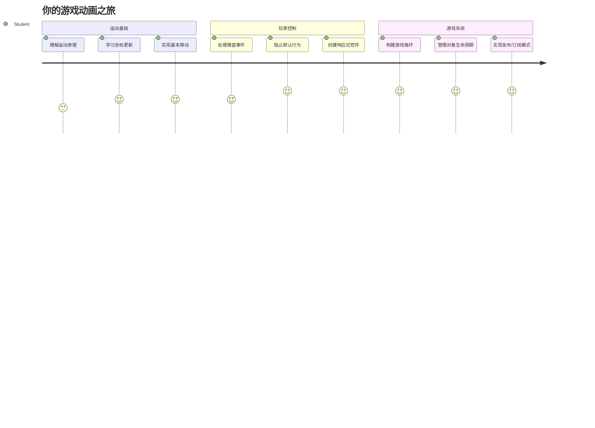
想想你最喜欢的游戏——让它们吸引人不仅仅是漂亮的图形，而是所有东西如何移动并响应你的操作。现在，你的太空游戏就像一幅美丽的画，但我们马上要添加使其充满活力的动作。

当 NASA 工程师为阿波罗任务编写导航计算机程序时，他们面临着类似的挑战：如何让航天器在自动保持航向校正的同时响应飞行员的指令？我们今天要学习的原理正是这些——管理玩家控制的运动和自动系统行为协同工作。

本课中，你将学习如何让飞船在屏幕上滑行，响应玩家命令，创建流畅的移动模式。我们会将所有内容拆解成易于理解且自然递进的概念。

最后，你将拥有一个那样的游戏：玩家可以驾驶英雄飞船在屏幕上飞行，而敌舰在头顶巡逻。更重要的是，你将理解驱动游戏运动系统的核心原理。

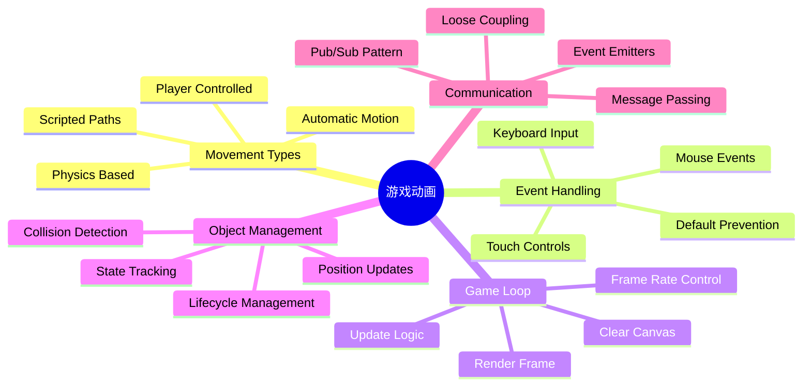
## 课前测验

[课前测验](https://ff-quizzes.netlify.app/web/quiz/33)

## 理解游戏运动

当游戏中的元素开始移动时，游戏才会真正生动起来，基本上有两种运动方式：

- **玩家控制的运动**：当你按下一个键或点击鼠标时，某事物会移动。这是你与游戏世界之间的直接联系。
- **自动运动**：游戏本身决定移动某些东西——比如那些无论你是否操作都在屏幕上巡逻的敌舰。

在计算机屏幕上移动物体其实没你想的复杂。还记得数学课上的 x 和 y 坐标吗？这正是我们现在使用的。1610年，当伽利略追踪木星的卫星时，实际上也是在做同样事情——随着时间绘制位置以理解运动规律。

屏幕上移动事物就像制作翻页动画——你需要遵循以下三个简单步骤：

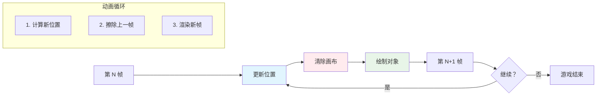
1. **更新位置**——改变物体应该所在的位置（比如向右移动5像素）
2. **擦除旧帧**——清除屏幕防止出现鬼影尾迹
3. **绘制新帧**——将物体放到新位置

做得够快，砰！你就拥有顺滑且自然的运动效果。

下面是代码中的表现：

```javascript
// 设置英雄的位置
hero.x += 5;
// 清除英雄所在的矩形区域
ctx.clearRect(0, 0, canvas.width, canvas.height);
// 重新绘制游戏背景和英雄
ctx.fillRect(0, 0, canvas.width, canvas.height);
ctx.fillStyle = "black";
ctx.drawImage(heroImg, hero.x, hero.y);
```

**这段代码的作用是：**
- **更新**英雄的 x 坐标，加5像素，实现水平移动
- **清空**整个画布区域，移除上一帧
- **填充**画布黑色背景
- **重绘**英雄图片于新位置

✅ 你能想出为什么每秒多次重绘英雄可能导致性能开销吗？阅读关于[这种模式的替代方案](https://developer.mozilla.org/en-US/docs/Web/API/Canvas_API/Tutorial/Optimizing_canvas)。

## 处理键盘事件

这里是我们将玩家输入连接到游戏动作的地方。当有人按下空格键开火激光或点击方向键躲避小行星时，你的游戏需要检测到并响应这些输入。

键盘事件发生在 window 级别，也就是说整个浏览器窗口都在监听键盘按下。鼠标点击可以绑定到特定元素（如按钮）。对于我们的太空游戏，我们专注键盘控制——这赋予玩家经典街机的感觉。

这让我想到1800年代电报操作员如何将莫尔斯电码翻译成有意义的信息——我们也正做类似事情，将按键转成游戏指令。

处理事件需要使用 window 的 `addEventListener()` 方法，传入两个参数。第一个是事件名，例如 `keyup`；第二个是事件触发时调用的函数。

示例：

```javascript
window.addEventListener('keyup', (evt) => {
  // evt.key = 键的字符串表示
  if (evt.key === 'ArrowUp') {
    // 做某事
  }
});
```

**这里发生了什么：**
- **监听**整个窗口的键盘事件
- **捕获**事件对象，包含按了哪个键的信息
- **检查**按键是否匹配特定键（这里是向上箭头）
- **满足条件时**执行相应代码

键盘事件可通过以下属性判断按了什么键：

- `key` —— 字符串形式，比如 `'ArrowUp'`
- `keyCode` —— 数字形式，比如 `37`，对应 `ArrowLeft`

✅ 键盘事件处理适用游戏开发外的场景，你还能想到哪些用途？

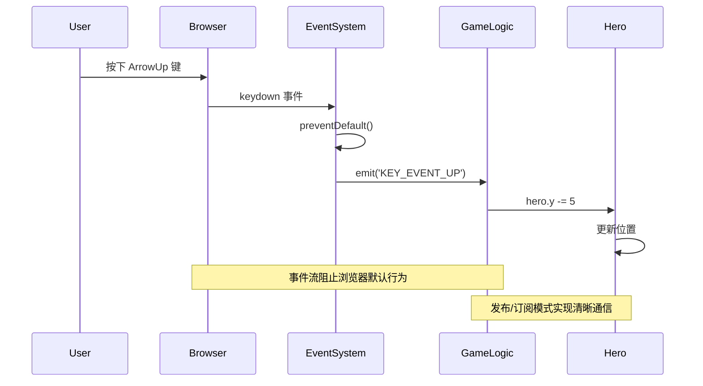
### 特殊键：须知！

部分按键默认行为会影响游戏体验。箭头键会滚动页面，空格键会跳到页面下方——当玩家驾驶飞船时，这些行为当然不希望发生。

我们可以阻止这些默认行为，让游戏自行处理输入。这类似早期程序员覆盖系统中断实现自定义行为——我们这次是浏览器层面的操作。方法如下：

```javascript
const onKeyDown = function (e) {
  console.log(e.keyCode);
  switch (e.keyCode) {
    case 37:
    case 39:
    case 38:
    case 40: // 方向键
    case 32:
      e.preventDefault();
      break; // 空格键
    default:
      break; // 不阻塞其他按键
  }
};

window.addEventListener('keydown', onKeyDown);
```

**理解这段阻止代码：**
- **检查**可能引起问题的键码
- **阻止**箭头键和空格键的默认浏览器行为
- **允许**其他键正常工作
- **使用** `e.preventDefault()` 阻止浏览器默认动作

### 🔄 **教学确认**
**事件处理理解点**：转入自动运动前，确保你能：
- ✅ 解释 `keydown` 和 `keyup` 事件的区别
- ✅ 理解为何需要防止默认浏览器行为
- ✅ 描述事件监听器如何连接用户输入与游戏逻辑
- ✅ 识别哪些键可能会干扰游戏操作

**快速自测**：如果你不阻止箭头键的默认行为会怎样？
*答：浏览器会滚动页面，影响游戏运动*

**事件系统架构**：你现在理解了：
- **窗口级监听**：在浏览器层捕获事件
- **事件对象属性**：`key` 字符串与 `keyCode` 数字
- **默认阻止**：防止不想要的浏览器行为
- **条件逻辑**：针对特定按键做响应

## 游戏引导的运动

接下来聊聊无需玩家输入也会运动的物体。想想敌舰在屏幕上巡航，子弹直线飞行，背景云朵飘过。这种自主运动让游戏世界即使无人操作也充满生命力。

我们使用 JavaScript 内置计时器，定时更新位置。这就像钟摆时钟——定期触发动作。示例如下：

```javascript
const id = setInterval(() => {
  // 在y轴上移动敌人
  enemy.y += 10;
}, 100);
```

**这段运动代码的作用：**
- **创建**一个每100毫秒运行一次的定时器
- **每次**更新敌人 y 坐标，下移10像素
- **存储**定时器ID以备后续停止
- **自动**将敌人往屏幕下方移动

## 游戏循环

这是贯穿全局的核心机制——游戏循环。把游戏比作电影，游戏循环就是放映机，快速播放一帧又一帧，营造顺畅运动感。

每款游戏背后都有一个这样的循环。它持续更新所有游戏对象，重绘屏幕，重复进行。追踪英雄、所有敌人及飞行的激光——保持整局游戏状态同步。

这让我想起早期动画师如华特·迪士尼，逐帧重绘角色制造运动假象。我们同理，不过用代码替代铅笔。

一般的游戏循环代码如下：

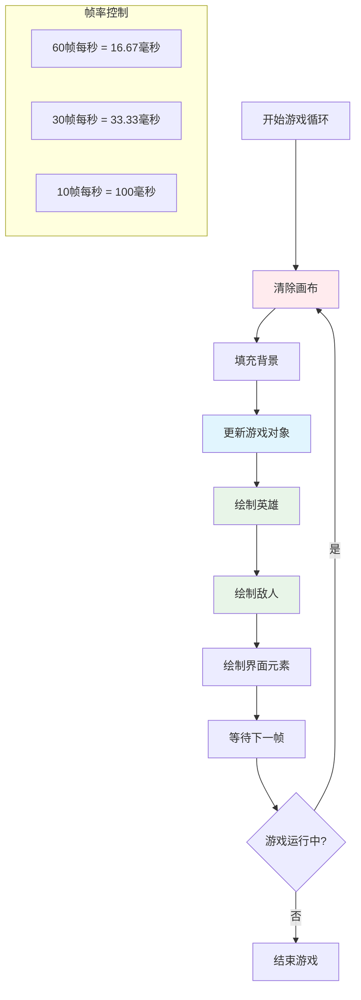
```javascript
const gameLoopId = setInterval(() => {
  function gameLoop() {
    ctx.clearRect(0, 0, canvas.width, canvas.height);
    ctx.fillStyle = "black";
    ctx.fillRect(0, 0, canvas.width, canvas.height);
    drawHero();
    drawEnemies();
    drawStaticObjects();
  }
  gameLoop();
}, 200);
```

**理解游戏循环结构：**
- **清空**画布，移除上一帧
- **填充**背景色
- **绘制**所有游戏对象当前位置
- **每隔200毫秒**重复上述过程，产生流畅动画
- **控制**帧率通过定时间隔

## 继续构建太空游戏

现在给你之前搭建的静态场景添加运动。把它从一张静态截图变成交互体验。我们逐步完成，确保每个部分自然衔接。

从上一课结束的代码开始，或者如果需要全新开始，请使用 Part II- starter 文件夹里的代码。

**今天要做的是：**
- **英雄控制**：用箭头键驾驶飞船在屏幕内移动
- **敌人运动**：外星舰开始进攻

我们开始实现这些特性。

## 推荐步骤

找到为你准备好的文件，位于 `your-work` 子文件夹。里面应包含：

```bash
-| assets
  -| enemyShip.png
  -| player.png
-| index.html
-| app.js
-| package.json
```

在 `your-work` 文件夹启动项目，运行：

```bash
cd your-work
npm start
```

**此命令做了什么：**
- **切换**到项目目录
- **启动**HTTP服务器，地址为 `http://localhost:5000`
- **托管**你的游戏文件，可以用浏览器测试

以上会在地址 `http://localhost:5000` 启动HTTP服务器。打开浏览器访问它，当前应看到英雄和所有敌机；但暂时还没有运动！

### 添加代码

1. **新增独立对象** `hero`，`enemy` 和 `game object`，它们应有 `x` 和 `y` 属性。（回想继承或组合部分）

   *提示* `game object` 应是拥有 `x` 和 `y`，能在画布上自绘的基础类。

   > **提示**：先新增一个 `GameObject` 类，构造函数如下，后续在画布上绘制它：

    ```javascript
    class GameObject {
      constructor(x, y) {
        this.x = x;
        this.y = y;
        this.dead = false;
        this.type = "";
        this.width = 0;
        this.height = 0;
        this.img = undefined;
      }

      draw(ctx) {
        ctx.drawImage(this.img, this.x, this.y, this.width, this.height);
      }
    }
    ```

    **理解此基础类：**
    - **定义**所有游戏对象共享的通用属性（位置、尺寸、图片）
    - **包含**一个 `dead` 标记，跟踪对象是否应移除
    - **提供**一个 `draw()` 方法，在画布绘制对象
    - **默认设置**所有属性值，子类可覆盖

```mermaid
classDiagram
    class GameObject {
        +x: number
        +y: number
        +dead: boolean
        +type: string
        +width: number
        +height: number
        +img: Image
        +draw(ctx)
    }

    class Hero {
        +speed: number
        +type: "英雄"
        +width: 98
        +height: 75
    }

    class Enemy {
        +type: "敌人"
        +width: 98
        +height: 50
        +setInterval()
    }

    GameObject <|-- Hero
    GameObject <|-- Enemy

    class EventEmitter {
        +listeners: object
        +on(message, listener)
        +emit(message, payload)
    }
```
    现在，继承该 `GameObject` 创建 `Hero` 和 `Enemy`：

    ```javascript
    class Hero extends GameObject {
      constructor(x, y) {
        super(x, y);
        this.width = 98;
        this.height = 75;
        this.type = "Hero";
        this.speed = 5;
      }
    }
    ```

    ```javascript
    class Enemy extends GameObject {
      constructor(x, y) {
        super(x, y);
        this.width = 98;
        this.height = 50;
        this.type = "Enemy";
        const id = setInterval(() => {
          if (this.y < canvas.height - this.height) {
            this.y += 5;
          } else {
            console.log('Stopped at', this.y);
            clearInterval(id);
          }
        }, 300);
      }
    }
    ```

    **这些类的关键点：**
    - **通过** `extends` 关键字继承 `GameObject`
    - **用** `super(x, y)` 调用父类构造函数
    - **设置**各自的尺寸与属性
    - **使用** `setInterval()` 实现敌人的自动移动

2. **添加键盘事件处理器**，监听按键实现导航（控制英雄上下左右移动）

   *记住* 是笛卡尔坐标系，左上角是 `0,0`。别忘了添加代码阻止 *默认行为*。

   > **提示**：创建你的 `onKeyDown` 函数并绑定到 window：

   ```javascript
   const onKeyDown = function (e) {
     console.log(e.keyCode);
     // 添加上面课文中的代码以阻止默认行为
     switch (e.keyCode) {
       case 37:
       case 39:
       case 38:
       case 40: // 方向键
       case 32:
         e.preventDefault();
         break; // 空格键
       default:
         break; // 不阻止其他按键
     }
   };

   window.addEventListener("keydown", onKeyDown);
   ```

   **事件处理器作用：**
   - **监听**整个窗口的键盘按下事件
   - **记录**按下的键码，方便调试
   - **阻止**箭头键和空格键的默认行为
   - **允许**其他按键正常工作

   此时查看浏览器控制台，观察键击日志。

3. **实现**发布-订阅模式，使代码保持整洁，便于后续扩展。

   发布-订阅模式帮助组织代码，将事件检测与事件处理分开，使代码模块化，更易维护。

   要执行这最后一步，可以：

   1. **在 window 上添加事件监听器**：

       ```javascript
       window.addEventListener("keyup", (evt) => {
         if (evt.key === "ArrowUp") {
           eventEmitter.emit(Messages.KEY_EVENT_UP);
         } else if (evt.key === "ArrowDown") {
           eventEmitter.emit(Messages.KEY_EVENT_DOWN);
         } else if (evt.key === "ArrowLeft") {
           eventEmitter.emit(Messages.KEY_EVENT_LEFT);
         } else if (evt.key === "ArrowRight") {
           eventEmitter.emit(Messages.KEY_EVENT_RIGHT);
         }
       });
       ```

   **事件系统作用：**
   - **检测**键盘输入，转换为自定义游戏事件
   - **分离**输入检测与游戏逻辑
   - **便于**后续更改控制方式，不影响游戏代码
   - **支持**多个系统响应同一输入

```mermaid
flowchart TD
    A["键盘输入"] --> B["窗口事件监听器"]
    B --> C["事件发射器"]
    C --> D["KEY_EVENT_UP"]
    C --> E["KEY_EVENT_DOWN"]
    C --> F["KEY_EVENT_LEFT"]
    C --> G["KEY_EVENT_RIGHT"]

    D --> H["英雄移动"]
    D --> I["声音系统"]
    D --> J["视觉效果"]

    E --> H
    F --> H
    G --> H

    style A fill:#e1f5fe
    style C fill:#e8f5e8
    style H fill:#fff3e0
```
   2. **创建 EventEmitter 类**发布和订阅消息：

       ```javascript
       class EventEmitter {
         constructor() {
           this.listeners = {};
         }

         on(message, listener) {
           if (!this.listeners[message]) {
             this.listeners[message] = [];
           }
           this.listeners[message].push(listener);
         }

   3. **添加常量**，初始化 EventEmitter：

       ```javascript
       const Messages = {
         KEY_EVENT_UP: "KEY_EVENT_UP",
         KEY_EVENT_DOWN: "KEY_EVENT_DOWN",
         KEY_EVENT_LEFT: "KEY_EVENT_LEFT",
         KEY_EVENT_RIGHT: "KEY_EVENT_RIGHT",
       };

       let heroImg,
           enemyImg,
           laserImg,
           canvas, ctx,
           gameObjects = [],
           hero,
           eventEmitter = new EventEmitter();
       ```

   **理解此配置：**
   - **定义**消息常量，避免拼写错误，便于重构
   - **声明**图像变量、画布上下文及游戏状态
   - **创建**全局事件发射器用于发布-订阅系统
   - **初始化**一个数组以保存所有游戏对象

   4. **初始化游戏**

       ```javascript
       function initGame() {
         gameObjects = [];
         createEnemies();
         createHero();

         eventEmitter.on(Messages.KEY_EVENT_UP, () => {
           hero.y -= 5;
         });

         eventEmitter.on(Messages.KEY_EVENT_DOWN, () => {
           hero.y += 5;
         });

         eventEmitter.on(Messages.KEY_EVENT_LEFT, () => {
           hero.x -= 5;
         });

4. **设置游戏循环**

   重构 `window.onload` 函数以初始化游戏并以合适的间隔设置游戏循环。同时，你还将添加一个激光束：

    ```javascript
    window.onload = async () => {
      canvas = document.getElementById("canvas");
      ctx = canvas.getContext("2d");
      heroImg = await loadTexture("assets/player.png");
      enemyImg = await loadTexture("assets/enemyShip.png");
      laserImg = await loadTexture("assets/laserRed.png");

      initGame();
      const gameLoopId = setInterval(() => {
        ctx.clearRect(0, 0, canvas.width, canvas.height);
        ctx.fillStyle = "black";
        ctx.fillRect(0, 0, canvas.width, canvas.height);
        drawGameObjects(ctx);
      }, 100);
    };
    ```

   **理解游戏设置：**
   - **等待**页面完全加载后开始
   - **获取**画布元素及其2D渲染上下文
   - **异步加载**所有图像资源，使用 `await`
   - **启动**以100毫秒间隔（10 FPS）运行的游戏循环
   - **每帧**清除并重新绘制整个屏幕

5. **添加代码**以在一定间隔移动敌人

    重构 `createEnemies()` 函数以创建敌人并将它们推入新的 gameObjects 类里：

    ```javascript
    function createEnemies() {
      const MONSTER_TOTAL = 5;
      const MONSTER_WIDTH = MONSTER_TOTAL * 98;
      const START_X = (canvas.width - MONSTER_WIDTH) / 2;
      const STOP_X = START_X + MONSTER_WIDTH;

      for (let x = START_X; x < STOP_X; x += 98) {
        for (let y = 0; y < 50 * 5; y += 50) {
          const enemy = new Enemy(x, y);
          enemy.img = enemyImg;
          gameObjects.push(enemy);
        }
      }
    }
    ```

    **敌人创建做了什么：**
    - **计算**位置以使敌人居中显示
    - **使用嵌套循环**创建敌人网格
    - **给每个敌人对象**赋予敌人图像
    - **将每个敌人**添加到全局游戏对象数组中

    并添加一个 `createHero()` 函数对英雄执行类似操作。

    ```javascript
    function createHero() {
      hero = new Hero(
        canvas.width / 2 - 45,
        canvas.height - canvas.height / 4
      );
      hero.img = heroImg;
      gameObjects.push(hero);
    }
    ```

    **英雄创建做了什么：**
    - **将英雄定位**在屏幕底部中央
    - **赋予英雄对象**英雄图像
    - **将英雄添加**到用于渲染的游戏对象数组中

    最后，添加一个 `drawGameObjects()` 函数开始绘制：

    ```javascript
    function drawGameObjects(ctx) {
      gameObjects.forEach(go => go.draw(ctx));
    }
    ```

    **理解绘制函数：**
    - **遍历**数组中所有游戏对象
    - **调用**每个对象的 `draw()` 方法
    - **传入**画布上下文让对象自我渲染

    ### 🔄 **教学检查点**
    **完整游戏系统理解**：验证你对整个架构的掌握：
    - ✅ 继承如何让 Hero 和 Enemy 共享通用的 GameObject 属性？
    - ✅ pub/sub 模式为何能让代码更易维护？
    - ✅ 游戏循环在创建流畅动画中起什么作用？
    - ✅ 事件监听器如何将用户输入连接到游戏对象行为？

    **系统集成**：你的游戏现已展示：
    - **面向对象设计**：基类及专门继承
    - **事件驱动架构**：松耦合的 pub/sub 模式
    - **动画框架**：拥有稳定帧更新的游戏循环
    - **输入处理**：带默认预防的键盘事件
    - **资源管理**：图像加载与精灵渲染

    **专业模式**：你已实现：
    - **关注点分离**：输入、逻辑与渲染分开
    - **多态性**：所有游戏对象共享绘图接口
    - **消息传递**：组件间干净通信
    - **资源管理**：高效的精灵和动画处理

    你的敌人应该开始向你的英雄飞船推进！
      }
    }
    ```

    and add a `createHero()` function to do a similar process for the hero.

    ```javascript
    function createHero() {
      hero = new Hero(
        canvas.width / 2 - 45,
        canvas.height - canvas.height / 4
      );
      hero.img = heroImg;
      gameObjects.push(hero);
    }
    ```

    最后，添加一个 `drawGameObjects()` 函数开始绘制：

    ```javascript
    function drawGameObjects(ctx) {
      gameObjects.forEach(go => go.draw(ctx));
    }
    ```

    你的敌人应该开始向你的英雄飞船推进！

## GitHub Copilot Agent 挑战 🚀

这里有一个挑战，将提升你的游戏精细度：添加屏幕边界和流畅控制。目前，你的英雄可以飞出屏幕，移动可能会感觉不连贯。

**你的任务：** 通过实现屏幕边界和流畅移动，让你的飞船感觉更真实。这类似于 NASA 的飞行控制系统防止航天器超过安全操作参数。

**你要构建：** 创建一个系统保持你的英雄飞船在屏幕内，并让控制感觉顺滑。当玩家按住方向键时，飞船应连续滑动，而不是离散移动。考虑在飞船触及屏幕边界时添加视觉反馈——或许是微妙的效果提醒玩家已到达游戏区边缘。

了解更多关于 [agent 模式](https://code.visualstudio.com/blogs/2025/02/24/introducing-copilot-agent-mode)。

## 🚀 挑战

随着项目增长，代码组织变得越来越重要。你可能已经注意到文件被函数、变量和类混在一起挤满了。这让我想到阿波罗任务的工程师们，他们必须创建清晰、可维护的系统，让多个团队能够同时协作开发。

**你的使命：**
像软件架构师一样思考。你会如何组织代码，以便六个月后，无论是你还是队友，都能理解发生了什么？即使暂时所有代码都在一个文件中，也可以更好地组织：

- **将相关函数分组**，并用清晰的注释标题
- **分离关注点** — 保持游戏逻辑和渲染分开
- **使用一致命名** 规范给变量和函数命名
- **创建模块**或命名空间组织游戏不同部分
- **添加文档**解释每个主要部分的目的

**反思问题：**
- 回头看时，代码中哪些部分最难理解？
- 如何组织代码让其他人更容易贡献？
- 如果想添加道具或不同敌人类型，会发生什么？

## 课后测验

[课后测验](https://ff-quizzes.netlify.app/web/quiz/34)

## 复习与自学

我们一直从零开始构建，这对学习非常棒，但这里有个小秘密——有一些了不起的 JavaScript 框架能帮你处理大量繁重工作。掌握我们覆盖的基础后，值得去 [探索现有资源](https://github.com/collections/javascript-game-engines)。

把框架看作是工具箱里现成的工具，而不是手工制造每个工具。它们能解决许多代码组织难题，还提供需要几周才能自己写出的功能。

**值得探索的内容：**
- 游戏引擎如何组织代码——你会惊讶于它们巧妙的模式
- 提升画布游戏性能的小技巧
- 现代 JavaScript 特性如何让代码更简洁易维护
- 管理游戏对象及其关系的不同方法

## 🎯 你的游戏动画掌握时间表

```mermaid
timeline
    title 游戏动画与交互学习进程

    section 运动基础（20分钟）
        动画原理: 基于帧的动画
                 : 位置更新
                 : 坐标系统
                 : 平滑移动

    section 事件系统（25分钟）
        用户输入: 键盘事件处理
                 : 默认行为阻止
                 : 事件对象属性
                 : 窗口级监听

    section 游戏架构（30分钟）
        对象设计: 继承模式
                 : 基类创建
                 : 专用行为
                 : 多态接口

    section 通信模式（35分钟）
        发布/订阅实现: 事件触发器
                      : 消息常量
                      : 松耦合
                      : 系统集成

    section 游戏循环精通（40分钟）
        实时系统: 帧率控制
                 : 更新/渲染循环
                 : 状态管理
                 : 性能优化

    section 高级技巧（45分钟）
        专业特性: 碰撞检测
                 : 物理模拟
                 : 状态机
                 : 组件系统

    section 游戏引擎概念（一周）
        框架理解: 实体组件系统
                 : 场景图
                 : 资源流水线
                 : 性能分析

    section 生产技能（一月）
        专业发展: 代码组织
                 : 团队协作
                 : 测试策略
                 : 部署优化
```
### 🛠️ 你的游戏开发工具包总结

完成本课后，你已经掌握了：
- **动画原理**：基于帧的运动和平滑过渡
- **事件驱动编程**：键盘输入处理及事件管理
- **面向对象设计**：继承层次和多态接口
- **通信模式**：易维护的 pub/sub 架构
- **游戏循环架构**：实时更新和渲染周期
- **输入系统**：用户控制映射及默认行为预防
- **资源管理**：精灵加载和高效渲染技术

### ⚡ **你接下来5分钟能做的事**
- [ ] 打开浏览器控制台，试试 `addEventListener('keydown', console.log)` 观察键盘事件
- [ ] 创建一个简单的 div，并用箭头键移动它
- [ ] 试用 `setInterval` 实现持续移动
- [ ] 尝试用 `event.preventDefault()` 阻止默认行为

### 🎯 **你这一小时能完成的任务**
- [ ] 完成课后测验，理解事件驱动编程
- [ ] 构建带完整键盘控制的移动英雄飞船
- [ ] 实现流畅的敌人移动模式
- [ ] 添加边界，防止游戏对象离开屏幕
- [ ] 创建基本的游戏对象碰撞检测

### 📅 **你的为期一周的动画旅程**
- [ ] 完成带精细移动和互动的完整太空游戏
- [ ] 添加高级移动模式，如曲线、加速和物理效果
- [ ] 实现平滑过渡和缓动函数
- [ ] 创建粒子效果和视觉反馈系统
- [ ] 优化游戏性能，实现流畅60fps体验
- [ ] 添加手机触控控制和响应式设计

### 🌟 **你的为期一个月的交互开发**
- [ ] 构建带高级动画系统的复杂交互应用
- [ ] 学习动画库如 GSAP 或自己创建动画引擎
- [ ] 参与开源游戏开发和动画项目
- [ ] 掌握图形密集型应用的性能优化
- [ ] 创建关于游戏开发和动画的教育内容
- [ ] 构建展示高级交互编程技能的作品集

**现实应用场景**：你的游戏动画技能直接应用于：
- **交互式网页应用**：动态仪表盘与实时界面
- **数据可视化**：动画图表和互动图形
- **教育软件**：交互式仿真和学习工具
- **移动开发**：基于触摸的游戏和手势处理
- **桌面应用**：带流畅动画的 Electron 应用
- **网页动画**：CSS 和 JavaScript 动画库

**获得的专业技能**：
- **架构设计**可扩展的事件驱动系统
- **实现**基于数学原理的平滑动画
- **调试**复杂交互系统，使用浏览器开发者工具
- **优化**不同设备和浏览器的游戏性能
- **设计**使用成熟模式的可维护代码结构

**掌握的游戏开发概念**：
- **帧率管理**：理解 FPS 和时序控制
- **输入处理**：跨平台键盘和事件系统
- **对象生命周期**：创建、更新与销毁模式
- **状态同步**：保持游戏状态在帧间一致
- **事件架构**：游戏系统间解耦通信

**下一步**：你已准备好添加碰撞检测、得分系统、音效，或探索现代游戏框架如 Phaser 或 Three.js！

🌟 **成就解锁**：你已经构建了一个完整的交互游戏系统，采用了专业的架构模式！

## 任务

[给你的代码添加注释](assignment.md)

**免责声明**：
本文档采用AI翻译服务[Co-op Translator](https://github.com/Azure/co-op-translator)进行翻译。尽管我们力求准确，但请注意自动翻译可能存在错误或不准确之处。原始语言版本的文档应被视为权威来源。对于关键信息，建议使用专业人工翻译。对于因使用本翻译而产生的任何误解或误释，我们概不负责。

# 评论你的代码

## 指南

清晰、良好注释的代码对于维护和共享项目至关重要。在本作业中，您将练习专业开发者的一个重要习惯：编写清晰、有帮助的注释，解释代码的目的和功能。

检查你游戏文件夹中的当前 `app.js` 文件，找出为其添加注释和整理代码的方法。代码很容易失控，现在是添加注释的好机会，以确保你拥有可读的代码，便于以后使用。

**你的任务包括：**
- **添加注释**，解释每个主要代码部分的作用
- **文档化函数**，清晰描述其目的和参数
- **将代码组织** 成逻辑模块，并添加部分标题
- **删除** 任何未使用或冗余的代码
- **使用一致的** 变量和函数命名规范

## 评分标准

| 评估标准 | 优秀 | 及格 | 需要改进 |
| -------- | --------- | -------- | ----------------- |
| **代码文档** | `app.js` 代码完全注释，对所有主要部分和函数有清晰、有帮助的解释 | `app.js` 代码有充分注释，对大多数部分有基本说明 | `app.js` 代码注释很少，缺乏清晰的说明 |
| **代码组织** | 代码组织成逻辑模块，有清晰的部分标题和一致的结构 | 代码有一定组织，对相关功能进行了基本分组 | 代码有些杂乱，难以理解 |
| **代码质量** | 所有变量和函数使用描述性名称，无未使用代码，风格一致 | 大部分代码使用良好命名，未使用代码较少 | 变量命名不清晰，含未使用代码，风格不一致 |

**免责声明**：
本文件使用 AI 翻译服务 [Co-op Translator](https://github.com/Azure/co-op-translator) 进行翻译。虽然我们力求准确，但请注意自动翻译可能包含错误或不准确之处。原始语言的文档应被视为权威来源。对于重要信息，建议使用专业人工翻译。我们不对因使用本翻译而产生的任何误解或误释承担责任。

# 构建太空游戏 第4部分：添加激光枪并检测碰撞

```mermaid
journey
    title 你的碰撞检测之旅
    section 物理基础
      理解矩形: 3: Student
      学习交叉数学: 4: Student
      掌握坐标系: 4: Student
    section 游戏机制
      实现激光发射: 4: Student
      添加对象生命周期: 5: Student
      创建碰撞规则: 5: Student
    section 系统集成
      构建碰撞检测: 5: Student
      优化性能: 5: Student
      测试交互系统: 5: Student
```
## 课前测验

[课前测验](https://ff-quizzes.netlify.app/web/quiz/35)

想想《星球大战》中卢克的质子鱼雷击中死星排气口的那一刻。那精确的碰撞检测改变了银河系的命运！在游戏中，碰撞检测也一样——它决定了物体何时交互以及接下来发生什么。

在本课中，你将为你的太空游戏添加激光武器并实现碰撞检测。就像 NASA 任务规划人员计算航天器轨迹以避免碎片一样，你将学会检测游戏对象何时相交。我们会分解成相互构建的可管理步骤。

到课末，你将拥有一个功能完整的战斗系统，激光可以摧毁敌人，碰撞会触发游戏事件。这些碰撞原理被广泛应用于从物理模拟到互动网页界面的所有领域。

```mermaid
mindmap
  root((碰撞检测))
    Physics Concepts
      Rectangle Boundaries
      Intersection Testing
      Coordinate Systems
      Separation Logic
    Game Objects
      Laser Projectiles
      Enemy Ships
      Hero Character
      Collision Zones
    Lifecycle Management
      Object Creation
      Movement Updates
      Destruction Marking
      Memory Cleanup
    Event Systems
      Keyboard Input
      Collision Events
      Game State Changes
      Audio/Visual Effects
    Performance
      Efficient Algorithms
      Frame Rate Optimization
      Memory Management
      Spatial Partitioning
```
✅ 做一些关于有史以来第一个计算机游戏的调研。它的功能是什么？

## 碰撞检测

碰撞检测就像阿波罗登月舱的接近传感器——它不断检查距离，当物体靠得太近时触发警报。在游戏中，这个系统判断物体何时交互及后续动作。

我们使用的方法将每个游戏对象视为矩形，就像空中交通控制系统使用简化的几何形状来跟踪飞机一样。这个矩形方法看似简单，但计算效率高，适合大多数游戏场景。

### 矩形表示

每个游戏对象都需要坐标边界，类似火星探路者漫游车如何映射其在火星表面的位置。以下是我们定义边界坐标的方法：

```mermaid
flowchart TD
    A["🎯 游戏对象"] --> B["📍 位置 (x, y)"]
    A --> C["📏 尺寸 (宽度, 高度)"]

    B --> D["顶部: y"]
    B --> E["左侧: x"]

    C --> F["底部: y + 高度"]
    C --> G["右侧: x + 宽度"]

    D --> H["🔲 矩形边界"]
    E --> H
    F --> H
    G --> H

    H --> I["碰撞检测准备就绪"]

    style A fill:#e3f2fd
    style H fill:#e8f5e8
    style I fill:#fff3e0
```
```javascript
rectFromGameObject() {
  return {
    top: this.y,
    left: this.x,
    bottom: this.y + this.height,
    right: this.x + this.width
  }
}
```

**我们来拆解一下：**
- **上边缘**：就是对象的垂直起点（它的 y 坐标）
- **左边缘**：对象的水平起点（它的 x 坐标）
- **下边缘**：加上高度后的 y 坐标，知道它的底部位置！
- **右边缘**：加上宽度后的 x 坐标，完整边界就确定了

### 相交算法

检测矩形相交的逻辑类似哈勃太空望远镜判断天体是否重叠视场。算法检查两个矩形是否存在分离：

```mermaid
flowchart LR
    A["矩形 1"] --> B{"分离测试"}
    C["矩形 2"] --> B

    B --> D["R2 左侧 > R1 右侧？"]
    B --> E["R2 右侧 < R1 左侧？"]
    B --> F["R2 顶部 > R1 底部？"]
    B --> G["R2 底部 < R1 顶部？"]

    D --> H{"有任一为真？"}
    E --> H
    F --> H
    G --> H

    H -->|是| I["❌ 无碰撞"]
    H -->|否| J["✅ 检测到碰撞"]

    style B fill:#e3f2fd
    style I fill:#ffebee
    style J fill:#e8f5e8
```
```javascript
function intersectRect(r1, r2) {
  return !(r2.left > r1.right ||
    r2.right < r1.left ||
    r2.top > r1.bottom ||
    r2.bottom < r1.top);
}
```

**分离测试工作原理就像雷达系统：**
- 矩形 2 是否完全在矩形 1 的右侧？
- 矩形 2 是否完全在矩形 1 的左侧？
- 矩形 2 是否完全在矩形 1 的下面？
- 矩形 2 是否完全在矩形 1 的上面？

如果上述条件都不成立，矩形必然重叠。这种方法类似雷达操作员确定两架飞机是否保持安全距离。

## 管理对象生命周期

当激光击中敌人时，两个对象都需要从游戏中删除。然而，在循环过程中直接删除对象可能导致崩溃——这是早期计算机系统如阿波罗导航计算机走过的弯路。我们采用“标记删除”的方法，在帧与帧之间安全移除对象。

```mermaid
stateDiagram-v2
    [*] --> Active: 对象创建
    Active --> Collided: 检测到碰撞
    Collided --> MarkedDead: 设定 dead = true
    MarkedDead --> Filtered: 下一帧
    Filtered --> [*]: 对象移除

    Active --> OutOfBounds: 离开屏幕
    OutOfBounds --> MarkedDead

    note right of MarkedDead
        当前帧
        继续安全
    end note

    note right of Filtered
        帧间
        移除对象
    end note
```
这是我们标记删除的方法：

```javascript
// 标记对象待移除
enemy.dead = true;
```

**这种方法的优点：**
- 标记对象为“死亡”，但暂不删除
- 允许当前游戏帧安全完成
- 避免因使用已删除对象而崩溃！

然后在下一渲染周期前过滤标记的对象：

```javascript
gameObjects = gameObjects.filter(go => !go.dead);
```

**此过滤操作作用：**
- 创建只包含“存活”对象的新列表
- 丢弃被标记为死亡的对象
- 保持游戏流畅运行
- 防止销毁对象累积导致内存膨胀

## 实现激光机制

游戏中的激光投射物类似于《星际迷航》中的光子鱼雷——它们是沿直线飞行的离散物体直到命中目标。每次按空格键会创建一个新的激光对象，在屏幕上移动。

要实现这个功能，我们需要协调几个部分：

**关键组件：**
- **创建** 从英雄位置生成的激光对象
- **处理** 键盘输入以触发激光创建
- **管理** 激光运动和生命周期
- **实现** 激光投射物的视觉表现

## 实现开火速率控制

无限制的开火速率会让游戏引擎超负荷，也让游戏太容易。真实武器系统也有类似限制——即使是企业号的相位枪也需要时间充能。

我们实现冷却系统防止速射刷屏，同时保持响应：

```mermaid
sequenceDiagram
    participant Player
    participant Weapon
    participant Cooldown
    participant Game

    Player->>Weapon: 按下空格键
    Weapon->>Cooldown: 检查是否冷却

    alt 武器已准备好
        Cooldown->>Weapon: cool = true
        Weapon->>Game: 创建激光
        Weapon->>Cooldown: 开始新的冷却
        Cooldown->>Cooldown: cool = false

        Note over Cooldown: 等待 500 毫秒

        Cooldown->>Cooldown: cool = true
    else 武器正在冷却
        Cooldown->>Weapon: cool = false
        Weapon->>Player: 无操作
    end
```
```javascript
class Cooldown {
  constructor(time) {
    this.cool = false;
    setTimeout(() => {
      this.cool = true;
    }, time);
  }
}

class Weapon {
  constructor() {
    this.cooldown = null;
  }

  fire() {
    if (!this.cooldown || this.cooldown.cool) {
      // 创建激光投射物
      this.cooldown = new Cooldown(500);
    } else {
      // 武器仍在冷却中
    }
  }
}
```

**冷却系统原理：**
- 创建时武器处于“热”状态（暂不可发射）
- 经过超时时间后变“冷”状态（准备发射）
- 发射前检查：武器是否处于“冷”状态？
- 防止连点刷屏，响应仍然灵敏

✅ 参考太空游戏第一课复习冷却机制。

## 构建碰撞系统

你将扩展已有太空游戏代码，实现碰撞检测系统。像国际空间站自动避碰系统一样，你的游戏会持续监控对象位置并响应相交。

从之前的课程代码出发，添加带规则的碰撞检测，管理对象交互。

> 💡 **小技巧**：激光精灵已包含在资源文件夹并在代码中引用，准备好使用。

### 要实现的碰撞规则

**游戏机制：**
1. **激光击中敌人**：激光击中敌人时，敌人被摧毁
2. **激光触及屏幕边界**：激光到达屏幕顶部时被移除
3. **敌人与英雄碰撞**：两者交叉时均被摧毁
4. **敌人到底部**：敌人到达屏幕底部时游戏结束

### 🔄 **教学检查点**
**碰撞检测基础**：实现前确认自己理解：
- ✅ 矩形边界如何定义碰撞区域
- ✅ 为什么分离测试比求交效率高
- ✅ 对象生命周期管理为何游戏循环关键
- ✅ 事件驱动系统协调碰撞响应的方法

**快速自测**：如果你立即删除对象会发生什么？
*答：循环中间删除可能导致崩溃或漏遍历*

**物理理解**：你现已掌握：
- **坐标系**：位置与尺寸定义边界
- **相交逻辑**：碰撞检测中的数学原理
- **性能优化**：实时系统中高效算法意义
- **内存管理**：保证稳定性的安全生命周期模式

## 设置开发环境

好消息——大部分基础已帮你搭好！所有游戏资源和基本结构都位于 `your-work` 子文件夹，等待你添加酷炫的碰撞功能。

### 项目结构

```bash
-| assets
  -| enemyShip.png
  -| player.png
  -| laserRed.png
-| index.html
-| app.js
-| package.json
```

**文件结构说明：**
- **包含** 游戏对象所需全部精灵图像
- **含有** 主要 HTML 文档和 JavaScript 应用文件
- **提供** 本地开发服务器的配置文件

### 启动开发服务器

进入项目文件夹启动本地服务器：

```bash
cd your-work
npm start
```

**此命令执行步骤：**
- **切换** 到你的工作项目目录
- **启动** 本地 HTTP 服务器，地址为 `http://localhost:5000`
- **提供** 游戏文件供测试和开发使用
- **支持** 自动刷新实现实时开发

打开浏览器访问 `http://localhost:5000`，你将看到当前游戏状态，英雄和敌人呈现屏幕上。

### 逐步实现

如同 NASA 规划航海者号软件那样，我们将有系统地逐步实现碰撞检测功能。

```mermaid
flowchart TD
    A["1. 矩形边界"] --> B["2. 相交检测"]
    B --> C["3. 激光系统"]
    C --> D["4. 事件处理"]
    D --> E["5. 碰撞规则"]
    E --> F["6. 冷却系统"]

    G["对象边界"] --> A
    H["物理算法"] --> B
    I["投射物创建"] --> C
    J["键盘输入"] --> D
    K["游戏逻辑"] --> E
    L["速率限制"] --> F

    F --> M["🎮 完整游戏"]

    style A fill:#e3f2fd
    style B fill:#e8f5e8
    style C fill:#fff3e0
    style D fill:#f3e5f5
    style E fill:#e0f2f1
    style F fill:#fce4ec
    style M fill:#e1f5fe
```
#### 1. 添加矩形碰撞边界

首先教你的游戏对象如何描述自身边界。将此方法添加至你的 `GameObject` 类：

```javascript
rectFromGameObject() {
    return {
      top: this.y,
      left: this.x,
      bottom: this.y + this.height,
      right: this.x + this.width,
    };
  }
```

**此方法作用：**
- **创建** 带精确边界坐标的矩形对象
- **计算** 底边和右边坐标（位置加尺寸）
- **返回** 可供碰撞检测算法使用的对象
- **提供** 给所有游戏对象统一接口

#### 2. 实现相交检测

接下来创建碰撞侦测函数，用于判断两个矩形是否重叠：

```javascript
function intersectRect(r1, r2) {
  return !(
    r2.left > r1.right ||
    r2.right < r1.left ||
    r2.top > r1.bottom ||
    r2.bottom < r1.top
  );
}
```

**算法逻辑：**
- **测试** 矩形间四种分离情况
- **如果** 存在分离，则返回 `false`（无碰撞）
- **无分离时** 表示发生碰撞，返回 `true`
- **使用** 取反逻辑提高效率

#### 3. 实现激光发射系统

现在进入令人激动的部分！我们设置激光发射功能。

##### 消息常量

先定义消息类型，便于游戏各部分通信：

```javascript
KEY_EVENT_SPACE: "KEY_EVENT_SPACE",
COLLISION_ENEMY_LASER: "COLLISION_ENEMY_LASER",
COLLISION_ENEMY_HERO: "COLLISION_ENEMY_HERO",
```

**这些常量提供：**
- **统一** 应用程序内事件命名
- **确保** 各系统通信一致性
- **避免** 事件处理时拼写错误

##### 键盘输入处理

在键盘事件监听器中添加空格键检测：

```javascript
} else if(evt.keyCode === 32) {
  eventEmitter.emit(Messages.KEY_EVENT_SPACE);
}
```

**该输入处理器：**
- **监听** keyCode 32 空格键
- **发送** 标准化事件消息
- **实现** 触发发射逻辑的解耦

##### 事件监听设置

在你的 `initGame()` 函数中注册发射行为：

```javascript
eventEmitter.on(Messages.KEY_EVENT_SPACE, () => {
 if (hero.canFire()) {
   hero.fire();
 }
});
```

**事件监听器：**
- **响应** 空格键事件
- **检查** 冷却状态是否允许发射
- **允许时** 触发激光对象创建

添加激光与敌人碰撞事件处理：

```javascript
eventEmitter.on(Messages.COLLISION_ENEMY_LASER, (_, { first, second }) => {
  first.dead = true;
  second.dead = true;
});
```

**碰撞处理器：**
- **接收** 碰撞事件数据，包括两个对象
- **标记** 两个对象为待删除
- **确保** 碰撞后正确清理

#### 4. 创建激光类

实现激光投射物类，使其向上移动并管理生命周期：

```javascript
class Laser extends GameObject {
  constructor(x, y) {
    super(x, y);
    this.width = 9;
    this.height = 33;
    this.type = 'Laser';
    this.img = laserImg;

    let id = setInterval(() => {
      if (this.y > 0) {
        this.y -= 15;
      } else {
        this.dead = true;
        clearInterval(id);
      }
    }, 100);
  }
}
```

**此类实现：**
- **继承** GameObject 以获得基础功能
- **设置** 合适的激光精灵尺寸
- **使用** setInterval() 实现自动向上移动
- **在** 到达顶部时自我销毁
- **管理** 自己的动画时间和清理

#### 5. 实现碰撞检测系统

创建完整碰撞检测函数：

```javascript
function updateGameObjects() {
  const enemies = gameObjects.filter(go => go.type === 'Enemy');
  const lasers = gameObjects.filter(go => go.type === "Laser");

  // 测试激光与敌人的碰撞
  lasers.forEach((laser) => {
    enemies.forEach((enemy) => {
      if (intersectRect(laser.rectFromGameObject(), enemy.rectFromGameObject())) {
        eventEmitter.emit(Messages.COLLISION_ENEMY_LASER, {
          first: laser,
          second: enemy,
        });
      }
    });
  });

  // 移除已销毁的对象
  gameObjects = gameObjects.filter(go => !go.dead);
}
```

**该碰撞系统：**
- **根据类型** 过滤游戏对象提高测试效率
- **测试** 所有激光与所有敌人是否相交
- **发现碰撞时** 发送碰撞事件
- **碰撞处理后** 清理已销毁对象

> ⚠️ **重要**：在主游戏循环（`window.onload`）中添加 `updateGameObjects()` 以启用碰撞检测。

#### 6. 为英雄类添加冷却系统

为英雄类增强发射机制和速率控制：

```javascript
class Hero extends GameObject {
  constructor(x, y) {
    super(x, y);
    this.width = 99;
    this.height = 75;
    this.type = "Hero";
    this.speed = { x: 0, y: 0 };
    this.cooldown = 0;
  }

  fire() {
    gameObjects.push(new Laser(this.x + 45, this.y - 10));
    this.cooldown = 500;

    let id = setInterval(() => {
      if (this.cooldown > 0) {
        this.cooldown -= 100;
      } else {
        clearInterval(id);
      }
    }, 200);
  }

  canFire() {
    return this.cooldown === 0;
  }
}
```

**增强后的英雄类解析：**
- **初始化** 冷却计时器为零（处于可发射状态）
- **创建** 激光对象，位置设定于英雄舰船上方
- **设置** 冷却周期防止连续快速发射
- **通过** 定时器递减冷却时间
- **提供** `canFire()` 方法判断是否可发射

### 🔄 **教学检查点**
**完整系统理解**：确认你掌握碰撞系统：
- ✅ 矩形边界怎样实现高效碰撞检测？
- ✅ 为什么对象生命周期管理对游戏稳定关键？
- ✅ 冷却系统如何避免性能问题？
- ✅ 事件驱动框架在碰撞处理中的作用？

**系统整合**：你的碰撞检测系统体现了：
- **数学精度**：矩形相交算法
- **性能优化**：高效碰撞测试模式
- **内存管理**：安全创建与销毁对象
- **事件协调**：解耦系统通信
- **实时处理**：基于帧的更新机制

**专业模式**：你已经实现了：
- **职责分离**：物理、渲染与输入解耦
- **面向对象设计**：继承与多态
- **状态管理**：对象生命周期和游戏状态跟踪
- **性能优化**：适合实时的高效算法

### 测试你的实现

你的太空游戏现已具备完整碰撞检测与战斗机制。🚀 测试这些新功能：
- **用箭头键** 验证移动控制
- **按空格键** 发射激光，注意冷却防止速射刷屏
- **观察碰撞效果** ：激光击中敌人触发移除
- **验证清理** ：被摧毁对象从游戏中消失

你已成功实现一个基于航天导航与机器人技术数学原理的碰撞检测系统。

### ⚡ **你可以在接下来5分钟内做的事**
- [ ] 打开浏览器开发者工具，在碰撞检测函数设置断点
- [ ] 尝试调整激光速度或敌人移动，观察碰撞效果
- [ ] 实验不同的冷却时间以测试开火速率
- [ ] 添加 `console.log` 语句以实时跟踪碰撞事件

### 🎯 **你这一小时可以完成的目标**
- [ ] 完成课后测验并理解碰撞检测算法
- [ ] 添加碰撞时的视觉特效，如爆炸效果
- [ ] 实现具有不同属性的各种类型投射物
- [ ] 创建可暂时增强玩家能力的强化道具
- [ ] 添加碰撞音效，使体验更具满足感

### 📅 **你的周长物理编程计划**
- [ ] 完成带有完善碰撞系统的完整太空游戏
- [ ] 实现矩形之外的高级碰撞形状（圆形、多边形）
- [ ] 添加粒子系统以实现逼真的爆炸效果
- [ ] 创建具有碰撞规避的复杂敌人行为
- [ ] 优化碰撞检测以支持大量对象的高性能运行
- [ ] 添加动量和真实运动的物理模拟

### 🌟 **你的月度游戏物理精通计划**
- [ ] 构建使用高级物理引擎和真实模拟的游戏
- [ ] 学习3D碰撞检测和空间划分算法
- [ ] 为开源物理库和游戏引擎做出贡献
- [ ] 掌握图形密集型应用的性能优化
- [ ] 创建关于游戏物理和碰撞检测的教育内容
- [ ] 构建展示高级物理编程技能的作品集

## 🎯 你的碰撞检测精通时间轴

```mermaid
timeline
    title 碰撞检测与游戏物理学习进度

    section 基础（10分钟）
        Rectangle Math: 坐标系
                      : 边界计算
                      : 位置跟踪
                      : 尺寸管理

    section 算法设计（20分钟）
        Intersection Logic: 分离测试
                          : 重叠检测
                          : 性能优化
                          : 边界情况处理

    section 游戏实现（30分钟）
        Object Systems: 生命周期管理
                      : 事件协调
                      : 状态跟踪
                      : 内存清理

    section 交互功能（40分钟）
        Combat Mechanics: 投射物系统
                        : 武器冷却
                        : 伤害计算
                        : 视觉反馈

    section 高级物理（50分钟）
        Real-time Systems: 帧率优化
                         : 空间划分
                         : 碰撞响应
                         : 物理模拟

    section 专业技巧（一周）
        Game Engine Concepts: 组件系统
                             : 物理流程
                             : 性能分析
                             : 跨平台优化

    section 行业应用（一月）
        Production Skills: 大规模优化
                         : 团队协作
                         : 引擎开发
                         : 平台部署
```
### 🛠️ 你的游戏物理工具包总结

完成本课后，你已掌握：
- **碰撞数学**：矩形交叉算法和坐标系统
- **性能优化**：适用于实时应用的高效碰撞检测
- **对象生命周期管理**：安全的创建、更新与销毁模式
- **事件驱动架构**：解耦的碰撞响应系统
- **游戏循环集成**：基于帧的物理更新和渲染协调
- **输入系统**：响应式控制，带频率限制和反馈
- **内存管理**：高效的对象池和清理策略

**现实应用场景**：你的碰撞检测技能直接适用于：
- **交互式模拟**：科学建模与教育工具
- **用户界面设计**：拖放交互和触摸检测
- **数据可视化**：交互图表和可点击元素
- **移动开发**：触控手势识别和碰撞处理
- **机器人编程**：路径规划和障碍规避
- **计算机图形学**：光线追踪和空间算法

**职业技能提升**：你现在能够：
- **设计** 实时碰撞检测的高效算法
- **实现** 能适应对象复杂度的物理系统
- **调试** 复杂交互系统，应用数学原理
- **优化** 适配不同硬件和浏览器性能
- **架构** 使用成熟设计模式构建可维护游戏系统

**掌握的游戏开发概念**：
- **物理模拟**：实时碰撞检测与响应
- **性能工程**：交互应用的优化算法
- **事件系统**：游戏组件间解耦通信
- **对象管理**：动态内容的高效生命周期模式
- **输入处理**：带反馈的响应式控制

**下一阶段**：你已准备好探索如 Matter.js 等高级物理引擎，实现3D碰撞检测，或构建复杂粒子系统！

🌟 **成就解锁**：你已构建了具备专业级碰撞检测的完整物理交互系统！

## GitHub Copilot Agent 挑战 🚀

使用 Agent 模式完成以下挑战：

**描述：** 通过实现随机生成的强化道具提升碰撞检测系统，当英雄飞船收集时可提供临时能力。

**提示：** 创建一个继承于 GameObject 的 PowerUp 类，实现英雄与强化道具之间的碰撞检测。至少添加两种强化道具：一种提高射速（减少冷却时间），另一种产生临时护盾。包含在随机时间和位置生成强化道具的逻辑。

## 🚀 挑战

## 课后测验

[课后测验](https://ff-quizzes.netlify.app/web/quiz/36)

## 复习与自学

尝试调整游戏中目前的间隔时间。改变后会发生什么变化？了解更多关于[JavaScript 定时事件](https://www.freecodecamp.org/news/javascript-timing-events-settimeout-and-setinterval/)的内容。

## 作业

[探索碰撞](assignment.md)

**免责声明**：
本文件由 AI 翻译服务 [Co-op Translator](https://github.com/Azure/co-op-translator) 翻译。虽然我们努力保证准确性，但请注意，自动翻译可能存在错误或不准确之处。原始文档的原语言版本应被视为权威来源。对于重要信息，建议采用专业人工翻译。因使用本翻译而产生的任何误解或误释，我们概不负责。

# 探索碰撞

## 说明

通过创建一个自定义迷你游戏来应用你的碰撞检测知识，展示不同类型的对象交互。此作业将通过富有创意的实现和实验，帮助你理解碰撞机制。

### 项目要求

**创建一个小型互动游戏，特点包括：**
- **多个移动对象**，可以通过键盘或鼠标输入进行控制
- **使用课程中的矩形相交原理实现的碰撞检测系统**
- **发生碰撞时的视觉反馈**（如对象销毁、颜色变化、特效）
- **让碰撞有意义且引人入胜的游戏规则**

### 创意建议

**考虑实现以下场景之一：**
- **小行星带**：驾驶飞船穿越危险的太空碎片
- **碰碰车**：创建一个基于物理的碰撞竞技场
- **陨石防御**：保护地球免受陨石侵袭
- **收集游戏**：收集物品，同时避开障碍
- **领地控制**：竞争对象争夺空间

### 技术实现

**你的解决方案应展示：**
- 矩形碰撞检测的正确使用
- 基于事件的用户输入编程
- 对象生命周期管理（创建与销毁）
- 干净的代码组织和适当的类结构

### 额外挑战

**为你的游戏增加以下功能：**
- **碰撞时的粒子特效**
- **不同碰撞类型的音效**
- **基于碰撞结果的得分系统**
- **具有不同行为的多种碰撞类型**
- **随时间增加的渐进式难度**

## 评分标准

| 标准 | 优秀 | 合格 | 需改进 |
|----------|-----------|----------|-------------------|
| **碰撞检测** | 实现了基于矩形的精准碰撞检测，支持多种对象类型和复杂交互规则 | 基本的碰撞检测正常，简单对象交互正确 | 碰撞检测存在问题或不稳定 |
| **代码质量** | 代码干净且组织良好，具有适当的类结构、有意义的变量名和适当注释 | 代码可用，但组织或文档有待改进 | 代码难以理解或结构差 |
| **用户交互** | 响应灵敏，玩法流畅，视觉反馈明确，机制吸引人 | 基本控制可用，反馈足够 | 控制响应迟钝或令人困惑 |
| **创意** | 原创概念，具独特功能、视觉精致和创新的碰撞行为 | 标准实现，有一些创意元素 | 基本功能，无创意增强 |

**免责声明**：
本文件使用AI翻译服务[Co-op Translator](https://github.com/Azure/co-op-translator)进行翻译。尽管我们力求准确，但请注意，自动翻译可能存在错误或不准确之处。原始文件的母语版本应被视为权威来源。对于重要信息，建议使用专业人工翻译。因使用本翻译而引起的任何误解或误释，我们不承担任何责任。

# 构建太空游戏 第5部分：计分与生命

```mermaid
journey
    title 你的游戏设计之旅
    section 玩家反馈
      了解评分心理学: 3: Student
      学习视觉传达: 4: Student
      设计奖励系统: 4: Student
    section 技术实现
      画布文本渲染: 4: Student
      状态管理: 5: Student
      事件驱动更新: 5: Student
    section 游戏润色
      用户体验设计: 5: Student
      平衡挑战与奖励: 5: Student
      创建引人入胜的游戏玩法: 5: Student
```
## 课前测验

[课前测验](https://ff-quizzes.netlify.app/web/quiz/37)

准备让你的太空游戏感觉像一个真正的游戏了吗？让我们添加计分和生命管理——这些核心机制将早期街机游戏如《Space Invaders》从简单演示转变为让人上瘾的娱乐。这是你游戏真正可玩起来的关键。

```mermaid
mindmap
  root((游戏反馈系统))
    Visual Communication
      Text Rendering
      Icon Display
      Color Psychology
      Layout Design
    Scoring Mechanics
      Point Values
      Reward Timing
      Progress Tracking
      Achievement Systems
    Life Management
      Risk vs Reward
      Player Agency
      Difficulty Balance
      Recovery Mechanics
    User Experience
      Immediate Feedback
      Clear Information
      Emotional Response
      Engagement Loops
    Implementation
      Canvas API
      State Management
      Event Systems
      Performance
```
## 在屏幕上绘制文本——游戏的声音

要显示你的分数，我们需要学习如何在画布上渲染文字。`fillText()` 方法是你的主要工具——这也是经典街机游戏用来显示分数和状态信息的技术。

```mermaid
flowchart LR
    A["📝 文本内容"] --> B["🎨 样式"]
    B --> C["📍 位置"]
    C --> D["🖼️ 画布渲染"]

    E["字体"] --> B
    F["字号"] --> B
    G["颜色"] --> B
    H["对齐"] --> B

    I["X 坐标"] --> C
    J["Y 坐标"] --> C

    style A fill:#e3f2fd
    style B fill:#e8f5e8
    style C fill:#fff3e0
    style D fill:#f3e5f5
```
你可以完全控制文本的外观：

```javascript
ctx.font = "30px Arial";
ctx.fillStyle = "red";
ctx.textAlign = "right";
ctx.fillText("show this on the screen", 0, 0);
```

✅ 深入了解 [向画布添加文本](https://developer.mozilla.org/docs/Web/API/Canvas_API/Tutorial/Drawing_text) ——你可能会惊讶于字体和样式可以多么富有创造性！

## 生命值——不仅仅是一个数字

在游戏设计中，“生命”代表玩家的容错空间。这个概念可以追溯到弹珠机时代，你会获得多个球来游戏。在早期视频游戏，如《Asteroids》中，生命给玩家提供了冒险和从错误中学习的许可。

```mermaid
flowchart TD
    A["🎮 玩家行动"] --> B{"风险评估"}

    B --> C["高风险，高回报"]
    B --> D["安全策略"]

    C --> E{"结果"}
    D --> F["稳步进展"]

    E -->|成功| G["🏆 大分数"]
    E -->|失败| H["💔 失去生命"]

    H --> I{"剩余生命？"}
    I -->|是| J["🔄 再试一次"]
    I -->|否| K["💀 游戏结束"]

    J --> B
    G --> B
    F --> B

    style C fill:#ffebee
    style D fill:#e8f5e8
    style G fill:#e3f2fd
    style H fill:#fff3e0
```
视觉表现尤为重要——展示飞船图标而不是简单的“生命：3”可以立即产生视觉识别，就像早期街机机台用图标来跨越语言障碍传达信息一样。

## 构建游戏的奖励系统

现在我们将实现保持玩家投入的核心反馈系统：

```mermaid
sequenceDiagram
    participant Player
    participant GameEngine
    participant ScoreSystem
    participant LifeSystem
    participant Display

    Player->>GameEngine: 射击敌人
    GameEngine->>ScoreSystem: 奖励积分
    ScoreSystem->>ScoreSystem: +100 分
    ScoreSystem->>Display: 更新分数

    Player->>GameEngine: 与敌人碰撞
    GameEngine->>LifeSystem: 失去生命
    LifeSystem->>LifeSystem: -1 生命
    LifeSystem->>Display: 更新生命值

    alt 生命值 > 0
        LifeSystem->>Player: 继续游戏
    else 生命值 = 0
        LifeSystem->>GameEngine: 游戏结束
    end
```
- **计分系统**：每摧毁一艘敌舰奖励100分（圆整数字更便于玩家心算）。分数显示在左下角。
- **生命计数器**：你的英雄从三条命开始——这是早期街机游戏确立的标准，平衡挑战和可玩性。每次与敌人碰撞会损失一条命。我们将在右下用飞船图标显示剩余生命 图示：life image。

## 开始构建吧！

首先，设置你的工作区。进入 `your-work` 子文件夹中的文件。你应该能看到这些文件：

```bash
-| assets
  -| enemyShip.png
  -| player.png
  -| laserRed.png
-| index.html
-| app.js
-| package.json
```

要测试你的游戏，从 `your_work` 文件夹启动开发服务器：

```bash
cd your-work
npm start
```

这会在 `http://localhost:5000` 运行本地服务器。打开这个地址查看你的游戏。用箭头键测试控制，尝试射击敌人以验证一切正常。

```mermaid
flowchart TD
    A["1. 资源加载"] --> B["2. 游戏变量"]
    B --> C["3. 碰撞检测"]
    C --> D["4. 英雄强化"]
    D --> E["5. 显示功能"]
    E --> F["6. 事件处理器"]

    G["生命图标图片"] --> A
    H["得分与生命追踪"] --> B
    I["英雄与敌人交集"] --> C
    J["积分与生命方法"] --> D
    K["文本与图标渲染"] --> E
    L["奖励与惩罚逻辑"] --> F

    F --> M["🎮 完整游戏"]

    style A fill:#e3f2fd
    style B fill:#e8f5e8
    style C fill:#fff3e0
    style D fill:#f3e5f5
    style E fill:#e0f2f1
    style F fill:#fce4ec
    style M fill:#e1f5fe
```
### 开始编码！

1. **获取所需的视觉素材**。将 `solution/assets/` 文件夹里的 `life.png` 复制到你的 `your-work` 文件夹。然后将 lifeImg 添加到你的 window.onload 函数中：

    ```javascript
    lifeImg = await loadTexture("assets/life.png");
    ```

1. 别忘了将 `lifeImg` 添加到你的素材列表中：

    ```javascript
    let heroImg,
    ...
    lifeImg,
    ...
    eventEmitter = new EventEmitter();
    ```

2. **设置游戏变量**。添加代码以跟踪总分（从0开始）和剩余生命（从3开始）。我们将在屏幕上显示这些信息，让玩家随时了解自己的状态。

3. **实现碰撞检测**。扩展你的 `updateGameObjects()` 函数以检测敌人与英雄的碰撞：

    ```javascript
    enemies.forEach(enemy => {
        const heroRect = hero.rectFromGameObject();
        if (intersectRect(heroRect, enemy.rectFromGameObject())) {
          eventEmitter.emit(Messages.COLLISION_ENEMY_HERO, { enemy });
        }
      })
    ```

4. **为英雄添加生命和积分追踪**。
   1. **初始化计数器**。在 `Hero` 类中 `this.cooldown = 0` 下，设置生命和积分：

        ```javascript
        this.life = 3;
        this.points = 0;
        ```

   1. **向玩家显示这些数值**。创建函数以在屏幕上绘制这些数值：

        ```javascript
        function drawLife() {
          // 待办事项，35，27
          const START_POS = canvas.width - 180;
          for(let i=0; i < hero.life; i++ ) {
            ctx.drawImage(
              lifeImg,
              START_POS + (45 * (i+1) ),
              canvas.height - 37);
          }
        }

        function drawPoints() {
          ctx.font = "30px Arial";
          ctx.fillStyle = "red";
          ctx.textAlign = "left";
          drawText("Points: " + hero.points, 10, canvas.height-20);
        }

        function drawText(message, x, y) {
          ctx.fillText(message, x, y);
        }

        ```

   1. **将所有内容挂钩到你的游戏循环中**。在 window.onload 函数中 `updateGameObjects()` 之后调用这些函数：

        ```javascript
        drawPoints();
        drawLife();
        ```

### 🔄 **教学检查点**
**游戏设计理解**：在实施后果之前，确保你理解：
- ✅ 视觉反馈如何向玩家传递游戏状态
- ✅ UI 元素一致放置为何提升可用性
- ✅ 分值和生命管理背后的心理学
- ✅ 画布文字渲染与 HTML 文字的不同

**快速自测**：为何街机游戏通常使用圆整的点数？
*答案：圆整数字便于玩家心算，且带来心理上的满足感*

**用户体验原则**：你正在应用：
- **视觉层级**：重要信息醒目展示
- **即时反馈**：玩家操作即时更新
- **认知负荷**：信息简洁明了呈现
- **情感设计**：图标和颜色营造玩家连接感

1. **实现游戏后果与奖励**。现在我们添加让玩家行为有意义的反馈系统：

   1. **碰撞消耗生命**。每次英雄撞上敌人，你应该失去一条命。

      将此方法添加到 `Hero` 类中：

        ```javascript
        decrementLife() {
          this.life--;
          if (this.life === 0) {
            this.dead = true;
          }
        }
        ```

   2. **射击敌人得分**。每命中一次奖励100分，为精准射击提供即时正反馈。

      在 Hero 类中扩展此增加函数：

        ```javascript
          incrementPoints() {
            this.points += 100;
          }
        ```

        现将这些函数与碰撞事件关联：

        ```javascript
        eventEmitter.on(Messages.COLLISION_ENEMY_LASER, (_, { first, second }) => {
           first.dead = true;
           second.dead = true;
           hero.incrementPoints();
        })

        eventEmitter.on(Messages.COLLISION_ENEMY_HERO, (_, { enemy }) => {
           enemy.dead = true;
           hero.decrementLife();
        });
        ```

✅ 想了解更多用 JavaScript 和 Canvas 构建的游戏？多做探索——你可能会惊讶于其可能性！

实现这些功能后，测试你的游戏，观察完整反馈系统的运行。你应该能看到右下的生命图标，左下的分数，并见证碰撞减少生命、成功击中增加分数。

你的游戏现在拥有了早期街机游戏令人着迷的核心机制——明确目标、即时反馈和玩家操作的有意义后果。

### 🔄 **教学检查点**
**完整游戏设计系统**：检验你对玩家反馈系统的掌握：
- ✅ 计分机制如何激发玩家动力和投入？
- ✅ 视觉一致性为何对用户界面设计重要？
- ✅ 生命系统如何平衡挑战与玩家留存？
- ✅ 即时反馈在创造令人满意的游戏体验中起什么作用？

**系统集成**：你的反馈系统体现了：
- **用户体验设计**：清晰视觉传达和信息层级
- **事件驱动架构**：对玩家操作的响应更新
- **状态管理**：追踪并显示动态游戏数据
- **画布掌握**：文字渲染和精灵定位
- **游戏心理学**：理解玩家动力和投入

**专业模式**：你已实现：
- **MVC 架构**：游戏逻辑、数据和表现分离
- **观察者模式**：游戏状态变更的事件驱动更新
- **组件设计**：可复用的渲染和逻辑函数
- **性能优化**：游戏循环中的高效渲染

### ⚡ **未来5分钟可做的事**
- [ ] 试验不同的字体大小和颜色显示分数
- [ ] 改变点数值，观察对游戏感觉的影响
- [ ] 添加 console.log 跟踪分数和生命的变动
- [ ] 测试边缘情况，如生命耗尽或高分达成

### 🎯 **本小时可完成的目标**
- [ ] 完成课后测验并理解游戏设计心理学
- [ ] 增加得分和失生命的音效
- [ ] 利用 localStorage 实现高分系统
- [ ] 为不同敌人类型设置不同点数
- [ ] 添加失去生命时的屏幕震动视觉效果

### 📅 **你的周长游戏设计之旅**
- [ ] 完成具有完善反馈系统的完整太空游戏
- [ ] 实现高级计分机制如连击倍率
- [ ] 增加成就和可解锁内容
- [ ] 创建难度递增和平衡系统
- [ ] 设计菜单和游戏结束界面
- [ ] 学习其他游戏以理解用户投入机制

### 🌟 **你的月长游戏开发精通**
- [ ] 构建配有复杂进程系统的完整游戏
- [ ] 学习游戏分析与玩家行为测量
- [ ] 贡献开源游戏开发项目
- [ ] 掌握高级游戏设计模式和变现策略
- [ ] 制作关于游戏设计和用户体验的教育内容
- [ ] 建立展示游戏设计与开发技能的作品集

## 🎯 你的游戏设计精通时间线

```mermaid
timeline
    title 游戏设计与玩家反馈学习进程

    section 基础（10分钟）
        视觉传达：文本渲染
                  ：图标设计
                  ：布局原则
                  ：色彩心理学

    section 玩家心理（20分钟）
        动机系统：积分值
                  ：风险与回报
                  ：进度反馈
                  ：成就设计

    section 技术实现（30分钟）
        画布精通：文本定位
                  ：精灵渲染
                  ：状态管理
                  ：性能优化

    section 游戏平衡（40分钟）
        难度设计：生命管理
                  ：评分曲线
                  ：玩家留存
                  ：无障碍设计

    section 用户体验（50分钟）
        界面设计：信息层级
                  ：响应反馈
                  ：情感设计
                  ：可用性测试

    section 高级系统（一周）
        游戏机制：进程系统
                  ：分析集成
                  ：变现设计
                  ：社区功能

    section 行业技能（一月）
        职业发展：团队协作
                  ：设计文档
                  ：玩家研究
                  ：平台优化
```
### 🛠️ 你的游戏设计工具包总结

完成本课后，你已掌握：
- **玩家心理学**：理解动机、风险/奖励与投入循环
- **视觉传达**：使用文本、图标和布局进行有效UI设计
- **反馈系统**：实时响应玩家动作和游戏事件
- **状态管理**：高效追踪及展示动态游戏数据
- **画布文本渲染**：专业文字展示及样式定位
- **事件整合**：将用户操作连接至有意义的游戏后果
- **游戏平衡**：设计难度曲线和玩家进程系统

**现实应用**：你的游戏设计技能直接适用于：
- **用户界面设计**：创造引人入胜、直观界面
- **产品开发**：理解用户动机和反馈循环
- **教育技术**：游戏化和学习投入系统
- **数据可视化**：让复杂信息易于理解和吸引人
- **移动应用开发**：留存机制和用户体验设计
- **市场技术**：理解用户行为和转化优化

**获得的专业技能**：
- **设计** 激励和吸引用户的用户体验
- **实现** 指导用户行为的反馈系统
- **平衡** 互动系统的挑战与可达性
- **创建** 跨用户群有效的视觉传达
- **分析** 用户行为并迭代设计改进

**掌握的游戏开发概念**：
- **玩家动机**：理解驱动投入与留存的因素
- **视觉设计**：创建清晰、美观且实用的界面
- **系统集成**：多系统连接以实现一致体验
- **性能优化**：高效渲染与状态管理
- **无障碍设计**：面向不同技能水平和玩家需求设计

**下一步**：你已准备探索高级游戏设计模式，实施分析系统，或研究游戏变现和玩家留存策略！

🌟 **成就达成**：你已经构建了一个带有专业游戏设计原则的完整玩家反馈系统！

## GitHub Copilot Agent 挑战 🚀

使用代理模式完成以下挑战：

**描述：** 增强太空游戏的计分系统，实现带持久存储的最高分功能和连击奖励机制。

**提示：** 创建一个最高分系统，将玩家最高分保存到 localStorage。新增连击得分奖励（连杀系统），并针对不同敌人类型设定不同点值。新增视觉指示，提示玩家刷新最高分，并在游戏画面显示当前最高分。

## 🚀 挑战

你现在拥有一个功能齐全的带计分和生命的游戏。思考还有哪些额外功能可以提升玩家体验。

## 课后测验

[课后测验](https://ff-quizzes.netlify.app/web/quiz/38)

## 复习与自学

想深入探索？研究不同的计分和生命系统方法。有许多有趣的游戏引擎，比如 [PlayFab](https://playfab.com)，它们管理计分、排行榜和玩家进程。集成类似功能将怎样提升你的游戏？

## 作业

[构建一个计分游戏](assignment.md)

**免责声明**：
本文件由人工智能翻译服务 [Co-op Translator](https://github.com/Azure/co-op-translator) 翻译。尽管我们力求准确，但请注意自动翻译可能存在错误或不准确之处。原始文档的母语版本应视为权威来源。对于重要信息，建议采用专业人工翻译。因使用本翻译而产生的任何误解或曲解，我们不承担任何责任。

# 创建一个计分游戏

## 指导

创建一个游戏，以一种有创意的方式展示生命值和分数。一个建议是将生命值显示为心形图标，并将分数显示为屏幕底部中央的大数字。可以在这里查看[免费游戏资源](https://www.kenney.nl/)

# 评分标准

| 标准     | 优秀                     | 合格                        | 需要改进                   |
| -------- | ------------------------ | --------------------------- | -------------------------- |
|          | 完整的游戏呈现           | 游戏部分呈现                | 部分游戏存在漏洞           |

**免责声明**：
本文档使用AI翻译服务[Co-op Translator](https://github.com/Azure/co-op-translator)进行翻译。尽管我们努力确保翻译的准确性，但请注意，自动翻译可能包含错误或不准确之处。原始语言的文档应被视为权威来源。对于重要信息，建议使用专业人工翻译。我们不对因使用此翻译而产生的任何误解或误读承担责任。

# 构建太空游戏第6部分：结束与重启

```mermaid
journey
    title 你的游戏完成旅程
    section 结束条件
      定义胜负状态: 3: Student
      实现条件检测: 4: Student
      处理状态转换: 4: Student
    section 玩家体验
      设计反馈系统: 4: Student
      创建重启机制: 5: Student
      优化用户界面: 5: Student
    section 系统集成
      管理游戏生命周期: 5: Student
      处理内存清理: 5: Student
      创建完整体验: 5: Student
```
每个伟大的游戏都需要清晰的结束条件和流畅的重启机制。你已经打造了一个具有移动、战斗和计分功能的令人印象深刻的太空游戏——现在是时候添加最终的部分，让它感觉完整了。

你的游戏当前无限运行，就像美国宇航局1977年发射的旅行者探测器——几十年后仍在太空中旅行。虽然这对于太空探索很好，但游戏需要定义好的终点来创造令人满意的体验。

今天，我们将实现合适的胜负条件和重启系统。课程结束时，你将拥有一个抛光完善的游戏，玩家可以完成并重玩，就像定义了媒介的经典街机游戏一样。

```mermaid
mindmap
  root((游戏完成))
    End Conditions
      Victory States[胜利状态]
      Defeat Conditions[失败条件]
      Progress Tracking[进度跟踪]
      State Validation[状态验证]
    Player Feedback
      Visual Messages[视觉信息]
      Color Psychology[色彩心理学]
      Clear Communication[清晰传达]
      Emotional Response[情感反应]
    State Management
      Game Loop Control[游戏循环控制]
      Memory Cleanup[内存清理]
      Object Lifecycle[对象生命周期]
      Event Handling[事件处理]
    Restart Systems
      Input Handling[输入处理]
      State Reset[状态重置]
      Fresh Initialization[全新初始化]
      User Experience[用户体验]
    Polish Elements
      Message Display[消息显示]
      Smooth Transitions[平滑过渡]
      Error Prevention[错误预防]
      Accessibility[无障碍]
```
## 课前测验

[课前测验](https://ff-quizzes.netlify.app/web/quiz/39)

## 理解游戏结束条件

你的游戏应该何时结束？这个基础问题自早期街机时代以来影响了游戏设计。吃豆人被鬼抓住或吃掉所有豆子即结束，太空入侵者则是在外星人到达底部或全部被击毁时结束。

作为游戏创作者，你定义胜利和失败条件。对于我们的太空游戏，以下是创造引人入胜玩法的常见方式：

```mermaid
flowchart TD
    A["🎮 游戏开始"] --> B{"检查条件"}

    B --> C["敌人数"]
    B --> D["英雄生命"]
    B --> E["得分阈值"]
    B --> F["关卡进度"]

    C --> C1{"敌人 = 0?"}
    D --> D1{"生命 = 0?"}
    E --> E1{"得分 ≥ 目标?"}
    F --> F1{"目标完成?"}

    C1 -->|是| G["🏆 胜利"]
    D1 -->|是| H["💀 失败"]
    E1 -->|是| G
    F1 -->|是| G

    C1 -->|否| B
    D1 -->|否| B
    E1 -->|否| B
    F1 -->|否| B

    G --> I["🔄 重新开始选项"]
    H --> I

    style G fill:#e8f5e8
    style H fill:#ffebee
    style I fill:#e3f2fd
```
- **已击毁 `N` 艘敌舰**：如果你将游戏分为不同关卡，通常需要击毁 `N` 艘敌舰以完成关卡
- **你的飞船被击毁**：有些游戏中，如果你的船被毁你就会输。一种常见方式是生命值机制。每当你的船被毁损失一条命，命数耗尽时游戏失败。
- **你获得了 `N` 分**：另一种常见的结束条件是你收集到足够的分数。分数来源由你决定，通常分数赋予消灭敌舰或收集敌舰被击毁后掉落的物品。
- **完成一个关卡**：这可能涉及多个条件，如击毁 `X` 艘敌舰、收集 `Y` 分数，或收集特定道具。

## 实现游戏重启功能

好的游戏通过流畅的重启机制提高重玩价值。当玩家完成游戏（或失败）时，通常希望立即再试一次——无论是为了超越分数还是提升表现。

```mermaid
stateDiagram-v2
    [*] --> Playing: 游戏开始
    Playing --> Victory: 消灭所有敌人
    Playing --> Defeat: 生命值 = 0

    Victory --> MessageDisplay: 显示胜利信息
    Defeat --> MessageDisplay: 显示失败信息

    MessageDisplay --> WaitingRestart: 按回车提示
    WaitingRestart --> Resetting: 按下回车键

    Resetting --> CleanupMemory: 清除定时器
    CleanupMemory --> ClearEvents: 移除监听器
    ClearEvents --> InitializeGame: 全新开始
    InitializeGame --> Playing: 新游戏开始

    note right of MessageDisplay
        颜色编码反馈：
        绿色 = 胜利
        红色 = 失败
    end note

    note right of Resetting
        完成状态重置
        防止内存泄漏
    end note
```
俄罗斯方块是这方面的典范：当方块堆满顶部时，你可以立即开始新游戏，无需复杂菜单操作。我们将构建类似的重启系统，清晰地重置游戏状态，让玩家迅速回归游戏。

✅ **思考**：想想你玩过的游戏。它们在什么情况下结束？如何提示你重启？什么样的重启体验让人感觉顺畅而非烦躁？

## 你将构建的内容

你将实现最终的功能，把项目打造成完整的游戏体验。这些元素让精致游戏区别于基础原型。

**今天我们添加的内容：**

1. **胜利条件**：消灭全部敌人并庆祝胜利（你应得的！）
2. **失败条件**：耗尽所有生命，面对失败画面
3. **重启机制**：按回车键即可重新开始——因为一场游戏永远不够
4. **状态管理**：每次都是崭新开始——无遗留敌人或奇怪故障

## 准备工作

让我们准备开发环境。你应该已经有上节课的所有太空游戏文件。

**你的项目文件结构应大致如下：**

```bash
-| assets
  -| enemyShip.png
  -| player.png
  -| laserRed.png
  -| life.png
-| index.html
-| app.js
-| package.json
```

**启动你的开发服务器：**

```bash
cd your-work
npm start
```

**该命令执行：**
- 在 `http://localhost:5000` 运行本地服务器
- 正确提供你的文件服务
- 当你修改时自动刷新浏览器

在浏览器打开 `http://localhost:5000` 并验证游戏是否能运行。你应该可以移动，发射并与敌人互动。确认后，我们即可开始实现功能。

> 💡 **专业建议**：为避免Visual Studio Code中警告，请在文件顶部声明 `let gameLoopId;`，而不是在 `window.onload` 函数内声明。这符合现代JavaScript变量声明最佳实践。

```mermaid
flowchart TD
    A["1. 条件追踪"] --> B["2. 事件处理器"]
    B --> C["3. 消息常量"]
    C --> D["4. 重启控制"]
    D --> E["5. 消息显示"]
    E --> F["6. 重置系统"]

    G["isHeroDead()\nisEnemiesDead()"] --> A
    H["碰撞事件\n结束游戏事件"] --> B
    I["游戏结束_胜利\n游戏结束_失败"] --> C
    J["回车键\n重启触发"] --> D
    K["胜利/失败\n颜色编码文本"] --> E
    L["状态清理\n全新初始化"] --> F

    F --> M["🎮 完整游戏"]

    style A fill:#e3f2fd
    style B fill:#e8f5e8
    style C fill:#fff3e0
    style D fill:#f3e5f5
    style E fill:#e0f2f1
    style F fill:#fce4ec
    style M fill:#e1f5fe
```
## 实现步骤

### 步骤1：创建结束条件追踪函数

我们需要函数来监测游戏何时结束。就像国际空间站上的传感器不断监控关键系统一样，这些函数将持续检查游戏状态。

```javascript
function isHeroDead() {
  return hero.life <= 0;
}

function isEnemiesDead() {
  const enemies = gameObjects.filter((go) => go.type === "Enemy" && !go.dead);
  return enemies.length === 0;
}
```

**幕后发生的事情：**
- **检查** 主角是否已无生命（糟糕！）
- **计算** 当前还活着并在战斗的敌人数量
- **返回** 当战场清空敌人时返回 `true`
- **使用** 简单的真假逻辑保持清晰明了
- **过滤** 所有游戏对象，找出存活者

### 步骤2：更新事件处理器以检测结束条件

现在我们将把这些条件检测连接到游戏事件系统中。每当发生碰撞时，游戏会评估是否触发结束条件。这为关键游戏事件创建即时反馈。

```mermaid
sequenceDiagram
    participant Collision
    participant GameLogic
    participant Conditions
    participant EventSystem
    participant Display

    Collision->>GameLogic: 激光击中敌人
    GameLogic->>GameLogic: 摧毁对象
    GameLogic->>Conditions: 检查 isEnemiesDead()

    alt 全部敌人被击败
        Conditions->>EventSystem: 发送 GAME_END_WIN
        EventSystem->>Display: 显示胜利消息
    else 敌人仍然存在
        Conditions->>GameLogic: 继续游戏
    end

    Collision->>GameLogic: 敌人攻击英雄
    GameLogic->>GameLogic: 减少生命值
    GameLogic->>Conditions: 检查 isHeroDead()

    alt 生命值 = 0
        Conditions->>EventSystem: 发送 GAME_END_LOSS
        EventSystem->>Display: 显示失败消息
    else 生命值仍然存在
        GameLogic->>Conditions: 检查 isEnemiesDead()
        alt 全部敌人被击败
            Conditions->>EventSystem: 发送 GAME_END_WIN
        end
    end
```
```javascript
eventEmitter.on(Messages.COLLISION_ENEMY_LASER, (_, { first, second }) => {
    first.dead = true;
    second.dead = true;
    hero.incrementPoints();

    if (isEnemiesDead()) {
      eventEmitter.emit(Messages.GAME_END_WIN);
    }
});

eventEmitter.on(Messages.COLLISION_ENEMY_HERO, (_, { enemy }) => {
    enemy.dead = true;
    hero.decrementLife();
    if (isHeroDead())  {
      eventEmitter.emit(Messages.GAME_END_LOSS);
      return; // 胜利之前的代价
    }
    if (isEnemiesDead()) {
      eventEmitter.emit(Messages.GAME_END_WIN);
    }
});

eventEmitter.on(Messages.GAME_END_WIN, () => {
    endGame(true);
});

eventEmitter.on(Messages.GAME_END_LOSS, () => {
  endGame(false);
});
```

**这里发生的事情：**
- **激光击中敌人**：双方消失，你得分，我们检查你是否获胜
- **敌人撞击你**：你失去一条命，我们检查你是否还活着
- **合理顺序**：先检查失败（没人想同时赢又输！）
- **即时反应**：重要事件发生时游戏立刻感知

### 步骤3：添加新消息常量

你需要为 `Messages` 常量对象添加新的消息类型。这些常量帮助保持一致性，避免事件系统中的拼写错误。

```javascript
GAME_END_LOSS: "GAME_END_LOSS",
GAME_END_WIN: "GAME_END_WIN",
```

**上面内容：**
- **添加** 代表游戏结束事件的常量以保持一致性
- **使用** 描述性名称清晰标识事件目的
- **遵循** 现有消息类型命名规范

### 步骤4：实现重启控制

接下来添加键盘控制，让玩家能重启游戏。回车键是自然选择，因其常用作确认与开始新游戏的按键。

**在现有keydown事件监听器中添加对回车键的检测：**

```javascript
else if(evt.key === "Enter") {
   eventEmitter.emit(Messages.KEY_EVENT_ENTER);
}
```

**添加新的消息常量：**

```javascript
KEY_EVENT_ENTER: "KEY_EVENT_ENTER",
```

**你需要知道的：**
- **扩展** 你现有的键盘事件处理系统
- **使用** 回车键作为重启触发器，提升用户体验直观性
- **发布** 自定义事件，供游戏的其他部分监听
- **保持** 与其他键盘控制相同模式

### 步骤5：创建消息显示系统

游戏需要清楚地向玩家传达结果。我们将创建一个消息系统，使用颜色编码的文本显示胜利和失败状态，类似早期计算机终端界面绿色表示成功，红色表示错误。

**创建 `displayMessage()` 函数：**

```javascript
function displayMessage(message, color = "red") {
  ctx.font = "30px Arial";
  ctx.fillStyle = color;
  ctx.textAlign = "center";
  ctx.fillText(message, canvas.width / 2, canvas.height / 2);
}
```

**一步步，发生了什么：**
- **设置** 字号和字体，确保文字清晰易读
- **应用** 颜色参数，默认为“红色”表示警告
- **让** 文字在画布水平和垂直居中
- **利用** 现代JavaScript默认参数支持灵活颜色选择
- **借助** canvas 2D上下文直接渲染文本

**创建 `endGame()` 函数：**

```javascript
function endGame(win) {
  clearInterval(gameLoopId);

  // 设置延迟以确保所有待处理的渲染完成
  setTimeout(() => {
    ctx.clearRect(0, 0, canvas.width, canvas.height);
    ctx.fillStyle = "black";
    ctx.fillRect(0, 0, canvas.width, canvas.height);
    if (win) {
      displayMessage(
        "Victory!!! Pew Pew... - Press [Enter] to start a new game Captain Pew Pew",
        "green"
      );
    } else {
      displayMessage(
        "You died !!! Press [Enter] to start a new game Captain Pew Pew"
      );
    }
  }, 200)
}
```

**此函数做了什么：**
- **冻结** 所有移动——不再有舰船或激光动作
- **暂停** 200毫秒，让最后一帧完成绘制
- **清屏** 并将背景涂成黑色，效果更戏剧化
- **显示** 不同消息给胜利者和失败者
- **用色彩区分消息**——绿代表好消息，红代表……不太好
- **告诉** 玩家如何重新开始游戏

### 🔄 **教学反馈点**
**游戏状态管理**：在实现重置功能前确保理解：
- ✅ 结束条件如何创造清晰的游戏目标
- ✅ 为什么视觉反馈对玩家理解至关重要
- ✅ 合适清理对防止内存泄漏的重要性
- ✅ 事件驱动架构如何实现干净的状态切换

**自测速答**：如果重置时不清理事件监听器会怎样？
*答案：导致内存泄漏和重复事件处理器，引发不可预测的行为*

**游戏设计原则**：你正在实现的是：
- **清晰目标**：玩家明确什么是胜利、什么是失败
- **即时反馈**：游戏状态变化立即被传达
- **用户控制**：玩家准备好了就能重启
- **系统可靠性**：适当清理避免bug和性能损耗

### 步骤6：实现游戏重置功能

重置系统需彻底清理当前游戏状态，初始化清新的游戏会话。保证玩家得到干净的开局，无前一局遗留数据。

**创建 `resetGame()` 函数：**

```javascript
function resetGame() {
  if (gameLoopId) {
    clearInterval(gameLoopId);
    eventEmitter.clear();
    initGame();
    gameLoopId = setInterval(() => {
      ctx.clearRect(0, 0, canvas.width, canvas.height);
      ctx.fillStyle = "black";
      ctx.fillRect(0, 0, canvas.width, canvas.height);
      drawPoints();
      drawLife();
      updateGameObjects();
      drawGameObjects(ctx);
    }, 100);
  }
}
```

**逐部分理解：**
- **检查** 当前是否有游戏循环正在运行
- **清除** 现有游戏循环以停止所有当前游戏活动
- **移除** 所有事件监听器防止内存泄漏
- **重新初始化** 游戏状态，生成全新对象和变量
- **启动** 新的游戏循环，包含必需的游戏逻辑
- **保持** 100毫秒间隔，确保游戏性能一致

**将回车键事件处理器添加到 `initGame()` 函数：**

```javascript
eventEmitter.on(Messages.KEY_EVENT_ENTER, () => {
  resetGame();
});
```

**为你的 EventEmitter 类添加 `clear()` 方法：**

```javascript
clear() {
  this.listeners = {};
}
```

**关键点总结：**
- **将** 回车键按下连接到重置游戏功能
- **在** 游戏初始化时注册此事件监听器
- **提供** 一种清理所有事件监听器的干净方式，用于重置
- **通过** 清空事件处理器避免内存泄漏
- **将** 监听器对象重置为空以便重新初始化

## 恭喜！🎉

👽 💥 🚀 你成功从零构建了完整的游戏。像1970年代首批电子游戏程序员一样，你把代码变成了带有合适游戏机制和用户反馈的互动体验。🚀 💥 👽

**你完成了：**
- **实现** 完整的胜负条件并向用户反馈
- **创建** 无缝重启系统，支持连续游戏
- **设计** 明确的游戏状态视觉传达
- **管理** 复杂的游戏状态切换和清理
- **整合** 所有组件成一个连贯、可玩的游戏

### 🔄 **教学反馈点**
**完整游戏开发系统**：庆祝你掌握了完整开发流程：
- ✅ 结束条件如何创造满足感玩家体验？
- ✅ 为什么正确的状态管理对游戏稳定性关键？
- ✅ 视觉反馈如何增强玩家理解？
- ✅ 重启系统在玩家留存中扮演什么角色？

**系统掌控力**：你的完整游戏展现了：
- **全栈游戏开发**：涵盖图形、输入和状态管理
- **专业架构**：事件驱动系统加上适当清理
- **用户体验设计**：清晰反馈与直观控制
- **性能优化**：高效渲染和内存管理
- **打磨完善**：所有细节让游戏感觉完美

**行业级技能**：你实现了：
- **游戏循环架构**：实时系统性能稳定
- **事件驱动编程**：解耦系统便于扩展
- **状态管理**：复杂数据处理与生命周期管控
- **用户界面设计**：清晰沟通与响应式操作
- **测试与调试**：迭代开发和问题解决

### ⚡ **下5分钟你可以做什么**
- [ ] 玩你的完整游戏，测试所有胜负条件
- [ ] 尝试修改不同结束条件参数
- [ ] 加入 console.log 语句追踪游戏状态变化
- [ ] 与朋友分享游戏并收集反馈

### 🎯 **这小时你可以完成什么**
- [ ] 完成课后测验，反思你的开发历程
- [ ] 为胜负状态添加音效效果
- [ ] 实现额外的结束条件，如限时或奖励目标
- [ ] 制作不同难度，调整敌人数量
- [ ] 美化视觉效果，使用更好字体和颜色

### 📅 **你的周度游戏开发精通计划**
- [ ] 完成增强版太空游戏，多关卡和进度系统
- [ ] 增加高级功能，如增强道具、多样敌人类型和特殊武器
- [ ] 创建保存的高分榜系统
- [ ] 设计菜单、设置和选项的用户界面
- [ ] 优化性能，适配不同设备和浏览器
- [ ] 在线部署你的游戏，与社区分享
### 🌟 **您的一个月游戏开发职业规划**
- [ ] 制作多个完整游戏，探索不同的类型和机制
- [ ] 学习高级游戏开发框架，如 Phaser 或 Three.js
- [ ] 参与开源游戏开发项目的贡献
- [ ] 研究游戏设计原则和玩家心理
- [ ] 创建展示您游戏开发技能的作品集
- [ ] 与游戏开发社区连接，持续学习

## 🎯 您的完整游戏开发精通时间表

```mermaid
timeline
    title 完整游戏开发学习进度

    section 基础（课程1-2）
        游戏架构：项目结构
                         ：资源管理
                         ：画布基础
                         ：事件系统

    section 交互系统（课程3-4）
        玩家控制：输入处理
                      ：移动机制
                      ：碰撞检测
                      ：物理模拟

    section 游戏机制（课程5）
        反馈系统：得分机制
                        ：生命管理
                        ：视觉传达
                        ：玩家激励

    section 游戏完成（课程6）
        精细化与流程：结束条件
                     ：状态管理
                     ：重启系统
                     ：用户体验

    section 高级功能（一周）
        增强技能：音频整合
                          ：视觉特效
                          ：关卡进度
                          ：性能优化

    section 职业发展（一月）
        行业准备：框架精通
                          ：团队协作
                          ：作品集开发
                          ：社区参与

    section 职业晋升（三月）
        专业化：高级游戏引擎
                      ：平台部署
                      ：盈利策略
                      ：行业网络
```
### 🛠️ 您的完整游戏开发工具包总结

完成整个太空游戏系列后，您现已掌握：
- **游戏架构**：事件驱动系统、游戏循环和状态管理
- **图形编程**：Canvas API，精灵渲染和视觉效果
- **输入系统**：键盘处理、碰撞检测和响应式控制
- **游戏设计**：玩家反馈、进度系统和参与机制
- **性能优化**：高效渲染、内存管理和帧率控制
- **用户体验**：清晰沟通、直观控制和细节打磨
- **专业模式**：整洁代码、调试技术和项目组织

**现实应用**：您的游戏开发技能直接适用于：
- **交互式网络应用**：动态界面和实时系统
- **数据可视化**：动画图表和交互图形
- **教育技术**：游戏化和吸引人的学习体验
- **移动开发**：基于触摸的交互和性能优化
- **模拟软件**：物理引擎和实时建模
- **创意产业**：互动艺术、娱乐和数字体验

**获得的专业技能**：您现在可以：
- **架构**复杂的交互系统从零开始
- **调试**使用系统化方法的实时应用
- **优化**性能以流畅用户体验
- **设计**吸引人的用户界面和交互模式
- **高效协作**处理技术项目并合理组织代码

**掌握的游戏开发概念**：
- **实时系统**：游戏循环、帧率管理和性能
- **事件驱动架构**：解耦系统和消息传递
- **状态管理**：复杂数据处理和生命周期管理
- **用户界面编程**：Canvas 图形和响应式设计
- **游戏设计理论**：玩家心理和参与机制

**下一阶段**：您已准备好探索高级游戏框架、3D 图形、多玩家系统，或转向专业游戏开发职位！

🌟 **成就解锁**：您已完成完整的游戏开发旅程，从零打造出专业品质的互动体验！

**欢迎加入游戏开发社区！** 🎮✨

## GitHub Copilot Agent 挑战 🚀

使用 Agent 模式完成以下挑战：

**描述：** 通过实现一个关卡进度系统，增加难度和奖励功能，增强太空游戏。

**提示：** 创建一个多关卡太空游戏系统，每个关卡中敌舰数量增加，速度和生命值也提高。增加随关卡增长的得分倍增器，并实现当敌人被摧毁时随机出现的强化道具（如速射或护盾）。包括关卡完成奖励，并在屏幕上显示当前关卡与现有的得分和生命值。

了解更多关于[agent mode](https://code.visualstudio.com/blogs/2025/02/24/introducing-copilot-agent-mode)的信息。

## 🚀 可选增强挑战

**给您的游戏添加音效**：通过实现音效来增强游戏体验！考虑添加以下音效：

- **激光射击**，玩家开火时
- **敌舰摧毁**，敌舰被击中时
- **英雄受伤**，玩家受击时
- **胜利音乐**，游戏胜利时
- **失败音效**，游戏失败时

**音频实现示例：**

```javascript
// 创建音频对象
const laserSound = new Audio('assets/laser.wav');
const explosionSound = new Audio('assets/explosion.wav');

// 在游戏事件中播放声音
function playLaserSound() {
  laserSound.currentTime = 0; // 重置到开始处
  laserSound.play();
}
```

**您需要了解：**
- **创建**用于不同音效的 Audio 对象
- **重置**`currentTime`以支持快速连续音效播放
- **处理**浏览器自动播放策略，通过用户交互触发声音
- **管理**音量和时序以提升游戏体验

> 💡 **学习资源**：探索这个[audio sandbox](https://www.w3schools.com/jsref/tryit.asp?filename=tryjsref_audio_play)，了解更多 JavaScript 游戏中音频实现。

## 课后测验

[课后测验](https://ff-quizzes.netlify.app/web/quiz/40)

## 复习与自学

您的作业是创建一个新的示例游戏，您可以探索一些有趣的游戏，看看想制作哪种类型的游戏。

## 任务

[构建示例游戏](assignment.md)

**免责声明**：
本文件由 AI 翻译服务 [Co-op Translator](https://github.com/Azure/co-op-translator) 翻译而成。尽管我们努力确保准确性，但请注意自动翻译可能包含错误或不准确之处。原始文本的原文版本应视为权威来源。对于重要信息，建议采用专业人工翻译。对于因使用本翻译而产生的任何误解或曲解，我们概不负责。

# 构建一个示例游戏

## 作业概述

现在你已经掌握了太空游戏中的游戏结束条件和重新开始功能，是时候将这些概念应用到一个全新的游戏体验中。你将设计并构建自己的游戏，展示不同的结束条件模式和重新开始机制。

本次作业挑战你在游戏设计上的创造性思维，同时练习所学的技术技能。你将探索不同的胜利和失败场景，实施玩家进度，并创造有趣的重新开始体验。

## 项目要求

### 核心游戏功能

你的游戏必须包含以下基本元素：

**结束条件多样性**：实现至少两种不同的游戏结束方式：
- **基于积分的胜利**：玩家达到目标分数或收集特定物品
- **基于生命的失败**：玩家失去所有可用生命或生命值
- **目标完成**：所有敌人被击败、特定物品被收集或目标达成
- **基于时间**：游戏在设定时间结束或倒计时归零

**重新开始功能**：
- **清除游戏状态**：移除所有之前的游戏对象并重置变量
- **重新初始化系统**：以新的玩家状态、敌人和目标重新开始
- **用户友好控制**：提供清晰的重新开始游戏指令

**玩家反馈**：
- **胜利信息**：用积极的反馈庆祝玩家成就
- **失败信息**：提供鼓励性消息激励重玩
- **进度指示**：显示当前分数、生命或目标状态

### 游戏创意与灵感

选择以下游戏概念之一或自创：

#### 1. 控制台冒险游戏
创建带有战斗机制的文本冒险：

```
Hero> Strikes with broadsword - orc takes 3p damage
Orc> Hits with club - hero takes 2p damage
Hero> Kicks - orc takes 1p damage
Game> Orc is defeated - Hero collects 2 coins
Game> ****No more monsters, you have conquered the evil fortress****
```

**关键功能实现：**
- **回合制战斗**，具有不同攻击选项
- 玩家和敌人的**生命值**
- 用于收集金币或物品的**物品栏系统**
- 多种难度不同的**敌人类型**
- 当所有敌人被击败时**胜利条件**

#### 2. 收集游戏
- **目标**：收集特定物品同时避开障碍
- **结束条件**：达到目标收集数或失去所有生命
- **进度**：随着游戏进行，物品变得更难获取

#### 3. 拼图游戏
- **目标**：解决难度不断增加的谜题
- **结束条件**：完成所有关卡或用尽移动/时间
- **重新开始**：重置为第一关，清除进度

#### 4. 防御游戏
- **目标**：保护基地免受一波波敌人攻击
- **结束条件**：存活所有波次（胜利）或基地被摧毁（失败）
- **进度**：敌波难度和数量增加

## 实施指南

### 入门

1. **规划你的游戏设计**：
   - 绘制基本的游戏循环
   - 明确你的结束条件
   - 确定重新开始时需要重置的数据

2. **设置项目结构**：
   ```
   my-game/
   ├── index.html
   ├── style.css
   ├── game.js
   └── README.md
   ```

3. **创建核心游戏循环**：
   - 初始化游戏状态
   - 处理用户输入
   - 更新游戏逻辑
   - 检查结束条件
   - 渲染当前状态

### 技术要求

**使用现代JavaScript**：
- 使用`const`和`let`声明变量
- 适当使用箭头函数
- 实现ES6+功能，如模板字符串和解构赋值

**事件驱动架构**：
- 创建用户交互事件处理器
- 通过事件实现游戏状态变化
- 使用事件监听实现重新开始功能

**清洁代码实践**：
- 编写单一职责函数
- 使用描述性变量和函数名
- 添加注释说明游戏逻辑和规则
- 将代码组织成逻辑部分

## 提交要求

### 交付内容

1. **完整游戏文件**：运行游戏所需的所有HTML、CSS和JavaScript文件
2. **README.md**：文档说明：
   - 如何玩你的游戏
   - 你实现了哪些结束条件
   - 重新开始的操作说明
   - 任何特别的功能或机制
3. **代码注释**：清晰解释游戏逻辑和算法

### 测试清单

提交前，请确认你的游戏：

- [ ] **在浏览器控制台无错误运行**
- [ ] **实现多种结束条件**
- [ ] **重新开始时正确重置状态**
- [ ] **向玩家提供清晰的游戏状态反馈**
- [ ] **使用现代JavaScript语法和最佳实践**
- [ ] **README.md中包含完整文档**

## 评估标准

| 评分标准 | 优秀 (4) | 良好 (3) | 中等 (2) | 初级 (1) |
|----------|----------|----------|----------|----------|
| **游戏功能** | 完整的游戏，多个结束条件，流畅重启，玩法体验优秀 | 完整游戏，基本结束条件，功能性重启机制 | 部分游戏，部分结束条件实现，重启存在小问题 | 不完整的游戏，功能受限且存在显著缺陷 |
| **代码质量** | 代码整洁，组织良好，使用现代JavaScript，注释详尽，结构优秀 | 代码组织良好，语法现代，注释充分，结构清晰 | 基础代码组织，部分现代语法，注释少 | 代码组织差，语法过时，缺少注释和结构 |
| **用户体验** | 游戏直观，指令清晰，反馈优秀，结束和重启体验吸引人 | 性能良好，有基本指令和反馈，结束和重启功能正常 | 基础玩法，指令少，游戏状态反馈有限 | 游戏混乱，指令不清，反馈差 |
| **技术实现** | 精通游戏开发概念，事件处理和状态管理 | 理解游戏概念，实施良好 | 基础理解，能实现但不完善 | 理解有限，实现较差 |
| **文档** | README详尽清晰，代码注释充分，测试证明完整 | 良好文档，指令清晰，注释足够 | 基础文档，指令少 | 缺少或无文档 |

### 评分等级
- **优秀 (16-20分)**：超出预期，创意丰富，实施完善
- **良好 (12-15分)**：满足所有要求，执行稳健
- **中等 (8-11分)**：大部分要求满足，有些小问题
- **初级 (4-7分)**：部分要求满足，需大幅改进

## 额外学习资源

- [MDN 游戏开发指南](https://developer.mozilla.org/en-US/docs/Games)
- [JavaScript 游戏开发教程](https://developer.mozilla.org/en-US/docs/Games/Tutorials)
- [Canvas API 文档](https://developer.mozilla.org/en-US/docs/Web/API/Canvas_API)
- [游戏设计原则](https://www.gamasutra.com/blogs/)

> 💡 **专业提示**：从简单开始，逐步添加功能。一个打磨精良的简单游戏胜过一个充满漏洞的复杂游戏！

**免责声明**：
本文档使用AI翻译服务[Co-op Translator](https://github.com/Azure/co-op-translator)进行翻译。尽管我们力求准确，但请注意自动翻译可能包含错误或不准确之处。原始语言的文档应被视为权威来源。对于重要信息，建议采用专业人工翻译。我们不对因使用本翻译而产生的任何误解或曲解负责。
