# Web-Dev-For-Beginners：银行应用项目

# 构建银行应用第1部分：Web应用中的HTML模板与路由


1969年，当阿波罗11号的导航计算机飞向月球时，它必须在不重启整个系统的情况下切换不同程序。现代Web应用类似——它们改变你看到的内容而不重新加载所有内容。这创造了用户如今期望的流畅、响应式体验。

与每次交互都重新加载整个页面的传统网站不同，现代Web应用只更新需要更改的部分。这种方法就像任务控制中心在保持持续通信的同时切换不同显示屏一样，产生了我们习以为常的流畅体验。

以下是造成差异的关键：

| 传统多页面应用 | 现代单页面应用 |
|----------------------------|-------------------------|
| **导航** | 每个屏幕都全页重新加载 | 内容瞬时切换 |
| **性能** | 由于完整HTML下载较慢 | 通过局部更新更快 |
| **用户体验** | 令人不适的页面闪烁 | 平滑的类应用过渡 |
| **数据共享** | 页面间共享困难 | 状态管理简单 |
| **开发** | 维护多个HTML文件 | 单一HTML与动态模板 |

**理解演变：**
- **传统应用** 每次导航都需服务器请求
- **现代SPA** 一次加载，使用JavaScript动态更新内容
- **用户期望** 现偏好即时、无缝交互
- **性能优势** 包括带宽减少和响应加快

本课将构建一个拥有多个无缝流转页面的银行应用。就像科学家使用可重构的模块化仪器进行不同实验一样，我们将使用HTML模板作为可重复使用的组件，根据需要显示。

你将使用HTML模板（不同画面的可重用蓝图）、JavaScript路由（切换不同屏幕的系统）和浏览器历史API（保持返回按钮正常工作）。这些是React、Vue和Angular等框架的基本技术。

最终，你将获得一个展示专业单页面应用原则的可用银行应用。

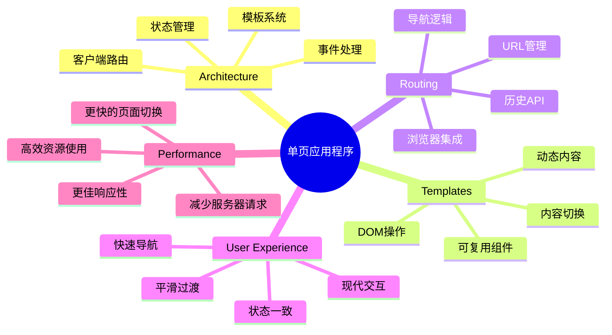
## 课前测验

[课前测验](https://ff-quizzes.netlify.app/web/quiz/41)

### 你需要准备的内容

我们需要一个本地Web服务器来测试银行应用——别担心，没你想象的难！如果你还没有配置，只需安装 [Node.js](https://nodejs.org) 并在项目文件夹运行 `npx lite-server`。这个命令会启动本地服务器并自动在浏览器打开应用。

### 准备工作

在你的电脑上创建一个名为 `bank` 的文件夹，里面放一个名为 `index.html` 的文件。我们将从这个HTML [模板](https://en.wikipedia.org/wiki/Boilerplate_code)开始：

```html
<!DOCTYPE html>
<html lang="en">
  <head>
    <meta charset="UTF-8">
    <meta name="viewport" content="width=device-width, initial-scale=1.0">
    <title>Bank App</title>
  </head>
  <body>

  </body>
</html>
```

**这个模板提供了：**
- **建立** 正确DOCTYPE声明的HTML5文档结构
- **设置** 字符编码为UTF-8以支持国际文本
- **启用** 响应式设计，使用viewport元标签兼容移动设备
- **设定** 浏览器标签页显示的描述性标题
- **创建** 一个干净的主体部分，用于构建应用

> 📁 **项目结构预览**
>
> **完成此课时后，项目将包含：**
> ```
> bank/
> ├── index.html
> ├── app.js
> └── style.css
> ```
>
> **文件职责：**
> - **index.html**：包含所有模板和应用结构
> - **app.js**：负责路由、导航和模板管理
> - **模板**：定义登录、仪表盘及其他屏幕的UI

## HTML模板

模板解决了Web开发中的一个根本问题。古腾堡在1440年代发明活字印刷时意识到，与其刻画整页，他可以制作可复用的字母块并按需排列。HTML模板原理相同——不为每个屏幕创建单独HTML文件，而是定义可复用结构，按需显示。

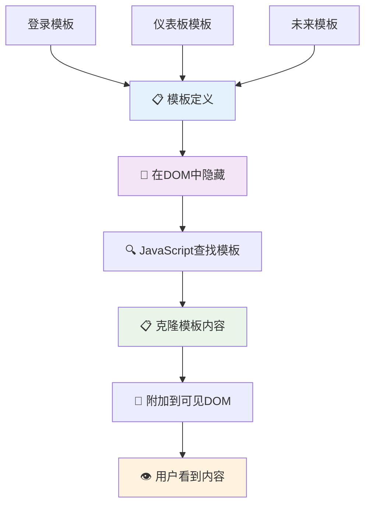
把模板看作应用不同部分的蓝图。就像建筑师绘制一个蓝图多次使用，而不是重复绘制相同房间，我们创建模板一次，按需实例化。浏览器会将这些模板隐藏，直到JavaScript激活它们。

如果想为网页创建多个屏幕，一种办法是每个屏幕一个HTML文件。然而，这样做有不便：

- 切换屏幕时必须重新加载整个HTML，速度较慢
- 不同屏幕间共享数据困难

另一种方法是只用一个HTML文件，通过 `<template>` 元素定义多个 [HTML模板](https://developer.mozilla.org/docs/Web/HTML/Element/template)。模板是一个复用的HTML块，浏览器不显示，需使用JavaScript在运行时实例化。

### 我们开始构建

我们要创建一个包含两个主要屏幕的银行应用：登录页和仪表盘。首先，在HTML body中添加一个占位元素——所有不同屏幕将显示于此：

```html
<div id="app">Loading...</div>
```

**理解这个占位符：**
- **创建** 一个ID为“app”的容器，将显示所有屏幕
- **显示** 加载消息，直到JavaScript初始化第一个屏幕
- **提供** 动态内容的唯一挂载点
- **便于** JavaScript 使用 `document.getElementById()` 访问

> 💡 **专业提示**: 由于该元素内容将被替换，可以放置加载消息或指示器，应用加载时显示。

接下来，在HTML模板下方添加登录页的模板。暂时只放置一个标题和一个包含用于导航的链接的部分。

```html
<template id="login">
  <h1>Bank App</h1>
  <section>
    <a href="/dashboard">Login</a>
  </section>
</template>
```

**分析此登录模板：**
- **定义** ID为“login”的模板，便于JavaScript定位
- **包含** 一个主标题，确立应用品牌
- **用** 语义化的 `<section>` 元素分组相关内容
- **提供** 导航链接，引导用户跳转仪表盘

然后，添加仪表盘的另一个HTML模板。此页面包含几个部分：

- 带标题和注销链接的页眉
- 当前银行账户余额
- 一个使用表格展示的交易列表

```html
<template id="dashboard">
  <header>
    <h1>Bank App</h1>
    <a href="/login">Logout</a>
  </header>
  <section>
    Balance: 100$
  </section>
  <section>
    <h2>Transactions</h2>
    <table>
      <thead>
        <tr>
          <th>Date</th>
          <th>Object</th>
          <th>Amount</th>
        </tr>
      </thead>
      <tbody></tbody>
    </table>
  </section>
</template>
```

**理解此仪表盘各部分：**
- **用** 语义 `<header>` 元素组织页面及导航
- **显示** 跨屏幕一致的应用标题，强化品牌
- **提供** 返回登录页的注销链接
- **展示** 专门区域内的当前账户余额
- **使用** 结构化的HTML表格组织交易数据
- **定义** 日期、对象和金额三栏表头
- **留空** 表体，待后续动态注入内容

> 💡 **专业提示**：创建HTML模板时，若想预览外观，可以将 `<template>` 和 `</template>` 标签注释掉，使用 `` 包围。

### 🔄 **教学小检验**
**模板系统理解**：在实现JavaScript前，确保你了解：
- ✅ 模板与普通HTML元素的区别
- ✅ 模板为何在JavaScript激活前保持隐藏
- ✅ 语义化HTML结构在模板中的重要性
- ✅ 模板如何支持可复用UI组件

**快速自测**：若移除HTML外围的 `<template>` 标记会怎样？
*答：内容立即可见，却失去模板功能*

**架构优势**：模板提供：
- **重用性**：定义一次，多次实例
- **性能**：避免重复HTML解析
- **可维护性**：UI结构集中管理
- **灵活性**：动态切换内容

✅ 为什么我们给模板加了 `id` 属性？能否用类名代替？

## 用JavaScript激活模板

现在我们需要让模板具备功能。就像3D打印机根据数字蓝图制造实体，JavaScript将我们的隐藏模板转换成用户可见且可交互的元素。

这个过程有三个一致步骤，形成了现代Web开发的基础。掌握此模式，你会在各框架和库中见到。

若在浏览器打开当前HTML文件，屏幕会一直显示“Loading...”，因为我们还没添加JavaScript来实例化并显示HTML模板。

实例化模板通常分三步：

1. 使用 [`document.getElementById`](https://developer.mozilla.org/docs/Web/API/Document/getElementById) 获取DOM中的模板元素。
2. 使用 [`cloneNode`](https://developer.mozilla.org/docs/Web/API/Node/cloneNode) 复制模板内容。
3. 使用 [`appendChild`](https://developer.mozilla.org/docs/Web/API/Node/appendChild) 将复制的内容附加到可见DOM元素。

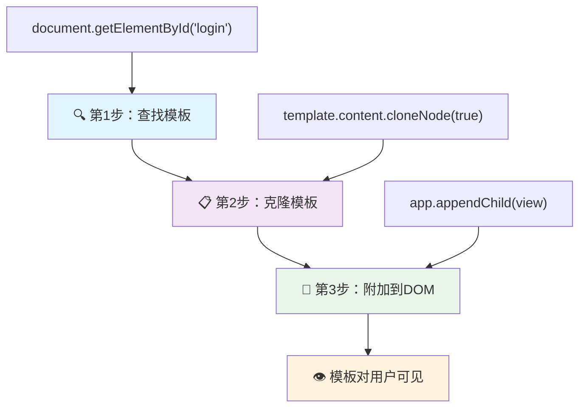
**过程视觉分解：**
- **第一步** 定位隐藏在DOM中的模板
- **第二步** 创建可安全修改的工作副本
- **第三步** 将副本插入可见页面区域
- **结果** 为用户提供可交互的功能屏幕

✅ 为什么需要在附加到DOM前克隆模板？若跳过这步会怎样？

### 任务

在项目文件夹内创建一个新文件 `app.js`，并在HTML `<head>` 中引入它：

```html
<script src="app.js" defer></script>
```

**理解此脚本引入：**
- **关联** JavaScript文件至HTML文档
- **使用** `defer` 属性确保脚本在HTML解析完成后执行
- **允许** 脚本执行时所有DOM元素已加载
- **遵循** 现代最佳脚本加载及性能实践

接下来在 `app.js` 中创建一个新函数 `updateRoute`：

```js
function updateRoute(templateId) {
  const template = document.getElementById(templateId);
  const view = template.content.cloneNode(true);
  const app = document.getElementById('app');
  app.innerHTML = '';
  app.appendChild(view);
}
```

**逐步解析：**
- **通过唯一ID定位** 模板元素
- **使用** `cloneNode(true)` 深拷贝模板内容
- **定位** 应用容器，用于显示内容
- **清空** 应用容器已有内容
- **插入** 克隆后的模板内容至可见DOM

调用此函数，传入其中一个模板ID，看看结果。

```js
updateRoute('login');
```

**函数调用做了什么：**
- **激活** 传入的登录模板ID对应模板
- **展示** 如何程序化切换应用不同屏幕
- **将“Loading...”替换成登录界面**

✅ 代码中的 `app.innerHTML = '';` 是做什么的？没有它会怎样？

## 创建路由

路由本质上是把URL与正确内容连接起来。想想早期电话接线员如何使用配线板连接电话——他们接受请求并转接至正确目标。Web路由也类似，根据URL请求决定展示何内容。

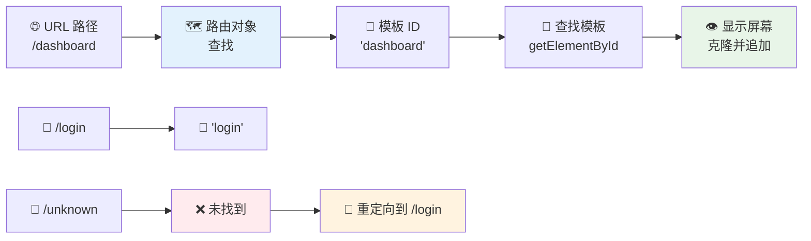
传统上，Web服务器通过不同HTML文件响应不同URL。我们构建的是单页面应用，需用JavaScript自主管理路由。这样我们能更好地控制用户体验和性能。


**理解路由流程：**
- **URL变更** 触发查看路由配置
- **有效路由** 映射至特定模板ID渲染
- **无效路由** 触发回退行为，避免错误状态
- **模板渲染** 按照之前学的三步完成

在Web应用中，*路由*指意图将**URL**映射到应展示的特定屏幕。多HTML文件的网站会自动完成此映射，因为文件路径和URL对应。例如，假设项目有这些文件：

```
mywebsite/index.html
mywebsite/login.html
mywebsite/admin/index.html
```

若以 `mywebsite` 作为根目录运行Web服务器，URL映射将是：

```
https://site.com            --> mywebsite/index.html
https://site.com/login.html --> mywebsite/login.html
https://site.com/admin/     --> mywebsite/admin/index.html
```

不过，我们的Web应用只有一个HTML文件包含所有屏幕，默认行为不适用。我们需手动创建映射并用JavaScript更新显示的模板。

### 任务

用一个简单对象实现URL路径和模板间的[映射](https://en.wikipedia.org/wiki/Associative_array)。在`app.js`文件顶部添加此对象。

```js
const routes = {
  '/login': { templateId: 'login' },
  '/dashboard': { templateId: 'dashboard' },
};
```

**理解此路由配置：**
- **定义** URL路径至模板ID的映射关系
- **使用** 对象语法，键为URL路径，值为模板信息
- **方便** 对任意URL快速查找对应模板
- **提供** 未来添加新路由的可扩展结构
现在让我们稍微修改一下 `updateRoute` 函数。不是直接将 `templateId` 作为参数传递，而是先查看当前的 URL，然后使用我们的映射关系来获取相应的模板 ID。我们可以使用 [`window.location.pathname`](https://developer.mozilla.org/docs/Web/API/Location/pathname) 来仅获取 URL 中的路径部分。

```js
function updateRoute() {
  const path = window.location.pathname;
  const route = routes[path];

  const template = document.getElementById(route.templateId);
  const view = template.content.cloneNode(true);
  const app = document.getElementById('app');
  app.innerHTML = '';
  app.appendChild(view);
}
```

**解析这里发生的事情：**
- **提取** 浏览器 URL 中当前的路径，使用 `window.location.pathname`
- **查找** 在我们的 routes 对象中对应的路由配置
- **获取** 路由配置中的模板 ID
- **遵循** 之前相同的模板渲染过程
- **创建** 一个响应 URL 变化的动态系统

这里我们将声明的路由映射到对应的模板。你可以通过手动更改浏览器中的 URL 来尝试检验其是否正确工作。

✅ 如果你在 URL 中输入一个未知路径会发生什么？我们该如何解决这个问题？

## 添加导航

有了路由，用户需要一种方式在应用内导航。传统网站点击链接时会重新加载整个页面，但我们希望在不刷新页面的情况下同时更新 URL 和内容。这会带来更流畅的体验，类似于桌面应用切换不同视图的方式。

我们需要协调两件事：更新浏览器的 URL 以便用户可以收藏页面和分享链接，以及显示恰当的内容。正确实现时，这将创建用户对现代应用所期待的无缝导航体验。

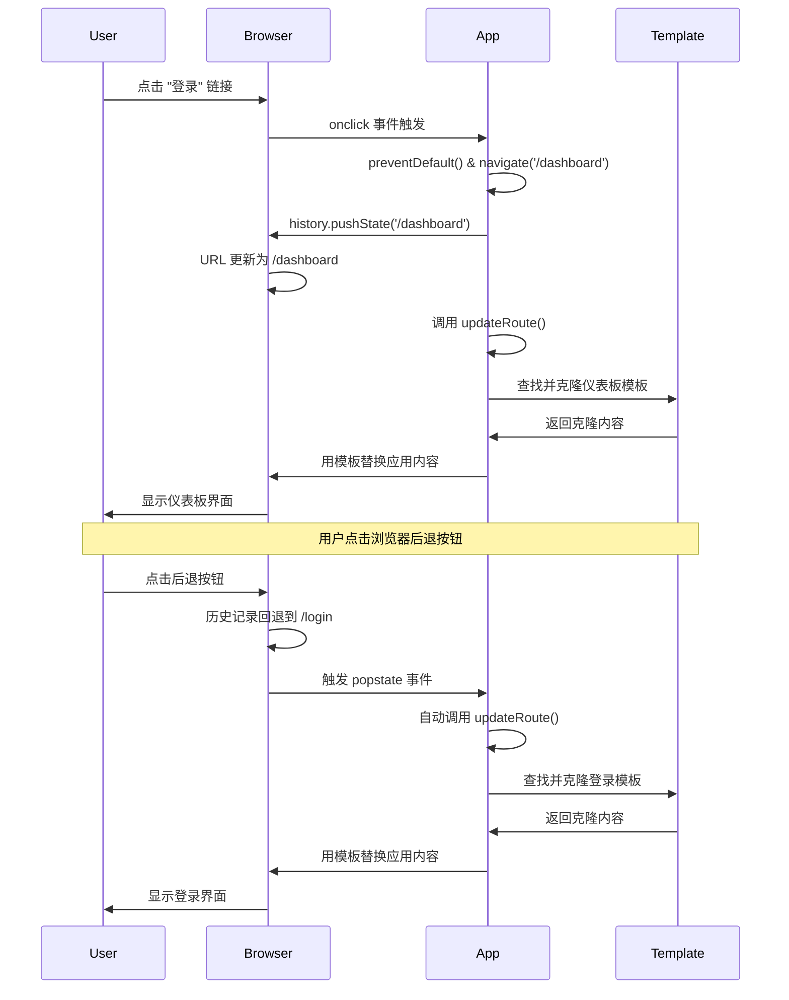
### 🔄 **教学核对点**
**单页应用架构**：验证你对完整系统的理解：
- ✅ 客户端路由与传统服务器端路由有何不同？
- ✅ History API 为什么对正确的 SPA 导航至关重要？
- ✅ 模板如何实现无刷新页面的动态内容？
- ✅ 事件处理在拦截导航中扮演什么角色？

**系统集成**：你的 SPA 展示了：
- **模板管理**：可复用的 UI 组件与动态内容
- **客户端路由**：无需服务器请求的 URL 管理
- **事件驱动架构**：响应式导航与用户交互
- **浏览器集成**：正确的历史记录和前进/后退按钮支持
- **性能优化**：快速切换，减少服务器负担

**专业模式**：你已实现：
- **模型-视图分离**：模板与应用逻辑分开
- **状态管理**：URL 状态与显示内容同步
- **渐进增强**：JavaScript 强化基础 HTML 功能
- **用户体验**：平滑类应用导航，无需刷新页面

> � **架构洞见**：导航系统组件
>
> **你构建的内容：**
> - **🔄 URL 管理**：无刷新更新浏览器地址栏
> - **📋 模板系统**：根据当前路由动态切换内容
> - **📚 历史集成**：支持浏览器前进和后退按钮
> - **🛡️ 错误处理**：无效或缺失路由时的优雅降级
>
> **组件协同工作方式：**
> - **监听** 导航事件（点击、历史变化）
> - **更新** URL，使用 History API
> - **渲染** 新路由对应的模板
> - **维持** 用户无缝体验

下一步是让我们的应用可以在不手动更改 URL 的情况下导航页面。这包括两件事：

  1. 更新当前 URL
  2. 基于新 URL 更新显示的模板

我们已经用 `updateRoute` 处理了第二部分，所以需要弄清楚如何更新当前 URL。

我们将使用 JavaScript，尤其是 [`history.pushState`](https://developer.mozilla.org/docs/Web/API/History/pushState)，它允许更新 URL 以及在浏览历史中创建新条目，而无需重新加载 HTML。

> ⚠️ **重要说明**：虽然 HTML 的锚点元素 [`<a href>`](https://developer.mozilla.org/docs/Web/HTML/Element/a) 可以用来创建指向不同 URL 的超链接，但默认行为是浏览器重新加载页面。使用自定义 JavaScript 处理路由时，必须通过点击事件的 preventDefault() 函数来阻止这种行为。

### 任务

让我们创建一个可以用来在应用内导航的新函数：

```js
function navigate(path) {
  window.history.pushState({}, path, path);
  updateRoute();
}
```

**理解导航函数的功能：**
- **更新** 浏览器 URL，使用 `history.pushState`
- **添加** 新条目到浏览器历史栈，支持前进/后退按钮
- **触发** `updateRoute()` 函数，显示对应模板
- **保持** 单页应用体验，无页面刷新

此方法先根据给定路径更新当前 URL，接着更新模板。`window.location.origin` 属性返回 URL 根地址，方便根据路径重新构建完整 URL。

既然有了这个函数，我们可以解决路径不匹配任何定义路由的问题。我们将在 `updateRoute` 函数中添加一个回退逻辑，当找不到匹配时导航至现有路由。

```js
function updateRoute() {
  const path = window.location.pathname;
  const route = routes[path];

  if (!route) {
    return navigate('/login');
  }

  const template = document.getElementById(route.templateId);
  const view = template.content.cloneNode(true);
  const app = document.getElementById('app');
  app.innerHTML = '';
  app.appendChild(view);
}
```

**关键点回顾：**
- **检查** 当前路径是否有对应路由
- **访问无效路由时，重定向** 到登录页
- **提供** 防止导航失败的回退机制
- **确保** 即使 URL 错误，用户也能看到有效页面

如果找不到路由，则重定向到 `login` 页面。

接下来创建一个函数，能够在点击链接时获取 URL，并阻止浏览器默认跳转行为：

```js
function onLinkClick(event) {
  event.preventDefault();
  navigate(event.target.href);
}
```

**解析这个点击处理函数：**
- **阻止** 浏览器默认点击链接行为，调用 `preventDefault()`
- **提取** 所点击链接元素的目标 URL
- **调用** 自定义导航函数，代替页面重载
- **保持** 平滑的单页应用体验

```html
<a href="/dashboard" onclick="onLinkClick(event)">Login</a>
...
<a href="/login" onclick="onLinkClick(event)">Logout</a>
```

**这个 onclick 绑定实现了什么：**
- **连接** 每个链接与自定义导航系统
- **将** 点击事件传递给 `onLinkClick` 函数处理
- **启用** 无刷新平滑导航
- **维持** 用户可收藏或分享的正确 URL 结构

[`onclick`](https://developer.mozilla.org/docs/Web/API/GlobalEventHandlers/onclick) 属性绑定了 `click` 事件，这里绑定的是调用 `navigate()` 函数。

试着点击这些链接，现在应该能在应用的不同界面间导航。

✅ `history.pushState` 方法是 HTML5 标准的一部分，已被[所有现代浏览器](https://caniuse.com/?search=pushState)支持。如果你为较老浏览器构建应用，有个替代方案：使用 [hash（#）](https://en.wikipedia.org/wiki/URI_fragment) 作为路径前缀，你可以实现基于常规锚点导航的路由，页面不会重载，因为其本意是创建页内锚点链接。

## 让后退和前进按钮生效

后退和前进按钮是网页浏览的基础，就像 NASA 任务控制人员可以回顾太空任务中的系统状态一样。用户期望这些按钮正常工作，不然就破坏了预期的浏览体验。

我们的单页应用需要额外配置来支持这一点。浏览器维护一个历史记录栈（我们通过 `history.pushState` 持续添加），但在用户通过历史记录导航时，应用需要对应更新显示内容。

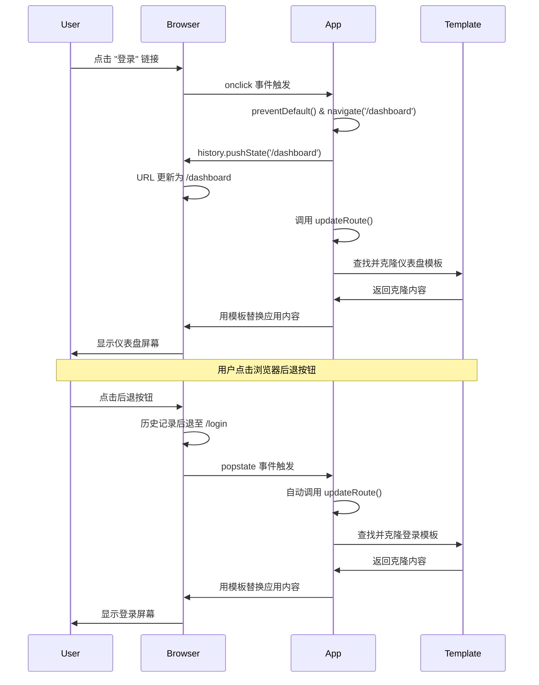
**关键交互点：**
- **用户操作** 通过点击或浏览器按钮触发导航
- **应用拦截** 链接点击，防止页面刷新
- **历史 API** 管理 URL 变化和浏览器历史栈
- **模板** 提供每个页面的内容结构
- **事件监听** 确保应用对所有导航操作响应

使用 `history.pushState` 创建了新的浏览历史条目。你可以按住浏览器的 *后退按钮* 来查看，如下图所示：

图示：浏览历史截图

如果你尝试点击后退几次，你会发现当前 URL 变化了，历史记录也更新了，但显示的模板却没有变化。

这是因为应用并不知道每当历史变化时需要调用 `updateRoute()`。查看 [`history.pushState` 文档](https://developer.mozilla.org/docs/Web/API/History/pushState) 会看到，如果状态发生变化 —— 意味着我们跳转到了不同 URL —— 会触发 [`popstate`](https://developer.mozilla.org/docs/Web/API/Window/popstate_event) 事件。我们将用它来解决这个问题。

### 任务

为了确保当浏览器历史变化时，显示的模板也会更新，我们将在 `app.js` 文件底部添加一个新函数，调用 `updateRoute()`：

```js
window.onpopstate = () => updateRoute();
updateRoute();
```

**理解历史集成：**
- **监听** 当用户通过浏览器按钮导航时触发的 `popstate` 事件
- **使用** 箭头函数简写事件处理器
- **自动调用** 每次历史状态改变就调用 `updateRoute()`
- **初始化** 页面首次加载时也调用 `updateRoute()`
- **保证** 无论用户如何导航，显示正确模板

> 💡 **专业提示**：这里我们用 [箭头函数](https://developer.mozilla.org/docs/Web/JavaScript/Reference/Functions/Arrow_functions) 简洁声明 `popstate` 事件处理器，但常规函数也同样有效。

这是一个箭头函数复习视频：

> 🎥 点击上图观看箭头函数视频。

现在尝试使用浏览器的后退和前进按钮，查看这次显示的路由是否正确更新。

### ⚡ **你可以在接下来的 5 分钟内做什么**
- [ ] 测试你的银行应用是否支持浏览器前进/后退按钮导航
- [ ] 尝试手动在地址栏输入不同的 URL 测试路由
- [ ] 打开浏览器开发者工具，查看模板如何被克隆到 DOM
- [ ] 尝试添加 console.log 来跟踪路由流程

### 🎯 **你可以在接下来的一小时内完成什么**
- [ ] 完成课后测验，理解 SPA 架构概念
- [ ] 添加 CSS 样式，让银行应用模板更专业
- [ ] 实现 404 错误页挑战，处理错误路由
- [ ] 创建鸣谢页面挑战，添加额外路由功能
- [ ] 添加加载状态和模板切换过渡动画

### 📅 **你的一周 SPA 开发路线**
- [ ] 完成包含表单、数据管理和持久化的完整银行应用
- [ ] 添加路由参数和嵌套路由等高级功能
- [ ] 实现导航守卫和基于认证的路由
- [ ] 创建可复用的模板组件和组件库
- [ ] 添加动画与过渡，提升用户体验
- [ ] 部署 SPA 至托管平台并正确配置路由

### 🌟 **你一个月的前端架构精通计划**
- [ ] 使用 React、Vue 或 Angular 构建复杂 SPA
- [ ] 学习高级状态管理模式与库
- [ ] 精通 SPA 构建工具与开发流程
- [ ] 实现渐进式 Web 应用与离线功能
- [ ] 研究大型 SPA 的性能优化技巧
- [ ] 参与开源 SPA 项目并分享经验

## 🎯 你的单页应用掌握时间线

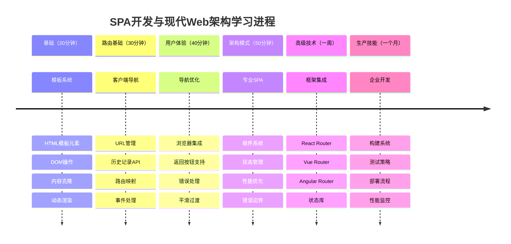
### 🛠️ 你的 SPA 开发工具总结

完成本课后，你已掌握：
- **模板架构**：可复用的 HTML 组件与动态内容渲染
- **客户端路由**：无刷新页面的 URL 管理与导航
- **浏览器集成**：History API 使用及前进/后退支持
- **事件驱动系统**：导航处理与用户交互管理
- **DOM 操作**：模板克隆、内容切换与元素管理
- **错误处理**：无效路由与缺失内容的优雅降级
- **性能模式**：高效内容加载与渲染策略

**真实应用场景**：你的 SPA 开发技能直接应用于：
- **现代网络应用**：React、Vue、Angular 等框架开发
- **渐进式 Web 应用**：支持离线和类应用体验
- **企业仪表盘**：多视图复杂业务应用
- **电子商务平台**：产品目录、购物车和结账流程
- **内容管理**：动态内容创建与编辑接口
- **移动开发**：使用 Web 技术的混合应用

**获得的职业技能**：你现在可以：
- **构建** 单页应用，合理实现关注点分离
- **实现** 可随应用复杂度扩展的客户端路由系统
- **调试** 复杂的导航流程，使用浏览器开发者工具
- **优化** 应用性能，通过高效的模板管理
- **设计** 原生且响应迅速的用户体验

**掌握的前端开发概念**：
- **组件架构**：可复用的UI模式和模板系统
- **状态同步**：URL状态管理和浏览器历史记录
- **事件驱动编程**：用户交互处理和导航
- **性能优化**：高效的DOM操作和内容加载
- **用户体验设计**：流畅的过渡和直观的导航

**下一阶段**：你已准备好探索现代前端框架、高级状态管理，或构建复杂的企业级应用！

🌟 **成就解锁**：你已使用现代网页架构模式构建了专业的单页应用基础！

## GitHub Copilot Agent 挑战 🚀

使用 Agent 模式完成以下挑战：

**描述：** 通过为无效路由实现错误处理和404页面模板，提升银行应用的用户体验，改善访问不存在页面时的表现。

**提示：** 创建一个id为 "not-found" 的新HTML模板，显示用户友好的404错误页面并附加样式。然后修改JavaScript路由逻辑，当用户导航到无效URL时显示此模板，并添加一个 “回首页” 按钮，导航回登录页。

在这里了解更多关于[agent模式](https://code.visualstudio.com/blogs/2025/02/24/introducing-copilot-agent-mode)的信息。

## 🚀 挑战

添加一个新的模板和路由，作为第三个页面，展示本应用的鸣谢内容。

**挑战目标：**
- **创建** 一个新的HTML模板，包含合适的内容结构
- **添加** 新路由至你的路由配置对象中
- **包含** 指向鸣谢页及从其返回的导航链接
- **测试** 浏览器历史下所有导航的正常工作

## 课后测验

[课后测验](https://ff-quizzes.netlify.app/web/quiz/42)

## 复习与自主学习

路由是web开发中意外复杂的部分之一，尤其随着网页从刷新行为转向单页应用的页面刷新。阅读一些关于[Azure静态网站服务](https://docs.microsoft.com/azure/static-web-apps/routes/?WT.mc_id=academic-77807-sagibbon)如何处理路由的内容。你能解释文档中描述的某些决策为什么是必要的吗？

**额外学习资源：**
- **探索** React Router 和 Vue Router 等流行框架如何实现客户端路由
- **研究** 基于哈希的路由和历史API路由的区别
- **学习** 服务器端渲染（SSR）以及它如何影响路由策略
- **调查** 渐进式网页应用（PWA）如何处理路由和导航

## 作业

[改进路由](assignment.md)

**免责声明**：
本文件由人工智能翻译服务[Co-op Translator](https://github.com/Azure/co-op-translator)翻译而成。虽然我们努力保证翻译的准确性，但请注意自动翻译可能存在错误或不准确之处。原文应被视为权威版本。对于重要信息，建议采用专业人工翻译。因使用本翻译所产生的任何误解或误释，我们不承担任何责任。

# 改进路由

## 指令

现在你已经构建了一个基本的路由系统，是时候通过专业功能来提升它，以改善用户体验并为开发者提供更好的工具。真实世界的应用不仅仅需要模板切换——它们需要动态的页面标题、生命周期钩子和可扩展的架构。

在本次作业中，你将通过实现两个在生产环境网页应用中常见的关键功能来扩展你的路由实现。这些增强功能将让你的银行应用更显完善，并为未来功能奠定基础。

当前的路由声明只包含要使用的模板 ID。但在显示新页面时，有时需要更多信息。让我们用两个额外的功能来改进路由实现：

### 功能 1：动态页面标题
**目标：** 给每个模板一个标题，并在模板更改时动态更新窗口标题。

**重要性：**
- **提升**用户体验，显示描述性的浏览器标签标题
- **增强**屏幕阅读器和辅助技术的可访问性
- **提供**更好的书签和浏览器历史上下文
- **遵循**专业的网页开发最佳实践

**实现方法：**
- **扩展** routes 对象，包含每个路由的标题信息
- **修改** `updateRoute()` 函数以动态更新 `document.title`
- **测试**在不同页面间导航时标题是否正确变化

### 功能 2：路由生命周期钩子
**目标：** 添加在模板更改后运行某些代码的选项。我们希望每次显示仪表板页面时，都在开发者控制台打印 `'Dashboard is shown'`。

**重要性：**
- **支持**特定路由加载时执行自定义逻辑
- **提供**分析、日志记录或初始化代码的钩子
- **为更复杂的路由行为奠定基础**
- **展示**网页开发中的观察者模式

**实现方法：**
- **为**路由配置添加可选的回调函数属性
- **在**模板渲染完成后执行回调函数（如果存在）
- **确保**该功能适用于任何定义了回调的路由
- **测试**访问仪表板时，控制台消息是否出现

## 评分标准

| 评判标准                | 优秀示范                                                                                                                         | 合格                                                                                                                                                                                    | 需要改进                                            |
| ----------------------- | -------------------------------------------------------------------------------------------------------------------------------- | --------------------------------------------------------------------------------------------------------------------------------------------------------------------------------------- | --------------------------------------------------- |
|                         | 两个功能均已实现且正常工作。对 `routes` 声明中新增的路由，标题和代码部分也能生效。                                              | 两个功能可用，但行为写死，无法通过 `routes` 声明进行配置。对新增包含标题和代码的第三条路由不起作用或部分起作用。                                                                       | 有一个功能缺失或工作不正常。                        |

**免责声明**：
本文件由人工智能翻译服务 [Co-op Translator](https://github.com/Azure/co-op-translator) 翻译。尽管我们力求准确，但请注意自动翻译可能包含错误或不准确之处。请以原文作为权威来源。对于重要信息，建议使用专业人工翻译。因使用本翻译所引起的任何误解或曲解，我们概不负责。

# 构建银行应用第 2 部分：构建登录和注册表单

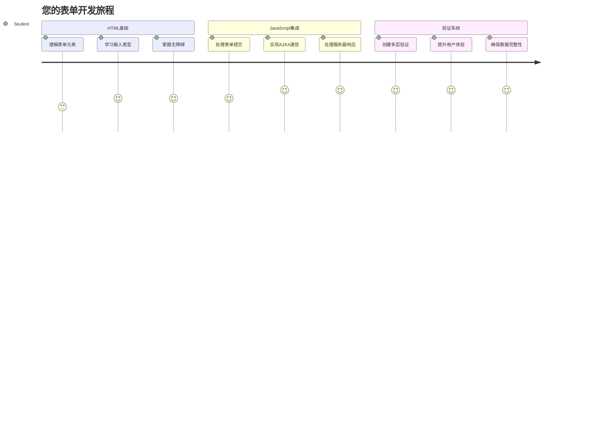
## 课前测验

[课前测验](https://ff-quizzes.netlify.app/web/quiz/43)

你有没有填写过一个在线表单，然后被拒绝电子邮件格式？或者点击提交时丢失了所有信息？我们都遇到过这些令人沮丧的经历。

表单是用户与应用功能之间的桥梁。就像空中交通管制员用来安全引导飞机到目的地的严格协议一样，设计良好的表单提供清晰的反馈，防止代价高昂的错误。而糟糕的表单则会像繁忙机场中的误传信息一样迅速驱赶用户。

在本课中，我们将把你的静态银行应用转变为交互式应用。你将学习构建能够验证用户输入、与服务器通信并提供有用反馈的表单。把它想象成构建一个控制界面，让用户能够导航你应用的各种功能。

到课程结束时，你将拥有一个完整的登录和注册系统，带有引导用户成功而非挫败的验证功能。

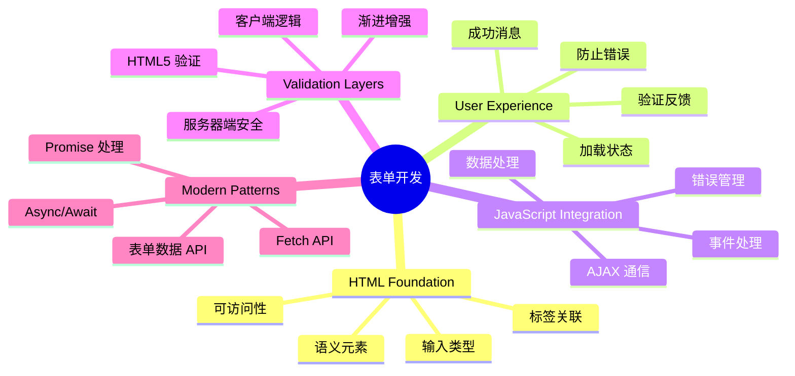
## 前置条件

在开始构建表单之前，我们先确保你已经正确配置好所有内容。本课紧接着上课内容，如果你提前跳过，可能需要回去先把基础打好。

### 必备环境设置

| 组件 | 状态 | 描述 |
|-----------|--------|-------------|
| HTML 模板 | ✅ 必须 | 你的基础银行应用结构 |
| [Node.js](https://nodejs.org) | ✅ 必须 | 服务器端的 JavaScript 运行环境 |
| 银行 API 服务器 | ✅ 必须 | 用于数据存储的后端服务 |

> 💡 **开发小贴士**：你将同时运行两个独立的服务器 —— 一个用于前端银行应用，另一个用于后端 API。这与现实开发中前后端独立运行的方式相符。

### 服务器配置

**你的开发环境包括：**
- **前端服务器**：提供你的银行应用（通常端口为 `3000`）
- **后端 API 服务器**：处理数据存储和检索（端口为 `5000`）
- **两个服务器**可同时运行且互不冲突

**测试你的 API 连接：**
```bash
curl http://localhost:5000/api
# 预期响应: "银行 API v1.0.0"
```

**如果你看到 API 版本响应，就可以继续了！**

## 理解 HTML 表单和控件

HTML 表单是用户与网页应用交流的方式。把它想象成19世纪连接遥远地点的电报系统 —— 它是用户意图和应用响应之间的通信协议。设计得当时，表单能够捕捉错误、指导输入格式并提供有用建议。

现代表单远比基本的文本输入更复杂。HTML5 引入了专门的输入类型，自动处理电子邮件验证、数字格式以及日期选择。这些改进对无障碍和移动用户体验都有好处。

### 表单必备元素

**构建每个表单都需要的基本块：**

```html

<form id="userForm" method="POST">
  <label for="username">Username</label>
  <input id="username" name="username" type="text" required>

  <button type="submit">Submit</button>
</form>
```

**这段代码实现了：**
- **创建**了带唯一标识的表单容器
- **指定**了用来提交数据的 HTTP 方法
- **通过标签关联输入**提高无障碍性
- **定义**了提交按钮用于处理表单

### 现代输入类型和属性

| 输入类型 | 功能 | 示例用法 |
|------------|---------|---------------|
| `text` | 普通文本输入 | `<input type="text" name="username">` |
| `email` | 电子邮件验证 | `<input type="email" name="email">` |
| `password` | 隐藏文本输入 | `<input type="password" name="password">` |
| `number` | 数字输入 | `<input type="number" name="balance" min="0">` |
| `tel` | 电话号码 | `<input type="tel" name="phone">` |

> 💡 **现代 HTML5 优势**：使用特定的输入类型可以提供自动验证、合适的手机键盘和更好的无障碍支持，而无需额外的 JavaScript！

### 按钮类型和行为

```html

<button type="submit">Save Data</button>
<button type="reset">Clear Form</button>
<button type="button">Custom Action</button>
```

**每种按钮类型的作用：**
- **提交按钮**：触发表单提交，将数据发送到指定端点
- **重置按钮**：将所有表单字段恢复到初始状态
- **普通按钮**：不具备默认行为，需要自定义 JavaScript 实现功能

> ⚠️ **重要提示**：`<input>` 元素是自闭合的，不需要闭合标签。现代最佳写法是不带斜杠的 `<input>`。

### 构建你的登录表单

现在让我们创建一个实用的登录表单，演示现代 HTML 表单实践。我们先从基础结构开始，逐步通过无障碍增强和验证进行完善。

```html
<template id="login">
  <h1>Bank App</h1>
  <section>
    <h2>Login</h2>
    <form id="loginForm" novalidate>

        <label for="username">Username</label>
        <input id="username" name="user" type="text" required
               autocomplete="username" placeholder="Enter your username">

      <button type="submit">Login</button>
    </form>
  </section>
</template>
```

**这里的实现细节包括：**
- **使用语义化 HTML5 元素**结构表单
- **用带有有意义类名的 div 容器**分组相关元素
- **使用 `for` 和 `id` 属性**关联标签和输入
- **使用现代属性**如 `autocomplete` 和 `placeholder` 优化用户体验
- **加上 `novalidate`**以便用 JavaScript 控制验证，而非浏览器默认

### 正确标签的重要性

**为什么标签对现代网页开发很重要：**

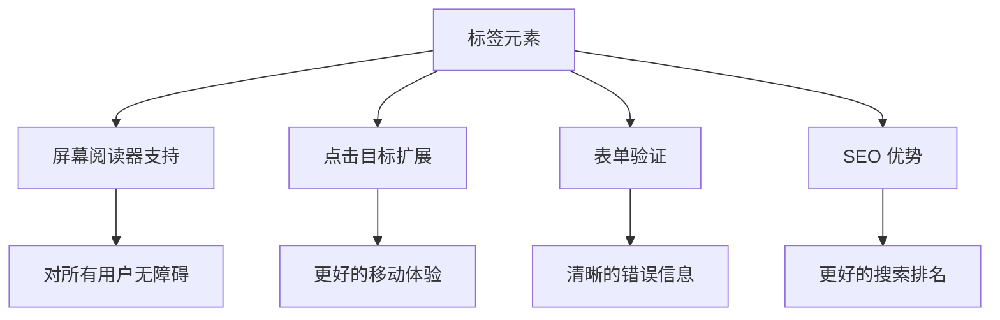
**正确标签的成效：**
- **帮助屏幕阅读器清晰朗读表单字段**
- **扩大可点击区域（点击标签聚焦输入框）**
- **改善移动端使用体验，增加触控目标大小**
- **支持带有含义的错误消息的表单验证**
- **通过语义化增强 SEO**

> 🎯 **无障碍目标**：每个表单输入都应关联标签。这个简单的做法让你的表单对所有用户（包括残障用户）都更友好，也提升整体用户体验。

### 创建注册表单

注册表单需要更详细的信息来创建完整账户。我们用现代 HTML5 特性和增强的无障碍来构建它。

```html
<hr/>
<h2>Register</h2>
<form id="registerForm" novalidate>

    <label for="user">Username</label>
    <input id="user" name="user" type="text" required
           autocomplete="username" placeholder="Choose a username">

    <label for="currency">Currency</label>
    <input id="currency" name="currency" type="text" value="$"
           required maxlength="3" placeholder="USD, EUR, etc.">

    <label for="description">Account Description</label>
    <input id="description" name="description" type="text"
           maxlength="100" placeholder="Personal savings, checking, etc.">

    <label for="balance">Starting Balance</label>
    <input id="balance" name="balance" type="number" value="0"
           min="0" step="0.01" placeholder="0.00">

  <button type="submit">Create Account</button>
</form>
```

**上述实现中我们：**
- **用容器 div 组织每个字段**以便更好地样式布局
- **添加适当的 `autocomplete` 属性**支持浏览器自动填充
- **包含有用的占位文本**引导用户输入
- **设定合理的默认值**通过 `value` 属性
- **使用验证属性**如 `required`、`maxlength` 和 `min`
- **对余额字段使用 `type="number"`**并支持小数

### 探索输入类型和行为

**现代输入类型提供更多功能：**

| 功能 | 优势 | 示例 |
|---------|---------|----------|
| `type="number"` | 手机数字键盘 | 余额输入更便捷 |
| `step="0.01"` | 控制小数精度 | 允许货币分角输入 |
| `autocomplete` | 浏览器自动填充 | 表单填写更快 |
| `placeholder` | 上下文提示 | 指导用户预期 |

> 🎯 **无障碍挑战**：试着只用键盘导航表单！用 `Tab` 在字段间切换，`Space` 选中复选框，`Enter` 提交。这能帮助你理解屏幕阅读器用户如何交互。

### 🔄 **教学检查**
**表单基础理解**：在用 JavaScript 实现之前，确保你理解：
- ✅ 语义化 HTML 如何构建无障碍表单结构
- ✅ 输入类型为什么影响手机键盘和验证
- ✅ 标签和表单控件的关系
- ✅ 表单属性如何影响浏览器默认行为

**快速自测**：如果没有 JavaScript 处理，提交表单会发生什么？
*回答：浏览器会执行默认提交，通常重定向到 action URL*

**HTML5 表单优势**：现代表单提供：
- **内置验证**：自动检查电子邮件和数字格式
- **移动优化**：为不同输入类型提供合适键盘
- **无障碍支持**：屏幕阅读器和键盘导航支持
- **渐进增强**：即使禁用 JavaScript 也能正常工作

## 理解表单提交方法

当有人填写你的表单并点击提交时，数据需要发送到某处 —— 通常是服务器来保存它。实现方式有几种，知道选用哪一种可以避免日后麻烦。

让我们看看点击提交按钮时到底发生了什么。

### 表单默认行为

先观察基本表单提交时的情况：

**测试你当前的表单：**
1. 点击你的表单中的*注册*按钮
2. 观察浏览器地址栏的变化
3. 注意页面如何重新加载，数据出现在 URL 中

图示：点击注册按钮后浏览器 URL 变化截图

### HTTP 方法对比

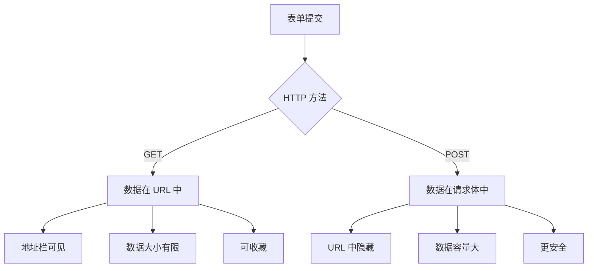
**理解差异：**

| 方法 | 使用场景 | 数据位置 | 安全级别 | 大小限制 |
|--------|----------|---------------|----------------|-------------|
| `GET` | 搜索查询、过滤 | URL 参数 | 低（可见） | 约 2000 字符 |
| `POST` | 用户账户、敏感数据 | 请求体 | 较高（隐藏） | 无实际限制 |

**基本差别理解：**
- **GET**：将表单数据附加在 URL 上作为查询参数（适用于搜索类操作）
- **POST**：将数据放在请求体中（敏感信息必用）
- **GET 限制**：体积限制，数据可见，会存入浏览器历史
- **POST 优势**：容量大，私密，支持文件上传

> 💡 **最佳实践**：搜索窗和过滤用 `GET`，用户注册、登录及数据创建用 `POST`。

### 配置表单提交

让我们配置注册表单，使用 POST 方法正确与后端 API 通信：

```html
<form id="registerForm" action="//localhost:5000/api/accounts"
      method="POST" novalidate>
```

**配置作用：**
- **指向**你的 API 端点提交数据
- **使用** POST 方法保证数据安全传输
- **包含** `novalidate` 用于 JavaScript 验证控制

### 测试表单提交

**测试表单提交步骤：**
1. **填写**你的注册表单信息
2. **点击**“创建账户”按钮
3. **观察**浏览器中的服务器响应

图示：浏览器窗口访问 localhost:5000/api/accounts，显示包含用户数据的 JSON 字符串

**你应该看到：**
- **浏览器跳转到 API 端点 URL**
- **返回包含你新建账户数据的 JSON 响应**
- **服务器确认账户创建成功**

> 🧪 **实验时间**：尝试用相同的用户名再次注册。服务器返回什么响应？这帮助你了解服务器如何处理重复数据和错误情况。

### 理解 JSON 响应

**服务器成功处理你的表单时：**
```json
{
  "user": "john_doe",
  "currency": "$",
  "description": "Personal savings",
  "balance": 100,
  "id": "unique_account_id"
}
```

**响应显示：**
- **创建了**一个带你指定数据的新账户
- **分配了**唯一标识符方便后续引用
- **返回了**所有账户信息以供验证
- **表明**数据库已成功保存

## 使用 JavaScript 进行现代表单处理

传统表单提交会导致整页刷新，就像早期太空任务需要整体重启系统来调整轨道。这会破坏用户体验，丢失应用状态。

JavaScript 表单处理则像现代航天器的连续导航系统 —— 实时调整而不会丢失导航上下文。我们可以拦截表单提交，立即反馈，优雅处理错误，基于服务器响应更新界面，同时保持用户在应用中的位置。

### 为什么避免页面刷新？

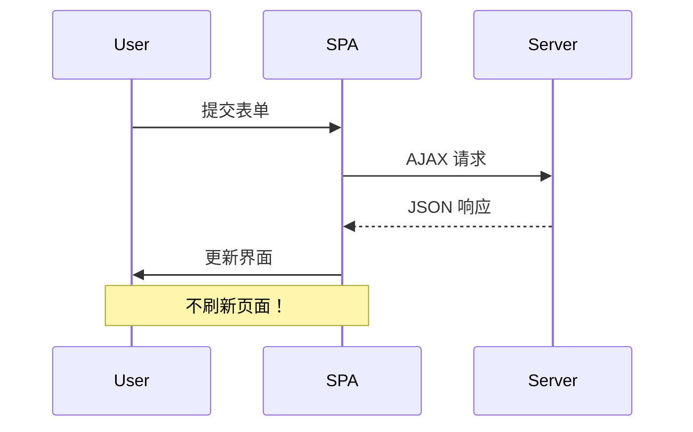
**JavaScript 表单处理带来的好处：**
- **保持**应用状态和用户上下文
- **提供**即时反馈和加载指示
- **支持**动态错误处理和验证
- **创造**流畅的类似应用体验
- **允许**基于服务器响应的条件逻辑

### 从传统到现代表单的转变

**传统方式的问题：**
- **将用户重定向**离开你的应用
- **丢失**当前的应用状态和上下文
- **需要**完整页面刷新处理简单操作
- **反馈控制有限**

**现代 JavaScript 方式优势：**
- **用户始终停留**在你的应用内
- **保留**全部应用状态和数据
- **支持**实时验证和反馈
- **促进**渐进增强和无障碍支持

### 实现 JavaScript 表单处理

让我们用现代 JavaScript 事件处理替换传统表单提交：

```html

<form id="registerForm" method="POST" novalidate>
```

**把注册逻辑加到你的 `app.js` 文件中：**

```javascript
// 现代事件驱动的表单处理
function register() {
  const registerForm = document.getElementById('registerForm');
  const formData = new FormData(registerForm);
  const data = Object.fromEntries(formData);
  const jsonData = JSON.stringify(data);

  console.log('Form data prepared:', data);
}

// 页面加载时附加事件监听器
document.addEventListener('DOMContentLoaded', () => {
  const registerForm = document.getElementById('registerForm');
  registerForm.addEventListener('submit', (event) => {
    event.preventDefault(); // 阻止默认的表单提交
    register();
  });
});
```

**这里实现了：**
- **使用 `event.preventDefault()`**阻止默认提交行为
- **用现代 DOM 选择获取表单元素**
- **用强大的 `FormData` API 提取表单数据**
- **用 `Object.fromEntries()` 将 FormData 转换为普通对象**
- **序列化数据为 JSON 格式，方便传给服务器**
- **输出处理后的数据用于调试和验证**

### 理解 FormData API

**FormData API 提供强大的表单处理能力：**
```javascript
// FormData捕获内容的示例
const formData = new FormData(registerForm);

// FormData自动捕获：
// {
//   "user": "john_doe",
//   "currency": "¥",
//   "description": "个人账户",
//   "balance": "100"
// }
```

**FormData API 优势：**
- **全面收集**：捕获所有表单元素，包括文本、文件和复杂输入
- **类型感知**：自动处理不同输入类型，无需自定义编码
- **高效**：通过单个 API 调用消除手动字段收集
- **适应性强**：表单结构变化时仍能保持功能

### 创建服务器通信函数

现在让我们使用现代 JavaScript 模式构建一个与 API 服务器通信的强大函数：

```javascript
async function createAccount(account) {
  try {
    const response = await fetch('//localhost:5000/api/accounts', {
      method: 'POST',
      headers: {
        'Content-Type': 'application/json',
        'Accept': 'application/json'
      },
      body: account
    });

    // 检查响应是否成功
    if (!response.ok) {
      throw new Error(`HTTP error! status: ${response.status}`);
    }

    return await response.json();
  } catch (error) {
    console.error('Account creation failed:', error);
    return { error: error.message || 'Network error occurred' };
  }
}
```

**理解异步 JavaScript：**

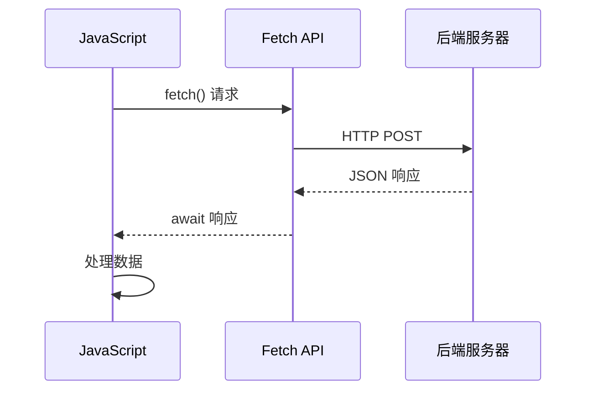
**此现代实现达成的效果：**
- **使用** `async/await` 实现可读的异步代码
- **包含** 使用 try/catch 块的适当错误处理
- **检查** 响应状态后再处理数据
- **设置** 适合 JSON 通信的请求头
- **提供** 详细的错误消息以便调试
- **返回** 成功和错误情况下的一致数据结构

### 现代 Fetch API 的强大功能

**Fetch API 相较旧方法的优势：**

| 功能 | 优点 | 实现方式 |
|---------|---------|----------------|
| 基于 Promise | 清晰的异步代码 | `await fetch()` |
| 请求自定义 | 完全控制 HTTP | 头信息、方法、请求体 |
| 响应处理 | 灵活的数据解析 | `.json()`, `.text()`, `.blob()` |
| 错误处理 | 全面捕获错误 | Try/catch 块 |

> 🎥 **了解更多**：[Async/Await 教程](https://youtube.com/watch?v=YwmlRkrxvkk) - 理解现代 Web 开发的异步 JavaScript 模式。

**服务器通信关键概念：**
- **异步函数** 允许暂停执行以等待服务器响应
- **Await 关键字** 使异步代码看起来像同步代码
- **Fetch API** 提供现代的基于 Promise 的 HTTP 请求
- **错误处理** 确保应用对网络问题做出优雅响应

### 完善注册函数

让我们将所有内容整合，打造一个完整、适合生产环境的注册函数：

```javascript
async function register() {
  const registerForm = document.getElementById('registerForm');
  const submitButton = registerForm.querySelector('button[type="submit"]');

  try {
    // 显示加载状态
    submitButton.disabled = true;
    submitButton.textContent = 'Creating Account...';

    // 处理表单数据
    const formData = new FormData(registerForm);
    const jsonData = JSON.stringify(Object.fromEntries(formData));

    // 发送到服务器
    const result = await createAccount(jsonData);

    if (result.error) {
      console.error('Registration failed:', result.error);
      alert(`Registration failed: ${result.error}`);
      return;
    }

    console.log('Account created successfully!', result);
    alert(`Welcome, ${result.user}! Your account has been created.`);

    // 注册成功后重置表单
    registerForm.reset();

  } catch (error) {
    console.error('Unexpected error:', error);
    alert('An unexpected error occurred. Please try again.');
  } finally {
    // 恢复按钮状态
    submitButton.disabled = false;
    submitButton.textContent = 'Create Account';
  }
}
```

**此增强实现包含：**
- **在表单提交时** 提供视觉反馈
- **禁用** 提交按钮以防止重复提交
- **优雅处理** 预期和非预期错误
- **显示** 用户友好的成功和错误消息
- **成功注册后** 重置表单
- **无论结果如何** 恢复 UI 状态

### 测试你的实现

**打开浏览器开发者工具并测试注册：**

1. **打开** 浏览器控制台（F12 → 控制台选项卡）
2. **填写** 注册表单
3. **点击** “创建账户”
4. **观察** 控制台信息和用户反馈

图示：浏览器控制台日志截图

**你应该看到：**
- **加载状态** 出现在提交按钮上
- **控制台日志** 显示流程详细信息
- **成功消息** 在账户创建成功后出现
- **表单自动重置** 成功提交后

> 🔒 **安全提示**：当前数据通过 HTTP 传输，生产环境不安全。实际应用中应始终使用 HTTPS 加密传输。了解更多关于 [HTTPS 安全](https://en.wikipedia.org/wiki/HTTPS) 及其对保护用户数据的重要性。

### 🔄 **教学核对**
**现代 JavaScript 集成**：验证你对异步表单处理的理解：
- ✅ `event.preventDefault()` 如何改变表单默认行为？
- ✅ 为什么 FormData API 比手动收集字段更高效？
- ✅ async/await 模式如何提升代码可读性？
- ✅ 错误处理在用户体验中起什么作用？

**系统架构**：你的表单处理展示了：
- **事件驱动编程**：表单响应用户操作，无需页面刷新
- **异步通信**：服务器请求不阻塞用户界面
- **错误处理**：网络请求失败时优雅降级
- **状态管理**：UI 根据服务器响应做出相应更新
- **渐进增强**：基础功能正常，JavaScript 提升体验

**专业模式**：你实现了：
- **单一职责**：函数目的明确且聚焦
- **错误边界**：try/catch 块防止应用崩溃
- **用户反馈**：加载状态及成功/错误提示
- **数据转换**：FormData 转 JSON 以便通信

## 全面表单验证

表单验证避免用户提交后才发现错误的挫败感。就像国际空间站的多重冗余系统一样，有效验证采用多层安全检查。

最佳方案结合了浏览器级验证（即时反馈）、JavaScript 验证（提升用户体验）和服务器端验证（安全与数据完整性）。这种冗余既确保用户满意也保护系统安全。

### 理解验证层级

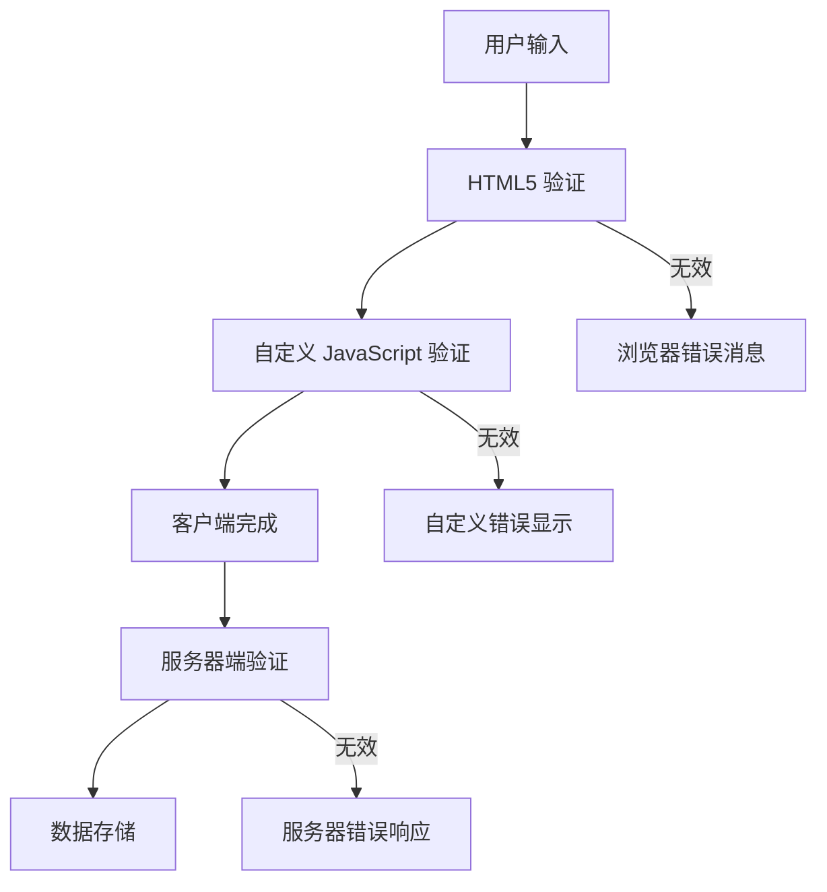
**多层验证策略：**
- **HTML5 验证**：浏览器即时检查
- **JavaScript 验证**：自定义逻辑和用户体验
- **服务器验证**：最终安全和数据完整性审核
- **渐进增强**：即使禁用 JavaScript 也能工作

### HTML5 验证属性

**你可用的现代验证工具：**

| 属性 | 作用 | 示例用法 | 浏览器行为 |
|-----------|---------|---------------|------------------|
| `required` | 必填字段 | `<input required>` | 阻止空提交 |
| `minlength`/`maxlength` | 文本长度限制 | `<input maxlength="20">` | 强制字符限制 |
| `min`/`max` | 数值范围 | `<input min="0" max="1000">` | 验证数值边界 |
| `pattern` | 自定义正则规则 | `<input pattern="[A-Za-z]+">` | 匹配特定格式 |
| `type` | 数据类型验证 | `<input type="email">` | 格式特定验证 |

### CSS 验证样式

**创建验证状态视觉反馈：**

```css
/* Valid input styling */
input:valid {
  border-color: #28a745;
  background-color: #f8fff9;
}

/* Invalid input styling */
input:invalid {
  border-color: #dc3545;
  background-color: #fff5f5;
}

/* Focus states for better accessibility */
input:focus:valid {
  box-shadow: 0 0 0 0.2rem rgba(40, 167, 69, 0.25);
}

input:focus:invalid {
  box-shadow: 0 0 0 0.2rem rgba(220, 53, 69, 0.25);
}
```

**这些视觉提示达成的效果：**
- **绿色边框**：表示验证成功，如航控中心的绿灯
- **红色边框**：提示需要注意的验证错误
- **焦点高亮**：清晰指示当前输入位置
- **一致样式**：建立用户易学的界面模式

> 💡 **专业建议**：利用 `:valid` 和 `:invalid` CSS 伪类，用户输入时即时反馈，营造响应式且友好的界面。

### 实现全面验证

让我们为你的注册表单增强强健的验证，提供优秀的用户体验和数据质量：

```html
<form id="registerForm" method="POST" novalidate>

    <label for="user">Username <span class="required">*</span></label>
    <input id="user" name="user" type="text" required
           minlength="3" maxlength="20"
           pattern="[a-zA-Z0-9_]+"
           autocomplete="username"
           title="Username must be 3-20 characters, letters, numbers, and underscores only">
    <small class="form-text">Choose a unique username (3-20 characters)</small>

    <label for="currency">Currency <span class="required">*</span></label>
    <input id="currency" name="currency" type="text" required
           value="$" maxlength="3"
           pattern="[A-Z$€£¥₹]+"
           title="Enter a valid currency symbol or code">
    <small class="form-text">Currency symbol (e.g., $, €, £)</small>

    <label for="description">Account Description</label>
    <input id="description" name="description" type="text"
           maxlength="100"
           placeholder="Personal savings, checking, etc.">
    <small class="form-text">Optional description (up to 100 characters)</small>

    <label for="balance">Starting Balance</label>
    <input id="balance" name="balance" type="number"
           value="0" min="0" step="0.01"
           title="Enter a positive number for your starting balance">
    <small class="form-text">Initial account balance (minimum $0.00)</small>

  <button type="submit">Create Account</button>
</form>
```

**理解增强验证：**
- **结合** 必填字段标记和有用描述
- **包含** 用于格式验证的 `pattern` 属性
- **提供** 辅助无障碍和提示的 `title` 属性
- **添加** 辅助文本引导用户输入
- **使用** 语义化 HTML 结构提升可访问性

### 高级验证规则

**各验证规则效果：**

| 字段 | 验证规则 | 用户益处 |
|-------|------------------|--------------|
| 用户名 | `required`, `minlength="3"`, `maxlength="20"`, `pattern="[a-zA-Z0-9_]+"` | 确保有效且唯一标识 |
| 货币 | `required`, `maxlength="3"`, `pattern="[A-Z$€£¥₹]+"` | 接受常见货币符号 |
| 余额 | `min="0"`, `step="0.01"`, `type="number"` | 防止负余额 |
| 描述 | `maxlength="100"` | 合理长度限制 |

### 测试验证行为

**尝试以下验证场景：**
1. **提交** 空的必填字段
2. **输入** 少于3个字符的用户名
3. **尝试** 在用户名字段使用特殊字符
4. **输入** 负余额数值

图示：尝试提交表单时显示验证错误截图

**你会看到：**
- **浏览器显示** 原生验证消息
- **样式根据** `:valid` 和 `:invalid` 状态变化
- **验证未通过时** 阻止表单提交
- **焦点自动** 跳转至第一个无效字段

### 客户端与服务器端验证

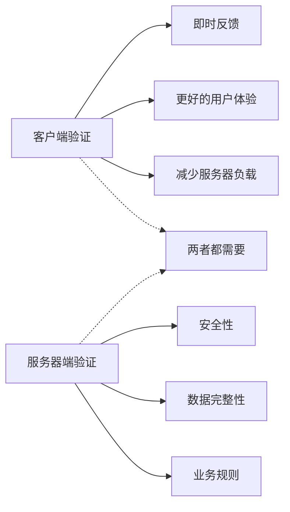
**为何需要两层验证：**
- **客户端验证**：即时反馈，提升用户体验
- **服务器验证**：确保安全，处理复杂业务规则
- **结合方案**：打造强大、友好且安全的应用
- **渐进增强**：即使禁用 JavaScript 也能运行

> 🛡️ **安全提醒**：切勿仅信任客户端验证！恶意用户可绕过客户端检查，服务器验证对于安全与数据完整性至关重要。

### ⚡ **未来 5 分钟能做什么**
- [ ] 用无效数据测试表单，查看验证消息
- [ ] 禁用 JavaScript 提交表单，体验 HTML5 验证
- [ ] 打开浏览器开发者工具检查发送给服务器的表单数据
- [ ] 试用不同输入类型，观察移动设备键盘变化

### 🎯 **这个小时可达成的目标**
- [ ] 完成课后测验，理解表单处理概念
- [ ] 实现带即时反馈的全面验证挑战
- [ ] 添加 CSS 样式，制作专业表单外观
- [ ] 创建用户名重复和服务器错误的错误处理
- [ ] 添加密码确认字段并实现匹配验证

### 📅 **你的为期一周的表单精通之旅**
- [ ] 完成包含高级表单功能的银行应用
- [ ] 实现头像或文件的上传功能
- [ ] 添加带进度指示和状态管理的多步表单
- [ ] 创建根据用户选择动态调整的表单
- [ ] 实现表单自动保存与恢复优化用户体验
- [ ] 添加高级验证，例如邮箱验证和手机号格式

### 🌟 **你为期一月的前端开发精通**
- [ ] 构建含条件逻辑和工作流的复杂表单应用
- [ ] 学习表单库和框架实现快速开发
- [ ] 精通无障碍指导和包容性设计原则
- [ ] 实现全球表单的国际化、本地化支持
- [ ] 制作可复用表单组件库和设计系统
- [ ] 参与开源表单项目，分享最佳实践

## 🎯 你的表单开发精通时间线

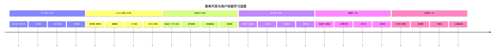
### 🛠️ 你的表单开发工具包总结

完成本课后，你已精通：
- **HTML5 表单**：语义结构、输入类型、无障碍功能
- **JavaScript 表单处理**：事件管理、数据收集和 AJAX 通信
- **验证架构**：多层验证保障安全和用户体验
- **异步编程**：现代 fetch API 与 async/await 模式
- **错误管理**：全面错误处理和用户反馈系统
- **用户体验设计**：加载状态、成功消息和错误恢复
- **渐进增强**：表单兼容所有浏览器和功能

**实际应用领域**：你的表单开发技能可直接应用于：
- **电子商务应用**：结账流程、账户注册、支付表单
- **企业软件**：数据录入、报告界面、工作流应用
- **内容管理**：发布平台、用户生成内容、管理界面
- **金融应用**：银行界面、投资平台、交易系统
- **医疗系统**：患者门户、预约安排、病历表单
- **教育平台**：课程注册、评估工具、学习管理

**获得的专业技能**：你现在可以：
- **设计** 适合所有用户（包括有障碍用户）的无障碍表单
- **实现** 安全的表单验证，防止数据破坏和安全漏洞
- **创建** 响应式用户界面，提供清晰反馈和指导
- **调试** 利用浏览器开发工具和网络分析处理复杂表单交互
- **优化** 通过高效的数据处理和验证策略提升表单性能

**掌握的前端开发概念**：
- **事件驱动架构**：用户交互处理和响应系统
- **异步编程**：非阻塞服务器通信与错误处理
- **数据验证**：客户端与服务器端的安全和完整性检查
- **用户体验设计**：引导用户成功的直观界面
- **无障碍工程**：适合多元用户需求的包容设计

**下一阶段**：你已准备好探索高级表单库，实现复杂验证规则，或构建企业级数据收集系统！

🌟 **成就解锁**：你已构建一个包含专业验证、错误处理和用户体验模式的完整表单处理系统！

## GitHub Copilot Agent Challenge 🚀

使用 Agent 模式完成以下挑战：

**描述：** 使用全面的客户端验证和用户反馈增强注册表单。此挑战将帮助你练习表单验证、错误处理和通过互动反馈提升用户体验。
**提示：** 为注册表单创建一个完整的表单验证系统，包括：1）用户输入时每个字段的实时验证反馈，2）出现在每个输入字段下方的自定义验证消息，3）具有匹配验证的密码确认字段，4）视觉提示（如有效字段的绿色勾号和无效字段的红色警告），5）仅当所有验证通过时才启用的提交按钮。使用 HTML5 验证属性、用于验证状态样式的 CSS 以及用于交互行为的 JavaScript。

在这里了解更多关于[agent mode](https://code.visualstudio.com/blogs/2025/02/24/introducing-copilot-agent-mode)。

## 🚀 挑战

如果用户已存在，在 HTML 中显示错误消息。

下面是经过一些样式调整后最终登录页面的示例：

图示：添加 CSS 样式后登录页面的截图

## 课后测验

[课后测验](https://ff-quizzes.netlify.app/web/quiz/44)

## 复习与自学

开发者在表单构建方面变得非常有创意，特别是在验证策略方面。通过浏览[CodePen](https://codepen.com)了解不同的表单流程；你能找到一些有趣且启发灵感的表单吗？

## 作业

[为你的银行应用设置样式](assignment.md)

**免责声明**：
本文件由AI翻译服务[Co-op Translator](https://github.com/Azure/co-op-translator)翻译完成。虽然我们致力于保证翻译的准确性，但请注意，机器翻译可能存在错误或不准确之处。原文应被视为权威版本。对于重要信息，建议采用专业人工翻译。我们不对因使用本翻译所产生的任何误解或曲解承担责任。

# 使用现代 CSS 美化你的银行应用

## 项目概述

将你的功能性银行应用转变为视觉上吸引人、专业的网页应用，使用现代 CSS 技术。你将创建一个统一的设计系统，提升用户体验，同时保持无障碍和响应式设计原则。

本任务挑战你应用当代网页设计模式，实现一致的视觉识别，并打造用户既觉得美观又直观易用的界面。

## 说明

### 第一步：设置样式表

**创建你的 CSS 基础：**

1. **创建** 一个名为 `styles.css` 的新文件于项目根目录
2. **在** `index.html` 文件中链接该样式表：
   ```html
   <link rel="stylesheet" href="styles.css">
   ```
3. **从** CSS 重置和现代默认样式开始：
   ```css
   /* Modern CSS reset and base styles */
   * {
     margin: 0;
     padding: 0;
     box-sizing: border-box;
   }

   body {
     font-family: -apple-system, BlinkMacSystemFont, 'Segoe UI', Roboto, sans-serif;
     line-height: 1.6;
     color: #333;
   }
   ```

### 第二步：设计系统要求

**实现以下核心设计元素：**

#### 颜色调色板
- **主色**：为按钮和高亮选择专业颜色
- **辅助色**：用于装饰和次要操作的互补色
- **中性色**：用于文字、边框和背景的灰色调
- **成功/错误色**：成功状态用绿色，错误用红色

#### 排版
- **标题层级**：清晰区分 H1、H2 和 H3 元素
- **正文文本**：易读字体大小（最小16px）和适当行高
- **表单标签**：清晰、无障碍的文本样式

#### 布局与间距
- **一致的间距**：使用间距刻度（8px、16px、24px、32px）
- **网格系统**：表单和内容区有序布局
- **响应式设计**：移动优先，设定断点

### 第三步：组件样式

**为以下具体组件设计样式：**

#### 表单
- **输入框**：专业边框，聚焦状态和校验样式
- **按钮**：悬停效果、禁用状态和加载指示
- **标签**：清晰定位和必填标识
- **错误信息**：明显错误样式和有用的提示信息

#### 导航
- **页头**：简洁且有品牌风格的导航区域
- **链接**：清晰的悬停状态和激活指示
- **徽标/标题**：醒目的品牌元素

#### 内容区
- **板块**：不同区域间清晰视觉分隔
- **卡片**：使用卡片布局时，包含阴影和边框
- **背景**：合理使用留白和细腻背景

### 第四步：增强功能（可选）

**可考虑实现以下高级功能：**
- **暗黑模式**：在亮色与暗色主题切换
- **动画效果**：细腻的过渡与微交互
- **加载状态**：表单提交过程的视觉反馈
- **响应式图片**：针对不同屏幕尺寸优化图片

## 设计灵感

**现代银行应用特点：**
- **简洁、极简设计**，留白充足
- **专业配色方案**（蓝色、绿色或高级中性色）
- **清晰视觉层次**，突出号召性用语按钮
- **无障碍对比度**，符合 WCAG 指南
- **移动响应式布局**，适配所有设备

## 技术要求

### CSS 组织
```css
/* 1. CSS Custom Properties (Variables) */
:root {
  --primary-color: #007bff;
  --secondary-color: #6c757d;
  /* Add more variables */
}

/* 2. Base Styles */
/* Reset, typography, general elements */

/* 3. Layout */
/* Grid, flexbox, positioning */

/* 4. Components */
/* Forms, buttons, cards */

/* 5. Utilities */
/* Helper classes, responsive utilities */

/* 6. Media Queries */
/* Responsive breakpoints */
```

### 无障碍要求
- **色彩对比度**：确保普通文本至少4.5:1比例
- **焦点指示器**：键盘导航时焦点状态明显
- **表单标签**：与输入框正确关联
- **响应式设计**：支持 320px 到 1920px 宽屏

## 评估标准

| 评估标准           | 杰出 (A)                       | 熟练 (B)                      | 发展中 (C)                   | 需改进 (F)                   |
|------------------|----------------------------|----------------------------|----------------------------|----------------------------|
| **设计系统**        | 全面实现，颜色、排版及间距一致              | 使用一致样式，设计模式清晰，视觉层次良好          | 基础样式，存在一致性问题或缺失设计元素            | 样式极少，设计不一致或冲突                  |
| **用户体验**        | 创造直观专业界面，极佳可用性与美观性           | 提供良好用户体验，导航清晰，内容易读              | 基本可用，用户体验有待提升                | 可用性差，难以导航或阅读                  |
| **技术实现**        | 使用现代 CSS 技术，代码结构良好，符合最佳实践        | 有效实现 CSS，组织合理，技术适当                  | CSS 功能正常，缺少组织或现代方法             | CSS 实现差，存在技术或浏览器兼容问题           |
| **响应式设计**       | 设计完全响应，适用于所有设备尺寸              | 响应表现良好，部分屏幕尺寸有轻微问题               | 基础响应设计，存在部分布局问题               | 不响应或移动端存在明显问题                 |
| **无障碍**          | 遵循 WCAG 指南，键盘导航和屏幕阅读器支持优秀         | 良好无障碍实践，对比和焦点明显                    | 基本考虑无障碍，部分元素缺失                 | 无障碍差，残障用户难以使用                  |

## 提交指南

**提交内容包括：**
- **styles.css**：完整样式表
- **更新后的 HTML**：所有修改的 HTML 文件
- **截图**：桌面及移动端设计效果图
- **README**：简述设计选择及配色方案

**加分项：**
- **CSS 自定义属性**，便于维护主题
- **高级 CSS 功能**，如 Grid、Flexbox 或 CSS 动画
- **性能考量**，如优化 CSS 及文件大小最小化
- **跨浏览器测试**，确保兼容多种浏览器

> 💡 **专业小贴士**：从移动端设计开始，再增强大屏体验。移动优先策略确保应用在所有设备上表现良好，并符合现代网页开发最佳实践。

**免责声明**：
本文件由人工智能翻译服务[Co-op Translator](https://github.com/Azure/co-op-translator)翻译。虽然我们力求准确，但请注意，自动翻译可能存在错误或不准确之处。应以原文作为权威来源。对于重要信息，建议采用专业人工翻译。因使用本翻译而产生的任何误解或误释，我们不承担任何责任。

# 构建银行应用 第3部分：获取和使用数据的方法

想想《星际迷航》里的企业号计算机——当皮卡德舰长询问舰船状态时，信息会瞬间出现，而不会让整个界面关闭并重新构建。那种无缝的信息流正是我们要通过动态数据获取打造的。

目前，你的银行应用就像一份印刷版报纸——信息丰富但静态。我们要把它转变成更像NASA的任务控制中心，数据持续流动并实时更新，且不会打断用户的工作流程。

你将学习如何异步与服务器通信，处理不同时间到达的数据，并将原始信息转化为对用户有意义的内容。这正是演示版本和生产就绪软件之间的区别。

## ⚡ 接下来 5 分钟你能做些什么

**忙碌开发者快速启动路径**

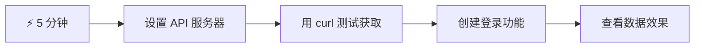
- **第1-2分钟**：启动你的API服务器（`cd api && npm start`）并测试连接
- **第3分钟**：使用 fetch 创建基础的 `getAccount()` 函数
- **第4分钟**：通过 `action="javascript:login()"` 连接登录表单
- **第5分钟**：测试登录并在控制台查看账户数据

**快速测试命令**：
```bash
# 验证API是否正在运行
curl http://localhost:5000/api

# 测试账户数据获取
curl http://localhost:5000/api/accounts/test
```

**为什么这很重要**：5分钟后，你将见识到驱动每个现代网页应用的异步数据获取的魔力。这是让应用响应迅速、生动的基础。

## 🗺️ 你的数据驱动网页应用学习之旅

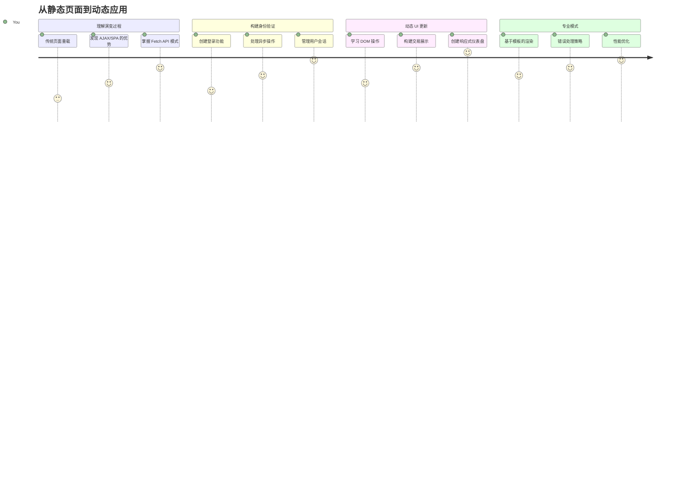
**你的目标**：完成本课后，你将理解现代网页应用如何动态获取、处理和展示数据，打造我们期望的专业无缝用户体验。

## 课前测验

[课前测验](https://ff-quizzes.netlify.app/web/quiz/45)

### 先决条件

在深入数据获取之前，确保你已经准备好以下内容：

- **之前课程**：完成登录和注册表单——我们将在此基础上构建
- **本地服务器**：安装[Node.js](https://nodejs.org)，并运行服务器API以提供账户数据
- **API连接**：使用此命令测试你的服务器连接：

```bash
curl http://localhost:5000/api
# 预期响应："Bank API v1.0.0"
```

这项快速测试确保所有组件能正常通信：
- 验证 Node.js 在系统中正常运行
- 确认API服务器处于活动状态并响应请求
- 验证你的应用可以连接上服务器（就像任务前检查无线电联系）

## 🧠 数据管理生态系统概述

```mermaid
mindmap
  root((数据管理))
    Authentication Flow
      Login Process
        表单验证
        证书验证
        会话管理
      User State
        全局账户对象
        导航守卫
        错误处理
    API Communication
      Fetch Patterns
        GET 请求
        POST 请求
        错误响应
      Data Formats
        JSON 处理
        URL 编码
        响应解析
    Dynamic UI Updates
      DOM Manipulation
        安全文本更新
        元素创建
        模板克隆
      User Experience
        实时更新
        错误信息
        加载状态
    Security Considerations
      XSS Prevention
        textContent 用法
        输入清理
        安全 HTML 创建
      CORS Handling
        跨域请求
        头配置
        开发设置
```
**核心原则**：现代网页应用是数据协调系统——它们在用户界面、服务器API和浏览器安全模型之间协作，创造流畅、响应式体验。

## 理解现代网页应用中的数据获取

网页应用处理数据的方式在过去二十年里经历了巨大变化。理解这种演变，帮助你欣赏为何现代技术如 AJAX 和 Fetch API 功能强大，且已成为网页开发者必备工具。

让我们探讨传统网站的工作方式与我们今天构建的动态、响应式应用之间的差异。

### 传统多页面应用（MPA）

在网络早期，每次点击就像切换老式电视频道——屏幕会变空白，然后慢慢调入新内容。这就是早期网页应用的现实，每次交互都意味着完全重建整页。

```mermaid
sequenceDiagram
    participant User
    participant Browser
    participant Server

    User->>Browser: 点击链接或提交表单
    Browser->>Server: 请求新的HTML页面
    Note over Browser: 页面变为空白
    Server->>Browser: 返回完整的HTML页面
    Browser->>User: 显示新页面（闪烁/重载）
```
图示：多页面应用的更新流程

**这种方式为何显得笨重：**
- 每次点击都要重新构建整页
- 页面闪烁打断用户思考
- 你的网络反复下载相同的头部和底部资源
- 应用感觉更像操作文件柜而非真正软件

### 现代单页面应用（SPA）

AJAX（异步JavaScript和XML）彻底改变了这一范式。就像国际空间站的模块化设计，宇航员可以替换单独组件，而无需重建整座结构，AJAX允许我们更新网页指定部分而不重新加载全部。尽管名字提到了XML，我们如今主要使用JSON，但核心理念是不变的：只更新需要变动的部分。

```mermaid
sequenceDiagram
    participant User
    participant Browser
    participant JavaScript
    participant Server

    User->>Browser: 与页面交互
    Browser->>JavaScript: 触发事件处理程序
    JavaScript->>Server: 仅获取所需数据
    Server->>JavaScript: 返回 JSON 数据
    JavaScript->>Browser: 更新特定页面元素
    Browser->>User: 显示更新内容（无刷新）
```
图示：单页面应用的更新流程

**为何SPA体验更佳：**
- 只更新实际变化部分（聪明吧？）
- 不再有突兀的中断，用户保持顺畅体验
- 数据传输减少，加载更迅速
- 一切感觉灵敏响应，就像手机上的应用

### 现代 Fetch API 的演进

现代浏览器提供了 [`Fetch` API](https://developer.mozilla.org/docs/Web/API/Fetch_API)，替代了旧的 [`XMLHttpRequest`](https://developer.mozilla.org/docs/Web/API/XMLHttpRequest/Using_XMLHttpRequest/)。就像电报与电子邮件的差别，Fetch API 使用 Promise 编写更清晰的异步代码，并天然支持 JSON。

| 特性 | XMLHttpRequest | Fetch API |
|---------|----------------|----------|
| **语法** | 复杂基于回调 | 清晰基于Promise |
| **JSON处理** | 需要手动解析 | 内置 `.json()` 方法 |
| **错误处理** | 错误信息有限 | 详尽的错误信息 |
| **现代支持** | 兼容旧版 | 支持ES6+ Promise和 async/await |

> 💡 **浏览器兼容性**：好消息——Fetch API 在所有现代浏览器中均可使用！如果想了解具体版本，[caniuse.com](https://caniuse.com/fetch) 上有完整兼容信息。
>
**总结：**
- Chrome、Firefox、Safari 和 Edge 等主流浏览器支持良好（用户几乎都用这些）
- 仅IE需额外适配（说实话，是时候放弃IE了）
- 完美支持我们之后将使用的优雅 async/await 模式

### 实现用户登录和数据检索

现在让我们实现登录系统，将你的银行应用从静态展示转变为功能齐全的应用。就像安全军事设施中的认证协议，我们将验证用户凭证，然后提供其专属数据访问。

我们将步骤分解，先做基础认证，再加上数据获取功能。

#### 第1步：创建登录函数基础

打开 `app.js` 文件，添加一个新的 `login` 函数，负责用户认证：

```javascript
async function login() {
  const loginForm = document.getElementById('loginForm');
  const user = loginForm.user.value;
}
```

**解析：**
- `async` 关键字表明函数可能需要等待异步操作完成
- 通过ID获取表单元素（很简单）
- 提取用户输入的用户名
- 一个小技巧：你可以通过表单控制的 `name` 属性访问它们，无需额外调用 getElementById！

> 💡 **表单访问方式**：每个表单控件均可通过其在HTML中设置的 `name` 属性，作为表单元素的属性访问。这让读取表单数据变得干净且易读。

#### 第2步：创建账户数据获取函数

接下来创建获取账户数据的专用函数。这和你注册时的函数很像，但专注于获取数据：

```javascript
async function getAccount(user) {
  try {
    const response = await fetch('//localhost:5000/api/accounts/' + encodeURIComponent(user));
    return await response.json();
  } catch (error) {
    return { error: error.message || 'Unknown error' };
  }
}
```

**实现功能：**
- 使用现代的 `fetch` API 进行异步数据请求
- 构造带用户名参数的GET请求URL
- 利用 `encodeURIComponent()` 安全编码URL中的特殊字符
- 将响应转换为JSON格式，方便操作数据
- 通过返回错误对象优雅处理异常，避免程序崩溃

> ⚠️ **安全提示**：`encodeURIComponent()` 函数用来处理URL中的特殊字符。就像海军通信中的编码系统，确保你的信息完整正确地传达，避免诸如“#”或“&”等字符被误解。
>
**意义：**
- 防止特殊字符破坏URL格式
- 防范URL操控攻击
- 确保服务器准确收到数据
- 遵守安全编码规范

#### 理解 HTTP GET 请求

这点你可能不知道：使用 `fetch` 时，如果不带额外选项，默认就是发送 [`GET`](https://developer.mozilla.org/docs/Web/HTTP/Methods/GET) 请求。这正适合我们的场景——向服务器询问用户的账户信息。

把GET请求想象成礼貌地向图书馆借书——你请求看到已存在的东西。POST请求（我们注册用的）更像是提交一本新书加入馆藏。

| GET 请求 | POST 请求 |
|-------------|-------------|
| **用途** | 获取已有数据 | 向服务器提交新数据 |
| **参数** | URL路径/查询字符串 | 请求体内 |
| **缓存** | 可被浏览器缓存 | 通常不缓存 |
| **安全性** | URL/日志可见 | 隐藏于请求体 |

```mermaid
sequenceDiagram
    participant B as 浏览器
    participant S as 服务器

    Note over B,S: GET 请求（数据获取）
    B->>S: GET /api/accounts/test
    S-->>B: 200 OK + 账户数据

    Note over B,S: POST 请求（数据提交）
    B->>S: POST /api/accounts + 新账户数据
    S-->>B: 201 已创建 + 确认信息

    Note over B,S: 错误处理
    B->>S: GET /api/accounts/nonexistent
    S-->>B: 404 未找到 + 错误信息
```
#### 第3步：将它们连接起来

现在进入令人满意的环节——将获取账户函数绑定到登录流程：

```javascript
async function login() {
  const loginForm = document.getElementById('loginForm');
  const user = loginForm.user.value;
  const data = await getAccount(user);

  if (data.error) {
    return console.log('loginError', data.error);
  }

  account = data;
  navigate('/dashboard');
}
```

函数执行流程清晰：
- 从表单输入提取用户名
- 向服务器请求该用户的账户数据
- 处理请求中可能出现的错误
- 成功时存储账户数据并跳转到仪表盘

> 🎯 **Async/Await 模式**：因为 `getAccount` 是异步的，我们使用`await`暂停执行直到服务器响应，避免继续执行时数据未定义。

#### 第4步：为账户数据创建存储空间

一旦加载了账户信息，应用需要记住它。可以把它想象成应用的短期记忆，保存当前用户数据。把这行代码加到 `app.js` 文件顶部：

```javascript
// 这保存当前用户的账户数据
let account = null;
```

**为何需要它：**
- 让账户数据在应用任何地方都能访问
- 初始为 `null` 表示“尚未登录”
- 登录或注册成功时更新内容
- 充当单一数据来源，避免登录状态混乱

#### 第5步：连接你的表单

现在把你写好的登录函数和HTML表单连起来，修改表单标签如下：

```html
<form id="loginForm" action="javascript:login()">

</form>
```

**这改动的作用：**
- 阻止表单默认的“整页重载”行为
- 改用你的自定义JavaScript函数执行
- 保持页面流畅、单页应用的感觉
- 完全掌控用户点击“登录”后的行为

#### 第6步：增强注册函数

为了保持一致，也更新你的 `register` 函数，使其存储账户数据并跳转到仪表盘：

```javascript
// 在您的注册函数末尾添加这些行
account = result;
navigate('/dashboard');
```

**该改进带来的好处：**
- 注册后无缝切换到仪表盘
- 登录和注册流程用户体验一致
- 注册成功后即可立即访问账户数据

#### 测试你的实现

```mermaid
flowchart TD
    A[用户输入凭证] --> B[调用登录功能]
    B --> C[从服务器获取账户数据]
    C --> D{数据接收成功？}
    D -->|是| E[全局存储账户数据]
    D -->|否| F[显示错误信息]
    E --> G[跳转到仪表盘]
    F --> H[用户停留在登录页面]
```
**现在动手试试：**
1. 创建新账户，确保流程正常
2. 用该账号登录测试
3. 打开浏览器控制台（F12），遇到问题查看错误
4. 确保登录成功后跳转到仪表盘

出现问题别慌！大多数错误是简单的拼写或忘了启动API服务器。

#### 关于跨源魔法的小提示

你可能好奇：“我的网页应用怎么和跑在不同端口的API服务器通信？”这个问题是每个web开发者都会遇到的。

> 🔒 **跨源安全**：浏览器强制执行“同源策略”防止未授权跨域通信。就像五角大楼的检查关卡，验证通信权限后才允许数据传输。
>
**在我们的配置中：**
- 你的网页应用运行在 `localhost:3000`（开发服务器）
- API服务器运行在 `localhost:5000`（后端服务器）
- API服务器配备了明确授权网页应用通信的 [CORS 头信息](https://developer.mozilla.org/docs/Web/HTTP/CORS)

这种配置模拟了前后端通常分开运行的实际开发环境。

> 📚 **深入了解**：使用微软学习平台的这门全面课程深化API和数据获取知识 [使用 API 发现博物馆艺术](https://docs.microsoft.com/learn/modules/use-apis-discover-museum-art/?WT.mc_id=academic-77807-sagibbon)。

## 让数据在HTML中生动起来

接下来我们将通过 DOM 操作把获取到的数据展示给用户。就像暗房冲洗照片的过程，将不可见的数据变成用户可见可交互的内容。
DOM 操作是一种将静态网页转换为动态应用的技术，能够根据用户交互和服务器响应更新其内容。

### 选择合适的工具

在使用 JavaScript 更新 HTML 时，你有多种选择。把它们想象成工具箱里的不同工具——每个工具适合特定的工作：

| 方法 | 适用场景 | 何时使用 | 安全级别 |
|--------|---------------------|----------------|--------------|
| `textContent` | 安全地显示用户数据 | 任何显示文本的场合 | ✅ 非常稳定 |
| `createElement()` + `append()` | 构建复杂布局 | 创建新部分/列表 | ✅ 万无一失 |
| `innerHTML` | 设置 HTML 内容 | ⚠️ 尽量避免使用 | ❌ 风险较高 |

#### 安全显示文本的方法：textContent

[`textContent`](https://developer.mozilla.org/docs/Web/API/Node/textContent) 属性是显示用户数据时的好帮手。它就像网页的保镖——不允许任何有害内容通过：

```javascript
// 安全、可靠的更新文本方式
const balanceElement = document.getElementById('balance');
balanceElement.textContent = account.balance;
```

**textContent 的优点：**
- 将所有内容视为纯文本（防止脚本执行）
- 自动清除现有内容
- 对简单文本更新效率高
- 内置防护，防范恶意内容

#### 创建动态 HTML 元素

针对更复杂的内容，可以将 [`document.createElement()`](https://developer.mozilla.org/docs/Web/API/Document/createElement) 与 [`append()`](https://developer.mozilla.org/docs/Web/API/ParentNode/append) 方法结合使用：

```javascript
// 创建新元素的安全方法
const transactionItem = document.createElement('div');
transactionItem.className = 'transaction-item';
transactionItem.textContent = `${transaction.date}: ${transaction.description}`;
container.append(transactionItem);
```

**这种方法的理解：**
- **程序化创建**新的 DOM 元素
- **完全控制**元素属性和内容
- **支持**构建复杂的嵌套元素结构
- **保障**安全，结构与内容分离

> ⚠️ **安全提示**：虽然 [`innerHTML`](https://developer.mozilla.org/docs/Web/API/Element/innerHTML) 在许多教程中出现，但它会执行嵌入的脚本。类似 CERN 安全协议防止未经授权的代码执行，使用 `textContent` 和 `createElement` 是更安全的替代方案。
>
**innerHTML 的风险：**
- 会执行用户数据中的 `<script>` 标签
- 容易遭受代码注入攻击
- 产生潜在安全漏洞
- 我们使用的安全替代方案功能等同

### 让错误信息对用户友好

当前登录错误只显示在浏览器控制台，用户无法看到。就像飞行员内部诊断和乘客信息系统之间的区别，我们需要通过合适的渠道向用户传达重要信息。

实现可见的错误消息能够让用户立即了解出了什么问题以及如何继续操作。

#### 第一步：添加错误消息显示区域

先在你的 HTML 里为错误消息提供一个位置。放在登录按钮之前，这样用户会自然看到它：

```html

<div id="loginError" role="alert"></div>
<button>Login</button>
```

**这里的作用：**
- 创建一个空容器，默认隐藏，只有需要时显示
- 定位于用户点击“登录”后关注的区域
- `role="alert"` 对屏幕阅读器来说是个贴心提示，告诉辅助技术“这很重要！”
- 独特的 `id` 让 JavaScript 操作起来方便

#### 第二步：创建实用辅助函数

写个小工具函数，用来更新任何元素的文本内容。这种“写一次，到处用”的函数能帮你节省不少时间：

```javascript
function updateElement(id, text) {
  const element = document.getElementById(id);
  element.textContent = text;
}
```

**函数优势：**
- 简单接口，只需元素 ID 和文本
- 安全定位并更新 DOM 元素
- 可复用，减少代码重复
- 保障更新行为一致性

#### 第三步：让错误消息用户可见

现在将隐藏的控制台信息替换为用户可见的错误提示。更新登录函数：

```javascript
// 不仅仅是记录到控制台，而是向用户显示出了什么问题
if (data.error) {
  return updateElement('loginError', data.error);
}
```

**这点小改动却意义重大：**
- 错误消息直观地出现在用户视线中
- 不再神秘地静默失败
- 用户能快速得到反馈和指导
- 你的应用看起来更专业、贴心

现在测试输入无效账号时，页面上会出现有用的错误提示！

图示：登录时显示错误消息的截图

#### 第四步：兼顾无障碍访问

`role="alert"` 的妙用不仅仅是装饰！这个小属性创建了所谓的[动态区域](https://developer.mozilla.org/docs/Web/Accessibility/ARIA/ARIA_Live_Regions)，为屏幕阅读器立即播报内容变化：

```html
<div id="loginError" role="alert"></div>
```

**这很重要，因为：**
- 屏幕阅读器用户能第一时间听到错误消息
- 无论使用何种导航方式，所有人都能获得同样的重要信息
- 简单做法即可让应用对更多人友好
- 展现你对包容性设计的重视

这样的细节让优秀开发者脱颖而出！

### 🎯 教学小结：身份验证模式

**暂停思考**：你刚刚实现了完整的身份验证流程。这是网页开发的基础模式。

**快速自我检测**：
- 你能解释为什么使用 async/await 处理 API 请求吗？
- 如果忘记调用 `encodeURIComponent()` 会发生什么？
- 我们的错误处理如何提升用户体验？

**现实联系**：这里学到的模式（异步数据获取、错误处理、用户反馈）应用于所有主流网页应用，从社交平台到电子商务。你正在打造生产级技能！

**挑战问题**：如何修改此身份验证系统以支持多用户角色（如客户、管理员、出纳员）？考虑数据结构和 UI 需要做哪些改动。

#### 第五步：将同样的模式应用于注册表单

为保持一致，在注册页面实现相同的错误处理：

1. **添加**错误显示元素到注册 HTML：
```html
<div id="registerError" role="alert"></div>
```

2. **更新**注册函数，采用相同的错误显示模式：
```javascript
if (data.error) {
  return updateElement('registerError', data.error);
}
```

**一致错误处理的好处：**
- **提供**统一的用户体验
- **降低**认知负担——使用熟悉的模式
- **简化**维护——代码可复用
- **保证**全应用符合无障碍标准

## 创建动态仪表盘

接下来，我们将把静态仪表盘变成动态界面，展示真实账户数据。就像打印的航班时刻表和机场实时出发牌的区别，我们将实现实时响应的信息显示。

利用已学的 DOM 操控技巧，打造一个自动更新当前账户信息的仪表盘。

### 了解你的数据

开始构建前，先看看服务器成功登录后返回的数据样本：

```json
{
  "user": "test",
  "currency": "$",
  "description": "Test account",
  "balance": 75,
  "transactions": [
    { "id": "1", "date": "2020-10-01", "object": "Pocket money", "amount": 50 },
    { "id": "2", "date": "2020-10-03", "object": "Book", "amount": -10 },
    { "id": "3", "date": "2020-10-04", "object": "Sandwich", "amount": -5 }
  ]
}
```

**数据结构提供：**
- **`user`**：为个性化体验提供支持（“欢迎回来，Sarah！”）
- **`currency`**：确保金额显示正确
- **`description`**：账户名称，友好显示
- **`balance`**：重要的当前余额
- **`transactions`**：完整交易历史及详情

这是构建专业银行仪表盘所需的一切！

```mermaid
flowchart TD
    A[用户登录] --> B[获取账户数据]
    B --> C{数据有效吗？}
    C -->|是| D[存储到全局变量]
    C -->|否| E[显示错误信息]
    D --> F[导航到仪表盘]
    F --> G[更新界面元素]
    G --> H[显示余额]
    G --> I[显示描述]
    G --> J[渲染交易]
    J --> K[创建表格行]
    K --> L[格式化货币]
    L --> M[用户看到实时数据]
```
> 💡 **技巧提示**：想立即体验仪表盘效果？用用户名 `test` 登录——该账户预装示例数据，让你无需先创建交易即可看到完整功能。
>
**测试账户的优势：**
- 包含真实样例数据
- 方便查看交易列表展示
- 适合测试仪表盘功能
- 免去手动创建仿真数据的麻烦

### 创建仪表盘展示元素

我们一步步构建仪表盘界面，先从账户摘要信息入手，再扩展到更复杂的交易列表功能。

#### 第一步：更新 HTML 结构

首先，用动态占位元素替换静态“余额”部分，让 JavaScript 能填充数据：

```html
<section>
  Balance: <span id="balance"></span><span id="currency"></span>
</section>
```

接着，添加账户描述部分。这里作为仪表盘内容的标题，使用语义化 HTML：

```html
<h2 id="description"></h2>
```

**HTML 结构解读：**
- **独立**使用 `<span>` 元素分别显示余额和货币，便于单独控制
- **为每个元素**赋予独特 ID，方便 JS 定位
- **符合语义化**，使用 `<h2>` 表示账户描述标题
- **为屏幕阅读器和 SEO**构建合理层次结构

> ✅ **无障碍提示**：账户描述是仪表盘内容的标题，因此用语义标题标记。了解更多关于[标题结构](https://www.nomensa.com/blog/2017/how-structure-headings-web-accessibility)对无障碍的影响。你的页面中还能找到哪些元素适合用标题标签？

#### 第二步：编写仪表盘更新函数

现在写个函数，用真实账户数据填充仪表盘：

```javascript
function updateDashboard() {
  if (!account) {
    return navigate('/login');
  }

  updateElement('description', account.description);
  updateElement('balance', account.balance.toFixed(2));
  updateElement('currency', account.currency);
}
```

**函数步骤解析：**
- **验证**账户数据存在
- **未登录用户**自动重定向到登录页
- **使用**可复用的 `updateElement` 函数更新账户描述
- **格式化**余额，确保两位小数显示
- **显示**正确的货币符号

> 💰 **金额格式化**：[`toFixed(2)`](https://developer.mozilla.org/docs/Web/JavaScript/Reference/Global_Objects/Number/toFixed) 方法真是救星！它保证显示为真实货币格式——“75.00”而非“75”，用户会更习惯。

#### 第三步：确保仪表盘实时更新

为保证每次访问仪表盘时数据自动刷新，需要挂载到你的导航系统。如果完成了第1课的作业，应该很熟悉。如果没有，也没关系——只需：

将以下添加到 `updateRoute()` 函数末尾：

```javascript
if (typeof route.init === 'function') {
  route.init();
}
```

再在路由配置里添加仪表盘初始化调用：

```javascript
const routes = {
  '/login': { templateId: 'login' },
  '/dashboard': { templateId: 'dashboard', init: updateDashboard }
};
```

**这套巧妙机制做了什么：**
- 检查当前路由是否需要特殊初始化代码
- 路由加载时自动执行初始化
- 确保仪表盘总是显示最新数据
- 保持路由逻辑清晰有序

#### 测试仪表盘

实现后测试：

1. **使用测试账户登录**
2. **确认跳转到仪表盘**
3. **检查账户描述、余额、货币显示正确**
4. **尝试注销再登录**，确认数据刷新正常

你的仪表盘现在能显示基于登录用户实时更新的动态账户信息了！

## 使用模板构建智能交易列表

无需手动为每笔交易写 HTML，我们用模板来自动生成格式统一的内容。就像航天器制造中的标准化零部件，模板确保每行交易结构一致、样式统一。

这种技术可高效扩展，支持从几笔到上千笔交易，保持性能和展示一致。

```mermaid
graph LR
    A[HTML 模板] --> B[JavaScript 克隆]
    B --> C[填充数据]
    C --> D[添加到片段]
    D --> E[批量插入到 DOM]

    subgraph "性能优势"
        F[单次 DOM 更新]
        G[一致的格式]
        H[可复用模式]
    end

    E --> F
    E --> G
    E --> H
```
```mermaid
flowchart LR
    A[交易数据] --> B[HTML 模板]
    B --> C[克隆模板]
    C --> D[填充数据]
    D --> E[添加到 DOM]
    E --> F[对每笔交易重复]
```
### 第一步：创建交易行模板

先在 HTML `<body>` 中添加可重用的交易行模板：

```html
<template id="transaction">
  <tr>
    <td></td>
    <td></td>
    <td></td>
  </tr>
</template>
```

**HTML 模板解析：**
- **定义**单个表格行结构
- **默认隐藏**，仅克隆填充后显示
- **包含**日期、描述、金额三个单元格
- **提供**统一展示样式的复用模式

### 第二步：准备表格动态内容区域

为表格主体添加 `id`，方便 JavaScript 定位：

```html
<tbody id="transactions"></tbody>
```

**作用：**
- **明确插入交易行的位置**
- **将表格结构与动态内容分离**
- **便于清除并重新填充交易数据**

### 第三步：构建交易行工厂函数

写函数将交易数据转为 HTML 元素：

```javascript
function createTransactionRow(transaction) {
  const template = document.getElementById('transaction');
  const transactionRow = template.content.cloneNode(true);
  const tr = transactionRow.querySelector('tr');
  tr.children[0].textContent = transaction.date;
  tr.children[1].textContent = transaction.object;
  tr.children[2].textContent = transaction.amount.toFixed(2);
  return transactionRow;
}
```

**工厂函数拆解：**
- **根据 ID 获取模板元素**
- **克隆模板内容用于操作**
- **选择克隆内容中的表格行**
- **填充每个单元格交易数据**
- **格式化金额，显示正确小数**
- **返回完整行，准备插入**

### 第四步：高效生成多行交易记录

在 `updateDashboard()` 函数添加以下代码，展示所有交易：

```javascript
const transactionsRows = document.createDocumentFragment();
for (const transaction of account.transactions) {
  const transactionRow = createTransactionRow(transaction);
  transactionsRows.appendChild(transactionRow);
}
updateElement('transactions', transactionsRows);
```

**高效实现说明：**
- **创建文档碎片，一次批量处理 DOM**
- **遍历账户所有交易数据**
- **每笔交易调用工厂函数生成行**
- **将所有行收集到碎片中**
- **一次性插入 DOM，减少多次操作开销**
> ⚡ **性能优化**：[`document.createDocumentFragment()`](https://developer.mozilla.org/docs/Web/API/Document/createDocumentFragment) 就像波音组装过程——组件在主生产线外准备好，然后作为一个整体安装。通过执行单次插入而非多次独立操作，这种批处理方法最大程度减少了 DOM 重排。

### 第 5 步：增强支持混合内容的更新函数

你的 `updateElement()` 函数当前只处理文本内容。请将其更新为同时支持文本和 DOM 节点：

```javascript
function updateElement(id, textOrNode) {
  const element = document.getElementById(id);
  element.textContent = ''; // 移除所有子元素
  element.append(textOrNode);
}
```

**此次更新的关键改进：**
- **清除** 现有内容后再添加新内容
- **接受** 文本字符串或 DOM 节点作为参数
- **使用** [`append()`](https://developer.mozilla.org/docs/Web/API/ParentNode/append) 方法以增强灵活性
- **保持** 与现有基于文本的用法向后兼容

### 试用你的仪表盘

关键时刻到了！让我们看看你的动态仪表盘实际运行效果：

1. 使用 `test` 账号登录（已有示例数据可用）
2. 导航到你的仪表盘
3. 检查交易行是否正确显示且格式合理
4. 确认日期、描述和金额显示正常

如果一切正常，你应该会在仪表盘看到功能完整的交易列表！🎉

**你已完成：**
- 构建一个可扩展到任意数据量的仪表盘
- 创建可复用的模板以保持格式一致
- 实现高效的 DOM 操作技术
- 开发出媲美生产级银行应用的功能

你已经成功将静态网页转变为动态 Web 应用。

### 🎯 教学检查：动态内容生成

**架构理解**：你实现了一个复杂的数据到 UI 流程，模仿了 React、Vue 和 Angular 等框架的设计模式。

**掌握的关键概念**：
- **基于模板的渲染**：创建可复用 UI 组件
- **文档片段**：优化 DOM 性能
- **安全的 DOM 操作**：防止安全漏洞
- **数据转换**：将服务器数据转为用户界面

**行业关联**：这些技术构成了现代前端框架的基础。React 的虚拟 DOM、Vue 的模板系统以及 Angular 的组件架构都建立在这些核心概念上。

**反思问题**：你会如何扩展该系统以支持实时更新（例如新交易自动出现）？考虑 WebSockets 或服务器发送事件（Server-Sent Events）。

## 📈 你的数据管理大师时间线

```mermaid
timeline
    title 数据驱动开发之旅

    section 基础建设
        API 设置与测试
            : 理解客户端-服务器通信
            : 掌握 HTTP 请求/响应流程
            : 学习调试技巧

    section 认证精通
        异步函数模式
            : 编写简洁的 async/await 代码
            : 有效处理 promises
            : 实现错误边界
        用户会话管理
            : 创建全局状态模式
            : 构建导航守卫
            : 设计用户反馈系统

    section 动态界面开发
        安全的 DOM 操作
            : 防止 XSS 漏洞
            : 使用 textContent 替代 innerHTML
            : 创建无障碍友好界面
        模板系统
            : 构建可复用的 UI 组件
            : 使用碎片优化性能
            : 扩展以处理大数据集

    section 专业模式
        生产就绪代码
            : 实现全面的错误处理
            : 遵循安全最佳实践
            : 创建可维护架构
        现代网络标准
            : 掌握 Fetch API 模式
            : 理解 CORS 配置
            : 构建响应式、无障碍 UI
```
**🎓 毕业里程碑**：你已成功构建了使用现代 JavaScript 模式的完整数据驱动 Web 应用。这些技能可直接应用于 React、Vue 或 Angular 等框架。

**🔄 下一阶段能力**：
- 准备探索基于这些概念的前端框架
- 准备实现基于 WebSockets 的实时功能
- 具备构建支持离线功能的渐进式 Web 应用（PWA）的能力
- 打下高级状态管理模式学习的基础

## GitHub Copilot Agent 挑战 🚀

使用 Agent 模式完成以下挑战：

**描述：** 通过实现交易搜索和筛选功能增强银行应用，该功能允许用户按日期范围、金额或描述查找特定交易。

**提示：** 创建银行应用的搜索功能，包括：1）带有日期范围（起止）、最小/最大金额及交易描述关键词输入框的搜索表单，2）基于搜索条件筛选 account.transactions 数组的 `filterTransactions()` 函数，3）更新 `updateDashboard()` 函数以显示筛选结果，4）添加“清除筛选”按钮以重置视图。使用现代 JavaScript 的 `filter()` 等数组方法，并处理空搜索条件的边界情况。

在此了解更多关于[agent 模式](https://code.visualstudio.com/blogs/2025/02/24/introducing-copilot-agent-mode)。

## 🚀 挑战

准备好让你的银行应用更上一层楼了吗？让它看起来和用起来都令人期待。这里有一些灵感点子：

**让它美观**：添加 CSS 样式，将你的功能仪表盘变成视觉吸引的页面。设计要干净、间距合理，甚至可以添加些微动画。

**让它响应式**：尝试使用[媒体查询](https://developer.mozilla.org/docs/Web/CSS/Media_Queries)创建一个[响应式设计](https://developer.mozilla.org/docs/Web/Progressive_web_apps/Responsive/responsive_design_building_blocks)，适配手机、平板和桌面。你的用户会感激你的！

**增添趣味**：考虑为交易颜色编码（收入用绿色，支出用红色）、添加图标，或制作悬停效果，让界面更具互动感。

这是美化后仪表盘的示例：

图示：Screenshot of an example result of the dashboard after styling

不必完全照搬——以此为灵感，打造属于你自己的风格！

## 课后测验

[课后测验](https://ff-quizzes.netlify.app/web/quiz/46)

## 作业

[重构并注释你的代码](assignment.md)

**免责声明**：
本文件由人工智能翻译服务 [Co-op Translator](https://github.com/Azure/co-op-translator) 生成。虽然我们力求准确，但请注意自动翻译可能存在错误或不准确之处。原始文件的母语版本应被视为权威来源。对于重要信息，建议使用专业人工翻译。对于因使用本翻译而产生的任何误解或误读，我们不承担任何责任。

# 代码重构与文档作业

## 学习目标

完成本作业后，您将练习专业开发人员每天使用的关键软件开发技能。您将学习如何组织代码以便于维护，通过抽象减少重复，并为未来的开发者（包括您自己）编写文档。

干净且有良好文档的代码对于现实世界中多个开发者协作和代码库持续发展的 Web 开发项目至关重要。

## 作业概述

您的银行应用中的 `app.js` 文件随着登录、注册和仪表盘功能的增加变得庞大。现在是时候通过专业开发实践来重构这段代码，以改进可读性、可维护性并减少重复。

## 说明

通过实现以下三大核心重构技巧来改造您当前的 `app.js` 代码：

### 1. 提取配置常量

**任务**：在文件顶部创建一个配置区域，定义可重用的常量。

**实现指导：**
- 提取服务器 API 基础 URL（当前在多个地方硬编码）
- 为多个函数中出现的错误消息创建常量
- 考虑提取反复使用的路由路径和元素 ID

**示例结构：**
```javascript
// 配置常量
const API_BASE_URL = 'http://localhost:5000/api';
const ROUTES = {
  LOGIN: '/login',
  DASHBOARD: '/dashboard'
};
```

### 2. 创建统一请求函数

**任务**：构建一个可重用的 `sendRequest()` 函数，消除 `createAccount()` 和 `getAccount()` 之间的重复代码。

**要求：**
- 支持 GET 和 POST 请求
- 包含适当的错误处理
- 支持不同的 URL 端点
- 接受可选的请求体数据

**函数签名指导：**
```javascript
async function sendRequest(endpoint, method = 'GET', data = null) {
  // 在这里实现您的代码
}
```

### 3. 添加专业代码文档

**任务**：用清晰、实用的注释为代码编写文档，解释逻辑背后的“为什么”。

**文档标准：**
- 为函数添加说明，解释用途、参数和返回值
- 为复杂逻辑或业务规则添加内联注释
- 用分节标题将相关函数归组
- 解释任何非显而易见的代码模式或浏览器特定的 workaround

**示例文档风格：**
```javascript
/**
 * Authenticates user and redirects to dashboard
 * @param {Event} event - Form submission event
 * @returns {Promise<void>} - Resolves when login process completes
 */
async function login(event) {
  // 防止默认表单提交以使用JavaScript处理
  event.preventDefault();

  // 你的实现...
}
```

## 成功标准

您的重构代码应体现以下专业开发实践：

### 优秀实现
- ✅ **常量**：所有魔法字符串和 URL 都提取到清晰命名的常量中
- ✅ **DRY 原则**：公共请求逻辑合并到一个可重用的 `sendRequest()` 函数
- ✅ **文档**：函数拥有清晰的 JSDoc 注释，解释目的和参数
- ✅ **组织**：代码用章节标题和统一格式进行逻辑分组
- ✅ **错误处理**：使用新请求函数改进了错误处理

### 合格实现
- ✅ **常量**：大多数重复值提取，仍有少量硬编码残留
- ✅ **提取**：创建了基本的 `sendRequest()` 函数，但可能未覆盖所有边缘案例
- ✅ **注释**：关键函数有文档，但部分解释不够完整
- ✅ **可读性**：代码整体较好，有少许改进空间

### 需要改进
- ❌ **常量**：许多魔法字符串和 URL 仍然散布在文件中硬编码
- ❌ **重复**：类似函数之间仍有大量重复代码
- ❌ **文档**：缺失或注释不足，没有解释代码目的
- ❌ **组织**：代码缺乏明确结构和逻辑分组

## 测试您的重构代码

重构完成后，确保您的银行应用仍能正常工作：

1. **测试所有用户流程**：注册、登录、仪表盘显示和错误处理
2. **验证 API 调用**：确认 `sendRequest()` 函数在账号创建和获取上都有效
3. **检查错误场景**：使用无效凭证和网络错误进行测试
4. **查看控制台输出**：确保重构期间未引入新的错误

## 提交指南

提交您的重构 `app.js` 文件，要求：
- 用清晰的章节标题组织不同功能
- 代码格式和缩进保持一致
- 所有函数均有完整 JSDoc 文档
- 顶部简短注释说明您的重构思路

**额外挑战**：创建一个简单的代码文档文件（`CODE_STRUCTURE.md`），解释您的应用架构及各函数如何协作。

## 现实世界联系

本作业反映了专业开发人员定期进行的代码维护工作。在行业环境中：
- **代码审查** 会评估代码的可读性和可维护性，就像本作业一样
- **技术债务** 会在代码未定期重构与文档化时累积
- **团队协作** 依赖清晰且有完整文档的代码，让新成员能快速理解
- **修复 Bug** 在结构良好、有适当抽象的代码库中更容易完成

您在这里练习的技能——提取常量、消除重复和编写清晰文档——是专业软件开发的基础。

**免责声明**：
本文件由 AI 翻译服务 [Co-op Translator](https://github.com/Azure/co-op-translator) 翻译。虽然我们努力确保准确性，但请注意自动翻译可能存在错误或不准确之处。原文应被视为权威来源。对于重要信息，建议使用专业人工翻译。我们对因使用本翻译而产生的任何误解或误释不承担责任。

# 构建银行应用 第4部分：状态管理概念

## ⚡ 你可以在接下来的5分钟内完成的事情

**忙碌开发者快速入门路径**

```mermaid
flowchart LR
    A[⚡ 5 分钟] --> B[诊断状态问题]
    B --> C[创建中央状态对象]
    C --> D[添加 updateState 函数]
    D --> E[看到即时改进]
```
- **第1分钟**：测试当前状态问题 - 登录，刷新页面，观察是否登出
- **第2分钟**：将 `let account = null` 替换为 `let state = { account: null }`
- **第3分钟**：创建一个简单的 `updateState()` 函数以实现受控更新
- **第4分钟**：更新一个函数以使用新的模式
- **第5分钟**：测试改进后的可预测性和调试能力

**快速诊断测试**：
```javascript
// 之前：分散状态
let account = null; // 刷新后丢失！

// 之后：集中状态
let state = Object.freeze({ account: null }); // 可控且可追踪！
```

**为什么这很重要**：在5分钟内，你将体验从混乱的状态管理转变为可预测、易调试的模式。这是让复杂应用易于维护的基础。

## 🗺️ 你通过状态管理大师之路的学习旅程

```mermaid
journey
    title 从分散状态到专业架构
    section 诊断问题
      识别状态丢失问题: 3: You
      理解分散的更新: 4: You
      认识架构需求: 6: You
    section 集中控制
      创建统一状态对象: 5: You
      实施受控更新: 7: You
      添加不可变模式: 8: You
    section 增加持久性
      实施 localStorage: 6: You
      处理序列化: 7: You
      创建会话连续性: 9: You
    section 平衡新鲜度
      解决数据陈旧问题: 5: You
      构建刷新系统: 8: You
      实现最佳平衡: 9: You
```
**你的旅程目标**：课程结束时，你将构建一个专业级别的状态管理系统，处理持久化、数据新鲜度和可预测的更新——这些模式同样用于生产应用。

## 课程前测验

[课程前测验](https://ff-quizzes.netlify.app/web/quiz/47)

## 介绍

状态管理就像旅行者号航天器的导航系统——当一切顺利时，你几乎感知不到它的存在。但当问题发生时，它决定了你是能够抵达星际空间，还是在宇宙虚无中迷失。在网页开发中，状态代表着应用需要记住的一切：用户登录状态、表单数据、导航历史和临时界面状态。

随着你的银行应用从简单登录表单发展到更复杂的应用，你可能遇到了一些常见挑战。刷新页面后用户会意外登出。关闭浏览器后所有进度丢失。调试问题时，你需要在多个以不同方式修改同一数据的函数中穿梭。

这并非编码不佳的表现——而是应用达到一定复杂度时自然出现的痛点。每个开发者都会在应用从“概念验证”转向“生产就绪”过程中遇到这些问题。

在本课中，我们将实现一个集中式状态管理系统，把你的银行应用变成一个可靠、专业的应用。你将学习如何可预测地管理数据流，适当持久化用户会话，并创造现代网页应用所需的流畅用户体验。

## 先决条件

在深入状态管理概念之前，你需要正确设置开发环境并搭建银行应用的基础。本课直接构建在本系列前几部分的概念和代码上。

请确保在继续前准备好以下内容：

**必备设置：**
- 完成 数据获取课程 —— 应用应能成功加载并显示账户数据
- 在系统上安装 [Node.js](https://nodejs.org) 用于运行后端API
- 本地启动 服务器API 以处理账户数据操作

**环境测试：**

通过终端执行以下命令确保API服务器正确运行：

```sh
curl http://localhost:5000/api
# -> 应该返回结果 "Bank API v1.0.0"
```

**此命令作用说明：**
- **发送** GET请求到本地API服务器
- **测试**连接，验证服务器响应
- **返回**如果一切正常则返回API版本信息

## 🧠 状态管理架构概览

```mermaid
mindmap
  root((状态管理))
    当前问题
      会话丢失
        页面刷新问题
        浏览器关闭影响
        变量重置问题
      分散更新
        多点修改
        调试挑战
        不可预测的行为
      清理不完整
        登出状态问题
        内存泄漏
        安全隐患
    集中解决方案
      统一状态对象
        单一可信源
        可预测的结构
        可扩展的基础
      受控更新
        不可变模式
        Object.freeze 使用
        基于函数的变更
      状态追踪
        历史管理
        调试可见性
        变更审计
    持久化策略
      localStorage 集成
        会话连续性
        JSON 序列化
        自动同步
      数据新鲜度
        服务器刷新
        过期数据处理
        平衡优化
      存储优化
        最小数据
        性能关注
        安全考量
```
**核心原则**：专业状态管理在可预测性、持久性和性能之间取得平衡，打造可靠的用户体验，能从简单交互扩展到复杂应用工作流。

## 诊断当前状态问题

就像夏洛克·福尔摩斯检查犯罪现场一样，我们需要了解当前实现中到底发生了什么，才能解决用户会话消失的疑团。

让我们做一个简单实验，揭示底层的状态管理难题：

**🧪 尝试这个诊断测试：**
1. 登录银行应用并进入仪表盘
2. 刷新浏览器页面
3. 观察登录状态发生了什么

如果你被重定向回登录界面，你就发现了经典的状态持久性问题。这种行为发生是因为我们当前实现将用户数据存储在随着页面加载而重置的JavaScript变量中。

**当前实现的问题：**

来自我们前一课的简单 `account` 变量带来了三个重大问题，这些问题影响用户体验和代码可维护性：

| 问题 | 技术原因 | 用户影响 |
|---------|--------|----------------|
| **会话丢失** | 页面刷新清空JavaScript变量 | 用户需频繁重新认证 |
| **更新分散** | 多个函数直接修改状态 | 调试越来越困难 |
| **清理不完全** | 登出未清除所有状态引用 | 可能存在安全和隐私风险 |

**架构挑战：**

就像泰坦尼克号的隔舱设计看似坚固，但多舱同时进水时却失效一样，逐个修复这些问题无法解决根本的架构问题。我们需要一个全面的状态管理方案。

> 💡 **我们真正想达成的是什么？**

[状态管理](https://en.wikipedia.org/wiki/State_management)其实解决两个基本难题：

1. **我的数据在哪？**：跟踪我们拥有什么信息及其来源
2. **所有人都保持同步吗？**：确保用户看到的内容和实际状态一致

**我们的行动计划：**

我们将创建一个**集中式状态管理**系统。把它想象成一个非常有条理的人掌管所有重要事务：

图示：显示HTML、用户操作与状态间数据流的架构图

```mermaid
flowchart TD
    A[用户操作] --> B[事件处理器]
    B --> C[更新状态函数]
    C --> D{状态验证}
    D -->|有效| E[创建新状态]
    D -->|无效| F[错误处理]
    E --> G[Object.freeze]
    G --> H[更新 localStorage]
    H --> I[触发 UI 更新]
    I --> J[用户看到更改]
    F --> K[用户看到错误]

    subgraph "状态管理层"
        C
        E
        G
    end

    subgraph "持久层"
        H
        L[localStorage]
        H -.-> L
    end
```
**理解这个数据流：**
- **集中**所有应用状态于一处
- **通过可控函数**路由所有状态更改
- **确保**用户界面与当前状态同步
- **提供**清晰、可预测的数据管理模式

> 💡 **专业洞见**：本课聚焦核心概念。对于复杂应用，像 [Redux](https://redux.js.org) 这样库提供更高级的状态管理功能。理解这些核心原则将助你掌握任何状态管理库。

> ⚠️ **高级主题**：我们不会覆盖由状态变化自动触发UI更新的内容，因为这涉及[响应式编程](https://en.wikipedia.org/wiki/Reactive_programming)概念。把它视为你学习旅程的优秀下一步！

### 任务：集中状态结构

让我们开始将分散的状态管理转变为集中管理。第一步为后续所有改进奠定基础。

**步骤1：创建集中状态对象**

替换简单的 `account` 声明：

```js
let account = null;
```

用结构化的状态对象：

```js
let state = {
  account: null
};
```

**此变更的重要性：**
- **集中**所有应用数据于一处
- **为后续添加更多状态属性**做准备
- **划定状态与其他变量的清晰边界**
- **建立**一个可扩展的模式，随着应用增长而增长

**步骤2：更新状态访问模式**

更新函数以使用新的状态结构：

**在 `register()` 和 `login()` 函数中**，替换：
```js
account = ...
```

为：
```js
state.account = ...
```

**在 `updateDashboard()` 函数中**，顶部添加这一行：
```js
const account = state.account;
```

**这些更新带来的效果：**
- **保持**现有功能，结构更清晰
- **为更复杂的状态管理做好准备**
- **创建**访问状态数据的一致性模式
- **为集中状态更新奠定基础**

> 💡 **注意**：这次重构并未立即解决我们的问题，但它为接下来的强大改进创造了必要的基础！

### 🎯 教学检查点：集中原则

**暂停并思考**：你刚实现了集中状态管理的基础。这是关键的架构决策。

**快速自测**：
- 你能解释为什么将状态集中到一个对象优于分散变量吗？
- 如果忘记更新某个函数以使用 `state.account` 会怎样？
- 这种模式如何为更高级功能准备代码？

**现实联系**：你学到的集中模式是现代框架如Redux、Vuex和React Context的基础。你正在构建同样的架构思维。

**挑战问题**：如果你需要将用户偏好（主题、语言）添加到应用状态，该放哪里？这如何扩展？

## 实现受控状态更新

有了集中状态，下一步是建立受控的数据修改机制。此方法确保状态改变可预测，且调试更便捷。

该核心原则类似空中交通管制：不允许多个函数独立修改状态，而是将所有更改通过单个受控函数进行。此模式清晰掌控何时及如何发生数据变化。

**不可变状态管理：**

我们将把 `state` 对象视作[*不可变*](https://en.wikipedia.org/wiki/Immutable_object)的——不直接修改它。每次更改创建一个包含更新数据的新状态对象。

这种方式相比直接修改可能初看低效，但对调试、测试和维护应用可预测性极具优势。

**不可变状态管理优势：**

| 优势 | 描述 | 影响 |
|---------|-------------|--------|
| **可预测性** | 仅通过受控函数发生更改 | 更易调试和测试 |
| **记录历史** | 每次变更创建新对象 | 支持撤销/重做功能 |
| **副作用防范** | 无意外修改 | 防止神秘bug |
| **性能优化** | 易于检测状态变化 | 支持高效UI更新 |

**JavaScript中通过 `Object.freeze()` 实现不可变：**

JavaScript 提供 [`Object.freeze()`](https://developer.mozilla.org/docs/Web/JavaScript/Reference/Global_Objects/Object/freeze) 防止对象被修改：

```js
const immutableState = Object.freeze({ account: userData });
// 任何尝试修改 immutableState 的操作都会抛出错误
```

**这段代码效果分析：**
- **防止**直接属性赋值或删除
- **修改尝试**时抛出异常
- **确保**状态更改必须通过受控函数
- **创建**状态更新的清晰约定

> 💡 **深入理解**：阅读 [MDN文档](https://developer.mozilla.org/docs/Web/JavaScript/Reference/Global_Objects/Object/freeze#What_is_shallow_freeze) 了解*浅冻结*与*深冻结*的区别，这对复杂状态结构至关重要。

```mermaid
stateDiagram-v2
    [*] --> StateV1: 初始状态
    StateV1 --> StateV2: updateState('account', newData)
    StateV2 --> StateV3: updateState('account', anotherUpdate)
    StateV3 --> StateV4: updateState('preferences', userSettings)

    note right of StateV1
        Object.freeze()
        不可变
        可调试
    end note

    note right of StateV2
        创建新对象
        保留先前状态
        可预测的变化
    end note
```
### 任务

让我们创建新的 `updateState()` 函数：

```js
function updateState(property, newData) {
  state = Object.freeze({
    ...state,
    [property]: newData
  });
}
```

此函数通过使用[*扩展运算符*](https://developer.mozilla.org/docs/Web/JavaScript/Reference/Operators/Spread_syntax#Spread_in_object_literals)复制之前的状态数据，然后用[括号语法](https://developer.mozilla.org/docs/Web/JavaScript/Guide/Working_with_Objects#Objects_and_properties) `[property]` 覆盖特定属性的值。最后用 `Object.freeze()` 锁定对象防止修改。目前状态中仅存储 `account` 属性，但你可以用此方法添加任意多个状态属性。

同时我们更新 `state` 初始化，确保初始状态也被冻结：

```js
let state = Object.freeze({
  account: null
});
```

之后，在 `register` 函数中将 `state.account = result;` 替换为：

```js
updateState('account', result);
```

同样，`login` 函数中将 `state.account = data;` 替换为：

```js
updateState('account', data);
```

我们借机修复点击*登出*时账户数据未清除的问题。

创建新函数 `logout()`：

```js
function logout() {
  updateState('account', null);
  navigate('/login');
}
```

在 `updateDashboard()` 中，将重定向 `return navigate('/login');` 替换成 `return logout()`；

尝试注册新账号，登出，再登录，检查功能是否正常。

> 贴士：你可以在 `updateState()` 底部添加 `console.log(state)` 查看所有状态变化，同时打开浏览器开发工具控制台查看。

## 实现数据持久化

我们之前识别的会话丢失问题需要持久化解决方案，以保持用户状态穿越浏览器会话。这将应用从临时体验转变为可靠、专业工具。

考虑原子钟即使断电也能保持精确时间，因为它在非易失性存储中保存关键状态。同理，网页应用需要持久存储机制保留关键用户数据，支持跨会话和页面刷新。

**数据持久化策略性问题：**

在实现持久化前，考虑以下关键因素：

| 问题 | 银行应用场景 | 决策影响 |
|----------|-------------------|----------------|
| **数据敏感吗？** | 账户余额、交易历史 | 选择安全存储方法 |
| **它应持续多久？** | 登录状态与临时 UI 偏好 | 选择合适的存储时长 |
| **服务器是否需要它？** | 认证令牌与 UI 设置 | 判定共享需求 |

**浏览器存储选项：**

现代浏览器提供多种存储机制，每种机制设计用途不同：

**主要存储 API：**

1. **[`localStorage`](https://developer.mozilla.org/docs/Web/API/Window/localStorage)**：持久的[键/值存储](https://en.wikipedia.org/wiki/Key%E2%80%93value_database)
   - **跨浏览器会话永久存储**数据
   - **浏览器重启和电脑重启后依然保存**
   - **限定于特定网站域名**
   - **非常适合保存用户偏好和登录状态**

2. **[`sessionStorage`](https://developer.mozilla.org/docs/Web/API/Window/sessionStorage)**：临时会话存储
   - **在活动会话期间行为与 localStorage 一致**
   - **浏览器标签关闭时自动清除**
   - **适合不应持久保存的临时数据**

3. **[HTTP Cookies](https://developer.mozilla.org/docs/Web/HTTP/Cookies)**：服务器共享存储
   - **每次发起服务器请求时自动发送**
   - **非常适合[身份验证](https://en.wikipedia.org/wiki/Authentication)令牌**
   - **大小有限且可能影响性能**

**数据序列化需求：**

`localStorage` 和 `sessionStorage` 仅存储[字符串](https://developer.mozilla.org/docs/Web/JavaScript/Reference/Global_Objects/String)：

```js
// 将对象转换为 JSON 字符串以便存储
const accountData = { user: 'john', balance: 150 };
localStorage.setItem('account', JSON.stringify(accountData));

// 在检索时将 JSON 字符串解析回对象
const savedAccount = JSON.parse(localStorage.getItem('account'));
```

**理解序列化：**
- **使用 [`JSON.stringify()`](https://developer.mozilla.org/docs/Web/JavaScript/Reference/Global_Objects/JSON/stringify) 将 JavaScript 对象转换为 JSON 字符串**
- **使用 [`JSON.parse()`](https://developer.mozilla.org/docs/Web/JavaScript/Reference/Global_Objects/JSON/parse) 从 JSON 重构对象**
- **自动处理复杂的嵌套对象和数组**
- **对函数、undefined 值和循环引用会失败**

> 💡 **高级选项**：对于具有大量数据集的复杂离线应用，考虑使用[`IndexedDB` API](https://developer.mozilla.org/docs/Web/API/IndexedDB_API)。它提供完整的客户端数据库支持，但实现更复杂。

```mermaid
quadrantChart
    title 浏览器存储选项
    x-axis 低复杂度 --> 高复杂度
    y-axis 短期 --> 长期

    quadrant-1 专业工具
    quadrant-2 简单持久化
    quadrant-3 临时存储
    quadrant-4 高级系统

    localStorage: [0.3, 0.8]
    sessionStorage: [0.2, 0.2]
    HTTP Cookies: [0.6, 0.7]
    IndexedDB: [0.9, 0.9]
    Memory Variables: [0.1, 0.1]
```
### 任务：实现 localStorage 持久化

让我们实现持久化存储，使用户登录状态在显式注销前保持有效。我们将使用 `localStorage` 在浏览器会话间存储账户数据。

**第 1 步：定义存储配置**

```js
const storageKey = 'savedAccount';
```

**此常量的作用：**
- **创建一个存储数据时的统一标识符**
- **避免存储键引用时的拼写错误**
- **便于日后修改存储键**
- **遵循可维护代码的最佳实践**

**第 2 步：添加自动持久化**

在 `updateState()` 函数末尾添加这行代码：

```js
localStorage.setItem(storageKey, JSON.stringify(state.account));
```

**这里发生的操作解析：**
- **将账户对象转换为 JSON 字符串以便存储**
- **使用统一存储键保存数据**
- **每当状态更新时自动执行**
- **确保存储数据始终与当前状态同步**

> 💡 **架构优势**：由于我们通过 `updateState()` 集中管理所有状态更新，添加持久化仅需一行代码，体现了良好架构设计的威力！

**第 3 步：应用加载时恢复状态**

创建初始化函数以恢复已保存的数据：

```js
function init() {
  const savedAccount = localStorage.getItem(storageKey);
  if (savedAccount) {
    updateState('account', JSON.parse(savedAccount));
  }

  // 我们之前的初始化代码
  window.onpopstate = () => updateRoute();
  updateRoute();
}

init();
```

**理解初始化流程：**
- **从 localStorage 取回之前保存的账户数据**
- **将 JSON 字符串解析回 JavaScript 对象**
- **通过受控更新函数更新状态**
- **页面加载时自动恢复用户会话**
- **在路由更新之前执行，确保状态可用**

**第 4 步：优化默认路由**

更新默认路由以利用持久化：

在 `updateRoute()` 中替换：

```js
// 替换为：return navigate('/login');
return navigate('/dashboard');
```

**此更改的合理性：**
- **有效利用新实现的持久化系统**
- **允许仪表板组件处理认证检查**
- **无已保存会话时自动重定向到登录页**
- **创建更无缝的用户体验**

**测试你的实现：**

1. 登录你的银行应用
2. 刷新浏览器页面
3. 确认保持登录状态且停留在仪表板
4. 关闭并重新打开浏览器
5. 回到应用确认仍处于登录状态

🎉 **成就解锁**：你已成功实现持久化状态管理！你的应用现在表现得像专业的网络应用。

### 🎯 教学检查点：持久化架构

**架构理解**：你已构建了一个平衡用户体验与数据管理复杂性的成熟持久化层。

**掌握的关键概念：**
- **JSON 序列化**：将复杂对象转存为字符串
- **自动同步**：状态变更触发持久化存储
- **会话恢复**：应用能断点续传用户上下文
- **集中持久化**：唯一更新函数处理所有存储

**行业联系**：此持久化模式是渐进式网页应用（PWA）、离线优先应用及现代移动网页体验的基础。你已构建出生产级能力。

**反思问题**：如何调整系统来支持同一设备上的多个用户账户？考虑隐私和安全的影响。

## 平衡持久化与数据新鲜度

我们的持久化系统成功维持了用户会话，但引入了一个新挑战：数据陈旧。当多个用户或应用修改相同的服务器数据时，本地缓存信息可能过时。

这种情况类似维京航海者同时依赖存储的星图和当前天文观测。星图提供一致性，但航海者需要最新观测来调整变化。类似地，我们的应用需要既有持久的用户状态，也有当前的服务器数据。

**🧪 发现数据新鲜度问题：**

1. 使用 `test` 账户登录仪表板
2. 在终端执行此命令模拟其他来源的事务：

```sh
curl --request POST \
     --header "Content-Type: application/json" \
     --data "{ \"date\": \"2020-07-24\", \"object\": \"Bought book\", \"amount\": -20 }" \
     http://localhost:5000/api/accounts/test/transactions
```

3. 刷新浏览器中的仪表板页面
4. 观察是否显示了新交易

**此测试说明了：**
- **本地存储如何变得“陈旧”（过时）**
- **模拟真实场景中数据在应用外的变更**
- **揭示持久化与数据新鲜度之间的矛盾**

**数据陈旧挑战：**

| 问题 | 原因 | 用户影响 |
|---------|-------|-------------|
| **数据陈旧** | localStorage 不会自动过期 | 用户看到过时信息 |
| **服务器变更** | 其他应用/用户修改相同数据 | 不同平台数据不一致 |
| **缓存与现实差异** | 本地缓存不匹配服务器状态 | 用户体验差且造成困惑 |

**解决策略：**

我们将实现“加载时刷新”模式，兼顾持久化带来的体验流畅和数据准确性。

```mermaid
sequenceDiagram
    participant U as 用户
    participant A as 应用
    participant L as 本地存储
    participant S as 服务器

    U->>A: 打开应用
    A->>L: 加载保存的状态
    L-->>A: 返回缓存数据
    A->>U: 立即显示界面
    A->>S: 获取最新数据
    S-->>A: 返回当前数据
    A->>L: 更新缓存
    A->>U: 用最新数据更新界面
```
### 任务：实现数据刷新系统

构建一个系统，自动从服务器获取最新数据，同时保持持久状态管理带来的优势。

**第 1 步：创建账户数据更新函数**

```js
async function updateAccountData() {
  const account = state.account;
  if (!account) {
    return logout();
  }

  const data = await getAccount(account.user);
  if (data.error) {
    return logout();
  }

  updateState('account', data);
}
```

**函数逻辑解析：**
- **检查当前是否有用户登录（state.account 是否存在）**
- **无效会话时重定向到注销流程**
- **使用已有的 `getAccount()` 函数从服务器获取最新账户数据**
- **优雅处理服务器错误，注销无效会话**
- **使用受控更新系统更新状态**
- **通过 `updateState()` 触发本地存储自动持久化**

**第 2 步：创建仪表板刷新处理函数**

```js
async function refresh() {
  await updateAccountData();
  updateDashboard();
}
```

**此刷新函数的作用：**
- **协调数据刷新和 UI 更新流程**
- **等待新数据加载后再更新显示**
- **确保仪表板显示最新信息**
- **保持数据管理与 UI 更新的清晰分离**

**第 3 步：集成路由系统**

更新路由配置，实现自动刷新：

```js
const routes = {
  '/login': { templateId: 'login' },
  '/dashboard': { templateId: 'dashboard', init: refresh }
};
```

**集成工作原理：**
- **每次仪表板路由加载时执行刷新函数**
- **确保用户导航到仪表板时显示最新数据**
- **保持现有路由结构，添加数据新鲜性**
- **为路由特定初始化提供一致模式**

**测试你的数据刷新系统：**

1. 登录银行应用
2. 执行前面用 curl 的命令创建新交易
3. 刷新仪表板页面或离开再返回
4. 确认新交易立即显示

🎉 **完美平衡达成**：你的应用结合了持久状态的流畅体验与服务器数据的准确性！

## 📈 你的状态管理掌握路线

```mermaid
timeline
    title 专业状态管理之旅

    section 问题识别
        State Issues Diagnosis
            : 识别会话丢失问题
            : 理解分散更新问题
            : 识别架构需求

    section 架构基础
        Centralized State Design
            : 创建统一状态对象
            : 实施受控更新模式
            : 建立不可变原则

        Predictable Updates
            : 精通 Object.freeze() 用法
            : 构建调试友好系统
            : 创建可扩展模式

    section 持久化掌握
        localStorage Integration
            : 处理 JSON 序列化
            : 实现自动同步
            : 创建会话连续性

        Data Freshness Balance
            : 解决数据陈旧挑战
            : 构建刷新机制
            : 优化性能与准确性

    section 专业模式
        Production-Ready Systems
            : 实现错误处理
            : 创建可维护架构
            : 遵循行业最佳实践

        Advanced Capabilities
            : 准备框架集成
            : 应对复杂状态需求
            : 实时特性的基础
```
**🎓 毕业里程碑**：你已成功构建完整状态管理系统，借鉴 Redux、Vuex 等专业状态库的原理。此模式从简单应用到企业级应用均可扩展。

**🔄 下一步能力**：
- 准备掌握状态管理框架（Redux、Zustand、Pinia）
- 准备实现基于 WebSockets 的实时功能
- 装备构建离线优先渐进式网页应用（PWA）
- 扎实基础以支持状态机和观察者等高级模式

## GitHub Copilot Agent 挑战 🚀

使用 Agent 模式完成以下挑战：

**描述：** 实现一个包含撤销/重做功能的完整状态管理系统，用于银行应用。该挑战将帮助你实践高级状态管理概念，包括状态历史跟踪、不可变更新以及用户界面同步。

**提示：** 创建增强状态管理系统，包括：1) 用于追踪先前状态的状态历史数组，2) 可回退和重做到之前状态的函数，3) 仪表板上的撤销/重做 UI 按钮，4) 最大历史容量为 10 条以防止内存问题，5) 用户注销时妥善清理历史。确保撤销/重做功能在账户余额变动时有效，并支持浏览器刷新持久化。

了解更多[agent 模式](https://code.visualstudio.com/blogs/2025/02/24/introducing-copilot-agent-mode)。

## 🚀 挑战：存储优化

你的实现当前已有效处理用户会话、数据刷新和状态管理。但考虑我们的现有方案是否在存储效率和功能间达成最优平衡。

正如国际象棋高手区分关键棋子和可舍弃卒子，有效状态管理需识别哪些数据必须持久，哪些应始终从服务器获取最新。

**优化分析：**

评估当前 localStorage 实现，思考以下策略性问题：
- 维持用户认证所需的最少信息是什么？
- 哪些数据变更频繁，以至于本地缓存意义不大？
- 如何通过存储优化提升性能而不影响用户体验？

这种架构分析区分了考虑功能与效率的资深开发者。

**实施策略：**
- **确认必须持久化的关键数据（可能仅限用户身份信息）**
- **调整 localStorage 只保存关键会话数据**
- **确保每次访问仪表板都从服务器加载最新数据**
- **测试优化方案确保用户体验无差异**

**高级考虑：**
- **比较存储完整账户数据与仅存储认证令牌的利弊**
- **为团队成员文档化决策与理由**

此挑战助你成为兼顾用户体验和应用效率的专业开发者。请尽情试验不同方案！

## 课后测验

[课后测验](https://ff-quizzes.netlify.app/web/quiz/48)

## 作业

[实现“添加交易”对话框](assignment.md)

完成作业后的示例效果：

图示：显示“添加交易”对话框示例的截图

**免责声明**：
本文件系使用 AI 翻译服务 [Co-op Translator](https://github.com/Azure/co-op-translator) 翻译而成。虽然我们尽力确保翻译的准确性，但请注意，自动翻译可能存在错误或不准确之处。原始语言的文件应视为权威来源。对于重要信息，建议使用专业人工翻译。我们不对因使用本翻译而产生的任何误解或误释承担责任。

# 实现“添加交易”对话框

## 概述

您的银行应用现在已经具备了稳健的状态管理和数据持久化功能，但缺少了一个真实银行应用所需的重要功能：允许用户添加自己的交易。在本作业中，您将实现一个完整的“添加交易”对话框，并与现有的状态管理系统无缝集成。

本作业将汇集您在四个银行课程中所学的所有内容：HTML 模板、表单处理、API 集成和状态管理。

## 学习目标

完成本作业后，您将能够：
- **创建** 适合用户输入的友好对话框界面
- **实现** 具有键盘和屏幕阅读器支持的无障碍表单设计
- **集成** 新功能到现有的状态管理系统
- **练习** API 通信和错误处理
- **应用** 现代网页开发模式于真实功能

## 操作说明

### 第一步：添加交易按钮

**创建** 一个“添加交易”按钮，放置在仪表盘页面，方便用户查找和访问。

**要求：**
- **将** 按钮放在仪表盘的合适位置
- **使用** 明确、面向动作的按钮文本
- **按照** 现有用户界面设计风格为按钮美化样式
- **确保** 按钮支持键盘访问

### 第二步：对话框实现

选择以下两种方法之一来实现您的对话框：

**方案 A：独立页面**
- **创建** 一个新的 HTML 模板用于交易表单
- **在** 路由系统中添加新路由
- **实现** 往返表单页面的导航

**方案 B：模态对话框（推荐）**
- **使用** JavaScript 在不离开仪表盘的情况下显示/隐藏对话框
- **采用** [`hidden` 属性](https://developer.mozilla.org/docs/Web/HTML/Global_attributes/hidden) 或 CSS 类实现显示控制
- **营造** 流畅的用户体验，并正确管理焦点

### 第三步：无障碍实现

**确保** 您的对话框符合[模态对话框的无障碍标准](https://developer.paciellogroup.com/blog/2018/06/the-current-state-of-modal-dialog-accessibility/)：

**键盘导航：**
- **支持** 使用 Esc 键关闭对话框
- **限制** 在对话框打开时焦点在对话框内部循环
- **关闭后** 将焦点返回触发按钮

**屏幕阅读器支持：**
- **添加** 合适的 ARIA 标签和角色
- **向** 屏幕阅读器通报对话框的打开和关闭
- **提供** 清晰的表单字段标签和错误消息

### 第四步：表单创建

**设计** 一个 HTML 表单来收集交易数据：

**必填字段：**
- **日期**：交易发生时间
- **描述**：交易用途说明
- **金额**：交易金额（收入为正数，支出为负数）

**表单功能：**
- **提交前** 验证用户输入内容
- **为** 无效数据提供明确的错误提示
- **包含** 有用的占位符文本和标签
- **样式** 与现有设计保持一致

### 第五步：API 集成

**将** 您的表单连接到后端 API：

**实现步骤：**
- **查阅** 服务器 API 规范 以获取正确的端点和数据格式
- **将表单输入** 转换为 JSON 数据
- **使用** 适当的错误处理将数据发送到 API
- **向用户显示** 成功/失败消息
- **优雅处理** 网络错误

### 第六步：状态管理集成

**在仪表盘** 更新新添加的交易：

**集成要求：**
- **成功添加交易后** 刷新账户数据
- **更新** 仪表盘显示，无需页面刷新
- **确保** 新交易立即显示
- **保持** 整个过程中的状态一致性

## 技术规格

**API 端点详情：**
请参阅服务器 API 文档了解：
- 交易数据所需的 JSON 格式
- HTTP 方法和端点 URL
- 期望的响应格式
- 错误响应处理

**预期效果：**
完成本作业后，您的银行应用应具备一个功能齐全的“添加交易”功能，外观与行为均专业：

图示：显示示例“添加交易”对话框的截图

## 测试您的实现

**功能测试：**
1. **确认** “添加交易”按钮清晰可见且可访问
2. **测试** 对话框能正常打开和关闭
3. **验证** 表单验证适用于所有必填字段
4. **检查** 成功的交易能立即显示在仪表盘
5. **确保** 无效数据和网络问题的错误处理有效

**无障碍测试：**
1. **使用** 仅键盘操作完成整个流程
2. **使用** 屏幕阅读器测试对话框开关及通知
3. **验证** 焦点管理是否正确
4. **检查** 所有表单控件是否具有适当标签

## 评估标准

| 标准 | 优秀 | 合格 | 需改进 |
| -------- | --------- | -------- | ----------------- |
| **功能性** | 添加交易功能完美运行，用户体验优秀，遵循课程所有最佳实践 | 添加交易功能正常工作，但可能未遵循部分最佳实践或存在轻微可用性问题 | 添加交易功能部分可用，存在较大可用性问题 |
| **代码质量** | 代码结构良好，遵循既定模式，包含适当错误处理，与现有状态管理无缝集成 | 代码功能正常，但结构存在些许问题，与现有代码库模式不够一致 | 代码存在重大结构性问题，或无法很好地与现有模式集成 |
| **无障碍性** | 完整支持键盘导航，兼容屏幕阅读器，遵循 WCAG 指南且焦点管理优秀 | 实现基本无障碍功能，但可能缺失某些键盘导航或屏幕阅读器支持 | 无或极少考虑无障碍需求 |
| **用户体验** | 界面直观且精良，反馈清晰，交互流畅，专业美观 | 用户体验良好，但反馈或视觉设计存在微小改进空间 | 用户体验差，界面混乱或缺乏有效用户反馈 |

## 其他挑战（可选）

完成基础要求后，您可以考虑以下增强功能：

**增强功能：**
- **添加** 交易类别（餐饮、交通、娱乐等）
- **实现** 实时反馈的输入验证
- **创建** 面向高级用户的键盘快捷键
- **添加** 交易编辑和删除功能

**高级集成：**
- **实现** 最近添加交易的撤销功能
- **添加** 从 CSV 文件批量导入交易
- **创建** 交易搜索和筛选功能
- **实现** 数据导出功能

这些可选功能将帮助您练习更高级的网页开发概念，打造更完整的银行应用！

**免责声明**：
本文件使用AI翻译服务[Co-op Translator](https://github.com/Azure/co-op-translator)进行翻译。尽管我们努力确保准确性，但请注意，自动翻译可能包含错误或不准确之处。原始语言的文件应被视为权威版本。对于关键信息，建议采用专业人工翻译。因使用本翻译而产生的任何误解或误释，我们概不负责。
